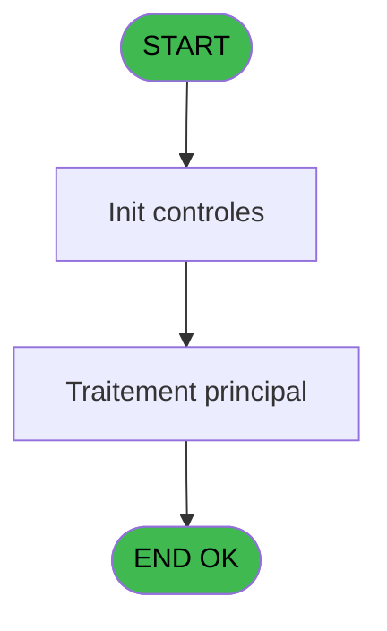
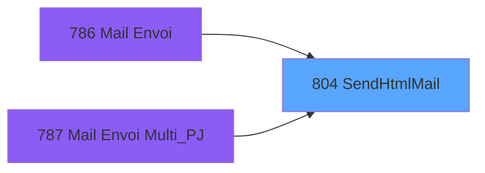

# REF IDE 804 - SendHtmlMail

> **Analyse**: Phases 1-4 2026-02-03 14:28 -> 14:28 (14s) | Assemblage 14:28
> **Pipeline**: V7.2 Enrichi
> **Structure**: 4 onglets (Resume | Ecrans | Donnees | Connexions)

<!-- TAB:Resume -->

## 1. FICHE D'IDENTITE

| Attribut | Valeur |
|----------|--------|
| Projet | REF |
| IDE Position | 804 |
| Nom Programme | SendHtmlMail |
| Fichier source | `Prg_804.xml` |
| Dossier IDE | General |
| Taches | 3 (0 ecrans visibles) |
| Tables modifiees | 0 |
| Programmes appeles | 0 |

## 2. DESCRIPTION FONCTIONNELLE

**SendHtmlMail** assure la gestion complete de ce processus, accessible depuis [Mail Envoi (IDE 786)](REF-IDE-786.md), [Mail Envoi Multi_PJ (IDE 787)](REF-IDE-787.md).

Le flux de traitement s'organise en **3 blocs fonctionnels** :

- **Creation** (1 tache) : insertion d'enregistrements en base (mouvements, prestations)
- **Initialisation** (1 tache) : reinitialisation d'etats et de variables de travail
- **Traitement** (1 tache) : traitements metier divers

Detail : phases du traitement

#### Phase 1 : Traitement (1 tache)

- **804** - SendHtmlMail **[[ECRAN]](#ecran-t1)**

#### Phase 2 : Initialisation (1 tache)

- **804.1** - Init Params SMTP **[[ECRAN]](#ecran-t2)**

#### Phase 3 : Creation (1 tache)

- **804.2** - Create HTML

## 3. BLOCS FONCTIONNELS

### 3.1 Traitement (1 tache)

Traitements internes.

---

#### 804 - SendHtmlMail [[ECRAN]](#ecran-t1)

**Role** : Traitement : SendHtmlMail.
**Ecran** : 1499 x 470 DLU | [Voir mockup](#ecran-t1)

### 3.2 Initialisation (1 tache)

Reinitialisation d'etats et variables de travail.

---

#### 804.1 - Init Params SMTP [[ECRAN]](#ecran-t2)

**Role** : Reinitialisation : Init Params SMTP.
**Ecran** : 650 x 325 DLU | [Voir mockup](#ecran-t2)
**Variables liees** : J (v.SmtpServerName), K (v.SmtpServerPort), L (v.SmtpServerUserName), M (v.SmtpServerPassword)

### 3.3 Creation (1 tache)

Insertion de nouveaux enregistrements en base.

---

#### 804.2 - Create HTML

**Role** : Traitement : Create HTML.
**Variables liees** : I (v.MailHtmlCorp)

## 5. REGLES METIER

*(Aucune regle metier identifiee)*

## 6. CONTEXTE

- **Appele par**: [Mail Envoi (IDE 786)](REF-IDE-786.md), [Mail Envoi Multi_PJ (IDE 787)](REF-IDE-787.md)
- **Appelle**: 0 programmes | **Tables**: 1 (W:0 R:1 L:0) | **Taches**: 3 | **Expressions**: 2

<!-- TAB:Ecrans -->

## 8. ECRANS

*(Programme sans ecran visible)*

## 9. NAVIGATION

### 9.3 Structure hierarchique (3 taches)

| Position | Tache | Type | Dimensions | Bloc |
|----------|-------|------|------------|------|
| **804.1** | [**SendHtmlMail** (804)](#t1) [mockup](#ecran-t1) | - | 1499x470 | Traitement |
| **804.2** | [**Init Params SMTP** (804.1)](#t2) [mockup](#ecran-t2) | - | 650x325 | Initialisation |
| **804.3** | [**Create HTML** (804.2)](#t3) | - | - | Creation |

### 9.4 Algorigramme

> **Legende**: Vert = START/END OK | Rouge = END KO | Bleu = Decisions
> *Algorigramme auto-genere. Utiliser `/algorigramme` pour une synthese metier detaillee.*

<!-- TAB:Donnees -->

## 10. TABLES

### Tables utilisees (1)

| ID | Nom | Description | Type | R | W | L | Usages |
|----|-----|-------------|------|---|---|---|--------|
| 861 | param_gen_mail |  | DB | R |   |   | 1 |

### Colonnes par table (1 / 1 tables avec colonnes identifiees)

Table 861 - param_gen_mail (R) - 1 usages

| Lettre | Variable | Acces | Type |
|--------|----------|-------|------|
| A | P.i.MailTo | R | Unicode |
| B | P.i.MailFrom | R | Unicode |
| D | P.i.MailSubject | R | Unicode |
| E | P.i.MailContent | R | Unicode |
| I | v.MailHtmlCorp | R | Blob |

## 11. VARIABLES

### 11.1 Parametres entrants (8)

Variables recues du programme appelant ([Mail Envoi (IDE 786)](REF-IDE-786.md)).

| Lettre | Nom | Type | Usage dans |
|--------|-----|------|-----------|
| A | P.i.MailTo | Unicode | - |
| B | P.i.MailFrom | Unicode | - |
| C | P.i.CopyCC | Unicode | - |
| D | P.i.MailSubject | Unicode | - |
| E | P.i.MailContent | Unicode | - |
| F | P.i.AttachedFile | Unicode | - |
| G | P.i.o.Success | Logical | - |
| H | P.i.o.ErrorMessage | Unicode | - |

### 11.2 Variables de session (5)

Variables persistantes pendant toute la session.

| Lettre | Nom | Type | Usage dans |
|--------|-----|------|-----------|
| I | v.MailHtmlCorp | Blob | - |
| J | v.SmtpServerName | Unicode | - |
| K | v.SmtpServerPort | Numeric | - |
| L | v.SmtpServerUserName | Unicode | - |
| M | v.SmtpServerPassword | Unicode | - |

## 12. EXPRESSIONS

**2 / 2 expressions decodees (100%)**

### 12.1 Repartition par type

| Type | Expressions | Regles |
|------|-------------|--------|
| FORMAT | 2 | 0 |

### 12.2 Expressions cles par type

#### FORMAT (2 expressions)

| Type | IDE | Expression | Regle |
|------|-----|------------|-------|
| FORMAT | 2 | `File2Blb(RepStr(Translate('%env%'),'env','temp')&'mail.htm')` | - |
| FORMAT | 1 | `FileDelete(RepStr(Translate('%env%'),'env','temp')&'mail.htm')` | - |

<!-- TAB:Connexions -->

## 13. GRAPHE D'APPELS

### 13.1 Chaine depuis Main (Callers)

Main -> ... -> [Mail Envoi (IDE 786)](REF-IDE-786.md) -> **SendHtmlMail (IDE 804)**

Main -> ... -> [Mail Envoi Multi_PJ (IDE 787)](REF-IDE-787.md) -> **SendHtmlMail (IDE 804)**

### 13.2 Callers

| IDE | Nom Programme | Nb Appels |
|-----|---------------|-----------|
| [786](REF-IDE-786.md) | Mail Envoi | 1 |
| [787](REF-IDE-787.md) | Mail Envoi Multi_PJ | 1 |

### 13.3 Callees (programmes appeles)

### 13.4 Detail Callees avec contexte

| IDE | Nom Programme | Appels | Contexte |
|-----|---------------|--------|----------|
| - | (aucun) | - | - |

## 14. RECOMMANDATIONS MIGRATION

### 14.1 Profil du programme

| Metrique | Valeur | Impact migration |
|----------|--------|-----------------|
| Lignes de logique | 55 | Programme compact |
| Expressions | 2 | Peu de logique |
| Tables WRITE | 0 | Impact faible |
| Sous-programmes | 0 | Peu de dependances |
| Ecrans visibles | 0 | Ecran unique ou traitement batch |
| Code desactive | 0% (0 / 55) | Code sain |
| Regles metier | 0 | Pas de regle identifiee |

### 14.2 Plan de migration par bloc

#### Traitement (1 tache: 1 ecran, 0 traitement)

- **Strategie** : 1 composant(s) UI (Razor/React) avec formulaires et validation.
- Decomposer les taches en services unitaires testables.

#### Initialisation (1 tache: 1 ecran, 0 traitement)

- **Strategie** : Constructeur/methode `InitAsync()` dans l'orchestrateur.

#### Creation (1 tache: 0 ecran, 1 traitement)

- **Strategie** : Repository pattern avec Entity Framework Core.
- Insertion via `IRepository<T>.CreateAsync()`

### 14.3 Dependances critiques

| Dependance | Type | Appels | Impact |
|------------|------|--------|--------|

---
*Spec DETAILED generee par Pipeline V7.2 - 2026-02-03 14:28*
