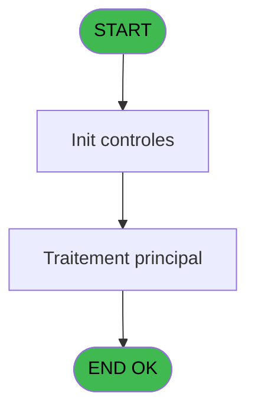

# REF IDE 805 - Initi Sale label ds PKG Price

> **Analyse**: Phases 1-4 2026-02-03 14:28 -> 14:28 (15s) | Assemblage 14:28
> **Pipeline**: V7.2 Enrichi
> **Structure**: 4 onglets (Resume | Ecrans | Donnees | Connexions)

<!-- TAB:Resume -->

## 1. FICHE D'IDENTITE

| Attribut | Valeur |
|----------|--------|
| Projet | REF |
| IDE Position | 805 |
| Nom Programme | Initi Sale label ds PKG Price |
| Fichier source | `Prg_805.xml` |
| Dossier IDE | General |
| Taches | 4 (1 ecrans visibles) |
| Tables modifiees | 0 |
| Programmes appeles | 0 |
| :warning: Statut | **ORPHELIN_POTENTIEL** |

## 2. DESCRIPTION FONCTIONNELLE

**Initi Sale label ds PKG Price** assure la gestion complete de ce processus.

Le flux de traitement s'organise en **2 blocs fonctionnels** :

- **Traitement** (3 taches) : traitements metier divers
- **Initialisation** (1 tache) : reinitialisation d'etats et de variables de travail

Detail : phases du traitement

#### Phase 1 : Initialisation (1 tache)

- **805** - Réinit Sale label ds PKG Price **[[ECRAN]](#ecran-t1)**

#### Phase 2 : Traitement (3 taches)

- **805.1** - Lecture LOCK_TIMEOUT **[[ECRAN]](#ecran-t2)**
- **805.2** - Màj libellé commercial
- **805.3** - Màj libellé commercial

## 3. BLOCS FONCTIONNELS

### 3.1 Initialisation (1 tache)

Reinitialisation d'etats et variables de travail.

---

#### 805 - Réinit Sale label ds PKG Price [[ECRAN]](#ecran-t1)

**Role** : Reinitialisation : Réinit Sale label ds PKG Price.
**Ecran** : 186 x 29 DLU (MDI) | [Voir mockup](#ecran-t1)

### 3.2 Traitement (3 taches)

Traitements internes.

---

#### 805.1 - Lecture LOCK_TIMEOUT [[ECRAN]](#ecran-t2)

**Role** : Traitement : Lecture LOCK_TIMEOUT.
**Ecran** : 123 x 195 DLU | [Voir mockup](#ecran-t2)

---

#### 805.2 - Màj libellé commercial

**Role** : Traitement : Màj libellé commercial.

---

#### 805.3 - Màj libellé commercial

**Role** : Traitement : Màj libellé commercial.

## 5. REGLES METIER

*(Aucune regle metier identifiee)*

## 6. CONTEXTE

- **Appele par**: (aucun)
- **Appelle**: 0 programmes | **Tables**: 0 (W:0 R:0 L:0) | **Taches**: 4 | **Expressions**: 2

<!-- TAB:Ecrans -->

## 8. ECRANS

### 8.1 Forms visibles (1 / 4)

| # | Position | Tache | Nom | Type | Largeur | Hauteur | Bloc |
|---|----------|-------|-----|------|---------|---------|------|
| 1 | 805 | 805 | Réinit Sale label ds PKG Price | MDI | 186 | 29 | Initialisation |

### 8.2 Mockups Ecrans

---

#### 805 - Réinit Sale label ds PKG Price
**Tache** : [805](#t1) | **Type** : MDI | **Dimensions** : 186 x 29 DLU
**Bloc** : Initialisation | **Titre IDE** : Réinit Sale label ds PKG Price

<!-- FORM-DATA:
{
    "width":  186,
    "vFactor":  8,
    "type":  "MDI",
    "hFactor":  4,
    "controls":  [
                     {
                         "x":  17,
                         "type":  "label",
                         "var":  "",
                         "y":  6,
                         "w":  152,
                         "fmt":  "",
                         "name":  "",
                         "h":  16,
                         "color":  "",
                         "text":  "Traitement en cours ...",
                         "parent":  null
                     }
                 ],
    "taskId":  "805",
    "height":  29
}
-->

## 9. NAVIGATION

Ecran unique: **Réinit Sale label ds PKG Price**

### 9.3 Structure hierarchique (4 taches)

| Position | Tache | Type | Dimensions | Bloc |
|----------|-------|------|------------|------|
| **805.1** | [**Réinit Sale label ds PKG Price** (805)](#t1) [mockup](#ecran-t1) | MDI | 186x29 | Initialisation |
| **805.2** | [**Lecture LOCK_TIMEOUT** (805.1)](#t2) [mockup](#ecran-t2) | - | 123x195 | Traitement |
| 805.2.1 | [Màj libellé commercial (805.2)](#t3) | - | - | |
| 805.2.2 | [Màj libellé commercial (805.3)](#t4) | - | - | |

### 9.4 Algorigramme

> **Legende**: Vert = START/END OK | Rouge = END KO | Bleu = Decisions
> *Algorigramme auto-genere. Utiliser `/algorigramme` pour une synthese metier detaillee.*

<!-- TAB:Donnees -->

## 10. TABLES

### Tables utilisees (0)

| ID | Nom | Description | Type | R | W | L | Usages |
|----|-----|-------------|------|---|---|---|--------|

### Colonnes par table (0 / 0 tables avec colonnes identifiees)

## 11. VARIABLES

### 11.1 Parametres entrants (4)

Variables recues en parametre.

| Lettre | Nom | Type | Usage dans |
|--------|-----|------|-----------|
| A | P.i.Service | Alpha | - |
| B | P.i.Cat | Numeric | - |
| C | P.i.Sub-Cat | Numeric | - |
| D | P.i.Copy cat/subcat ? | Logical | - |

### 11.2 Variables de session (1)

Variables persistantes pendant toute la session.

| Lettre | Nom | Type | Usage dans |
|--------|-----|------|-----------|
| E | v.Lock timeout | Numeric | [805.1](#t2) |

## 12. EXPRESSIONS

**2 / 2 expressions decodees (100%)**

### 12.1 Repartition par type

| Type | Expressions | Regles |
|------|-------------|--------|
| CONSTANTE | 1 | 0 |
| OTHER | 1 | 0 |

### 12.2 Expressions cles par type

#### CONSTANTE (1 expressions)

| Type | IDE | Expression | Regle |
|------|-----|------------|-------|
| CONSTANTE | 1 | `1` | - |

#### OTHER (1 expressions)

| Type | IDE | Expression | Regle |
|------|-----|------------|-------|
| OTHER | 2 | `v.Lock timeout [E]` | - |

<!-- TAB:Connexions -->

## 13. GRAPHE D'APPELS

### 13.1 Chaine depuis Main (Callers)

**Chemin**: (pas de callers directs)

### 13.2 Callers

| IDE | Nom Programme | Nb Appels |
|-----|---------------|-----------|
| - | (aucun) | - |

### 13.3 Callees (programmes appeles)

### 13.4 Detail Callees avec contexte

| IDE | Nom Programme | Appels | Contexte |
|-----|---------------|--------|----------|
| - | (aucun) | - | - |

## 14. RECOMMANDATIONS MIGRATION

### 14.1 Profil du programme

| Metrique | Valeur | Impact migration |
|----------|--------|-----------------|
| Lignes de logique | 26 | Programme compact |
| Expressions | 2 | Peu de logique |
| Tables WRITE | 0 | Impact faible |
| Sous-programmes | 0 | Peu de dependances |
| Ecrans visibles | 1 | Ecran unique ou traitement batch |
| Code desactive | 0% (0 / 26) | Code sain |
| Regles metier | 0 | Pas de regle identifiee |

### 14.2 Plan de migration par bloc

#### Initialisation (1 tache: 1 ecran, 0 traitement)

- **Strategie** : Constructeur/methode `InitAsync()` dans l'orchestrateur.

#### Traitement (3 taches: 1 ecran, 2 traitements)

- **Strategie** : Orchestrateur avec 1 ecrans (Razor/React) et 2 traitements backend (services).
- Les ecrans deviennent des composants UI, les traitements invisibles deviennent des services injectables.
- Decomposer les taches en services unitaires testables.

### 14.3 Dependances critiques

| Dependance | Type | Appels | Impact |
|------------|------|--------|--------|

---
*Spec DETAILED generee par Pipeline V7.2 - 2026-02-03 14:28*
