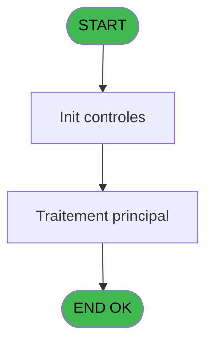

# REF IDE 809 - Gestion Statut Equipement *SAV

> **Analyse**: Phases 1-4 2026-02-03 14:29 -> 14:30 (15s) | Assemblage 14:30
> **Pipeline**: V7.2 Enrichi
> **Structure**: 4 onglets (Resume | Ecrans | Donnees | Connexions)

<!-- TAB:Resume -->

## 1. FICHE D'IDENTITE

| Attribut | Valeur |
|----------|--------|
| Projet | REF |
| IDE Position | 809 |
| Nom Programme | Gestion Statut Equipement *SAV |
| Fichier source | `Prg_809.xml` |
| Dossier IDE | General |
| Taches | 4 (1 ecrans visibles) |
| Tables modifiees | 0 |
| Programmes appeles | 0 |
| :warning: Statut | **ORPHELIN_POTENTIEL** |

## 2. DESCRIPTION FONCTIONNELLE

**Gestion Statut Equipement *SAV** assure la gestion complete de ce processus.

Le flux de traitement s'organise en **2 blocs fonctionnels** :

- **Traitement** (3 taches) : traitements metier divers
- **Calcul** (1 tache) : calculs de montants, stocks ou compteurs

Detail : phases du traitement

#### Phase 1 : Calcul (1 tache)

- **809** - Equipement Status Calculation **[[ECRAN]](#ecran-t1)**

#### Phase 2 : Traitement (3 taches)

- **809.1** - Liste des equipements à modifi **[[ECRAN]](#ecran-t2)**
- **809.1.1** - Modification des statuts
- **809.1.2** - Recup date_In et date_out **[[ECRAN]](#ecran-t4)**

## 3. BLOCS FONCTIONNELS

### 3.1 Calcul (1 tache)

Calculs metier : montants, stocks, compteurs.

---

#### 809 - Equipement Status Calculation [[ECRAN]](#ecran-t1)

**Role** : Calcul : Equipement Status Calculation.
**Ecran** : 313 x 174 DLU | [Voir mockup](#ecran-t1)
**Variables liees** : E (status Equip), F (status Loc), J (V_Ligne d'equipement modif CSV), M (v_new_status_equipe)

### 3.2 Traitement (3 taches)

Traitements internes.

---

#### 809.1 - Liste des equipements à modifi [[ECRAN]](#ecran-t2)

**Role** : Traitement : Liste des equipements à modifi.
**Ecran** : 954 x 251 DLU | [Voir mockup](#ecran-t2)

---

#### 809.1.1 - Modification des statuts

**Role** : Traitement : Modification des statuts.

---

#### 809.1.2 - Recup date_In et date_out [[ECRAN]](#ecran-t4)

**Role** : Consultation/chargement : Recup date_In et date_out.
**Ecran** : 701 x 0 DLU | [Voir mockup](#ecran-t4)
**Variables liees** : H (date_in), I (date_out), K (V_date_in), L (V_date_out)

## 5. REGLES METIER

*(Aucune regle metier identifiee)*

## 6. CONTEXTE

- **Appele par**: (aucun)
- **Appelle**: 0 programmes | **Tables**: 0 (W:0 R:0 L:0) | **Taches**: 4 | **Expressions**: 5

<!-- TAB:Ecrans -->

## 8. ECRANS

### 8.1 Forms visibles (1 / 4)

| # | Position | Tache | Nom | Type | Largeur | Hauteur | Bloc |
|---|----------|-------|-----|------|---------|---------|------|
| 1 | 809 | 809 | Equipement Status Calculation | Type0 | 313 | 174 | Calcul |

### 8.2 Mockups Ecrans

---

#### 809 - Equipement Status Calculation
**Tache** : [809](#t1) | **Type** : Type0 | **Dimensions** : 313 x 174 DLU
**Bloc** : Calcul | **Titre IDE** : Equipement Status Calculation

<!-- FORM-DATA:
{
    "width":  313,
    "vFactor":  8,
    "type":  "Type0",
    "hFactor":  4,
    "controls":  [
                     {
                         "x":  12,
                         "type":  "label",
                         "var":  "",
                         "y":  59,
                         "w":  191,
                         "fmt":  "",
                         "name":  "",
                         "h":  10,
                         "color":  "187",
                         "text":  "Select the type of the summary you want",
                         "parent":  null
                     },
                     {
                         "x":  12,
                         "type":  "label",
                         "var":  "",
                         "y":  95,
                         "w":  48,
                         "fmt":  "",
                         "name":  "",
                         "h":  16,
                         "color":  "183",
                         "text":  "Type",
                         "parent":  null
                     },
                     {
                         "x":  0,
                         "type":  "label",
                         "var":  "",
                         "y":  0,
                         "w":  312,
                         "fmt":  "",
                         "name":  "",
                         "h":  42,
                         "color":  "182",
                         "text":  "",
                         "parent":  null
                     },
                     {
                         "x":  12,
                         "type":  "label",
                         "var":  "",
                         "y":  16,
                         "w":  243,
                         "fmt":  "",
                         "name":  "",
                         "h":  10,
                         "color":  "186",
                         "text":  "Equipement Status Calculation",
                         "parent":  3
                     },
                     {
                         "x":  0,
                         "type":  "label",
                         "var":  "",
                         "y":  139,
                         "w":  312,
                         "fmt":  "",
                         "name":  "",
                         "h":  34,
                         "color":  "6",
                         "text":  "",
                         "parent":  null
                     },
                     {
                         "x":  262,
                         "type":  "image",
                         "var":  "",
                         "y":  4,
                         "w":  48,
                         "fmt":  "",
                         "name":  "",
                         "h":  37,
                         "color":  "",
                         "text":  "",
                         "parent":  3
                     },
                     {
                         "x":  130,
                         "type":  "combobox",
                         "var":  "",
                         "y":  95,
                         "w":  73,
                         "fmt":  "",
                         "name":  "V_format recapitulatif",
                         "h":  16,
                         "color":  "",
                         "text":  "PDF, CSV",
                         "parent":  null
                     },
                     {
                         "x":  174,
                         "type":  "button",
                         "var":  "",
                         "y":  144,
                         "w":  68,
                         "fmt":  "\u0026Print",
                         "name":  "",
                         "h":  28,
                         "color":  "",
                         "text":  "",
                         "parent":  null
                     },
                     {
                         "x":  242,
                         "type":  "button",
                         "var":  "",
                         "y":  144,
                         "w":  68,
                         "fmt":  "\u0026Exit",
                         "name":  "",
                         "h":  28,
                         "color":  "",
                         "text":  "",
                         "parent":  null
                     }
                 ],
    "taskId":  "809",
    "height":  174
}
-->

<strong>Champs : 1 champs</strong>

| Pos (x,y) | Nom | Variable | Type |
|-----------|-----|----------|------|
| 130,95 | V_format recapitulatif | - | combobox |

<strong>Boutons : 2 boutons</strong>

| Bouton | Pos (x,y) | Action |
|--------|-----------|--------|
| Print | 174,144 | Lance l'impression |
| Exit | 242,144 | Quitte le programme |

## 9. NAVIGATION

Ecran unique: **Equipement Status Calculation**

### 9.3 Structure hierarchique (4 taches)

| Position | Tache | Type | Dimensions | Bloc |
|----------|-------|------|------------|------|
| **809.1** | [**Equipement Status Calculation** (809)](#t1) [mockup](#ecran-t1) | - | 313x174 | Calcul |
| **809.2** | [**Liste des equipements à modifi** (809.1)](#t2) [mockup](#ecran-t2) | - | 954x251 | Traitement |
| 809.2.1 | [Modification des statuts (809.1.1)](#t3) | - | - | |
| 809.2.2 | [Recup date_In et date_out (809.1.2)](#t4) [mockup](#ecran-t4) | - | 701x0 | |

### 9.4 Algorigramme

> **Legende**: Vert = START/END OK | Rouge = END KO | Bleu = Decisions
> *Algorigramme auto-genere. Utiliser `/algorigramme` pour une synthese metier detaillee.*

<!-- TAB:Donnees -->

## 10. TABLES

### Tables utilisees (0)

| ID | Nom | Description | Type | R | W | L | Usages |
|----|-----|-------------|------|---|---|---|--------|

### Colonnes par table (0 / 0 tables avec colonnes identifiees)

## 11. VARIABLES

### 11.1 Autres (13)

Variables diverses.

| Lettre | Nom | Type | Usage dans |
|--------|-----|------|-----------|
| A | V_format recapitulatif | Unicode | 1x refs |
| B | V_Entête_CSV | Unicode | - |
| C | V_Club_Excel_separator | Unicode | - |
| D | model_name | Unicode | - |
| E | status Equip | Unicode | - |
| F | status Loc | Unicode | - |
| G | date_creation | Alpha | - |
| H | date_in | Alpha | - |
| I | date_out | Alpha | - |
| J | V_Ligne d'equipement modif CSV | Unicode | - |
| K | V_date_in | Alpha | - |
| L | V_date_out | Alpha | - |
| M | v_new_status_equipe | Unicode | - |

## 12. EXPRESSIONS

**5 / 5 expressions decodees (100%)**

### 12.1 Repartition par type

| Type | Expressions | Regles |
|------|-------------|--------|
| CONSTANTE | 1 | 0 |
| FORMAT | 1 | 0 |
| OTHER | 3 | 0 |

### 12.2 Expressions cles par type

#### CONSTANTE (1 expressions)

| Type | IDE | Expression | Regle |
|------|-----|------------|-------|
| CONSTANTE | 1 | `'PDF'` | - |

#### FORMAT (1 expressions)

| Type | IDE | Expression | Regle |
|------|-----|------------|-------|
| FORMAT | 5 | `Trim(Translate('%club_exportdata%'))&Trim(DStr(Date(),'DDMMYYYY'))&'_Gestion_Statut_Equipement'&'.'&V_format recapitulatif [A]` | - |

#### OTHER (3 expressions)

| Type | IDE | Expression | Regle |
|------|-----|------------|-------|
| OTHER | 4 | `SetCrsr(1)` | - |
| OTHER | 3 | `SetCrsr(2)` | - |
| OTHER | 2 | `Translate ('%club_excel_separator%')` | - |

<!-- TAB:Connexions -->

## 13. GRAPHE D'APPELS

### 13.1 Chaine depuis Main (Callers)

**Chemin**: (pas de callers directs)

### 13.2 Callers

| IDE | Nom Programme | Nb Appels |
|-----|---------------|-----------|
| - | (aucun) | - |

### 13.3 Callees (programmes appeles)

### 13.4 Detail Callees avec contexte

| IDE | Nom Programme | Appels | Contexte |
|-----|---------------|--------|----------|
| - | (aucun) | - | - |

## 14. RECOMMANDATIONS MIGRATION

### 14.1 Profil du programme

| Metrique | Valeur | Impact migration |
|----------|--------|-----------------|
| Lignes de logique | 72 | Programme compact |
| Expressions | 5 | Peu de logique |
| Tables WRITE | 0 | Impact faible |
| Sous-programmes | 0 | Peu de dependances |
| Ecrans visibles | 1 | Ecran unique ou traitement batch |
| Code desactive | 0% (0 / 72) | Code sain |
| Regles metier | 0 | Pas de regle identifiee |

### 14.2 Plan de migration par bloc

#### Calcul (1 tache: 1 ecran, 0 traitement)

- **Strategie** : Services de calcul purs (Domain Services).
- Migrer la logique de calcul (stock, compteurs, montants)

#### Traitement (3 taches: 2 ecrans, 1 traitement)

- **Strategie** : Orchestrateur avec 2 ecrans (Razor/React) et 1 traitements backend (services).
- Les ecrans deviennent des composants UI, les traitements invisibles deviennent des services injectables.
- Decomposer les taches en services unitaires testables.

### 14.3 Dependances critiques

| Dependance | Type | Appels | Impact |
|------------|------|--------|--------|

---
*Spec DETAILED generee par Pipeline V7.2 - 2026-02-03 14:30*
