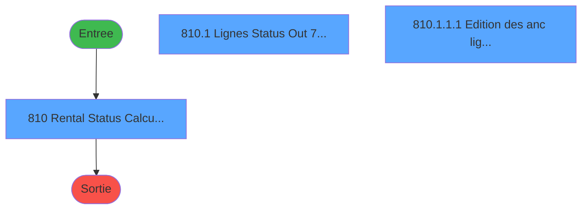
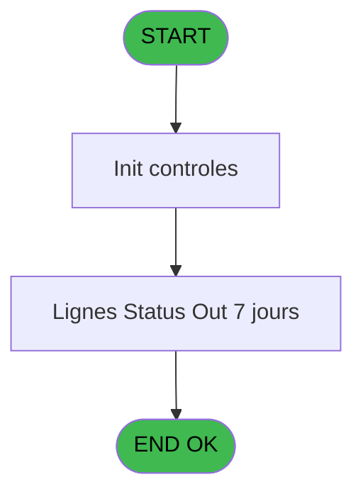

# REF IDE 810 - Gestion Statut Location *SAV

> **Analyse**: Phases 1-4 2026-02-03 14:30 -> 14:30 (15s) | Assemblage 14:30
> **Pipeline**: V7.2 Enrichi
> **Structure**: 4 onglets (Resume | Ecrans | Donnees | Connexions)

<!-- TAB:Resume -->

## 1. FICHE D'IDENTITE

| Attribut | Valeur |
|----------|--------|
| Projet | REF |
| IDE Position | 810 |
| Nom Programme | Gestion Statut Location *SAV |
| Fichier source | `Prg_810.xml` |
| Dossier IDE | General |
| Taches | 8 (3 ecrans visibles) |
| Tables modifiees | 0 |
| Programmes appeles | 0 |
| :warning: Statut | **ORPHELIN_POTENTIEL** |

## 2. DESCRIPTION FONCTIONNELLE

**Gestion Statut Location *SAV** assure la gestion complete de ce processus.

Le flux de traitement s'organise en **3 blocs fonctionnels** :

- **Traitement** (6 taches) : traitements metier divers
- **Impression** (1 tache) : generation de tickets et documents
- **Calcul** (1 tache) : calculs de montants, stocks ou compteurs

Detail : phases du traitement

#### Phase 1 : Calcul (1 tache)

- **810** - Rental Status Calculation **[[ECRAN]](#ecran-t1)**

#### Phase 2 : Traitement (6 taches)

- **810.1** - Lignes Status Out 7 jours **[[ECRAN]](#ecran-t2)**
- **810.1.1** - Ligne en statut OUT
- **810.1.1.2** - Ancien LOC OUT en IN
- **810.1.2** - Liste Gm purgés Status à Out **[[ECRAN]](#ecran-t6)**
- **810.1.2.1** - Mise à jour Status à IN Locat
- **810.1.2.2** - Mise à jour Statut à IN Equip

#### Phase 3 : Impression (1 tache)

- **810.1.1.1** - Edition des anc lignes Out>In **[[ECRAN]](#ecran-t4)**

## 3. BLOCS FONCTIONNELS

### 3.1 Calcul (1 tache)

Calculs metier : montants, stocks, compteurs.

---

#### 810 - Rental Status Calculation [[ECRAN]](#ecran-t1)

**Role** : Calcul : Rental Status Calculation.
**Ecran** : 313 x 174 DLU | [Voir mockup](#ecran-t1)
**Variables liees** : I (status_loc), J (status_equi), N (status_equip)

### 3.2 Traitement (6 taches)

Traitements internes.

---

#### 810.1 - Lignes Status Out 7 jours [[ECRAN]](#ecran-t2)

**Role** : Traitement : Lignes Status Out 7 jours.
**Ecran** : 992 x 429 DLU | [Voir mockup](#ecran-t2)
**Variables liees** : I (status_loc), J (status_equi), N (status_equip)

---

#### 810.1.1 - Ligne en statut OUT

**Role** : Traitement : Ligne en statut OUT.
**Variables liees** : D (V_Ancien Statut loc), E (V_Ancien Statut Equip), F (V_Ligne CSV OUt 7j), M (V_Anc_ligne à Out), O (V_Ligne GM purgé CSV)

---

#### 810.1.1.2 - Ancien LOC OUT en IN

**Role** : Traitement : Ancien LOC OUT en IN.
**Variables liees** : D (V_Ancien Statut loc), E (V_Ancien Statut Equip)

---

#### 810.1.2 - Liste Gm purgés Status à Out [[ECRAN]](#ecran-t6)

**Role** : Traitement : Liste Gm purgés Status à Out.
**Ecran** : 743 x 331 DLU | [Voir mockup](#ecran-t6)
**Variables liees** : I (status_loc), J (status_equi), N (status_equip)

---

#### 810.1.2.1 - Mise à jour Status à IN Locat

**Role** : Traitement : Mise à jour Status à IN Locat.
**Variables liees** : I (status_loc), J (status_equi), N (status_equip)

---

#### 810.1.2.2 - Mise à jour Statut à IN Equip

**Role** : Traitement : Mise à jour Statut à IN Equip.
**Variables liees** : D (V_Ancien Statut loc), E (V_Ancien Statut Equip), N (status_equip)

### 3.3 Impression (1 tache)

Generation des documents et tickets.

---

#### 810.1.1.1 - Edition des anc lignes Out>In [[ECRAN]](#ecran-t4)

**Role** : Generation du document : Edition des anc lignes Out>In.
**Ecran** : 879 x 195 DLU | [Voir mockup](#ecran-t4)

## 5. REGLES METIER

*(Aucune regle metier identifiee)*

## 6. CONTEXTE

- **Appele par**: (aucun)
- **Appelle**: 0 programmes | **Tables**: 8 (W:0 R:1 L:7) | **Taches**: 8 | **Expressions**: 3

<!-- TAB:Ecrans -->

## 8. ECRANS

### 8.1 Forms visibles (3 / 8)

| # | Position | Tache | Nom | Type | Largeur | Hauteur | Bloc |
|---|----------|-------|-----|------|---------|---------|------|
| 1 | 810 | 810 | Rental Status Calculation | Type0 | 313 | 174 | Calcul |
| 2 | 810.1 | 810.1 | Lignes Status Out 7 jours | Type0 | 992 | 429 | Traitement |
| 3 | 810.1.1.1 | 810.1.1.1 | Edition des anc lignes Out>In | Type0 | 879 | 195 | Impression |

### 8.2 Mockups Ecrans

---

#### 810 - Rental Status Calculation
**Tache** : [810](#t1) | **Type** : Type0 | **Dimensions** : 313 x 174 DLU
**Bloc** : Calcul | **Titre IDE** : Rental Status Calculation

<!-- FORM-DATA:
{
    "width":  313,
    "vFactor":  8,
    "type":  "Type0",
    "hFactor":  4,
    "controls":  [
                     {
                         "x":  12,
                         "type":  "label",
                         "var":  "",
                         "y":  59,
                         "w":  191,
                         "fmt":  "",
                         "name":  "",
                         "h":  10,
                         "color":  "187",
                         "text":  "Select the type of the summary you want",
                         "parent":  null
                     },
                     {
                         "x":  12,
                         "type":  "label",
                         "var":  "",
                         "y":  95,
                         "w":  48,
                         "fmt":  "",
                         "name":  "",
                         "h":  16,
                         "color":  "183",
                         "text":  "Type",
                         "parent":  null
                     },
                     {
                         "x":  0,
                         "type":  "label",
                         "var":  "",
                         "y":  0,
                         "w":  312,
                         "fmt":  "",
                         "name":  "",
                         "h":  42,
                         "color":  "182",
                         "text":  "",
                         "parent":  null
                     },
                     {
                         "x":  12,
                         "type":  "label",
                         "var":  "",
                         "y":  16,
                         "w":  243,
                         "fmt":  "",
                         "name":  "",
                         "h":  10,
                         "color":  "186",
                         "text":  "Rental Status Calculation",
                         "parent":  3
                     },
                     {
                         "x":  0,
                         "type":  "label",
                         "var":  "",
                         "y":  139,
                         "w":  312,
                         "fmt":  "",
                         "name":  "",
                         "h":  34,
                         "color":  "6",
                         "text":  "",
                         "parent":  null
                     },
                     {
                         "x":  262,
                         "type":  "image",
                         "var":  "",
                         "y":  4,
                         "w":  48,
                         "fmt":  "",
                         "name":  "",
                         "h":  37,
                         "color":  "",
                         "text":  "",
                         "parent":  3
                     },
                     {
                         "x":  130,
                         "type":  "combobox",
                         "var":  "",
                         "y":  95,
                         "w":  73,
                         "fmt":  "",
                         "name":  "V_format recapitulatif",
                         "h":  16,
                         "color":  "",
                         "text":  "PDF, CSV",
                         "parent":  null
                     },
                     {
                         "x":  174,
                         "type":  "button",
                         "var":  "",
                         "y":  144,
                         "w":  68,
                         "fmt":  "\u0026Print",
                         "name":  "",
                         "h":  28,
                         "color":  "",
                         "text":  "",
                         "parent":  null
                     },
                     {
                         "x":  242,
                         "type":  "button",
                         "var":  "",
                         "y":  144,
                         "w":  68,
                         "fmt":  "\u0026Exit",
                         "name":  "",
                         "h":  28,
                         "color":  "",
                         "text":  "",
                         "parent":  null
                     }
                 ],
    "taskId":  "810",
    "height":  174
}
-->

<strong>Champs : 1 champs</strong>

| Pos (x,y) | Nom | Variable | Type |
|-----------|-----|----------|------|
| 130,95 | V_format recapitulatif | - | combobox |

<strong>Boutons : 2 boutons</strong>

| Bouton | Pos (x,y) | Action |
|--------|-----------|--------|
| Print | 174,144 | Lance l'impression |
| Exit | 242,144 | Quitte le programme |

---

#### 810.1 - Lignes Status Out 7 jours
**Tache** : [810.1](#t2) | **Type** : Type0 | **Dimensions** : 992 x 429 DLU
**Bloc** : Traitement | **Titre IDE** : Lignes Status Out 7 jours

<!-- FORM-DATA:
{
    "width":  992,
    "vFactor":  8,
    "type":  "Type0",
    "hFactor":  4,
    "controls":  [
                     {
                         "x":  0,
                         "type":  "label",
                         "var":  "",
                         "y":  0,
                         "w":  991,
                         "fmt":  "",
                         "name":  "",
                         "h":  42,
                         "color":  "189",
                         "text":  "",
                         "parent":  null
                     },
                     {
                         "x":  177,
                         "type":  "label",
                         "var":  "",
                         "y":  14,
                         "w":  301,
                         "fmt":  "",
                         "name":  "",
                         "h":  14,
                         "color":  "188",
                         "text":  "RENTAL STATUS CALCULATION",
                         "parent":  1
                     },
                     {
                         "x":  90,
                         "type":  "table",
                         "var":  "",
                         "name":  "",
                         "titleH":  24,
                         "color":  "110",
                         "w":  768,
                         "y":  50,
                         "fmt":  "",
                         "parent":  null,
                         "text":  "",
                         "rowH":  28,
                         "h":  290,
                         "cols":  [
                                      {
                                          "title":  "Equipement Id",
                                          "layer":  1,
                                          "w":  84
                                      },
                                      {
                                          "title":  "Manufacturer",
                                          "layer":  2,
                                          "w":  85
                                      },
                                      {
                                          "title":  "Model",
                                          "layer":  3,
                                          "w":  107
                                      },
                                      {
                                          "title":  "Prénom et Nom GM dernière location",
                                          "layer":  4,
                                          "w":  120
                                      },
                                      {
                                          "title":  "N° de chambre",
                                          "layer":  5,
                                          "w":  80
                                      },
                                      {
                                          "title":  "Statut location",
                                          "layer":  6,
                                          "w":  72
                                      },
                                      {
                                          "title":  "Statut équipement",
                                          "layer":  7,
                                          "w":  72
                                      },
                                      {
                                          "title":  "Date In",
                                          "layer":  8,
                                          "w":  72
                                      },
                                      {
                                          "title":  "Date Out",
                                          "layer":  9,
                                          "w":  72
                                      }
                                  ],
                         "rows":  9
                     },
                     {
                         "x":  0,
                         "type":  "label",
                         "var":  "",
                         "y":  396,
                         "w":  991,
                         "fmt":  "",
                         "name":  "",
                         "h":  33,
                         "color":  "189",
                         "text":  "",
                         "parent":  null
                     },
                     {
                         "x":  944,
                         "type":  "image",
                         "var":  "",
                         "y":  6,
                         "w":  48,
                         "fmt":  "",
                         "name":  "",
                         "h":  35,
                         "color":  "",
                         "text":  "",
                         "parent":  1
                     },
                     {
                         "x":  480,
                         "type":  "edit",
                         "var":  "",
                         "y":  13,
                         "w":  245,
                         "fmt":  "30",
                         "name":  "",
                         "h":  18,
                         "color":  "174",
                         "text":  "",
                         "parent":  1
                     },
                     {
                         "x":  93,
                         "type":  "edit",
                         "var":  "",
                         "y":  78,
                         "w":  78,
                         "fmt":  "8",
                         "name":  "equipment_id",
                         "h":  20,
                         "color":  "110",
                         "text":  "",
                         "parent":  5
                     },
                     {
                         "x":  182,
                         "type":  "edit",
                         "var":  "",
                         "y":  77,
                         "w":  71,
                         "fmt":  "",
                         "name":  "manufacturer_name",
                         "h":  20,
                         "color":  "110",
                         "text":  "",
                         "parent":  5
                     },
                     {
                         "x":  262,
                         "type":  "edit",
                         "var":  "",
                         "y":  77,
                         "w":  102,
                         "fmt":  "",
                         "name":  "model_name",
                         "h":  20,
                         "color":  "110",
                         "text":  "",
                         "parent":  5
                     },
                     {
                         "x":  370,
                         "type":  "edit",
                         "var":  "",
                         "y":  77,
                         "w":  112,
                         "fmt":  "30",
                         "name":  "gm_prenom",
                         "h":  20,
                         "color":  "110",
                         "text":  "",
                         "parent":  5
                     },
                     {
                         "x":  490,
                         "type":  "edit",
                         "var":  "",
                         "y":  77,
                         "w":  72,
                         "fmt":  "",
                         "name":  "heb_nom_logement",
                         "h":  20,
                         "color":  "110",
                         "text":  "",
                         "parent":  5
                     },
                     {
                         "x":  570,
                         "type":  "combobox",
                         "var":  "",
                         "y":  82,
                         "w":  56,
                         "fmt":  "",
                         "name":  "status_loc",
                         "h":  20,
                         "color":  "110",
                         "text":  "Out, In",
                         "parent":  5
                     },
                     {
                         "x":  643,
                         "type":  "combobox",
                         "var":  "",
                         "y":  82,
                         "w":  56,
                         "fmt":  "",
                         "name":  "status_equip",
                         "h":  20,
                         "color":  "110",
                         "text":  "",
                         "parent":  5
                     },
                     {
                         "x":  713,
                         "type":  "edit",
                         "var":  "",
                         "y":  77,
                         "w":  61,
                         "fmt":  "",
                         "name":  "date_in",
                         "h":  20,
                         "color":  "110",
                         "text":  "",
                         "parent":  5
                     },
                     {
                         "x":  786,
                         "type":  "edit",
                         "var":  "",
                         "y":  77,
                         "w":  61,
                         "fmt":  "",
                         "name":  "date_out",
                         "h":  20,
                         "color":  "110",
                         "text":  "",
                         "parent":  5
                     },
                     {
                         "x":  857,
                         "type":  "button",
                         "var":  "",
                         "y":  50,
                         "w":  45,
                         "fmt":  "ñ",
                         "name":  "",
                         "h":  146,
                         "color":  "",
                         "text":  "",
                         "parent":  null
                     },
                     {
                         "x":  857,
                         "type":  "button",
                         "var":  "",
                         "y":  196,
                         "w":  45,
                         "fmt":  "ò",
                         "name":  "",
                         "h":  145,
                         "color":  "",
                         "text":  "",
                         "parent":  null
                     },
                     {
                         "x":  694,
                         "type":  "button",
                         "var":  "",
                         "y":  401,
                         "w":  99,
                         "fmt":  "\u0026Cancel",
                         "name":  "",
                         "h":  28,
                         "color":  "",
                         "text":  "",
                         "parent":  26
                     },
                     {
                         "x":  792,
                         "type":  "button",
                         "var":  "",
                         "y":  401,
                         "w":  100,
                         "fmt":  "\u0026Validate",
                         "name":  "",
                         "h":  28,
                         "color":  "",
                         "text":  "",
                         "parent":  26
                     },
                     {
                         "x":  891,
                         "type":  "button",
                         "var":  "",
                         "y":  401,
                         "w":  99,
                         "fmt":  "\u0026Exit",
                         "name":  "",
                         "h":  28,
                         "color":  "",
                         "text":  "",
                         "parent":  26
                     }
                 ],
    "taskId":  "810.1",
    "height":  429
}
-->

<strong>Champs : 10 champs</strong>

| Pos (x,y) | Nom | Variable | Type |
|-----------|-----|----------|------|
| 480,13 | 30 | - | edit |
| 93,78 | equipment_id | - | edit |
| 182,77 | manufacturer_name | - | edit |
| 262,77 | model_name | - | edit |
| 370,77 | gm_prenom | - | edit |
| 490,77 | heb_nom_logement | - | edit |
| 570,82 | status_loc | - | combobox |
| 643,82 | status_equip | - | combobox |
| 713,77 | date_in | - | edit |
| 786,77 | date_out | - | edit |

<strong>Boutons : 5 boutons</strong>

| Bouton | Pos (x,y) | Action |
|--------|-----------|--------|
| ñ | 857,50 | Bouton fonctionnel |
| ò | 857,196 | Bouton fonctionnel |
| Cancel | 694,401 | Annule et retour au menu |
| Validate | 792,401 | Valide la saisie et enregistre |
| Exit | 891,401 | Quitte le programme |

---

#### 810.1.1.1 - Edition des anc lignes Out>In
**Tache** : [810.1.1.1](#t4) | **Type** : Type0 | **Dimensions** : 879 x 195 DLU
**Bloc** : Impression | **Titre IDE** : Edition des anc lignes Out>In

<!-- FORM-DATA:
{
    "width":  879,
    "vFactor":  8,
    "type":  "Type0",
    "hFactor":  4,
    "controls":  [
                     {
                         "x":  8,
                         "type":  "table",
                         "var":  "",
                         "name":  "",
                         "titleH":  12,
                         "color":  "",
                         "w":  857,
                         "y":  8,
                         "fmt":  "",
                         "parent":  null,
                         "text":  "",
                         "rowH":  13,
                         "h":  182,
                         "cols":  [
                                      {
                                          "title":  "equipment_id",
                                          "layer":  1,
                                          "w":  66
                                      },
                                      {
                                          "title":  "description",
                                          "layer":  2,
                                          "w":  178
                                      },
                                      {
                                          "title":  "manufacturer_name",
                                          "layer":  3,
                                          "w":  122
                                      },
                                      {
                                          "title":  "model_name",
                                          "layer":  4,
                                          "w":  122
                                      },
                                      {
                                          "title":  "status",
                                          "layer":  5,
                                          "w":  66
                                      },
                                      {
                                          "title":  "status",
                                          "layer":  6,
                                          "w":  66
                                      },
                                      {
                                          "title":  "date_in",
                                          "layer":  7,
                                          "w":  55
                                      },
                                      {
                                          "title":  "date_out",
                                          "layer":  8,
                                          "w":  55
                                      }
                                  ],
                         "rows":  8
                     },
                     {
                         "x":  12,
                         "type":  "edit",
                         "var":  "",
                         "y":  23,
                         "w":  59,
                         "fmt":  "",
                         "name":  "equipment_id",
                         "h":  10,
                         "color":  "",
                         "text":  "",
                         "parent":  1
                     },
                     {
                         "x":  78,
                         "type":  "edit",
                         "var":  "",
                         "y":  23,
                         "w":  171,
                         "fmt":  "",
                         "name":  "description",
                         "h":  10,
                         "color":  "",
                         "text":  "",
                         "parent":  1
                     },
                     {
                         "x":  256,
                         "type":  "edit",
                         "var":  "",
                         "y":  23,
                         "w":  115,
                         "fmt":  "",
                         "name":  "manufacturer_name",
                         "h":  10,
                         "color":  "",
                         "text":  "",
                         "parent":  1
                     },
                     {
                         "x":  378,
                         "type":  "edit",
                         "var":  "",
                         "y":  23,
                         "w":  115,
                         "fmt":  "",
                         "name":  "model_name",
                         "h":  10,
                         "color":  "",
                         "text":  "",
                         "parent":  1
                     },
                     {
                         "x":  500,
                         "type":  "edit",
                         "var":  "",
                         "y":  23,
                         "w":  59,
                         "fmt":  "",
                         "name":  "status_0001",
                         "h":  10,
                         "color":  "",
                         "text":  "",
                         "parent":  1
                     },
                     {
                         "x":  566,
                         "type":  "edit",
                         "var":  "",
                         "y":  23,
                         "w":  59,
                         "fmt":  "",
                         "name":  "status_0002",
                         "h":  10,
                         "color":  "",
                         "text":  "",
                         "parent":  1
                     },
                     {
                         "x":  632,
                         "type":  "edit",
                         "var":  "",
                         "y":  23,
                         "w":  48,
                         "fmt":  "",
                         "name":  "date_in",
                         "h":  10,
                         "color":  "",
                         "text":  "",
                         "parent":  1
                     },
                     {
                         "x":  687,
                         "type":  "edit",
                         "var":  "",
                         "y":  23,
                         "w":  48,
                         "fmt":  "",
                         "name":  "date_out",
                         "h":  10,
                         "color":  "",
                         "text":  "",
                         "parent":  1
                     }
                 ],
    "taskId":  "810.1.1.1",
    "height":  195
}
-->

<strong>Champs : 8 champs</strong>

| Pos (x,y) | Nom | Variable | Type |
|-----------|-----|----------|------|
| 12,23 | equipment_id | - | edit |
| 78,23 | description | - | edit |
| 256,23 | manufacturer_name | - | edit |
| 378,23 | model_name | - | edit |
| 500,23 | status_0001 | - | edit |
| 566,23 | status_0002 | - | edit |
| 632,23 | date_in | - | edit |
| 687,23 | date_out | - | edit |

## 9. NAVIGATION

### 9.1 Enchainement des ecrans

**Detail par enchainement :**

| Depuis | Action | Vers | Retour |
|--------|--------|------|--------|

### 9.3 Structure hierarchique (8 taches)

| Position | Tache | Type | Dimensions | Bloc |
|----------|-------|------|------------|------|
| **810.1** | [**Rental Status Calculation** (810)](#t1) [mockup](#ecran-t1) | - | 313x174 | Calcul |
| **810.2** | [**Lignes Status Out 7 jours** (810.1)](#t2) [mockup](#ecran-t2) | - | 992x429 | Traitement |
| 810.2.1 | [Ligne en statut OUT (810.1.1)](#t3) | - | - | |
| 810.2.2 | [Ancien LOC OUT en IN (810.1.1.2)](#t5) | - | - | |
| 810.2.3 | [Liste Gm purgés Status à Out (810.1.2)](#t6) [mockup](#ecran-t6) | - | 743x331 | |
| 810.2.4 | [Mise à jour Status à IN Locat (810.1.2.1)](#t7) | - | - | |
| 810.2.5 | [Mise à jour Statut à IN Equip (810.1.2.2)](#t8) | - | - | |
| **810.3** | [**Edition des anc lignes Out>In** (810.1.1.1)](#t4) [mockup](#ecran-t4) | - | 879x195 | Impression |

### 9.4 Algorigramme

> **Legende**: Vert = START/END OK | Rouge = END KO | Bleu = Decisions
> *Algorigramme auto-genere. Utiliser `/algorigramme` pour une synthese metier detaillee.*

<!-- TAB:Donnees -->

## 10. TABLES

### Tables utilisees (8)

| ID | Nom | Description | Type | R | W | L | Usages |
|----|-----|-------------|------|---|---|---|--------|
| 30 | gm-recherche_____gmr | Index de recherche | DB | R |   |   | 1 |
| 34 | hebergement______heb | Hebergement (chambres) | DB |   |   | L | 1 |
| 376 | pv_classification |  | DB |   |   | L | 1 |
| 378 | pv_customer |  | DB |   |   | L | 1 |
| 384 | pv_equipment_models |  | DB |   |   | L | 1 |
| 385 | pv_equipment |  | DB |   |   | L | 1 |
| 394 | pv_manufacturers |  | DB |   |   | L | 1 |
| 400 | pv_cust_rentals |  | DB |   |   | L | 1 |

### Colonnes par table (4 / 1 tables avec colonnes identifiees)

Table 30 - gm-recherche_____gmr (R) - 1 usages

| Lettre | Variable | Acces | Type |
|--------|----------|-------|------|
| A | Verif existence GM ds PV_Custom | R | Logical |
| B | Verif existence Gm ds cafil008 | R | Logical |
| C | V_Nom Fichier | R | Unicode |
| D | V_Ancien Statut loc | R | Unicode |
| E | V_Ancien Statut Equip | R | Unicode |
| F | V_Ligne CSV OUt 7j | R | Unicode |

## 11. VARIABLES

### 11.1 Autres (15)

Variables diverses.

| Lettre | Nom | Type | Usage dans |
|--------|-----|------|-----------|
| A | V_format recapitulatif | Unicode | 1x refs |
| B | V_Entête_CSV | Unicode | - |
| C | V_Club_Excel_separator | Unicode | - |
| D | V_Ancien Statut loc | Unicode | - |
| E | V_Ancien Statut Equip | Unicode | - |
| F | V_Ligne CSV OUt 7j | Unicode | - |
| G | Nom | Unicode | - |
| H | N° de chambre | Unicode | - |
| I | status_loc | Unicode | - |
| J | status_equi | Unicode | - |
| K | date_in | Alpha | - |
| L | date_out | Alpha | - |
| M | V_Anc_ligne à Out | Unicode | - |
| N | status_equip | Unicode | - |
| O | V_Ligne GM purgé CSV | Unicode | - |

## 12. EXPRESSIONS

**3 / 3 expressions decodees (100%)**

### 12.1 Repartition par type

| Type | Expressions | Regles |
|------|-------------|--------|
| CONSTANTE | 1 | 0 |
| FORMAT | 1 | 0 |
| OTHER | 1 | 0 |

### 12.2 Expressions cles par type

#### CONSTANTE (1 expressions)

| Type | IDE | Expression | Regle |
|------|-----|------------|-------|
| CONSTANTE | 1 | `'PDF'` | - |

#### FORMAT (1 expressions)

| Type | IDE | Expression | Regle |
|------|-----|------------|-------|
| FORMAT | 3 | `Trim(Translate('%club_exportdata%'))&Trim(DStr(Date(),'DDMMYYYY'))&'_Gestion_Statut_Location'&'.'&V_format recapitulatif [A]` | - |

#### OTHER (1 expressions)

| Type | IDE | Expression | Regle |
|------|-----|------------|-------|
| OTHER | 2 | `Translate ('%club_excel_separator%')` | - |

<!-- TAB:Connexions -->

## 13. GRAPHE D'APPELS

### 13.1 Chaine depuis Main (Callers)

**Chemin**: (pas de callers directs)

### 13.2 Callers

| IDE | Nom Programme | Nb Appels |
|-----|---------------|-----------|
| - | (aucun) | - |

### 13.3 Callees (programmes appeles)

### 13.4 Detail Callees avec contexte

| IDE | Nom Programme | Appels | Contexte |
|-----|---------------|--------|----------|
| - | (aucun) | - | - |

## 14. RECOMMANDATIONS MIGRATION

### 14.1 Profil du programme

| Metrique | Valeur | Impact migration |
|----------|--------|-----------------|
| Lignes de logique | 174 | Programme compact |
| Expressions | 3 | Peu de logique |
| Tables WRITE | 0 | Impact faible |
| Sous-programmes | 0 | Peu de dependances |
| Ecrans visibles | 3 | Quelques ecrans |
| Code desactive | 0% (0 / 174) | Code sain |
| Regles metier | 0 | Pas de regle identifiee |

### 14.2 Plan de migration par bloc

#### Calcul (1 tache: 1 ecran, 0 traitement)

- **Strategie** : Services de calcul purs (Domain Services).
- Migrer la logique de calcul (stock, compteurs, montants)

#### Traitement (6 taches: 2 ecrans, 4 traitements)

- **Strategie** : Orchestrateur avec 2 ecrans (Razor/React) et 4 traitements backend (services).
- Les ecrans deviennent des composants UI, les traitements invisibles deviennent des services injectables.
- Decomposer les taches en services unitaires testables.

#### Impression (1 tache: 1 ecran, 0 traitement)

- **Strategie** : Templates HTML -> PDF via wkhtmltopdf ou Puppeteer.
- `PrintService` injectable avec choix imprimante

### 14.3 Dependances critiques

| Dependance | Type | Appels | Impact |
|------------|------|--------|--------|

---
*Spec DETAILED generee par Pipeline V7.2 - 2026-02-03 14:30*
