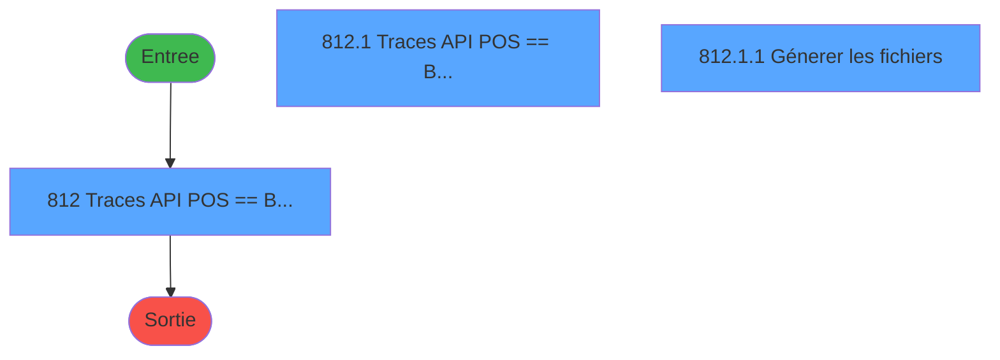
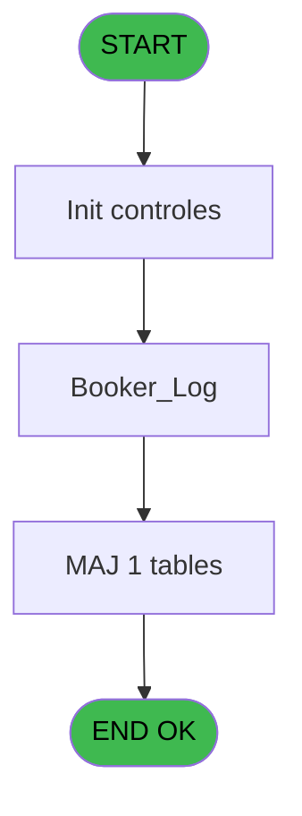
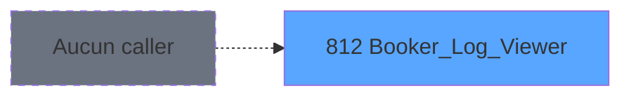

# REF IDE 812 - Booker_Log_Viewer

> **Analyse**: Phases 1-4 2026-02-03 14:30 -> 14:31 (14s) | Assemblage 14:31
> **Pipeline**: V7.2 Enrichi
> **Structure**: 4 onglets (Resume | Ecrans | Donnees | Connexions)

<!-- TAB:Resume -->

## 1. FICHE D'IDENTITE

| Attribut | Valeur |
|----------|--------|
| Projet | REF |
| IDE Position | 812 |
| Nom Programme | Booker_Log_Viewer |
| Fichier source | `Prg_812.xml` |
| Dossier IDE | General |
| Taches | 3 (3 ecrans visibles) |
| Tables modifiees | 1 |
| Programmes appeles | 0 |
| :warning: Statut | **ORPHELIN_POTENTIEL** |

## 2. DESCRIPTION FONCTIONNELLE

**Booker_Log_Viewer** assure la gestion complete de ce processus.

Le flux de traitement s'organise en **1 blocs fonctionnels** :

- **Traitement** (3 taches) : traitements metier divers

**Donnees modifiees** : 1 tables en ecriture (log_booker).

**Logique metier** : 1 regles identifiees couvrant conditions metier.

## 3. BLOCS FONCTIONNELS

### 3.1 Traitement (3 taches)

Traitements internes.

---

#### 812 - Traces API POS <==> Booker [[ECRAN]](#ecran-t1)

**Role** : Traitement : Traces API POS <==> Booker.
**Ecran** : 743 x 221 DLU (MDI) | [Voir mockup](#ecran-t1)

---

#### 812.1 - Traces API POS <==> Booker [[ECRAN]](#ecran-t2)

**Role** : Traitement : Traces API POS <==> Booker.
**Ecran** : 728 x 156 DLU | [Voir mockup](#ecran-t2)

---

#### 812.1.1 - Génerer les fichiers [[ECRAN]](#ecran-t3)

**Role** : Traitement : Génerer les fichiers.
**Ecran** : 391 x 68 DLU (MDI) | [Voir mockup](#ecran-t3)

## 5. REGLES METIER

1 regles identifiees:

### Autres (1 regles)

#### [RM-001] Si v.Masque les logins [C] alors ' log_url not like ''%Login%''' sinon '1=1')

| Element | Detail |
|---------|--------|
| **Condition** | `v.Masque les logins [C]` |
| **Si vrai** | ' log_url not like ''%Login%''' |
| **Si faux** | '1=1') |
| **Variables** | C (v.Masque les logins) |
| **Expression source** | Expression 6 : `IF(v.Masque les logins [C], ' log_url not like ''%Login%''',` |
| **Exemple** | Si v.Masque les logins [C] → ' log_url not like ''%Login%'''. Sinon → '1=1') |

## 6. CONTEXTE

- **Appele par**: (aucun)
- **Appelle**: 0 programmes | **Tables**: 1 (W:1 R:0 L:0) | **Taches**: 3 | **Expressions**: 7

<!-- TAB:Ecrans -->

## 8. ECRANS

### 8.1 Forms visibles (3 / 3)

| # | Position | Tache | Nom | Type | Largeur | Hauteur | Bloc |
|---|----------|-------|-----|------|---------|---------|------|
| 1 | 812 | 812 | Traces API POS <==> Booker | MDI | 743 | 221 | Traitement |
| 2 | 812.1 | 812.1 | Traces API POS <==> Booker | Type0 | 728 | 156 | Traitement |
| 3 | 812.1.1 | 812.1.1 | Génerer les fichiers | MDI | 391 | 68 | Traitement |

### 8.2 Mockups Ecrans

---

#### 812 - Traces API POS <==> Booker
**Tache** : [812](#t1) | **Type** : MDI | **Dimensions** : 743 x 221 DLU
**Bloc** : Traitement | **Titre IDE** : Traces API POS <==> Booker

<!-- FORM-DATA:
{
    "width":  743,
    "vFactor":  8,
    "type":  "MDI",
    "hFactor":  4,
    "controls":  [
                     {
                         "x":  7,
                         "type":  "label",
                         "var":  "",
                         "y":  8,
                         "w":  727,
                         "fmt":  "",
                         "name":  "",
                         "h":  40,
                         "color":  "",
                         "text":  "Filtres",
                         "parent":  null
                     },
                     {
                         "x":  17,
                         "type":  "label",
                         "var":  "",
                         "y":  24,
                         "w":  41,
                         "fmt":  "",
                         "name":  "",
                         "h":  9,
                         "color":  "",
                         "text":  "Date Min :",
                         "parent":  1
                     },
                     {
                         "x":  132,
                         "type":  "label",
                         "var":  "",
                         "y":  24,
                         "w":  43,
                         "fmt":  "",
                         "name":  "",
                         "h":  9,
                         "color":  "",
                         "text":  "Date Max :",
                         "parent":  1
                     },
                     {
                         "x":  379,
                         "type":  "label",
                         "var":  "",
                         "y":  24,
                         "w":  29,
                         "fmt":  "",
                         "name":  "",
                         "h":  9,
                         "color":  "",
                         "text":  "Statut :",
                         "parent":  1
                     },
                     {
                         "x":  7,
                         "type":  "subform",
                         "var":  "",
                         "y":  55,
                         "w":  727,
                         "fmt":  "",
                         "name":  "Booker_Log",
                         "h":  159,
                         "color":  "",
                         "text":  "",
                         "parent":  null
                     },
                     {
                         "x":  62,
                         "type":  "edit",
                         "var":  "",
                         "y":  24,
                         "w":  61,
                         "fmt":  "",
                         "name":  "v.DateMin",
                         "h":  10,
                         "color":  "19",
                         "text":  "",
                         "parent":  1
                     },
                     {
                         "x":  179,
                         "type":  "edit",
                         "var":  "",
                         "y":  24,
                         "w":  61,
                         "fmt":  "",
                         "name":  "v.DateMax",
                         "h":  10,
                         "color":  "19",
                         "text":  "",
                         "parent":  1
                     },
                     {
                         "x":  665,
                         "type":  "button",
                         "var":  "",
                         "y":  197,
                         "w":  64,
                         "fmt":  "\u0026Quitter",
                         "name":  "BtnQuitter",
                         "h":  18,
                         "color":  "",
                         "text":  "",
                         "parent":  null
                     },
                     {
                         "x":  665,
                         "type":  "button",
                         "var":  "",
                         "y":  21,
                         "w":  64,
                         "fmt":  "\u0026Filtrer",
                         "name":  "BtnFilter",
                         "h":  18,
                         "color":  "",
                         "text":  "",
                         "parent":  1
                     },
                     {
                         "x":  415,
                         "type":  "combobox",
                         "var":  "",
                         "y":  24,
                         "w":  68,
                         "fmt":  "",
                         "name":  "v.Statut",
                         "h":  12,
                         "color":  "",
                         "text":  "T,S,E",
                         "parent":  1
                     },
                     {
                         "x":  274,
                         "type":  "checkbox",
                         "var":  "",
                         "y":  24,
                         "w":  93,
                         "fmt":  "",
                         "name":  "Masquer les logins",
                         "h":  12,
                         "color":  "",
                         "text":  "Masquer les logins",
                         "parent":  1
                     }
                 ],
    "taskId":  "812",
    "height":  221
}
-->

<strong>Champs : 4 champs</strong>

| Pos (x,y) | Nom | Variable | Type |
|-----------|-----|----------|------|
| 62,24 | v.DateMin | - | edit |
| 179,24 | v.DateMax | - | edit |
| 415,24 | v.Statut | - | combobox |
| 274,24 | Masquer les logins | - | checkbox |

<strong>Boutons : 2 boutons</strong>

| Bouton | Pos (x,y) | Action |
|--------|-----------|--------|
| Quitter | 665,197 | Quitte le programme |
| Filtrer | 665,21 | Bouton fonctionnel |

---

#### 812.1 - Traces API POS <==> Booker
**Tache** : [812.1](#t2) | **Type** : Type0 | **Dimensions** : 728 x 156 DLU
**Bloc** : Traitement | **Titre IDE** : Traces API POS <==> Booker

<!-- FORM-DATA:
{
    "width":  728,
    "vFactor":  8,
    "type":  "Type0",
    "hFactor":  4,
    "controls":  [
                     {
                         "x":  0,
                         "type":  "table",
                         "var":  "",
                         "name":  "",
                         "titleH":  12,
                         "color":  "",
                         "w":  728,
                         "y":  0,
                         "fmt":  "",
                         "parent":  null,
                         "text":  "",
                         "rowH":  13,
                         "h":  128,
                         "cols":  [
                                      {
                                          "title":  "Service",
                                          "layer":  1,
                                          "w":  46
                                      },
                                      {
                                          "title":  "Location ID",
                                          "layer":  2,
                                          "w":  63
                                      },
                                      {
                                          "title":  "URL",
                                          "layer":  3,
                                          "w":  247
                                      },
                                      {
                                          "title":  "Méthode",
                                          "layer":  4,
                                          "w":  114
                                      },
                                      {
                                          "title":  "Login",
                                          "layer":  5,
                                          "w":  54
                                      },
                                      {
                                          "title":  "Date",
                                          "layer":  6,
                                          "w":  68
                                      },
                                      {
                                          "title":  "Heure",
                                          "layer":  7,
                                          "w":  51
                                      },
                                      {
                                          "title":  "RowId",
                                          "layer":  8,
                                          "w":  67
                                      }
                                  ],
                         "rows":  8
                     },
                     {
                         "x":  4,
                         "type":  "edit",
                         "var":  "",
                         "y":  15,
                         "w":  38,
                         "fmt":  "",
                         "name":  "log_service",
                         "h":  10,
                         "color":  "25",
                         "text":  "",
                         "parent":  1
                     },
                     {
                         "x":  50,
                         "type":  "edit",
                         "var":  "",
                         "y":  15,
                         "w":  56,
                         "fmt":  "N10Z",
                         "name":  "log_location_id",
                         "h":  10,
                         "color":  "25",
                         "text":  "",
                         "parent":  1
                     },
                     {
                         "x":  113,
                         "type":  "edit",
                         "var":  "",
                         "y":  15,
                         "w":  240,
                         "fmt":  "",
                         "name":  "log_url",
                         "h":  10,
                         "color":  "25",
                         "text":  "",
                         "parent":  1
                     },
                     {
                         "x":  360,
                         "type":  "edit",
                         "var":  "",
                         "y":  15,
                         "w":  107,
                         "fmt":  "",
                         "name":  "v.Méthode",
                         "h":  10,
                         "color":  "25",
                         "text":  "",
                         "parent":  1
                     },
                     {
                         "x":  473,
                         "type":  "edit",
                         "var":  "",
                         "y":  15,
                         "w":  52,
                         "fmt":  "",
                         "name":  "log_login",
                         "h":  10,
                         "color":  "25",
                         "text":  "",
                         "parent":  1
                     },
                     {
                         "x":  528,
                         "type":  "edit",
                         "var":  "",
                         "y":  15,
                         "w":  65,
                         "fmt":  "##/##/####Z",
                         "name":  "log_date",
                         "h":  10,
                         "color":  "25",
                         "text":  "",
                         "parent":  1
                     },
                     {
                         "x":  596,
                         "type":  "edit",
                         "var":  "",
                         "y":  15,
                         "w":  42,
                         "fmt":  "HH:MM:SSZ",
                         "name":  "log_time",
                         "h":  10,
                         "color":  "25",
                         "text":  "",
                         "parent":  1
                     },
                     {
                         "x":  656,
                         "type":  "edit",
                         "var":  "",
                         "y":  15,
                         "w":  51,
                         "fmt":  "",
                         "name":  "log_rowid",
                         "h":  10,
                         "color":  "6",
                         "text":  "",
                         "parent":  1
                     },
                     {
                         "x":  0,
                         "type":  "button",
                         "var":  "",
                         "y":  139,
                         "w":  84,
                         "fmt":  "\u0026Générer fichiers",
                         "name":  "Btn.GenererFichiers",
                         "h":  18,
                         "color":  "",
                         "text":  "",
                         "parent":  null
                     }
                 ],
    "taskId":  "812.1",
    "height":  156
}
-->

<strong>Champs : 8 champs</strong>

| Pos (x,y) | Nom | Variable | Type |
|-----------|-----|----------|------|
| 4,15 | log_service | - | edit |
| 50,15 | log_location_id | - | edit |
| 113,15 | log_url | - | edit |
| 360,15 | v.Méthode | - | edit |
| 473,15 | log_login | - | edit |
| 528,15 | log_date | - | edit |
| 596,15 | log_time | - | edit |
| 656,15 | log_rowid | - | edit |

<strong>Boutons : 1 boutons</strong>

| Bouton | Pos (x,y) | Action |
|--------|-----------|--------|
| Générer fichiers | 0,139 | Bouton fonctionnel |

---

#### 812.1.1 - Génerer les fichiers
**Tache** : [812.1.1](#t3) | **Type** : MDI | **Dimensions** : 391 x 68 DLU
**Bloc** : Traitement | **Titre IDE** : Génerer les fichiers

<!-- FORM-DATA:
{
    "width":  391,
    "vFactor":  8,
    "type":  "MDI",
    "hFactor":  4,
    "controls":  [
                     {
                         "x":  6,
                         "type":  "label",
                         "var":  "",
                         "y":  14,
                         "w":  118,
                         "fmt":  "",
                         "name":  "",
                         "h":  9,
                         "color":  "",
                         "text":  "Les fichiers seront génerés ici :",
                         "parent":  null
                     },
                     {
                         "x":  318,
                         "type":  "button",
                         "var":  "",
                         "y":  49,
                         "w":  64,
                         "fmt":  "\u0026Quitter",
                         "name":  "BtnQuitter",
                         "h":  18,
                         "color":  "",
                         "text":  "",
                         "parent":  null
                     },
                     {
                         "x":  126,
                         "type":  "edit",
                         "var":  "",
                         "y":  13,
                         "w":  219,
                         "fmt":  "",
                         "name":  "v.LogFolder",
                         "h":  11,
                         "color":  "19",
                         "text":  "",
                         "parent":  null
                     },
                     {
                         "x":  348,
                         "type":  "button",
                         "var":  "",
                         "y":  13,
                         "w":  19,
                         "fmt":  "...",
                         "name":  "Btn.Parcourir",
                         "h":  10,
                         "color":  "",
                         "text":  "",
                         "parent":  null
                     },
                     {
                         "x":  6,
                         "type":  "button",
                         "var":  "",
                         "y":  49,
                         "w":  64,
                         "fmt":  "\u0026OK",
                         "name":  "Btn.OK",
                         "h":  18,
                         "color":  "",
                         "text":  "",
                         "parent":  null
                     }
                 ],
    "taskId":  "812.1.1",
    "height":  68
}
-->

<strong>Champs : 1 champs</strong>

| Pos (x,y) | Nom | Variable | Type |
|-----------|-----|----------|------|
| 126,13 | v.LogFolder | - | edit |

<strong>Boutons : 3 boutons</strong>

| Bouton | Pos (x,y) | Action |
|--------|-----------|--------|
| Quitter | 318,49 | Quitte le programme |
| ... | 348,13 | Bouton fonctionnel |
| OK | 6,49 | Valide la saisie et enregistre |

## 9. NAVIGATION

### 9.1 Enchainement des ecrans

**Detail par enchainement :**

| Depuis | Action | Vers | Retour |
|--------|--------|------|--------|

### 9.3 Structure hierarchique (3 taches)

| Position | Tache | Type | Dimensions | Bloc |
|----------|-------|------|------------|------|
| **812.1** | [**Traces API POS <==> Booker** (812)](#t1) [mockup](#ecran-t1) | MDI | 743x221 | Traitement |
| 812.1.1 | [Traces API POS <==> Booker (812.1)](#t2) [mockup](#ecran-t2) | - | 728x156 | |
| 812.1.2 | [Génerer les fichiers (812.1.1)](#t3) [mockup](#ecran-t3) | MDI | 391x68 | |

### 9.4 Algorigramme

> **Legende**: Vert = START/END OK | Rouge = END KO | Bleu = Decisions
> *Algorigramme auto-genere. Utiliser `/algorigramme` pour une synthese metier detaillee.*

<!-- TAB:Donnees -->

## 10. TABLES

### Tables utilisees (1)

| ID | Nom | Description | Type | R | W | L | Usages |
|----|-----|-------------|------|---|---|---|--------|
| 911 | log_booker |  | DB |   | **W** |   | 1 |

### Colonnes par table (1 / 1 tables avec colonnes identifiees)

Table 911 - log_booker (**W**) - 1 usages

| Lettre | Variable | Acces | Type |
|--------|----------|-------|------|
| A | v.Méthode | W | Unicode |
| B | Btn.GenererFichiers | W | Alpha |

## 11. VARIABLES

### 11.1 Variables de session (7)

Variables persistantes pendant toute la session.

| Lettre | Nom | Type | Usage dans |
|--------|-----|------|-----------|
| A | v.DateMin | Date | - |
| B | v.DateMax | Date | - |
| C | v.Masque les logins | Logical | 1x session |
| D | v.StatutFilter | Unicode | 1x session |
| E | v.StatutBool | Logical | - |
| H | v.LogFolder | Alpha | - |
| I | v.SQL Where | Alpha | - |

### 11.2 Autres (6)

Variables diverses.

| Lettre | Nom | Type | Usage dans |
|--------|-----|------|-----------|
| F | BtnFilter | Alpha | - |
| G | BtnQuitter | Alpha | - |
| J | CHG_REASON_v.StatutFilter | Numeric | - |
| K | CHG_PRV_v.StatutFilter | Unicode | - |
| L | CHG_REASON_v.Masque les logins | Numeric | - |
| M | CHG_PRV_v.Masque les logins | Logical | - |

## 12. EXPRESSIONS

**7 / 7 expressions decodees (100%)**

### 12.1 Repartition par type

| Type | Expressions | Regles |
|------|-------------|--------|
| CONDITION | 2 | 5 |
| CONSTANTE | 3 | 0 |
| DATE | 1 | 0 |
| CAST_LOGIQUE | 1 | 0 |

### 12.2 Expressions cles par type

#### CONDITION (2 expressions)

| Type | IDE | Expression | Regle |
|------|-----|------------|-------|
| CONDITION | 6 | `IF(v.Masque les logins [C], ' log_url not like ''%Login%''', '1=1')` | [RM-001](#rm-RM-001) |
| CONDITION | 3 | `v.StatutFilter [D] = 'S'` | - |

#### CONSTANTE (3 expressions)

| Type | IDE | Expression | Regle |
|------|-----|------------|-------|
| CONSTANTE | 4 | `'C:\Temp\BookerLogs\'` | - |
| CONSTANTE | 2 | `'T'` | - |
| CONSTANTE | 1 | `'Booker_Log'` | - |

#### DATE (1 expressions)

| Type | IDE | Expression | Regle |
|------|-----|------------|-------|
| DATE | 7 | `Date()-10` | - |

#### CAST_LOGIQUE (1 expressions)

| Type | IDE | Expression | Regle |
|------|-----|------------|-------|
| CAST_LOGIQUE | 5 | `'TRUE'LOG` | - |

<!-- TAB:Connexions -->

## 13. GRAPHE D'APPELS

### 13.1 Chaine depuis Main (Callers)

**Chemin**: (pas de callers directs)

### 13.2 Callers

| IDE | Nom Programme | Nb Appels |
|-----|---------------|-----------|
| - | (aucun) | - |

### 13.3 Callees (programmes appeles)

### 13.4 Detail Callees avec contexte

| IDE | Nom Programme | Appels | Contexte |
|-----|---------------|--------|----------|
| - | (aucun) | - | - |

## 14. RECOMMANDATIONS MIGRATION

### 14.1 Profil du programme

| Metrique | Valeur | Impact migration |
|----------|--------|-----------------|
| Lignes de logique | 92 | Programme compact |
| Expressions | 7 | Peu de logique |
| Tables WRITE | 1 | Impact faible |
| Sous-programmes | 0 | Peu de dependances |
| Ecrans visibles | 3 | Quelques ecrans |
| Code desactive | 0% (0 / 92) | Code sain |
| Regles metier | 1 | Quelques regles a preserver |

### 14.2 Plan de migration par bloc

#### Traitement (3 taches: 3 ecrans, 0 traitement)

- **Strategie** : 3 composant(s) UI (Razor/React) avec formulaires et validation.
- Decomposer les taches en services unitaires testables.

### 14.3 Dependances critiques

| Dependance | Type | Appels | Impact |
|------------|------|--------|--------|
| log_booker | Table WRITE (Database) | 1x | Schema + repository |

---
*Spec DETAILED generee par Pipeline V7.2 - 2026-02-03 14:31*
