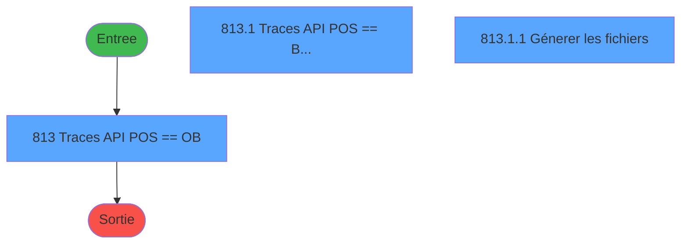
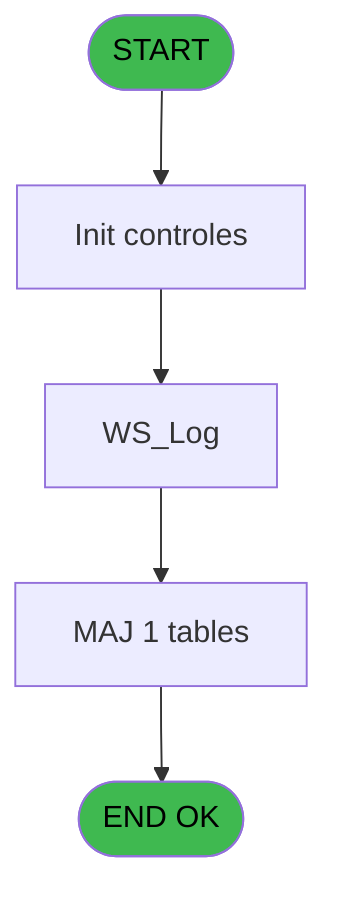
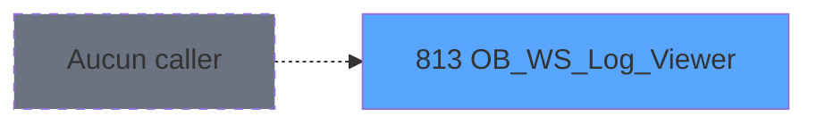

# REF IDE 813 - OB_WS_Log_Viewer

> **Analyse**: Phases 1-4 2026-02-03 14:31 -> 14:31 (15s) | Assemblage 14:31
> **Pipeline**: V7.2 Enrichi
> **Structure**: 4 onglets (Resume | Ecrans | Donnees | Connexions)

<!-- TAB:Resume -->

## 1. FICHE D'IDENTITE

| Attribut | Valeur |
|----------|--------|
| Projet | REF |
| IDE Position | 813 |
| Nom Programme | OB_WS_Log_Viewer |
| Fichier source | `Prg_813.xml` |
| Dossier IDE | General |
| Taches | 5 (3 ecrans visibles) |
| Tables modifiees | 1 |
| Programmes appeles | 0 |
| :warning: Statut | **ORPHELIN_POTENTIEL** |

## 2. DESCRIPTION FONCTIONNELLE

**OB_WS_Log_Viewer** assure la gestion complete de ce processus.

Le flux de traitement s'organise en **1 blocs fonctionnels** :

- **Traitement** (5 taches) : traitements metier divers

**Donnees modifiees** : 1 tables en ecriture (web_api_logs).

**Logique metier** : 1 regles identifiees couvrant conditions metier.

Detail : phases du traitement

#### Phase 1 : Traitement (5 taches)

- **813** - Traces API POS <==> OB **[[ECRAN]](#ecran-t1)**
- **813.1** - Traces API POS <==> Booker **[[ECRAN]](#ecran-t2)**
- **813.1.1** - Génerer les fichiers **[[ECRAN]](#ecran-t3)**
- **813.2** - Traces API POS <==> Booker **[[ECRAN]](#ecran-t4)**
- **813.2.1** - Génerer les fichiers **[[ECRAN]](#ecran-t5)**

#### Tables impactees

| Table | Operations | Role metier |
|-------|-----------|-------------|
| web_api_logs | **W** (2 usages) |  |

## 3. BLOCS FONCTIONNELS

### 3.1 Traitement (5 taches)

Traitements internes.

---

#### 813 - Traces API POS <==> OB [[ECRAN]](#ecran-t1)

**Role** : Traitement : Traces API POS <==> OB.
**Ecran** : 739 x 282 DLU (MDI) | [Voir mockup](#ecran-t1)

4 sous-taches directes

| Tache | Nom | Bloc |
|-------|-----|------|
| [813.1](#t2) | Traces API POS <==> Booker **[[ECRAN]](#ecran-t2)** | Traitement |
| [813.1.1](#t3) | Génerer les fichiers **[[ECRAN]](#ecran-t3)** | Traitement |
| [813.2](#t4) | Traces API POS <==> Booker **[[ECRAN]](#ecran-t4)** | Traitement |
| [813.2.1](#t5) | Génerer les fichiers **[[ECRAN]](#ecran-t5)** | Traitement |

---

#### 813.1 - Traces API POS <==> Booker [[ECRAN]](#ecran-t2)

**Role** : Traitement : Traces API POS <==> Booker.
**Ecran** : 690 x 180 DLU | [Voir mockup](#ecran-t2)

---

#### 813.1.1 - Génerer les fichiers [[ECRAN]](#ecran-t3)

**Role** : Traitement : Génerer les fichiers.
**Ecran** : 391 x 54 DLU (Type6) | [Voir mockup](#ecran-t3)

---

#### 813.2 - Traces API POS <==> Booker [[ECRAN]](#ecran-t4)

**Role** : Traitement : Traces API POS <==> Booker.
**Ecran** : 690 x 180 DLU | [Voir mockup](#ecran-t4)

---

#### 813.2.1 - Génerer les fichiers [[ECRAN]](#ecran-t5)

**Role** : Traitement : Génerer les fichiers.
**Ecran** : 391 x 54 DLU (Type6) | [Voir mockup](#ecran-t5)

## 5. REGLES METIER

1 regles identifiees:

### Autres (1 regles)

#### [RM-001] Traitement si Trim(v.Fonction [E]) est renseigne

| Element | Detail |
|---------|--------|
| **Condition** | `Trim(v.Fonction [E])<>''` |
| **Si vrai** | 'UrlLog LIKE ''%'&Trim(v.Fonction [E])&'%''' |
| **Si faux** | '') |
| **Variables** | E (v.Fonction) |
| **Expression source** | Expression 6 : `IF(Trim(v.Fonction [E])<>'','UrlLog LIKE ''%'&Trim(v.Fonctio` |
| **Exemple** | Si Trim(v.Fonction [E])<>'' → 'UrlLog LIKE ''%'&Trim(v.Fonction [E])&'%'''. Sinon → '') |

## 6. CONTEXTE

- **Appele par**: (aucun)
- **Appelle**: 0 programmes | **Tables**: 1 (W:1 R:0 L:0) | **Taches**: 5 | **Expressions**: 6

<!-- TAB:Ecrans -->

## 8. ECRANS

### 8.1 Forms visibles (3 / 5)

| # | Position | Tache | Nom | Type | Largeur | Hauteur | Bloc |
|---|----------|-------|-----|------|---------|---------|------|
| 1 | 813 | 813 | Traces API POS <==> OB | MDI | 739 | 282 | Traitement |
| 2 | 813.1 | 813.1 | Traces API POS <==> Booker | Type0 | 690 | 180 | Traitement |
| 3 | 813.1.1 | 813.1.1 | Génerer les fichiers | Type6 | 391 | 54 | Traitement |

### 8.2 Mockups Ecrans

---

#### 813 - Traces API POS <==> OB
**Tache** : [813](#t1) | **Type** : MDI | **Dimensions** : 739 x 282 DLU
**Bloc** : Traitement | **Titre IDE** : Traces API POS <==> OB

<!-- FORM-DATA:
{
    "width":  739,
    "vFactor":  8,
    "type":  "MDI",
    "hFactor":  4,
    "controls":  [
                     {
                         "x":  7,
                         "type":  "label",
                         "var":  "",
                         "y":  8,
                         "w":  727,
                         "fmt":  "",
                         "name":  "",
                         "h":  40,
                         "color":  "",
                         "text":  "Filtres",
                         "parent":  null
                     },
                     {
                         "x":  17,
                         "type":  "label",
                         "var":  "",
                         "y":  24,
                         "w":  41,
                         "fmt":  "",
                         "name":  "",
                         "h":  12,
                         "color":  "",
                         "text":  "Date Min :",
                         "parent":  1
                     },
                     {
                         "x":  132,
                         "type":  "label",
                         "var":  "",
                         "y":  24,
                         "w":  43,
                         "fmt":  "",
                         "name":  "",
                         "h":  12,
                         "color":  "",
                         "text":  "Date Max :",
                         "parent":  1
                     },
                     {
                         "x":  259,
                         "type":  "label",
                         "var":  "",
                         "y":  24,
                         "w":  29,
                         "fmt":  "",
                         "name":  "",
                         "h":  12,
                         "color":  "",
                         "text":  "Statut :",
                         "parent":  1
                     },
                     {
                         "x":  382,
                         "type":  "label",
                         "var":  "",
                         "y":  24,
                         "w":  42,
                         "fmt":  "",
                         "name":  "",
                         "h":  12,
                         "color":  "",
                         "text":  "Fonction",
                         "parent":  1
                     },
                     {
                         "x":  7,
                         "type":  "subform",
                         "var":  "",
                         "y":  55,
                         "w":  727,
                         "fmt":  "",
                         "name":  "Booker_Log",
                         "h":  199,
                         "color":  "",
                         "text":  "",
                         "parent":  null
                     },
                     {
                         "x":  62,
                         "type":  "edit",
                         "var":  "",
                         "y":  24,
                         "w":  61,
                         "fmt":  "",
                         "name":  "v.DateMin",
                         "h":  12,
                         "color":  "19",
                         "text":  "",
                         "parent":  1
                     },
                     {
                         "x":  179,
                         "type":  "edit",
                         "var":  "",
                         "y":  24,
                         "w":  61,
                         "fmt":  "",
                         "name":  "v.DateMax",
                         "h":  12,
                         "color":  "19",
                         "text":  "",
                         "parent":  1
                     },
                     {
                         "x":  665,
                         "type":  "button",
                         "var":  "",
                         "y":  261,
                         "w":  64,
                         "fmt":  "\u0026Quitter",
                         "name":  "BtnQuitter",
                         "h":  18,
                         "color":  "",
                         "text":  "",
                         "parent":  null
                     },
                     {
                         "x":  665,
                         "type":  "button",
                         "var":  "",
                         "y":  21,
                         "w":  64,
                         "fmt":  "\u0026Filtrer",
                         "name":  "BtnFilter",
                         "h":  18,
                         "color":  "",
                         "text":  "",
                         "parent":  1
                     },
                     {
                         "x":  295,
                         "type":  "combobox",
                         "var":  "",
                         "y":  24,
                         "w":  68,
                         "fmt":  "",
                         "name":  "v.Statut",
                         "h":  12,
                         "color":  "",
                         "text":  "T,S,E",
                         "parent":  1
                     },
                     {
                         "x":  428,
                         "type":  "edit",
                         "var":  "",
                         "y":  24,
                         "w":  171,
                         "fmt":  "",
                         "name":  "v.Fonction",
                         "h":  12,
                         "color":  "19",
                         "text":  "",
                         "parent":  1
                     },
                     {
                         "x":  337,
                         "type":  "button",
                         "var":  "",
                         "y":  261,
                         "w":  64,
                         "fmt":  "Exporter",
                         "name":  "Export",
                         "h":  18,
                         "color":  "",
                         "text":  "",
                         "parent":  null
                     }
                 ],
    "taskId":  "813",
    "height":  282
}
-->

<strong>Champs : 4 champs</strong>

| Pos (x,y) | Nom | Variable | Type |
|-----------|-----|----------|------|
| 62,24 | v.DateMin | - | edit |
| 179,24 | v.DateMax | - | edit |
| 295,24 | v.Statut | - | combobox |
| 428,24 | v.Fonction | - | edit |

<strong>Boutons : 3 boutons</strong>

| Bouton | Pos (x,y) | Action |
|--------|-----------|--------|
| Quitter | 665,261 | Quitte le programme |
| Filtrer | 665,21 | Bouton fonctionnel |
| Exporter | 337,261 | Bouton fonctionnel |

---

#### 813.1 - Traces API POS <==> Booker
**Tache** : [813.1](#t2) | **Type** : Type0 | **Dimensions** : 690 x 180 DLU
**Bloc** : Traitement | **Titre IDE** : Traces API POS <==> Booker

<!-- FORM-DATA:
{
    "width":  690,
    "vFactor":  8,
    "type":  "Type0",
    "hFactor":  4,
    "controls":  [
                     {
                         "x":  12,
                         "type":  "table",
                         "var":  "",
                         "name":  "",
                         "titleH":  12,
                         "color":  "",
                         "w":  672,
                         "y":  0,
                         "fmt":  "",
                         "parent":  null,
                         "text":  "",
                         "rowH":  13,
                         "h":  160,
                         "cols":  [
                                      {
                                          "title":  "URL",
                                          "layer":  1,
                                          "w":  294
                                      },
                                      {
                                          "title":  "Date",
                                          "layer":  2,
                                          "w":  64
                                      },
                                      {
                                          "title":  "Heure",
                                          "layer":  3,
                                          "w":  53
                                      },
                                      {
                                          "title":  "ErrorMsgLog",
                                          "layer":  4,
                                          "w":  226
                                      }
                                  ],
                         "rows":  4
                     },
                     {
                         "x":  16,
                         "type":  "edit",
                         "var":  "",
                         "y":  15,
                         "w":  288,
                         "fmt":  "",
                         "name":  "log_url",
                         "h":  10,
                         "color":  "25",
                         "text":  "",
                         "parent":  1
                     },
                     {
                         "x":  310,
                         "type":  "edit",
                         "var":  "",
                         "y":  15,
                         "w":  57,
                         "fmt":  "##/##/####Z",
                         "name":  "log_date",
                         "h":  10,
                         "color":  "25",
                         "text":  "",
                         "parent":  1
                     },
                     {
                         "x":  372,
                         "type":  "edit",
                         "var":  "",
                         "y":  15,
                         "w":  46,
                         "fmt":  "HH:MM:SSZ",
                         "name":  "log_time",
                         "h":  10,
                         "color":  "25",
                         "text":  "",
                         "parent":  1
                     },
                     {
                         "x":  427,
                         "type":  "edit",
                         "var":  "",
                         "y":  15,
                         "w":  220,
                         "fmt":  "",
                         "name":  "ErrorMsgLog",
                         "h":  10,
                         "color":  "6",
                         "text":  "",
                         "parent":  1
                     },
                     {
                         "x":  0,
                         "type":  "button",
                         "var":  "",
                         "y":  163,
                         "w":  84,
                         "fmt":  "\u0026Générer fichiers",
                         "name":  "Btn.GenererFichiers",
                         "h":  18,
                         "color":  "",
                         "text":  "",
                         "parent":  null
                     },
                     {
                         "x":  93,
                         "type":  "button",
                         "var":  "",
                         "y":  163,
                         "w":  84,
                         "fmt":  "\u0026Refresh",
                         "name":  "Btn.Refresh",
                         "h":  18,
                         "color":  "",
                         "text":  "",
                         "parent":  null
                     }
                 ],
    "taskId":  "813.1",
    "height":  180
}
-->

<strong>Champs : 4 champs</strong>

| Pos (x,y) | Nom | Variable | Type |
|-----------|-----|----------|------|
| 16,15 | log_url | - | edit |
| 310,15 | log_date | - | edit |
| 372,15 | log_time | - | edit |
| 427,15 | ErrorMsgLog | - | edit |

<strong>Boutons : 2 boutons</strong>

| Bouton | Pos (x,y) | Action |
|--------|-----------|--------|
| Générer fichiers | 0,163 | Bouton fonctionnel |
| Refresh | 93,163 | Rafraichit l'affichage |

---

#### 813.1.1 - Génerer les fichiers
**Tache** : [813.1.1](#t3) | **Type** : Type6 | **Dimensions** : 391 x 54 DLU
**Bloc** : Traitement | **Titre IDE** : Génerer les fichiers

<!-- FORM-DATA:
{
    "width":  391,
    "vFactor":  8,
    "type":  "Type6",
    "hFactor":  4,
    "controls":  [
                     {
                         "x":  6,
                         "type":  "label",
                         "var":  "",
                         "y":  14,
                         "w":  118,
                         "fmt":  "",
                         "name":  "",
                         "h":  9,
                         "color":  "",
                         "text":  "Les fichiers seront génerés ici :",
                         "parent":  null
                     },
                     {
                         "x":  318,
                         "type":  "button",
                         "var":  "",
                         "y":  33,
                         "w":  64,
                         "fmt":  "\u0026Quitter",
                         "name":  "BtnQuitter",
                         "h":  18,
                         "color":  "",
                         "text":  "",
                         "parent":  null
                     },
                     {
                         "x":  126,
                         "type":  "edit",
                         "var":  "",
                         "y":  13,
                         "w":  219,
                         "fmt":  "",
                         "name":  "v.LogFolder",
                         "h":  11,
                         "color":  "19",
                         "text":  "",
                         "parent":  null
                     },
                     {
                         "x":  348,
                         "type":  "button",
                         "var":  "",
                         "y":  13,
                         "w":  19,
                         "fmt":  "...",
                         "name":  "Btn.Parcourir",
                         "h":  10,
                         "color":  "",
                         "text":  "",
                         "parent":  null
                     },
                     {
                         "x":  6,
                         "type":  "button",
                         "var":  "",
                         "y":  33,
                         "w":  64,
                         "fmt":  "\u0026OK",
                         "name":  "Btn.OK",
                         "h":  18,
                         "color":  "",
                         "text":  "",
                         "parent":  null
                     }
                 ],
    "taskId":  "813.1.1",
    "height":  54
}
-->

<strong>Champs : 1 champs</strong>

| Pos (x,y) | Nom | Variable | Type |
|-----------|-----|----------|------|
| 126,13 | v.LogFolder | - | edit |

<strong>Boutons : 3 boutons</strong>

| Bouton | Pos (x,y) | Action |
|--------|-----------|--------|
| Quitter | 318,33 | Quitte le programme |
| ... | 348,13 | Bouton fonctionnel |
| OK | 6,33 | Valide la saisie et enregistre |

## 9. NAVIGATION

### 9.1 Enchainement des ecrans

**Detail par enchainement :**

| Depuis | Action | Vers | Retour |
|--------|--------|------|--------|

### 9.3 Structure hierarchique (5 taches)

| Position | Tache | Type | Dimensions | Bloc |
|----------|-------|------|------------|------|
| **813.1** | [**Traces API POS <==> OB** (813)](#t1) [mockup](#ecran-t1) | MDI | 739x282 | Traitement |
| 813.1.1 | [Traces API POS <==> Booker (813.1)](#t2) [mockup](#ecran-t2) | - | 690x180 | |
| 813.1.2 | [Génerer les fichiers (813.1.1)](#t3) [mockup](#ecran-t3) | Type6 | 391x54 | |
| 813.1.3 | [Traces API POS <==> Booker (813.2)](#t4) [mockup](#ecran-t4) | - | 690x180 | |
| 813.1.4 | [Génerer les fichiers (813.2.1)](#t5) [mockup](#ecran-t5) | Type6 | 391x54 | |

### 9.4 Algorigramme

> **Legende**: Vert = START/END OK | Rouge = END KO | Bleu = Decisions
> *Algorigramme auto-genere. Utiliser `/algorigramme` pour une synthese metier detaillee.*

<!-- TAB:Donnees -->

## 10. TABLES

### Tables utilisees (1)

| ID | Nom | Description | Type | R | W | L | Usages |
|----|-----|-------------|------|---|---|---|--------|
| 917 | web_api_logs |  | DB |   | **W** |   | 2 |

### Colonnes par table (0 / 1 tables avec colonnes identifiees)

Table 917 - web_api_logs (**W**) - 2 usages

*Table utilisee uniquement en Link ou aucune colonne Real identifiee dans le DataView.*

## 11. VARIABLES

### 11.1 Variables de session (7)

Variables persistantes pendant toute la session.

| Lettre | Nom | Type | Usage dans |
|--------|-----|------|-----------|
| A | v.DateMin | Date | - |
| B | v.DateMax | Date | - |
| C | v.StatutFilter | Unicode | 1x session |
| D | v.StatutBool | Logical | - |
| E | v.Fonction | Alpha | 1x session |
| H | v.LogFolder | Alpha | - |
| I | v.like function | Alpha | - |

### 11.2 Autres (12)

Variables diverses.

| Lettre | Nom | Type | Usage dans |
|--------|-----|------|-----------|
| F | BtnFilter | Alpha | - |
| G | BtnQuitter | Alpha | - |
| J | CHG_REASON_v.DateMin | Numeric | - |
| K | CHG_PRV_v.DateMin | Date | - |
| L | CHG_REASON_v.DateMax | Numeric | - |
| M | CHG_PRV_v.DateMax | Date | - |
| N | CHG_REASON_v.StatutFilter | Numeric | - |
| O | CHG_PRV_v.StatutFilter | Unicode | - |
| P | CHG_REASON_v.Fonction | Numeric | - |
| Q | CHG_PRV_v.Fonction | Alpha | - |
| R | CHG_REASON_v.StatutFilter | Numeric | - |
| S | CHG_PRV_v.StatutFilter | Unicode | - |

Toutes les 19 variables (liste complete)

| Cat | Lettre | Nom Variable | Type |
|-----|--------|--------------|------|
| V. | **A** | v.DateMin | Date |
| V. | **B** | v.DateMax | Date |
| V. | **C** | v.StatutFilter | Unicode |
| V. | **D** | v.StatutBool | Logical |
| V. | **E** | v.Fonction | Alpha |
| V. | **H** | v.LogFolder | Alpha |
| V. | **I** | v.like function | Alpha |
| Autre | **F** | BtnFilter | Alpha |
| Autre | **G** | BtnQuitter | Alpha |
| Autre | **J** | CHG_REASON_v.DateMin | Numeric |
| Autre | **K** | CHG_PRV_v.DateMin | Date |
| Autre | **L** | CHG_REASON_v.DateMax | Numeric |
| Autre | **M** | CHG_PRV_v.DateMax | Date |
| Autre | **N** | CHG_REASON_v.StatutFilter | Numeric |
| Autre | **O** | CHG_PRV_v.StatutFilter | Unicode |
| Autre | **P** | CHG_REASON_v.Fonction | Numeric |
| Autre | **Q** | CHG_PRV_v.Fonction | Alpha |
| Autre | **R** | CHG_REASON_v.StatutFilter | Numeric |
| Autre | **S** | CHG_PRV_v.StatutFilter | Unicode |

## 12. EXPRESSIONS

**6 / 6 expressions decodees (100%)**

### 12.1 Repartition par type

| Type | Expressions | Regles |
|------|-------------|--------|
| CONDITION | 2 | 5 |
| CONSTANTE | 3 | 0 |
| DATE | 1 | 0 |

### 12.2 Expressions cles par type

#### CONDITION (2 expressions)

| Type | IDE | Expression | Regle |
|------|-----|------------|-------|
| CONDITION | 6 | `IF(Trim(v.Fonction [E])<>'','UrlLog LIKE ''%'&Trim(v.Fonction [E])&'%''','')` | [RM-001](#rm-RM-001) |
| CONDITION | 4 | `v.StatutFilter [C] <> 'S'` | - |

#### CONSTANTE (3 expressions)

| Type | IDE | Expression | Regle |
|------|-----|------------|-------|
| CONSTANTE | 5 | `'C:\Temp\WSLogs\'` | - |
| CONSTANTE | 3 | `'T'` | - |
| CONSTANTE | 2 | `'Booker_Log'` | - |

#### DATE (1 expressions)

| Type | IDE | Expression | Regle |
|------|-----|------------|-------|
| DATE | 1 | `Date()` | - |

<!-- TAB:Connexions -->

## 13. GRAPHE D'APPELS

### 13.1 Chaine depuis Main (Callers)

**Chemin**: (pas de callers directs)

### 13.2 Callers

| IDE | Nom Programme | Nb Appels |
|-----|---------------|-----------|
| - | (aucun) | - |

### 13.3 Callees (programmes appeles)

### 13.4 Detail Callees avec contexte

| IDE | Nom Programme | Appels | Contexte |
|-----|---------------|--------|----------|
| - | (aucun) | - | - |

## 14. RECOMMANDATIONS MIGRATION

### 14.1 Profil du programme

| Metrique | Valeur | Impact migration |
|----------|--------|-----------------|
| Lignes de logique | 159 | Programme compact |
| Expressions | 6 | Peu de logique |
| Tables WRITE | 1 | Impact faible |
| Sous-programmes | 0 | Peu de dependances |
| Ecrans visibles | 3 | Quelques ecrans |
| Code desactive | 0% (0 / 159) | Code sain |
| Regles metier | 1 | Quelques regles a preserver |

### 14.2 Plan de migration par bloc

#### Traitement (5 taches: 5 ecrans, 0 traitement)

- **Strategie** : 5 composant(s) UI (Razor/React) avec formulaires et validation.
- Decomposer les taches en services unitaires testables.

### 14.3 Dependances critiques

| Dependance | Type | Appels | Impact |
|------------|------|--------|--------|
| web_api_logs | Table WRITE (Database) | 2x | Schema + repository |

---
*Spec DETAILED generee par Pipeline V7.2 - 2026-02-03 14:31*
