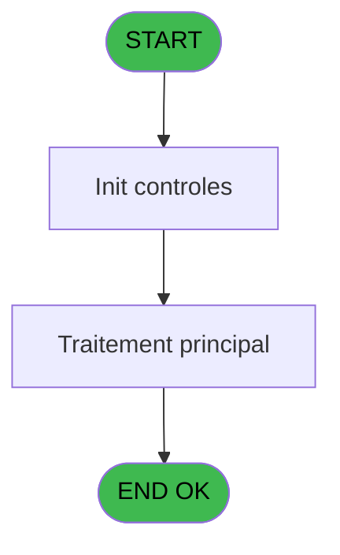
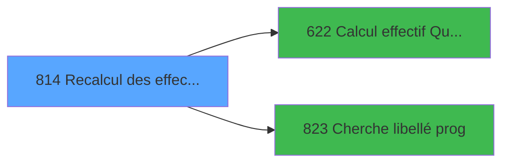

# REF IDE 814 - Recalcul des effectifs

> **Analyse**: Phases 1-4 2026-02-03 14:31 -> 14:31 (14s) | Assemblage 14:31
> **Pipeline**: V7.2 Enrichi
> **Structure**: 4 onglets (Resume | Ecrans | Donnees | Connexions)

<!-- TAB:Resume -->

## 1. FICHE D'IDENTITE

| Attribut | Valeur |
|----------|--------|
| Projet | REF |
| IDE Position | 814 |
| Nom Programme | Recalcul des effectifs |
| Fichier source | `Prg_814.xml` |
| Dossier IDE | General |
| Taches | 2 (0 ecrans visibles) |
| Tables modifiees | 0 |
| Programmes appeles | 2 |
| :warning: Statut | **ORPHELIN_POTENTIEL** |

## 2. DESCRIPTION FONCTIONNELLE

**Recalcul des effectifs** assure la gestion complete de ce processus.

Le flux de traitement s'organise en **1 blocs fonctionnels** :

- **Calcul** (2 taches) : calculs de montants, stocks ou compteurs

## 3. BLOCS FONCTIONNELS

### 3.1 Calcul (2 taches)

Calculs metier : montants, stocks, compteurs.

---

#### 814 - Recalcul des effectifs

**Role** : Calcul : Recalcul des effectifs.
**Delegue a** : [Calcul effectif Quotidien (IDE 622)](REF-IDE-622.md)

---

#### 814.1 - Calcul Nb Lieux Sejour

**Role** : Calcul : Calcul Nb Lieux Sejour.
**Variables liees** : D (Nombre Lieux Séjour)
**Delegue a** : [Calcul effectif Quotidien (IDE 622)](REF-IDE-622.md)

## 5. REGLES METIER

*(Aucune regle metier identifiee)*

## 6. CONTEXTE

- **Appele par**: (aucun)
- **Appelle**: 2 programmes | **Tables**: 1 (W:0 R:1 L:0) | **Taches**: 2 | **Expressions**: 12

<!-- TAB:Ecrans -->

## 8. ECRANS

*(Programme sans ecran visible)*

## 9. NAVIGATION

### 9.3 Structure hierarchique (2 taches)

| Position | Tache | Type | Dimensions | Bloc |
|----------|-------|------|------------|------|
| **814.1** | [**Recalcul des effectifs** (814)](#t1) | - | - | Calcul |
| 814.1.1 | [Calcul Nb Lieux Sejour (814.1)](#t2) | - | - | |

### 9.4 Algorigramme

> **Legende**: Vert = START/END OK | Rouge = END KO | Bleu = Decisions
> *Algorigramme auto-genere. Utiliser `/algorigramme` pour une synthese metier detaillee.*

<!-- TAB:Donnees -->

## 10. TABLES

### Tables utilisees (1)

| ID | Nom | Description | Type | R | W | L | Usages |
|----|-----|-------------|------|---|---|---|--------|
| 118 | tables_imports |  | DB | R |   |   | 1 |

### Colonnes par table (0 / 1 tables avec colonnes identifiees)

Table 118 - tables_imports (R) - 1 usages

*Table utilisee uniquement en Link ou aucune colonne Real identifiee dans le DataView.*

## 11. VARIABLES

### 11.1 Autres (5)

Variables diverses.

| Lettre | Nom | Type | Usage dans |
|--------|-----|------|-----------|
| A | Date Début | Date | 4x refs |
| B | Date Fin | Date | 4x refs |
| C | Date En Cours | Date | 3x refs |
| D | Nombre Lieux Séjour | Numeric | - |
| E | Confirmation | Numeric | 1x refs |

## 12. EXPRESSIONS

**12 / 12 expressions decodees (100%)**

### 12.1 Repartition par type

| Type | Expressions | Regles |
|------|-------------|--------|
| CALCULATION | 1 | 0 |
| FORMAT | 2 | 0 |
| DATE | 2 | 0 |
| OTHER | 3 | 0 |
| CONDITION | 3 | 0 |
| CAST_LOGIQUE | 1 | 0 |

### 12.2 Expressions cles par type

#### CALCULATION (1 expressions)

| Type | IDE | Expression | Regle |
|------|-----|------------|-------|
| CALCULATION | 5 | `Date En Cours [C]+1` | - |

#### FORMAT (2 expressions)

| Type | IDE | Expression | Regle |
|------|-----|------------|-------|
| FORMAT | 12 | `DStr(Date En Cours [C],'DD/MM/YYYY')` | - |
| FORMAT | 4 | `'Please confirm the calculation of the realized from '&DStr(Date Début [A]-1,'DD/MM/YYYY')&' to '&DStr(Date Fin [B]-1,'DD/MM/YYYY')&' and the forecast from '&DStr(Date Début [A]+1,'DD/MM/YYYY')&' to '&DStr(Date Fin [B]+1,'DD/MM/YYYY')` | - |

#### DATE (2 expressions)

| Type | IDE | Expression | Regle |
|------|-----|------------|-------|
| DATE | 8 | `NOT(Range(Date Fin [B],BOM(Date()),EOM(Date())))` | - |
| DATE | 7 | `NOT(Range(Date Début [A],BOM(Date()),EOM(Date())))` | - |

#### OTHER (3 expressions)

| Type | IDE | Expression | Regle |
|------|-----|------------|-------|
| OTHER | 11 | `SetCrsr(1)` | - |
| OTHER | 10 | `SetCrsr(2)` | - |
| OTHER | 1 | `Date Début [A]` | - |

#### CONDITION (3 expressions)

| Type | IDE | Expression | Regle |
|------|-----|------------|-------|
| CONDITION | 9 | `Date Fin [B]<Date Début [A]` | - |
| CONDITION | 6 | `Confirmation [E]=6` | - |
| CONDITION | 2 | `Date En Cours [C]<=Date Fin [B]` | - |

#### CAST_LOGIQUE (1 expressions)

| Type | IDE | Expression | Regle |
|------|-----|------------|-------|
| CAST_LOGIQUE | 3 | `'TRUE'LOG` | - |

<!-- TAB:Connexions -->

## 13. GRAPHE D'APPELS

### 13.1 Chaine depuis Main (Callers)

**Chemin**: (pas de callers directs)

### 13.2 Callers

| IDE | Nom Programme | Nb Appels |
|-----|---------------|-----------|
| - | (aucun) | - |

### 13.3 Callees (programmes appeles)

### 13.4 Detail Callees avec contexte

| IDE | Nom Programme | Appels | Contexte |
|-----|---------------|--------|----------|
| [622](REF-IDE-622.md) | Calcul effectif Quotidien | 1 | Calcul de donnees |
| [823](REF-IDE-823.md) | Cherche libellé prog() | 1 | Sous-programme |

## 14. RECOMMANDATIONS MIGRATION

### 14.1 Profil du programme

| Metrique | Valeur | Impact migration |
|----------|--------|-----------------|
| Lignes de logique | 36 | Programme compact |
| Expressions | 12 | Peu de logique |
| Tables WRITE | 0 | Impact faible |
| Sous-programmes | 2 | Peu de dependances |
| Ecrans visibles | 0 | Ecran unique ou traitement batch |
| Code desactive | 5.6% (2 / 36) | A verifier |
| Regles metier | 0 | Pas de regle identifiee |

### 14.2 Plan de migration par bloc

#### Calcul (2 taches: 0 ecran, 2 traitements)

- **Strategie** : Services de calcul purs (Domain Services).
- Migrer la logique de calcul (stock, compteurs, montants)

### 14.3 Dependances critiques

| Dependance | Type | Appels | Impact |
|------------|------|--------|--------|
| [Cherche libellé prog() (IDE 823)](REF-IDE-823.md) | Sous-programme | 1x | Normale - Sous-programme |
| [Calcul effectif Quotidien (IDE 622)](REF-IDE-622.md) | Sous-programme | 1x | Normale - Calcul de donnees |

---
*Spec DETAILED generee par Pipeline V7.2 - 2026-02-03 14:31*
