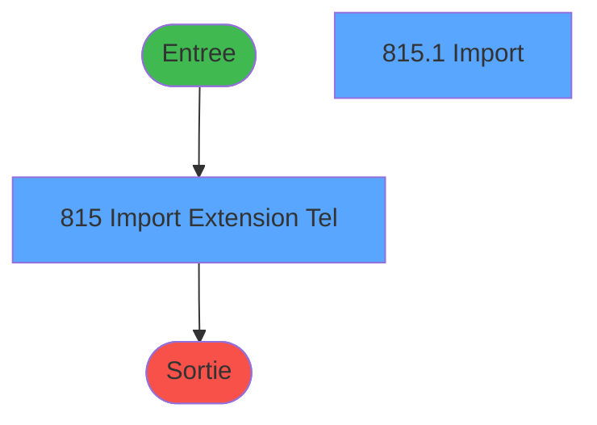
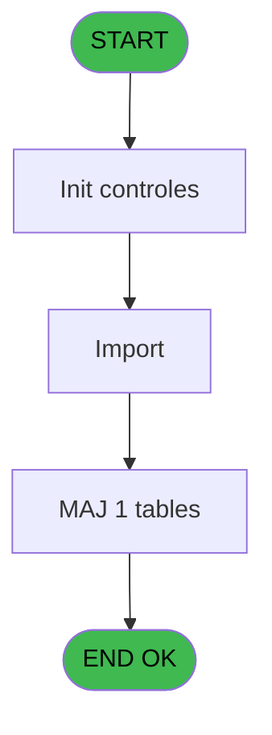

# REF IDE 815 - Import Extension Tel

> **Analyse**: Phases 1-4 2026-02-03 14:32 -> 14:32 (14s) | Assemblage 14:32
> **Pipeline**: V7.2 Enrichi
> **Structure**: 4 onglets (Resume | Ecrans | Donnees | Connexions)

<!-- TAB:Resume -->

## 1. FICHE D'IDENTITE

| Attribut | Valeur |
|----------|--------|
| Projet | REF |
| IDE Position | 815 |
| Nom Programme | Import Extension Tel |
| Fichier source | `Prg_815.xml` |
| Dossier IDE | General |
| Taches | 2 (2 ecrans visibles) |
| Tables modifiees | 1 |
| Programmes appeles | 0 |
| :warning: Statut | **ORPHELIN_POTENTIEL** |

## 2. DESCRIPTION FONCTIONNELLE

**Import Extension Tel** assure la gestion complete de ce processus.

Le flux de traitement s'organise en **1 blocs fonctionnels** :

- **Traitement** (2 taches) : traitements metier divers

**Donnees modifiees** : 1 tables en ecriture (logement_go______lop).

## 3. BLOCS FONCTIONNELS

### 3.1 Traitement (2 taches)

Traitements internes.

---

#### 815 - Import Extension Tel [[ECRAN]](#ecran-t1)

**Role** : Traitement : Import Extension Tel.
**Ecran** : 584 x 83 DLU | [Voir mockup](#ecran-t1)
**Variables liees** : A (v.Fichier Import), B (v.Extension)

---

#### 815.1 - Import [[ECRAN]](#ecran-t2)

**Role** : Traitement : Import.
**Ecran** : 442 x 202 DLU | [Voir mockup](#ecran-t2)
**Variables liees** : A (v.Fichier Import)

## 5. REGLES METIER

*(Aucune regle metier identifiee)*

## 6. CONTEXTE

- **Appele par**: (aucun)
- **Appelle**: 0 programmes | **Tables**: 2 (W:1 R:0 L:1) | **Taches**: 2 | **Expressions**: 3

<!-- TAB:Ecrans -->

## 8. ECRANS

### 8.1 Forms visibles (2 / 2)

| # | Position | Tache | Nom | Type | Largeur | Hauteur | Bloc |
|---|----------|-------|-----|------|---------|---------|------|
| 1 | 815 | 815 | Import Extension Tel | Type0 | 584 | 83 | Traitement |
| 2 | 815.1 | 815.1 | Import | Type0 | 442 | 202 | Traitement |

### 8.2 Mockups Ecrans

---

#### 815 - Import Extension Tel
**Tache** : [815](#t1) | **Type** : Type0 | **Dimensions** : 584 x 83 DLU
**Bloc** : Traitement | **Titre IDE** : Import Extension Tel

<!-- FORM-DATA:
{
    "width":  584,
    "vFactor":  8,
    "type":  "Type0",
    "hFactor":  4,
    "controls":  [
                     {
                         "x":  8,
                         "type":  "edit",
                         "var":  "",
                         "y":  13,
                         "w":  568,
                         "fmt":  "",
                         "name":  "v.Fichier Import",
                         "h":  16,
                         "color":  "",
                         "text":  "",
                         "parent":  null
                     },
                     {
                         "x":  8,
                         "type":  "button",
                         "var":  "",
                         "y":  53,
                         "w":  72,
                         "fmt":  "\u0026Lancer",
                         "name":  "",
                         "h":  16,
                         "color":  "",
                         "text":  "",
                         "parent":  null
                     },
                     {
                         "x":  504,
                         "type":  "button",
                         "var":  "",
                         "y":  53,
                         "w":  72,
                         "fmt":  "\u0026Quitter",
                         "name":  "",
                         "h":  16,
                         "color":  "",
                         "text":  "",
                         "parent":  null
                     }
                 ],
    "taskId":  "815",
    "height":  83
}
-->

<strong>Champs : 1 champs</strong>

| Pos (x,y) | Nom | Variable | Type |
|-----------|-----|----------|------|
| 8,13 | v.Fichier Import | - | edit |

<strong>Boutons : 2 boutons</strong>

| Bouton | Pos (x,y) | Action |
|--------|-----------|--------|
| Lancer | 8,53 | Bouton fonctionnel |
| Quitter | 504,53 | Quitte le programme |

---

#### 815.1 - Import
**Tache** : [815.1](#t2) | **Type** : Type0 | **Dimensions** : 442 x 202 DLU
**Bloc** : Traitement | **Titre IDE** : Import

<!-- FORM-DATA:
{
    "width":  442,
    "vFactor":  8,
    "type":  "Type0",
    "hFactor":  4,
    "controls":  [
                     {
                         "x":  8,
                         "type":  "table",
                         "var":  "",
                         "name":  "",
                         "titleH":  12,
                         "color":  "",
                         "w":  424,
                         "y":  8,
                         "fmt":  "",
                         "parent":  null,
                         "text":  "",
                         "rowH":  13,
                         "h":  184,
                         "cols":  [
                                      {
                                          "title":  "v.Num Chambre",
                                          "layer":  1,
                                          "w":  64
                                      },
                                      {
                                          "title":  "v.Extension",
                                          "layer":  2,
                                          "w":  47
                                      }
                                  ],
                         "rows":  2
                     },
                     {
                         "x":  12,
                         "type":  "edit",
                         "var":  "",
                         "y":  23,
                         "w":  37,
                         "fmt":  "",
                         "name":  "v.Num Chambre",
                         "h":  10,
                         "color":  "",
                         "text":  "",
                         "parent":  1
                     },
                     {
                         "x":  76,
                         "type":  "edit",
                         "var":  "",
                         "y":  23,
                         "w":  37,
                         "fmt":  "",
                         "name":  "v.Extension",
                         "h":  10,
                         "color":  "",
                         "text":  "",
                         "parent":  1
                     }
                 ],
    "taskId":  "815.1",
    "height":  202
}
-->

<strong>Champs : 2 champs</strong>

| Pos (x,y) | Nom | Variable | Type |
|-----------|-----|----------|------|
| 12,23 | v.Num Chambre | - | edit |
| 76,23 | v.Extension | - | edit |

## 9. NAVIGATION

### 9.1 Enchainement des ecrans

**Detail par enchainement :**

| Depuis | Action | Vers | Retour |
|--------|--------|------|--------|

### 9.3 Structure hierarchique (2 taches)

| Position | Tache | Type | Dimensions | Bloc |
|----------|-------|------|------------|------|
| **815.1** | [**Import Extension Tel** (815)](#t1) [mockup](#ecran-t1) | - | 584x83 | Traitement |
| 815.1.1 | [Import (815.1)](#t2) [mockup](#ecran-t2) | - | 442x202 | |

### 9.4 Algorigramme

> **Legende**: Vert = START/END OK | Rouge = END KO | Bleu = Decisions
> *Algorigramme auto-genere. Utiliser `/algorigramme` pour une synthese metier detaillee.*

<!-- TAB:Donnees -->

## 10. TABLES

### Tables utilisees (2)

| ID | Nom | Description | Type | R | W | L | Usages |
|----|-----|-------------|------|---|---|---|--------|
| 102 | logement_go______lop |  | DB |   | **W** |   | 1 |
| 103 | logement_client__loc |  | DB |   |   | L | 1 |

### Colonnes par table (2 / 1 tables avec colonnes identifiees)

Table 102 - logement_go______lop (**W**) - 1 usages

| Lettre | Variable | Acces | Type |
|--------|----------|-------|------|
| A | v.Num Chambre | W | Unicode |
| B | v.Extension | W | Unicode |
| C | v.retour log personnel | W | Logical |
| D | v.retour log client | W | Logical |

## 11. VARIABLES

### 11.1 Variables de session (4)

Variables persistantes pendant toute la session.

| Lettre | Nom | Type | Usage dans |
|--------|-----|------|-----------|
| A | v.Fichier Import | Unicode | - |
| B | v.Extension | Unicode | - |
| C | v.retour log personnel | Logical | - |
| D | v.retour log client | Logical | - |

## 12. EXPRESSIONS

**3 / 3 expressions decodees (100%)**

### 12.1 Repartition par type

| Type | Expressions | Regles |
|------|-------------|--------|
| CALCULATION | 1 | 0 |
| OTHER | 2 | 0 |

### 12.2 Expressions cles par type

#### CALCULATION (1 expressions)

| Type | IDE | Expression | Regle |
|------|-----|------------|-------|
| CALCULATION | 1 | `FileDlg('CSV Files','*.csv')` | - |

#### OTHER (2 expressions)

| Type | IDE | Expression | Regle |
|------|-----|------------|-------|
| OTHER | 3 | `SetCrsr(1)` | - |
| OTHER | 2 | `SetCrsr(2)` | - |

<!-- TAB:Connexions -->

## 13. GRAPHE D'APPELS

### 13.1 Chaine depuis Main (Callers)

**Chemin**: (pas de callers directs)

### 13.2 Callers

| IDE | Nom Programme | Nb Appels |
|-----|---------------|-----------|
| - | (aucun) | - |

### 13.3 Callees (programmes appeles)

### 13.4 Detail Callees avec contexte

| IDE | Nom Programme | Appels | Contexte |
|-----|---------------|--------|----------|
| - | (aucun) | - | - |

## 14. RECOMMANDATIONS MIGRATION

### 14.1 Profil du programme

| Metrique | Valeur | Impact migration |
|----------|--------|-----------------|
| Lignes de logique | 28 | Programme compact |
| Expressions | 3 | Peu de logique |
| Tables WRITE | 1 | Impact faible |
| Sous-programmes | 0 | Peu de dependances |
| Ecrans visibles | 2 | Quelques ecrans |
| Code desactive | 0% (0 / 28) | Code sain |
| Regles metier | 0 | Pas de regle identifiee |

### 14.2 Plan de migration par bloc

#### Traitement (2 taches: 2 ecrans, 0 traitement)

- **Strategie** : 2 composant(s) UI (Razor/React) avec formulaires et validation.
- Decomposer les taches en services unitaires testables.

### 14.3 Dependances critiques

| Dependance | Type | Appels | Impact |
|------------|------|--------|--------|
| logement_go______lop | Table WRITE (Database) | 1x | Schema + repository |

---
*Spec DETAILED generee par Pipeline V7.2 - 2026-02-03 14:32*
