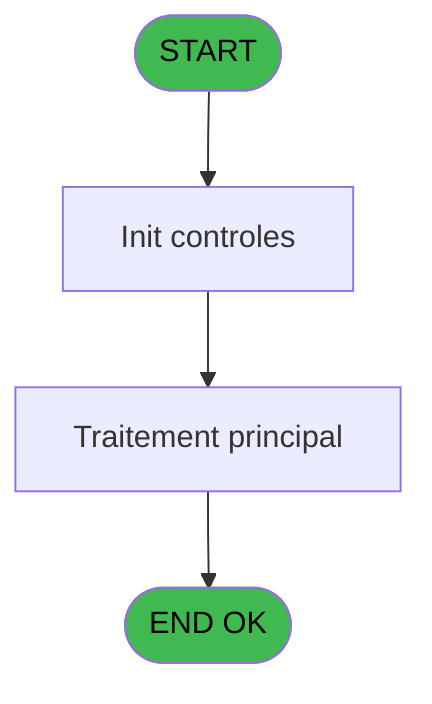

# REF IDE 818 - Converti csv en xlsx / Excel

> **Analyse**: Phases 1-4 2026-02-03 14:33 -> 14:33 (15s) | Assemblage 14:33
> **Pipeline**: V7.2 Enrichi
> **Structure**: 4 onglets (Resume | Ecrans | Donnees | Connexions)

<!-- TAB:Resume -->

## 1. FICHE D'IDENTITE

| Attribut | Valeur |
|----------|--------|
| Projet | REF |
| IDE Position | 818 |
| Nom Programme | Converti csv en xlsx / Excel |
| Fichier source | `Prg_818.xml` |
| Dossier IDE | General |
| Taches | 1 (0 ecrans visibles) |
| Tables modifiees | 0 |
| Programmes appeles | 1 |

## 2. DESCRIPTION FONCTIONNELLE

**Converti csv en xlsx / Excel** assure la gestion complete de ce processus, accessible depuis [Converti csv en xlsx (IDE 816)](REF-IDE-816.md).

Le flux de traitement s'organise en **1 blocs fonctionnels** :

- **Traitement** (1 tache) : traitements metier divers

**Logique metier** : 2 regles identifiees couvrant valeurs par defaut.

## 3. BLOCS FONCTIONNELS

### 3.1 Traitement (1 tache)

Traitements internes.

---

#### 818 - Converti csv en xlsx / Excel

**Role** : Traitement : Converti csv en xlsx / Excel.
**Variables liees** : B (p.io.Destination xlsx), I (v.Object Excel)
**Delegue a** : [Log batch (IDE 829)](REF-IDE-829.md)

## 5. REGLES METIER

2 regles identifiees:

### Autres (2 regles)

#### [RM-001] Valeur par defaut si p.i.Séparateur csv [C] est vide

| Element | Detail |
|---------|--------|
| **Condition** | `p.i.Séparateur csv [C]=''` |
| **Si vrai** | IF(Translate('%club_excel_separator%')='' |
| **Si faux** | ';', Translate('%club_excel_separator%')), p.i.Séparateur csv [C]) |
| **Variables** | C (p.i.Séparateur csv) |
| **Expression source** | Expression 5 : `IF(p.i.Séparateur csv [C]='', IF(Translate('%club_excel_sepa` |
| **Exemple** | Si p.i.Séparateur csv [C]='' → IF(Translate('%club_excel_separator%')='' |

#### [RM-002] Valeur par defaut si p.o.Statut (blanc pour... [D] est vide

| Element | Detail |
|---------|--------|
| **Condition** | `p.o.Statut (blanc pour... [D]=''` |
| **Si vrai** | 'OK' |
| **Si faux** | 'ERR') |
| **Expression source** | Expression 27 : `IF(p.o.Statut (blanc pour... [D]='', 'OK', 'ERR')` |
| **Exemple** | Si p.o.Statut (blanc pour... [D]='' → 'OK'. Sinon → 'ERR') |

## 6. CONTEXTE

- **Appele par**: [Converti csv en xlsx (IDE 816)](REF-IDE-816.md)
- **Appelle**: 1 programmes | **Tables**: 0 (W:0 R:0 L:0) | **Taches**: 1 | **Expressions**: 32

<!-- TAB:Ecrans -->

## 8. ECRANS

*(Programme sans ecran visible)*

## 9. NAVIGATION

### 9.3 Structure hierarchique (1 tache)

| Position | Tache | Type | Dimensions | Bloc |
|----------|-------|------|------------|------|
| **818.1** | [**Converti csv en xlsx / Excel** (818)](#t1) | - | - | Traitement |

### 9.4 Algorigramme

> **Legende**: Vert = START/END OK | Rouge = END KO | Bleu = Decisions
> *Algorigramme auto-genere. Utiliser `/algorigramme` pour une synthese metier detaillee.*

<!-- TAB:Donnees -->

## 10. TABLES

### Tables utilisees (0)

| ID | Nom | Description | Type | R | W | L | Usages |
|----|-----|-------------|------|---|---|---|--------|

### Colonnes par table (0 / 0 tables avec colonnes identifiees)

## 11. VARIABLES

### 11.1 Parametres entrants (4)

Variables recues du programme appelant ([Converti csv en xlsx (IDE 816)](REF-IDE-816.md)).

| Lettre | Nom | Type | Usage dans |
|--------|-----|------|-----------|
| A | p.i.Source csv | Unicode | 9x parametre entrant |
| B | p.io.Destination xlsx | Unicode | [818](#t1) |
| C | p.i.Séparateur csv | Unicode | 1x parametre entrant |
| D | p.o.Statut (blanc pour OK) | Unicode | - |

### 11.2 Variables de session (5)

Variables persistantes pendant toute la session.

| Lettre | Nom | Type | Usage dans |
|--------|-----|------|-----------|
| E | v.Fichier copié en .txt | Unicode | 5x session |
| F | v.Séparateur csv | Unicode | - |
| G | v.Retour opérations fichier | Logical | - |
| H | v.Retour opérations .net | Unicode | 2x session |
| I | v.Object Excel | Blob | - |

## 12. EXPRESSIONS

**32 / 32 expressions decodees (100%)**

### 12.1 Repartition par type

| Type | Expressions | Regles |
|------|-------------|--------|
| CONDITION | 8 | 2 |
| CONSTANTE | 4 | 0 |
| OTHER | 13 | 0 |
| NEGATION | 2 | 0 |
| STRING | 4 | 0 |
| FORMAT | 1 | 0 |

### 12.2 Expressions cles par type

#### CONDITION (8 expressions)

| Type | IDE | Expression | Regle |
|------|-----|------------|-------|
| CONDITION | 27 | `IF(p.o.Statut (blanc pour... [D]='', 'OK', 'ERR')` | [RM-002](#rm-RM-002) |
| CONDITION | 5 | `IF(p.i.Séparateur csv [C]='', IF(Translate('%club_excel_separator%')='', ';', Translate('%club_excel_separator%')), p.i.Séparateur csv [C])` | [RM-001](#rm-RM-001) |
| CONDITION | 12 | `p.o.Statut (blanc pour... [D]=''` | - |
| CONDITION | 23 | `v.Retour opérations .net [H]<>''` | - |
| CONDITION | 22 | `InStr (p.io.Destination xlsx [B],'.xlsx')=0` | - |
| ... | | *+3 autres* | |

#### CONSTANTE (4 expressions)

| Type | IDE | Expression | Regle |
|------|-----|------------|-------|
| CONSTANTE | 30 | `'csv'` | - |
| CONSTANTE | 32 | `'xlsx'` | - |
| CONSTANTE | 14 | `''` | - |
| CONSTANTE | 24 | `'OFFICEWIN'` | - |

#### OTHER (13 expressions)

| Type | IDE | Expression | Regle |
|------|-----|------------|-------|
| OTHER | 26 | `StrBuild ('"@1@" conversion', p.i.Source csv [A])` | - |
| OTHER | 25 | `StrBuild('@1@ : CSV Excel convertion', StrToken (Prog(),1,';'))` | - |
| OTHER | 19 | `INIGet('ThousandSeparator')` | - |
| OTHER | 31 | `File2Blb (p.io.Destination xlsx [B])` | - |
| OTHER | 29 | `File2Blb (p.i.Source csv [A])` | - |
| ... | | *+8 autres* | |

#### NEGATION (2 expressions)

| Type | IDE | Expression | Regle |
|------|-----|------------|-------|
| NEGATION | 21 | `NOT FileExist(p.i.Source csv [A])` | - |
| NEGATION | 13 | `NOT v.Retour opérations fi... [G]` | - |

#### STRING (4 expressions)

| Type | IDE | Expression | Regle |
|------|-----|------------|-------|
| STRING | 17 | `StrBuild (MlsTrans('Erreur copie @1@ en @2@.'), Trim(p.i.Source csv [A]), Trim(v.Fichier copié en .txt [E]))` | - |
| STRING | 20 | `StrBuild (MlsTrans('Erreur appel excel @1@.'), Trim(v.Retour opérations .net [H]))` | - |
| STRING | 1 | `Trim(p.i.Source csv [A]) & '.txt'` | - |
| STRING | 3 | `Trim(p.i.Source csv [A]) & '.xlsx'` | - |

#### FORMAT (1 expressions)

| Type | IDE | Expression | Regle |
|------|-----|------------|-------|
| FORMAT | 2 | `RepStr(RepStr(p.i.Source csv [A], '.csv', '.xlsx'), '.CSV', '.xlsx')` | - |

### 12.3 Toutes les expressions (32)

Voir les 32 expressions

#### CONDITION (8)

| IDE | Expression Decodee |
|-----|-------------------|
| 5 | `IF(p.i.Séparateur csv [C]='', IF(Translate('%club_excel_separator%')='', ';', Translate('%club_excel_separator%')), p.i.Séparateur csv [C])` |
| 27 | `IF(p.o.Statut (blanc pour... [D]='', 'OK', 'ERR')` |
| 4 | `p.io.Destination xlsx [B]=''` |
| 10 | `p.o.Statut (blanc pour... [D]='' AND FileExist(v.Fichier copié en .txt [E])` |
| 11 | `p.o.Statut (blanc pour... [D]='' AND FileExist(p.io.Destination xlsx [B])` |
| 12 | `p.o.Statut (blanc pour... [D]=''` |
| 23 | `v.Retour opérations .net [H]<>''` |
| 22 | `InStr (p.io.Destination xlsx [B],'.xlsx')=0` |

#### CONSTANTE (4)

| IDE | Expression Decodee |
|-----|-------------------|
| 14 | `''` |
| 24 | `'OFFICEWIN'` |
| 30 | `'csv'` |
| 32 | `'xlsx'` |

#### OTHER (13)

| IDE | Expression Decodee |
|-----|-------------------|
| 6 | `FileDelete(v.Fichier copié en .txt [E])` |
| 7 | `FileDelete(p.io.Destination xlsx [B])` |
| 8 | `StrBuild(MlsTrans('Erreur suppression fichier @1@.'), v.Fichier copié en .txt [E])` |
| 9 | `StrBuild (MlsTrans('Erreur suppression fichier @1@.'),p.io.Destination xlsx [B])` |
| 15 | `FileCopy(p.i.Source csv [A], v.Fichier copié en .txt [E])` |
| 16 | `StrBuild (MlsTrans('Erreur fichier introuvable @1@.'), p.i.Source csv [A])` |
| 18 | `INIGet('DecimalSeparator')` |
| 19 | `INIGet('ThousandSeparator')` |
| 25 | `StrBuild('@1@ : CSV Excel convertion', StrToken (Prog(),1,';'))` |
| 26 | `StrBuild ('"@1@" conversion', p.i.Source csv [A])` |
| 28 | `p.o.Statut (blanc pour... [D]` |
| 29 | `File2Blb (p.i.Source csv [A])` |
| 31 | `File2Blb (p.io.Destination xlsx [B])` |

#### NEGATION (2)

| IDE | Expression Decodee |
|-----|-------------------|
| 13 | `NOT v.Retour opérations fi... [G]` |
| 21 | `NOT FileExist(p.i.Source csv [A])` |

#### STRING (4)

| IDE | Expression Decodee |
|-----|-------------------|
| 1 | `Trim(p.i.Source csv [A]) & '.txt'` |
| 3 | `Trim(p.i.Source csv [A]) & '.xlsx'` |
| 17 | `StrBuild (MlsTrans('Erreur copie @1@ en @2@.'), Trim(p.i.Source csv [A]), Trim(v.Fichier copié en .txt [E]))` |
| 20 | `StrBuild (MlsTrans('Erreur appel excel @1@.'), Trim(v.Retour opérations .net [H]))` |

#### FORMAT (1)

| IDE | Expression Decodee |
|-----|-------------------|
| 2 | `RepStr(RepStr(p.i.Source csv [A], '.csv', '.xlsx'), '.CSV', '.xlsx')` |

<!-- TAB:Connexions -->

## 13. GRAPHE D'APPELS

### 13.1 Chaine depuis Main (Callers)

Main -> ... -> [Converti csv en xlsx (IDE 816)](REF-IDE-816.md) -> **Converti csv en xlsx / Excel (IDE 818)**

### 13.2 Callers

| IDE | Nom Programme | Nb Appels |
|-----|---------------|-----------|
| [816](REF-IDE-816.md) | Converti csv en xlsx | 1 |

### 13.3 Callees (programmes appeles)

### 13.4 Detail Callees avec contexte

| IDE | Nom Programme | Appels | Contexte |
|-----|---------------|--------|----------|
| [829](REF-IDE-829.md) | Log batch | 1 | Sous-programme |

## 14. RECOMMANDATIONS MIGRATION

### 14.1 Profil du programme

| Metrique | Valeur | Impact migration |
|----------|--------|-----------------|
| Lignes de logique | 64 | Programme compact |
| Expressions | 32 | Peu de logique |
| Tables WRITE | 0 | Impact faible |
| Sous-programmes | 1 | Peu de dependances |
| Ecrans visibles | 0 | Ecran unique ou traitement batch |
| Code desactive | 0% (0 / 64) | Code sain |
| Regles metier | 2 | Quelques regles a preserver |

### 14.2 Plan de migration par bloc

#### Traitement (1 tache: 0 ecran, 1 traitement)

- **Strategie** : 1 service(s) backend injectable(s) (Domain Services).
- 1 sous-programme(s) a migrer ou a reutiliser depuis les services existants.
- Decomposer les taches en services unitaires testables.

### 14.3 Dependances critiques

| Dependance | Type | Appels | Impact |
|------------|------|--------|--------|
| [Log batch (IDE 829)](REF-IDE-829.md) | Sous-programme | 1x | Normale - Sous-programme |

---
*Spec DETAILED generee par Pipeline V7.2 - 2026-02-03 14:33*
