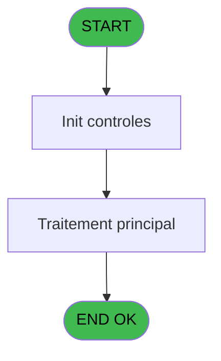
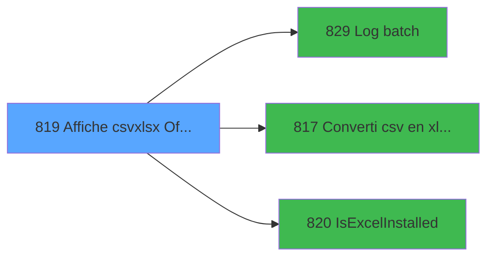

# REF IDE 819 - Affiche csv/xlsx Office Web

> **Analyse**: Phases 1-4 2026-02-03 14:33 -> 14:33 (14s) | Assemblage 14:33
> **Pipeline**: V7.2 Enrichi
> **Structure**: 4 onglets (Resume | Ecrans | Donnees | Connexions)

<!-- TAB:Resume -->

## 1. FICHE D'IDENTITE

| Attribut | Valeur |
|----------|--------|
| Projet | REF |
| IDE Position | 819 |
| Nom Programme | Affiche csv/xlsx Office Web |
| Fichier source | `Prg_819.xml` |
| Dossier IDE | General |
| Taches | 4 (0 ecrans visibles) |
| Tables modifiees | 0 |
| Programmes appeles | 3 |

## 2. DESCRIPTION FONCTIONNELLE

**Affiche csv/xlsx Office Web** assure la gestion complete de ce processus, accessible depuis [Extraction Ca Comptes Archivés (IDE 663)](REF-IDE-663.md).

Le flux de traitement s'organise en **2 blocs fonctionnels** :

- **Traitement** (3 taches) : traitements metier divers
- **Consultation** (1 tache) : ecrans de recherche, selection et consultation

**Logique metier** : 2 regles identifiees couvrant valeurs par defaut.

Detail : phases du traitement

#### Phase 1 : Consultation (1 tache)

- **819** - Affiche csv/xlsx Office Web **[[ECRAN]](#ecran-t1)**

#### Phase 2 : Traitement (3 taches)

- **819.1** - Lecture erreur
- **819.2** - get credentials DSQL
- **819.3** - get credentials DSQL

Delegue a : [Log batch (IDE 829)](REF-IDE-829.md), [Converti csv en xlsx / Exe (IDE 817)](REF-IDE-817.md), [IsExcelInstalled (IDE 820)](REF-IDE-820.md)

## 3. BLOCS FONCTIONNELS

### 3.1 Consultation (1 tache)

Ecrans de recherche et consultation.

---

#### 819 - Affiche csv/xlsx Office Web [[ECRAN]](#ecran-t1)

**Role** : Reinitialisation : Affiche csv/xlsx Office Web.
**Ecran** : 585 x 222 DLU | [Voir mockup](#ecran-t1)
**Variables liees** : A (p.i.Fichier csv/xlsx), D (v.Fichier csv/xlsx (entrée)), E (v.Extension fichier csv/xlsx), I (v.Commande office 365 web), J (v.Cmd office credentials masque)

### 3.2 Traitement (3 taches)

Traitements internes.

---

#### 819.1 - Lecture erreur

**Role** : Traitement : Lecture erreur.
**Delegue a** : [Log batch (IDE 829)](REF-IDE-829.md), [Converti csv en xlsx / Exe (IDE 817)](REF-IDE-817.md), [IsExcelInstalled (IDE 820)](REF-IDE-820.md)

---

#### 819.2 - get credentials DSQL

**Role** : Consultation/chargement : get credentials DSQL.
**Variables liees** : J (v.Cmd office credentials masque), O (v. appel exe avec credentials?), P (v. function credentials exists?), Q (v. credentials)
**Delegue a** : [Log batch (IDE 829)](REF-IDE-829.md), [Converti csv en xlsx / Exe (IDE 817)](REF-IDE-817.md), [IsExcelInstalled (IDE 820)](REF-IDE-820.md)

---

#### 819.3 - get credentials DSQL

**Role** : Consultation/chargement : get credentials DSQL.
**Variables liees** : J (v.Cmd office credentials masque), O (v. appel exe avec credentials?), P (v. function credentials exists?), Q (v. credentials)
**Delegue a** : [Log batch (IDE 829)](REF-IDE-829.md), [Converti csv en xlsx / Exe (IDE 817)](REF-IDE-817.md), [IsExcelInstalled (IDE 820)](REF-IDE-820.md)

## 5. REGLES METIER

2 regles identifiees:

### Autres (2 regles)

#### [RM-001] Valeur par defaut si p.i.Séparateur [B] est vide

| Element | Detail |
|---------|--------|
| **Condition** | `p.i.Séparateur [B]=''` |
| **Si vrai** | ';' |
| **Si faux** | p.i.Séparateur [B]) |
| **Variables** | B (p.i.Séparateur) |
| **Expression source** | Expression 8 : `IF(p.i.Séparateur [B]='', ';', p.i.Séparateur [B])` |
| **Exemple** | Si p.i.Séparateur [B]='' → ';'. Sinon → p.i.Séparateur [B]) |

#### [RM-002] Valeur par defaut si p.o.Statut (blanc pour... [C] est vide

| Element | Detail |
|---------|--------|
| **Condition** | `p.o.Statut (blanc pour... [C]=''` |
| **Si vrai** | 'OK' |
| **Si faux** | 'ERR') |
| **Expression source** | Expression 20 : `IF(p.o.Statut (blanc pour... [C]='', 'OK', 'ERR')` |
| **Exemple** | Si p.o.Statut (blanc pour... [C]='' → 'OK'. Sinon → 'ERR') |

## 6. CONTEXTE

- **Appele par**: [Extraction Ca Comptes Archivés (IDE 663)](REF-IDE-663.md)
- **Appelle**: 3 programmes | **Tables**: 0 (W:0 R:0 L:0) | **Taches**: 4 | **Expressions**: 41

<!-- TAB:Ecrans -->

## 8. ECRANS

*(Programme sans ecran visible)*

## 9. NAVIGATION

### 9.3 Structure hierarchique (4 taches)

| Position | Tache | Type | Dimensions | Bloc |
|----------|-------|------|------------|------|
| **819.1** | [**Affiche csv/xlsx Office Web** (819)](#t1) [mockup](#ecran-t1) | - | 585x222 | Consultation |
| **819.2** | [**Lecture erreur** (819.1)](#t2) | - | - | Traitement |
| 819.2.1 | [get credentials DSQL (819.2)](#t3) | - | - | |
| 819.2.2 | [get credentials DSQL (819.3)](#t7) | - | - | |

### 9.4 Algorigramme

> **Legende**: Vert = START/END OK | Rouge = END KO | Bleu = Decisions
> *Algorigramme auto-genere. Utiliser `/algorigramme` pour une synthese metier detaillee.*

<!-- TAB:Donnees -->

## 10. TABLES

### Tables utilisees (0)

| ID | Nom | Description | Type | R | W | L | Usages |
|----|-----|-------------|------|---|---|---|--------|

### Colonnes par table (0 / 0 tables avec colonnes identifiees)

## 11. VARIABLES

### 11.1 Parametres entrants (3)

Variables recues du programme appelant ([Extraction Ca Comptes Archivés (IDE 663)](REF-IDE-663.md)).

| Lettre | Nom | Type | Usage dans |
|--------|-----|------|-----------|
| A | p.i.Fichier csv/xlsx | Unicode | [819](#t1) |
| B | p.i.Séparateur | Unicode | 1x parametre entrant |
| C | p.o.Statut (blanc pour OK) | Unicode | - |

### 11.2 Variables de session (14)

Variables persistantes pendant toute la session.

| Lettre | Nom | Type | Usage dans |
|--------|-----|------|-----------|
| D | v.Fichier csv/xlsx (entrée) | Unicode | - |
| E | v.Extension fichier csv/xlsx | Unicode | - |
| F | v.Fichier xlsx | Unicode | [819](#t1) |
| G | v.Fichier retour | Unicode | 6x session |
| H | v.Séparateur | Unicode | 1x session |
| I | v.Commande office 365 web | Alpha | [819](#t1) |
| J | v.Cmd office credentials masque | Alpha | - |
| K | v.Excel installé ? | Logical | 2x session |
| L | v.Retour cmd | Numeric | 2x session |
| M | v.Code retour | Unicode | 1x session |
| N | v.Message retour | Unicode | - |
| O | v. appel exe avec credentials? | Logical | - |
| P | v. function credentials exists? | Logical | - |
| Q | v. credentials | Unicode | [819.2](#t3), [819.3](#t7) |

Toutes les 17 variables (liste complete)

| Cat | Lettre | Nom Variable | Type |
|-----|--------|--------------|------|
| P0 | **A** | p.i.Fichier csv/xlsx | Unicode |
| P0 | **B** | p.i.Séparateur | Unicode |
| P0 | **C** | p.o.Statut (blanc pour OK) | Unicode |
| V. | **D** | v.Fichier csv/xlsx (entrée) | Unicode |
| V. | **E** | v.Extension fichier csv/xlsx | Unicode |
| V. | **F** | v.Fichier xlsx | Unicode |
| V. | **G** | v.Fichier retour | Unicode |
| V. | **H** | v.Séparateur | Unicode |
| V. | **I** | v.Commande office 365 web | Alpha |
| V. | **J** | v.Cmd office credentials masque | Alpha |
| V. | **K** | v.Excel installé ? | Logical |
| V. | **L** | v.Retour cmd | Numeric |
| V. | **M** | v.Code retour | Unicode |
| V. | **N** | v.Message retour | Unicode |
| V. | **O** | v. appel exe avec credentials? | Logical |
| V. | **P** | v. function credentials exists? | Logical |
| V. | **Q** | v. credentials | Unicode |

## 12. EXPRESSIONS

**41 / 41 expressions decodees (100%)**

### 12.1 Repartition par type

| Type | Expressions | Regles |
|------|-------------|--------|
| CONDITION | 13 | 2 |
| CALCULATION | 4 | 0 |
| CONSTANTE | 5 | 0 |
| OTHER | 15 | 0 |
| FORMAT | 2 | 0 |
| STRING | 2 | 0 |

### 12.2 Expressions cles par type

#### CONDITION (13 expressions)

| Type | IDE | Expression | Regle |
|------|-----|------------|-------|
| CONDITION | 8 | `IF(p.i.Séparateur [B]='', ';', p.i.Séparateur [B])` | [RM-001](#rm-RM-001) |
| CONDITION | 20 | `IF(p.o.Statut (blanc pour... [C]='', 'OK', 'ERR')` | [RM-002](#rm-RM-002) |
| CONDITION | 13 | `v.Excel installé ? [K]=0` | - |
| CONDITION | 11 | `p.o.Statut (blanc pour... [C]=''` | - |
| CONDITION | 18 | `StrBuild('Excel (@2@) file @1@', v.Fichier xlsx [F], IF(VG46, 'Project', IF(NOT v.Cmd office credentia... [J], 'Undetected', IF( Translate('%DEV%')='O', 'Dev', IF(Translate('%club_force_office_web%')='O','Force', 'Unknown')))))` | - |
| ... | | *+8 autres* | |

#### CALCULATION (4 expressions)

| Type | IDE | Expression | Regle |
|------|-----|------------|-------|
| CALCULATION | 26 | `MID(p.i.Fichier csv/xlsx [A], 2, Len(RTrim(p.i.Fichier csv/xlsx [A]))-2)` | - |
| CALCULATION | 27 | `p.i.Fichier csv/xlsx [A] LIKE '"*"'` | - |
| CALCULATION | 5 | `'cmd /c ' &v.Commande office 365 web [I]` | - |
| CALCULATION | 17 | `StrBuild('@1@ : copy to OneDrive/show in navigator', GetLibelleProg())` | - |

#### CONSTANTE (5 expressions)

| Type | IDE | Expression | Regle |
|------|-----|------------|-------|
| CONSTANTE | 31 | `'OK'` | - |
| CONSTANTE | 39 | `'Office Web setup is not complete. Please contact support'` | - |
| CONSTANTE | 23 | `'txt'` | - |
| CONSTANTE | 14 | `''` | - |
| CONSTANTE | 16 | `'OFFICEWEB'` | - |

#### OTHER (15 expressions)

| Type | IDE | Expression | Regle |
|------|-----|------------|-------|
| OTHER | 32 | `File2Blb (v.Fichier csv/xlsx (en... [D])` | - |
| OTHER | 30 | `StrBuild('CSV file @1@', v.Fichier csv/xlsx (en... [D])` | - |
| OTHER | 29 | `StrBuild('Excel local @1@', p.i.Fichier csv/xlsx [A])` | - |
| OTHER | 34 | `v.Extension fichier cs... [E]` | - |
| OTHER | 41 | `[S]` | - |
| ... | | *+10 autres* | |

#### FORMAT (2 expressions)

| Type | IDE | Expression | Regle |
|------|-----|------------|-------|
| FORMAT | 15 | `StrBuild('Office web 365 error @1@.', Str(v.Excel installé ? [K], 'N5L'))` | - |
| FORMAT | 12 | `RepStr(v.Fichier xlsx [F], '.xlsx', '_o365.txt')` | - |

#### STRING (2 expressions)

| Type | IDE | Expression | Regle |
|------|-----|------------|-------|
| STRING | 33 | `Flip(StrToken(Flip(Trim(v.Fichier csv/xlsx (en... [D])), 1, '.'))` | - |
| STRING | 28 | `Translate(Trim(v.Fichier csv/xlsx (en... [D]))` | - |

### 12.3 Toutes les expressions (41)

Voir les 41 expressions

#### CONDITION (13)

| IDE | Expression Decodee |
|-----|-------------------|
| 3 | `StrBuild(Translate('%club_exe%ITRT.OneDriveFileUpload "@1@" "@2@" > "@3@"  2>&1'), v.Fichier xlsx [F], 'HIDDEN-CREDENTIALS', v.Fichier retour [G])` |
| 40 | `NOT(FileInfo(Translate('%club_exe%ITRT.OneDriveFileUpload.exe'),8)<'01/08/2023'DATE)` |
| 8 | `IF(p.i.Séparateur [B]='', ';', p.i.Séparateur [B])` |
| 20 | `IF(p.o.Statut (blanc pour... [C]='', 'OK', 'ERR')` |
| 1 | `StrBuild(Translate('%club_exe%ITRT.OneDriveFileUpload "@1@" "@2@" > "@3@"  2>&1'), v.Fichier xlsx [F], v. function credential... [P], v.Fichier retour [G])` |
| 2 | `StrBuild(Translate('%club_exe%ITRT.OneDriveFileUpload "@1@" > "@2@"  2>&1'), v.Fichier xlsx [F], v.Fichier retour [G])` |
| 4 | `StrBuild(Translate('%club_exe%ITRT.OneDriveFileUpload "@1@" > "@2@"  2>&1'), v.Fichier xlsx [F], v.Fichier retour [G])` |
| 6 | `v.Cmd office credentia... [J] AND Translate('%DEV%')<>'O' AND Translate('%club_force_office_web%')<>'O'` |
| 11 | `p.o.Statut (blanc pour... [C]=''` |
| 13 | `v.Excel installé ? [K]=0` |
| 18 | `StrBuild('Excel (@2@) file @1@', v.Fichier xlsx [F], IF(VG46, 'Project', IF(NOT v.Cmd office credentia... [J], 'Undetected', IF( Translate('%DEV%')='O', 'Dev', IF(Translate('%club_force_office_web%')='O','Force', 'Unknown')))))` |
| 36 | `v.Retour cmd [L]<>''` |
| 37 | `Lower(v.Extension fichier cs... [E])='xlsx'` |

#### CALCULATION (4)

| IDE | Expression Decodee |
|-----|-------------------|
| 5 | `'cmd /c ' &v.Commande office 365 web [I]` |
| 17 | `StrBuild('@1@ : copy to OneDrive/show in navigator', GetLibelleProg())` |
| 26 | `MID(p.i.Fichier csv/xlsx [A], 2, Len(RTrim(p.i.Fichier csv/xlsx [A]))-2)` |
| 27 | `p.i.Fichier csv/xlsx [A] LIKE '"*"'` |

#### CONSTANTE (5)

| IDE | Expression Decodee |
|-----|-------------------|
| 14 | `''` |
| 16 | `'OFFICEWEB'` |
| 23 | `'txt'` |
| 31 | `'OK'` |
| 39 | `'Office Web setup is not complete. Please contact support'` |

#### OTHER (15)

| IDE | Expression Decodee |
|-----|-------------------|
| 7 | `StrBuild('"@1@"', v.Fichier csv/xlsx (en... [D])` |
| 9 | `v.Fichier csv/xlsx (en... [D]` |
| 10 | `v.Séparateur [H]` |
| 19 | `v. credentials [Q]` |
| 21 | `p.o.Statut (blanc pour... [C]` |
| 22 | `File2Blb (v.Fichier retour [G])` |
| 24 | `FileDelete (v.Fichier retour [G])` |
| 25 | `p.i.Fichier csv/xlsx [A]` |
| 29 | `StrBuild('Excel local @1@', p.i.Fichier csv/xlsx [A])` |
| 30 | `StrBuild('CSV file @1@', v.Fichier csv/xlsx (en... [D])` |
| 32 | `File2Blb (v.Fichier csv/xlsx (en... [D])` |
| 34 | `v.Extension fichier cs... [E]` |
| 35 | `StrBuild('Error @1@ @2@ @3@', v.Retour cmd [L],ASCIIChr (13)&ASCIIChr (10), v.Code retour [M])` |
| 38 | `v. appel exe avec cred... [O]` |
| 41 | `[S]` |

#### FORMAT (2)

| IDE | Expression Decodee |
|-----|-------------------|
| 12 | `RepStr(v.Fichier xlsx [F], '.xlsx', '_o365.txt')` |
| 15 | `StrBuild('Office web 365 error @1@.', Str(v.Excel installé ? [K], 'N5L'))` |

#### STRING (2)

| IDE | Expression Decodee |
|-----|-------------------|
| 28 | `Translate(Trim(v.Fichier csv/xlsx (en... [D]))` |
| 33 | `Flip(StrToken(Flip(Trim(v.Fichier csv/xlsx (en... [D])), 1, '.'))` |

<!-- TAB:Connexions -->

## 13. GRAPHE D'APPELS

### 13.1 Chaine depuis Main (Callers)

Main -> ... -> [Extraction Ca Comptes Archivés (IDE 663)](REF-IDE-663.md) -> **Affiche csv/xlsx Office Web (IDE 819)**

### 13.2 Callers

| IDE | Nom Programme | Nb Appels |
|-----|---------------|-----------|
| [663](REF-IDE-663.md) | Extraction Ca Comptes Archivés | 1 |

### 13.3 Callees (programmes appeles)

### 13.4 Detail Callees avec contexte

| IDE | Nom Programme | Appels | Contexte |
|-----|---------------|--------|----------|
| [829](REF-IDE-829.md) | Log batch | 2 | Sous-programme |
| [817](REF-IDE-817.md) | Converti csv en xlsx / Exe | 1 | Sous-programme |
| [820](REF-IDE-820.md) | IsExcelInstalled | 1 | Sous-programme |

## 14. RECOMMANDATIONS MIGRATION

### 14.1 Profil du programme

| Metrique | Valeur | Impact migration |
|----------|--------|-----------------|
| Lignes de logique | 116 | Programme compact |
| Expressions | 41 | Peu de logique |
| Tables WRITE | 0 | Impact faible |
| Sous-programmes | 3 | Peu de dependances |
| Ecrans visibles | 0 | Ecran unique ou traitement batch |
| Code desactive | 0% (0 / 116) | Code sain |
| Regles metier | 2 | Quelques regles a preserver |

### 14.2 Plan de migration par bloc

#### Consultation (1 tache: 1 ecran, 0 traitement)

- **Strategie** : Composants de recherche/selection en modales.
- 1 ecran : Affiche csv/xlsx Office Web

#### Traitement (3 taches: 0 ecran, 3 traitements)

- **Strategie** : 3 service(s) backend injectable(s) (Domain Services).
- 3 sous-programme(s) a migrer ou a reutiliser depuis les services existants.
- Decomposer les taches en services unitaires testables.

### 14.3 Dependances critiques

| Dependance | Type | Appels | Impact |
|------------|------|--------|--------|
| [Log batch (IDE 829)](REF-IDE-829.md) | Sous-programme | 2x | Haute - Sous-programme |
| [IsExcelInstalled (IDE 820)](REF-IDE-820.md) | Sous-programme | 1x | Normale - Sous-programme |
| [Converti csv en xlsx / Exe (IDE 817)](REF-IDE-817.md) | Sous-programme | 1x | Normale - Sous-programme |

---
*Spec DETAILED generee par Pipeline V7.2 - 2026-02-03 14:33*
