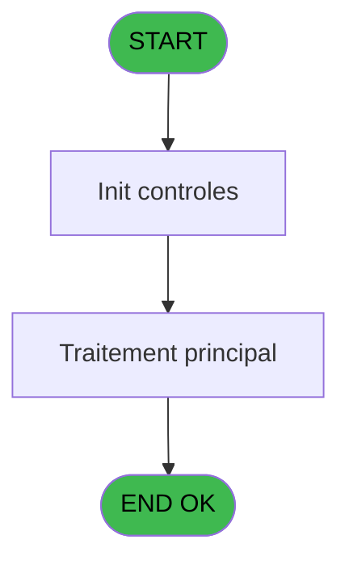

# REF IDE 821 - Converti xlsx en csv

> **Analyse**: Phases 1-4 2026-02-03 14:34 -> 14:34 (15s) | Assemblage 14:34
> **Pipeline**: V7.2 Enrichi
> **Structure**: 4 onglets (Resume | Ecrans | Donnees | Connexions)

<!-- TAB:Resume -->

## 1. FICHE D'IDENTITE

| Attribut | Valeur |
|----------|--------|
| Projet | REF |
| IDE Position | 821 |
| Nom Programme | Converti xlsx en csv |
| Fichier source | `Prg_821.xml` |
| Dossier IDE | General |
| Taches | 1 (0 ecrans visibles) |
| Tables modifiees | 0 |
| Programmes appeles | 1 |
| :warning: Statut | **ORPHELIN_POTENTIEL** |

## 2. DESCRIPTION FONCTIONNELLE

**Converti xlsx en csv** assure la gestion complete de ce processus.

Le flux de traitement s'organise en **1 blocs fonctionnels** :

- **Traitement** (1 tache) : traitements metier divers

**Logique metier** : 2 regles identifiees couvrant valeurs par defaut.

## 3. BLOCS FONCTIONNELS

### 3.1 Traitement (1 tache)

Traitements internes.

---

#### 821 - Converti xlsx / Exe [[ECRAN]](#ecran-t1)

**Role** : Traitement : Converti xlsx / Exe.
**Ecran** : 585 x 222 DLU | [Voir mockup](#ecran-t1)
**Variables liees** : A (p.i.Fichier xlsx), F (v.Commande convertir)
**Delegue a** : [Log batch (IDE 829)](REF-IDE-829.md)

## 5. REGLES METIER

2 regles identifiees:

### Autres (2 regles)

#### [RM-001] Valeur par defaut si p.o.Statut (blanc pour... [D] est vide

| Element | Detail |
|---------|--------|
| **Condition** | `p.o.Statut (blanc pour... [D]=''` |
| **Si vrai** | 'OK' |
| **Si faux** | 'ERR') |
| **Expression source** | Expression 17 : `IF(p.o.Statut (blanc pour... [D]='', 'OK', 'ERR')` |
| **Exemple** | Si p.o.Statut (blanc pour... [D]='' → 'OK'. Sinon → 'ERR') |

#### [RM-002] Valeur par defaut si p.i.Séparateur [C] est vide

| Element | Detail |
|---------|--------|
| **Condition** | `p.i.Séparateur [C]=''` |
| **Si vrai** | IF(Translate('%club_excel_separator%')='' |
| **Si faux** | ';', Translate('%club_excel_separator%')), p.i.Séparateur [C]) |
| **Variables** | C (p.i.Séparateur) |
| **Expression source** | Expression 24 : `IF(p.i.Séparateur [C]='', IF(Translate('%club_excel_separato` |
| **Exemple** | Si p.i.Séparateur [C]='' → IF(Translate('%club_excel_separator%')='' |

## 6. CONTEXTE

- **Appele par**: (aucun)
- **Appelle**: 1 programmes | **Tables**: 0 (W:0 R:0 L:0) | **Taches**: 1 | **Expressions**: 25

<!-- TAB:Ecrans -->

## 8. ECRANS

*(Programme sans ecran visible)*

## 9. NAVIGATION

### 9.3 Structure hierarchique (1 tache)

| Position | Tache | Type | Dimensions | Bloc |
|----------|-------|------|------------|------|
| **821.1** | [**Converti xlsx / Exe** (821)](#t1) [mockup](#ecran-t1) | - | 585x222 | Traitement |

### 9.4 Algorigramme

> **Legende**: Vert = START/END OK | Rouge = END KO | Bleu = Decisions
> *Algorigramme auto-genere. Utiliser `/algorigramme` pour une synthese metier detaillee.*

<!-- TAB:Donnees -->

## 10. TABLES

### Tables utilisees (0)

| ID | Nom | Description | Type | R | W | L | Usages |
|----|-----|-------------|------|---|---|---|--------|

### Colonnes par table (0 / 0 tables avec colonnes identifiees)

## 11. VARIABLES

### 11.1 Parametres entrants (4)

Variables recues en parametre.

| Lettre | Nom | Type | Usage dans |
|--------|-----|------|-----------|
| A | p.i.Fichier xlsx | Unicode | [821](#t1) |
| B | p.o.Fichier csv | Unicode | 4x parametre entrant |
| C | p.i.Séparateur | Unicode | 1x parametre entrant |
| D | p.o.Statut (blanc pour OK) | Unicode | - |

### 11.2 Variables de session (4)

Variables persistantes pendant toute la session.

| Lettre | Nom | Type | Usage dans |
|--------|-----|------|-----------|
| E | v.Séparateur | Unicode | 1x session |
| F | v.Commande convertir | Alpha | 2x session |
| G | v.Retour cmd | Numeric | 2x session |
| H | v.Fichier retour | Unicode | 3x session |

## 12. EXPRESSIONS

**25 / 25 expressions decodees (100%)**

### 12.1 Repartition par type

| Type | Expressions | Regles |
|------|-------------|--------|
| CALCULATION | 1 | 0 |
| CONDITION | 4 | 2 |
| CONSTANTE | 6 | 0 |
| NEGATION | 2 | 0 |
| OTHER | 9 | 0 |
| FORMAT | 3 | 0 |

### 12.2 Expressions cles par type

#### CALCULATION (1 expressions)

| Type | IDE | Expression | Regle |
|------|-----|------------|-------|
| CALCULATION | 5 | `'cmd /c ' &v.Commande convertir [F]` | - |

#### CONDITION (4 expressions)

| Type | IDE | Expression | Regle |
|------|-----|------------|-------|
| CONDITION | 24 | `IF(p.i.Séparateur [C]='', IF(Translate('%club_excel_separator%')='', ';', Translate('%club_excel_separator%')), p.i.Séparateur [C])` | [RM-002](#rm-RM-002) |
| CONDITION | 17 | `IF(p.o.Statut (blanc pour... [D]='', 'OK', 'ERR')` | [RM-001](#rm-RM-001) |
| CONDITION | 6 | `v.Retour cmd [G]<>0` | - |
| CONDITION | 4 | `StrBuild(Translate('%club_exe%ITRT.ExcelToCsvConverter.exe "@1@" @2@ > "@3@"  2>&1'), p.i.Fichier xlsx [A], v.Séparateur [E], v.Fichier retour [H])` | - |

#### CONSTANTE (6 expressions)

| Type | IDE | Expression | Regle |
|------|-----|------------|-------|
| CONSTANTE | 18 | `'xlsx'` | - |
| CONSTANTE | 20 | `'csv'` | - |
| CONSTANTE | 22 | `'txt'` | - |
| CONSTANTE | 1 | `'C:\temp\test_csv2.xlsx'` | - |
| CONSTANTE | 10 | `''` | - |
| ... | | *+1 autres* | |

#### NEGATION (2 expressions)

| Type | IDE | Expression | Regle |
|------|-----|------------|-------|
| NEGATION | 9 | `NOT FileExist (p.o.Fichier csv [B])` | - |
| NEGATION | 8 | `NOT FileExist (p.i.Fichier xlsx [A])` | - |

#### OTHER (9 expressions)

| Type | IDE | Expression | Regle |
|------|-----|------------|-------|
| OTHER | 21 | `File2Blb (p.o.Fichier csv [B])` | - |
| OTHER | 19 | `File2Blb (p.i.Fichier xlsx [A])` | - |
| OTHER | 25 | `FileDelete (v.Fichier retour [H])` | - |
| OTHER | 23 | `File2Blb (v.Fichier retour [H])` | - |
| OTHER | 16 | `v.Commande convertir [F]` | - |
| ... | | *+4 autres* | |

#### FORMAT (3 expressions)

| Type | IDE | Expression | Regle |
|------|-----|------------|-------|
| FORMAT | 7 | `StrBuild('XLSX conversion error @1@', Str(v.Retour cmd [G], 'N3L'))` | - |
| FORMAT | 3 | `RepStr(p.o.Fichier csv [B], '.csv', '_xlsx_cnv_return.txt')` | - |
| FORMAT | 2 | `RepStr(p.i.Fichier xlsx [A], '.xlsx', '.csv')` | - |

### 12.3 Toutes les expressions (25)

Voir les 25 expressions

#### CALCULATION (1)

| IDE | Expression Decodee |
|-----|-------------------|
| 5 | `'cmd /c ' &v.Commande convertir [F]` |

#### CONDITION (4)

| IDE | Expression Decodee |
|-----|-------------------|
| 17 | `IF(p.o.Statut (blanc pour... [D]='', 'OK', 'ERR')` |
| 24 | `IF(p.i.Séparateur [C]='', IF(Translate('%club_excel_separator%')='', ';', Translate('%club_excel_separator%')), p.i.Séparateur [C])` |
| 4 | `StrBuild(Translate('%club_exe%ITRT.ExcelToCsvConverter.exe "@1@" @2@ > "@3@"  2>&1'), p.i.Fichier xlsx [A], v.Séparateur [E], v.Fichier retour [H])` |
| 6 | `v.Retour cmd [G]<>0` |

#### CONSTANTE (6)

| IDE | Expression Decodee |
|-----|-------------------|
| 1 | `'C:\temp\test_csv2.xlsx'` |
| 10 | `''` |
| 13 | `'OFFICEWEB'` |
| 18 | `'xlsx'` |
| 20 | `'csv'` |
| 22 | `'txt'` |

#### NEGATION (2)

| IDE | Expression Decodee |
|-----|-------------------|
| 8 | `NOT FileExist (p.i.Fichier xlsx [A])` |
| 9 | `NOT FileExist (p.o.Fichier csv [B])` |

#### OTHER (9)

| IDE | Expression Decodee |
|-----|-------------------|
| 11 | `StrBuild('CSV file @1@ not found', p.o.Fichier csv [B])` |
| 12 | `StrBuild('Unable to find input file @1@.', p.i.Fichier xlsx [A])` |
| 14 | `StrBuild('@1@ : XLSX to CSV convertion', GetLibelleProg())` |
| 15 | `StrBuild ('"@1@" conversion', p.i.Fichier xlsx [A])` |
| 16 | `v.Commande convertir [F]` |
| 19 | `File2Blb (p.i.Fichier xlsx [A])` |
| 21 | `File2Blb (p.o.Fichier csv [B])` |
| 23 | `File2Blb (v.Fichier retour [H])` |
| 25 | `FileDelete (v.Fichier retour [H])` |

#### FORMAT (3)

| IDE | Expression Decodee |
|-----|-------------------|
| 2 | `RepStr(p.i.Fichier xlsx [A], '.xlsx', '.csv')` |
| 3 | `RepStr(p.o.Fichier csv [B], '.csv', '_xlsx_cnv_return.txt')` |
| 7 | `StrBuild('XLSX conversion error @1@', Str(v.Retour cmd [G], 'N3L'))` |

<!-- TAB:Connexions -->

## 13. GRAPHE D'APPELS

### 13.1 Chaine depuis Main (Callers)

**Chemin**: (pas de callers directs)

### 13.2 Callers

| IDE | Nom Programme | Nb Appels |
|-----|---------------|-----------|
| - | (aucun) | - |

### 13.3 Callees (programmes appeles)

### 13.4 Detail Callees avec contexte

| IDE | Nom Programme | Appels | Contexte |
|-----|---------------|--------|----------|
| [829](REF-IDE-829.md) | Log batch | 1 | Sous-programme |

## 14. RECOMMANDATIONS MIGRATION

### 14.1 Profil du programme

| Metrique | Valeur | Impact migration |
|----------|--------|-----------------|
| Lignes de logique | 44 | Programme compact |
| Expressions | 25 | Peu de logique |
| Tables WRITE | 0 | Impact faible |
| Sous-programmes | 1 | Peu de dependances |
| Ecrans visibles | 0 | Ecran unique ou traitement batch |
| Code desactive | 0% (0 / 44) | Code sain |
| Regles metier | 2 | Quelques regles a preserver |

### 14.2 Plan de migration par bloc

#### Traitement (1 tache: 1 ecran, 0 traitement)

- **Strategie** : 1 composant(s) UI (Razor/React) avec formulaires et validation.
- 1 sous-programme(s) a migrer ou a reutiliser depuis les services existants.
- Decomposer les taches en services unitaires testables.

### 14.3 Dependances critiques

| Dependance | Type | Appels | Impact |
|------------|------|--------|--------|
| [Log batch (IDE 829)](REF-IDE-829.md) | Sous-programme | 1x | Normale - Sous-programme |

---
*Spec DETAILED generee par Pipeline V7.2 - 2026-02-03 14:34*
