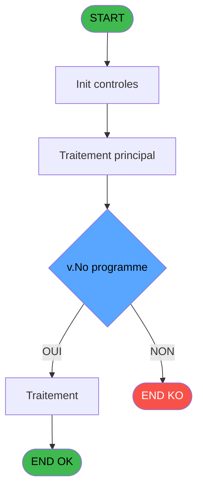
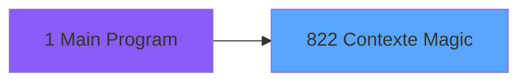
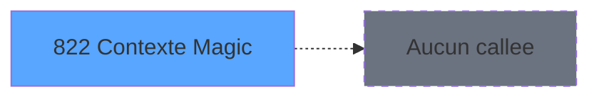

# REF IDE 822 - Contexte Magic

> **Analyse**: Phases 1-4 2026-02-03 14:34 -> 14:34 (15s) | Assemblage 14:34
> **Pipeline**: V7.2 Enrichi
> **Structure**: 4 onglets (Resume | Ecrans | Donnees | Connexions)

<!-- TAB:Resume -->

## 1. FICHE D'IDENTITE

| Attribut | Valeur |
|----------|--------|
| Projet | REF |
| IDE Position | 822 |
| Nom Programme | Contexte Magic |
| Fichier source | `Prg_822.xml` |
| Dossier IDE | General |
| Taches | 2 (1 ecrans visibles) |
| Tables modifiees | 0 |
| Programmes appeles | 0 |

## 2. DESCRIPTION FONCTIONNELLE

**Contexte Magic** assure la gestion complete de ce processus, accessible depuis [Main Program (IDE 1)](REF-IDE-1.md).

Le flux de traitement s'organise en **1 blocs fonctionnels** :

- **Traitement** (2 taches) : traitements metier divers

**Logique metier** : 2 regles identifiees couvrant valeurs par defaut.

## 3. BLOCS FONCTIONNELS

### 3.1 Traitement (2 taches)

Traitements internes.

---

#### 822 - Contexte Magic [[ECRAN]](#ecran-t1)

**Role** : Traitement : Contexte Magic.
**Ecran** : 306 x 170 DLU | [Voir mockup](#ecran-t1)

---

#### 822.1 - Village/Cloture

**Role** : Traitement : Village/Cloture.

## 5. REGLES METIER

2 regles identifiees:

### Autres (2 regles)

#### [RM-001] Valeur par defaut si v.Display Liste [G] est vide

| Element | Detail |
|---------|--------|
| **Condition** | `v.Display Liste [G]=''` |
| **Si vrai** | '' |
| **Si faux** | RTrim(v.Display Liste [G]) & ',') &IF(v.No programme [E]=0, '\-\-\-', '') &RTrim(v.Item escapé [D]) & IF(v.No programme [E]=0, '', ' (' & Trim(Str(v.No programme [E], '5')) & ')') |
| **Variables** | C (v.Item), D (v.Item escapé), E (v.No programme), G (v.Display Liste) |
| **Expression source** | Expression 7 : `IF(v.Display Liste [G]='', '', RTrim(v.Display Liste [G]) & ` |
| **Exemple** | Si v.Display Liste [G]='' → '' |

#### [RM-002] Valeur par defaut si v.Item Liste [H] est vide

| Element | Detail |
|---------|--------|
| **Condition** | `v.Item Liste [H]=''` |
| **Si vrai** | '' |
| **Si faux** | RTrim(v.Item Liste [H]) & ',') & v.Item escapé [D] |
| **Variables** | C (v.Item), D (v.Item escapé), H (v.Item Liste) |
| **Expression source** | Expression 8 : `IF(v.Item Liste [H]='', '', RTrim(v.Item Liste [H]) & ',') &` |
| **Exemple** | Si v.Item Liste [H]='' → ''. Sinon → RTrim(v.Item Liste [H]) & ',') & v.Item escapé [D] |

## 6. CONTEXTE

- **Appele par**: [Main Program (IDE 1)](REF-IDE-1.md)
- **Appelle**: 0 programmes | **Tables**: 2 (W:0 R:1 L:1) | **Taches**: 2 | **Expressions**: 14

<!-- TAB:Ecrans -->

## 8. ECRANS

### 8.1 Forms visibles (1 / 2)

| # | Position | Tache | Nom | Type | Largeur | Hauteur | Bloc |
|---|----------|-------|-----|------|---------|---------|------|
| 1 | 822 | 822 | Contexte Magic | Type0 | 306 | 170 | Traitement |

### 8.2 Mockups Ecrans

---

#### 822 - Contexte Magic
**Tache** : [822](#t1) | **Type** : Type0 | **Dimensions** : 306 x 170 DLU
**Bloc** : Traitement | **Titre IDE** : Contexte Magic

<!-- FORM-DATA:
{
    "width":  306,
    "vFactor":  8,
    "type":  "Type0",
    "hFactor":  4,
    "controls":  [
                     {
                         "x":  1,
                         "type":  "listbox",
                         "var":  "",
                         "y":  0,
                         "w":  304,
                         "fmt":  "",
                         "name":  "LISTE_ECRAN",
                         "h":  144,
                         "color":  "",
                         "text":  "Item 1, Item 2",
                         "parent":  null
                     },
                     {
                         "x":  1,
                         "type":  "edit",
                         "var":  "",
                         "y":  144,
                         "w":  304,
                         "fmt":  "80",
                         "name":  "",
                         "h":  10,
                         "color":  "",
                         "text":  "",
                         "parent":  null
                     },
                     {
                         "x":  1,
                         "type":  "edit",
                         "var":  "",
                         "y":  156,
                         "w":  304,
                         "fmt":  "",
                         "name":  "v.Village / Cloture",
                         "h":  10,
                         "color":  "",
                         "text":  "",
                         "parent":  null
                     }
                 ],
    "taskId":  "822",
    "height":  170
}
-->

<strong>Champs : 2 champs</strong>

| Pos (x,y) | Nom | Variable | Type |
|-----------|-----|----------|------|
| 1,144 | 80 | - | edit |
| 1,156 | v.Village / Cloture | - | edit |

## 9. NAVIGATION

Ecran unique: **Contexte Magic**

### 9.3 Structure hierarchique (2 taches)

| Position | Tache | Type | Dimensions | Bloc |
|----------|-------|------|------------|------|
| **822.1** | [**Contexte Magic** (822)](#t1) [mockup](#ecran-t1) | - | 306x170 | Traitement |
| 822.1.1 | [Village/Cloture (822.1)](#t2) | - | - | |

### 9.4 Algorigramme

> **Legende**: Vert = START/END OK | Rouge = END KO | Bleu = Decisions
> *Algorigramme auto-genere. Utiliser `/algorigramme` pour une synthese metier detaillee.*

<!-- TAB:Donnees -->

## 10. TABLES

### Tables utilisees (2)

| ID | Nom | Description | Type | R | W | L | Usages |
|----|-----|-------------|------|---|---|---|--------|
| 70 | date_comptable___dat |  | DB | R |   |   | 1 |
| 368 | pms_village |  | DB |   |   | L | 1 |

### Colonnes par table (1 / 1 tables avec colonnes identifiees)

Table 70 - date_comptable___dat (R) - 1 usages

*Table utilisee uniquement en Link ou aucune colonne Real identifiee dans le DataView.*

## 11. VARIABLES

### 11.1 Variables de session (9)

Variables persistantes pendant toute la session.

| Lettre | Nom | Type | Usage dans |
|--------|-----|------|-----------|
| A | v.Prog | Unicode | 2x session |
| B | v.Nb prog/subtask | Numeric | 1x session |
| C | v.Item | Unicode | 5x session |
| D | v.Item escapé | Unicode | 2x session |
| E | v.No programme | Numeric | 1x session |
| F | v.Affichage | Unicode | 1x session |
| G | v.Display Liste | Unicode | 2x session |
| H | v.Item Liste | Unicode | 2x session |
| I | v.Village / Cloture | Unicode | - |

## 12. EXPRESSIONS

**14 / 14 expressions decodees (100%)**

### 12.1 Repartition par type

| Type | Expressions | Regles |
|------|-------------|--------|
| FORMAT | 1 | 0 |
| CONDITION | 3 | 2 |
| OTHER | 8 | 0 |
| CAST_LOGIQUE | 1 | 0 |
| STRING | 1 | 0 |

### 12.2 Expressions cles par type

#### FORMAT (1 expressions)

| Type | IDE | Expression | Regle |
|------|-----|------------|-------|
| FORMAT | 5 | `RepStr(RepStr(RepStr(v.Item [C], '\', '\\'),',', '\,'), '-', '\-')` | - |

#### CONDITION (3 expressions)

| Type | IDE | Expression | Regle |
|------|-----|------------|-------|
| CONDITION | 8 | `IF(v.Item Liste [H]='', '', RTrim(v.Item Liste [H]) & ',') & v.Item escapé [D]` | [RM-002](#rm-RM-002) |
| CONDITION | 7 | `IF(v.Display Liste [G]='', '', RTrim(v.Display Liste [G]) & ',') &IF(v.No programme [E]=0, '\-\-\-', '') &RTrim(v.Item escapé [D]) & IF(v.No programme [E]=0, '', ' (' & Trim(Str(v.No programme [E], '5')) & ')')` | [RM-001](#rm-RM-001) |
| CONDITION | 3 | `LoopCounter()<v.Nb prog/subtask [B]` | - |

#### OTHER (8 expressions)

| Type | IDE | Expression | Regle |
|------|-----|------------|-------|
| OTHER | 12 | `ClipWrite()` | - |
| OTHER | 10 | `v.Display Liste [G]` | - |
| OTHER | 14 | `Translate(StrBuild('Poste : @1@, @2@, SQL server @3@ : @4@', GetHostName(), StrToken(Translate(INIGet('StartApplication')), 1, '\') , StrToken(StrToken(INIGet('[MAGIC_DATABASES]Pms'),5, ','), 1, '\'), StrToken(INIGet('[MAGIC_DATABASES]Pms'),3, ',')))` | - |
| OTHER | 13 | `StrBuild('@1@ (@2@)', AppName(), ProjectDir ())` | - |
| OTHER | 2 | `StrTokenCnt(v.Prog [A], ';')` | - |
| ... | | *+3 autres* | |

#### CAST_LOGIQUE (1 expressions)

| Type | IDE | Expression | Regle |
|------|-----|------------|-------|
| CAST_LOGIQUE | 6 | `ProgIdx (v.Item [C],'FALSE'LOG)` | - |

#### STRING (1 expressions)

| Type | IDE | Expression | Regle |
|------|-----|------------|-------|
| STRING | 11 | `ClipAdd (v.Affichage [F],Fill('X', Len(RTrim(v.Affichage [F]))))` | - |

<!-- TAB:Connexions -->

## 13. GRAPHE D'APPELS

### 13.1 Chaine depuis Main (Callers)

Main -> ... -> [Main Program (IDE 1)](REF-IDE-1.md) -> **Contexte Magic (IDE 822)**

### 13.2 Callers

| IDE | Nom Programme | Nb Appels |
|-----|---------------|-----------|
| [1](REF-IDE-1.md) | Main Program | 1 |

### 13.3 Callees (programmes appeles)

### 13.4 Detail Callees avec contexte

| IDE | Nom Programme | Appels | Contexte |
|-----|---------------|--------|----------|
| - | (aucun) | - | - |

## 14. RECOMMANDATIONS MIGRATION

### 14.1 Profil du programme

| Metrique | Valeur | Impact migration |
|----------|--------|-----------------|
| Lignes de logique | 48 | Programme compact |
| Expressions | 14 | Peu de logique |
| Tables WRITE | 0 | Impact faible |
| Sous-programmes | 0 | Peu de dependances |
| Ecrans visibles | 1 | Ecran unique ou traitement batch |
| Code desactive | 0% (0 / 48) | Code sain |
| Regles metier | 2 | Quelques regles a preserver |

### 14.2 Plan de migration par bloc

#### Traitement (2 taches: 1 ecran, 1 traitement)

- **Strategie** : Orchestrateur avec 1 ecrans (Razor/React) et 1 traitements backend (services).
- Les ecrans deviennent des composants UI, les traitements invisibles deviennent des services injectables.
- Decomposer les taches en services unitaires testables.

### 14.3 Dependances critiques

| Dependance | Type | Appels | Impact |
|------------|------|--------|--------|

---
*Spec DETAILED generee par Pipeline V7.2 - 2026-02-03 14:34*
