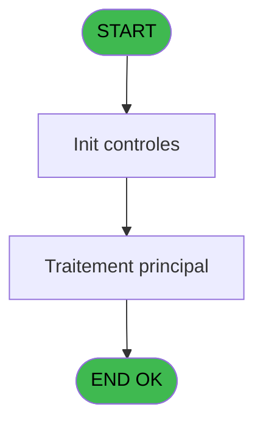

# REF IDE 823 - Cherche libellé prog()

> **Analyse**: Phases 1-4 2026-02-03 14:34 -> 14:35 (14s) | Assemblage 14:35
> **Pipeline**: V7.2 Enrichi
> **Structure**: 4 onglets (Resume | Ecrans | Donnees | Connexions)

<!-- TAB:Resume -->

## 1. FICHE D'IDENTITE

| Attribut | Valeur |
|----------|--------|
| Projet | REF |
| IDE Position | 823 |
| Nom Programme | Cherche libellé prog() |
| Fichier source | `Prg_823.xml` |
| Dossier IDE | General |
| Taches | 1 (0 ecrans visibles) |
| Tables modifiees | 0 |
| Programmes appeles | 0 |

## 2. DESCRIPTION FONCTIONNELLE

**Cherche libellé prog()** assure la gestion complete de ce processus, accessible depuis [Recalcul des effectifs (IDE 814)](REF-IDE-814.md).

Le flux de traitement s'organise en **1 blocs fonctionnels** :

- **Traitement** (1 tache) : traitements metier divers

**Logique metier** : 1 regles identifiees couvrant conditions metier.

## 3. BLOCS FONCTIONNELS

### 3.1 Traitement (1 tache)

Traitements internes.

---

#### 823 - Cherche libellé prog()

**Role** : Traitement : Cherche libellé prog().

## 5. REGLES METIER

1 regles identifiees:

### Autres (1 regles)

#### [RM-001] Si RTrim(v.Prog modifié [E]) = '' alors '' sinon RTrim(v.Prog modifié [E])& ';') & v.Item [C]

| Element | Detail |
|---------|--------|
| **Condition** | `RTrim(v.Prog modifié [E]) = ''` |
| **Si vrai** | '' |
| **Si faux** | RTrim(v.Prog modifié [E])& ';') & v.Item [C] |
| **Variables** | A (v.Prog), C (v.Item), E (v.Prog modifié) |
| **Expression source** | Expression 10 : `IF(RTrim(v.Prog modifié [E]) = '', '', RTrim(v.Prog modifié ` |
| **Exemple** | Si RTrim(v.Prog modifié [E]) = '' → ''. Sinon → RTrim(v.Prog modifié [E])& ';') & v.Item [C] |

## 6. CONTEXTE

- **Appele par**: [Recalcul des effectifs (IDE 814)](REF-IDE-814.md)
- **Appelle**: 0 programmes | **Tables**: 0 (W:0 R:0 L:0) | **Taches**: 1 | **Expressions**: 12

<!-- TAB:Ecrans -->

## 8. ECRANS

*(Programme sans ecran visible)*

## 9. NAVIGATION

### 9.3 Structure hierarchique (1 tache)

| Position | Tache | Type | Dimensions | Bloc |
|----------|-------|------|------------|------|
| **823.1** | [**Cherche libellé prog()** (823)](#t1) | - | - | Traitement |

### 9.4 Algorigramme

> **Legende**: Vert = START/END OK | Rouge = END KO | Bleu = Decisions
> *Algorigramme auto-genere. Utiliser `/algorigramme` pour une synthese metier detaillee.*

<!-- TAB:Donnees -->

## 10. TABLES

### Tables utilisees (0)

| ID | Nom | Description | Type | R | W | L | Usages |
|----|-----|-------------|------|---|---|---|--------|

### Colonnes par table (0 / 0 tables avec colonnes identifiees)

## 11. VARIABLES

### 11.1 Variables de session (7)

Variables persistantes pendant toute la session.

| Lettre | Nom | Type | Usage dans |
|--------|-----|------|-----------|
| A | v.Prog | Unicode | 8x session |
| B | v.PROG (màjusc) | Unicode | 1x session |
| C | v.Item | Unicode | 2x session |
| D | v.ITEM (majusc) | Unicode | 1x session |
| E | v.Prog modifié | Unicode | 3x session |
| F | v.Taille | Numeric | 2x session |
| G | v.Return | Unicode | 1x session |

## 12. EXPRESSIONS

**12 / 12 expressions decodees (100%)**

### 12.1 Repartition par type

| Type | Expressions | Regles |
|------|-------------|--------|
| CALCULATION | 1 | 0 |
| CONDITION | 3 | 5 |
| OTHER | 7 | 0 |
| FORMAT | 1 | 0 |

### 12.2 Expressions cles par type

#### CALCULATION (1 expressions)

| Type | IDE | Expression | Regle |
|------|-----|------------|-------|
| CALCULATION | 3 | `StrTokenCnt (v.Prog [A],';')-2` | - |

#### CONDITION (3 expressions)

| Type | IDE | Expression | Regle |
|------|-----|------------|-------|
| CONDITION | 10 | `IF(RTrim(v.Prog modifié [E]) = '', '', RTrim(v.Prog modifié [E])& ';') & v.Item [C]` | [RM-001](#rm-RM-001) |
| CONDITION | 12 | `v.Prog modifié [E]=''` | - |
| CONDITION | 9 | `LoopCounter()<=v.Taille [F]` | - |

#### OTHER (7 expressions)

| Type | IDE | Expression | Regle |
|------|-----|------------|-------|
| OTHER | 6 | `v.Return [G]` | - |
| OTHER | 7 | `StrToken (v.PROG (màjusc) [B],LoopCounter(),';')` | - |
| OTHER | 8 | `StrToken (v.Prog [A],LoopCounter(),';')` | - |
| OTHER | 5 | `StrToken(v.Prog modifié [E], 1, ';')` | - |
| OTHER | 1 | `Prog()` | - |
| ... | | *+2 autres* | |

#### FORMAT (1 expressions)

| Type | IDE | Expression | Regle |
|------|-----|------------|-------|
| FORMAT | 11 | `InStr(v.ITEM (majusc) [D], 'START')=0 AND InStr(v.ITEM (majusc) [D], 'MENU')=0` | - |

<!-- TAB:Connexions -->

## 13. GRAPHE D'APPELS

### 13.1 Chaine depuis Main (Callers)

Main -> ... -> [Recalcul des effectifs (IDE 814)](REF-IDE-814.md) -> **Cherche libellé prog() (IDE 823)**

### 13.2 Callers

| IDE | Nom Programme | Nb Appels |
|-----|---------------|-----------|
| [814](REF-IDE-814.md) | Recalcul des effectifs | 1 |

### 13.3 Callees (programmes appeles)

### 13.4 Detail Callees avec contexte

| IDE | Nom Programme | Appels | Contexte |
|-----|---------------|--------|----------|
| - | (aucun) | - | - |

## 14. RECOMMANDATIONS MIGRATION

### 14.1 Profil du programme

| Metrique | Valeur | Impact migration |
|----------|--------|-----------------|
| Lignes de logique | 29 | Programme compact |
| Expressions | 12 | Peu de logique |
| Tables WRITE | 0 | Impact faible |
| Sous-programmes | 0 | Peu de dependances |
| Ecrans visibles | 0 | Ecran unique ou traitement batch |
| Code desactive | 0% (0 / 29) | Code sain |
| Regles metier | 1 | Quelques regles a preserver |

### 14.2 Plan de migration par bloc

#### Traitement (1 tache: 0 ecran, 1 traitement)

- **Strategie** : 1 service(s) backend injectable(s) (Domain Services).
- Decomposer les taches en services unitaires testables.

### 14.3 Dependances critiques

| Dependance | Type | Appels | Impact |
|------------|------|--------|--------|

---
*Spec DETAILED generee par Pipeline V7.2 - 2026-02-03 14:35*
