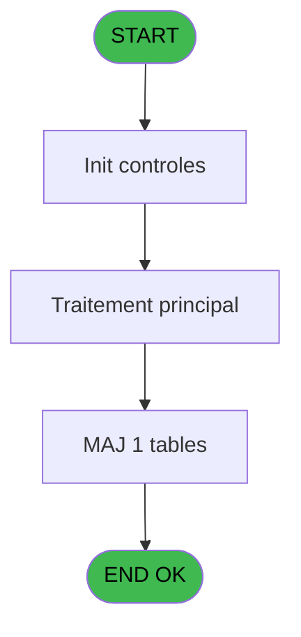
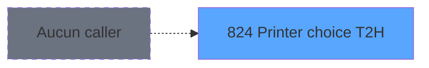
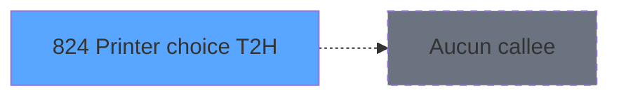

# REF IDE 824 - Printer choice T2H

> **Analyse**: Phases 1-4 2026-02-03 14:35 -> 14:35 (13s) | Assemblage 14:35
> **Pipeline**: V7.2 Enrichi
> **Structure**: 4 onglets (Resume | Ecrans | Donnees | Connexions)

<!-- TAB:Resume -->

## 1. FICHE D'IDENTITE

| Attribut | Valeur |
|----------|--------|
| Projet | REF |
| IDE Position | 824 |
| Nom Programme | Printer choice T2H |
| Fichier source | `Prg_824.xml` |
| Dossier IDE | Impression |
| Taches | 6 (1 ecrans visibles) |
| Tables modifiees | 1 |
| Programmes appeles | 0 |
| :warning: Statut | **ORPHELIN_POTENTIEL** |

## 2. DESCRIPTION FONCTIONNELLE

**Printer choice T2H** assure la gestion complete de ce processus.

Le flux de traitement s'organise en **2 blocs fonctionnels** :

- **Impression** (5 taches) : generation de tickets et documents
- **Traitement** (1 tache) : traitements metier divers

**Donnees modifiees** : 1 tables en ecriture (pms_print_param).

Detail : phases du traitement

#### Phase 1 : Impression (5 taches)

- **824** - Printer choice T2H **[[ECRAN]](#ecran-t1)**
- **824.1** - Printer choice T2H **[[ECRAN]](#ecran-t2)**
- **824.1.2** - Printer Choice **[[ECRAN]](#ecran-t4)**
- **824.1.2.1** - Maj printparam
- **824.1.2.2** - Maj printparam

#### Phase 2 : Traitement (1 tache)

- **824.1.1** - Load

#### Tables impactees

| Table | Operations | Role metier |
|-------|-----------|-------------|
| pms_print_param | **W**/L (4 usages) |  |

## 3. BLOCS FONCTIONNELS

### 3.1 Impression (5 taches)

Generation des documents et tickets.

---

#### 824 - Printer choice T2H [[ECRAN]](#ecran-t1)

**Role** : Generation du document : Printer choice T2H.
**Ecran** : 366 x 0 DLU (Type6) | [Voir mockup](#ecran-t1)

4 sous-taches directes

| Tache | Nom | Bloc |
|-------|-----|------|
| [824.1](#t2) | Printer choice T2H **[[ECRAN]](#ecran-t2)** | Impression |
| [824.1.2](#t4) | Printer Choice **[[ECRAN]](#ecran-t4)** | Impression |
| [824.1.2.1](#t5) | Maj printparam | Impression |
| [824.1.2.2](#t6) | Maj printparam | Impression |

**Variables liees** : H (v.Printer choice activé ?)

---

#### 824.1 - Printer choice T2H [[ECRAN]](#ecran-t2)

**Role** : Generation du document : Printer choice T2H.
**Ecran** : 366 x 0 DLU (Type6) | [Voir mockup](#ecran-t2)
**Variables liees** : H (v.Printer choice activé ?)

---

#### 824.1.2 - Printer Choice [[ECRAN]](#ecran-t4)

**Role** : Generation du document : Printer Choice.
**Ecran** : 770 x 257 DLU (MDI) | [Voir mockup](#ecran-t4)
**Variables liees** : H (v.Printer choice activé ?)

---

#### 824.1.2.1 - Maj printparam

**Role** : Generation du document : Maj printparam.

---

#### 824.1.2.2 - Maj printparam

**Role** : Generation du document : Maj printparam.

### 3.2 Traitement (1 tache)

Traitements internes.

---

#### 824.1.1 - Load

**Role** : Traitement : Load.

## 5. REGLES METIER

*(Aucune regle metier identifiee)*

## 6. CONTEXTE

- **Appele par**: (aucun)
- **Appelle**: 0 programmes | **Tables**: 5 (W:1 R:2 L:4) | **Taches**: 6 | **Expressions**: 1

<!-- TAB:Ecrans -->

## 8. ECRANS

### 8.1 Forms visibles (1 / 6)

| # | Position | Tache | Nom | Type | Largeur | Hauteur | Bloc |
|---|----------|-------|-----|------|---------|---------|------|
| 1 | 824.1.2 | 824.1.2 | Printer Choice | MDI | 770 | 257 | Impression |

### 8.2 Mockups Ecrans

---

#### 824.1.2 - Printer Choice
**Tache** : [824.1.2](#t4) | **Type** : MDI | **Dimensions** : 770 x 257 DLU
**Bloc** : Impression | **Titre IDE** : Printer Choice

<!-- FORM-DATA:
{
    "width":  770,
    "vFactor":  8,
    "type":  "MDI",
    "hFactor":  8,
    "controls":  [
                     {
                         "x":  8,
                         "type":  "label",
                         "var":  "",
                         "y":  167,
                         "w":  165,
                         "fmt":  "",
                         "name":  "",
                         "h":  12,
                         "color":  "",
                         "text":  "Default printer",
                         "parent":  null
                     },
                     {
                         "x":  8,
                         "type":  "label",
                         "var":  "",
                         "y":  181,
                         "w":  165,
                         "fmt":  "",
                         "name":  "",
                         "h":  12,
                         "color":  "",
                         "text":  "Current listing",
                         "parent":  null
                     },
                     {
                         "x":  8,
                         "type":  "label",
                         "var":  "",
                         "y":  195,
                         "w":  165,
                         "fmt":  "",
                         "name":  "",
                         "h":  12,
                         "color":  "",
                         "text":  "Current printer",
                         "parent":  null
                     },
                     {
                         "x":  8,
                         "type":  "label",
                         "var":  "",
                         "y":  209,
                         "w":  165,
                         "fmt":  "",
                         "name":  "",
                         "h":  12,
                         "color":  "",
                         "text":  "Current copies",
                         "parent":  null
                     },
                     {
                         "x":  10,
                         "type":  "table",
                         "var":  "",
                         "name":  "",
                         "titleH":  12,
                         "color":  "110",
                         "w":  742,
                         "y":  8,
                         "fmt":  "",
                         "parent":  null,
                         "text":  "",
                         "rowH":  14,
                         "h":  154,
                         "cols":  [
                                      {
                                          "title":  "Chrono",
                                          "layer":  1,
                                          "w":  78
                                      },
                                      {
                                          "title":  "Libellé",
                                          "layer":  2,
                                          "w":  431
                                      },
                                      {
                                          "title":  "Tray",
                                          "layer":  3,
                                          "w":  49
                                      },
                                      {
                                          "title":  "Copies",
                                          "layer":  4,
                                          "w":  69
                                      },
                                      {
                                          "title":  "Choice",
                                          "layer":  5,
                                          "w":  82
                                      }
                                  ],
                         "rows":  5
                     },
                     {
                         "x":  506,
                         "type":  "button",
                         "var":  "",
                         "y":  236,
                         "w":  240,
                         "fmt":  "",
                         "name":  "NoChangeAndExitButton",
                         "h":  16,
                         "color":  "",
                         "text":  "",
                         "parent":  null
                     },
                     {
                         "x":  194,
                         "type":  "edit",
                         "var":  "",
                         "y":  167,
                         "w":  549,
                         "fmt":  "",
                         "name":  "",
                         "h":  12,
                         "color":  "146",
                         "text":  "",
                         "parent":  null
                     },
                     {
                         "x":  194,
                         "type":  "edit",
                         "var":  "",
                         "y":  195,
                         "w":  549,
                         "fmt":  "",
                         "name":  "",
                         "h":  12,
                         "color":  "144",
                         "text":  "",
                         "parent":  null
                     },
                     {
                         "x":  18,
                         "type":  "edit",
                         "var":  "",
                         "y":  22,
                         "w":  62,
                         "fmt":  "",
                         "name":  "",
                         "h":  12,
                         "color":  "110",
                         "text":  "",
                         "parent":  9
                     },
                     {
                         "x":  96,
                         "type":  "edit",
                         "var":  "",
                         "y":  22,
                         "w":  421,
                         "fmt":  "",
                         "name":  "",
                         "h":  12,
                         "color":  "110",
                         "text":  "",
                         "parent":  9
                     },
                     {
                         "x":  525,
                         "type":  "edit",
                         "var":  "",
                         "y":  22,
                         "w":  40,
                         "fmt":  "1Z",
                         "name":  "",
                         "h":  12,
                         "color":  "110",
                         "text":  "",
                         "parent":  9
                     },
                     {
                         "x":  575,
                         "type":  "edit",
                         "var":  "",
                         "y":  22,
                         "w":  59,
                         "fmt":  "",
                         "name":  "Copies",
                         "h":  12,
                         "color":  "110",
                         "text":  "",
                         "parent":  9
                     },
                     {
                         "x":  643,
                         "type":  "button",
                         "var":  "",
                         "y":  22,
                         "w":  72,
                         "fmt":  "",
                         "name":  "Choice",
                         "h":  12,
                         "color":  "",
                         "text":  "",
                         "parent":  9
                     },
                     {
                         "x":  194,
                         "type":  "edit",
                         "var":  "",
                         "y":  181,
                         "w":  549,
                         "fmt":  "64",
                         "name":  "",
                         "h":  12,
                         "color":  "144",
                         "text":  "",
                         "parent":  null
                     },
                     {
                         "x":  194,
                         "type":  "edit",
                         "var":  "",
                         "y":  209,
                         "w":  56,
                         "fmt":  "4",
                         "name":  "",
                         "h":  12,
                         "color":  "144",
                         "text":  "",
                         "parent":  null
                     },
                     {
                         "x":  8,
                         "type":  "checkbox",
                         "var":  "",
                         "y":  237,
                         "w":  370,
                         "fmt":  "",
                         "name":  "v.Sauver le choix",
                         "h":  12,
                         "color":  "",
                         "text":  "Choice as default",
                         "parent":  null
                     }
                 ],
    "taskId":  "824.1.2",
    "height":  257
}
-->

<strong>Champs : 9 champs</strong>

| Pos (x,y) | Nom | Variable | Type |
|-----------|-----|----------|------|
| 194,167 | (sans nom) | - | edit |
| 194,195 | (sans nom) | - | edit |
| 18,22 | (sans nom) | - | edit |
| 96,22 | (sans nom) | - | edit |
| 525,22 | 1Z | - | edit |
| 575,22 | Copies | - | edit |
| 194,181 | 64 | - | edit |
| 194,209 | 4 | - | edit |
| 8,237 | v.Sauver le choix | - | checkbox |

<strong>Boutons : 2 boutons</strong>

| Bouton | Pos (x,y) | Action |
|--------|-----------|--------|
| NoChangeAndExitButton | 506,236 | Modifie l'element Quitte le programme |
| Choice | 643,22 | Bouton fonctionnel |

## 9. NAVIGATION

Ecran unique: **Printer Choice**

### 9.3 Structure hierarchique (6 taches)

| Position | Tache | Type | Dimensions | Bloc |
|----------|-------|------|------------|------|
| **824.1** | [**Printer choice T2H** (824)](#t1) [mockup](#ecran-t1) | Type6 | 366x0 | Impression |
| 824.1.1 | [Printer choice T2H (824.1)](#t2) [mockup](#ecran-t2) | Type6 | 366x0 | |
| 824.1.2 | [Printer Choice (824.1.2)](#t4) [mockup](#ecran-t4) | MDI | 770x257 | |
| 824.1.3 | [Maj printparam (824.1.2.1)](#t5) | - | - | |
| 824.1.4 | [Maj printparam (824.1.2.2)](#t6) | - | - | |
| **824.2** | [**Load** (824.1.1)](#t3) | MDI | - | Traitement |

### 9.4 Algorigramme

> **Legende**: Vert = START/END OK | Rouge = END KO | Bleu = Decisions
> *Algorigramme auto-genere. Utiliser `/algorigramme` pour une synthese metier detaillee.*

<!-- TAB:Donnees -->

## 10. TABLES

### Tables utilisees (5)

| ID | Nom | Description | Type | R | W | L | Usages |
|----|-----|-------------|------|---|---|---|--------|
| 363 | pms_listing |  | DB | R |   |   | 3 |
| 365 | pms_printer |  | DB | R |   | L | 2 |
| 366 | pms_print_param |  | DB |   | **W** | L | 4 |
| 367 | pms_print_param_default |  | DB |   |   | L | 1 |
| 566 | pms_printer_choice |  | TMP |   |   | L | 2 |

### Colonnes par table (5 / 3 tables avec colonnes identifiees)

Table 363 - pms_listing (R) - 3 usages

| Lettre | Variable | Acces | Type |
|--------|----------|-------|------|
| A | v.Host parameter set ? | R | Logical |
| B | v.Defaut parameter set ? | R | Logical |
| C | v.Libellé prn sél | R | Unicode |
| D | v.Sauver le choix | R | Logical |
| E | v.Bouton save choice | R | Unicode |

Table 365 - pms_printer (R/L) - 2 usages

| Lettre | Variable | Acces | Type |
|--------|----------|-------|------|
| A | v.EndprinterChoice | R | Logical |
| B | v.Util variables gloables | R | Logical |
| C | v.Impression | R | Numeric |
| D | v.Paramétrage édition saisi ? | R | Logical |
| E | v.Imprimante paramétrée | R | Numeric |
| F | v.Imprimante sélectionnée | R | Numeric |
| G | v.Nb copies sélectionnées | R | Numeric |
| H | v.Printer choice activé ? | R | Logical |
| I | v.Regr comptes dépôt | R | Alpha |
| J | v.Regr extraites compte | R | Alpha |
| K | v.Regr téléphone | R | Alpha |
| L | v.Edition en cours | R | Alpha |
| M | v.In  effectif | R | Alpha |
| N | v.Libelle imp prm | R | Unicode |
| O | v.Libellé prn sél | R | Unicode |

Table 366 - pms_print_param (**W**/L) - 4 usages

| Lettre | Variable | Acces | Type |
|--------|----------|-------|------|
| A | v.EndprinterChoice | W | Logical |
| B | v.Defaut parameter set ? | W | Logical |
| D | v.Paramétrage édition saisi ? | W | Logical |
| E | v.Imprimante paramétrée | W | Numeric |
| H | v.Printer choice activé ? | W | Logical |

## 11. VARIABLES

### 11.1 Parametres entrants (5)

Variables recues en parametre.

| Lettre | Nom | Type | Usage dans |
|--------|-----|------|-----------|
| A | p.i.ViensDe | Alpha | - |
| B | p.i.Impression (NULL) | Numeric | - |
| C | p.i.Affiche si non définie | Logical | - |
| D | p.o.Imprimante | Numeric | - |
| E | p.o.Nb copies | Numeric | - |

### 11.2 Variables de session (10)

Variables persistantes pendant toute la session.

| Lettre | Nom | Type | Usage dans |
|--------|-----|------|-----------|
| F | v.Imprimante sélectionnée | Numeric | - |
| G | v.Nb copies sélectionnées | Numeric | - |
| H | v.Printer choice activé ? | Logical | - |
| I | v.Regr comptes dépôt | Alpha | - |
| J | v.Regr extraites compte | Alpha | - |
| K | v.Regr téléphone | Alpha | - |
| L | v.Edition en cours | Alpha | - |
| M | v.In  effectif | Alpha | - |
| N | v.Libelle imp prm | Unicode | - |
| O | v.Libellé prn sél | Unicode | - |

## 12. EXPRESSIONS

**1 / 1 expressions decodees (100%)**

### 12.1 Repartition par type

| Type | Expressions | Regles |
|------|-------------|--------|
| REFERENCE_VG | 1 | 0 |

### 12.2 Expressions cles par type

#### REFERENCE_VG (1 expressions)

| Type | IDE | Expression | Regle |
|------|-----|------------|-------|
| REFERENCE_VG | 1 | `VG29` | - |

<!-- TAB:Connexions -->

## 13. GRAPHE D'APPELS

### 13.1 Chaine depuis Main (Callers)

**Chemin**: (pas de callers directs)

### 13.2 Callers

| IDE | Nom Programme | Nb Appels |
|-----|---------------|-----------|
| - | (aucun) | - |

### 13.3 Callees (programmes appeles)

### 13.4 Detail Callees avec contexte

| IDE | Nom Programme | Appels | Contexte |
|-----|---------------|--------|----------|
| - | (aucun) | - | - |

## 14. RECOMMANDATIONS MIGRATION

### 14.1 Profil du programme

| Metrique | Valeur | Impact migration |
|----------|--------|-----------------|
| Lignes de logique | 233 | Taille moyenne |
| Expressions | 1 | Peu de logique |
| Tables WRITE | 1 | Impact faible |
| Sous-programmes | 0 | Peu de dependances |
| Ecrans visibles | 1 | Ecran unique ou traitement batch |
| Code desactive | 0% (0 / 233) | Code sain |
| Regles metier | 0 | Pas de regle identifiee |

### 14.2 Plan de migration par bloc

#### Impression (5 taches: 3 ecrans, 2 traitements)

- **Strategie** : Templates HTML -> PDF via wkhtmltopdf ou Puppeteer.
- `PrintService` injectable avec choix imprimante

#### Traitement (1 tache: 0 ecran, 1 traitement)

- **Strategie** : 1 service(s) backend injectable(s) (Domain Services).
- Decomposer les taches en services unitaires testables.

### 14.3 Dependances critiques

| Dependance | Type | Appels | Impact |
|------------|------|--------|--------|
| pms_print_param | Table WRITE (Database) | 1x | Schema + repository |

---
*Spec DETAILED generee par Pipeline V7.2 - 2026-02-03 14:35*
