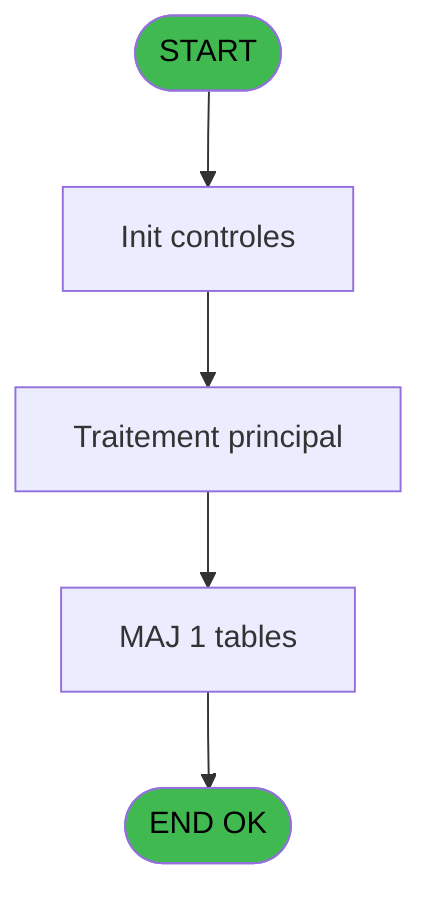
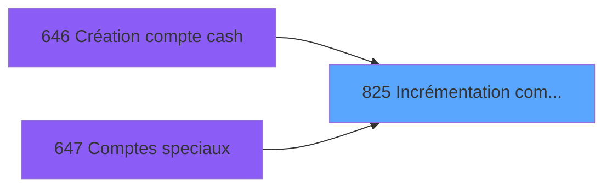

# REF IDE 825 - Incrémentation compteur num

> **Analyse**: Phases 1-4 2026-02-03 14:35 -> 14:35 (13s) | Assemblage 14:35
> **Pipeline**: V7.2 Enrichi
> **Structure**: 4 onglets (Resume | Ecrans | Donnees | Connexions)

<!-- TAB:Resume -->

## 1. FICHE D'IDENTITE

| Attribut | Valeur |
|----------|--------|
| Projet | REF |
| IDE Position | 825 |
| Nom Programme | Incrémentation compteur num |
| Fichier source | `Prg_825.xml` |
| Dossier IDE | Comptabilite |
| Taches | 3 (0 ecrans visibles) |
| Tables modifiees | 1 |
| Programmes appeles | 0 |

## 2. DESCRIPTION FONCTIONNELLE

**Incrémentation compteur num** assure la gestion complete de ce processus, accessible depuis [Création compte cash (IDE 646)](REF-IDE-646.md), [Comptes speciaux (IDE 647)](REF-IDE-647.md).

Le flux de traitement s'organise en **2 blocs fonctionnels** :

- **Calcul** (2 taches) : calculs de montants, stocks ou compteurs
- **Traitement** (1 tache) : traitements metier divers

**Donnees modifiees** : 1 tables en ecriture (compteurs________cpt).

**Logique metier** : 2 regles identifiees couvrant conditions metier.

Detail : phases du traitement

#### Phase 1 : Calcul (2 taches)

- **825** - Incrémentation compteur num
- **825.1** - Contrôle n° compte TODO **[[ECRAN]](#ecran-t2)**

#### Phase 2 : Traitement (1 tache)

- **825.2** - Contrôle n° adhérent **[[ECRAN]](#ecran-t3)**

#### Tables impactees

| Table | Operations | Role metier |
|-------|-----------|-------------|
| compteurs________cpt | **W** (1 usages) | Comptes GM (generaux) |

## 3. BLOCS FONCTIONNELS

### 3.1 Calcul (2 taches)

Calculs metier : montants, stocks, compteurs.

---

#### 825 - Incrémentation compteur num

**Role** : Calcul : Incrémentation compteur num.
**Variables liees** : B (p.i.Nom compteur)

---

#### 825.1 - Contrôle n° compte TODO [[ECRAN]](#ecran-t2)

**Role** : Traitement : Contrôle n° compte TODO.
**Ecran** : 291 x 195 DLU | [Voir mockup](#ecran-t2)
**Variables liees** : B (p.i.Nom compteur)

### 3.2 Traitement (1 tache)

Traitements internes.

---

#### 825.2 - Contrôle n° adhérent [[ECRAN]](#ecran-t3)

**Role** : Traitement : Contrôle n° adhérent.
**Ecran** : 123 x 195 DLU | [Voir mockup](#ecran-t3)

## 5. REGLES METIER

2 regles identifiees:

### Autres (2 regles)

#### [RM-001] Si [F]>VG89 alors 0 sinon [F]+1)

| Element | Detail |
|---------|--------|
| **Condition** | `[F]>VG89` |
| **Si vrai** | 0 |
| **Si faux** | [F]+1) |
| **Expression source** | Expression 6 : `IF([F]>VG89, 0, [F]+1)` |
| **Exemple** | Si [F]>VG89 → 0. Sinon → [F]+1) |

#### [RM-002] Si [F]>499900 alors 100 sinon [F]+1)

| Element | Detail |
|---------|--------|
| **Condition** | `[F]>499900` |
| **Si vrai** | 100 |
| **Si faux** | [F]+1) |
| **Expression source** | Expression 7 : `IF([F]>499900, 100, [F]+1)` |
| **Exemple** | Si [F]>499900 → 100. Sinon → [F]+1) |

## 6. CONTEXTE

- **Appele par**: [Création compte cash (IDE 646)](REF-IDE-646.md), [Comptes speciaux (IDE 647)](REF-IDE-647.md)
- **Appelle**: 0 programmes | **Tables**: 1 (W:1 R:0 L:0) | **Taches**: 3 | **Expressions**: 7

<!-- TAB:Ecrans -->

## 8. ECRANS

*(Programme sans ecran visible)*

## 9. NAVIGATION

### 9.3 Structure hierarchique (3 taches)

| Position | Tache | Type | Dimensions | Bloc |
|----------|-------|------|------------|------|
| **825.1** | [**Incrémentation compteur num** (825)](#t1) | - | - | Calcul |
| 825.1.1 | [Contrôle n° compte TODO (825.1)](#t2) [mockup](#ecran-t2) | - | 291x195 | |
| **825.2** | [**Contrôle n° adhérent** (825.2)](#t3) [mockup](#ecran-t3) | - | 123x195 | Traitement |

### 9.4 Algorigramme

> **Legende**: Vert = START/END OK | Rouge = END KO | Bleu = Decisions
> *Algorigramme auto-genere. Utiliser `/algorigramme` pour une synthese metier detaillee.*

<!-- TAB:Donnees -->

## 10. TABLES

### Tables utilisees (1)

| ID | Nom | Description | Type | R | W | L | Usages |
|----|-----|-------------|------|---|---|---|--------|
| 68 | compteurs________cpt | Comptes GM (generaux) | DB |   | **W** |   | 1 |

### Colonnes par table (1 / 1 tables avec colonnes identifiees)

Table 68 - compteurs________cpt (**W**) - 1 usages

| Lettre | Variable | Acces | Type |
|--------|----------|-------|------|
| A | p.i.Société | W | Unicode |
| B | p.i.Nom compteur | W | Unicode |
| C | p.o.Nouveau numéro | W | Numeric |

## 11. VARIABLES

### 11.1 Parametres entrants (3)

Variables recues du programme appelant ([Création compte cash (IDE 646)](REF-IDE-646.md)).

| Lettre | Nom | Type | Usage dans |
|--------|-----|------|-----------|
| A | p.i.Société | Unicode | 1x parametre entrant |
| B | p.i.Nom compteur | Unicode | [825](#t1) |
| C | p.o.Nouveau numéro | Numeric | - |

### 11.2 Autres (1)

Variables diverses.

| Lettre | Nom | Type | Usage dans |
|--------|-----|------|-----------|
| D | max_gm | Numeric | - |

## 12. EXPRESSIONS

**7 / 7 expressions decodees (100%)**

### 12.1 Repartition par type

| Type | Expressions | Regles |
|------|-------------|--------|
| CONDITION | 4 | 2 |
| OTHER | 3 | 0 |

### 12.2 Expressions cles par type

#### CONDITION (4 expressions)

| Type | IDE | Expression | Regle |
|------|-----|------------|-------|
| CONDITION | 7 | `IF([F]>499900, 100, [F]+1)` | [RM-002](#rm-RM-002) |
| CONDITION | 6 | `IF([F]>VG89, 0, [F]+1)` | [RM-001](#rm-RM-001) |
| CONDITION | 5 | `p.i.Nom compteur [B]='CCREA'` | - |
| CONDITION | 4 | `p.i.Nom compteur [B]='CCPT'` | - |

#### OTHER (3 expressions)

| Type | IDE | Expression | Regle |
|------|-----|------------|-------|
| OTHER | 3 | `[F]` | - |
| OTHER | 2 | `p.i.Nom compteur [B]` | - |
| OTHER | 1 | `p.i.Société [A]` | - |

<!-- TAB:Connexions -->

## 13. GRAPHE D'APPELS

### 13.1 Chaine depuis Main (Callers)

Main -> ... -> [Création compte cash (IDE 646)](REF-IDE-646.md) -> **Incrémentation compteur num (IDE 825)**

Main -> ... -> [Comptes speciaux (IDE 647)](REF-IDE-647.md) -> **Incrémentation compteur num (IDE 825)**

### 13.2 Callers

| IDE | Nom Programme | Nb Appels |
|-----|---------------|-----------|
| [646](REF-IDE-646.md) | Création compte cash | 1 |
| [647](REF-IDE-647.md) | Comptes speciaux | 1 |

### 13.3 Callees (programmes appeles)

### 13.4 Detail Callees avec contexte

| IDE | Nom Programme | Appels | Contexte |
|-----|---------------|--------|----------|
| - | (aucun) | - | - |

## 14. RECOMMANDATIONS MIGRATION

### 14.1 Profil du programme

| Metrique | Valeur | Impact migration |
|----------|--------|-----------------|
| Lignes de logique | 60 | Programme compact |
| Expressions | 7 | Peu de logique |
| Tables WRITE | 1 | Impact faible |
| Sous-programmes | 0 | Peu de dependances |
| Ecrans visibles | 0 | Ecran unique ou traitement batch |
| Code desactive | 0% (0 / 60) | Code sain |
| Regles metier | 2 | Quelques regles a preserver |

### 14.2 Plan de migration par bloc

#### Calcul (2 taches: 1 ecran, 1 traitement)

- **Strategie** : Services de calcul purs (Domain Services).
- Migrer la logique de calcul (stock, compteurs, montants)

#### Traitement (1 tache: 1 ecran, 0 traitement)

- **Strategie** : 1 composant(s) UI (Razor/React) avec formulaires et validation.
- Decomposer les taches en services unitaires testables.

### 14.3 Dependances critiques

| Dependance | Type | Appels | Impact |
|------------|------|--------|--------|
| compteurs________cpt | Table WRITE (Database) | 1x | Schema + repository |

---
*Spec DETAILED generee par Pipeline V7.2 - 2026-02-03 14:35*
