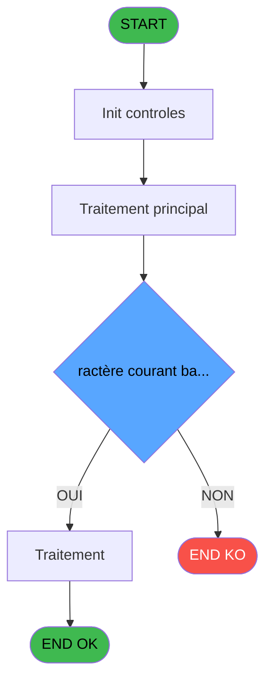
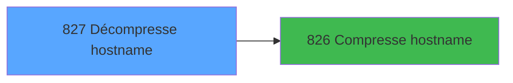

# REF IDE 827 - Décompresse hostname

> **Analyse**: Phases 1-4 2026-02-03 14:36 -> 14:36 (13s) | Assemblage 14:36
> **Pipeline**: V7.2 Enrichi
> **Structure**: 4 onglets (Resume | Ecrans | Donnees | Connexions)

<!-- TAB:Resume -->

## 1. FICHE D'IDENTITE

| Attribut | Valeur |
|----------|--------|
| Projet | REF |
| IDE Position | 827 |
| Nom Programme | Décompresse hostname |
| Fichier source | `Prg_827.xml` |
| Dossier IDE | General |
| Taches | 1 (1 ecrans visibles) |
| Tables modifiees | 0 |
| Programmes appeles | 1 |
| :warning: Statut | **ORPHELIN_POTENTIEL** |

## 2. DESCRIPTION FONCTIONNELLE

**Décompresse hostname** assure la gestion complete de ce processus.

Le flux de traitement s'organise en **1 blocs fonctionnels** :

- **Traitement** (1 tache) : traitements metier divers

**Logique metier** : 1 regles identifiees couvrant conditions metier.

## 3. BLOCS FONCTIONNELS

### 3.1 Traitement (1 tache)

Traitements internes.

---

#### 827 - Décompresse hostname [[ECRAN]](#ecran-t1)

**Role** : Traitement : Décompresse hostname.
**Ecran** : 282 x 89 DLU | [Voir mockup](#ecran-t1)
**Variables liees** : C (v.Hostname), J (CHG_REASON_v.Hostname), K (CHG_PRV_v.Hostname)
**Delegue a** : [Compresse hostname (IDE 826)](REF-IDE-826.md)

## 5. REGLES METIER

1 regles identifiees:

### Autres (1 regles)

#### [RM-001] Si Range( i.Code [I] alors 'A' sinon 'Z'),10 + ASCIIVal (i.Code [I]) - ASCIIVal ('A'), Val(i.Code [I], '1'))

| Element | Detail |
|---------|--------|
| **Condition** | `Range( i.Code [I]` |
| **Si vrai** | 'A' |
| **Si faux** | 'Z'),10 + ASCIIVal (i.Code [I]) - ASCIIVal ('A'), Val(i.Code [I], '1')) |
| **Variables** | I (i.Code) |
| **Expression source** | Expression 2 : `IF(Range( i.Code [I], 'A', 'Z'),10 + ASCIIVal (i.Code [I]) -` |
| **Exemple** | Si Range( i.Code [I] → 'A' |

## 6. CONTEXTE

- **Appele par**: (aucun)
- **Appelle**: 1 programmes | **Tables**: 0 (W:0 R:0 L:0) | **Taches**: 1 | **Expressions**: 14

<!-- TAB:Ecrans -->

## 8. ECRANS

### 8.1 Forms visibles (1 / 1)

| # | Position | Tache | Nom | Type | Largeur | Hauteur | Bloc |
|---|----------|-------|-----|------|---------|---------|------|
| 1 | 827 | 827 | Décompresse hostname | Type0 | 282 | 89 | Traitement |

### 8.2 Mockups Ecrans

---

#### 827 - Décompresse hostname
**Tache** : [827](#t1) | **Type** : Type0 | **Dimensions** : 282 x 89 DLU
**Bloc** : Traitement | **Titre IDE** : Décompresse hostname

<!-- FORM-DATA:
{
    "width":  282,
    "vFactor":  8,
    "type":  "Type0",
    "hFactor":  4,
    "controls":  [
                     {
                         "x":  4,
                         "type":  "label",
                         "var":  "",
                         "y":  8,
                         "w":  180,
                         "fmt":  "",
                         "name":  "",
                         "h":  9,
                         "color":  "",
                         "text":  "Code compressé sur 3  chiffres et lettres",
                         "parent":  null
                     },
                     {
                         "x":  4,
                         "type":  "label",
                         "var":  "",
                         "y":  32,
                         "w":  180,
                         "fmt":  "",
                         "name":  "",
                         "h":  9,
                         "color":  "",
                         "text":  "Nom du poste",
                         "parent":  null
                     },
                     {
                         "x":  192,
                         "type":  "edit",
                         "var":  "",
                         "y":  8,
                         "w":  37,
                         "fmt":  "",
                         "name":  "v.Code base 36",
                         "h":  10,
                         "color":  "",
                         "text":  "",
                         "parent":  null
                     },
                     {
                         "x":  192,
                         "type":  "edit",
                         "var":  "",
                         "y":  32,
                         "w":  73,
                         "fmt":  "",
                         "name":  "v.Hostname",
                         "h":  10,
                         "color":  "",
                         "text":  "",
                         "parent":  null
                     },
                     {
                         "x":  220,
                         "type":  "button",
                         "var":  "",
                         "y":  58,
                         "w":  51,
                         "fmt":  "\u0026Fermer",
                         "name":  "",
                         "h":  24,
                         "color":  "",
                         "text":  "",
                         "parent":  null
                     }
                 ],
    "taskId":  "827",
    "height":  89
}
-->

<strong>Champs : 2 champs</strong>

| Pos (x,y) | Nom | Variable | Type |
|-----------|-----|----------|------|
| 192,8 | v.Code base 36 | - | edit |
| 192,32 | v.Hostname | - | edit |

<strong>Boutons : 1 boutons</strong>

| Bouton | Pos (x,y) | Action |
|--------|-----------|--------|
| Fermer | 220,58 | Ouvre ou ferme la session |

## 9. NAVIGATION

Ecran unique: **Décompresse hostname**

### 9.3 Structure hierarchique (1 tache)

| Position | Tache | Type | Dimensions | Bloc |
|----------|-------|------|------------|------|
| **827.1** | [**Décompresse hostname** (827)](#t1) [mockup](#ecran-t1) | - | 282x89 | Traitement |

### 9.4 Algorigramme

> **Legende**: Vert = START/END OK | Rouge = END KO | Bleu = Decisions
> *Algorigramme auto-genere. Utiliser `/algorigramme` pour une synthese metier detaillee.*

<!-- TAB:Donnees -->

## 10. TABLES

### Tables utilisees (0)

| ID | Nom | Description | Type | R | W | L | Usages |
|----|-----|-------------|------|---|---|---|--------|

### Colonnes par table (0 / 0 tables avec colonnes identifiees)

## 11. VARIABLES

### 11.1 Parametres entrants (1)

Variables recues en parametre.

| Lettre | Nom | Type | Usage dans |
|--------|-----|------|-----------|
| D | p.i.Code | Unicode | 2x parametre entrant |

### 11.2 Variables de session (7)

Variables persistantes pendant toute la session.

| Lettre | Nom | Type | Usage dans |
|--------|-----|------|-----------|
| A | v.Code base 36 | Unicode | 1x session |
| B | v.Numéro | Numeric | 1x session |
| C | v.Hostname | Alpha | 2x session |
| E | v.Taillle | Numeric | 2x session |
| F | v.Nombre résultat | Numeric | 2x session |
| G | v.Base 36 | Numeric | 1x session |
| H | v.Caractère courant base 10 | Numeric | - |

### 11.3 Autres (3)

Variables diverses.

| Lettre | Nom | Type | Usage dans |
|--------|-----|------|-----------|
| I | i.Code | Alpha | 3x refs |
| J | CHG_REASON_v.Hostname | Numeric | 1x refs |
| K | CHG_PRV_v.Hostname | Alpha | - |

## 12. EXPRESSIONS

**14 / 14 expressions decodees (100%)**

### 12.1 Repartition par type

| Type | Expressions | Regles |
|------|-------------|--------|
| CALCULATION | 1 | 0 |
| CONDITION | 3 | 5 |
| FORMAT | 1 | 0 |
| CONSTANTE | 2 | 0 |
| OTHER | 6 | 0 |
| STRING | 1 | 0 |

### 12.2 Expressions cles par type

#### CALCULATION (1 expressions)

| Type | IDE | Expression | Regle |
|------|-----|------------|-------|
| CALCULATION | 6 | `v.Nombre résultat [F]+(v.Caractère courant ba... [H]*v.Base 36 [G]^(v.Taillle [E]-LoopCounter()))` | - |

#### CONDITION (3 expressions)

| Type | IDE | Expression | Regle |
|------|-----|------------|-------|
| CONDITION | 2 | `IF(Range( i.Code [I], 'A', 'Z'),10 + ASCIIVal (i.Code [I]) - ASCIIVal ('A'), Val(i.Code [I], '1'))` | [RM-001](#rm-RM-001) |
| CONDITION | 12 | `CHG_REASON_v.Hostname [J]=0` | - |
| CONDITION | 3 | `LoopCounter ()<=v.Taillle [E]` | - |

#### FORMAT (1 expressions)

| Type | IDE | Expression | Regle |
|------|-----|------------|-------|
| FORMAT | 10 | `Left(GetHostName (), 4)& CASE(Left(Str(v.Numéro [B], '5P0'), 1), '1', 'WS', '2', 'TB', '3', 'VS', 'XX')& Right(Str(v.Numéro [B], '5P0'), 4)` | - |

#### CONSTANTE (2 expressions)

| Type | IDE | Expression | Regle |
|------|-----|------------|-------|
| CONSTANTE | 9 | `0` | - |
| CONSTANTE | 4 | `36` | - |

#### OTHER (6 expressions)

| Type | IDE | Expression | Regle |
|------|-----|------------|-------|
| OTHER | 11 | `v.Hostname [C]` | - |
| OTHER | 13 | `GetHostName ()` | - |
| OTHER | 14 | `GetShortHostname ()` | - |
| OTHER | 5 | `v.Nombre résultat [F]` | - |
| OTHER | 7 | `ConvertToHostname(v.Code base 36 [A])` | - |
| ... | | *+1 autres* | |

#### STRING (1 expressions)

| Type | IDE | Expression | Regle |
|------|-----|------------|-------|
| STRING | 1 | `Len(RTrim(p.i.Code [D]))` | - |

<!-- TAB:Connexions -->

## 13. GRAPHE D'APPELS

### 13.1 Chaine depuis Main (Callers)

**Chemin**: (pas de callers directs)

### 13.2 Callers

| IDE | Nom Programme | Nb Appels |
|-----|---------------|-----------|
| - | (aucun) | - |

### 13.3 Callees (programmes appeles)

### 13.4 Detail Callees avec contexte

| IDE | Nom Programme | Appels | Contexte |
|-----|---------------|--------|----------|
| [826](REF-IDE-826.md) | Compresse hostname | 1 | Sous-programme |

## 14. RECOMMANDATIONS MIGRATION

### 14.1 Profil du programme

| Metrique | Valeur | Impact migration |
|----------|--------|-----------------|
| Lignes de logique | 32 | Programme compact |
| Expressions | 14 | Peu de logique |
| Tables WRITE | 0 | Impact faible |
| Sous-programmes | 1 | Peu de dependances |
| Ecrans visibles | 1 | Ecran unique ou traitement batch |
| Code desactive | 0% (0 / 32) | Code sain |
| Regles metier | 1 | Quelques regles a preserver |

### 14.2 Plan de migration par bloc

#### Traitement (1 tache: 1 ecran, 0 traitement)

- **Strategie** : 1 composant(s) UI (Razor/React) avec formulaires et validation.
- 1 sous-programme(s) a migrer ou a reutiliser depuis les services existants.
- Decomposer les taches en services unitaires testables.

### 14.3 Dependances critiques

| Dependance | Type | Appels | Impact |
|------------|------|--------|--------|
| [Compresse hostname (IDE 826)](REF-IDE-826.md) | Sous-programme | 1x | Normale - Sous-programme |

---
*Spec DETAILED generee par Pipeline V7.2 - 2026-02-03 14:36*
