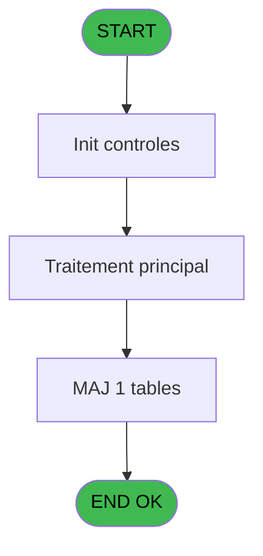
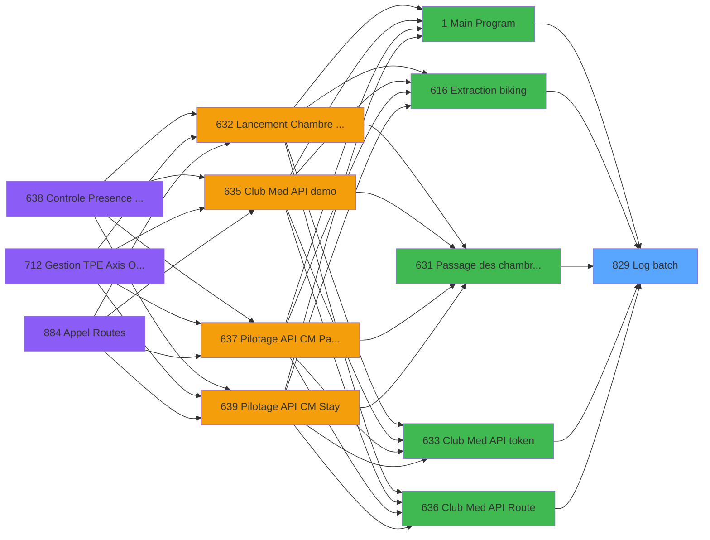

# REF IDE 829 - Log batch

> **Analyse**: Phases 1-4 2026-02-03 14:36 -> 14:37 (14s) | Assemblage 14:37
> **Pipeline**: V7.2 Enrichi
> **Structure**: 4 onglets (Resume | Ecrans | Donnees | Connexions)

<!-- TAB:Resume -->

## 1. FICHE D'IDENTITE

| Attribut | Valeur |
|----------|--------|
| Projet | REF |
| IDE Position | 829 |
| Nom Programme | Log batch |
| Fichier source | `Prg_829.xml` |
| Dossier IDE | General |
| Taches | 6 (0 ecrans visibles) |
| Tables modifiees | 1 |
| Programmes appeles | 1 |

## 2. DESCRIPTION FONCTIONNELLE

**Log batch** assure la gestion complete de ce processus, accessible depuis [Mail Envoi Multi_PJ (IDE 787)](REF-IDE-787.md), [Chambre à faire (IDE 851)](REF-IDE-851.md), [Chambre priorité CLIENT (IDE 854)](REF-IDE-854.md), [Update JH Open Bravo (IDE 860)](REF-IDE-860.md), [Extraction biking (IDE 616)](REF-IDE-616.md), [Passage des chambres en depart (IDE 631)](REF-IDE-631.md), [Club Med API token (IDE 633)](REF-IDE-633.md), [Club Med API Route (IDE 636)](REF-IDE-636.md), [Affectation de Garantie (IDE 667)](REF-IDE-667.md), [Mail Envoi (IDE 786)](REF-IDE-786.md), [Affiche csv/xlsx Office Web (IDE 819)](REF-IDE-819.md), [Récupère màj des chambres (IDE 852)](REF-IDE-852.md), [GetJH (IDE 857)](REF-IDE-857.md), [Get CashUp (IDE 864)](REF-IDE-864.md), [Main Program (IDE 1)](REF-IDE-1.md), [Pilotage API CM Paiements (IDE 637)](REF-IDE-637.md), [Mail Connection (IDE 784)](REF-IDE-784.md), [Search From&Sujet&Corps Mul_PJ (IDE 789)](REF-IDE-789.md), [Get Printer (IDE 790)](REF-IDE-790.md), [Converti csv en xlsx / Exe (IDE 817)](REF-IDE-817.md).

Le flux de traitement s'organise en **1 blocs fonctionnels** :

- **Traitement** (6 taches) : traitements metier divers

**Donnees modifiees** : 1 tables en ecriture (log_batch).

Detail : phases du traitement

#### Phase 1 : Traitement (6 taches)

- **829** - Log batch
- **829.1** - Log batch
- **829.1.1** - GetUserName C#
- **829.1.2** - Get date version
- **829.2** - Log batch
- **829.3** - Error log batch

Delegue a : [900 Progs - 06/01/2026 (IDE 3)](REF-IDE-3.md)

#### Tables impactees

| Table | Operations | Role metier |
|-------|-----------|-------------|
| log_batch | **W** (2 usages) |  |

## 3. BLOCS FONCTIONNELS

### 3.1 Traitement (6 taches)

Traitements internes.

---

#### 829 - Log batch

**Role** : Tache d'orchestration : point d'entree du programme (6 sous-taches). Coordonne l'enchainement des traitements.

5 sous-taches directes

| Tache | Nom | Bloc |
|-------|-----|------|
| [829.1](#t2) | Log batch | Traitement |
| [829.1.1](#t3) | GetUserName C# | Traitement |
| [829.1.2](#t4) | Get date version | Traitement |
| [829.2](#t5) | Log batch | Traitement |
| [829.3](#t6) | Error log batch | Traitement |

**Variables liees** : A (p.i.o.Batch Id), B (p.i.Batch Id père (création))
**Delegue a** : [900 Progs - 06/01/2026 (IDE 3)](REF-IDE-3.md)

---

#### 829.1 - Log batch

**Role** : Traitement : Log batch.
**Variables liees** : A (p.i.o.Batch Id), B (p.i.Batch Id père (création))
**Delegue a** : [900 Progs - 06/01/2026 (IDE 3)](REF-IDE-3.md)

---

#### 829.1.1 - GetUserName C#

**Role** : Consultation/chargement : GetUserName C#.
**Delegue a** : [900 Progs - 06/01/2026 (IDE 3)](REF-IDE-3.md)

---

#### 829.1.2 - Get date version

**Role** : Consultation/chargement : Get date version.
**Variables liees** : R (p.i.Date début), T (p.i.Date fin)
**Delegue a** : [900 Progs - 06/01/2026 (IDE 3)](REF-IDE-3.md)

---

#### 829.2 - Log batch

**Role** : Traitement : Log batch.
**Variables liees** : A (p.i.o.Batch Id), B (p.i.Batch Id père (création))
**Delegue a** : [900 Progs - 06/01/2026 (IDE 3)](REF-IDE-3.md)

---

#### 829.3 - Error log batch

**Role** : Traitement : Error log batch.
**Variables liees** : A (p.i.o.Batch Id), B (p.i.Batch Id père (création))
**Delegue a** : [900 Progs - 06/01/2026 (IDE 3)](REF-IDE-3.md)

## 5. REGLES METIER

*(Aucune regle metier identifiee)*

## 6. CONTEXTE

- **Appele par**: [Mail Envoi Multi_PJ (IDE 787)](REF-IDE-787.md), [Chambre à faire (IDE 851)](REF-IDE-851.md), [Chambre priorité CLIENT (IDE 854)](REF-IDE-854.md), [Update JH Open Bravo (IDE 860)](REF-IDE-860.md), [Extraction biking (IDE 616)](REF-IDE-616.md), [Passage des chambres en depart (IDE 631)](REF-IDE-631.md), [Club Med API token (IDE 633)](REF-IDE-633.md), [Club Med API Route (IDE 636)](REF-IDE-636.md), [Affectation de Garantie (IDE 667)](REF-IDE-667.md), [Mail Envoi (IDE 786)](REF-IDE-786.md), [Affiche csv/xlsx Office Web (IDE 819)](REF-IDE-819.md), [Récupère màj des chambres (IDE 852)](REF-IDE-852.md), [GetJH (IDE 857)](REF-IDE-857.md), [Get CashUp (IDE 864)](REF-IDE-864.md), [Main Program (IDE 1)](REF-IDE-1.md), [Pilotage API CM Paiements (IDE 637)](REF-IDE-637.md), [Mail Connection (IDE 784)](REF-IDE-784.md), [Search From&Sujet&Corps Mul_PJ (IDE 789)](REF-IDE-789.md), [Get Printer (IDE 790)](REF-IDE-790.md), [Converti csv en xlsx / Exe (IDE 817)](REF-IDE-817.md)
- **Appelle**: 1 programmes | **Tables**: 1 (W:1 R:0 L:0) | **Taches**: 6 | **Expressions**: 6

<!-- TAB:Ecrans -->

## 8. ECRANS

*(Programme sans ecran visible)*

## 9. NAVIGATION

### 9.3 Structure hierarchique (6 taches)

| Position | Tache | Type | Dimensions | Bloc |
|----------|-------|------|------------|------|
| **829.1** | [**Log batch** (829)](#t1) | - | - | Traitement |
| 829.1.1 | [Log batch (829.1)](#t2) | - | - | |
| 829.1.2 | [GetUserName C# (829.1.1)](#t3) | - | - | |
| 829.1.3 | [Get date version (829.1.2)](#t4) | - | - | |
| 829.1.4 | [Log batch (829.2)](#t5) | - | - | |
| 829.1.5 | [Error log batch (829.3)](#t6) | - | - | |

### 9.4 Algorigramme

> **Legende**: Vert = START/END OK | Rouge = END KO | Bleu = Decisions
> *Algorigramme auto-genere. Utiliser `/algorigramme` pour une synthese metier detaillee.*

<!-- TAB:Donnees -->

## 10. TABLES

### Tables utilisees (1)

| ID | Nom | Description | Type | R | W | L | Usages |
|----|-----|-------------|------|---|---|---|--------|
| 921 | log_batch |  | DB |   | **W** |   | 2 |

### Colonnes par table (1 / 1 tables avec colonnes identifiees)

Table 921 - log_batch (**W**) - 2 usages

| Lettre | Variable | Acces | Type |
|--------|----------|-------|------|
| A | p.i.o.Batch Id | W | Numeric |
| B | p.i.Batch Id père (création) | W | Numeric |

## 11. VARIABLES

### 11.1 Parametres entrants (16)

Variables recues du programme appelant ([Mail Envoi Multi_PJ (IDE 787)](REF-IDE-787.md)).

| Lettre | Nom | Type | Usage dans |
|--------|-----|------|-----------|
| A | p.i.o.Batch Id | Numeric | 1x parametre entrant |
| B | p.i.Batch Id père (création) | Numeric | - |
| C | p.i.Type de traitement (créatio | Unicode | - |
| D | p.i.Libellé fixe (création) | Unicode | - |
| E | p.i.Libelle variable (création) | Unicode | - |
| F | p.i.Index (création) | Unicode | - |
| G | p.i.Détail/URL (création) | Unicode | - |
| H | p.i.Taille/Nb lignes | Numeric | - |
| I | p.i.Unité taille | Unicode | - |
| J | p.i/Statut OK/ERR/NFO/DEB | Unicode | - |
| K | p.i.Statut détail/msg err | Unicode | - |
| R | p.i.Date début | Date | 2x parametre entrant |
| S | p.i.Heure début | Time | 2x parametre entrant |
| T | p.i.Date fin | Date | 2x parametre entrant |
| U | p.i.Heure fin | Time | 2x parametre entrant |
| V | p.o.Durée | Numeric | 2x parametre entrant |

### 11.2 Autres (6)

Variables diverses.

| Lettre | Nom | Type | Usage dans |
|--------|-----|------|-----------|
| L | i.Blob in (création) | Blob | - |
| M | i.Blob in type (création) | Unicode | - |
| N | i.Blob out | Blob | - |
| O | i.Blob out type | Unicode | - |
| P | i.Blob traitement | Blob | - |
| Q | i.Blob traitement type | Unicode | - |

Toutes les 22 variables (liste complete)

| Cat | Lettre | Nom Variable | Type |
|-----|--------|--------------|------|
| P0 | **A** | p.i.o.Batch Id | Numeric |
| P0 | **B** | p.i.Batch Id père (création) | Numeric |
| P0 | **C** | p.i.Type de traitement (créatio | Unicode |
| P0 | **D** | p.i.Libellé fixe (création) | Unicode |
| P0 | **E** | p.i.Libelle variable (création) | Unicode |
| P0 | **F** | p.i.Index (création) | Unicode |
| P0 | **G** | p.i.Détail/URL (création) | Unicode |
| P0 | **H** | p.i.Taille/Nb lignes | Numeric |
| P0 | **I** | p.i.Unité taille | Unicode |
| P0 | **J** | p.i/Statut OK/ERR/NFO/DEB | Unicode |
| P0 | **K** | p.i.Statut détail/msg err | Unicode |
| P0 | **R** | p.i.Date début | Date |
| P0 | **S** | p.i.Heure début | Time |
| P0 | **T** | p.i.Date fin | Date |
| P0 | **U** | p.i.Heure fin | Time |
| P0 | **V** | p.o.Durée | Numeric |
| Autre | **L** | i.Blob in (création) | Blob |
| Autre | **M** | i.Blob in type (création) | Unicode |
| Autre | **N** | i.Blob out | Blob |
| Autre | **O** | i.Blob out type | Unicode |
| Autre | **P** | i.Blob traitement | Blob |
| Autre | **Q** | i.Blob traitement type | Unicode |

## 12. EXPRESSIONS

**6 / 6 expressions decodees (100%)**

### 12.1 Repartition par type

| Type | Expressions | Regles |
|------|-------------|--------|
| CONDITION | 3 | 0 |
| CALCULATION | 1 | 0 |
| CONSTANTE | 1 | 0 |
| OTHER | 1 | 0 |

### 12.2 Expressions cles par type

#### CONDITION (3 expressions)

| Type | IDE | Expression | Regle |
|------|-----|------------|-------|
| CONDITION | 2 | `p.i.Date début [R]<p.i.Date fin [T]` | - |
| CONDITION | 1 | `p.i.o.Batch Id [A]=0` | - |
| CONDITION | 3 | `(p.i.Date fin [T]-p.i.Date début [R])*'24:00:00'TIME +IF(p.i.Heure début [S]<p.i.Heure fin [U], p.i.Heure fin [U]-p.i.Heure début [S], p.i.Heure début [S]-p.o.Durée [V]-'24:00:00'TIME)` | - |

#### CALCULATION (1 expressions)

| Type | IDE | Expression | Regle |
|------|-----|------------|-------|
| CALCULATION | 4 | `p.i.Heure fin [U]-p.i.Heure début [S]` | - |

#### CONSTANTE (1 expressions)

| Type | IDE | Expression | Regle |
|------|-----|------------|-------|
| CONSTANTE | 6 | `0` | - |

#### OTHER (1 expressions)

| Type | IDE | Expression | Regle |
|------|-----|------------|-------|
| OTHER | 5 | `p.o.Durée [V]` | - |

<!-- TAB:Connexions -->

## 13. GRAPHE D'APPELS

### 13.1 Chaine depuis Main (Callers)

Main -> ... -> [Mail Envoi Multi_PJ (IDE 787)](REF-IDE-787.md) -> **Log batch (IDE 829)**

Main -> ... -> [Chambre à faire (IDE 851)](REF-IDE-851.md) -> **Log batch (IDE 829)**

Main -> ... -> [Chambre priorité CLIENT (IDE 854)](REF-IDE-854.md) -> **Log batch (IDE 829)**

Main -> ... -> [Update JH Open Bravo (IDE 860)](REF-IDE-860.md) -> **Log batch (IDE 829)**

Main -> ... -> [Extraction biking (IDE 616)](REF-IDE-616.md) -> **Log batch (IDE 829)**

Main -> ... -> [Passage des chambres en depart (IDE 631)](REF-IDE-631.md) -> **Log batch (IDE 829)**

Main -> ... -> [Club Med API token (IDE 633)](REF-IDE-633.md) -> **Log batch (IDE 829)**

Main -> ... -> [Club Med API Route (IDE 636)](REF-IDE-636.md) -> **Log batch (IDE 829)**

Main -> ... -> [Affectation de Garantie (IDE 667)](REF-IDE-667.md) -> **Log batch (IDE 829)**

Main -> ... -> [Mail Envoi (IDE 786)](REF-IDE-786.md) -> **Log batch (IDE 829)**

Main -> ... -> [Affiche csv/xlsx Office Web (IDE 819)](REF-IDE-819.md) -> **Log batch (IDE 829)**

Main -> ... -> [Récupère màj des chambres (IDE 852)](REF-IDE-852.md) -> **Log batch (IDE 829)**

Main -> ... -> [GetJH (IDE 857)](REF-IDE-857.md) -> **Log batch (IDE 829)**

Main -> ... -> [Get CashUp (IDE 864)](REF-IDE-864.md) -> **Log batch (IDE 829)**

Main -> ... -> [Main Program (IDE 1)](REF-IDE-1.md) -> **Log batch (IDE 829)**

Main -> ... -> [Pilotage API CM Paiements (IDE 637)](REF-IDE-637.md) -> **Log batch (IDE 829)**

Main -> ... -> [Mail Connection (IDE 784)](REF-IDE-784.md) -> **Log batch (IDE 829)**

Main -> ... -> [Search From&Sujet&Corps Mul_PJ (IDE 789)](REF-IDE-789.md) -> **Log batch (IDE 829)**

Main -> ... -> [Get Printer (IDE 790)](REF-IDE-790.md) -> **Log batch (IDE 829)**

Main -> ... -> [Converti csv en xlsx / Exe (IDE 817)](REF-IDE-817.md) -> **Log batch (IDE 829)**

### 13.2 Callers

| IDE | Nom Programme | Nb Appels |
|-----|---------------|-----------|
| [787](REF-IDE-787.md) | Mail Envoi Multi_PJ | 4 |
| [851](REF-IDE-851.md) | Chambre à faire | 3 |
| [854](REF-IDE-854.md) | Chambre priorité CLIENT | 3 |
| [860](REF-IDE-860.md) | Update JH Open Bravo | 3 |
| [616](REF-IDE-616.md) | Extraction biking | 2 |
| [631](REF-IDE-631.md) | Passage des chambres en depart | 2 |
| [633](REF-IDE-633.md) | Club Med API token | 2 |
| [636](REF-IDE-636.md) | Club Med API Route | 2 |
| [667](REF-IDE-667.md) | Affectation de Garantie | 2 |
| [786](REF-IDE-786.md) | Mail Envoi | 2 |
| [819](REF-IDE-819.md) | Affiche csv/xlsx Office Web | 2 |
| [852](REF-IDE-852.md) | Récupère màj des chambres | 2 |
| [857](REF-IDE-857.md) | GetJH | 2 |
| [864](REF-IDE-864.md) | Get CashUp | 2 |
| [1](REF-IDE-1.md) | Main Program | 1 |
| [637](REF-IDE-637.md) | Pilotage API CM Paiements | 1 |
| [784](REF-IDE-784.md) | Mail Connection | 1 |
| [789](REF-IDE-789.md) | Search From&Sujet&Corps Mul_PJ | 1 |
| [790](REF-IDE-790.md) | Get Printer | 1 |
| [817](REF-IDE-817.md) | Converti csv en xlsx / Exe | 1 |

### 13.3 Callees (programmes appeles)

### 13.4 Detail Callees avec contexte

| IDE | Nom Programme | Appels | Contexte |
|-----|---------------|--------|----------|
| [3](REF-IDE-3.md) | 900 Progs - 06/01/2026 | 1 | Sous-programme |

## 14. RECOMMANDATIONS MIGRATION

### 14.1 Profil du programme

| Metrique | Valeur | Impact migration |
|----------|--------|-----------------|
| Lignes de logique | 244 | Taille moyenne |
| Expressions | 6 | Peu de logique |
| Tables WRITE | 1 | Impact faible |
| Sous-programmes | 1 | Peu de dependances |
| Ecrans visibles | 0 | Ecran unique ou traitement batch |
| Code desactive | 2% (5 / 244) | Code sain |
| Regles metier | 0 | Pas de regle identifiee |

### 14.2 Plan de migration par bloc

#### Traitement (6 taches: 0 ecran, 6 traitements)

- **Strategie** : 6 service(s) backend injectable(s) (Domain Services).
- 1 sous-programme(s) a migrer ou a reutiliser depuis les services existants.
- Decomposer les taches en services unitaires testables.

### 14.3 Dependances critiques

| Dependance | Type | Appels | Impact |
|------------|------|--------|--------|
| log_batch | Table WRITE (Database) | 2x | Schema + repository |
| [900 Progs - 06/01/2026 (IDE 3)](REF-IDE-3.md) | Sous-programme | 1x | Normale - Sous-programme |

---
*Spec DETAILED generee par Pipeline V7.2 - 2026-02-03 14:37*
