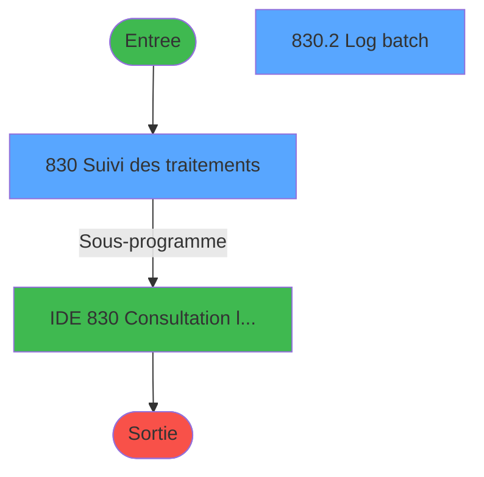
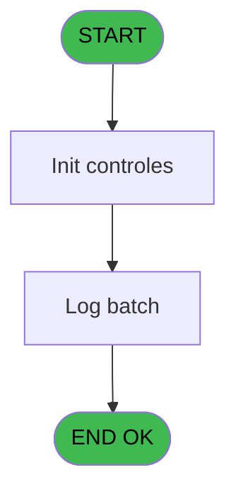

# REF IDE 830 - Consultation log batch

> **Analyse**: Phases 1-4 2026-02-03 14:37 -> 14:37 (14s) | Assemblage 14:37
> **Pipeline**: V7.2 Enrichi
> **Structure**: 4 onglets (Resume | Ecrans | Donnees | Connexions)

<!-- TAB:Resume -->

## 1. FICHE D'IDENTITE

| Attribut | Valeur |
|----------|--------|
| Projet | REF |
| IDE Position | 830 |
| Nom Programme | Consultation log batch |
| Fichier source | `Prg_830.xml` |
| Dossier IDE | General |
| Taches | 3 (2 ecrans visibles) |
| Tables modifiees | 0 |
| Programmes appeles | 1 |

## 2. DESCRIPTION FONCTIONNELLE

**Consultation log batch** assure la gestion complete de ce processus, accessible depuis [Consultation log batch (IDE 830)](REF-IDE-830.md), [OpenBravo Params (IDE 862)](REF-IDE-862.md).

Le flux de traitement s'organise en **1 blocs fonctionnels** :

- **Traitement** (3 taches) : traitements metier divers

**Logique metier** : 2 regles identifiees couvrant conditions metier.

## 3. BLOCS FONCTIONNELS

### 3.1 Traitement (3 taches)

Traitements internes.

---

#### 830 - Suivi des traitements [[ECRAN]](#ecran-t1)

**Role** : Traitement : Suivi des traitements.
**Ecran** : 878 x 301 DLU | [Voir mockup](#ecran-t1)
**Delegue a** : [Consultation log batch (IDE 830)](REF-IDE-830.md)

---

#### 830.1 - Type item list [[ECRAN]](#ecran-t2)

**Role** : Traitement : Type item list.
**Ecran** : 273 x 195 DLU | [Voir mockup](#ecran-t2)
**Variables liees** : B (v.Type), M (vType item list), N (CHG_REASON_v.Type), O (CHG_PRV_v.Type)
**Delegue a** : [Consultation log batch (IDE 830)](REF-IDE-830.md)

---

#### 830.2 - Log batch [[ECRAN]](#ecran-t3)

**Role** : Traitement : Log batch.
**Ecran** : 870 x 274 DLU | [Voir mockup](#ecran-t3)
**Delegue a** : [Consultation log batch (IDE 830)](REF-IDE-830.md)

## 5. REGLES METIER

2 regles identifiees:

### Autres (2 regles)

#### [RM-001] Si CHG_PRV_v.Type [O] alors ' and log_statut != ''OK''' sinon '')

| Element | Detail |
|---------|--------|
| **Condition** | `CHG_PRV_v.Type [O]` |
| **Si vrai** | ' and log_statut != ''OK''' |
| **Si faux** | '') |
| **Variables** | B (v.Type), O (CHG_PRV_v.Type) |
| **Expression source** | Expression 7 : `IF(CHG_PRV_v.Type [O], ' and log_statut != ''OK''', '')` |
| **Exemple** | Si CHG_PRV_v.Type [O] → ' and log_statut != ''OK'''. Sinon → '') |
| **Impact** | [830.1 - Type item list](#t2) |

#### [RM-002] Si CHG_REASON_v.Inclure/E... [P] alors ' and log_batch_id in (select b.log_id_parent from log_batch b)' sinon '')

| Element | Detail |
|---------|--------|
| **Condition** | `CHG_REASON_v.Inclure/E... [P]` |
| **Si vrai** | ' and log_batch_id in (select b.log_id_parent from log_batch b)' |
| **Si faux** | '') |
| **Expression source** | Expression 8 : `IF(CHG_REASON_v.Inclure/E... [P], ' and log_batch_id in (sel` |
| **Exemple** | Si CHG_REASON_v.Inclure/E... [P] → ' and log_batch_id in (select b.log_id_parent from log_batch b)'. Sinon → '') |

## 6. CONTEXTE

- **Appele par**: [Consultation log batch (IDE 830)](REF-IDE-830.md), [OpenBravo Params (IDE 862)](REF-IDE-862.md)
- **Appelle**: 1 programmes | **Tables**: 1 (W:0 R:1 L:0) | **Taches**: 3 | **Expressions**: 14

<!-- TAB:Ecrans -->

## 8. ECRANS

### 8.1 Forms visibles (2 / 3)

| # | Position | Tache | Nom | Type | Largeur | Hauteur | Bloc |
|---|----------|-------|-----|------|---------|---------|------|
| 1 | 830 | 830 | Suivi des traitements | Type0 | 878 | 301 | Traitement |
| 2 | 830.2 | 830.2 | Log batch | Type0 | 870 | 274 | Traitement |

### 8.2 Mockups Ecrans

---

#### 830 - Suivi des traitements
**Tache** : [830](#t1) | **Type** : Type0 | **Dimensions** : 878 x 301 DLU
**Bloc** : Traitement | **Titre IDE** : Suivi des traitements

<!-- FORM-DATA:
{
    "width":  878,
    "vFactor":  8,
    "type":  "Type0",
    "hFactor":  4,
    "controls":  [
                     {
                         "x":  12,
                         "type":  "label",
                         "var":  "",
                         "y":  8,
                         "w":  40,
                         "fmt":  "",
                         "name":  "",
                         "h":  12,
                         "color":  "",
                         "text":  "Type",
                         "parent":  null
                     },
                     {
                         "x":  372,
                         "type":  "label",
                         "var":  "",
                         "y":  8,
                         "w":  24,
                         "fmt":  "",
                         "name":  "",
                         "h":  12,
                         "color":  "",
                         "text":  "Date",
                         "parent":  null
                     },
                     {
                         "x":  454,
                         "type":  "label",
                         "var":  "",
                         "y":  8,
                         "w":  18,
                         "fmt":  "",
                         "name":  "",
                         "h":  12,
                         "color":  "",
                         "text":  "Au",
                         "parent":  null
                     },
                     {
                         "x":  2,
                         "type":  "edit",
                         "var":  "",
                         "y":  8,
                         "w":  830,
                         "fmt":  "200",
                         "name":  "",
                         "h":  12,
                         "color":  "",
                         "text":  "",
                         "parent":  null
                     },
                     {
                         "x":  56,
                         "type":  "combobox",
                         "var":  "",
                         "y":  8,
                         "w":  116,
                         "fmt":  "",
                         "name":  "v.Type",
                         "h":  12,
                         "color":  "",
                         "text":  "",
                         "parent":  null
                     },
                     {
                         "x":  176,
                         "type":  "checkbox",
                         "var":  "",
                         "y":  8,
                         "w":  64,
                         "fmt":  "",
                         "name":  "v.Inclure/Exclure libellé_0001",
                         "h":  12,
                         "color":  "",
                         "text":  "Libellé",
                         "parent":  null
                     },
                     {
                         "x":  244,
                         "type":  "edit",
                         "var":  "",
                         "y":  8,
                         "w":  124,
                         "fmt":  "",
                         "name":  "v.Libellé",
                         "h":  12,
                         "color":  "",
                         "text":  "",
                         "parent":  null
                     },
                     {
                         "x":  396,
                         "type":  "edit",
                         "var":  "",
                         "y":  8,
                         "w":  54,
                         "fmt":  "",
                         "name":  "v.Date début",
                         "h":  12,
                         "color":  "",
                         "text":  "",
                         "parent":  null
                     },
                     {
                         "x":  476,
                         "type":  "edit",
                         "var":  "",
                         "y":  8,
                         "w":  54,
                         "fmt":  "",
                         "name":  "v.Date fin",
                         "h":  12,
                         "color":  "",
                         "text":  "",
                         "parent":  null
                     },
                     {
                         "x":  532,
                         "type":  "checkbox",
                         "var":  "",
                         "y":  8,
                         "w":  88,
                         "fmt":  "",
                         "name":  "v.Masquer les détails",
                         "h":  12,
                         "color":  "",
                         "text":  "Masquer les détails",
                         "parent":  null
                     },
                     {
                         "x":  592,
                         "type":  "checkbox",
                         "var":  "",
                         "y":  8,
                         "w":  92,
                         "fmt":  "",
                         "name":  "v.Erreur seulement ?_0001",
                         "h":  12,
                         "color":  "",
                         "text":  "Erreurs uniquement",
                         "parent":  null
                     },
                     {
                         "x":  686,
                         "type":  "checkbox",
                         "var":  "",
                         "y":  8,
                         "w":  64,
                         "fmt":  "",
                         "name":  "v.Avec détail seulement ?_0001",
                         "h":  12,
                         "color":  "",
                         "text":  "Avec détail",
                         "parent":  null
                     },
                     {
                         "x":  836,
                         "type":  "button",
                         "var":  "",
                         "y":  8,
                         "w":  14,
                         "fmt":  "q",
                         "name":  "",
                         "h":  12,
                         "color":  "65",
                         "text":  "",
                         "parent":  null
                     },
                     {
                         "x":  2,
                         "type":  "subform",
                         "var":  "",
                         "y":  24,
                         "w":  874,
                         "fmt":  "",
                         "name":  "Log batch",
                         "h":  276,
                         "color":  "",
                         "text":  "",
                         "parent":  null
                     }
                 ],
    "taskId":  "830",
    "height":  301
}
-->

<strong>Champs : 9 champs</strong>

| Pos (x,y) | Nom | Variable | Type |
|-----------|-----|----------|------|
| 2,8 | 200 | - | edit |
| 56,8 | v.Type | - | combobox |
| 176,8 | v.Inclure/Exclure libellé_0001 | - | checkbox |
| 244,8 | v.Libellé | - | edit |
| 396,8 | v.Date début | - | edit |
| 476,8 | v.Date fin | - | edit |
| 532,8 | v.Masquer les détails | - | checkbox |
| 592,8 | v.Erreur seulement ?_0001 | - | checkbox |
| 686,8 | v.Avec détail seulement ?_0001 | - | checkbox |

<strong>Boutons : 1 boutons</strong>

| Bouton | Pos (x,y) | Action |
|--------|-----------|--------|
| q | 836,8 | Bouton fonctionnel |

---

#### 830.2 - Log batch
**Tache** : [830.2](#t3) | **Type** : Type0 | **Dimensions** : 870 x 274 DLU
**Bloc** : Traitement | **Titre IDE** : Log batch

<!-- FORM-DATA:
{
    "width":  870,
    "vFactor":  8,
    "type":  "Type0",
    "hFactor":  4,
    "controls":  [
                     {
                         "x":  0,
                         "type":  "table",
                         "var":  "",
                         "name":  "",
                         "titleH":  12,
                         "color":  "18",
                         "w":  869,
                         "y":  0,
                         "fmt":  "",
                         "parent":  null,
                         "text":  "",
                         "rowH":  13,
                         "h":  196,
                         "cols":  [
                                      {
                                          "title":  "Type",
                                          "layer":  1,
                                          "w":  97
                                      },
                                      {
                                          "title":  "Libellé",
                                          "layer":  2,
                                          "w":  161
                                      },
                                      {
                                          "title":  "Détail",
                                          "layer":  3,
                                          "w":  204
                                      },
                                      {
                                          "title":  "Début",
                                          "layer":  4,
                                          "w":  62
                                      },
                                      {
                                          "title":  "",
                                          "layer":  5,
                                          "w":  49
                                      },
                                      {
                                          "title":  "Durée",
                                          "layer":  6,
                                          "w":  48
                                      },
                                      {
                                          "title":  "Statut",
                                          "layer":  7,
                                          "w":  33
                                      },
                                      {
                                          "title":  "Taille",
                                          "layer":  8,
                                          "w":  41
                                      },
                                      {
                                          "title":  "Détail du statut",
                                          "layer":  9,
                                          "w":  156
                                      }
                                  ],
                         "rows":  9
                     },
                     {
                         "x":  0,
                         "type":  "label",
                         "var":  "",
                         "y":  200,
                         "w":  868,
                         "fmt":  "",
                         "name":  "",
                         "h":  68,
                         "color":  "",
                         "text":  "",
                         "parent":  null
                     },
                     {
                         "x":  10,
                         "type":  "label",
                         "var":  "",
                         "y":  208,
                         "w":  54,
                         "fmt":  "",
                         "name":  "",
                         "h":  12,
                         "color":  "",
                         "text":  "Complément",
                         "parent":  18
                     },
                     {
                         "x":  10,
                         "type":  "label",
                         "var":  "",
                         "y":  222,
                         "w":  54,
                         "fmt":  "",
                         "name":  "",
                         "h":  12,
                         "color":  "",
                         "text":  "Chemin",
                         "parent":  18
                     },
                     {
                         "x":  10,
                         "type":  "label",
                         "var":  "",
                         "y":  236,
                         "w":  46,
                         "fmt":  "",
                         "name":  "",
                         "h":  12,
                         "color":  "",
                         "text":  "Compteur",
                         "parent":  18
                     },
                     {
                         "x":  178,
                         "type":  "label",
                         "var":  "",
                         "y":  236,
                         "w":  46,
                         "fmt":  "",
                         "name":  "",
                         "h":  12,
                         "color":  "",
                         "text":  "Utilisateur",
                         "parent":  18
                     },
                     {
                         "x":  294,
                         "type":  "label",
                         "var":  "",
                         "y":  236,
                         "w":  98,
                         "fmt":  "",
                         "name":  "",
                         "h":  12,
                         "color":  "",
                         "text":  "Utilisateur système",
                         "parent":  18
                     },
                     {
                         "x":  536,
                         "type":  "label",
                         "var":  "",
                         "y":  236,
                         "w":  58,
                         "fmt":  "",
                         "name":  "",
                         "h":  12,
                         "color":  "",
                         "text":  "Poste",
                         "parent":  18
                     },
                     {
                         "x":  4,
                         "type":  "edit",
                         "var":  "",
                         "y":  15,
                         "w":  92,
                         "fmt":  "",
                         "name":  "log_type",
                         "h":  10,
                         "color":  "6",
                         "text":  "",
                         "parent":  1
                     },
                     {
                         "x":  101,
                         "type":  "edit",
                         "var":  "",
                         "y":  15,
                         "w":  158,
                         "fmt":  "",
                         "name":  "log_libelle_fixe",
                         "h":  10,
                         "color":  "6",
                         "text":  "",
                         "parent":  1
                     },
                     {
                         "x":  260,
                         "type":  "edit",
                         "var":  "",
                         "y":  15,
                         "w":  200,
                         "fmt":  "",
                         "name":  "log_libelle_variable",
                         "h":  10,
                         "color":  "6",
                         "text":  "",
                         "parent":  1
                     },
                     {
                         "x":  466,
                         "type":  "edit",
                         "var":  "",
                         "y":  15,
                         "w":  61,
                         "fmt":  "",
                         "name":  "log_debut",
                         "h":  10,
                         "color":  "6",
                         "text":  "",
                         "parent":  1
                     },
                     {
                         "x":  528,
                         "type":  "edit",
                         "var":  "",
                         "y":  15,
                         "w":  46,
                         "fmt":  "",
                         "name":  "log_debut_time",
                         "h":  10,
                         "color":  "6",
                         "text":  "",
                         "parent":  1
                     },
                     {
                         "x":  578,
                         "type":  "edit",
                         "var":  "",
                         "y":  15,
                         "w":  50,
                         "fmt":  "HH:MM:SSZ",
                         "name":  "log_duree_secondes",
                         "h":  10,
                         "color":  "6",
                         "text":  "",
                         "parent":  1
                     },
                     {
                         "x":  630,
                         "type":  "edit",
                         "var":  "",
                         "y":  15,
                         "w":  18,
                         "fmt":  "30",
                         "name":  "",
                         "h":  10,
                         "color":  "46",
                         "text":  "",
                         "parent":  1
                     },
                     {
                         "x":  658,
                         "type":  "edit",
                         "var":  "",
                         "y":  15,
                         "w":  36,
                         "fmt":  "N10Z",
                         "name":  "log_taille_0001",
                         "h":  10,
                         "color":  "6",
                         "text":  "",
                         "parent":  1
                     },
                     {
                         "x":  699,
                         "type":  "edit",
                         "var":  "",
                         "y":  15,
                         "w":  154,
                         "fmt":  "",
                         "name":  "log_statut_detail",
                         "h":  10,
                         "color":  "6",
                         "text":  "",
                         "parent":  1
                     },
                     {
                         "x":  66,
                         "type":  "edit",
                         "var":  "",
                         "y":  208,
                         "w":  796,
                         "fmt":  "",
                         "name":  "log_detail",
                         "h":  12,
                         "color":  "",
                         "text":  "",
                         "parent":  18
                     },
                     {
                         "x":  66,
                         "type":  "edit",
                         "var":  "",
                         "y":  222,
                         "w":  796,
                         "fmt":  "",
                         "name":  "log_path_0001",
                         "h":  12,
                         "color":  "",
                         "text":  "",
                         "parent":  18
                     },
                     {
                         "x":  66,
                         "type":  "edit",
                         "var":  "",
                         "y":  236,
                         "w":  110,
                         "fmt":  "30",
                         "name":  "log_taille",
                         "h":  12,
                         "color":  "",
                         "text":  "",
                         "parent":  18
                     },
                     {
                         "x":  230,
                         "type":  "edit",
                         "var":  "",
                         "y":  236,
                         "w":  48,
                         "fmt":  "",
                         "name":  "log_login",
                         "h":  12,
                         "color":  "",
                         "text":  "",
                         "parent":  18
                     },
                     {
                         "x":  394,
                         "type":  "edit",
                         "var":  "",
                         "y":  236,
                         "w":  130,
                         "fmt":  "",
                         "name":  "log_sysuser",
                         "h":  12,
                         "color":  "",
                         "text":  "",
                         "parent":  18
                     },
                     {
                         "x":  598,
                         "type":  "edit",
                         "var":  "",
                         "y":  236,
                         "w":  164,
                         "fmt":  "",
                         "name":  "log_hostname",
                         "h":  12,
                         "color":  "",
                         "text":  "",
                         "parent":  18
                     },
                     {
                         "x":  60,
                         "type":  "button",
                         "var":  "",
                         "y":  252,
                         "w":  78,
                         "fmt":  "Détail",
                         "name":  "b.Détail",
                         "h":  12,
                         "color":  "",
                         "text":  "",
                         "parent":  18
                     },
                     {
                         "x":  230,
                         "type":  "button",
                         "var":  "",
                         "y":  252,
                         "w":  126,
                         "fmt":  "",
                         "name":  "b.In",
                         "h":  12,
                         "color":  "",
                         "text":  "",
                         "parent":  18
                     },
                     {
                         "x":  394,
                         "type":  "button",
                         "var":  "",
                         "y":  252,
                         "w":  126,
                         "fmt":  "",
                         "name":  "b.Out_0001",
                         "h":  12,
                         "color":  "",
                         "text":  "",
                         "parent":  18
                     },
                     {
                         "x":  554,
                         "type":  "button",
                         "var":  "",
                         "y":  252,
                         "w":  126,
                         "fmt":  "",
                         "name":  "b.Trtr",
                         "h":  12,
                         "color":  "",
                         "text":  "",
                         "parent":  18
                     }
                 ],
    "taskId":  "830.2",
    "height":  274
}
-->

<strong>Champs : 15 champs</strong>

| Pos (x,y) | Nom | Variable | Type |
|-----------|-----|----------|------|
| 4,15 | log_type | - | edit |
| 101,15 | log_libelle_fixe | - | edit |
| 260,15 | log_libelle_variable | - | edit |
| 466,15 | log_debut | - | edit |
| 528,15 | log_debut_time | - | edit |
| 578,15 | log_duree_secondes | - | edit |
| 630,15 | 30 | - | edit |
| 658,15 | log_taille_0001 | - | edit |
| 699,15 | log_statut_detail | - | edit |
| 66,208 | log_detail | - | edit |
| 66,222 | log_path_0001 | - | edit |
| 66,236 | log_taille | - | edit |
| 230,236 | log_login | - | edit |
| 394,236 | log_sysuser | - | edit |
| 598,236 | log_hostname | - | edit |

<strong>Boutons : 4 boutons</strong>

| Bouton | Pos (x,y) | Action |
|--------|-----------|--------|
| Détail | 60,252 | Bouton fonctionnel |
| b.In | 230,252 | Bouton fonctionnel |
| b.Out_0001 | 394,252 | Bouton fonctionnel |
| b.Trtr | 554,252 | Bouton fonctionnel |

## 9. NAVIGATION

### 9.1 Enchainement des ecrans

**Detail par enchainement :**

| Depuis | Action | Vers | Retour |
|--------|--------|------|--------|
| Suivi des traitements | Sous-programme | [Consultation log batch (IDE 830)](REF-IDE-830.md) | Retour ecran |

### 9.3 Structure hierarchique (3 taches)

| Position | Tache | Type | Dimensions | Bloc |
|----------|-------|------|------------|------|
| **830.1** | [**Suivi des traitements** (830)](#t1) [mockup](#ecran-t1) | - | 878x301 | Traitement |
| 830.1.1 | [Type item list (830.1)](#t2) [mockup](#ecran-t2) | - | 273x195 | |
| 830.1.2 | [Log batch (830.2)](#t3) [mockup](#ecran-t3) | - | 870x274 | |

### 9.4 Algorigramme

> **Legende**: Vert = START/END OK | Rouge = END KO | Bleu = Decisions
> *Algorigramme auto-genere. Utiliser `/algorigramme` pour une synthese metier detaillee.*

<!-- TAB:Donnees -->

## 10. TABLES

### Tables utilisees (1)

| ID | Nom | Description | Type | R | W | L | Usages |
|----|-----|-------------|------|---|---|---|--------|
| 921 | log_batch |  | DB | R |   |   | 2 |

### Colonnes par table (0 / 1 tables avec colonnes identifiees)

Table 921 - log_batch (R) - 2 usages

*Table utilisee uniquement en Link ou aucune colonne Real identifiee dans le DataView.*

## 11. VARIABLES

### 11.1 Parametres entrants (1)

Variables recues du programme appelant ([Consultation log batch (IDE 830)](REF-IDE-830.md)).

| Lettre | Nom | Type | Usage dans |
|--------|-----|------|-----------|
| A | p.i.Id parent | Numeric | 3x parametre entrant |

### 11.2 Variables de session (8)

Variables persistantes pendant toute la session.

| Lettre | Nom | Type | Usage dans |
|--------|-----|------|-----------|
| B | v.Type | Unicode | 1x session |
| C | v.Inclure/Exclure libellé | Logical | - |
| D | v.Libellé | Unicode | 1x session |
| E | v.Date début | Date | 2x session |
| F | v.Date fin | Date | - |
| G | v.Masquer les détails ? | Logical | 1x session |
| H | v.Erreur seulement ? | Logical | 1x session |
| I | v.Avec détail seulement ? | Logical | - |

### 11.3 Autres (20)

Variables diverses.

| Lettre | Nom | Type | Usage dans |
|--------|-----|------|-----------|
| J | sql.Libelle recherche | Unicode | 1x refs |
| K | sql.Recherche not OK | Unicode | 1x refs |
| L | sql.Recherche détail | Unicode | - |
| M | vType item list | Unicode | - |
| N | CHG_REASON_v.Type | Numeric | - |
| O | CHG_PRV_v.Type | Unicode | 1x refs |
| P | CHG_REASON_v.Inclure/Exclure l | Numeric | - |
| Q | CHG_PRV_v.Inclure/Exclure libe | Logical | - |
| R | CHG_REASON_v.Libellé | Numeric | - |
| S | CHG_PRV_v.Libellé | Unicode | - |
| T | CHG_REASON_v.Date début | Numeric | 1x refs |
| U | CHG_PRV_v.Date début | Date | - |
| V | CHG_REASON_v.Date fin | Numeric | - |
| W | CHG_PRV_v.Date fin | Date | - |
| X | CHG_REASON_v.Masquer les détai | Numeric | - |
| Y | CHG_PRV_v.Masquer les détails | Logical | - |
| Z | CHG_REASON_v.Erreur seulement | Numeric | - |
| BA | CHG_PRV_v.Erreur seulement ? | Logical | - |
| BB | CHG_REASON_v.Avec détail seule | Numeric | - |
| BC | CHG_PRV_v.Avec détail seulemen | Logical | - |

Toutes les 29 variables (liste complete)

| Cat | Lettre | Nom Variable | Type |
|-----|--------|--------------|------|
| P0 | **A** | p.i.Id parent | Numeric |
| V. | **B** | v.Type | Unicode |
| V. | **C** | v.Inclure/Exclure libellé | Logical |
| V. | **D** | v.Libellé | Unicode |
| V. | **E** | v.Date début | Date |
| V. | **F** | v.Date fin | Date |
| V. | **G** | v.Masquer les détails ? | Logical |
| V. | **H** | v.Erreur seulement ? | Logical |
| V. | **I** | v.Avec détail seulement ? | Logical |
| Autre | **J** | sql.Libelle recherche | Unicode |
| Autre | **K** | sql.Recherche not OK | Unicode |
| Autre | **L** | sql.Recherche détail | Unicode |
| Autre | **M** | vType item list | Unicode |
| Autre | **N** | CHG_REASON_v.Type | Numeric |
| Autre | **O** | CHG_PRV_v.Type | Unicode |
| Autre | **P** | CHG_REASON_v.Inclure/Exclure l | Numeric |
| Autre | **Q** | CHG_PRV_v.Inclure/Exclure libe | Logical |
| Autre | **R** | CHG_REASON_v.Libellé | Numeric |
| Autre | **S** | CHG_PRV_v.Libellé | Unicode |
| Autre | **T** | CHG_REASON_v.Date début | Numeric |
| Autre | **U** | CHG_PRV_v.Date début | Date |
| Autre | **V** | CHG_REASON_v.Date fin | Numeric |
| Autre | **W** | CHG_PRV_v.Date fin | Date |
| Autre | **X** | CHG_REASON_v.Masquer les détai | Numeric |
| Autre | **Y** | CHG_PRV_v.Masquer les détails | Logical |
| Autre | **Z** | CHG_REASON_v.Erreur seulement | Numeric |
| Autre | **BA** | CHG_PRV_v.Erreur seulement ? | Logical |
| Autre | **BB** | CHG_REASON_v.Avec détail seule | Numeric |
| Autre | **BC** | CHG_PRV_v.Avec détail seulemen | Logical |

## 12. EXPRESSIONS

**14 / 14 expressions decodees (100%)**

### 12.1 Repartition par type

| Type | Expressions | Regles |
|------|-------------|--------|
| CONDITION | 5 | 2 |
| CONSTANTE | 1 | 0 |
| DATE | 2 | 0 |
| OTHER | 4 | 0 |
| CAST_LOGIQUE | 1 | 0 |
| FORMAT | 1 | 0 |

### 12.2 Expressions cles par type

#### CONDITION (5 expressions)

| Type | IDE | Expression | Regle |
|------|-----|------------|-------|
| CONDITION | 7 | `IF(CHG_PRV_v.Type [O], ' and log_statut != ''OK''', '')` | [RM-001](#rm-RM-001) |
| CONDITION | 8 | `IF(CHG_REASON_v.Inclure/E... [P], ' and log_batch_id in (select b.log_id_parent from log_batch b)', '')` | [RM-002](#rm-RM-002) |
| CONDITION | 11 | `p.i.Id parent [A]<>0` | - |
| CONDITION | 10 | `p.i.Id parent [A]=0` | - |
| CONDITION | 5 | `IF(sql.Recherche not OK [K]='', '', StrBuild(' and @1@ 
        (  log_libelle_fixe     collate French_CI_AI like ''%@2@%'' 
        or log_libelle_variable collate French_CI_AI like ''%@2@%'' 
        or log_index            collate French_CI_AI like ''%@2@%'' 
        or log_detail           collate French_CI_AI like ''%@2@%'' 
        or log_statut_detail    collate French_CI_AI like ''%@2@%'' 
        or log_login            collate French_CI_AI like ''%@2@%''
        or log_sysuser          collate French_CI_AI like ''%@2@%''
        or log_hostname         collate French_CI_AI like ''%@2@%''
        or log_path             collate French_CI_AI like ''%@2@%''
        )', IF(sql.Libelle recherche [J], '', ' not'),  RTrim(RepStr(sql.Recherche not OK [K], '''', ''''''))))` | - |

#### CONSTANTE (1 expressions)

| Type | IDE | Expression | Regle |
|------|-----|------------|-------|
| CONSTANTE | 6 | `'Log batch'` | - |

#### DATE (2 expressions)

| Type | IDE | Expression | Regle |
|------|-----|------------|-------|
| DATE | 3 | `Date()` | - |
| DATE | 2 | `Date()-7` | - |

#### OTHER (4 expressions)

| Type | IDE | Expression | Regle |
|------|-----|------------|-------|
| OTHER | 13 | `MlsTrans('Tous')` | - |
| OTHER | 14 | `MlsTrans('Rafraîchir')` | - |
| OTHER | 1 | `CHG_REASON_v.Date début [T]` | - |
| OTHER | 9 | `p.i.Id parent [A]` | - |

#### CAST_LOGIQUE (1 expressions)

| Type | IDE | Expression | Regle |
|------|-----|------------|-------|
| CAST_LOGIQUE | 4 | `'TRUE'LOG` | - |

#### FORMAT (1 expressions)

| Type | IDE | Expression | Regle |
|------|-----|------------|-------|
| FORMAT | 12 | `StrBuild('@1@ : @2@ ; @3@ @4@', v.Libellé [D], v.Date début [E], Str(v.Masquer les détails ? [G], 'N10Z') ,v.Erreur seulement ? [H])` | - |

<!-- TAB:Connexions -->

## 13. GRAPHE D'APPELS

### 13.1 Chaine depuis Main (Callers)

Main -> ... -> [Consultation log batch (IDE 830)](REF-IDE-830.md) -> **Consultation log batch (IDE 830)**

Main -> ... -> [OpenBravo Params (IDE 862)](REF-IDE-862.md) -> **Consultation log batch (IDE 830)**

### 13.2 Callers

| IDE | Nom Programme | Nb Appels |
|-----|---------------|-----------|
| [830](REF-IDE-830.md) | Consultation log batch | 1 |
| [862](REF-IDE-862.md) | OpenBravo Params | 1 |

### 13.3 Callees (programmes appeles)

### 13.4 Detail Callees avec contexte

| IDE | Nom Programme | Appels | Contexte |
|-----|---------------|--------|----------|
| [830](REF-IDE-830.md) | Consultation log batch | 1 | Sous-programme |

## 14. RECOMMANDATIONS MIGRATION

### 14.1 Profil du programme

| Metrique | Valeur | Impact migration |
|----------|--------|-----------------|
| Lignes de logique | 145 | Programme compact |
| Expressions | 14 | Peu de logique |
| Tables WRITE | 0 | Impact faible |
| Sous-programmes | 1 | Peu de dependances |
| Ecrans visibles | 2 | Quelques ecrans |
| Code desactive | 0% (0 / 145) | Code sain |
| Regles metier | 2 | Quelques regles a preserver |

### 14.2 Plan de migration par bloc

#### Traitement (3 taches: 3 ecrans, 0 traitement)

- **Strategie** : 3 composant(s) UI (Razor/React) avec formulaires et validation.
- 1 sous-programme(s) a migrer ou a reutiliser depuis les services existants.
- Decomposer les taches en services unitaires testables.

### 14.3 Dependances critiques

| Dependance | Type | Appels | Impact |
|------------|------|--------|--------|
| [Consultation log batch (IDE 830)](REF-IDE-830.md) | Sous-programme | 1x | Normale - Sous-programme |

---
*Spec DETAILED generee par Pipeline V7.2 - 2026-02-03 14:37*
