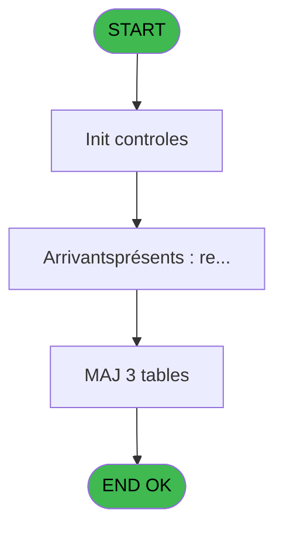

# REF IDE 833 - Gestion Aéroport/Gare

> **Analyse**: Phases 1-4 2026-02-03 14:38 -> 14:38 (13s) | Assemblage 14:38
> **Pipeline**: V7.2 Enrichi
> **Structure**: 4 onglets (Resume | Ecrans | Donnees | Connexions)

<!-- TAB:Resume -->

## 1. FICHE D'IDENTITE

| Attribut | Valeur |
|----------|--------|
| Projet | REF |
| IDE Position | 833 |
| Nom Programme | Gestion Aéroport/Gare |
| Fichier source | `Prg_833.xml` |
| Dossier IDE | General |
| Taches | 4 (2 ecrans visibles) |
| Tables modifiees | 3 |
| Programmes appeles | 1 |
| :warning: Statut | **ORPHELIN_POTENTIEL** |

## 2. DESCRIPTION FONCTIONNELLE

**Gestion Aéroport/Gare** assure la gestion complete de ce processus.

Le flux de traitement s'organise en **1 blocs fonctionnels** :

- **Traitement** (4 taches) : traitements metier divers

**Donnees modifiees** : 3 tables en ecriture (hebergement______heb, tables_village, groupe_arr_dep___vol).

**Logique metier** : 2 regles identifiees couvrant valeurs par defaut.

Detail : phases du traitement

#### Phase 1 : Traitement (4 taches)

- **833** - Êcran **[[ECRAN]](#ecran-t1)**
- **833.1** - Mise à jour présents/à venir **[[ECRAN]](#ecran-t2)**
- **833.1.1** - Màj arrivants/présents
- **833.1.2** - Mise à jour présents/à venir **[[ECRAN]](#ecran-t5)**

Delegue a : [Recuperation du titre (IDE 658)](REF-IDE-658.md)

#### Tables impactees

| Table | Operations | Role metier |
|-------|-----------|-------------|
| hebergement______heb | **W** (1 usages) | Hebergement (chambres) |
| groupe_arr_dep___vol | **W** (1 usages) |  |
| tables_village | **W** (1 usages) |  |

## 3. BLOCS FONCTIONNELS

### 3.1 Traitement (4 taches)

Traitements internes.

---

#### 833 - Êcran [[ECRAN]](#ecran-t1)

**Role** : Traitement : Êcran.
**Ecran** : 981 x 220 DLU (MDI) | [Voir mockup](#ecran-t1)

3 sous-taches directes

| Tache | Nom | Bloc |
|-------|-----|------|
| [833.1](#t2) | Mise à jour présents/à venir **[[ECRAN]](#ecran-t2)** | Traitement |
| [833.1.1](#t3) | Màj arrivants/présents | Traitement |
| [833.1.2](#t5) | Mise à jour présents/à venir **[[ECRAN]](#ecran-t5)** | Traitement |

**Delegue a** : [Recuperation du titre (IDE 658)](REF-IDE-658.md)

---

#### 833.1 - Mise à jour présents/à venir [[ECRAN]](#ecran-t2)

**Role** : Traitement : Mise à jour présents/à venir.
**Ecran** : 320 x 29 DLU | [Voir mockup](#ecran-t2)
**Delegue a** : [Recuperation du titre (IDE 658)](REF-IDE-658.md)

---

#### 833.1.1 - Màj arrivants/présents

**Role** : Traitement : Màj arrivants/présents.
**Delegue a** : [Recuperation du titre (IDE 658)](REF-IDE-658.md)

---

#### 833.1.2 - Mise à jour présents/à venir [[ECRAN]](#ecran-t5)

**Role** : Traitement : Mise à jour présents/à venir.
**Ecran** : 320 x 29 DLU | [Voir mockup](#ecran-t5)
**Delegue a** : [Recuperation du titre (IDE 658)](REF-IDE-658.md)

## 5. REGLES METIER

2 regles identifiees:

### Autres (2 regles)

#### [RM-001] Valeur par defaut si ISNULL(GetParam ('SOCIETE')) OR GetParam ('SOCIETE') est vide

| Element | Detail |
|---------|--------|
| **Condition** | `ISNULL(GetParam ('SOCIETE')) OR GetParam ('SOCIETE')=''` |
| **Si vrai** | '--' |
| **Si faux** | '  ') |
| **Expression source** | Expression 1 : `IF(ISNULL(GetParam ('SOCIETE')) OR GetParam ('SOCIETE')='', ` |
| **Exemple** | Si ISNULL(GetParam ('SOCIETE')) OR GetParam ('SOCIETE')='' → '--'. Sinon → '  ') |

#### [RM-002] Valeur par defaut si v.Retour dialogue [L] est vide

| Element | Detail |
|---------|--------|
| **Condition** | `v.Retour dialogue [L]=''` |
| **Si vrai** | v.Compte trajets/vols [M] |
| **Si faux** | v.Retour dialogue [L]) |
| **Variables** | L (v.Retour dialogue), M (v.Compte trajets/vols) |
| **Expression source** | Expression 15 : `IF(v.Retour dialogue [L]='', v.Compte trajets/vols [M], v.Re` |
| **Exemple** | Si v.Retour dialogue [L]='' → v.Compte trajets/vols [M]. Sinon → v.Retour dialogue [L]) |

## 6. CONTEXTE

- **Appele par**: (aucun)
- **Appelle**: 1 programmes | **Tables**: 5 (W:3 R:1 L:2) | **Taches**: 4 | **Expressions**: 38

<!-- TAB:Ecrans -->

## 8. ECRANS

### 8.1 Forms visibles (2 / 4)

| # | Position | Tache | Nom | Type | Largeur | Hauteur | Bloc |
|---|----------|-------|-----|------|---------|---------|------|
| 1 | 833 | 833 | Êcran | MDI | 981 | 220 | Traitement |
| 2 | 833.1 | 833.1 | Mise à jour présents/à venir | Type0 | 320 | 29 | Traitement |

### 8.2 Mockups Ecrans

---

#### 833 - Êcran
**Tache** : [833](#t1) | **Type** : MDI | **Dimensions** : 981 x 220 DLU
**Bloc** : Traitement | **Titre IDE** : Êcran

<!-- FORM-DATA:
{
    "width":  981,
    "vFactor":  8,
    "type":  "MDI",
    "hFactor":  8,
    "controls":  [
                     {
                         "x":  0,
                         "type":  "label",
                         "var":  "",
                         "y":  1,
                         "w":  965,
                         "fmt":  "",
                         "name":  "",
                         "h":  20,
                         "color":  "",
                         "text":  "",
                         "parent":  null
                     },
                     {
                         "x":  1,
                         "type":  "label",
                         "var":  "",
                         "y":  192,
                         "w":  965,
                         "fmt":  "",
                         "name":  "",
                         "h":  24,
                         "color":  "",
                         "text":  "",
                         "parent":  null
                     },
                     {
                         "x":  26,
                         "type":  "table",
                         "var":  "",
                         "name":  "",
                         "titleH":  12,
                         "color":  "110",
                         "w":  741,
                         "y":  36,
                         "fmt":  "",
                         "parent":  null,
                         "text":  "",
                         "rowH":  13,
                         "h":  145,
                         "cols":  [
                                      {
                                          "title":  "Code",
                                          "layer":  1,
                                          "w":  120
                                      },
                                      {
                                          "title":  "Libellé",
                                          "layer":  2,
                                          "w":  248
                                      },
                                      {
                                          "title":  "Durée aller",
                                          "layer":  3,
                                          "w":  185
                                      },
                                      {
                                          "title":  "Durée retour",
                                          "layer":  4,
                                          "w":  153
                                      }
                                  ],
                         "rows":  4
                     },
                     {
                         "x":  783,
                         "type":  "label",
                         "var":  "",
                         "y":  102,
                         "w":  177,
                         "fmt":  "",
                         "name":  "",
                         "h":  77,
                         "color":  "",
                         "text":  "",
                         "parent":  null
                     },
                     {
                         "x":  45,
                         "type":  "edit",
                         "var":  "",
                         "y":  51,
                         "w":  75,
                         "fmt":  "",
                         "name":  "code_alpha6",
                         "h":  8,
                         "color":  "110",
                         "text":  "",
                         "parent":  7
                     },
                     {
                         "x":  156,
                         "type":  "edit",
                         "var":  "",
                         "y":  51,
                         "w":  232,
                         "fmt":  "",
                         "name":  "LIBELLE",
                         "h":  8,
                         "color":  "110",
                         "text":  "",
                         "parent":  7
                     },
                     {
                         "x":  579,
                         "type":  "edit",
                         "var":  "",
                         "y":  6,
                         "w":  374,
                         "fmt":  "WWW DD MMM YYYYT",
                         "name":  "",
                         "h":  8,
                         "color":  "",
                         "text":  "",
                         "parent":  1
                     },
                     {
                         "x":  6,
                         "type":  "edit",
                         "var":  "",
                         "y":  7,
                         "w":  396,
                         "fmt":  "30",
                         "name":  "",
                         "h":  8,
                         "color":  "",
                         "text":  "",
                         "parent":  1
                     },
                     {
                         "x":  784,
                         "type":  "image",
                         "var":  "",
                         "y":  23,
                         "w":  179,
                         "fmt":  "",
                         "name":  "",
                         "h":  56,
                         "color":  "",
                         "text":  "",
                         "parent":  null
                     },
                     {
                         "x":  794,
                         "type":  "button",
                         "var":  "",
                         "y":  109,
                         "w":  154,
                         "fmt":  "\u0026Visualisation",
                         "name":  "",
                         "h":  18,
                         "color":  "",
                         "text":  "",
                         "parent":  null
                     },
                     {
                         "x":  794,
                         "type":  "button",
                         "var":  "",
                         "y":  132,
                         "w":  154,
                         "fmt":  "\u0026Modification",
                         "name":  "",
                         "h":  18,
                         "color":  "",
                         "text":  "",
                         "parent":  null
                     },
                     {
                         "x":  794,
                         "type":  "button",
                         "var":  "",
                         "y":  155,
                         "w":  154,
                         "fmt":  "\u0026Annulation",
                         "name":  "",
                         "h":  18,
                         "color":  "",
                         "text":  "",
                         "parent":  null
                     },
                     {
                         "x":  7,
                         "type":  "button",
                         "var":  "",
                         "y":  194,
                         "w":  154,
                         "fmt":  "\u0026Quitter",
                         "name":  "",
                         "h":  18,
                         "color":  "",
                         "text":  "",
                         "parent":  5
                     },
                     {
                         "x":  400,
                         "type":  "edit",
                         "var":  "",
                         "y":  51,
                         "w":  135,
                         "fmt":  "HH:MMZ",
                         "name":  "v.Durée transfert départ",
                         "h":  10,
                         "color":  "110",
                         "text":  "",
                         "parent":  7
                     },
                     {
                         "x":  589,
                         "type":  "edit",
                         "var":  "",
                         "y":  51,
                         "w":  140,
                         "fmt":  "HH:MMZ",
                         "name":  "v.Durée transfert arrivée",
                         "h":  10,
                         "color":  "110",
                         "text":  "",
                         "parent":  7
                     },
                     {
                         "x":  177,
                         "type":  "edit",
                         "var":  "",
                         "y":  199,
                         "w":  608,
                         "fmt":  "50",
                         "name":  "",
                         "h":  10,
                         "color":  "8",
                         "text":  "",
                         "parent":  null
                     },
                     {
                         "x":  794,
                         "type":  "button",
                         "var":  "",
                         "y":  194,
                         "w":  154,
                         "fmt":  "Sélectionner",
                         "name":  "",
                         "h":  18,
                         "color":  "",
                         "text":  "",
                         "parent":  null
                     }
                 ],
    "taskId":  "833",
    "height":  220
}
-->

<strong>Champs : 7 champs</strong>

| Pos (x,y) | Nom | Variable | Type |
|-----------|-----|----------|------|
| 45,51 | code_alpha6 | - | edit |
| 156,51 | LIBELLE | - | edit |
| 579,6 | WWW DD MMM YYYYT | - | edit |
| 6,7 | 30 | - | edit |
| 400,51 | v.Durée transfert départ | - | edit |
| 589,51 | v.Durée transfert arrivée | - | edit |
| 177,199 | 50 | - | edit |

<strong>Boutons : 5 boutons</strong>

| Bouton | Pos (x,y) | Action |
|--------|-----------|--------|
| Visualisation | 794,109 | Bouton fonctionnel |
| Modification | 794,132 | Modifie l'element |
| Annulation | 794,155 | Annule et retour au menu |
| Quitter | 7,194 | Quitte le programme |
| Sélectionner | 794,194 | Bouton fonctionnel |

---

#### 833.1 - Mise à jour présents/à venir
**Tache** : [833.1](#t2) | **Type** : Type0 | **Dimensions** : 320 x 29 DLU
**Bloc** : Traitement | **Titre IDE** : Mise à jour présents/à venir

<!-- FORM-DATA:
{
    "width":  320,
    "vFactor":  8,
    "type":  "Type0",
    "hFactor":  4,
    "controls":  [
                     {
                         "x":  8,
                         "type":  "label",
                         "var":  "",
                         "y":  8,
                         "w":  304,
                         "fmt":  "",
                         "name":  "",
                         "h":  16,
                         "color":  "132",
                         "text":  "",
                         "parent":  null
                     }
                 ],
    "taskId":  "833.1",
    "height":  29
}
-->

## 9. NAVIGATION

### 9.1 Enchainement des ecrans

**Detail par enchainement :**

| Depuis | Action | Vers | Retour |
|--------|--------|------|--------|
| Êcran | Recuperation donnees | [Recuperation du titre (IDE 658)](REF-IDE-658.md) | Retour ecran |

### 9.3 Structure hierarchique (4 taches)

| Position | Tache | Type | Dimensions | Bloc |
|----------|-------|------|------------|------|
| **833.1** | [**Êcran** (833)](#t1) [mockup](#ecran-t1) | MDI | 981x220 | Traitement |
| 833.1.1 | [Mise à jour présents/à venir (833.1)](#t2) [mockup](#ecran-t2) | - | 320x29 | |
| 833.1.2 | [Màj arrivants/présents (833.1.1)](#t3) | - | - | |
| 833.1.3 | [Mise à jour présents/à venir (833.1.2)](#t5) [mockup](#ecran-t5) | - | 320x29 | |

### 9.4 Algorigramme

> **Legende**: Vert = START/END OK | Rouge = END KO | Bleu = Decisions
> *Algorigramme auto-genere. Utiliser `/algorigramme` pour une synthese metier detaillee.*

<!-- TAB:Donnees -->

## 10. TABLES

### Tables utilisees (5)

| ID | Nom | Description | Type | R | W | L | Usages |
|----|-----|-------------|------|---|---|---|--------|
| 34 | hebergement______heb | Hebergement (chambres) | DB |   | **W** |   | 1 |
| 113 | tables_village |  | DB |   | **W** |   | 1 |
| 134 | groupe_arr_dep___vol |  | DB |   | **W** |   | 1 |
| 922 | view_arrivees_retours |  | DB | R |   | L | 2 |
| 923 | view_herbergements_ar |  | DB |   |   | L | 1 |

### Colonnes par table (2 / 4 tables avec colonnes identifiees)

Table 34 - hebergement______heb (**W**) - 1 usages

*Table utilisee uniquement en Link ou aucune colonne Real identifiee dans le DataView.*

Table 113 - tables_village (**W**) - 1 usages

| Lettre | Variable | Acces | Type |
|--------|----------|-------|------|
| A | p.i.Seulement non paramétrés | W | Logical |
| B | p.i.Mode sélection ? | W | Logical |
| C | p.i.o.Code ville | W | Unicode |
| D | v.Société | W | Unicode |
| E | v.Ville | W | Unicode |
| F | v. titre | W | Alpha |
| G | v.contrôle | W | Logical |
| H | v.A renseigner | W | Unicode |
| I | v.Libellé gare/aéroport | W | Unicode |
| J | v.Durée transfert aller | W | Time |
| K | v.Durée transfert retour | W | Time |
| L | v.Retour dialogue | W | Numeric |
| M | v.Compte trajets/vols | W | Numeric |

Table 134 - groupe_arr_dep___vol (**W**) - 1 usages

| Lettre | Variable | Acces | Type |
|--------|----------|-------|------|
| A | v.Barre progression | W | Numeric |
| B | v.Vol retour existe ? | W | Logical |
| C | v.Au moins une mise à jour GM ? | W | Logical |

Table 922 - view_arrivees_retours (R/L) - 2 usages

*Table utilisee uniquement en Link ou aucune colonne Real identifiee dans le DataView.*

## 11. VARIABLES

### 11.1 Parametres entrants (3)

Variables recues en parametre.

| Lettre | Nom | Type | Usage dans |
|--------|-----|------|-----------|
| A | p.i.Seulement non paramétrés | Logical | - |
| B | p.i.Mode sélection ? | Logical | 2x parametre entrant |
| C | p.i.o.Code ville | Unicode | 1x parametre entrant |

### 11.2 Variables de session (10)

Variables persistantes pendant toute la session.

| Lettre | Nom | Type | Usage dans |
|--------|-----|------|-----------|
| D | v.Société | Unicode | 1x session |
| E | v.Ville | Unicode | 1x session |
| F | v. titre | Alpha | 1x session |
| G | v.contrôle | Logical | - |
| H | v.A renseigner | Unicode | - |
| I | v.Libellé gare/aéroport | Unicode | - |
| J | v.Durée transfert aller | Time | - |
| K | v.Durée transfert retour | Time | - |
| L | v.Retour dialogue | Numeric | 2x session |
| M | v.Compte trajets/vols | Numeric | 4x session |

## 12. EXPRESSIONS

**38 / 38 expressions decodees (100%)**

### 12.1 Repartition par type

| Type | Expressions | Regles |
|------|-------------|--------|
| CALCULATION | 4 | 0 |
| CONDITION | 8 | 2 |
| CONSTANTE | 5 | 0 |
| DATE | 2 | 0 |
| FORMAT | 1 | 0 |
| REFERENCE_VG | 2 | 0 |
| OTHER | 13 | 0 |
| NEGATION | 2 | 0 |
| STRING | 1 | 0 |

### 12.2 Expressions cles par type

#### CALCULATION (4 expressions)

| Type | IDE | Expression | Regle |
|------|-----|------------|-------|
| CALCULATION | 13 | `[P]/60` | - |
| CALCULATION | 14 | `[R]/60` | - |
| CALCULATION | 11 | `[O]*60` | - |
| CALCULATION | 12 | `[Q]*60` | - |

#### CONDITION (8 expressions)

| Type | IDE | Expression | Regle |
|------|-----|------------|-------|
| CONDITION | 1 | `IF(ISNULL(GetParam ('SOCIETE')) OR GetParam ('SOCIETE')='', '--', '  ')` | [RM-001](#rm-RM-001) |
| CONDITION | 15 | `IF(v.Retour dialogue [L]='', v.Compte trajets/vols [M], v.Retour dialogue [L])` | [RM-002](#rm-RM-002) |
| CONDITION | 21 | `[N]=v.Compte trajets/vols [M]` | - |
| CONDITION | 23 | `[N]=''` | - |
| CONDITION | 25 | `[V]=6` | - |
| ... | | *+3 autres* | |

#### CONSTANTE (5 expressions)

| Type | IDE | Expression | Regle |
|------|-----|------------|-------|
| CONSTANTE | 19 | `''` | - |
| CONSTANTE | 38 | `'PS'` | - |
| CONSTANTE | 10 | `'F'` | - |
| CONSTANTE | 6 | `42` | - |
| CONSTANTE | 9 | `'AERGR'` | - |

#### DATE (2 expressions)

| Type | IDE | Expression | Regle |
|------|-----|------------|-------|
| DATE | 36 | `Date()` | - |
| DATE | 4 | `Date ()` | - |

#### FORMAT (1 expressions)

| Type | IDE | Expression | Regle |
|------|-----|------------|-------|
| FORMAT | 26 | `StrBuild(MlsTrans('Créé le @1@ à @2@ par @3@'), DStr([T], '##/##/####'), TStr([U], 'HH:MM:SS'), [S])` | - |

#### REFERENCE_VG (2 expressions)

| Type | IDE | Expression | Regle |
|------|-----|------------|-------|
| REFERENCE_VG | 35 | `VG1` | - |
| REFERENCE_VG | 5 | `VG1` | - |

#### OTHER (13 expressions)

| Type | IDE | Expression | Regle |
|------|-----|------------|-------|
| OTHER | 31 | `v.Ville [E]` | - |
| OTHER | 30 | `p.i.o.Code ville [C]` | - |
| OTHER | 29 | `SetCrsr(1)` | - |
| OTHER | 37 | `Time()` | - |
| OTHER | 33 | `v.Société [D]` | - |
| ... | | *+8 autres* | |

#### NEGATION (2 expressions)

| Type | IDE | Expression | Regle |
|------|-----|------------|-------|
| NEGATION | 34 | `NOT p.i.Seulement non para... [A] OR v.Retour dialogue [L]=''` | - |
| NEGATION | 8 | `NOT (Stat (0,'E'MODE))` | - |

#### STRING (1 expressions)

| Type | IDE | Expression | Regle |
|------|-----|------------|-------|
| STRING | 3 | `Trim (v. titre [F])` | - |

### 12.3 Toutes les expressions (38)

Voir les 38 expressions

#### CALCULATION (4)

| IDE | Expression Decodee |
|-----|-------------------|
| 11 | `[O]*60` |
| 12 | `[Q]*60` |
| 13 | `[P]/60` |
| 14 | `[R]/60` |

#### CONDITION (8)

| IDE | Expression Decodee |
|-----|-------------------|
| 27 | `[T]<>'00/00/0000'DATE` |
| 1 | `IF(ISNULL(GetParam ('SOCIETE')) OR GetParam ('SOCIETE')='', '--', '  ')` |
| 2 | `IF(ISNULL(GetParam ('SOCIETE')) OR GetParam ('SOCIETE')='', ':-)', GetParam ('SOCIETE'))` |
| 15 | `IF(v.Retour dialogue [L]='', v.Compte trajets/vols [M], v.Retour dialogue [L])` |
| 18 | `[N]<>'' AND [N]<>v.Compte trajets/vols [M]` |
| 21 | `[N]=v.Compte trajets/vols [M]` |
| 23 | `[N]=''` |
| 25 | `[V]=6` |

#### CONSTANTE (5)

| IDE | Expression Decodee |
|-----|-------------------|
| 6 | `42` |
| 9 | `'AERGR'` |
| 10 | `'F'` |
| 19 | `''` |
| 38 | `'PS'` |

#### DATE (2)

| IDE | Expression Decodee |
|-----|-------------------|
| 4 | `Date ()` |
| 36 | `Date()` |

#### FORMAT (1)

| IDE | Expression Decodee |
|-----|-------------------|
| 26 | `StrBuild(MlsTrans('Créé le @1@ à @2@ par @3@'), DStr([T], '##/##/####'), TStr([U], 'HH:MM:SS'), [S])` |

#### REFERENCE_VG (2)

| IDE | Expression Decodee |
|-----|-------------------|
| 5 | `VG1` |
| 35 | `VG1` |

#### OTHER (13)

| IDE | Expression Decodee |
|-----|-------------------|
| 7 | `Stat (0,'E'MODE) AND NOT EmptyDataview (0) AND NOT p.i.Mode sélection ? [B]` |
| 16 | `[N]` |
| 17 | `MlsTrans('À renseigner...')` |
| 20 | `Stat(0, 'CM'MODE)` |
| 22 | `v.Compte trajets/vols [M]` |
| 24 | `VarMod('[Q]'VAR)` |
| 28 | `SetCrsr(2)` |
| 29 | `SetCrsr(1)` |
| 30 | `p.i.o.Code ville [C]` |
| 31 | `v.Ville [E]` |
| 32 | `p.i.Mode sélection ? [B]` |
| 33 | `v.Société [D]` |
| 37 | `Time()` |

#### NEGATION (2)

| IDE | Expression Decodee |
|-----|-------------------|
| 8 | `NOT (Stat (0,'E'MODE))` |
| 34 | `NOT p.i.Seulement non para... [A] OR v.Retour dialogue [L]=''` |

#### STRING (1)

| IDE | Expression Decodee |
|-----|-------------------|
| 3 | `Trim (v. titre [F])` |

<!-- TAB:Connexions -->

## 13. GRAPHE D'APPELS

### 13.1 Chaine depuis Main (Callers)

**Chemin**: (pas de callers directs)

### 13.2 Callers

| IDE | Nom Programme | Nb Appels |
|-----|---------------|-----------|
| - | (aucun) | - |

### 13.3 Callees (programmes appeles)

### 13.4 Detail Callees avec contexte

| IDE | Nom Programme | Appels | Contexte |
|-----|---------------|--------|----------|
| [658](REF-IDE-658.md) | Recuperation du titre | 1 | Recuperation donnees |

## 14. RECOMMANDATIONS MIGRATION

### 14.1 Profil du programme

| Metrique | Valeur | Impact migration |
|----------|--------|-----------------|
| Lignes de logique | 142 | Programme compact |
| Expressions | 38 | Peu de logique |
| Tables WRITE | 3 | Impact modere |
| Sous-programmes | 1 | Peu de dependances |
| Ecrans visibles | 2 | Quelques ecrans |
| Code desactive | 0% (0 / 142) | Code sain |
| Regles metier | 2 | Quelques regles a preserver |

### 14.2 Plan de migration par bloc

#### Traitement (4 taches: 3 ecrans, 1 traitement)

- **Strategie** : Orchestrateur avec 3 ecrans (Razor/React) et 1 traitements backend (services).
- Les ecrans deviennent des composants UI, les traitements invisibles deviennent des services injectables.
- 1 sous-programme(s) a migrer ou a reutiliser depuis les services existants.
- Decomposer les taches en services unitaires testables.

### 14.3 Dependances critiques

| Dependance | Type | Appels | Impact |
|------------|------|--------|--------|
| hebergement______heb | Table WRITE (Database) | 1x | Schema + repository |
| tables_village | Table WRITE (Database) | 1x | Schema + repository |
| groupe_arr_dep___vol | Table WRITE (Database) | 1x | Schema + repository |
| [Recuperation du titre (IDE 658)](REF-IDE-658.md) | Sous-programme | 1x | Normale - Recuperation donnees |

---
*Spec DETAILED generee par Pipeline V7.2 - 2026-02-03 14:38*
