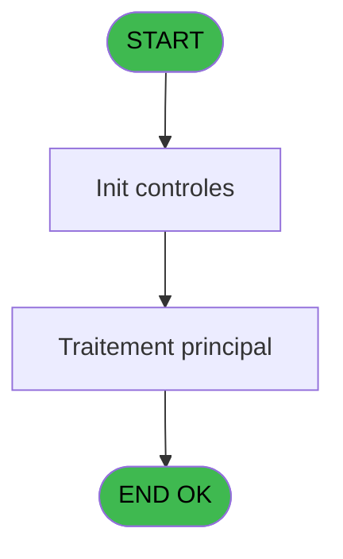

# REF IDE 836 - Restauration base PMS

> **Analyse**: Phases 1-4 2026-02-03 14:39 -> 14:39 (13s) | Assemblage 14:39
> **Pipeline**: V7.2 Enrichi
> **Structure**: 4 onglets (Resume | Ecrans | Donnees | Connexions)

<!-- TAB:Resume -->

## 1. FICHE D'IDENTITE

| Attribut | Valeur |
|----------|--------|
| Projet | REF |
| IDE Position | 836 |
| Nom Programme | Restauration base PMS |
| Fichier source | `Prg_836.xml` |
| Dossier IDE | General |
| Taches | 1 (0 ecrans visibles) |
| Tables modifiees | 0 |
| Programmes appeles | 0 |

## 2. DESCRIPTION FONCTIONNELLE

**Restauration base PMS** assure la gestion complete de ce processus, accessible depuis [Traitements (IDE 630)](REF-IDE-630.md).

Le flux de traitement s'organise en **1 blocs fonctionnels** :

- **Traitement** (1 tache) : traitements metier divers

## 3. BLOCS FONCTIONNELS

### 3.1 Traitement (1 tache)

Traitements internes.

---

#### 836 - Restauration base PMS

**Role** : Traitement : Restauration base PMS.
**Variables liees** : B (p. nom base donne destination)

## 5. REGLES METIER

*(Aucune regle metier identifiee)*

## 6. CONTEXTE

- **Appele par**: [Traitements (IDE 630)](REF-IDE-630.md)
- **Appelle**: 0 programmes | **Tables**: 0 (W:0 R:0 L:0) | **Taches**: 1 | **Expressions**: 20

<!-- TAB:Ecrans -->

## 8. ECRANS

*(Programme sans ecran visible)*

## 9. NAVIGATION

### 9.3 Structure hierarchique (1 tache)

| Position | Tache | Type | Dimensions | Bloc |
|----------|-------|------|------------|------|
| **836.1** | [**Restauration base PMS** (836)](#t1) | - | - | Traitement |

### 9.4 Algorigramme

> **Legende**: Vert = START/END OK | Rouge = END KO | Bleu = Decisions
> *Algorigramme auto-genere. Utiliser `/algorigramme` pour une synthese metier detaillee.*

<!-- TAB:Donnees -->

## 10. TABLES

### Tables utilisees (0)

| ID | Nom | Description | Type | R | W | L | Usages |
|----|-----|-------------|------|---|---|---|--------|

### Colonnes par table (0 / 0 tables avec colonnes identifiees)

## 11. VARIABLES

### 11.1 Parametres entrants (2)

Variables recues du programme appelant ([Traitements (IDE 630)](REF-IDE-630.md)).

| Lettre | Nom | Type | Usage dans |
|--------|-----|------|-----------|
| A | p. fichier sans extension | Unicode | 3x parametre entrant |
| B | p. nom base donne destination | Unicode | - |

### 11.2 Variables de session (5)

Variables persistantes pendant toute la session.

| Lettre | Nom | Type | Usage dans |
|--------|-----|------|-----------|
| C | v.Chemin backup | Unicode | 1x session |
| D | v. Chemin tmp | Unicode | 9x session |
| E | v. debut ligne sqlcmd | Unicode | 6x session |
| F | v. Chemin SQL DATA | Unicode | 1x session |
| G | v. Chemin SQL LOG | Unicode | 1x session |

## 12. EXPRESSIONS

**20 / 20 expressions decodees (100%)**

### 12.1 Repartition par type

| Type | Expressions | Regles |
|------|-------------|--------|
| CALCULATION | 2 | 0 |
| CONCATENATION | 14 | 0 |
| CONSTANTE | 4 | 0 |

### 12.2 Expressions cles par type

#### CALCULATION (2 expressions)

| Type | IDE | Expression | Regle |
|------|-----|------------|-------|
| CALCULATION | 2 | `NOT(FileExist(Left(Trim(v. Chemin tmp [D]),Len(Trim(v. Chemin tmp [D]))-1)))` | - |
| CALCULATION | 1 | `'cmd.exe /c md '&Trim(v. Chemin tmp [D])` | - |

#### CONCATENATION (14 expressions)

| Type | IDE | Expression | Regle |
|------|-----|------------|-------|
| CONCATENATION | 10 | `Trim(v. debut ligne sqlcmd [E])&' "USE '&Trim(p. nom base donne dest... [B])&';DROP USER pmsadmin;"'` | - |
| CONCATENATION | 9 | `Trim(v. debut ligne sqlcmd [E])&' "USE '&Trim(p. nom base donne dest... [B])&';DROP USER pms;"'` | - |
| CONCATENATION | 8 | `Trim(v. debut ligne sqlcmd [E])&' "ALTER DATABASE '&Trim(p. nom base donne dest... [B])&' SET MULTI_USER WITH ROLLBACK IMMEDIATE"'` | - |
| CONCATENATION | 11 | `Trim(v. debut ligne sqlcmd [E])&' "USE '&Trim(p. nom base donne dest... [B])&';CREATE USER pmsadmin FOR LOGIN pmsadmin WITH DEFAULT_SCHEMA=dbo;EXEC sp_addrolemember ''db_backupoperator'', ''pmsadmin'';EXEC sp_addrolemember ''db_datareader'', ''pmsadmin'';EXEC sp_addrolemember ''db_datawriter'', ''pmsadmin'';EXEC sp_addrolemember ''db_ddladmin'', ''pmsadmin'';"'` | - |
| CONCATENATION | 14 | `FileDelete(Trim(v. Chemin tmp [D])&Trim(p. fichier sans extension [A])&'.tar')` | - |
| ... | | *+9 autres* | |

#### CONSTANTE (4 expressions)

| Type | IDE | Expression | Regle |
|------|-----|------------|-------|
| CONSTANTE | 19 | `'e:\data-01\backup\temp\'` | - |
| CONSTANTE | 20 | `'sqlcmd -S tcp:localhost\SQLEXPRESS -d master -Q '` | - |
| CONSTANTE | 15 | `'e:\Data-01\SQLData'` | - |
| CONSTANTE | 18 | `'e:\data-01\backup\'` | - |

<!-- TAB:Connexions -->

## 13. GRAPHE D'APPELS

### 13.1 Chaine depuis Main (Callers)

Main -> ... -> [Traitements (IDE 630)](REF-IDE-630.md) -> **Restauration base PMS (IDE 836)**

### 13.2 Callers

| IDE | Nom Programme | Nb Appels |
|-----|---------------|-----------|
| [630](REF-IDE-630.md) | Traitements | 1 |

### 13.3 Callees (programmes appeles)

### 13.4 Detail Callees avec contexte

| IDE | Nom Programme | Appels | Contexte |
|-----|---------------|--------|----------|
| - | (aucun) | - | - |

## 14. RECOMMANDATIONS MIGRATION

### 14.1 Profil du programme

| Metrique | Valeur | Impact migration |
|----------|--------|-----------------|
| Lignes de logique | 28 | Programme compact |
| Expressions | 20 | Peu de logique |
| Tables WRITE | 0 | Impact faible |
| Sous-programmes | 0 | Peu de dependances |
| Ecrans visibles | 0 | Ecran unique ou traitement batch |
| Code desactive | 0% (0 / 28) | Code sain |
| Regles metier | 0 | Pas de regle identifiee |

### 14.2 Plan de migration par bloc

#### Traitement (1 tache: 0 ecran, 1 traitement)

- **Strategie** : 1 service(s) backend injectable(s) (Domain Services).
- Decomposer les taches en services unitaires testables.

### 14.3 Dependances critiques

| Dependance | Type | Appels | Impact |
|------------|------|--------|--------|

---
*Spec DETAILED generee par Pipeline V7.2 - 2026-02-03 14:39*
