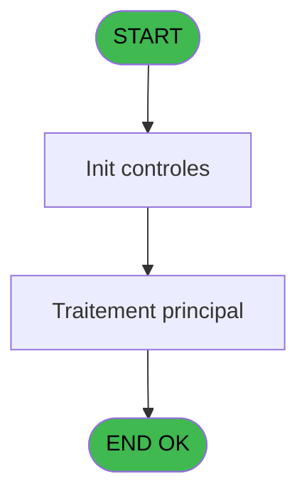

# REF IDE 838 - Clause Where sans Where

> **Analyse**: Phases 1-4 2026-02-03 14:39 -> 14:39 (14s) | Assemblage 14:39
> **Pipeline**: V7.2 Enrichi
> **Structure**: 4 onglets (Resume | Ecrans | Donnees | Connexions)

<!-- TAB:Resume -->

## 1. FICHE D'IDENTITE

| Attribut | Valeur |
|----------|--------|
| Projet | REF |
| IDE Position | 838 |
| Nom Programme | Clause Where sans Where |
| Fichier source | `Prg_838.xml` |
| Dossier IDE | General |
| Taches | 1 (0 ecrans visibles) |
| Tables modifiees | 0 |
| Programmes appeles | 1 |
| :warning: Statut | **ORPHELIN_POTENTIEL** |

## 2. DESCRIPTION FONCTIONNELLE

**Clause Where sans Where** assure la gestion complete de ce processus.

Le flux de traitement s'organise en **1 blocs fonctionnels** :

- **Traitement** (1 tache) : traitements metier divers

## 3. BLOCS FONCTIONNELS

### 3.1 Traitement (1 tache)

Traitements internes.

---

#### 838 - Clause Where sans Where

**Role** : Traitement : Clause Where sans Where.
**Variables liees** : A (<Clause where résultat)
**Delegue a** : [Adapter guillemets SQL (IDE 839)](REF-IDE-839.md)

## 5. REGLES METIER

*(Aucune regle metier identifiee)*

## 6. CONTEXTE

- **Appele par**: (aucun)
- **Appelle**: 1 programmes | **Tables**: 0 (W:0 R:0 L:0) | **Taches**: 1 | **Expressions**: 45

<!-- TAB:Ecrans -->

## 8. ECRANS

*(Programme sans ecran visible)*

## 9. NAVIGATION

### 9.3 Structure hierarchique (1 tache)

| Position | Tache | Type | Dimensions | Bloc |
|----------|-------|------|------------|------|
| **838.1** | [**Clause Where sans Where** (838)](#t1) | - | - | Traitement |

### 9.4 Algorigramme

> **Legende**: Vert = START/END OK | Rouge = END KO | Bleu = Decisions
> *Algorigramme auto-genere. Utiliser `/algorigramme` pour une synthese metier detaillee.*

<!-- TAB:Donnees -->

## 10. TABLES

### Tables utilisees (0)

| ID | Nom | Description | Type | R | W | L | Usages |
|----|-----|-------------|------|---|---|---|--------|

### Colonnes par table (0 / 0 tables avec colonnes identifiees)

## 11. VARIABLES

### 11.1 Autres (21)

Variables diverses.

| Lettre | Nom | Type | Usage dans |
|--------|-----|------|-----------|
| A | <Clause where résultat | Unicode | [838](#t1) |
| B | >Condition 01 | Unicode | 2x refs |
| C | >Condition 02 | Unicode | 2x refs |
| D | >Condition 03 | Unicode | 2x refs |
| E | >Condition 04 | Unicode | 2x refs |
| F | >Condition 05 | Unicode | 2x refs |
| G | >Condition 06 | Unicode | 2x refs |
| H | >Condition 07 | Unicode | 2x refs |
| I | >Condition 08 | Unicode | 2x refs |
| J | >Condition 09 | Unicode | 2x refs |
| K | >Condition 10 | Unicode | 2x refs |
| L | >Condition 11 | Unicode | 2x refs |
| M | >Condition 12 | Unicode | 2x refs |
| N | >Condition 13 | Unicode | 2x refs |
| O | >Condition 14 | Unicode | 2x refs |
| P | >Condition 15 | Unicode | 2x refs |
| Q | >Condition 16 | Unicode | 2x refs |
| R | >Condition 17 | Unicode | 2x refs |
| S | >Condition 18 | Unicode | 2x refs |
| T | >Condition 19 | Unicode | 2x refs |
| U | >Condition 20 | Unicode | 2x refs |

Toutes les 21 variables (liste complete)

| Cat | Lettre | Nom Variable | Type |
|-----|--------|--------------|------|
| Autre | **A** | <Clause where résultat | Unicode |
| Autre | **B** | >Condition 01 | Unicode |
| Autre | **C** | >Condition 02 | Unicode |
| Autre | **D** | >Condition 03 | Unicode |
| Autre | **E** | >Condition 04 | Unicode |
| Autre | **F** | >Condition 05 | Unicode |
| Autre | **G** | >Condition 06 | Unicode |
| Autre | **H** | >Condition 07 | Unicode |
| Autre | **I** | >Condition 08 | Unicode |
| Autre | **J** | >Condition 09 | Unicode |
| Autre | **K** | >Condition 10 | Unicode |
| Autre | **L** | >Condition 11 | Unicode |
| Autre | **M** | >Condition 12 | Unicode |
| Autre | **N** | >Condition 13 | Unicode |
| Autre | **O** | >Condition 14 | Unicode |
| Autre | **P** | >Condition 15 | Unicode |
| Autre | **Q** | >Condition 16 | Unicode |
| Autre | **R** | >Condition 17 | Unicode |
| Autre | **S** | >Condition 18 | Unicode |
| Autre | **T** | >Condition 19 | Unicode |
| Autre | **U** | >Condition 20 | Unicode |

## 12. EXPRESSIONS

**45 / 45 expressions decodees (100%)**

### 12.1 Repartition par type

| Type | Expressions | Regles |
|------|-------------|--------|
| CONSTANTE | 1 | 0 |
| CONDITION | 23 | 0 |
| CAST_LOGIQUE | 1 | 0 |
| CONCATENATION | 20 | 0 |

### 12.2 Expressions cles par type

#### CONSTANTE (1 expressions)

| Type | IDE | Expression | Regle |
|------|-----|------------|-------|
| CONSTANTE | 1 | `''` | - |

#### CONDITION (23 expressions)

| Type | IDE | Expression | Regle |
|------|-----|------------|-------|
| CONDITION | 39 | `>Condition 15 [P]<>''` | - |
| CONDITION | 40 | `>Condition 16 [Q]<>''` | - |
| CONDITION | 38 | `>Condition 14 [O]<>''` | - |
| CONDITION | 36 | `>Condition 12 [M]<>''` | - |
| CONDITION | 37 | `>Condition 13 [N]<>''` | - |
| ... | | *+18 autres* | |

#### CAST_LOGIQUE (1 expressions)

| Type | IDE | Expression | Regle |
|------|-----|------------|-------|
| CAST_LOGIQUE | 45 | `'TRUE'LOG` | - |

#### CONCATENATION (20 expressions)

| Type | IDE | Expression | Regle |
|------|-----|------------|-------|
| CONCATENATION | 15 | `Trim(<Clause where résultat [A]) & IF(<Clause where résultat [A]<>'',' and (','(')&Trim(>Condition 14 [O])&')'` | - |
| CONCATENATION | 16 | `Trim(<Clause where résultat [A]) & IF(<Clause where résultat [A]<>'',' and (','(')&Trim(>Condition 15 [P])&')'` | - |
| CONCATENATION | 14 | `Trim(<Clause where résultat [A]) & IF(<Clause where résultat [A]<>'',' and (','(')&Trim(>Condition 13 [N])&')'` | - |
| CONCATENATION | 12 | `Trim(<Clause where résultat [A]) & IF(<Clause where résultat [A]<>'',' and (','(')&Trim(>Condition 11 [L])&')'` | - |
| CONCATENATION | 13 | `Trim(<Clause where résultat [A]) & IF(<Clause where résultat [A]<>'',' and (','(')&Trim(>Condition 12 [M])&')'` | - |
| ... | | *+15 autres* | |

### 12.3 Toutes les expressions (45)

Voir les 45 expressions

#### CONSTANTE (1)

| IDE | Expression Decodee |
|-----|-------------------|
| 1 | `''` |

#### CONDITION (23)

| IDE | Expression Decodee |
|-----|-------------------|
| 24 | `<Clause where résultat [A]<>''` |
| 25 | `>Condition 01 [B]<>''` |
| 26 | `>Condition 02 [C]<>''` |
| 27 | `>Condition 03 [D]<>''` |
| 28 | `>Condition 04 [E]<>''` |
| 29 | `>Condition 05 [F]<>''` |
| 30 | `>Condition 06 [G]<>''` |
| 31 | `>Condition 07 [H]<>''` |
| 32 | `>Condition 08 [I]<>''` |
| 33 | `>Condition 09 [J]<>''` |
| 34 | `>Condition 10 [K]<>''` |
| 35 | `>Condition 11 [L]<>''` |
| 36 | `>Condition 12 [M]<>''` |
| 37 | `>Condition 13 [N]<>''` |
| 38 | `>Condition 14 [O]<>''` |
| 39 | `>Condition 15 [P]<>''` |
| 40 | `>Condition 16 [Q]<>''` |
| 41 | `>Condition 17 [R]<>''` |
| 42 | `>Condition 18 [S]<>''` |
| 43 | `>Condition 19 [T]<>''` |
| 44 | `>Condition 20 [U]<>''` |
| 22 | `Trim(<Clause where résultat [A])` |
| 23 | `'where '&Trim(<Clause where résultat [A])` |

#### CAST_LOGIQUE (1)

| IDE | Expression Decodee |
|-----|-------------------|
| 45 | `'TRUE'LOG` |

#### CONCATENATION (20)

| IDE | Expression Decodee |
|-----|-------------------|
| 2 | `Trim(<Clause where résultat [A]) & IF(<Clause where résultat [A]<>'',' and (','(')&Trim(>Condition 01 [B])&')'` |
| 3 | `Trim(<Clause where résultat [A]) & IF(<Clause where résultat [A]<>'',' and (','(')&Trim(>Condition 02 [C])&')'` |
| 4 | `Trim(<Clause where résultat [A]) & IF(<Clause where résultat [A]<>'',' and (','(')&Trim(>Condition 03 [D])&')'` |
| 5 | `Trim(<Clause where résultat [A]) & IF(<Clause where résultat [A]<>'',' and (','(')&Trim(>Condition 04 [E])&')'` |
| 6 | `Trim(<Clause where résultat [A]) & IF(<Clause where résultat [A]<>'',' and (','(')&Trim(>Condition 05 [F])&')'` |
| 7 | `Trim(<Clause where résultat [A]) & IF(<Clause where résultat [A]<>'',' and (','(')&Trim(>Condition 06 [G])&')'` |
| 8 | `Trim(<Clause where résultat [A]) & IF(<Clause where résultat [A]<>'',' and (','(')&Trim(>Condition 07 [H])&')'` |
| 9 | `Trim(<Clause where résultat [A]) & IF(<Clause where résultat [A]<>'',' and (','(')&Trim(>Condition 08 [I])&')'` |
| 10 | `Trim(<Clause where résultat [A]) & IF(<Clause where résultat [A]<>'',' and (','(')&Trim(>Condition 09 [J])&')'` |
| 11 | `Trim(<Clause where résultat [A]) & IF(<Clause where résultat [A]<>'',' and (','(')&Trim(>Condition 10 [K])&')'` |
| 12 | `Trim(<Clause where résultat [A]) & IF(<Clause where résultat [A]<>'',' and (','(')&Trim(>Condition 11 [L])&')'` |
| 13 | `Trim(<Clause where résultat [A]) & IF(<Clause where résultat [A]<>'',' and (','(')&Trim(>Condition 12 [M])&')'` |
| 14 | `Trim(<Clause where résultat [A]) & IF(<Clause where résultat [A]<>'',' and (','(')&Trim(>Condition 13 [N])&')'` |
| 15 | `Trim(<Clause where résultat [A]) & IF(<Clause where résultat [A]<>'',' and (','(')&Trim(>Condition 14 [O])&')'` |
| 16 | `Trim(<Clause where résultat [A]) & IF(<Clause where résultat [A]<>'',' and (','(')&Trim(>Condition 15 [P])&')'` |
| 17 | `Trim(<Clause where résultat [A]) & IF(<Clause where résultat [A]<>'',' and (','(')&Trim(>Condition 16 [Q])&')'` |
| 18 | `Trim(<Clause where résultat [A]) & IF(<Clause where résultat [A]<>'',' and (','(')&Trim(>Condition 17 [R])&')'` |
| 19 | `Trim(<Clause where résultat [A]) & IF(<Clause where résultat [A]<>'',' and (','(')&Trim(>Condition 18 [S])&')'` |
| 20 | `Trim(<Clause where résultat [A]) & IF(<Clause where résultat [A]<>'',' and (','(')&Trim(>Condition 19 [T])&')'` |
| 21 | `Trim(<Clause where résultat [A]) & IF(<Clause where résultat [A]<>'',' and (','(')&Trim(>Condition 20 [U])&')'` |

<!-- TAB:Connexions -->

## 13. GRAPHE D'APPELS

### 13.1 Chaine depuis Main (Callers)

**Chemin**: (pas de callers directs)

### 13.2 Callers

| IDE | Nom Programme | Nb Appels |
|-----|---------------|-----------|
| - | (aucun) | - |

### 13.3 Callees (programmes appeles)

### 13.4 Detail Callees avec contexte

| IDE | Nom Programme | Appels | Contexte |
|-----|---------------|--------|----------|
| [839](REF-IDE-839.md) | Adapter guillemets SQL | 20 | Sous-programme |

## 14. RECOMMANDATIONS MIGRATION

### 14.1 Profil du programme

| Metrique | Valeur | Impact migration |
|----------|--------|-----------------|
| Lignes de logique | 72 | Programme compact |
| Expressions | 45 | Peu de logique |
| Tables WRITE | 0 | Impact faible |
| Sous-programmes | 1 | Peu de dependances |
| Ecrans visibles | 0 | Ecran unique ou traitement batch |
| Code desactive | 0% (0 / 72) | Code sain |
| Regles metier | 0 | Pas de regle identifiee |

### 14.2 Plan de migration par bloc

#### Traitement (1 tache: 0 ecran, 1 traitement)

- **Strategie** : 1 service(s) backend injectable(s) (Domain Services).
- 1 sous-programme(s) a migrer ou a reutiliser depuis les services existants.
- Decomposer les taches en services unitaires testables.

### 14.3 Dependances critiques

| Dependance | Type | Appels | Impact |
|------------|------|--------|--------|
| [Adapter guillemets SQL (IDE 839)](REF-IDE-839.md) | Sous-programme | 20x | **CRITIQUE** - Sous-programme |

---
*Spec DETAILED generee par Pipeline V7.2 - 2026-02-03 14:39*
