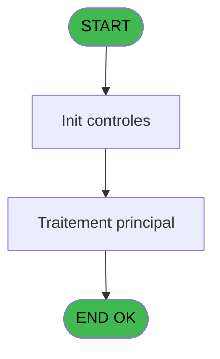

# REF IDE 839 - Adapter guillemets SQL

> **Analyse**: Phases 1-4 2026-02-03 14:40 -> 14:40 (13s) | Assemblage 14:40
> **Pipeline**: V7.2 Enrichi
> **Structure**: 4 onglets (Resume | Ecrans | Donnees | Connexions)

<!-- TAB:Resume -->

## 1. FICHE D'IDENTITE

| Attribut | Valeur |
|----------|--------|
| Projet | REF |
| IDE Position | 839 |
| Nom Programme | Adapter guillemets SQL |
| Fichier source | `Prg_839.xml` |
| Dossier IDE | General |
| Taches | 1 (0 ecrans visibles) |
| Tables modifiees | 0 |
| Programmes appeles | 0 |

## 2. DESCRIPTION FONCTIONNELLE

**Adapter guillemets SQL** assure la gestion complete de ce processus, accessible depuis [Clause Where (IDE 837)](REF-IDE-837.md), [Clause Where sans Where (IDE 838)](REF-IDE-838.md).

Le flux de traitement s'organise en **1 blocs fonctionnels** :

- **Traitement** (1 tache) : traitements metier divers

## 3. BLOCS FONCTIONNELS

### 3.1 Traitement (1 tache)

Traitements internes.

---

#### 839 - UTInnn-Adapter cnd guillemets

**Role** : Traitement : UTInnn-Adapter cnd guillemets.

## 5. REGLES METIER

*(Aucune regle metier identifiee)*

## 6. CONTEXTE

- **Appele par**: [Clause Where (IDE 837)](REF-IDE-837.md), [Clause Where sans Where (IDE 838)](REF-IDE-838.md)
- **Appelle**: 0 programmes | **Tables**: 0 (W:0 R:0 L:0) | **Taches**: 1 | **Expressions**: 21

<!-- TAB:Ecrans -->

## 8. ECRANS

*(Programme sans ecran visible)*

## 9. NAVIGATION

### 9.3 Structure hierarchique (1 tache)

| Position | Tache | Type | Dimensions | Bloc |
|----------|-------|------|------------|------|
| **839.1** | [**UTInnn-Adapter cnd guillemets** (839)](#t1) | - | - | Traitement |

### 9.4 Algorigramme

> **Legende**: Vert = START/END OK | Rouge = END KO | Bleu = Decisions
> *Algorigramme auto-genere. Utiliser `/algorigramme` pour une synthese metier detaillee.*

<!-- TAB:Donnees -->

## 10. TABLES

### Tables utilisees (0)

| ID | Nom | Description | Type | R | W | L | Usages |
|----|-----|-------------|------|---|---|---|--------|

### Colonnes par table (0 / 0 tables avec colonnes identifiees)

## 11. VARIABLES

### 11.1 Variables de session (16)

Variables persistantes pendant toute la session.

| Lettre | Nom | Type | Usage dans |
|--------|-----|------|-----------|
| C | v.Nb guillemet(s) | Numeric | 2x session |
| D | v.Nb trouver expression ISNULL | Numeric | - |
| E | v.Found ISNULL ? | Logical | 2x session |
| F | v.Position du premier guillemet | Numeric | - |
| G | v.Partie DEBUT + 1er guillemet | Unicode | - |
| H | v.Partie après le 1er guillemet | Unicode | - |
| I | v.Condition inversée | Unicode | 3x session |
| J | v.Position du dernier guillemet | Numeric | - |
| K | v.Partie FIN + dern. guillemet | Unicode | - |
| L | v.Partie située au milieu | Unicode | 4x session |
| M | v.Nb trouver expression BETWEEN | Numeric | - |
| N | v.Nb trouver expression AND | Numeric | - |
| O | v.Nb trouver expression OR | Numeric | - |
| P | v.Cas particulier ? | Logical | 1x session |
| Q | v.Milieu avec guillemet | Unicode | [839](#t1) |
| R | v.Construction de la condition | Unicode | - |

### 11.2 Autres (2)

Variables diverses.

| Lettre | Nom | Type | Usage dans |
|--------|-----|------|-----------|
| A | = CONDITION | Unicode | 7x refs |
| B | > Ramener avec guillemet ? | Logical | - |

Toutes les 18 variables (liste complete)

| Cat | Lettre | Nom Variable | Type |
|-----|--------|--------------|------|
| V. | **C** | v.Nb guillemet(s) | Numeric |
| V. | **D** | v.Nb trouver expression ISNULL | Numeric |
| V. | **E** | v.Found ISNULL ? | Logical |
| V. | **F** | v.Position du premier guillemet | Numeric |
| V. | **G** | v.Partie DEBUT + 1er guillemet | Unicode |
| V. | **H** | v.Partie après le 1er guillemet | Unicode |
| V. | **I** | v.Condition inversée | Unicode |
| V. | **J** | v.Position du dernier guillemet | Numeric |
| V. | **K** | v.Partie FIN + dern. guillemet | Unicode |
| V. | **L** | v.Partie située au milieu | Unicode |
| V. | **M** | v.Nb trouver expression BETWEEN | Numeric |
| V. | **N** | v.Nb trouver expression AND | Numeric |
| V. | **O** | v.Nb trouver expression OR | Numeric |
| V. | **P** | v.Cas particulier ? | Logical |
| V. | **Q** | v.Milieu avec guillemet | Unicode |
| V. | **R** | v.Construction de la condition | Unicode |
| Autre | **A** | = CONDITION | Unicode |
| Autre | **B** | > Ramener avec guillemet ? | Logical |

## 12. EXPRESSIONS

**21 / 21 expressions decodees (100%)**

### 12.1 Repartition par type

| Type | Expressions | Regles |
|------|-------------|--------|
| CONDITION | 8 | 0 |
| CALCULATION | 1 | 0 |
| FORMAT | 8 | 0 |
| STRING | 3 | 0 |
| CONCATENATION | 1 | 0 |

### 12.2 Expressions cles par type

#### CONDITION (8 expressions)

| Type | IDE | Expression | Regle |
|------|-----|------------|-------|
| CONDITION | 1 | `Trim(= CONDITION [A])` | - |
| CONDITION | 19 | `NOT(> Ramener avec guillem... [B]) AND NOT(v.Found ISNULL ? [E]) AND v.Nb guillemet(s) [C]>1` | - |
| CONDITION | 6 | `MID(Trim(= CONDITION [A]),0,v.Position du premier ... [F])` | - |
| CONDITION | 2 | `StrTokenCnt(Trim(= CONDITION [A]),'''')` | - |
| CONDITION | 4 | `v.Nb trouver expressio... [D]<>0` | - |
| ... | | *+3 autres* | |

#### CALCULATION (1 expressions)

| Type | IDE | Expression | Regle |
|------|-----|------------|-------|
| CALCULATION | 11 | `MID(Trim(v.Condition inversée [I]),v.Position du dernier ... [J]+1,1000)` | - |

#### FORMAT (8 expressions)

| Type | IDE | Expression | Regle |
|------|-----|------------|-------|
| FORMAT | 14 | `InStr(Trim(Flip(Upper(v.Partie située au milieu [L]))),'OR')` | - |
| FORMAT | 13 | `InStr(Trim(Flip(Upper(v.Partie située au milieu [L]))),'AND')` | - |
| FORMAT | 21 | `RepStr(Trim(= CONDITION [A]),'''','''''')` | - |
| FORMAT | 16 | `RepStr(Trim(v.Partie située au milieu [L]),'''','''''')` | - |
| FORMAT | 5 | `InStr(Trim(= CONDITION [A]),'''')` | - |
| ... | | *+3 autres* | |

#### STRING (3 expressions)

| Type | IDE | Expression | Regle |
|------|-----|------------|-------|
| STRING | 20 | `Trim(v.Construction de la c... [R])` | - |
| STRING | 10 | `MID(Trim(v.Condition inversée [I]),0,v.Position du dernier ... [J])` | - |
| STRING | 8 | `Flip(Trim(v.Partie après le 1er ... [H]))` | - |

#### CONCATENATION (1 expressions)

| Type | IDE | Expression | Regle |
|------|-----|------------|-------|
| CONCATENATION | 17 | `Trim(v.Partie DEBUT + 1er g... [G])&Trim(Flip(v.Milieu avec guillemet [Q]))&Trim(Flip(v.Partie FIN + dern. g... [K]))` | - |

### 12.3 Toutes les expressions (21)

Voir les 21 expressions

#### CONDITION (8)

| IDE | Expression Decodee |
|-----|-------------------|
| 7 | `MID(Trim(= CONDITION [A]),v.Position du premier ... [F]+1,1000)` |
| 4 | `v.Nb trouver expressio... [D]<>0` |
| 15 | `v.Nb trouver expressio... [M]<>0 OR v.Nb trouver expressio... [N]<>0 OR v.Nb trouver expressio... [O]<>0` |
| 18 | `> Ramener avec guillem... [B] AND NOT(v.Found ISNULL ? [E]) AND v.Nb guillemet(s) [C]>3 AND NOT(v.Cas particulier ? [P])` |
| 19 | `NOT(> Ramener avec guillem... [B]) AND NOT(v.Found ISNULL ? [E]) AND v.Nb guillemet(s) [C]>1` |
| 1 | `Trim(= CONDITION [A])` |
| 2 | `StrTokenCnt(Trim(= CONDITION [A]),'''')` |
| 6 | `MID(Trim(= CONDITION [A]),0,v.Position du premier ... [F])` |

#### CALCULATION (1)

| IDE | Expression Decodee |
|-----|-------------------|
| 11 | `MID(Trim(v.Condition inversée [I]),v.Position du dernier ... [J]+1,1000)` |

#### FORMAT (8)

| IDE | Expression Decodee |
|-----|-------------------|
| 3 | `InStr(Trim(Upper(= CONDITION [A])),'ISNULL')` |
| 5 | `InStr(Trim(= CONDITION [A]),'''')` |
| 9 | `InStr(Trim(v.Condition inversée [I]),'''')` |
| 12 | `InStr(Trim(Flip(Upper(v.Partie située au milieu [L]))),'BETWEEN')` |
| 13 | `InStr(Trim(Flip(Upper(v.Partie située au milieu [L]))),'AND')` |
| 14 | `InStr(Trim(Flip(Upper(v.Partie située au milieu [L]))),'OR')` |
| 16 | `RepStr(Trim(v.Partie située au milieu [L]),'''','''''')` |
| 21 | `RepStr(Trim(= CONDITION [A]),'''','''''')` |

#### STRING (3)

| IDE | Expression Decodee |
|-----|-------------------|
| 8 | `Flip(Trim(v.Partie après le 1er ... [H]))` |
| 10 | `MID(Trim(v.Condition inversée [I]),0,v.Position du dernier ... [J])` |
| 20 | `Trim(v.Construction de la c... [R])` |

#### CONCATENATION (1)

| IDE | Expression Decodee |
|-----|-------------------|
| 17 | `Trim(v.Partie DEBUT + 1er g... [G])&Trim(Flip(v.Milieu avec guillemet [Q]))&Trim(Flip(v.Partie FIN + dern. g... [K]))` |

<!-- TAB:Connexions -->

## 13. GRAPHE D'APPELS

### 13.1 Chaine depuis Main (Callers)

Main -> ... -> [Clause Where (IDE 837)](REF-IDE-837.md) -> **Adapter guillemets SQL (IDE 839)**

Main -> ... -> [Clause Where sans Where (IDE 838)](REF-IDE-838.md) -> **Adapter guillemets SQL (IDE 839)**

### 13.2 Callers

| IDE | Nom Programme | Nb Appels |
|-----|---------------|-----------|
| [837](REF-IDE-837.md) | Clause Where | 20 |
| [838](REF-IDE-838.md) | Clause Where sans Where | 20 |

### 13.3 Callees (programmes appeles)

### 13.4 Detail Callees avec contexte

| IDE | Nom Programme | Appels | Contexte |
|-----|---------------|--------|----------|
| - | (aucun) | - | - |

## 14. RECOMMANDATIONS MIGRATION

### 14.1 Profil du programme

| Metrique | Valeur | Impact migration |
|----------|--------|-----------------|
| Lignes de logique | 44 | Programme compact |
| Expressions | 21 | Peu de logique |
| Tables WRITE | 0 | Impact faible |
| Sous-programmes | 0 | Peu de dependances |
| Ecrans visibles | 0 | Ecran unique ou traitement batch |
| Code desactive | 0% (0 / 44) | Code sain |
| Regles metier | 0 | Pas de regle identifiee |

### 14.2 Plan de migration par bloc

#### Traitement (1 tache: 0 ecran, 1 traitement)

- **Strategie** : 1 service(s) backend injectable(s) (Domain Services).
- Decomposer les taches en services unitaires testables.

### 14.3 Dependances critiques

| Dependance | Type | Appels | Impact |
|------------|------|--------|--------|

---
*Spec DETAILED generee par Pipeline V7.2 - 2026-02-03 14:40*
