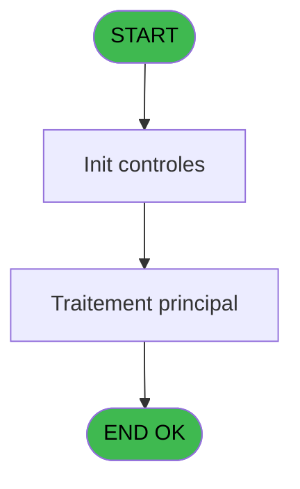
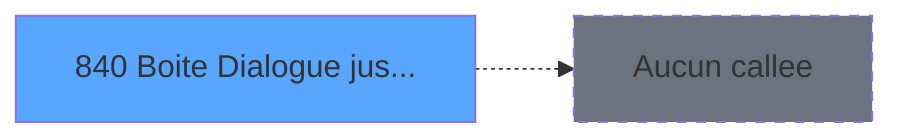

# REF IDE 840 - Boite Dialogue jusqua 3 bouton

> **Analyse**: Phases 1-4 2026-02-03 14:40 -> 14:40 (13s) | Assemblage 14:40
> **Pipeline**: V7.2 Enrichi
> **Structure**: 4 onglets (Resume | Ecrans | Donnees | Connexions)

<!-- TAB:Resume -->

## 1. FICHE D'IDENTITE

| Attribut | Valeur |
|----------|--------|
| Projet | REF |
| IDE Position | 840 |
| Nom Programme | Boite Dialogue jusqua 3 bouton |
| Fichier source | `Prg_840.xml` |
| Dossier IDE | General |
| Taches | 1 (1 ecrans visibles) |
| Tables modifiees | 0 |
| Programmes appeles | 0 |
| :warning: Statut | **ORPHELIN_POTENTIEL** |

## 2. DESCRIPTION FONCTIONNELLE

**Boite Dialogue jusqua 3 bouton** assure la gestion complete de ce processus.

Le flux de traitement s'organise en **1 blocs fonctionnels** :

- **Traitement** (1 tache) : traitements metier divers

**Logique metier** : 1 regles identifiees couvrant conditions metier.

## 3. BLOCS FONCTIONNELS

### 3.1 Traitement (1 tache)

Traitements internes.

---

#### 840 - UTInnn Boite Dialogue 3 bouton [[ECRAN]](#ecran-t1)

**Role** : Traitement : UTInnn Boite Dialogue 3 bouton.
**Ecran** : 472 x 89 DLU | [Voir mockup](#ecran-t1)
**Variables liees** : A (>Titre boite dialogue), C (>Texte bouton 1), D (>Texte bouton 2), E (>Texte bouton 3)

## 5. REGLES METIER

1 regles identifiees:

### Autres (1 regles)

#### [RM-001] Traitement si >Titre boite dialogue [A] est renseigne

| Element | Detail |
|---------|--------|
| **Condition** | `>Titre boite dialogue [A]<>''` |
| **Si vrai** | Trim(>Titre boite dialogue [A]) |
| **Si faux** | 'Question') |
| **Variables** | A (>Titre boite dialogue) |
| **Expression source** | Expression 1 : `IF(>Titre boite dialogue [A]<>'',Trim(>Titre boite dialogue ` |
| **Exemple** | Si >Titre boite dialogue [A]<>'' → Trim(>Titre boite dialogue [A]). Sinon → 'Question') |

## 6. CONTEXTE

- **Appele par**: (aucun)
- **Appelle**: 0 programmes | **Tables**: 0 (W:0 R:0 L:0) | **Taches**: 1 | **Expressions**: 12

<!-- TAB:Ecrans -->

## 8. ECRANS

### 8.1 Forms visibles (1 / 1)

| # | Position | Tache | Nom | Type | Largeur | Hauteur | Bloc |
|---|----------|-------|-----|------|---------|---------|------|
| 1 | 840 | 840 | UTInnn Boite Dialogue 3 bouton | Type0 | 472 | 89 | Traitement |

### 8.2 Mockups Ecrans

---

#### 840 - UTInnn Boite Dialogue 3 bouton
**Tache** : [840](#t1) | **Type** : Type0 | **Dimensions** : 472 x 89 DLU
**Bloc** : Traitement | **Titre IDE** : UTInnn Boite Dialogue 3 bouton

<!-- FORM-DATA:
{
    "width":  472,
    "vFactor":  8,
    "type":  "Type0",
    "hFactor":  4,
    "controls":  [
                     {
                         "x":  12,
                         "type":  "edit",
                         "var":  "",
                         "y":  11,
                         "w":  448,
                         "fmt":  "",
                         "name":  "\u003eTexte du message",
                         "h":  48,
                         "color":  "",
                         "text":  "",
                         "parent":  null
                     },
                     {
                         "x":  1,
                         "type":  "button",
                         "var":  "",
                         "y":  64,
                         "w":  153,
                         "fmt":  "Button1",
                         "name":  "",
                         "h":  24,
                         "color":  "",
                         "text":  "",
                         "parent":  null
                     },
                     {
                         "x":  159,
                         "type":  "button",
                         "var":  "",
                         "y":  64,
                         "w":  153,
                         "fmt":  "Button2",
                         "name":  "",
                         "h":  24,
                         "color":  "",
                         "text":  "",
                         "parent":  null
                     },
                     {
                         "x":  318,
                         "type":  "button",
                         "var":  "",
                         "y":  64,
                         "w":  153,
                         "fmt":  "Button3",
                         "name":  "",
                         "h":  24,
                         "color":  "",
                         "text":  "",
                         "parent":  null
                     }
                 ],
    "taskId":  "840",
    "height":  89
}
-->

<strong>Champs : 1 champs</strong>

| Pos (x,y) | Nom | Variable | Type |
|-----------|-----|----------|------|
| 12,11 | >Texte du message | - | edit |

<strong>Boutons : 3 boutons</strong>

| Bouton | Pos (x,y) | Action |
|--------|-----------|--------|
| Button1 | 1,64 | Bouton fonctionnel |
| Button2 | 159,64 | Bouton fonctionnel |
| Button3 | 318,64 | Bouton fonctionnel |

## 9. NAVIGATION

Ecran unique: **UTInnn Boite Dialogue 3 bouton**

### 9.3 Structure hierarchique (1 tache)

| Position | Tache | Type | Dimensions | Bloc |
|----------|-------|------|------------|------|
| **840.1** | [**UTInnn Boite Dialogue 3 bouton** (840)](#t1) [mockup](#ecran-t1) | - | 472x89 | Traitement |

### 9.4 Algorigramme

> **Legende**: Vert = START/END OK | Rouge = END KO | Bleu = Decisions
> *Algorigramme auto-genere. Utiliser `/algorigramme` pour une synthese metier detaillee.*

<!-- TAB:Donnees -->

## 10. TABLES

### Tables utilisees (0)

| ID | Nom | Description | Type | R | W | L | Usages |
|----|-----|-------------|------|---|---|---|--------|

### Colonnes par table (0 / 0 tables avec colonnes identifiees)

## 11. VARIABLES

### 11.1 Autres (7)

Variables diverses.

| Lettre | Nom | Type | Usage dans |
|--------|-----|------|-----------|
| A | >Titre boite dialogue | Unicode | [840](#t1) |
| B | >Texte du message | Unicode | - |
| C | >Texte bouton 1 | Unicode | [840](#t1) |
| D | >Texte bouton 2 | Unicode | [840](#t1) |
| E | >Texte bouton 3 | Unicode | [840](#t1) |
| F | >Réponse par défaut | Numeric | 1x refs |
| G | <Réponse | Numeric | 1x refs |

## 12. EXPRESSIONS

**12 / 12 expressions decodees (100%)**

### 12.1 Repartition par type

| Type | Expressions | Regles |
|------|-------------|--------|
| CONDITION | 9 | 5 |
| CONSTANTE | 3 | 0 |

### 12.2 Expressions cles par type

#### CONDITION (9 expressions)

| Type | IDE | Expression | Regle |
|------|-----|------------|-------|
| CONDITION | 1 | `IF(>Titre boite dialogue [A]<>'',Trim(>Titre boite dialogue [A]),'Question')` | [RM-001](#rm-RM-001) |
| CONDITION | 7 | `Trim(>Texte bouton 1 [C])` | - |
| CONDITION | 12 | `>Texte bouton 3 [E]<>''` | - |
| CONDITION | 9 | `Trim(>Texte bouton 3 [E])` | - |
| CONDITION | 8 | `Trim(>Texte bouton 2 [D])` | - |
| ... | | *+4 autres* | |

#### CONSTANTE (3 expressions)

| Type | IDE | Expression | Regle |
|------|-----|------------|-------|
| CONSTANTE | 5 | `3` | - |
| CONSTANTE | 4 | `2` | - |
| CONSTANTE | 3 | `1` | - |

<!-- TAB:Connexions -->

## 13. GRAPHE D'APPELS

### 13.1 Chaine depuis Main (Callers)

**Chemin**: (pas de callers directs)

### 13.2 Callers

| IDE | Nom Programme | Nb Appels |
|-----|---------------|-----------|
| - | (aucun) | - |

### 13.3 Callees (programmes appeles)

### 13.4 Detail Callees avec contexte

| IDE | Nom Programme | Appels | Contexte |
|-----|---------------|--------|----------|
| - | (aucun) | - | - |

## 14. RECOMMANDATIONS MIGRATION

### 14.1 Profil du programme

| Metrique | Valeur | Impact migration |
|----------|--------|-----------------|
| Lignes de logique | 20 | Programme compact |
| Expressions | 12 | Peu de logique |
| Tables WRITE | 0 | Impact faible |
| Sous-programmes | 0 | Peu de dependances |
| Ecrans visibles | 1 | Ecran unique ou traitement batch |
| Code desactive | 0% (0 / 20) | Code sain |
| Regles metier | 1 | Quelques regles a preserver |

### 14.2 Plan de migration par bloc

#### Traitement (1 tache: 1 ecran, 0 traitement)

- **Strategie** : 1 composant(s) UI (Razor/React) avec formulaires et validation.
- Decomposer les taches en services unitaires testables.

### 14.3 Dependances critiques

| Dependance | Type | Appels | Impact |
|------------|------|--------|--------|

---
*Spec DETAILED generee par Pipeline V7.2 - 2026-02-03 14:40*
