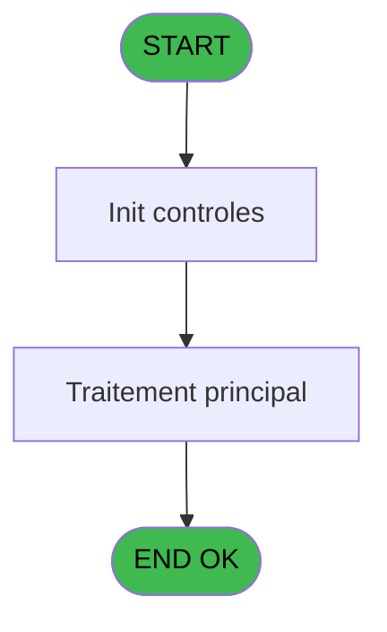

# REF IDE 842 - Log Liste variable précédente

> **Analyse**: Phases 1-4 2026-02-03 14:41 -> 14:41 (14s) | Assemblage 14:41
> **Pipeline**: V7.2 Enrichi
> **Structure**: 4 onglets (Resume | Ecrans | Donnees | Connexions)

<!-- TAB:Resume -->

## 1. FICHE D'IDENTITE

| Attribut | Valeur |
|----------|--------|
| Projet | REF |
| IDE Position | 842 |
| Nom Programme | Log Liste variable précédente |
| Fichier source | `Prg_842.xml` |
| Dossier IDE | General |
| Taches | 2 (0 ecrans visibles) |
| Tables modifiees | 0 |
| Programmes appeles | 0 |

## 2. DESCRIPTION FONCTIONNELLE

**Log Liste variable précédente** assure la gestion complete de ce processus, accessible depuis [Main Program (IDE 1)](REF-IDE-1.md).

Le flux de traitement s'organise en **1 blocs fonctionnels** :

- **Traitement** (2 taches) : traitements metier divers

## 3. BLOCS FONCTIONNELS

### 3.1 Traitement (2 taches)

Traitements internes.

---

#### 842 - Log liste variable précédente

**Role** : Traitement : Log liste variable précédente.
**Variables liees** : I (v.Picture de la variable), J (v.No Variable en cours), K (v.VariableU), L (v.VariableN (entier)), M (v.VariableN (décimale))

---

#### 842.1 - Log liste variable précédente

**Role** : Traitement : Log liste variable précédente.
**Variables liees** : I (v.Picture de la variable), J (v.No Variable en cours), K (v.VariableU), L (v.VariableN (entier)), M (v.VariableN (décimale))

## 5. REGLES METIER

*(Aucune regle metier identifiee)*

## 6. CONTEXTE

- **Appele par**: [Main Program (IDE 1)](REF-IDE-1.md)
- **Appelle**: 0 programmes | **Tables**: 0 (W:0 R:0 L:0) | **Taches**: 2 | **Expressions**: 42

<!-- TAB:Ecrans -->

## 8. ECRANS

*(Programme sans ecran visible)*

## 9. NAVIGATION

### 9.3 Structure hierarchique (2 taches)

| Position | Tache | Type | Dimensions | Bloc |
|----------|-------|------|------------|------|
| **842.1** | [**Log liste variable précédente** (842)](#t1) | - | - | Traitement |
| 842.1.1 | [Log liste variable précédente (842.1)](#t2) | - | - | |

### 9.4 Algorigramme

> **Legende**: Vert = START/END OK | Rouge = END KO | Bleu = Decisions
> *Algorigramme auto-genere. Utiliser `/algorigramme` pour une synthese metier detaillee.*

<!-- TAB:Donnees -->

## 10. TABLES

### Tables utilisees (0)

| ID | Nom | Description | Type | R | W | L | Usages |
|----|-----|-------------|------|---|---|---|--------|

### Colonnes par table (0 / 0 tables avec colonnes identifiees)

## 11. VARIABLES

### 11.1 Variables de session (21)

Variables persistantes pendant toute la session.

| Lettre | Nom | Type | Usage dans |
|--------|-----|------|-----------|
| A | v.Position en cours | Numeric | 1x session |
| E | v.Nom du fichier | Unicode | - |
| F | v.Message | Blob | 5x session |
| G | v.Nom du champ (Para_Virt) | Unicode | - |
| H | v.Attribut (U_N_L_D_T) | Unicode | 7x session |
| I | v.Picture de la variable | Unicode | [842](#t1), [842.1](#t2) |
| J | v.No Variable en cours | Numeric | [842](#t1), [842.1](#t2) |
| K | v.VariableU | Unicode | 1x session |
| L | v.VariableN (entier) | Numeric | 2x session |
| M | v.VariableN (décimale) | Numeric | 1x session |
| N | v.VariableL | Logical | 1x session |
| O | v.VariableD | Date | 1x session |
| P | v.VariableT | Time | 5x session |
| Q | v.Décimal ? | Logical | 2x session |
| R | v.Message de base | Unicode | - |
| S | v.Retour chariot ? | Logical | 3x session |
| T | v.Ligne programme a editer? | Logical | - |
| U | v.1ere variable dans ce prog | Numeric | - |
| W | v.Position du 1er chariot | Numeric | - |
| X | v.Message en cours | Unicode | - |
| Y | v.Passage par retour chariot ? | Logical | - |

### 11.2 Autres (4)

Variables diverses.

| Lettre | Nom | Type | Usage dans |
|--------|-----|------|-----------|
| B | > TYPE_ERREUR | Unicode | 1x refs |
| C | >Position 1ere variable REF | Numeric | - |
| D | < Chemin\Nom fichier à stocker | Unicode | - |
| V | > Nb de Variable dans REF | Numeric | - |

Toutes les 25 variables (liste complete)

| Cat | Lettre | Nom Variable | Type |
|-----|--------|--------------|------|
| V. | **A** | v.Position en cours | Numeric |
| V. | **E** | v.Nom du fichier | Unicode |
| V. | **F** | v.Message | Blob |
| V. | **G** | v.Nom du champ (Para_Virt) | Unicode |
| V. | **H** | v.Attribut (U_N_L_D_T) | Unicode |
| V. | **I** | v.Picture de la variable | Unicode |
| V. | **J** | v.No Variable en cours | Numeric |
| V. | **K** | v.VariableU | Unicode |
| V. | **L** | v.VariableN (entier) | Numeric |
| V. | **M** | v.VariableN (décimale) | Numeric |
| V. | **N** | v.VariableL | Logical |
| V. | **O** | v.VariableD | Date |
| V. | **P** | v.VariableT | Time |
| V. | **Q** | v.Décimal ? | Logical |
| V. | **R** | v.Message de base | Unicode |
| V. | **S** | v.Retour chariot ? | Logical |
| V. | **T** | v.Ligne programme a editer? | Logical |
| V. | **U** | v.1ere variable dans ce prog | Numeric |
| V. | **W** | v.Position du 1er chariot | Numeric |
| V. | **X** | v.Message en cours | Unicode |
| V. | **Y** | v.Passage par retour chariot ? | Logical |
| Autre | **B** | > TYPE_ERREUR | Unicode |
| Autre | **C** | >Position 1ere variable REF | Numeric |
| Autre | **D** | < Chemin\Nom fichier à stocker | Unicode |
| Autre | **V** | > Nb de Variable dans REF | Numeric |

## 12. EXPRESSIONS

**42 / 42 expressions decodees (100%)**

### 12.1 Repartition par type

| Type | Expressions | Regles |
|------|-------------|--------|
| CALCULATION | 6 | 0 |
| CONDITION | 8 | 0 |
| CONSTANTE | 4 | 0 |
| FORMAT | 8 | 0 |
| CAST_LOGIQUE | 2 | 0 |
| OTHER | 13 | 0 |
| CONCATENATION | 1 | 0 |

### 12.2 Expressions cles par type

#### CALCULATION (6 expressions)

| Type | IDE | Expression | Regle |
|------|-----|------------|-------|
| CALCULATION | 24 | `MID(v.VariableT [P],v.Retour chariot ? [S]+1,1000)` | - |
| CALCULATION | 25 | `MID(v.VariableT [P],v.Retour chariot ? [S]+2,1000)` | - |
| CALCULATION | 42 | `[AA]-[AB]` | - |
| CALCULATION | 8 | `'v.Position en cours [A]'VAR-1` | - |
| CALCULATION | 9 | `[AA]-[Z]` | - |
| ... | | *+1 autres* | |

#### CONDITION (8 expressions)

| Type | IDE | Expression | Regle |
|------|-----|------------|-------|
| CONDITION | 7 | `v.Message [F] = 'T'` | - |
| CONDITION | 6 | `v.Message [F] = 'D'` | - |
| CONDITION | 30 | `v.Retour chariot ? [S]=0` | - |
| CONDITION | 10 | `v.Attribut (U_N_L_D_T) [H]>0` | - |
| CONDITION | 3 | `v.Message [F] = 'N'` | - |
| ... | | *+3 autres* | |

#### CONSTANTE (4 expressions)

| Type | IDE | Expression | Regle |
|------|-----|------------|-------|
| CONSTANTE | 38 | `'True'` | - |
| CONSTANTE | 39 | `'False'` | - |
| CONSTANTE | 2 | `0` | - |
| CONSTANTE | 23 | `''` | - |

#### FORMAT (8 expressions)

| Type | IDE | Expression | Regle |
|------|-----|------------|-------|
| FORMAT | 28 | `InStr(v.VariableT [P],'
')` | - |
| FORMAT | 19 | `TStr(v.VariableL [N],v.Nom du champ (Para_V... [G])` | - |
| FORMAT | 32 | `InStr(v.Nom du champ (Para_V... [G],'.')<>0` | - |
| FORMAT | 29 | `InStr(v.VariableT [P],'
')<>0` | - |
| FORMAT | 31 | `Trim(> TYPE_ERREUR [B])&'_'&Trim(VG2)&'_'&DStr(Date(),'DD_MM_YY')&'_'&TStr(Time(),'HH_MM')` | - |
| ... | | *+3 autres* | |

#### CAST_LOGIQUE (2 expressions)

| Type | IDE | Expression | Regle |
|------|-----|------------|-------|
| CAST_LOGIQUE | 34 | `'TRUE'LOG` | - |
| CAST_LOGIQUE | 1 | `'FALSE'LOG` | - |

#### OTHER (13 expressions)

| Type | IDE | Expression | Regle |
|------|-----|------------|-------|
| OTHER | 35 | `v.Picture de la variable [I]` | - |
| OTHER | 33 | `NOT(v.VariableD [O])` | - |
| OTHER | 27 | `v.Picture de la variable [I]` | - |
| OTHER | 41 | `[AA]` | - |
| OTHER | 37 | `NOT(v.VariableN (entier) [L])` | - |
| ... | | *+8 autres* | |

#### CONCATENATION (1 expressions)

| Type | IDE | Expression | Regle |
|------|-----|------------|-------|
| CONCATENATION | 40 | `Translate('%TempDir%'&Trim(>Position 1ere variabl... [C])&'.log')` | - |

### 12.3 Toutes les expressions (42)

Voir les 42 expressions

#### CALCULATION (6)

| IDE | Expression Decodee |
|-----|-------------------|
| 8 | `'v.Position en cours [A]'VAR-1` |
| 9 | `[AA]-[Z]` |
| 20 | `v.Attribut (U_N_L_D_T) [H]-1` |
| 24 | `MID(v.VariableT [P],v.Retour chariot ? [S]+1,1000)` |
| 25 | `MID(v.VariableT [P],v.Retour chariot ? [S]+2,1000)` |
| 42 | `[AA]-[AB]` |

#### CONDITION (8)

| IDE | Expression Decodee |
|-----|-------------------|
| 11 | `v.Attribut (U_N_L_D_T) [H]>[AA]-[Z]` |
| 3 | `v.Message [F] = 'N'` |
| 4 | `v.Message [F] = 'U'` |
| 5 | `v.Message [F] = 'L'` |
| 6 | `v.Message [F] = 'D'` |
| 7 | `v.Message [F] = 'T'` |
| 10 | `v.Attribut (U_N_L_D_T) [H]>0` |
| 30 | `v.Retour chariot ? [S]=0` |

#### CONSTANTE (4)

| IDE | Expression Decodee |
|-----|-------------------|
| 2 | `0` |
| 23 | `''` |
| 38 | `'True'` |
| 39 | `'False'` |

#### FORMAT (8)

| IDE | Expression Decodee |
|-----|-------------------|
| 18 | `DStr(v.VariableN (décimale) [M],v.Nom du champ (Para_V... [G])` |
| 31 | `Trim(> TYPE_ERREUR [B])&'_'&Trim(VG2)&'_'&DStr(Date(),'DD_MM_YY')&'_'&TStr(Time(),'HH_MM')` |
| 16 | `Str(v.No Variable en cours [J],v.Nom du champ (Para_V... [G])` |
| 17 | `Str(v.VariableU [K],v.Nom du champ (Para_V... [G])` |
| 19 | `TStr(v.VariableL [N],v.Nom du champ (Para_V... [G])` |
| 28 | `InStr(v.VariableT [P],'
')` |
| 29 | `InStr(v.VariableT [P],'
')<>0` |
| 32 | `InStr(v.Nom du champ (Para_V... [G],'.')<>0` |

#### CAST_LOGIQUE (2)

| IDE | Expression Decodee |
|-----|-------------------|
| 1 | `'FALSE'LOG` |
| 34 | `'TRUE'LOG` |

#### OTHER (13)

| IDE | Expression Decodee |
|-----|-------------------|
| 12 | `VarName(v.Attribut (U_N_L_D_T) [H])` |
| 13 | `VarAttr(v.Attribut (U_N_L_D_T) [H])` |
| 14 | `VarCurr(v.Attribut (U_N_L_D_T) [H])` |
| 15 | `VarPic(v.Attribut (U_N_L_D_T) [H],0)` |
| 21 | `v.Décimal ? [Q]` |
| 22 | `NOT(v.Décimal ? [Q]) AND NOT(v.1ere variable dans c... [U])` |
| 26 | `StrToken(v.VariableT [P],1,'
')` |
| 27 | `v.Picture de la variable [I]` |
| 33 | `NOT(v.VariableD [O])` |
| 35 | `v.Picture de la variable [I]` |
| 36 | `v.VariableN (entier) [L]` |
| 37 | `NOT(v.VariableN (entier) [L])` |
| 41 | `[AA]` |

#### CONCATENATION (1)

| IDE | Expression Decodee |
|-----|-------------------|
| 40 | `Translate('%TempDir%'&Trim(>Position 1ere variabl... [C])&'.log')` |

<!-- TAB:Connexions -->

## 13. GRAPHE D'APPELS

### 13.1 Chaine depuis Main (Callers)

Main -> ... -> [Main Program (IDE 1)](REF-IDE-1.md) -> **Log Liste variable précédente (IDE 842)**

### 13.2 Callers

| IDE | Nom Programme | Nb Appels |
|-----|---------------|-----------|
| [1](REF-IDE-1.md) | Main Program | 1 |

### 13.3 Callees (programmes appeles)

### 13.4 Detail Callees avec contexte

| IDE | Nom Programme | Appels | Contexte |
|-----|---------------|--------|----------|
| - | (aucun) | - | - |

## 14. RECOMMANDATIONS MIGRATION

### 14.1 Profil du programme

| Metrique | Valeur | Impact migration |
|----------|--------|-----------------|
| Lignes de logique | 140 | Programme compact |
| Expressions | 42 | Peu de logique |
| Tables WRITE | 0 | Impact faible |
| Sous-programmes | 0 | Peu de dependances |
| Ecrans visibles | 0 | Ecran unique ou traitement batch |
| Code desactive | 0.7% (1 / 140) | Code sain |
| Regles metier | 0 | Pas de regle identifiee |

### 14.2 Plan de migration par bloc

#### Traitement (2 taches: 0 ecran, 2 traitements)

- **Strategie** : 2 service(s) backend injectable(s) (Domain Services).
- Decomposer les taches en services unitaires testables.

### 14.3 Dependances critiques

| Dependance | Type | Appels | Impact |
|------------|------|--------|--------|

---
*Spec DETAILED generee par Pipeline V7.2 - 2026-02-03 14:41*
