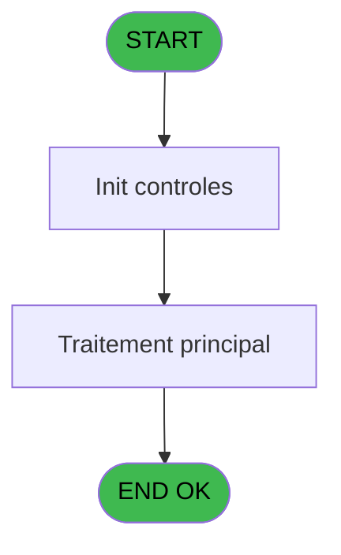
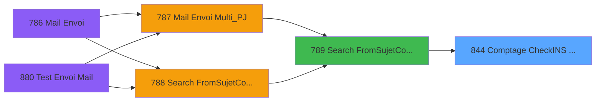

# REF IDE 844 - Comptage CheckINS Non transmis

> **Analyse**: Phases 1-4 2026-02-03 14:41 -> 14:41 (14s) | Assemblage 14:41
> **Pipeline**: V7.2 Enrichi
> **Structure**: 4 onglets (Resume | Ecrans | Donnees | Connexions)

<!-- TAB:Resume -->

## 1. FICHE D'IDENTITE

| Attribut | Valeur |
|----------|--------|
| Projet | REF |
| IDE Position | 844 |
| Nom Programme | Comptage CheckINS Non transmis |
| Fichier source | `Prg_844.xml` |
| Dossier IDE | General |
| Taches | 1 (0 ecrans visibles) |
| Tables modifiees | 0 |
| Programmes appeles | 0 |

## 2. DESCRIPTION FONCTIONNELLE

**Comptage CheckINS Non transmis** assure la gestion complete de ce processus, accessible depuis [Search From&Sujet&Corps Mul_PJ (IDE 789)](REF-IDE-789.md).

Le flux de traitement s'organise en **1 blocs fonctionnels** :

- **Traitement** (1 tache) : traitements metier divers

**Logique metier** : 2 regles identifiees couvrant conditions metier.

## 3. BLOCS FONCTIONNELS

### 3.1 Traitement (1 tache)

Traitements internes.

---

#### 844 - (sans nom)

**Role** : Traitement interne.

## 5. REGLES METIER

2 regles identifiees:

### Autres (2 regles)

#### [RM-001] Traitement si [G] est non nul

| Element | Detail |
|---------|--------|
| **Condition** | `[G]<>0` |
| **Si vrai** | 'AND NOCOMPTE = '&Str([G] |
| **Si faux** | '7'),'') |
| **Expression source** | Expression 5 : `IF([G]<>0,'AND NOCOMPTE = '&Str([G],'7'),'')` |
| **Exemple** | Si [G]<>0 → 'AND NOCOMPTE = '&Str([G]. Sinon → '7'),'') |

#### [RM-002] Traitement si [H] est non nul

| Element | Detail |
|---------|--------|
| **Condition** | `[H]<>0` |
| **Si vrai** | 'AND FILIATION = '&Str([H] |
| **Si faux** | '3'),'') |
| **Expression source** | Expression 6 : `IF([H]<>0,'AND FILIATION = '&Str([H],'3'),'')` |
| **Exemple** | Si [H]<>0 → 'AND FILIATION = '&Str([H]. Sinon → '3'),'') |

## 6. CONTEXTE

- **Appele par**: [Search From&Sujet&Corps Mul_PJ (IDE 789)](REF-IDE-789.md)
- **Appelle**: 0 programmes | **Tables**: 0 (W:0 R:0 L:0) | **Taches**: 1 | **Expressions**: 6

<!-- TAB:Ecrans -->

## 8. ECRANS

*(Programme sans ecran visible)*

## 9. NAVIGATION

### 9.3 Structure hierarchique (1 tache)

| Position | Tache | Type | Dimensions | Bloc |
|----------|-------|------|------------|------|
| **844.1** | [**(sans nom)** (844)](#t3) | - | - | Traitement |

### 9.4 Algorigramme

> **Legende**: Vert = START/END OK | Rouge = END KO | Bleu = Decisions
> *Algorigramme auto-genere. Utiliser `/algorigramme` pour une synthese metier detaillee.*

<!-- TAB:Donnees -->

## 10. TABLES

### Tables utilisees (0)

| ID | Nom | Description | Type | R | W | L | Usages |
|----|-----|-------------|------|---|---|---|--------|

### Colonnes par table (0 / 0 tables avec colonnes identifiees)

## 11. VARIABLES

### 11.1 Parametres entrants (3)

Variables recues du programme appelant ([Search From&Sujet&Corps Mul_PJ (IDE 789)](REF-IDE-789.md)).

| Lettre | Nom | Type | Usage dans |
|--------|-----|------|-----------|
| A | p.o Message erreur | Unicode | 1x parametre entrant |
| B | p.i Nocompte | Numeric | 2x parametre entrant |
| C | P.i Filiation | Numeric | - |

### 11.2 Variables de session (3)

Variables persistantes pendant toute la session.

| Lettre | Nom | Type | Usage dans |
|--------|-----|------|-----------|
| D | v.Libellé type erreur | Unicode | 1x session |
| E | v.Nb erreur | Numeric | - |
| F | v.Erreur complète | Unicode | 1x session |

## 12. EXPRESSIONS

**6 / 6 expressions decodees (100%)**

### 12.1 Repartition par type

| Type | Expressions | Regles |
|------|-------------|--------|
| CONDITION | 3 | 2 |
| CONSTANTE | 1 | 0 |
| CONCATENATION | 1 | 0 |
| FORMAT | 1 | 0 |

### 12.2 Expressions cles par type

#### CONDITION (3 expressions)

| Type | IDE | Expression | Regle |
|------|-----|------------|-------|
| CONDITION | 6 | `IF([H]<>0,'AND FILIATION = '&Str([H],'3'),'')` | [RM-002](#rm-RM-002) |
| CONDITION | 5 | `IF([G]<>0,'AND NOCOMPTE = '&Str([G],'7'),'')` | [RM-001](#rm-RM-001) |
| CONDITION | 3 | `p.i Nocompte [B]<>0` | - |

#### CONSTANTE (1 expressions)

| Type | IDE | Expression | Regle |
|------|-----|------------|-------|
| CONSTANTE | 4 | `''` | - |

#### CONCATENATION (1 expressions)

| Type | IDE | Expression | Regle |
|------|-----|------------|-------|
| CONCATENATION | 1 | `Trim(v.Libellé type erreur [D])&IF(Trim(v.Libellé type erreur [D])='','',' et ')&Trim(v.Erreur complète [F])` | - |

#### FORMAT (1 expressions)

| Type | IDE | Expression | Regle |
|------|-----|------------|-------|
| FORMAT | 2 | `Str(p.i Nocompte [B],'5')&' '&MlsTrans(Trim(p.o Message erreur [A]))` | - |

<!-- TAB:Connexions -->

## 13. GRAPHE D'APPELS

### 13.1 Chaine depuis Main (Callers)

Main -> ... -> [Search From&Sujet&Corps Mul_PJ (IDE 789)](REF-IDE-789.md) -> **Comptage CheckINS Non transmis (IDE 844)**

### 13.2 Callers

| IDE | Nom Programme | Nb Appels |
|-----|---------------|-----------|
| [789](REF-IDE-789.md) | Search From&Sujet&Corps Mul_PJ | 1 |

### 13.3 Callees (programmes appeles)

### 13.4 Detail Callees avec contexte

| IDE | Nom Programme | Appels | Contexte |
|-----|---------------|--------|----------|
| - | (aucun) | - | - |

## 14. RECOMMANDATIONS MIGRATION

### 14.1 Profil du programme

| Metrique | Valeur | Impact migration |
|----------|--------|-----------------|
| Lignes de logique | 11 | Programme compact |
| Expressions | 6 | Peu de logique |
| Tables WRITE | 0 | Impact faible |
| Sous-programmes | 0 | Peu de dependances |
| Ecrans visibles | 0 | Ecran unique ou traitement batch |
| Code desactive | 0% (0 / 11) | Code sain |
| Regles metier | 2 | Quelques regles a preserver |

### 14.2 Plan de migration par bloc

#### Traitement (1 tache: 0 ecran, 1 traitement)

- **Strategie** : 1 service(s) backend injectable(s) (Domain Services).
- Decomposer les taches en services unitaires testables.

### 14.3 Dependances critiques

| Dependance | Type | Appels | Impact |
|------------|------|--------|--------|

---
*Spec DETAILED generee par Pipeline V7.2 - 2026-02-03 14:41*
