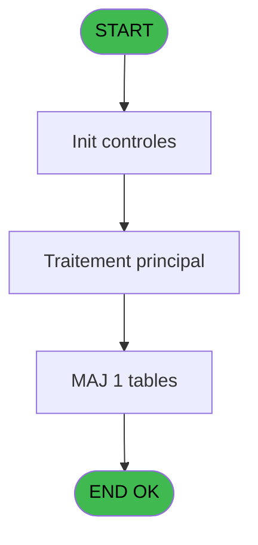

# REF IDE 845 - Recup heure(N2) vol_compagnie

> **Analyse**: Phases 1-4 2026-02-03 14:42 -> 14:42 (13s) | Assemblage 14:42
> **Pipeline**: V7.2 Enrichi
> **Structure**: 4 onglets (Resume | Ecrans | Donnees | Connexions)

<!-- TAB:Resume -->

## 1. FICHE D'IDENTITE

| Attribut | Valeur |
|----------|--------|
| Projet | REF |
| IDE Position | 845 |
| Nom Programme | Recup heure(N2) vol_compagnie |
| Fichier source | `Prg_845.xml` |
| Dossier IDE | General |
| Taches | 1 (0 ecrans visibles) |
| Tables modifiees | 1 |
| Programmes appeles | 1 |

## 2. DESCRIPTION FONCTIONNELLE

**Recup heure(N2) vol_compagnie** assure la gestion complete de ce processus, accessible depuis [Main Program (IDE 1)](REF-IDE-1.md).

Le flux de traitement s'organise en **1 blocs fonctionnels** :

- **Traitement** (1 tache) : traitements metier divers

**Donnees modifiees** : 1 tables en ecriture (voyages__________voy).

## 3. BLOCS FONCTIONNELS

### 3.1 Traitement (1 tache)

Traitements internes.

---

#### 845 - Recup heure(N2) vol_compagnie

**Role** : Selection par l'operateur : Recup heure(N2) vol_compagnie.
**Delegue a** : [Log batch (IDE 829)](REF-IDE-829.md)

## 5. REGLES METIER

*(Aucune regle metier identifiee)*

## 6. CONTEXTE

- **Appele par**: [Main Program (IDE 1)](REF-IDE-1.md)
- **Appelle**: 1 programmes | **Tables**: 1 (W:1 R:0 L:0) | **Taches**: 1 | **Expressions**: 21

<!-- TAB:Ecrans -->

## 8. ECRANS

*(Programme sans ecran visible)*

## 9. NAVIGATION

### 9.3 Structure hierarchique (1 tache)

| Position | Tache | Type | Dimensions | Bloc |
|----------|-------|------|------------|------|
| **845.1** | [**Recup heure(N2) vol_compagnie** (845)](#t1) | - | - | Traitement |

### 9.4 Algorigramme

> **Legende**: Vert = START/END OK | Rouge = END KO | Bleu = Decisions
> *Algorigramme auto-genere. Utiliser `/algorigramme` pour une synthese metier detaillee.*

<!-- TAB:Donnees -->

## 10. TABLES

### Tables utilisees (1)

| ID | Nom | Description | Type | R | W | L | Usages |
|----|-----|-------------|------|---|---|---|--------|
| 29 | voyages__________voy |  | DB |   | **W** |   | 1 |

### Colonnes par table (1 / 1 tables avec colonnes identifiees)

Table 29 - voyages__________voy (**W**) - 1 usages

| Lettre | Variable | Acces | Type |
|--------|----------|-------|------|
| A | P.i societe | W | Unicode |
| B | P.i compte | W | Numeric |
| C | P.i filiation | W | Numeric |
| D | P.i Aller/Retour | W | Unicode |
| E | P.i Vol | W | Unicode |
| F | P.i.o heure (opt1) | W | Numeric |
| G | P.i.o heure (opt2) | W | Time |
| H | P.o est sur le vol? | W | Logical |
| I | e.vol opt 1? | W | Logical |
| J | e.vol opt 2? | W | Logical |

## 11. VARIABLES

### 11.1 Parametres entrants (8)

Variables recues du programme appelant ([Main Program (IDE 1)](REF-IDE-1.md)).

| Lettre | Nom | Type | Usage dans |
|--------|-----|------|-----------|
| A | P.i societe | Unicode | 1x parametre entrant |
| B | P.i compte | Numeric | - |
| C | P.i filiation | Numeric | 1x parametre entrant |
| D | P.i Aller/Retour | Unicode | 1x parametre entrant |
| E | P.i Vol | Unicode | - |
| F | P.i.o heure (opt1) | Numeric | [845](#t1) |
| G | P.i.o heure (opt2) | Time | [845](#t1) |
| H | P.o est sur le vol? | Logical | 1x parametre entrant |

### 11.2 Autres (2)

Variables diverses.

| Lettre | Nom | Type | Usage dans |
|--------|-----|------|-----------|
| I | e.vol opt 1? | Logical | 1x refs |
| J | e.vol opt 2? | Logical | 2x refs |

## 12. EXPRESSIONS

**21 / 21 expressions decodees (100%)**

### 12.1 Repartition par type

| Type | Expressions | Regles |
|------|-------------|--------|
| CONSTANTE | 3 | 0 |
| OTHER | 15 | 0 |
| CONDITION | 2 | 0 |
| FORMAT | 1 | 0 |

### 12.2 Expressions cles par type

#### CONSTANTE (3 expressions)

| Type | IDE | Expression | Regle |
|------|-----|------------|-------|
| CONSTANTE | 18 | `'ERR'` | - |
| CONSTANTE | 16 | `'n° vol incohérent avec table voyage (cafil007)'` | - |
| CONSTANTE | 15 | `'VOL'` | - |

#### OTHER (15 expressions)

| Type | IDE | Expression | Regle |
|------|-----|------------|-------|
| OTHER | 11 | `Heure_vol_Max([N])` | - |
| OTHER | 10 | `Heure_vol_Min([N])` | - |
| OTHER | 9 | `[M]` | - |
| OTHER | 12 | `[P]` | - |
| OTHER | 21 | `Prog()` | - |
| ... | | *+10 autres* | |

#### CONDITION (2 expressions)

| Type | IDE | Expression | Regle |
|------|-----|------------|-------|
| CONDITION | 13 | `Trim([M])=Trim(P.i.o heure (opt2) [G])` | - |
| CONDITION | 14 | `[N]=0 AND [P]='00:00:00'TIME` | - |

#### FORMAT (1 expressions)

| Type | IDE | Expression | Regle |
|------|-----|------------|-------|
| FORMAT | 17 | `'Vol envoyé : '&Trim([M])&'; Vol lu : '&Trim(P.i.o heure (opt2) [G])&' pour compte : '&Str(e.vol opt 2? [J],'8')&';'&Str([K],'3')` | - |

### 12.3 Toutes les expressions (21)

Voir les 21 expressions

#### CONSTANTE (3)

| IDE | Expression Decodee |
|-----|-------------------|
| 15 | `'VOL'` |
| 16 | `'n° vol incohérent avec table voyage (cafil007)'` |
| 18 | `'ERR'` |

#### OTHER (15)

| IDE | Expression Decodee |
|-----|-------------------|
| 1 | `e.vol opt 1? [I]` |
| 2 | `e.vol opt 2? [J]` |
| 3 | `[K]` |
| 4 | `[L]` |
| 5 | `P.i societe [A]` |
| 6 | `P.i filiation [C]` |
| 7 | `P.i Aller/Retour [D]` |
| 8 | `P.i.o heure (opt1) [F]` |
| 9 | `[M]` |
| 10 | `Heure_vol_Min([N])` |
| 11 | `Heure_vol_Max([N])` |
| 12 | `[P]` |
| 19 | `Heure_conv_N2(P.o est sur le vol? [H])` |
| 20 | `[AJ] OR [AK]` |
| 21 | `Prog()` |

#### CONDITION (2)

| IDE | Expression Decodee |
|-----|-------------------|
| 14 | `[N]=0 AND [P]='00:00:00'TIME` |
| 13 | `Trim([M])=Trim(P.i.o heure (opt2) [G])` |

#### FORMAT (1)

| IDE | Expression Decodee |
|-----|-------------------|
| 17 | `'Vol envoyé : '&Trim([M])&'; Vol lu : '&Trim(P.i.o heure (opt2) [G])&' pour compte : '&Str(e.vol opt 2? [J],'8')&';'&Str([K],'3')` |

<!-- TAB:Connexions -->

## 13. GRAPHE D'APPELS

### 13.1 Chaine depuis Main (Callers)

Main -> ... -> [Main Program (IDE 1)](REF-IDE-1.md) -> **Recup heure(N2) vol_compagnie (IDE 845)**

### 13.2 Callers

| IDE | Nom Programme | Nb Appels |
|-----|---------------|-----------|
| [1](REF-IDE-1.md) | Main Program | 2 |

### 13.3 Callees (programmes appeles)

### 13.4 Detail Callees avec contexte

| IDE | Nom Programme | Appels | Contexte |
|-----|---------------|--------|----------|
| [829](REF-IDE-829.md) | Log batch | 1 | Sous-programme |

## 14. RECOMMANDATIONS MIGRATION

### 14.1 Profil du programme

| Metrique | Valeur | Impact migration |
|----------|--------|-----------------|
| Lignes de logique | 55 | Programme compact |
| Expressions | 21 | Peu de logique |
| Tables WRITE | 1 | Impact faible |
| Sous-programmes | 1 | Peu de dependances |
| Ecrans visibles | 0 | Ecran unique ou traitement batch |
| Code desactive | 0% (0 / 55) | Code sain |
| Regles metier | 0 | Pas de regle identifiee |

### 14.2 Plan de migration par bloc

#### Traitement (1 tache: 0 ecran, 1 traitement)

- **Strategie** : 1 service(s) backend injectable(s) (Domain Services).
- 1 sous-programme(s) a migrer ou a reutiliser depuis les services existants.
- Decomposer les taches en services unitaires testables.

### 14.3 Dependances critiques

| Dependance | Type | Appels | Impact |
|------------|------|--------|--------|
| voyages__________voy | Table WRITE (Database) | 1x | Schema + repository |
| [Log batch (IDE 829)](REF-IDE-829.md) | Sous-programme | 1x | Normale - Sous-programme |

---
*Spec DETAILED generee par Pipeline V7.2 - 2026-02-03 14:42*
