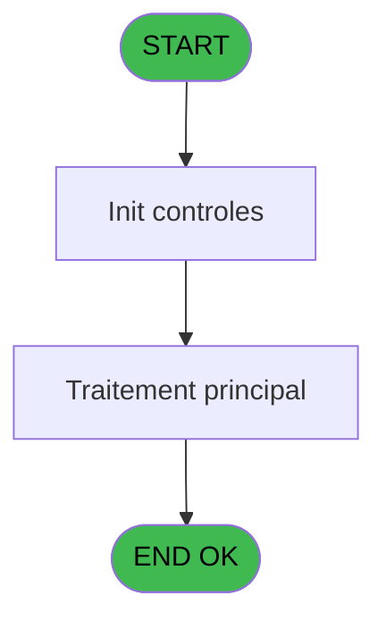
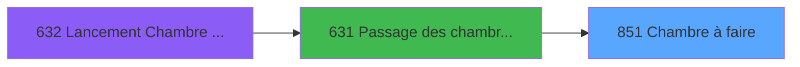
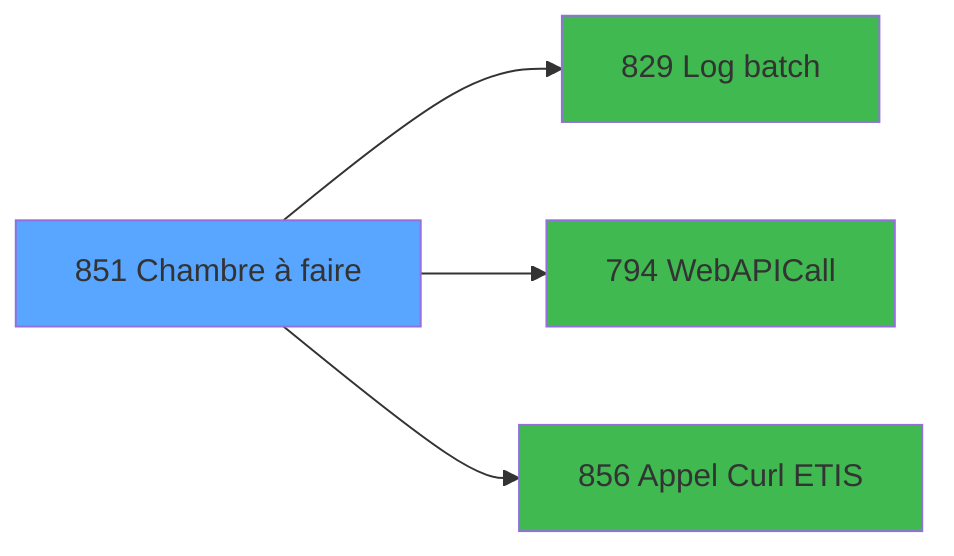

# REF IDE 851 - Chambre à faire

> **Analyse**: Phases 1-4 2026-02-03 14:43 -> 14:44 (14s) | Assemblage 14:44
> **Pipeline**: V7.2 Enrichi
> **Structure**: 4 onglets (Resume | Ecrans | Donnees | Connexions)

<!-- TAB:Resume -->

## 1. FICHE D'IDENTITE

| Attribut | Valeur |
|----------|--------|
| Projet | REF |
| IDE Position | 851 |
| Nom Programme | Chambre à faire |
| Fichier source | `Prg_851.xml` |
| Dossier IDE | General |
| Taches | 2 (0 ecrans visibles) |
| Tables modifiees | 0 |
| Programmes appeles | 3 |

## 2. DESCRIPTION FONCTIONNELLE

**Chambre à faire** assure la gestion complete de ce processus, accessible depuis [Passage des chambres en depart (IDE 631)](REF-IDE-631.md).

Le flux de traitement s'organise en **1 blocs fonctionnels** :

- **Traitement** (2 taches) : traitements metier divers

**Logique metier** : 4 regles identifiees couvrant conditions metier, valeurs par defaut.

## 3. BLOCS FONCTIONNELS

### 3.1 Traitement (2 taches)

Traitements internes.

---

#### 851 - Chambre à faire

**Role** : Traitement : Chambre à faire.
**Variables liees** : A (p.i.Nom chambre), W (v.Chambre/Sous-zone)
**Delegue a** : [Log batch (IDE 829)](REF-IDE-829.md), [WebAPICall (IDE 794)](REF-IDE-794.md), [Appel Curl ETIS (IDE 856)](REF-IDE-856.md)

---

#### 851.1 - Lecture intervention

**Role** : Traitement : Lecture intervention.
**Variables liees** : D (p.i.Libellé intervention), F (p.i.o.Intervention), Q (v.Message d'erreur lecture)
**Delegue a** : [Log batch (IDE 829)](REF-IDE-829.md), [WebAPICall (IDE 794)](REF-IDE-794.md), [Appel Curl ETIS (IDE 856)](REF-IDE-856.md)

## 5. REGLES METIER

4 regles identifiees:

### Autres (4 regles)

#### [RM-001] Traitement si v.URL API [I] est renseigne

| Element | Detail |
|---------|--------|
| **Condition** | `v.URL API [I]<>''` |
| **Si vrai** | v.URL API [I] |
| **Si faux** | v.Code API [K]) |
| **Variables** | I (v.URL API), K (v.Code API) |
| **Expression source** | Expression 16 : `IF(v.URL API [I]<>'',v.URL API [I], v.Code API [K])` |
| **Exemple** | Si v.URL API [I]<>'' → v.URL API [I]. Sinon → v.Code API [K]) |

#### [RM-002] Traitement si p.i.o.Intervention [F] est non nul

| Element | Detail |
|---------|--------|
| **Condition** | `p.i.o.Intervention [F]<>0` |
| **Si vrai** | 'OK' |
| **Si faux** | 'ERR') |
| **Variables** | F (p.i.o.Intervention) |
| **Expression source** | Expression 34 : `IF(p.i.o.Intervention [F]<>0, 'OK', 'ERR')` |
| **Exemple** | Si p.i.o.Intervention [F]<>0 → 'OK'. Sinon → 'ERR') |

#### [RM-003] Valeur par defaut si [AD] est vide

| Element | Detail |
|---------|--------|
| **Condition** | `[AD]=''` |
| **Si vrai** | 'OK' |
| **Si faux** | 'ERR') |
| **Expression source** | Expression 35 : `IF([AD]='', 'OK', 'ERR')` |
| **Exemple** | Si [AD]='' → 'OK'. Sinon → 'ERR') |

#### [RM-004] Traitement si [AE] est renseigne

| Element | Detail |
|---------|--------|
| **Condition** | `[AE]<>''` |
| **Si vrai** | [AE] |
| **Si faux** | IF([AJ]<>'', StrBuild('DI @1@ existed : room @2@ status @3@', Str([AH], 'N12'), [AJ], [AI]), '')) |
| **Expression source** | Expression 36 : `IF([AE]<>'', [AE], IF([AJ]<>'', StrBuild('DI @1@ existed : r` |
| **Exemple** | Si [AE]<>'' → [AE] |

## 6. CONTEXTE

- **Appele par**: [Passage des chambres en depart (IDE 631)](REF-IDE-631.md)
- **Appelle**: 3 programmes | **Tables**: 3 (W:0 R:1 L:2) | **Taches**: 2 | **Expressions**: 50

<!-- TAB:Ecrans -->

## 8. ECRANS

*(Programme sans ecran visible)*

## 9. NAVIGATION

### 9.3 Structure hierarchique (2 taches)

| Position | Tache | Type | Dimensions | Bloc |
|----------|-------|------|------------|------|
| **851.1** | [**Chambre à faire** (851)](#t1) | - | - | Traitement |
| 851.1.1 | [Lecture intervention (851.1)](#t2) | - | - | |

### 9.4 Algorigramme

> **Legende**: Vert = START/END OK | Rouge = END KO | Bleu = Decisions
> *Algorigramme auto-genere. Utiliser `/algorigramme` pour une synthese metier detaillee.*

<!-- TAB:Donnees -->

## 10. TABLES

### Tables utilisees (3)

| ID | Nom | Description | Type | R | W | L | Usages |
|----|-----|-------------|------|---|---|---|--------|
| 118 | tables_imports |  | DB | R |   |   | 1 |
| 368 | pms_village |  | DB |   |   | L | 1 |
| 695 | repertoires_serveur_dispatch |  | DB |   |   | L | 1 |

### Colonnes par table (1 / 1 tables avec colonnes identifiees)

Table 118 - tables_imports (R) - 1 usages

| Lettre | Variable | Acces | Type |
|--------|----------|-------|------|
| N | v.JSon in | R | Blob |
| O | v.JSon response | R | Blob |
| S | v.XML response | R | Blob |

## 11. VARIABLES

### 11.1 Parametres entrants (7)

Variables recues du programme appelant ([Passage des chambres en depart (IDE 631)](REF-IDE-631.md)).

| Lettre | Nom | Type | Usage dans |
|--------|-----|------|-----------|
| A | p.i.Nom chambre | Unicode | [851](#t1) |
| B | p.i.Lieu de séjour | Unicode | 1x parametre entrant |
| C | p.i.Commentaire | Unicode | 1x parametre entrant |
| D | p.i.Libellé intervention | Unicode | [851.1](#t2) |
| E | p.i.Urgence ? | Logical | 1x parametre entrant |
| F | p.i.o.Intervention | Numeric | 4x parametre entrant |
| G | p.i.Id batch parent | Numeric | 1x parametre entrant |

### 11.2 Variables de session (17)

Variables persistantes pendant toute la session.

| Lettre | Nom | Type | Usage dans |
|--------|-----|------|-----------|
| H | v.Export | Unicode | - |
| I | v.URL API | Unicode | 1x session |
| J | v.Eté | Logical | - |
| K | v.Code API | Unicode | 1x session |
| L | v.Libellé intervetion | Unicode | 2x session |
| M | v.Origine demande | Unicode | - |
| N | v.JSon in | Blob | 1x session |
| O | v.JSon response | Blob | 1x session |
| P | v.Succès ? | Logical | 2x session |
| Q | v.Message d'erreur lecture | Alpha | - |
| R | v.Message d'erreur | Alpha | 2x session |
| S | v.XML response | Blob | 2x session |
| T | v.Batch id | Numeric | 2x session |
| U | v.DI lue | Numeric | 2x session |
| V | v.Status | Unicode | 2x session |
| W | v.Chambre/Sous-zone | Unicode | 1x session |
| X | v.Créer DI ? | Logical | 1x session |

Toutes les 24 variables (liste complete)

| Cat | Lettre | Nom Variable | Type |
|-----|--------|--------------|------|
| P0 | **A** | p.i.Nom chambre | Unicode |
| P0 | **B** | p.i.Lieu de séjour | Unicode |
| P0 | **C** | p.i.Commentaire | Unicode |
| P0 | **D** | p.i.Libellé intervention | Unicode |
| P0 | **E** | p.i.Urgence ? | Logical |
| P0 | **F** | p.i.o.Intervention | Numeric |
| P0 | **G** | p.i.Id batch parent | Numeric |
| V. | **H** | v.Export | Unicode |
| V. | **I** | v.URL API | Unicode |
| V. | **J** | v.Eté | Logical |
| V. | **K** | v.Code API | Unicode |
| V. | **L** | v.Libellé intervetion | Unicode |
| V. | **M** | v.Origine demande | Unicode |
| V. | **N** | v.JSon in | Blob |
| V. | **O** | v.JSon response | Blob |
| V. | **P** | v.Succès ? | Logical |
| V. | **Q** | v.Message d'erreur lecture | Alpha |
| V. | **R** | v.Message d'erreur | Alpha |
| V. | **S** | v.XML response | Blob |
| V. | **T** | v.Batch id | Numeric |
| V. | **U** | v.DI lue | Numeric |
| V. | **V** | v.Status | Unicode |
| V. | **W** | v.Chambre/Sous-zone | Unicode |
| V. | **X** | v.Créer DI ? | Logical |

## 12. EXPRESSIONS

**50 / 50 expressions decodees (100%)**

### 12.1 Repartition par type

| Type | Expressions | Regles |
|------|-------------|--------|
| FORMAT | 2 | 0 |
| CONCATENATION | 2 | 0 |
| CONDITION | 11 | 4 |
| CONSTANTE | 11 | 0 |
| OTHER | 21 | 0 |
| CAST_LOGIQUE | 2 | 0 |
| NEGATION | 1 | 0 |

### 12.2 Expressions cles par type

#### FORMAT (2 expressions)

| Type | IDE | Expression | Regle |
|------|-----|------------|-------|
| FORMAT | 2 | `Range(DStr(Date(), 'MM-DD'), '05-01', '10-31')` | - |
| FORMAT | 10 | `RTrim(v.Succès ? [P])& 'interventions/' & Str(p.i.o.Intervention [F], '12L')` | - |

#### CONCATENATION (2 expressions)

| Type | IDE | Expression | Regle |
|------|-----|------------|-------|
| CONCATENATION | 9 | `RTrim(v.Succès ? [P])& 'interventions'` | - |
| CONCATENATION | 14 | `'<?xml version="1.0" encoding="UTF-8"?>' &
ASCIIChr(13)& ASCIIChr(10)&
DotNet.System.Xml.Linq.XElement.Load(
  DotNet.System.Runtime.Serialization.Json.JsonReaderWriterFactory.CreateJsonReader( 
     [AB],
     DotNet.System.Xml.XmlDictionaryReaderQuotas()
   )
).ToString()` | - |

#### CONDITION (11 expressions)

| Type | IDE | Expression | Regle |
|------|-----|------------|-------|
| CONDITION | 35 | `IF([AD]='', 'OK', 'ERR')` | [RM-003](#rm-RM-003) |
| CONDITION | 36 | `IF([AE]<>'', [AE], IF([AJ]<>'', StrBuild('DI @1@ existed : room @2@ status @3@', Str([AH], 'N12'), [AJ], [AI]), ''))` | [RM-004](#rm-RM-004) |
| CONDITION | 16 | `IF(v.URL API [I]<>'',v.URL API [I], v.Code API [K])` | [RM-001](#rm-RM-001) |
| CONDITION | 34 | `IF(p.i.o.Intervention [F]<>0, 'OK', 'ERR')` | [RM-002](#rm-RM-002) |
| CONDITION | 38 | `p.i.o.Intervention [F]<>0` | - |
| ... | | *+6 autres* | |

#### CONSTANTE (11 expressions)

| Type | IDE | Expression | Regle |
|------|-----|------------|-------|
| CONSTANTE | 31 | `'DEB'` | - |
| CONSTANTE | 28 | `'Room to do'` | - |
| CONSTANTE | 32 | `'json'` | - |
| CONSTANTE | 49 | `'xml'` | - |
| CONSTANTE | 42 | `0` | - |
| ... | | *+6 autres* | |

#### OTHER (21 expressions)

| Type | IDE | Expression | Regle |
|------|-----|------------|-------|
| OTHER | 33 | `[AB]` | - |
| OTHER | 37 | `p.i.Id batch parent [G]` | - |
| OTHER | 30 | `v.Status [V]` | - |
| OTHER | 24 | `p.i.Urgence ? [E]` | - |
| OTHER | 29 | `StrBuild('Room @1@ to do : @2@, @3@', p.i.Nom chambre [A], p.i.Libellé intervention [D], [Z])` | - |
| ... | | *+16 autres* | |

#### CAST_LOGIQUE (2 expressions)

| Type | IDE | Expression | Regle |
|------|-----|------------|-------|
| CAST_LOGIQUE | 40 | `'FALSE'LOG` | - |
| CAST_LOGIQUE | 39 | `'TRUE'LOG` | - |

#### NEGATION (1 expressions)

| Type | IDE | Expression | Regle |
|------|-----|------------|-------|
| NEGATION | 50 | `NOT [AK] OR [AD]<>''` | - |

### 12.3 Toutes les expressions (50)

Voir les 50 expressions

#### FORMAT (2)

| IDE | Expression Decodee |
|-----|-------------------|
| 10 | `RTrim(v.Succès ? [P])& 'interventions/' & Str(p.i.o.Intervention [F], '12L')` |
| 2 | `Range(DStr(Date(), 'MM-DD'), '05-01', '10-31')` |

#### CONCATENATION (2)

| IDE | Expression Decodee |
|-----|-------------------|
| 14 | `'<?xml version="1.0" encoding="UTF-8"?>' &
ASCIIChr(13)& ASCIIChr(10)&
DotNet.System.Xml.Linq.XElement.Load(
  DotNet.System.Runtime.Serialization.Json.JsonReaderWriterFactory.CreateJsonReader( 
     [AB],
     DotNet.System.Xml.XmlDictionaryReaderQuotas()
   )
).ToString()` |
| 9 | `RTrim(v.Succès ? [P])& 'interventions'` |

#### CONDITION (11)

| IDE | Expression Decodee |
|-----|-------------------|
| 16 | `IF(v.URL API [I]<>'',v.URL API [I], v.Code API [K])` |
| 34 | `IF(p.i.o.Intervention [F]<>0, 'OK', 'ERR')` |
| 35 | `IF([AD]='', 'OK', 'ERR')` |
| 36 | `IF([AE]<>'', [AE], IF([AJ]<>'', StrBuild('DI @1@ existed : room @2@ status @3@', Str([AH], 'N12'), [AJ], [AI]), ''))` |
| 46 | `IF([AD]='',StrBuild('DI @1@ already here : room @2@ status @3@', Str([AH], 'N12'), [AJ], [AI]), StrBuild('Error reading DI @1@ for room @2@', Str([AH], 'N12'), p.i.Nom chambre [A]))` |
| 18 | `p.i.Libellé intervention [D]='BLANK_CLEAN_ROOM' AND v.XML response [S]<>''` |
| 19 | `p.i.Libellé intervention [D]='STANDARD_CLEAN_ROOM' AND v.Batch id [T]<>''` |
| 20 | `p.i.Libellé intervention [D]='BLANK_CLEAN_ROOM_CHANGE' AND v.DI lue [U]<>''` |
| 38 | `p.i.o.Intervention [F]<>0` |
| 44 | `p.i.Nom chambre [A]=[AJ]` |
| 3 | `Trim(IF(v.JSon in [N]='', v.Libellé intervetion [L], v.JSon in [N])) & IF(v.JSon response [O],  IF(v.Chambre/Sous-zone [W], '_SUMMER', '_WINTER'), '')` |

#### CONSTANTE (11)

| IDE | Expression Decodee |
|-----|-------------------|
| 5 | `'G'` |
| 7 | `'GET'` |
| 8 | `'POST'` |
| 25 | `'CLIENT'` |
| 26 | `'STAFF'` |
| 27 | `'ETIS'` |
| 28 | `'Room to do'` |
| 31 | `'DEB'` |
| 32 | `'json'` |
| 42 | `0` |
| 49 | `'xml'` |

#### OTHER (21)

| IDE | Expression Decodee |
|-----|-------------------|
| 1 | `StrBuild('{"site": "@1@","libelle": "@2@","origineDemande" : "@3@","commentaire": "@4@","sousZone": "@5@"}',  v.Créer DI ? [X], [Y], [Z], p.i.Commentaire [C], p.i.Nom chambre [A])` |
| 4 | `p.i.Lieu de séjour [B]` |
| 6 | `v.Libellé intervetion [L]` |
| 11 | `[AA]` |
| 12 | `v.Message d'erreur lec... [Q]` |
| 13 | `v.Message d'erreur [R]` |
| 15 | `v.Status [V]` |
| 17 | `p.i.Libellé intervention [D]` |
| 21 | `v.XML response [S]` |
| 22 | `v.Batch id [T]` |
| 23 | `v.DI lue [U]` |
| 24 | `p.i.Urgence ? [E]` |
| 29 | `StrBuild('Room @1@ to do : @2@, @3@', p.i.Nom chambre [A], p.i.Libellé intervention [D], [Z])` |
| 30 | `v.Status [V]` |
| 33 | `[AB]` |
| 37 | `p.i.Id batch parent [G]` |
| 41 | `[AK]` |
| 43 | `p.i.o.Intervention [F]` |
| 45 | `IN([AI], 'DE', 'EC')` |
| 47 | `[AD]` |
| 48 | `[AF]` |

#### CAST_LOGIQUE (2)

| IDE | Expression Decodee |
|-----|-------------------|
| 39 | `'TRUE'LOG` |
| 40 | `'FALSE'LOG` |

#### NEGATION (1)

| IDE | Expression Decodee |
|-----|-------------------|
| 50 | `NOT [AK] OR [AD]<>''` |

<!-- TAB:Connexions -->

## 13. GRAPHE D'APPELS

### 13.1 Chaine depuis Main (Callers)

Main -> ... -> [Passage des chambres en depart (IDE 631)](REF-IDE-631.md) -> **Chambre à faire (IDE 851)**

### 13.2 Callers

| IDE | Nom Programme | Nb Appels |
|-----|---------------|-----------|
| [631](REF-IDE-631.md) | Passage des chambres en depart | 3 |

### 13.3 Callees (programmes appeles)

### 13.4 Detail Callees avec contexte

| IDE | Nom Programme | Appels | Contexte |
|-----|---------------|--------|----------|
| [829](REF-IDE-829.md) | Log batch | 3 | Sous-programme |
| [794](REF-IDE-794.md) | WebAPICall | 2 | Sous-programme |
| [856](REF-IDE-856.md) | Appel Curl ETIS | 2 | Sous-programme |

## 14. RECOMMANDATIONS MIGRATION

### 14.1 Profil du programme

| Metrique | Valeur | Impact migration |
|----------|--------|-----------------|
| Lignes de logique | 139 | Programme compact |
| Expressions | 50 | Peu de logique |
| Tables WRITE | 0 | Impact faible |
| Sous-programmes | 3 | Peu de dependances |
| Ecrans visibles | 0 | Ecran unique ou traitement batch |
| Code desactive | 1.4% (2 / 139) | Code sain |
| Regles metier | 4 | Quelques regles a preserver |

### 14.2 Plan de migration par bloc

#### Traitement (2 taches: 0 ecran, 2 traitements)

- **Strategie** : 2 service(s) backend injectable(s) (Domain Services).
- 3 sous-programme(s) a migrer ou a reutiliser depuis les services existants.
- Decomposer les taches en services unitaires testables.

### 14.3 Dependances critiques

| Dependance | Type | Appels | Impact |
|------------|------|--------|--------|
| [Log batch (IDE 829)](REF-IDE-829.md) | Sous-programme | 3x | **CRITIQUE** - Sous-programme |
| [Appel Curl ETIS (IDE 856)](REF-IDE-856.md) | Sous-programme | 2x | Haute - Sous-programme |
| [WebAPICall (IDE 794)](REF-IDE-794.md) | Sous-programme | 2x | Haute - Sous-programme |

---
*Spec DETAILED generee par Pipeline V7.2 - 2026-02-03 14:44*
