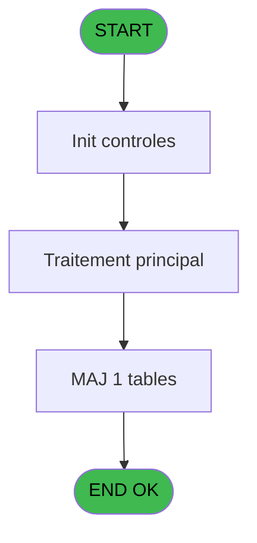
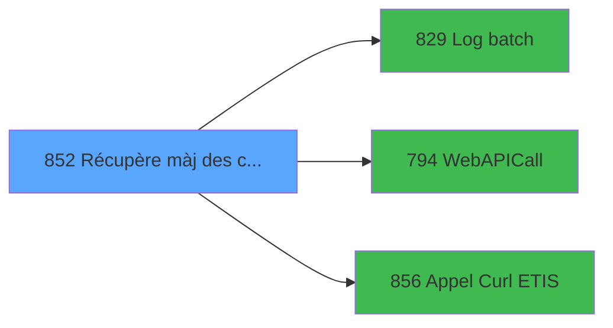

# REF IDE 852 - Récupère màj des chambres

> **Analyse**: Phases 1-4 2026-02-03 14:44 -> 14:44 (13s) | Assemblage 14:44
> **Pipeline**: V7.2 Enrichi
> **Structure**: 4 onglets (Resume | Ecrans | Donnees | Connexions)

<!-- TAB:Resume -->

## 1. FICHE D'IDENTITE

| Attribut | Valeur |
|----------|--------|
| Projet | REF |
| IDE Position | 852 |
| Nom Programme | Récupère màj des chambres |
| Fichier source | `Prg_852.xml` |
| Dossier IDE | General |
| Taches | 4 (0 ecrans visibles) |
| Tables modifiees | 1 |
| Programmes appeles | 3 |

## 2. DESCRIPTION FONCTIONNELLE

**Récupère màj des chambres** assure la gestion complete de ce processus, accessible depuis [Appel Recup Chambre pour test (IDE 855)](REF-IDE-855.md).

Le flux de traitement s'organise en **1 blocs fonctionnels** :

- **Traitement** (4 taches) : traitements metier divers

**Donnees modifiees** : 1 tables en ecriture (logement_client__loc).

**Logique metier** : 2 regles identifiees couvrant conditions metier.

Detail : phases du traitement

#### Phase 1 : Traitement (4 taches)

- **852** - Chambre à faire
- **852.1** - Lecture intervention
- **852.1.1** - Màj statut ménage à blanc
- **852.2** - Lieu de séjour

Delegue a : [Log batch (IDE 829)](REF-IDE-829.md), [WebAPICall (IDE 794)](REF-IDE-794.md), [Appel Curl ETIS (IDE 856)](REF-IDE-856.md)

#### Tables impactees

| Table | Operations | Role metier |
|-------|-----------|-------------|
| logement_client__loc | **W** (1 usages) |  |

## 3. BLOCS FONCTIONNELS

### 3.1 Traitement (4 taches)

Traitements internes.

---

#### 852 - Chambre à faire

**Role** : Traitement : Chambre à faire.

3 sous-taches directes

| Tache | Nom | Bloc |
|-------|-----|------|
| [852.1](#t2) | Lecture intervention | Traitement |
| [852.1.1](#t3) | Màj statut ménage à blanc | Traitement |
| [852.2](#t4) | Lieu de séjour | Traitement |

**Variables liees** : V (v.Liste chambres prêtes)
**Delegue a** : [Log batch (IDE 829)](REF-IDE-829.md), [WebAPICall (IDE 794)](REF-IDE-794.md), [Appel Curl ETIS (IDE 856)](REF-IDE-856.md)

---

#### 852.1 - Lecture intervention

**Role** : Traitement : Lecture intervention.
**Delegue a** : [Log batch (IDE 829)](REF-IDE-829.md), [WebAPICall (IDE 794)](REF-IDE-794.md), [Appel Curl ETIS (IDE 856)](REF-IDE-856.md)

---

#### 852.1.1 - Màj statut ménage à blanc

**Role** : Traitement : Màj statut ménage à blanc.
**Delegue a** : [Log batch (IDE 829)](REF-IDE-829.md), [WebAPICall (IDE 794)](REF-IDE-794.md), [Appel Curl ETIS (IDE 856)](REF-IDE-856.md)

---

#### 852.2 - Lieu de séjour

**Role** : Traitement : Lieu de séjour.
**Variables liees** : B (P.i.Lieu de séjour), F (v.Lieu de séjour)
**Delegue a** : [Log batch (IDE 829)](REF-IDE-829.md), [WebAPICall (IDE 794)](REF-IDE-794.md), [Appel Curl ETIS (IDE 856)](REF-IDE-856.md)

## 5. REGLES METIER

2 regles identifiees:

### Autres (2 regles)

#### [RM-001] Traitement si v.Local UTC time [H] est renseigne

| Element | Detail |
|---------|--------|
| **Condition** | `v.Local UTC time [H]<>''` |
| **Si vrai** | v.Local UTC time [H] |
| **Si faux** | v.Date appel ETIS en c... [J]) |
| **Variables** | H (v.Local UTC time) |
| **Expression source** | Expression 20 : `IF(v.Local UTC time [H]<>'', v.Local UTC time [H], v.Date ap` |
| **Exemple** | Si v.Local UTC time [H]<>'' → v.Local UTC time [H]. Sinon → v.Date appel ETIS en c... [J]) |

#### [RM-002] Si [AF] alors 'OK' sinon 'ERR')

| Element | Detail |
|---------|--------|
| **Condition** | `[AF]` |
| **Si vrai** | 'OK' |
| **Si faux** | 'ERR') |
| **Expression source** | Expression 39 : `IF([AF], 'OK', 'ERR')` |
| **Exemple** | Si [AF] → 'OK'. Sinon → 'ERR') |

## 6. CONTEXTE

- **Appele par**: [Appel Recup Chambre pour test (IDE 855)](REF-IDE-855.md)
- **Appelle**: 3 programmes | **Tables**: 4 (W:1 R:1 L:2) | **Taches**: 4 | **Expressions**: 43

<!-- TAB:Ecrans -->

## 8. ECRANS

*(Programme sans ecran visible)*

## 9. NAVIGATION

### 9.3 Structure hierarchique (4 taches)

| Position | Tache | Type | Dimensions | Bloc |
|----------|-------|------|------------|------|
| **852.1** | [**Chambre à faire** (852)](#t1) | - | - | Traitement |
| 852.1.1 | [Lecture intervention (852.1)](#t2) | - | - | |
| 852.1.2 | [Màj statut ménage à blanc (852.1.1)](#t3) | - | - | |
| 852.1.3 | [Lieu de séjour (852.2)](#t4) | - | - | |

### 9.4 Algorigramme

> **Legende**: Vert = START/END OK | Rouge = END KO | Bleu = Decisions
> *Algorigramme auto-genere. Utiliser `/algorigramme` pour une synthese metier detaillee.*

<!-- TAB:Donnees -->

## 10. TABLES

### Tables utilisees (4)

| ID | Nom | Description | Type | R | W | L | Usages |
|----|-----|-------------|------|---|---|---|--------|
| 103 | logement_client__loc |  | DB |   | **W** |   | 1 |
| 118 | tables_imports |  | DB | R |   |   | 2 |
| 368 | pms_village |  | DB |   |   | L | 1 |
| 695 | repertoires_serveur_dispatch |  | DB |   |   | L | 1 |

### Colonnes par table (1 / 2 tables avec colonnes identifiees)

Table 103 - logement_client__loc (**W**) - 1 usages

*Table utilisee uniquement en Link ou aucune colonne Real identifiee dans le DataView.*

Table 118 - tables_imports (R) - 2 usages

| Lettre | Variable | Acces | Type |
|--------|----------|-------|------|
| D | P.i.Blob | R | Blob |
| P | v.JSon response | R | Blob |
| S | v.XML response | R | Blob |

## 11. VARIABLES

### 11.1 Parametres entrants (4)

Variables recues du programme appelant ([Appel Recup Chambre pour test (IDE 855)](REF-IDE-855.md)).

| Lettre | Nom | Type | Usage dans |
|--------|-----|------|-----------|
| A | P.i.Société | Unicode | 2x parametre entrant |
| B | P.i.Lieu de séjour | Unicode | [852.2](#t4) |
| C | P.i.Test | Logical | 2x parametre entrant |
| D | P.i.Blob | Blob | 1x parametre entrant |

### 11.2 Variables de session (18)

Variables persistantes pendant toute la session.

| Lettre | Nom | Type | Usage dans |
|--------|-----|------|-----------|
| E | v.Société | Unicode | - |
| F | v.Lieu de séjour | Unicode | [852.2](#t4) |
| G | v.Code export | Unicode | - |
| H | v.Local UTC time | Unicode | 1x session |
| I | v.Dernier UTC time | Unicode | - |
| J | v.Date appel ETIS en cours | Date | - |
| K | v.Heure appel ETIS en cours | Time | - |
| L | v.URL API | Unicode | 1x session |
| M | v.URL API next | Unicode | 1x session |
| N | v.Eté | Logical | 1x session |
| O | v.Code API | Unicode | 3x session |
| P | v.JSon response | Blob | 2x session |
| Q | v.Succès ? | Logical | 2x session |
| R | v.Message d'erreur | Alpha | 1x session |
| S | v.XML response | Blob | 3x session |
| T | v.Total results | Unicode | 2x session |
| U | v.Batch Id | Numeric | 1x session |
| V | v.Liste chambres prêtes | Unicode | 1x session |

Toutes les 22 variables (liste complete)

| Cat | Lettre | Nom Variable | Type |
|-----|--------|--------------|------|
| P0 | **A** | P.i.Société | Unicode |
| P0 | **B** | P.i.Lieu de séjour | Unicode |
| P0 | **C** | P.i.Test | Logical |
| P0 | **D** | P.i.Blob | Blob |
| V. | **E** | v.Société | Unicode |
| V. | **F** | v.Lieu de séjour | Unicode |
| V. | **G** | v.Code export | Unicode |
| V. | **H** | v.Local UTC time | Unicode |
| V. | **I** | v.Dernier UTC time | Unicode |
| V. | **J** | v.Date appel ETIS en cours | Date |
| V. | **K** | v.Heure appel ETIS en cours | Time |
| V. | **L** | v.URL API | Unicode |
| V. | **M** | v.URL API next | Unicode |
| V. | **N** | v.Eté | Logical |
| V. | **O** | v.Code API | Unicode |
| V. | **P** | v.JSon response | Blob |
| V. | **Q** | v.Succès ? | Logical |
| V. | **R** | v.Message d'erreur | Alpha |
| V. | **S** | v.XML response | Blob |
| V. | **T** | v.Total results | Unicode |
| V. | **U** | v.Batch Id | Numeric |
| V. | **V** | v.Liste chambres prêtes | Unicode |

## 12. EXPRESSIONS

**43 / 43 expressions decodees (100%)**

### 12.1 Repartition par type

| Type | Expressions | Regles |
|------|-------------|--------|
| CONCATENATION | 2 | 0 |
| CONDITION | 9 | 2 |
| CONSTANTE | 8 | 0 |
| FORMAT | 3 | 0 |
| DATE | 1 | 0 |
| OTHER | 19 | 0 |
| STRING | 1 | 0 |

### 12.2 Expressions cles par type

#### CONCATENATION (2 expressions)

| Type | IDE | Expression | Regle |
|------|-----|------------|-------|
| CONCATENATION | 10 | `'<?xml version="1.0" encoding="UTF-8"?>' &
ASCIIChr(13)& ASCIIChr(10)&
DotNet.System.Xml.Linq.XElement.Load(
  DotNet.System.Runtime.Serialization.Json.JsonReaderWriterFactory.CreateJsonReader( 
     [AE],
     DotNet.System.Xml.XmlDictionaryReaderQuotas()
   )
).ToString()` | - |
| CONCATENATION | 7 | `StrBuild(RTrim(v.Batch Id [U])& 'interventions/search?changementEtatDepuis=@1@&site=@2@', v.Message d'erreur [R], [AD])` | - |

#### CONDITION (9 expressions)

| Type | IDE | Expression | Regle |
|------|-----|------------|-------|
| CONDITION | 20 | `IF(v.Local UTC time [H]<>'', v.Local UTC time [H], v.Date appel ETIS en c... [J])` | [RM-001](#rm-RM-001) |
| CONDITION | 39 | `IF([AF], 'OK', 'ERR')` | [RM-002](#rm-RM-002) |
| CONDITION | 24 | `P.i.Société [A]=''` | - |
| CONDITION | 25 | `P.i.Lieu de séjour [B]=''` | - |
| CONDITION | 2 | `Trim(IF(v.URL API next [M]='', v.Heure appel ETIS en ... [K], v.URL API next [M])) & IF(v.Eté [N],  IF([AC], '_SUMMER', '_WINTER'), '')` | - |
| ... | | *+4 autres* | |

#### CONSTANTE (8 expressions)

| Type | IDE | Expression | Regle |
|------|-----|------------|-------|
| CONSTANTE | 31 | `'ETIS'` | - |
| CONSTANTE | 30 | `''` | - |
| CONSTANTE | 38 | `'json'` | - |
| CONSTANTE | 35 | `'DEB'` | - |
| CONSTANTE | 6 | `'GET'` | - |
| ... | | *+3 autres* | |

#### FORMAT (3 expressions)

| Type | IDE | Expression | Regle |
|------|-----|------------|-------|
| FORMAT | 33 | `StrBuild('Traitement @1@, @2@ ; depuis le @3@ @4@', P.i.Lieu de séjour [B], [AD], DStr(v.Code API [O], '##/##/####'), TStr(v.JSon response [P], 'HH:MM:SS'))` | - |
| FORMAT | 28 | `DStr(v.Code API [O], 'YYYY-MM-DD') & 'T' & TStr(v.JSon response [P], 'HH:MM:SS') & '.000Z'` | - |
| FORMAT | 1 | `Range(DStr(Date(), 'MM-DD'), '05-01', '10-31')` | - |

#### DATE (1 expressions)

| Type | IDE | Expression | Regle |
|------|-----|------------|-------|
| DATE | 14 | `DVal(StrToken(v.Succès ? [Q], 1, 'T'), 'YYYY-MM-DD')` | - |

#### OTHER (19 expressions)

| Type | IDE | Expression | Regle |
|------|-----|------------|-------|
| OTHER | 32 | `MlsTrans('Chambres prêtes')` | - |
| OTHER | 34 | `[AB]` | - |
| OTHER | 26 | `v.XML response [S]` | - |
| OTHER | 27 | `'00:00:01'TIME` | - |
| OTHER | 36 | `StrTokenCnt ([AK],',')` | - |
| ... | | *+14 autres* | |

#### STRING (1 expressions)

| Type | IDE | Expression | Regle |
|------|-----|------------|-------|
| STRING | 15 | `TVal(StrToken(StrToken(v.Succès ? [Q], 2, 'T'), 1, '.'), 'HH:MM:SS')` | - |

### 12.3 Toutes les expressions (43)

Voir les 43 expressions

#### CONCATENATION (2)

| IDE | Expression Decodee |
|-----|-------------------|
| 7 | `StrBuild(RTrim(v.Batch Id [U])& 'interventions/search?changementEtatDepuis=@1@&site=@2@', v.Message d'erreur [R], [AD])` |
| 10 | `'<?xml version="1.0" encoding="UTF-8"?>' &
ASCIIChr(13)& ASCIIChr(10)&
DotNet.System.Xml.Linq.XElement.Load(
  DotNet.System.Runtime.Serialization.Json.JsonReaderWriterFactory.CreateJsonReader( 
     [AE],
     DotNet.System.Xml.XmlDictionaryReaderQuotas()
   )
).ToString()` |

#### CONDITION (9)

| IDE | Expression Decodee |
|-----|-------------------|
| 16 | `v.Code API [O]='00/00/0000'DATE` |
| 20 | `IF(v.Local UTC time [H]<>'', v.Local UTC time [H], v.Date appel ETIS en c... [J])` |
| 39 | `IF([AF], 'OK', 'ERR')` |
| 40 | `IF([AF] AND [AI]<>''
,StrBuild('@1@ @2@, @3@', DStr(v.XML response [S], '##/##/####'), TStr(v.Total results [T], 'HH:MM:SS'), [AK]) 
, [AG])` |
| 12 | `[AB]<>''` |
| 17 | `[AI]<>''` |
| 24 | `P.i.Société [A]=''` |
| 25 | `P.i.Lieu de séjour [B]=''` |
| 2 | `Trim(IF(v.URL API next [M]='', v.Heure appel ETIS en ... [K], v.URL API next [M])) & IF(v.Eté [N],  IF([AC], '_SUMMER', '_WINTER'), '')` |

#### CONSTANTE (8)

| IDE | Expression Decodee |
|-----|-------------------|
| 4 | `'G'` |
| 6 | `'GET'` |
| 23 | `'C'` |
| 29 | `0` |
| 30 | `''` |
| 31 | `'ETIS'` |
| 35 | `'DEB'` |
| 38 | `'json'` |

#### FORMAT (3)

| IDE | Expression Decodee |
|-----|-------------------|
| 1 | `Range(DStr(Date(), 'MM-DD'), '05-01', '10-31')` |
| 28 | `DStr(v.Code API [O], 'YYYY-MM-DD') & 'T' & TStr(v.JSon response [P], 'HH:MM:SS') & '.000Z'` |
| 33 | `StrBuild('Traitement @1@, @2@ ; depuis le @3@ @4@', P.i.Lieu de séjour [B], [AD], DStr(v.Code API [O], '##/##/####'), TStr(v.JSon response [P], 'HH:MM:SS'))` |

#### DATE (1)

| IDE | Expression Decodee |
|-----|-------------------|
| 14 | `DVal(StrToken(v.Succès ? [Q], 1, 'T'), 'YYYY-MM-DD')` |

#### OTHER (19)

| IDE | Expression Decodee |
|-----|-------------------|
| 3 | `v.Lieu de séjour [F]` |
| 5 | `v.Heure appel ETIS en ... [K]` |
| 8 | `v.Liste chambres prêtes [V]` |
| 9 | `[W]` |
| 11 | `[AA]` |
| 13 | `[AB]` |
| 18 | `v.XML response [S]` |
| 19 | `v.Total results [T]` |
| 21 | `P.i.Société [A]` |
| 22 | `P.i.Lieu de séjour [B]` |
| 26 | `v.XML response [S]` |
| 27 | `'00:00:01'TIME` |
| 32 | `MlsTrans('Chambres prêtes')` |
| 34 | `[AB]` |
| 36 | `StrTokenCnt ([AK],',')` |
| 37 | `[AE]` |
| 41 | `NOT(P.i.Test [C])` |
| 42 | `P.i.Blob [D]` |
| 43 | `P.i.Test [C]` |

#### STRING (1)

| IDE | Expression Decodee |
|-----|-------------------|
| 15 | `TVal(StrToken(StrToken(v.Succès ? [Q], 2, 'T'), 1, '.'), 'HH:MM:SS')` |

<!-- TAB:Connexions -->

## 13. GRAPHE D'APPELS

### 13.1 Chaine depuis Main (Callers)

Main -> ... -> [Appel Recup Chambre pour test (IDE 855)](REF-IDE-855.md) -> **Récupère màj des chambres (IDE 852)**

### 13.2 Callers

| IDE | Nom Programme | Nb Appels |
|-----|---------------|-----------|
| [855](REF-IDE-855.md) | Appel Recup Chambre pour test | 1 |

### 13.3 Callees (programmes appeles)

### 13.4 Detail Callees avec contexte

| IDE | Nom Programme | Appels | Contexte |
|-----|---------------|--------|----------|
| [829](REF-IDE-829.md) | Log batch | 2 | Sous-programme |
| [794](REF-IDE-794.md) | WebAPICall | 1 | Sous-programme |
| [856](REF-IDE-856.md) | Appel Curl ETIS | 1 | Sous-programme |

## 14. RECOMMANDATIONS MIGRATION

### 14.1 Profil du programme

| Metrique | Valeur | Impact migration |
|----------|--------|-----------------|
| Lignes de logique | 164 | Programme compact |
| Expressions | 43 | Peu de logique |
| Tables WRITE | 1 | Impact faible |
| Sous-programmes | 3 | Peu de dependances |
| Ecrans visibles | 0 | Ecran unique ou traitement batch |
| Code desactive | 1.2% (2 / 164) | Code sain |
| Regles metier | 2 | Quelques regles a preserver |

### 14.2 Plan de migration par bloc

#### Traitement (4 taches: 0 ecran, 4 traitements)

- **Strategie** : 4 service(s) backend injectable(s) (Domain Services).
- 3 sous-programme(s) a migrer ou a reutiliser depuis les services existants.
- Decomposer les taches en services unitaires testables.

### 14.3 Dependances critiques

| Dependance | Type | Appels | Impact |
|------------|------|--------|--------|
| logement_client__loc | Table WRITE (Database) | 1x | Schema + repository |
| [Log batch (IDE 829)](REF-IDE-829.md) | Sous-programme | 2x | Haute - Sous-programme |
| [Appel Curl ETIS (IDE 856)](REF-IDE-856.md) | Sous-programme | 1x | Normale - Sous-programme |
| [WebAPICall (IDE 794)](REF-IDE-794.md) | Sous-programme | 1x | Normale - Sous-programme |

---
*Spec DETAILED generee par Pipeline V7.2 - 2026-02-03 14:44*
