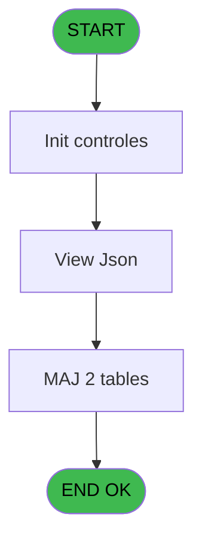
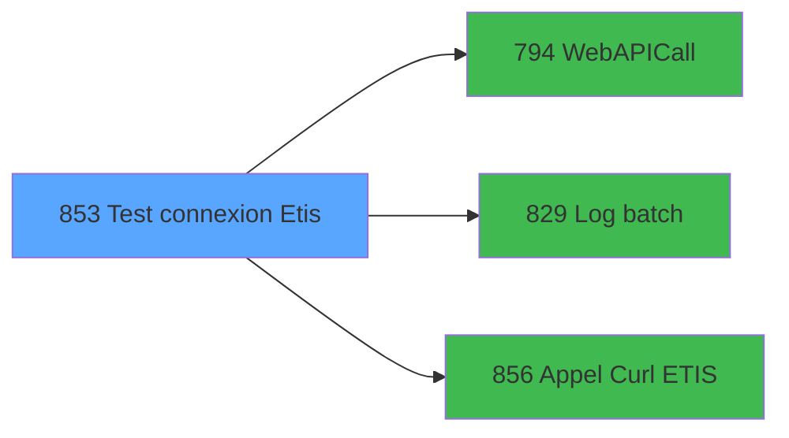

# REF IDE 853 - Test connexion Etis

> **Analyse**: Phases 1-4 2026-02-03 14:44 -> 14:44 (13s) | Assemblage 14:44
> **Pipeline**: V7.2 Enrichi
> **Structure**: 4 onglets (Resume | Ecrans | Donnees | Connexions)

<!-- TAB:Resume -->

## 1. FICHE D'IDENTITE

| Attribut | Valeur |
|----------|--------|
| Projet | REF |
| IDE Position | 853 |
| Nom Programme | Test connexion Etis |
| Fichier source | `Prg_853.xml` |
| Dossier IDE | General |
| Taches | 5 (1 ecrans visibles) |
| Tables modifiees | 2 |
| Programmes appeles | 3 |
| :warning: Statut | **ORPHELIN_POTENTIEL** |

## 2. DESCRIPTION FONCTIONNELLE

**Test connexion Etis** assure la gestion complete de ce processus.

Le flux de traitement s'organise en **1 blocs fonctionnels** :

- **Traitement** (5 taches) : traitements metier divers

**Donnees modifiees** : 2 tables en ecriture (tables_imports, pms_village).

**Logique metier** : 1 regles identifiees couvrant conditions metier.

Detail : phases du traitement

#### Phase 1 : Traitement (5 taches)

- **853** - Test connexion Etis
- **853.1** - Lecture pmsvillage
- **853.2** - Lecture pmsvillage
- **853.3** - Lecture intervention
- **853.4** - View Json **[[ECRAN]](#ecran-t5)**

Delegue a : [WebAPICall (IDE 794)](REF-IDE-794.md), [Log batch (IDE 829)](REF-IDE-829.md), [Appel Curl ETIS (IDE 856)](REF-IDE-856.md)

#### Tables impactees

| Table | Operations | Role metier |
|-------|-----------|-------------|
| tables_imports | **W** (1 usages) |  |
| pms_village | **W** (1 usages) |  |

## 3. BLOCS FONCTIONNELS

### 3.1 Traitement (5 taches)

Traitements internes.

---

#### 853 - Test connexion Etis

**Role** : Verification : Test connexion Etis.

4 sous-taches directes

| Tache | Nom | Bloc |
|-------|-----|------|
| [853.1](#t2) | Lecture pmsvillage | Traitement |
| [853.2](#t3) | Lecture pmsvillage | Traitement |
| [853.3](#t4) | Lecture intervention | Traitement |
| [853.4](#t5) | View Json **[[ECRAN]](#ecran-t5)** | Traitement |

**Variables liees** : J (v.URL test)
**Delegue a** : [WebAPICall (IDE 794)](REF-IDE-794.md), [Log batch (IDE 829)](REF-IDE-829.md), [Appel Curl ETIS (IDE 856)](REF-IDE-856.md)

---

#### 853.1 - Lecture pmsvillage

**Role** : Traitement : Lecture pmsvillage.
**Delegue a** : [WebAPICall (IDE 794)](REF-IDE-794.md), [Log batch (IDE 829)](REF-IDE-829.md), [Appel Curl ETIS (IDE 856)](REF-IDE-856.md)

---

#### 853.2 - Lecture pmsvillage

**Role** : Traitement : Lecture pmsvillage.
**Delegue a** : [WebAPICall (IDE 794)](REF-IDE-794.md), [Log batch (IDE 829)](REF-IDE-829.md), [Appel Curl ETIS (IDE 856)](REF-IDE-856.md)

---

#### 853.3 - Lecture intervention

**Role** : Traitement : Lecture intervention.
**Delegue a** : [WebAPICall (IDE 794)](REF-IDE-794.md), [Log batch (IDE 829)](REF-IDE-829.md), [Appel Curl ETIS (IDE 856)](REF-IDE-856.md)

---

#### 853.4 - View Json [[ECRAN]](#ecran-t5)

**Role** : Traitement : View Json.
**Ecran** : 459 x 311 DLU | [Voir mockup](#ecran-t5)
**Variables liees** : M (v.JsonResponse)
**Delegue a** : [WebAPICall (IDE 794)](REF-IDE-794.md), [Log batch (IDE 829)](REF-IDE-829.md), [Appel Curl ETIS (IDE 856)](REF-IDE-856.md)

## 5. REGLES METIER

1 regles identifiees:

### Autres (1 regles)

#### [RM-001] Si o.OK ? [E] alors 'OK' sinon 'ERR')

| Element | Detail |
|---------|--------|
| **Condition** | `o.OK ? [E]` |
| **Si vrai** | 'OK' |
| **Si faux** | 'ERR') |
| **Variables** | E (o.OK ?) |
| **Expression source** | Expression 20 : `IF(o.OK ? [E], 'OK','ERR')` |
| **Exemple** | Si o.OK ? [E] → 'OK'. Sinon → 'ERR') |

## 6. CONTEXTE

- **Appele par**: (aucun)
- **Appelle**: 3 programmes | **Tables**: 3 (W:2 R:0 L:1) | **Taches**: 5 | **Expressions**: 21

<!-- TAB:Ecrans -->

## 8. ECRANS

### 8.1 Forms visibles (1 / 5)

| # | Position | Tache | Nom | Type | Largeur | Hauteur | Bloc |
|---|----------|-------|-----|------|---------|---------|------|
| 1 | 853.4 | 853.4 | View Json | Type0 | 459 | 311 | Traitement |

### 8.2 Mockups Ecrans

---

#### 853.4 - View Json
**Tache** : [853.4](#t5) | **Type** : Type0 | **Dimensions** : 459 x 311 DLU
**Bloc** : Traitement | **Titre IDE** : View Json

<!-- FORM-DATA:
{
    "width":  459,
    "vFactor":  8,
    "type":  "Type0",
    "hFactor":  4,
    "controls":  [
                     {
                         "x":  12,
                         "type":  "label",
                         "var":  "",
                         "y":  240,
                         "w":  72,
                         "fmt":  "",
                         "name":  "",
                         "h":  9,
                         "color":  "",
                         "text":  "v.Retour nb pages",
                         "parent":  null
                     },
                     {
                         "x":  4,
                         "type":  "edit",
                         "var":  "",
                         "y":  0,
                         "w":  9,
                         "fmt":  "",
                         "name":  "Texte",
                         "h":  10,
                         "color":  "",
                         "text":  "",
                         "parent":  null
                     },
                     {
                         "x":  4,
                         "type":  "edit",
                         "var":  "",
                         "y":  16,
                         "w":  444,
                         "fmt":  "",
                         "name":  "",
                         "h":  216,
                         "color":  "",
                         "text":  "",
                         "parent":  null
                     },
                     {
                         "x":  88,
                         "type":  "edit",
                         "var":  "",
                         "y":  240,
                         "w":  115,
                         "fmt":  "",
                         "name":  "v.Retour nb pages",
                         "h":  10,
                         "color":  "",
                         "text":  "",
                         "parent":  null
                     }
                 ],
    "taskId":  "853.4",
    "height":  311
}
-->

<strong>Champs : 3 champs</strong>

| Pos (x,y) | Nom | Variable | Type |
|-----------|-----|----------|------|
| 4,0 | Texte | - | edit |
| 4,16 | (sans nom) | - | edit |
| 88,240 | v.Retour nb pages | - | edit |

## 9. NAVIGATION

Ecran unique: **View Json**

### 9.3 Structure hierarchique (5 taches)

| Position | Tache | Type | Dimensions | Bloc |
|----------|-------|------|------------|------|
| **853.1** | [**Test connexion Etis** (853)](#t1) | - | - | Traitement |
| 853.1.1 | [Lecture pmsvillage (853.1)](#t2) | - | - | |
| 853.1.2 | [Lecture pmsvillage (853.2)](#t3) | - | - | |
| 853.1.3 | [Lecture intervention (853.3)](#t4) | - | - | |
| 853.1.4 | [View Json (853.4)](#t5) [mockup](#ecran-t5) | - | 459x311 | |

### 9.4 Algorigramme

> **Legende**: Vert = START/END OK | Rouge = END KO | Bleu = Decisions
> *Algorigramme auto-genere. Utiliser `/algorigramme` pour une synthese metier detaillee.*

<!-- TAB:Donnees -->

## 10. TABLES

### Tables utilisees (3)

| ID | Nom | Description | Type | R | W | L | Usages |
|----|-----|-------------|------|---|---|---|--------|
| 118 | tables_imports |  | DB |   | **W** |   | 1 |
| 368 | pms_village |  | DB |   | **W** |   | 1 |
| 695 | repertoires_serveur_dispatch |  | DB |   |   | L | 1 |

### Colonnes par table (2 / 2 tables avec colonnes identifiees)

Table 118 - tables_imports (**W**) - 1 usages

| Lettre | Variable | Acces | Type |
|--------|----------|-------|------|
| A | v.Eté ? | W | Logical |
| B | v.Code village | W | Unicode |

Table 368 - pms_village (**W**) - 1 usages

| Lettre | Variable | Acces | Type |
|--------|----------|-------|------|
| B | v.Code village | W | Unicode |
| D | i.Code village API | W | Unicode |
| I | v.Code village API | W | Unicode |

## 11. VARIABLES

### 11.1 Variables de session (10)

Variables persistantes pendant toute la session.

| Lettre | Nom | Type | Usage dans |
|--------|-----|------|-----------|
| F | v.URL API | Unicode | 1x session |
| G | v.User API | Unicode | 1x session |
| H | v.Mot de passe API | Unicode | 1x session |
| I | v.Code village API | Unicode | [853.1](#t2), [853.2](#t3) |
| J | v.URL test | Unicode | [853](#t1) |
| K | v.Succes ? | Logical | - |
| L | v.Message d'erreur | Alpha | 1x session |
| M | v.JsonResponse | Blob | 2x session |
| N | v.XML response | Blob | - |
| O | v.Retour nb pages | Unicode | 1x session |

### 11.2 Autres (5)

Variables diverses.

| Lettre | Nom | Type | Usage dans |
|--------|-----|------|-----------|
| A | i.URL Api | Unicode | 2x refs |
| B | i.User | Unicode | 2x refs |
| C | i.Mot de passe | Unicode | 1x refs |
| D | i.Code village API | Unicode | [853.1](#t2), [853.2](#t3) |
| E | o.OK ? | Logical | 2x refs |

## 12. EXPRESSIONS

**21 / 21 expressions decodees (100%)**

### 12.1 Repartition par type

| Type | Expressions | Regles |
|------|-------------|--------|
| CONCATENATION | 1 | 0 |
| CONDITION | 5 | 5 |
| CONSTANTE | 3 | 0 |
| FORMAT | 1 | 0 |
| OTHER | 9 | 0 |
| STRING | 2 | 0 |

### 12.2 Expressions cles par type

#### CONCATENATION (1 expressions)

| Type | IDE | Expression | Regle |
|------|-----|------------|-------|
| CONCATENATION | 11 | `'<?xml version="1.0" encoding="UTF-8"?>' &
ASCIIChr(13)& ASCIIChr(10)&
DotNet.System.Xml.Linq.XElement.Load(
  DotNet.System.Runtime.Serialization.Json.JsonReaderWriterFactory.CreateJsonReader( 
     v.JsonResponse [M],
     DotNet.System.Xml.XmlDictionaryReaderQuotas()
   )
).ToString()` | - |

#### CONDITION (5 expressions)

| Type | IDE | Expression | Regle |
|------|-----|------------|-------|
| CONDITION | 20 | `IF(o.OK ? [E], 'OK','ERR')` | [RM-001](#rm-RM-001) |
| CONDITION | 2 | `i.Code village API [D]=''` | - |
| CONDITION | 12 | `v.Retour nb pages [O]<>''` | - |
| CONDITION | 21 | `IF(o.OK ? [E], '', v.Message d'erreur [L])` | - |
| CONDITION | 1 | `i.URL Api [A]='' OR i.User [B]=''` | - |

#### CONSTANTE (3 expressions)

| Type | IDE | Expression | Regle |
|------|-----|------------|-------|
| CONSTANTE | 19 | `'json'` | - |
| CONSTANTE | 14 | `'ETIS'` | - |
| CONSTANTE | 8 | `'GET'` | - |

#### FORMAT (1 expressions)

| Type | IDE | Expression | Regle |
|------|-----|------------|-------|
| FORMAT | 7 | `RTrim(v.URL API [F]) & 'interventions/search?changementEtatDepuis=' &DStr(Date(), 'YYYY-MM-DD')&'T'& TStr(Time(), 'HH:MM:SS') & '.000%2B00:00&site='& Trim(v.Code village API [I])` | - |

#### OTHER (9 expressions)

| Type | IDE | Expression | Regle |
|------|-----|------------|-------|
| OTHER | 16 | `StrBuild(MlsTrans('Test @1@'), v.Code village API [I])` | - |
| OTHER | 15 | `MlsTrans('Test connexion')` | - |
| OTHER | 18 | `v.JsonResponse [M]` | - |
| OTHER | 17 | `v.URL test [J]` | - |
| OTHER | 13 | `v.URL test [J]` | - |
| ... | | *+4 autres* | |

#### STRING (2 expressions)

| Type | IDE | Expression | Regle |
|------|-----|------------|-------|
| STRING | 10 | `Trim(v.Mot de passe API [H])` | - |
| STRING | 9 | `Trim(v.User API [G])` | - |

### 12.3 Toutes les expressions (21)

Voir les 21 expressions

#### CONCATENATION (1)

| IDE | Expression Decodee |
|-----|-------------------|
| 11 | `'<?xml version="1.0" encoding="UTF-8"?>' &
ASCIIChr(13)& ASCIIChr(10)&
DotNet.System.Xml.Linq.XElement.Load(
  DotNet.System.Runtime.Serialization.Json.JsonReaderWriterFactory.CreateJsonReader( 
     v.JsonResponse [M],
     DotNet.System.Xml.XmlDictionaryReaderQuotas()
   )
).ToString()` |

#### CONDITION (5)

| IDE | Expression Decodee |
|-----|-------------------|
| 20 | `IF(o.OK ? [E], 'OK','ERR')` |
| 21 | `IF(o.OK ? [E], '', v.Message d'erreur [L])` |
| 1 | `i.URL Api [A]='' OR i.User [B]=''` |
| 2 | `i.Code village API [D]=''` |
| 12 | `v.Retour nb pages [O]<>''` |

#### CONSTANTE (3)

| IDE | Expression Decodee |
|-----|-------------------|
| 8 | `'GET'` |
| 14 | `'ETIS'` |
| 19 | `'json'` |

#### FORMAT (1)

| IDE | Expression Decodee |
|-----|-------------------|
| 7 | `RTrim(v.URL API [F]) & 'interventions/search?changementEtatDepuis=' &DStr(Date(), 'YYYY-MM-DD')&'T'& TStr(Time(), 'HH:MM:SS') & '.000%2B00:00&site='& Trim(v.Code village API [I])` |

#### OTHER (9)

| IDE | Expression Decodee |
|-----|-------------------|
| 3 | `i.URL Api [A]` |
| 4 | `i.User [B]` |
| 5 | `i.Mot de passe [C]` |
| 6 | `i.Code village API [D]` |
| 13 | `v.URL test [J]` |
| 15 | `MlsTrans('Test connexion')` |
| 16 | `StrBuild(MlsTrans('Test @1@'), v.Code village API [I])` |
| 17 | `v.URL test [J]` |
| 18 | `v.JsonResponse [M]` |

#### STRING (2)

| IDE | Expression Decodee |
|-----|-------------------|
| 9 | `Trim(v.User API [G])` |
| 10 | `Trim(v.Mot de passe API [H])` |

<!-- TAB:Connexions -->

## 13. GRAPHE D'APPELS

### 13.1 Chaine depuis Main (Callers)

**Chemin**: (pas de callers directs)

### 13.2 Callers

| IDE | Nom Programme | Nb Appels |
|-----|---------------|-----------|
| - | (aucun) | - |

### 13.3 Callees (programmes appeles)

### 13.4 Detail Callees avec contexte

| IDE | Nom Programme | Appels | Contexte |
|-----|---------------|--------|----------|
| [794](REF-IDE-794.md) | WebAPICall | 1 | Sous-programme |
| [829](REF-IDE-829.md) | Log batch | 1 | Sous-programme |
| [856](REF-IDE-856.md) | Appel Curl ETIS | 1 | Sous-programme |

## 14. RECOMMANDATIONS MIGRATION

### 14.1 Profil du programme

| Metrique | Valeur | Impact migration |
|----------|--------|-----------------|
| Lignes de logique | 76 | Programme compact |
| Expressions | 21 | Peu de logique |
| Tables WRITE | 2 | Impact faible |
| Sous-programmes | 3 | Peu de dependances |
| Ecrans visibles | 1 | Ecran unique ou traitement batch |
| Code desactive | 1.3% (1 / 76) | Code sain |
| Regles metier | 1 | Quelques regles a preserver |

### 14.2 Plan de migration par bloc

#### Traitement (5 taches: 1 ecran, 4 traitements)

- **Strategie** : Orchestrateur avec 1 ecrans (Razor/React) et 4 traitements backend (services).
- Les ecrans deviennent des composants UI, les traitements invisibles deviennent des services injectables.
- 3 sous-programme(s) a migrer ou a reutiliser depuis les services existants.
- Decomposer les taches en services unitaires testables.

### 14.3 Dependances critiques

| Dependance | Type | Appels | Impact |
|------------|------|--------|--------|
| tables_imports | Table WRITE (Database) | 1x | Schema + repository |
| pms_village | Table WRITE (Database) | 1x | Schema + repository |
| [Appel Curl ETIS (IDE 856)](REF-IDE-856.md) | Sous-programme | 1x | Normale - Sous-programme |
| [Log batch (IDE 829)](REF-IDE-829.md) | Sous-programme | 1x | Normale - Sous-programme |
| [WebAPICall (IDE 794)](REF-IDE-794.md) | Sous-programme | 1x | Normale - Sous-programme |

---
*Spec DETAILED generee par Pipeline V7.2 - 2026-02-03 14:44*
