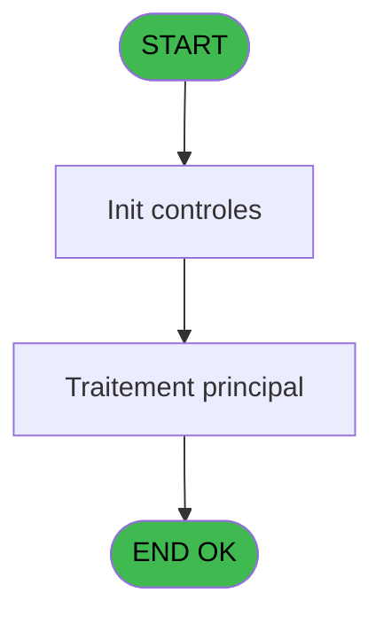
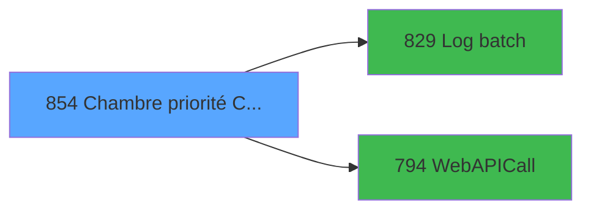

# REF IDE 854 - Chambre priorité CLIENT

> **Analyse**: Phases 1-4 2026-02-03 14:44 -> 14:45 (13s) | Assemblage 14:45
> **Pipeline**: V7.2 Enrichi
> **Structure**: 4 onglets (Resume | Ecrans | Donnees | Connexions)

<!-- TAB:Resume -->

## 1. FICHE D'IDENTITE

| Attribut | Valeur |
|----------|--------|
| Projet | REF |
| IDE Position | 854 |
| Nom Programme | Chambre priorité CLIENT |
| Fichier source | `Prg_854.xml` |
| Dossier IDE | General |
| Taches | 2 (0 ecrans visibles) |
| Tables modifiees | 0 |
| Programmes appeles | 2 |
| :warning: Statut | **ORPHELIN_POTENTIEL** |

## 2. DESCRIPTION FONCTIONNELLE

**Chambre priorité CLIENT** assure la gestion complete de ce processus.

Le flux de traitement s'organise en **1 blocs fonctionnels** :

- **Traitement** (2 taches) : traitements metier divers

**Logique metier** : 4 regles identifiees couvrant conditions metier.

## 3. BLOCS FONCTIONNELS

### 3.1 Traitement (2 taches)

Traitements internes.

---

#### 854 - Chambre priorité CLIENT

**Role** : Traitement : Chambre priorité CLIENT.
**Variables liees** : A (i.Nom chambre)
**Delegue a** : [Log batch (IDE 829)](REF-IDE-829.md), [WebAPICall (IDE 794)](REF-IDE-794.md)

---

#### 854.1 - Lecture intervention

**Role** : Traitement : Lecture intervention.
**Variables liees** : C (i.Intervention)
**Delegue a** : [Log batch (IDE 829)](REF-IDE-829.md), [WebAPICall (IDE 794)](REF-IDE-794.md)

## 5. REGLES METIER

4 regles identifiees:

### Autres (4 regles)

#### [RM-001] Traitement si v.URL API [F] est renseigne

| Element | Detail |
|---------|--------|
| **Condition** | `v.URL API [F]<>''` |
| **Si vrai** | v.URL API [F] |
| **Si faux** | v.Code API [H]) |
| **Variables** | F (v.URL API), H (v.Code API) |
| **Expression source** | Expression 15 : `IF(v.URL API [F]<>'',v.URL API [F], v.Code API [H])` |
| **Exemple** | Si v.URL API [F]<>'' → v.URL API [F]. Sinon → v.Code API [H]) |

#### [RM-002] Si o.Libellé retour [D]='OK' alors 'OK' sinon 'ERR')

| Element | Detail |
|---------|--------|
| **Condition** | `o.Libellé retour [D]='OK'` |
| **Si vrai** | 'OK' |
| **Si faux** | 'ERR') |
| **Variables** | D (o.Libellé retour) |
| **Expression source** | Expression 31 : `IF(o.Libellé retour [D]='OK', 'OK', 'ERR')` |
| **Exemple** | Si o.Libellé retour [D]='OK' → 'OK'. Sinon → 'ERR') |

#### [RM-003] Si [W] alors 'OK' sinon 'ERR')

| Element | Detail |
|---------|--------|
| **Condition** | `[W]` |
| **Si vrai** | 'OK' |
| **Si faux** | 'ERR') |
| **Expression source** | Expression 32 : `IF([W],'OK','ERR')` |
| **Exemple** | Si [W] → 'OK'. Sinon → 'ERR') |

#### [RM-004] Traitement si [X] est renseigne

| Element | Detail |
|---------|--------|
| **Condition** | `[X]<>''` |
| **Si vrai** | [X] |
| **Si faux** | o.Libellé retour [D]) |
| **Variables** | D (o.Libellé retour) |
| **Expression source** | Expression 33 : `IF([X]<>'', [X], o.Libellé retour [D])` |
| **Exemple** | Si [X]<>'' → [X]. Sinon → o.Libellé retour [D]) |

## 6. CONTEXTE

- **Appele par**: (aucun)
- **Appelle**: 2 programmes | **Tables**: 3 (W:0 R:1 L:2) | **Taches**: 2 | **Expressions**: 37

<!-- TAB:Ecrans -->

## 8. ECRANS

*(Programme sans ecran visible)*

## 9. NAVIGATION

### 9.3 Structure hierarchique (2 taches)

| Position | Tache | Type | Dimensions | Bloc |
|----------|-------|------|------------|------|
| **854.1** | [**Chambre priorité CLIENT** (854)](#t1) | - | - | Traitement |
| 854.1.1 | [Lecture intervention (854.1)](#t2) | - | - | |

### 9.4 Algorigramme

> **Legende**: Vert = START/END OK | Rouge = END KO | Bleu = Decisions
> *Algorigramme auto-genere. Utiliser `/algorigramme` pour une synthese metier detaillee.*

<!-- TAB:Donnees -->

## 10. TABLES

### Tables utilisees (3)

| ID | Nom | Description | Type | R | W | L | Usages |
|----|-----|-------------|------|---|---|---|--------|
| 118 | tables_imports |  | DB | R |   |   | 1 |
| 368 | pms_village |  | DB |   |   | L | 1 |
| 695 | repertoires_serveur_dispatch |  | DB |   |   | L | 1 |

### Colonnes par table (1 / 1 tables avec colonnes identifiees)

Table 118 - tables_imports (R) - 1 usages

| Lettre | Variable | Acces | Type |
|--------|----------|-------|------|
| I | v.JSon in | R | Blob |
| J | v.JSon response | R | Blob |
| M | v.XML response | R | Blob |

## 11. VARIABLES

### 11.1 Variables de session (14)

Variables persistantes pendant toute la session.

| Lettre | Nom | Type | Usage dans |
|--------|-----|------|-----------|
| E | v.Export | Unicode | - |
| F | v.URL API | Unicode | 1x session |
| G | v.Eté | Logical | - |
| H | v.Code API | Unicode | 1x session |
| I | v.JSon in | Blob | 2x session |
| J | v.JSon response | Blob | - |
| K | v.Succès ? | Logical | 1x session |
| L | v.Message d'erreur | Alpha | 1x session |
| M | v.XML response | Blob | 1x session |
| N | v.Origine demande | Unicode | 1x session |
| O | v.Libellé intervetion | Unicode | 1x session |
| P | v.Status | Unicode | - |
| Q | v.Sous zone | Unicode | - |
| R | v.Id batch | Numeric | 2x session |

### 11.2 Autres (4)

Variables diverses.

| Lettre | Nom | Type | Usage dans |
|--------|-----|------|-----------|
| A | i.Nom chambre | Unicode | [854](#t1) |
| B | i.Lieu de séjour | Unicode | 1x refs |
| C | i.Intervention | Numeric | 3x refs |
| D | o.Libellé retour | Unicode | 2x refs |

Toutes les 18 variables (liste complete)

| Cat | Lettre | Nom Variable | Type |
|-----|--------|--------------|------|
| V. | **E** | v.Export | Unicode |
| V. | **F** | v.URL API | Unicode |
| V. | **G** | v.Eté | Logical |
| V. | **H** | v.Code API | Unicode |
| V. | **I** | v.JSon in | Blob |
| V. | **J** | v.JSon response | Blob |
| V. | **K** | v.Succès ? | Logical |
| V. | **L** | v.Message d'erreur | Alpha |
| V. | **M** | v.XML response | Blob |
| V. | **N** | v.Origine demande | Unicode |
| V. | **O** | v.Libellé intervetion | Unicode |
| V. | **P** | v.Status | Unicode |
| V. | **Q** | v.Sous zone | Unicode |
| V. | **R** | v.Id batch | Numeric |
| Autre | **A** | i.Nom chambre | Unicode |
| Autre | **B** | i.Lieu de séjour | Unicode |
| Autre | **C** | i.Intervention | Numeric |
| Autre | **D** | o.Libellé retour | Unicode |

## 12. EXPRESSIONS

**37 / 37 expressions decodees (100%)**

### 12.1 Repartition par type

| Type | Expressions | Regles |
|------|-------------|--------|
| FORMAT | 4 | 0 |
| CONCATENATION | 1 | 0 |
| CONDITION | 9 | 4 |
| CONSTANTE | 7 | 0 |
| OTHER | 16 | 0 |

### 12.2 Expressions cles par type

#### FORMAT (4 expressions)

| Type | IDE | Expression | Regle |
|------|-----|------------|-------|
| FORMAT | 28 | `StrBuild(MlsTrans('Lecture intervention @1@ sur la chambre @2@'), Str(i.Intervention [C], '18'), i.Nom chambre [A])` | - |
| FORMAT | 29 | `StrBuild(MlsTrans('Mise à jour intervention @1@ sur la chambre @2@'), Str(i.Intervention [C], '18'), i.Nom chambre [A])` | - |
| FORMAT | 9 | `RTrim(v.XML response [M])& 'interventions/' & Str(i.Intervention [C], '12L')` | - |
| FORMAT | 2 | `Range(DStr(Date(), 'MM-DD'), '05-01', '10-31')` | - |

#### CONCATENATION (1 expressions)

| Type | IDE | Expression | Regle |
|------|-----|------------|-------|
| CONCATENATION | 13 | `'<?xml version="1.0" encoding="UTF-8"?>' &
ASCIIChr(13)& ASCIIChr(10)&
DotNet.System.Xml.Linq.XElement.Load(
  DotNet.System.Runtime.Serialization.Json.JsonReaderWriterFactory.CreateJsonReader( 
     [V],
     DotNet.System.Xml.XmlDictionaryReaderQuotas()
   )
).ToString()` | - |

#### CONDITION (9 expressions)

| Type | IDE | Expression | Regle |
|------|-----|------------|-------|
| CONDITION | 32 | `IF([W],'OK','ERR')` | [RM-003](#rm-RM-003) |
| CONDITION | 33 | `IF([X]<>'', [X], o.Libellé retour [D])` | [RM-004](#rm-RM-004) |
| CONDITION | 15 | `IF(v.URL API [F]<>'',v.URL API [F], v.Code API [H])` | [RM-001](#rm-RM-001) |
| CONDITION | 31 | `IF(o.Libellé retour [D]='OK', 'OK', 'ERR')` | [RM-002](#rm-RM-002) |
| CONDITION | 22 | `[Z]='CLIENT'` | - |
| ... | | *+4 autres* | |

#### CONSTANTE (7 expressions)

| Type | IDE | Expression | Regle |
|------|-----|------------|-------|
| CONSTANTE | 26 | `'ETIS'` | - |
| CONSTANTE | 36 | `'json'` | - |
| CONSTANTE | 37 | `''` | - |
| CONSTANTE | 24 | `'OK'` | - |
| CONSTANTE | 5 | `'G'` | - |
| ... | | *+2 autres* | |

#### OTHER (16 expressions)

| Type | IDE | Expression | Regle |
|------|-----|------------|-------|
| OTHER | 23 | `MlsTrans('L''intervention est déjà prioritaire.')` | - |
| OTHER | 25 | `MlsTrans('Erreur technique.')` | - |
| OTHER | 19 | `MlsTrans('L''intervention est en cours.')` | - |
| OTHER | 21 | `MlsTrans('Le statut est prêt !')` | - |
| OTHER | 34 | `[U]` | - |
| ... | | *+11 autres* | |

### 12.3 Toutes les expressions (37)

Voir les 37 expressions

#### FORMAT (4)

| IDE | Expression Decodee |
|-----|-------------------|
| 9 | `RTrim(v.XML response [M])& 'interventions/' & Str(i.Intervention [C], '12L')` |
| 2 | `Range(DStr(Date(), 'MM-DD'), '05-01', '10-31')` |
| 28 | `StrBuild(MlsTrans('Lecture intervention @1@ sur la chambre @2@'), Str(i.Intervention [C], '18'), i.Nom chambre [A])` |
| 29 | `StrBuild(MlsTrans('Mise à jour intervention @1@ sur la chambre @2@'), Str(i.Intervention [C], '18'), i.Nom chambre [A])` |

#### CONCATENATION (1)

| IDE | Expression Decodee |
|-----|-------------------|
| 13 | `'<?xml version="1.0" encoding="UTF-8"?>' &
ASCIIChr(13)& ASCIIChr(10)&
DotNet.System.Xml.Linq.XElement.Load(
  DotNet.System.Runtime.Serialization.Json.JsonReaderWriterFactory.CreateJsonReader( 
     [V],
     DotNet.System.Xml.XmlDictionaryReaderQuotas()
   )
).ToString()` |

#### CONDITION (9)

| IDE | Expression Decodee |
|-----|-------------------|
| 15 | `IF(v.URL API [F]<>'',v.URL API [F], v.Code API [H])` |
| 31 | `IF(o.Libellé retour [D]='OK', 'OK', 'ERR')` |
| 32 | `IF([W],'OK','ERR')` |
| 33 | `IF([X]<>'', [X], o.Libellé retour [D])` |
| 16 | `[AC]<>i.Nom chambre [A]` |
| 18 | `[AB]='EC'` |
| 20 | `[AB]='TN'` |
| 22 | `[Z]='CLIENT'` |
| 3 | `Trim(IF(v.Succès ? [K]='', v.JSon in [I], v.Succès ? [K])) & IF(v.Message d'erreur [L],  IF([S], '_SUMMER', '_WINTER'), '')` |

#### CONSTANTE (7)

| IDE | Expression Decodee |
|-----|-------------------|
| 5 | `'G'` |
| 7 | `'GET'` |
| 8 | `'PUT'` |
| 24 | `'OK'` |
| 26 | `'ETIS'` |
| 36 | `'json'` |
| 37 | `''` |

#### OTHER (16)

| IDE | Expression Decodee |
|-----|-------------------|
| 1 | `StrBuild('{
    "site": "@1@",
    "origineDemande": "@2@",
    "libelle": "@3@",
    "sousZone": "@4@"
}',  [T], 'CLIENT', [AA], i.Nom chambre [A])
` |
| 4 | `i.Lieu de séjour [B]` |
| 6 | `v.JSon in [I]` |
| 10 | `[U]` |
| 11 | `v.Origine demande [N]` |
| 12 | `v.Libellé intervetion [O]` |
| 14 | `v.Id batch [R]` |
| 17 | `MlsTrans('Demande d''invervention non trouvée.')` |
| 19 | `MlsTrans('L''intervention est en cours.')` |
| 21 | `MlsTrans('Le statut est prêt !')` |
| 23 | `MlsTrans('L''intervention est déjà prioritaire.')` |
| 25 | `MlsTrans('Erreur technique.')` |
| 27 | `MlsTrans('Chambre priorité client')` |
| 30 | `v.Id batch [R]` |
| 34 | `[U]` |
| 35 | `[V]` |

<!-- TAB:Connexions -->

## 13. GRAPHE D'APPELS

### 13.1 Chaine depuis Main (Callers)

**Chemin**: (pas de callers directs)

### 13.2 Callers

| IDE | Nom Programme | Nb Appels |
|-----|---------------|-----------|
| - | (aucun) | - |

### 13.3 Callees (programmes appeles)

### 13.4 Detail Callees avec contexte

| IDE | Nom Programme | Appels | Contexte |
|-----|---------------|--------|----------|
| [829](REF-IDE-829.md) | Log batch | 3 | Sous-programme |
| [794](REF-IDE-794.md) | WebAPICall | 2 | Sous-programme |

## 14. RECOMMANDATIONS MIGRATION

### 14.1 Profil du programme

| Metrique | Valeur | Impact migration |
|----------|--------|-----------------|
| Lignes de logique | 114 | Programme compact |
| Expressions | 37 | Peu de logique |
| Tables WRITE | 0 | Impact faible |
| Sous-programmes | 2 | Peu de dependances |
| Ecrans visibles | 0 | Ecran unique ou traitement batch |
| Code desactive | 0% (0 / 114) | Code sain |
| Regles metier | 4 | Quelques regles a preserver |

### 14.2 Plan de migration par bloc

#### Traitement (2 taches: 0 ecran, 2 traitements)

- **Strategie** : 2 service(s) backend injectable(s) (Domain Services).
- 2 sous-programme(s) a migrer ou a reutiliser depuis les services existants.
- Decomposer les taches en services unitaires testables.

### 14.3 Dependances critiques

| Dependance | Type | Appels | Impact |
|------------|------|--------|--------|
| [Log batch (IDE 829)](REF-IDE-829.md) | Sous-programme | 3x | **CRITIQUE** - Sous-programme |
| [WebAPICall (IDE 794)](REF-IDE-794.md) | Sous-programme | 2x | Haute - Sous-programme |

---
*Spec DETAILED generee par Pipeline V7.2 - 2026-02-03 14:45*
