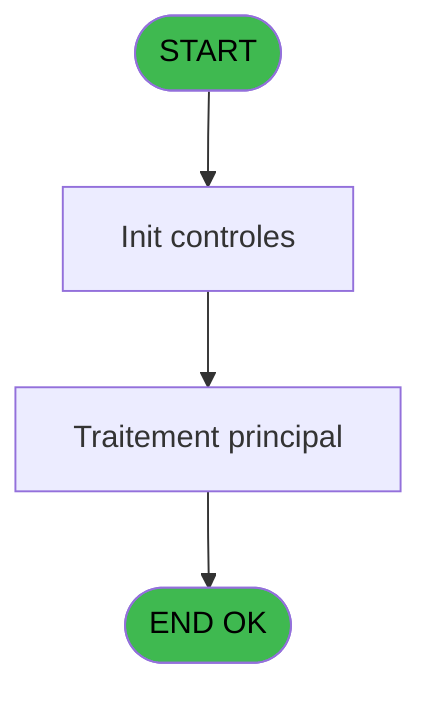
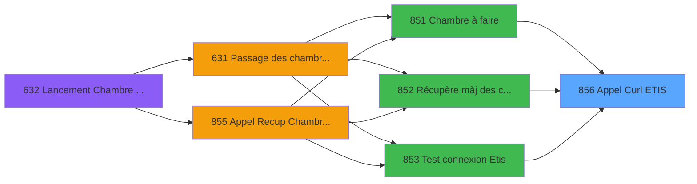

# REF IDE 856 - Appel Curl ETIS

> **Analyse**: Phases 1-4 2026-02-03 14:45 -> 14:45 (14s) | Assemblage 14:45
> **Pipeline**: V7.2 Enrichi
> **Structure**: 4 onglets (Resume | Ecrans | Donnees | Connexions)

<!-- TAB:Resume -->

## 1. FICHE D'IDENTITE

| Attribut | Valeur |
|----------|--------|
| Projet | REF |
| IDE Position | 856 |
| Nom Programme | Appel Curl ETIS |
| Fichier source | `Prg_856.xml` |
| Dossier IDE | General |
| Taches | 4 (0 ecrans visibles) |
| Tables modifiees | 0 |
| Programmes appeles | 1 |

## 2. DESCRIPTION FONCTIONNELLE

**Appel Curl ETIS** assure la gestion complete de ce processus, accessible depuis [Chambre à faire (IDE 851)](REF-IDE-851.md), [Récupère màj des chambres (IDE 852)](REF-IDE-852.md), [Test connexion Etis (IDE 853)](REF-IDE-853.md).

Le flux de traitement s'organise en **1 blocs fonctionnels** :

- **Traitement** (4 taches) : traitements metier divers

Detail : phases du traitement

#### Phase 1 : Traitement (4 taches)

- **856** - ClubMedAPICall
- **856.1** - Lecture paramètres API
- **856.2** - Write curl
- **856.3** - XML refresh/access token

Delegue a : [DateTimeToUnixTimeStamp (IDE 798)](REF-IDE-798.md)

## 3. BLOCS FONCTIONNELS

### 3.1 Traitement (4 taches)

Traitements internes.

---

#### 856 - ClubMedAPICall

**Role** : Traitement : ClubMedAPICall.

3 sous-taches directes

| Tache | Nom | Bloc |
|-------|-----|------|
| [856.1](#t2) | Lecture paramètres API | Traitement |
| [856.2](#t3) | Write curl | Traitement |
| [856.3](#t4) | XML refresh/access token | Traitement |

**Delegue a** : [DateTimeToUnixTimeStamp (IDE 798)](REF-IDE-798.md)

---

#### 856.1 - Lecture paramètres API

**Role** : Traitement : Lecture paramètres API.
**Delegue a** : [DateTimeToUnixTimeStamp (IDE 798)](REF-IDE-798.md)

---

#### 856.2 - Write curl

**Role** : Traitement : Write curl.
**Variables liees** : K (v.répertoire fichiers curl), P (v.commande CURL), Q (v.nom fichier curl bat), R (v.nom fichier curl reponse)
**Delegue a** : [DateTimeToUnixTimeStamp (IDE 798)](REF-IDE-798.md)

---

#### 856.3 - XML refresh/access token

**Role** : Traitement : XML refresh/access token.
**Delegue a** : [DateTimeToUnixTimeStamp (IDE 798)](REF-IDE-798.md)

## 5. REGLES METIER

*(Aucune regle metier identifiee)*

## 6. CONTEXTE

- **Appele par**: [Chambre à faire (IDE 851)](REF-IDE-851.md), [Récupère màj des chambres (IDE 852)](REF-IDE-852.md), [Test connexion Etis (IDE 853)](REF-IDE-853.md)
- **Appelle**: 1 programmes | **Tables**: 0 (W:0 R:0 L:0) | **Taches**: 4 | **Expressions**: 28

<!-- TAB:Ecrans -->

## 8. ECRANS

*(Programme sans ecran visible)*

## 9. NAVIGATION

### 9.3 Structure hierarchique (4 taches)

| Position | Tache | Type | Dimensions | Bloc |
|----------|-------|------|------------|------|
| **856.1** | [**ClubMedAPICall** (856)](#t1) | - | - | Traitement |
| 856.1.1 | [Lecture paramètres API (856.1)](#t2) | - | - | |
| 856.1.2 | [Write curl (856.2)](#t3) | - | - | |
| 856.1.3 | [XML refresh/access token (856.3)](#t4) | - | - | |

### 9.4 Algorigramme

> **Legende**: Vert = START/END OK | Rouge = END KO | Bleu = Decisions
> *Algorigramme auto-genere. Utiliser `/algorigramme` pour une synthese metier detaillee.*

<!-- TAB:Donnees -->

## 10. TABLES

### Tables utilisees (0)

| ID | Nom | Description | Type | R | W | L | Usages |
|----|-----|-------------|------|---|---|---|--------|

### Colonnes par table (0 / 0 tables avec colonnes identifiees)

## 11. VARIABLES

### 11.1 Parametres entrants (9)

Variables recues du programme appelant ([Chambre à faire (IDE 851)](REF-IDE-851.md)).

| Lettre | Nom | Type | Usage dans |
|--------|-----|------|-----------|
| A | P.i.UrlApi | Alpha | 1x parametre entrant |
| B | P.i.JsonIN | Blob | 3x parametre entrant |
| C | P.i.méthode | Unicode | - |
| D | P.i.User Name | Unicode | - |
| E | P.i.Password | Unicode | 1x parametre entrant |
| F | P.i.Avec Timestamp | Logical | - |
| G | P.o.IsSuccess | Logical | 1x parametre entrant |
| H | P.o.ErrorMessage | Alpha | 1x parametre entrant |
| I | P.o.JsonResponse | Blob | - |

### 11.2 Variables de session (15)

Variables persistantes pendant toute la session.

| Lettre | Nom | Type | Usage dans |
|--------|-----|------|-----------|
| J | v.Proxy adress http | Alpha | 1x session |
| K | v.répertoire fichiers curl | Alpha | - |
| L | v.répertoire fichiers réponse | Alpha | - |
| M | v.Login:Password base64 | Alpha | 1x session |
| N | v.Authentification | Alpha | 1x session |
| O | v.Url complétée | Alpha | - |
| P | v.commande CURL | Alpha | [856.2](#t3) |
| Q | v.nom fichier curl bat | Alpha | [856.2](#t3) |
| R | v.nom fichier curl reponse | Alpha | - |
| S | v.XMLResponse | Blob | - |
| T | v.status | Alpha | 1x session |
| U | v.error code | Alpha | 1x session |
| V | v.date | Date | 1x session |
| W | v.time | Time | 2x session |
| X | v.timestamp alpha | Unicode | 1x session |

Toutes les 24 variables (liste complete)

| Cat | Lettre | Nom Variable | Type |
|-----|--------|--------------|------|
| P0 | **A** | P.i.UrlApi | Alpha |
| P0 | **B** | P.i.JsonIN | Blob |
| P0 | **C** | P.i.méthode | Unicode |
| P0 | **D** | P.i.User Name | Unicode |
| P0 | **E** | P.i.Password | Unicode |
| P0 | **F** | P.i.Avec Timestamp | Logical |
| P0 | **G** | P.o.IsSuccess | Logical |
| P0 | **H** | P.o.ErrorMessage | Alpha |
| P0 | **I** | P.o.JsonResponse | Blob |
| V. | **J** | v.Proxy adress http | Alpha |
| V. | **K** | v.répertoire fichiers curl | Alpha |
| V. | **L** | v.répertoire fichiers réponse | Alpha |
| V. | **M** | v.Login:Password base64 | Alpha |
| V. | **N** | v.Authentification | Alpha |
| V. | **O** | v.Url complétée | Alpha |
| V. | **P** | v.commande CURL | Alpha |
| V. | **Q** | v.nom fichier curl bat | Alpha |
| V. | **R** | v.nom fichier curl reponse | Alpha |
| V. | **S** | v.XMLResponse | Blob |
| V. | **T** | v.status | Alpha |
| V. | **U** | v.error code | Alpha |
| V. | **V** | v.date | Date |
| V. | **W** | v.time | Time |
| V. | **X** | v.timestamp alpha | Unicode |

## 12. EXPRESSIONS

**28 / 28 expressions decodees (100%)**

### 12.1 Repartition par type

| Type | Expressions | Regles |
|------|-------------|--------|
| CONCATENATION | 4 | 0 |
| FORMAT | 9 | 0 |
| CALCULATION | 1 | 0 |
| CONSTANTE | 2 | 0 |
| DATE | 1 | 0 |
| OTHER | 7 | 0 |
| CAST_LOGIQUE | 1 | 0 |
| CONDITION | 1 | 0 |
| STRING | 2 | 0 |

### 12.2 Expressions cles par type

#### CONCATENATION (4 expressions)

| Type | IDE | Expression | Regle |
|------|-----|------------|-------|
| CONCATENATION | 23 | `Trim(P.o.IsSuccess [G])&'testcurl.bat'` | - |
| CONCATENATION | 24 | `Trim([AB])&':'&Trim([AC])` | - |
| CONCATENATION | 8 | `Translate('%club_exe%')&'curl\bin\curl '&IF(Trim(P.i.Password [E])<>'','-x '&Trim(P.i.Password [E]),'')&' -X '&Trim(v.error code [U])&' "'&Trim(v.Authentification [N])&'"'&' -H "charset=utf-8" -H  "'&Trim(v.Login:Password base64 [M])&'"'&IF(ISNULL(P.i.JsonIN [B]) OR Trim(P.i.JsonIN [B])='','',' -H "Content-Type: application/json" -d "'&Trim(P.i.JsonIN [B])&'"')& ' > '&Trim(v.nom fichier curl bat [Q])` | - |
| CONCATENATION | 21 | `'<?xml version="1.0" encoding="UTF-8"?>' &ASCIIChr(13)& ASCIIChr(10)&DotNet.System.Xml.Linq.XElement.Load(  DotNet.System.Runtime.Serialization.Json.JsonReaderWriterFactory.CreateJsonReader(      v.répertoire fichiers ... [K],     DotNet.System.Xml.XmlDictionaryReaderQuotas()   )).ToString()` | - |

#### FORMAT (9 expressions)

| Type | IDE | Expression | Regle |
|------|-----|------------|-------|
| FORMAT | 6 | `RepStr(P.i.JsonIN [B],'"','\"')` | - |
| FORMAT | 5 | `RepStr(P.i.UrlApi [A],'%','%%')` | - |
| FORMAT | 28 | `InStr({1,5}, 'http')=0 AND Trim({1,5})<>''` | - |
| FORMAT | 15 | `NOT(ISNULL(v.répertoire fichiers ... [K])) AND Trim(v.répertoire fichiers ... [K])<>'' AND InStr(v.répertoire fichiers ... [K],'"error"')=0` | - |
| FORMAT | 7 | `Trim(P.o.ErrorMessage [H])&DStr(v.date [V],'YYYYMMDD')&'_'&TStr(v.time [W],'HHMMSS')&'.txt'` | - |
| ... | | *+4 autres* | |

#### CALCULATION (1 expressions)

| Type | IDE | Expression | Regle |
|------|-----|------------|-------|
| CALCULATION | 27 | `'http://' & Trim({1,5})` | - |

#### CONSTANTE (2 expressions)

| Type | IDE | Expression | Regle |
|------|-----|------------|-------|
| CONSTANTE | 20 | `''` | - |
| CONSTANTE | 11 | `'Content-Type: application/json; charset=utf-8'` | - |

#### DATE (1 expressions)

| Type | IDE | Expression | Regle |
|------|-----|------------|-------|
| DATE | 1 | `Date()` | - |

#### OTHER (7 expressions)

| Type | IDE | Expression | Regle |
|------|-----|------------|-------|
| OTHER | 12 | `Left(v.répertoire fichiers ... [K],2000)` | - |
| OTHER | 14 | `File2Blb(v.nom fichier curl bat [Q])` | - |
| OTHER | 26 | `INIGet('HTTPProxyAddress')` | - |
| OTHER | 10 | `Left(P.i.JsonIN [B],2000)` | - |
| OTHER | 2 | `Time()` | - |
| ... | | *+2 autres* | |

#### CAST_LOGIQUE (1 expressions)

| Type | IDE | Expression | Regle |
|------|-----|------------|-------|
| CAST_LOGIQUE | 19 | `'FALSE'LOG` | - |

#### CONDITION (1 expressions)

| Type | IDE | Expression | Regle |
|------|-----|------------|-------|
| CONDITION | 22 | `Translate('%club_test%')='T'` | - |

#### STRING (2 expressions)

| Type | IDE | Expression | Regle |
|------|-----|------------|-------|
| STRING | 25 | `'Authorization: Basic ' &Trim([AD])` | - |
| STRING | 13 | `Trim(v.commande CURL [P])` | - |

### 12.3 Toutes les expressions (28)

Voir les 28 expressions

#### CONCATENATION (4)

| IDE | Expression Decodee |
|-----|-------------------|
| 8 | `Translate('%club_exe%')&'curl\bin\curl '&IF(Trim(P.i.Password [E])<>'','-x '&Trim(P.i.Password [E]),'')&' -X '&Trim(v.error code [U])&' "'&Trim(v.Authentification [N])&'"'&' -H "charset=utf-8" -H  "'&Trim(v.Login:Password base64 [M])&'"'&IF(ISNULL(P.i.JsonIN [B]) OR Trim(P.i.JsonIN [B])='','',' -H "Content-Type: application/json" -d "'&Trim(P.i.JsonIN [B])&'"')& ' > '&Trim(v.nom fichier curl bat [Q])` |
| 21 | `'<?xml version="1.0" encoding="UTF-8"?>' &ASCIIChr(13)& ASCIIChr(10)&DotNet.System.Xml.Linq.XElement.Load(  DotNet.System.Runtime.Serialization.Json.JsonReaderWriterFactory.CreateJsonReader(      v.répertoire fichiers ... [K],     DotNet.System.Xml.XmlDictionaryReaderQuotas()   )).ToString()` |
| 23 | `Trim(P.o.IsSuccess [G])&'testcurl.bat'` |
| 24 | `Trim([AB])&':'&Trim([AC])` |

#### FORMAT (9)

| IDE | Expression Decodee |
|-----|-------------------|
| 9 | `'c:\temp\log_ApiCall-'&Trim(Str(Counter(1),'3'))&'.pdf'` |
| 16 | `Del(v.répertoire fichiers ... [K],1,InStr(v.répertoire fichiers ... [K],'"status_code":')+13)` |
| 17 | `RepStr(Del(v.répertoire fichiers ... [K],1,InStr(v.répertoire fichiers ... [K],'"error"')+7),'_',' ')` |
| 18 | `Trim(RepStr(Trim(Left(v.Proxy adress http [J],InStr(v.Proxy adress http [J],',')-1)),'"',' '))&' ('&v.status [T]&')'` |
| 7 | `Trim(P.o.ErrorMessage [H])&DStr(v.date [V],'YYYYMMDD')&'_'&TStr(v.time [W],'HHMMSS')&'.txt'` |
| 5 | `RepStr(P.i.UrlApi [A],'%','%%')` |
| 6 | `RepStr(P.i.JsonIN [B],'"','\"')` |
| 15 | `NOT(ISNULL(v.répertoire fichiers ... [K])) AND Trim(v.répertoire fichiers ... [K])<>'' AND InStr(v.répertoire fichiers ... [K],'"error"')=0` |
| 28 | `InStr({1,5}, 'http')=0 AND Trim({1,5})<>''` |

#### CALCULATION (1)

| IDE | Expression Decodee |
|-----|-------------------|
| 27 | `'http://' & Trim({1,5})` |

#### CONSTANTE (2)

| IDE | Expression Decodee |
|-----|-------------------|
| 11 | `'Content-Type: application/json; charset=utf-8'` |
| 20 | `''` |

#### DATE (1)

| IDE | Expression Decodee |
|-----|-------------------|
| 1 | `Date()` |

#### OTHER (7)

| IDE | Expression Decodee |
|-----|-------------------|
| 2 | `Time()` |
| 3 | `v.timestamp alpha [X]` |
| 4 | `Counter(1)` |
| 10 | `Left(P.i.JsonIN [B],2000)` |
| 12 | `Left(v.répertoire fichiers ... [K],2000)` |
| 14 | `File2Blb(v.nom fichier curl bat [Q])` |
| 26 | `INIGet('HTTPProxyAddress')` |

#### CAST_LOGIQUE (1)

| IDE | Expression Decodee |
|-----|-------------------|
| 19 | `'FALSE'LOG` |

#### CONDITION (1)

| IDE | Expression Decodee |
|-----|-------------------|
| 22 | `Translate('%club_test%')='T'` |

#### STRING (2)

| IDE | Expression Decodee |
|-----|-------------------|
| 13 | `Trim(v.commande CURL [P])` |
| 25 | `'Authorization: Basic ' &Trim([AD])` |

<!-- TAB:Connexions -->

## 13. GRAPHE D'APPELS

### 13.1 Chaine depuis Main (Callers)

Main -> ... -> [Chambre à faire (IDE 851)](REF-IDE-851.md) -> **Appel Curl ETIS (IDE 856)**

Main -> ... -> [Récupère màj des chambres (IDE 852)](REF-IDE-852.md) -> **Appel Curl ETIS (IDE 856)**

Main -> ... -> [Test connexion Etis (IDE 853)](REF-IDE-853.md) -> **Appel Curl ETIS (IDE 856)**

### 13.2 Callers

| IDE | Nom Programme | Nb Appels |
|-----|---------------|-----------|
| [851](REF-IDE-851.md) | Chambre à faire | 2 |
| [852](REF-IDE-852.md) | Récupère màj des chambres | 1 |
| [853](REF-IDE-853.md) | Test connexion Etis | 1 |

### 13.3 Callees (programmes appeles)

### 13.4 Detail Callees avec contexte

| IDE | Nom Programme | Appels | Contexte |
|-----|---------------|--------|----------|
| [798](REF-IDE-798.md) | DateTimeToUnixTimeStamp | 1 | Sous-programme |

## 14. RECOMMANDATIONS MIGRATION

### 14.1 Profil du programme

| Metrique | Valeur | Impact migration |
|----------|--------|-----------------|
| Lignes de logique | 98 | Programme compact |
| Expressions | 28 | Peu de logique |
| Tables WRITE | 0 | Impact faible |
| Sous-programmes | 1 | Peu de dependances |
| Ecrans visibles | 0 | Ecran unique ou traitement batch |
| Code desactive | 1% (1 / 98) | Code sain |
| Regles metier | 0 | Pas de regle identifiee |

### 14.2 Plan de migration par bloc

#### Traitement (4 taches: 0 ecran, 4 traitements)

- **Strategie** : 4 service(s) backend injectable(s) (Domain Services).
- 1 sous-programme(s) a migrer ou a reutiliser depuis les services existants.
- Decomposer les taches en services unitaires testables.

### 14.3 Dependances critiques

| Dependance | Type | Appels | Impact |
|------------|------|--------|--------|
| [DateTimeToUnixTimeStamp (IDE 798)](REF-IDE-798.md) | Sous-programme | 1x | Normale - Sous-programme |

---
*Spec DETAILED generee par Pipeline V7.2 - 2026-02-03 14:45*
