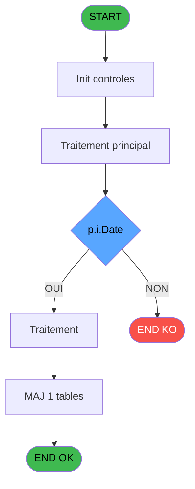
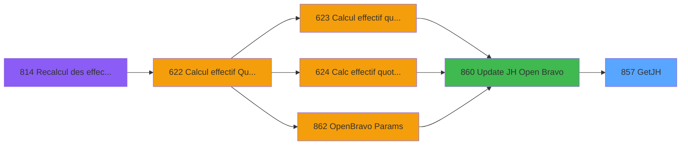
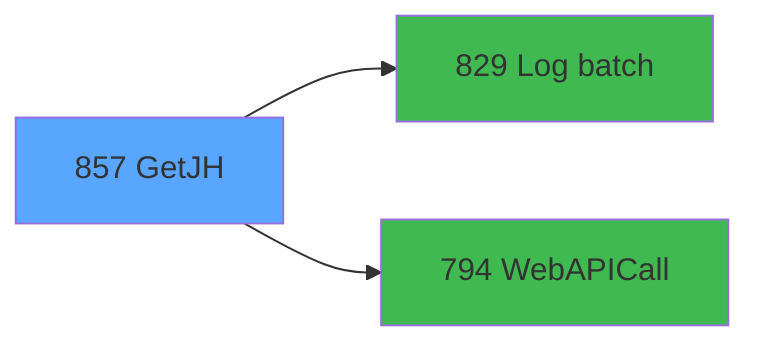

# REF IDE 857 - GetJH

> **Analyse**: Phases 1-4 2026-02-03 14:45 -> 14:46 (14s) | Assemblage 14:46
> **Pipeline**: V7.2 Enrichi
> **Structure**: 4 onglets (Resume | Ecrans | Donnees | Connexions)

<!-- TAB:Resume -->

## 1. FICHE D'IDENTITE

| Attribut | Valeur |
|----------|--------|
| Projet | REF |
| IDE Position | 857 |
| Nom Programme | GetJH |
| Fichier source | `Prg_857.xml` |
| Dossier IDE | General |
| Taches | 3 (0 ecrans visibles) |
| Tables modifiees | 1 |
| Programmes appeles | 2 |

## 2. DESCRIPTION FONCTIONNELLE

**GetJH** assure la gestion complete de ce processus, accessible depuis [Update JH Open Bravo (IDE 860)](REF-IDE-860.md).

Le flux de traitement s'organise en **1 blocs fonctionnels** :

- **Traitement** (3 taches) : traitements metier divers

**Donnees modifiees** : 1 tables en ecriture (file_traitement_mail).

**Logique metier** : 2 regles identifiees couvrant conditions metier, valeurs par defaut.

## 3. BLOCS FONCTIONNELS

### 3.1 Traitement (3 taches)

Traitements internes.

---

#### 857 - GetJH

**Role** : Consultation/chargement : GetJH.
**Delegue a** : [Log batch (IDE 829)](REF-IDE-829.md), [WebAPICall (IDE 794)](REF-IDE-794.md)

---

#### 857.1 - ExtractDataFromXML

**Role** : Traitement : ExtractDataFromXML.
**Delegue a** : [Log batch (IDE 829)](REF-IDE-829.md), [WebAPICall (IDE 794)](REF-IDE-794.md)

---

#### 857.2 - SendMail

**Role** : Traitement : SendMail.
**Delegue a** : [Log batch (IDE 829)](REF-IDE-829.md), [WebAPICall (IDE 794)](REF-IDE-794.md)

## 5. REGLES METIER

2 regles identifiees:

### Autres (2 regles)

#### [RM-001] Si p.i.Date [B]=BOM(p.i.Date [B]) alors p.o.JsoneResponse [H] sinon NULL())

| Element | Detail |
|---------|--------|
| **Condition** | `p.i.Date [B]=BOM(p.i.Date [B])` |
| **Si vrai** | p.o.JsoneResponse [H] |
| **Si faux** | NULL()) |
| **Variables** | B (p.i.Date), H (p.o.JsoneResponse) |
| **Expression source** | Expression 13 : `IF(p.i.Date [B]=BOM(p.i.Date [B]), p.o.JsoneResponse [H], NU` |
| **Exemple** | Si p.i.Date [B]=BOM(p.i.Date [B]) → p.o.JsoneResponse [H]. Sinon → NULL()) |

#### [RM-002] Valeur par defaut si v.ErrorMessage [O] est vide

| Element | Detail |
|---------|--------|
| **Condition** | `v.ErrorMessage [O]=''` |
| **Si vrai** | 'OK' |
| **Si faux** | 'ERR') |
| **Variables** | O (v.ErrorMessage) |
| **Expression source** | Expression 17 : `IF(v.ErrorMessage [O]='', 'OK', 'ERR')` |
| **Exemple** | Si v.ErrorMessage [O]='' → 'OK'. Sinon → 'ERR') |

## 6. CONTEXTE

- **Appele par**: [Update JH Open Bravo (IDE 860)](REF-IDE-860.md)
- **Appelle**: 2 programmes | **Tables**: 1 (W:1 R:0 L:0) | **Taches**: 3 | **Expressions**: 19

<!-- TAB:Ecrans -->

## 8. ECRANS

*(Programme sans ecran visible)*

## 9. NAVIGATION

### 9.3 Structure hierarchique (3 taches)

| Position | Tache | Type | Dimensions | Bloc |
|----------|-------|------|------------|------|
| **857.1** | [**GetJH** (857)](#t1) | - | - | Traitement |
| 857.1.1 | [ExtractDataFromXML (857.1)](#t2) | - | - | |
| 857.1.2 | [SendMail (857.2)](#t3) | - | - | |

### 9.4 Algorigramme

> **Legende**: Vert = START/END OK | Rouge = END KO | Bleu = Decisions
> *Algorigramme auto-genere. Utiliser `/algorigramme` pour une synthese metier detaillee.*

<!-- TAB:Donnees -->

## 10. TABLES

### Tables utilisees (1)

| ID | Nom | Description | Type | R | W | L | Usages |
|----|-----|-------------|------|---|---|---|--------|
| 863 | file_traitement_mail | Services / filieres | DB |   | **W** |   | 1 |

### Colonnes par table (0 / 1 tables avec colonnes identifiees)

Table 863 - file_traitement_mail (**W**) - 1 usages

*Table utilisee uniquement en Link ou aucune colonne Real identifiee dans le DataView.*

## 11. VARIABLES

### 11.1 Parametres entrants (9)

Variables recues du programme appelant ([Update JH Open Bravo (IDE 860)](REF-IDE-860.md)).

| Lettre | Nom | Type | Usage dans |
|--------|-----|------|-----------|
| A | p.i.Id log batch père | Numeric | 1x parametre entrant |
| B | p.i.Date | Date | 3x parametre entrant |
| C | p.i..Client (club med) | Unicode | 1x parametre entrant |
| D | p.i.Organization (village) | Unicode | - |
| E | p.o.HotelDays | Numeric | 1x parametre entrant |
| F | p.o.Idenitifier (ligne) | Unicode | 1x parametre entrant |
| G | p.o.XMLResponse | Blob | - |
| H | p.o.JsoneResponse | Blob | 1x parametre entrant |
| I | p.o.Statut | Unicode | - |

### 11.2 Variables de session (10)

Variables persistantes pendant toute la session.

| Lettre | Nom | Type | Usage dans |
|--------|-----|------|-----------|
| J | v.UrlApi | Unicode | 1x session |
| K | v.RequestType | Unicode | - |
| L | v.JsonIn | Blob | - |
| M | v.ProxyAdress | Unicode | - |
| N | v.IsSuccess | Logical | - |
| O | v.ErrorMessage | Unicode | 3x session |
| P | v.JsonResponse | Blob | 2x session |
| Q | v.XmlResponse | Blob | - |
| R | v.Id batch | Numeric | - |
| S | v.Nb item (trace) | Numeric | 1x session |

Toutes les 19 variables (liste complete)

| Cat | Lettre | Nom Variable | Type |
|-----|--------|--------------|------|
| P0 | **A** | p.i.Id log batch père | Numeric |
| P0 | **B** | p.i.Date | Date |
| P0 | **C** | p.i..Client (club med) | Unicode |
| P0 | **D** | p.i.Organization (village) | Unicode |
| P0 | **E** | p.o.HotelDays | Numeric |
| P0 | **F** | p.o.Idenitifier (ligne) | Unicode |
| P0 | **G** | p.o.XMLResponse | Blob |
| P0 | **H** | p.o.JsoneResponse | Blob |
| P0 | **I** | p.o.Statut | Unicode |
| V. | **J** | v.UrlApi | Unicode |
| V. | **K** | v.RequestType | Unicode |
| V. | **L** | v.JsonIn | Blob |
| V. | **M** | v.ProxyAdress | Unicode |
| V. | **N** | v.IsSuccess | Logical |
| V. | **O** | v.ErrorMessage | Unicode |
| V. | **P** | v.JsonResponse | Blob |
| V. | **Q** | v.XmlResponse | Blob |
| V. | **R** | v.Id batch | Numeric |
| V. | **S** | v.Nb item (trace) | Numeric |

## 12. EXPRESSIONS

**19 / 19 expressions decodees (100%)**

### 12.1 Repartition par type

| Type | Expressions | Regles |
|------|-------------|--------|
| CONCATENATION | 1 | 0 |
| CONDITION | 5 | 2 |
| CONSTANTE | 7 | 0 |
| FORMAT | 1 | 0 |
| OTHER | 4 | 0 |
| STRING | 1 | 0 |

### 12.2 Expressions cles par type

#### CONCATENATION (1 expressions)

| Type | IDE | Expression | Regle |
|------|-----|------------|-------|
| CONCATENATION | 5 | `'<?xml version="1.0" encoding="UTF-8"?>' &
ASCIIChr(13)& ASCIIChr(10)&
DotNet.System.Xml.Linq.XElement.Load(
  DotNet.System.Runtime.Serialization.Json.JsonReaderWriterFactory.CreateJsonReader( 
     v.JsonResponse [P],
     DotNet.System.Xml.XmlDictionaryReaderQuotas()
   )
).ToString()` | - |

#### CONDITION (5 expressions)

| Type | IDE | Expression | Regle |
|------|-----|------------|-------|
| CONDITION | 17 | `IF(v.ErrorMessage [O]='', 'OK', 'ERR')` | [RM-002](#rm-RM-002) |
| CONDITION | 13 | `IF(p.i.Date [B]=BOM(p.i.Date [B]), p.o.JsoneResponse [H], NULL())` | [RM-001](#rm-RM-001) |
| CONDITION | 7 | `Trim(VG38) <> '' AND Trim(v.ErrorMessage [O]) <> ''` | - |
| CONDITION | 18 | `IF(v.ErrorMessage [O]='', StrBuild('HD @1@, Idendifier @2@', Str(p.o.HotelDays [E], 'N4'), IF(p.o.Idenitifier (ligne) [F]='', '(Emprty)', p.o.Idenitifier (ligne) [F])), v.ErrorMessage [O])` | - |
| CONDITION | 14 | `IF(p.i.Date [B]=BOM(p.i.Date [B]), 'json', '')` | - |

#### CONSTANTE (7 expressions)

| Type | IDE | Expression | Regle |
|------|-----|------------|-------|
| CONSTANTE | 10 | `'GetHD'` | - |
| CONSTANTE | 12 | `'DEB'` | - |
| CONSTANTE | 16 | `'HD/Resorts'` | - |
| CONSTANTE | 9 | `'HD Readings'` | - |
| CONSTANTE | 1 | `''` | - |
| ... | | *+2 autres* | |

#### FORMAT (1 expressions)

| Type | IDE | Expression | Regle |
|------|-----|------------|-------|
| FORMAT | 2 | `Trim(VG39)&'/CLMDJH_HostelDays?'&'_where=pMSDate='''&Trim(DStr(p.i.Date [B],VG35))&'''%20AND%20organization='''&Trim(p.i.Organization (vill... [D])&'''%20AND%20client='''&Trim(p.i..Client (club med) [C])&''''` | - |

#### OTHER (4 expressions)

| Type | IDE | Expression | Regle |
|------|-----|------------|-------|
| OTHER | 15 | `v.Nb item (trace) [S]` | - |
| OTHER | 19 | `p.i.Id log batch père [A]` | - |
| OTHER | 6 | `v.JsonResponse [P]` | - |
| OTHER | 11 | `v.UrlApi [J]` | - |

#### STRING (1 expressions)

| Type | IDE | Expression | Regle |
|------|-----|------------|-------|
| STRING | 4 | `Trim(VG40)` | - |

<!-- TAB:Connexions -->

## 13. GRAPHE D'APPELS

### 13.1 Chaine depuis Main (Callers)

Main -> ... -> [Update JH Open Bravo (IDE 860)](REF-IDE-860.md) -> **GetJH (IDE 857)**

### 13.2 Callers

| IDE | Nom Programme | Nb Appels |
|-----|---------------|-----------|
| [860](REF-IDE-860.md) | Update JH Open Bravo | 1 |

### 13.3 Callees (programmes appeles)

### 13.4 Detail Callees avec contexte

| IDE | Nom Programme | Appels | Contexte |
|-----|---------------|--------|----------|
| [829](REF-IDE-829.md) | Log batch | 2 | Sous-programme |
| [794](REF-IDE-794.md) | WebAPICall | 1 | Sous-programme |

## 14. RECOMMANDATIONS MIGRATION

### 14.1 Profil du programme

| Metrique | Valeur | Impact migration |
|----------|--------|-----------------|
| Lignes de logique | 87 | Programme compact |
| Expressions | 19 | Peu de logique |
| Tables WRITE | 1 | Impact faible |
| Sous-programmes | 2 | Peu de dependances |
| Ecrans visibles | 0 | Ecran unique ou traitement batch |
| Code desactive | 0% (0 / 87) | Code sain |
| Regles metier | 2 | Quelques regles a preserver |

### 14.2 Plan de migration par bloc

#### Traitement (3 taches: 0 ecran, 3 traitements)

- **Strategie** : 3 service(s) backend injectable(s) (Domain Services).
- 2 sous-programme(s) a migrer ou a reutiliser depuis les services existants.
- Decomposer les taches en services unitaires testables.

### 14.3 Dependances critiques

| Dependance | Type | Appels | Impact |
|------------|------|--------|--------|
| file_traitement_mail | Table WRITE (Database) | 1x | Schema + repository |
| [Log batch (IDE 829)](REF-IDE-829.md) | Sous-programme | 2x | Haute - Sous-programme |
| [WebAPICall (IDE 794)](REF-IDE-794.md) | Sous-programme | 1x | Normale - Sous-programme |

---
*Spec DETAILED generee par Pipeline V7.2 - 2026-02-03 14:46*
