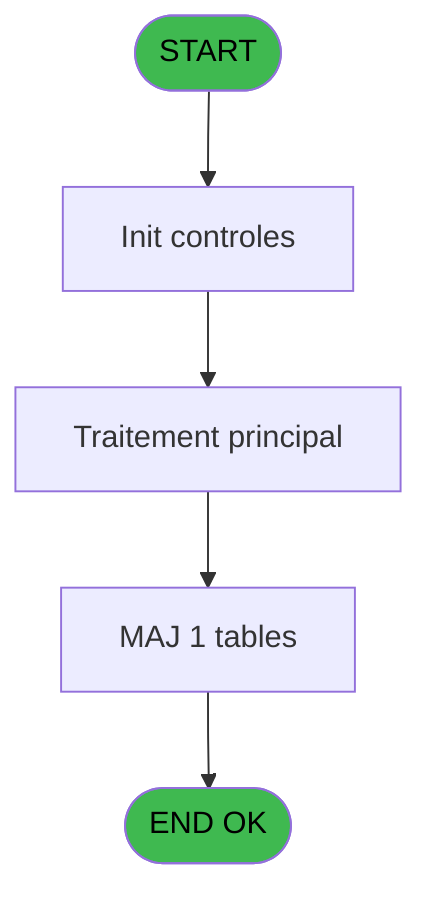
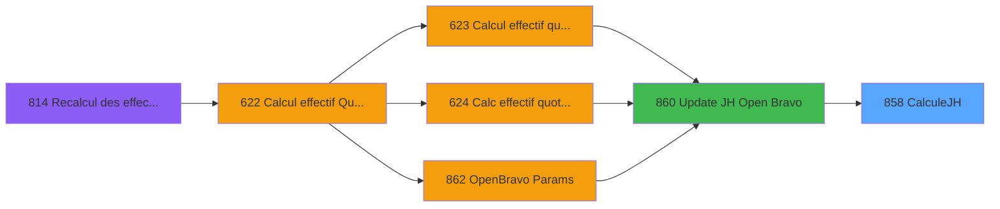

# REF IDE 858 - CalculeJH

> **Analyse**: Phases 1-4 2026-02-03 14:46 -> 14:46 (14s) | Assemblage 14:46
> **Pipeline**: V7.2 Enrichi
> **Structure**: 4 onglets (Resume | Ecrans | Donnees | Connexions)

<!-- TAB:Resume -->

## 1. FICHE D'IDENTITE

| Attribut | Valeur |
|----------|--------|
| Projet | REF |
| IDE Position | 858 |
| Nom Programme | CalculeJH |
| Fichier source | `Prg_858.xml` |
| Dossier IDE | General |
| Taches | 1 (0 ecrans visibles) |
| Tables modifiees | 1 |
| Programmes appeles | 1 |

## 2. DESCRIPTION FONCTIONNELLE

**CalculeJH** assure la gestion complete de ce processus, accessible depuis [Update JH Open Bravo (IDE 860)](REF-IDE-860.md).

Le flux de traitement s'organise en **1 blocs fonctionnels** :

- **Calcul** (1 tache) : calculs de montants, stocks ou compteurs

**Donnees modifiees** : 1 tables en ecriture (effectif_quotidien).

## 3. BLOCS FONCTIONNELS

### 3.1 Calcul (1 tache)

Calculs metier : montants, stocks, compteurs.

---

#### 858 - CalculeJH

**Role** : Calcul : CalculeJH.

## 5. REGLES METIER

*(Aucune regle metier identifiee)*

## 6. CONTEXTE

- **Appele par**: [Update JH Open Bravo (IDE 860)](REF-IDE-860.md)
- **Appelle**: 1 programmes | **Tables**: 1 (W:1 R:0 L:0) | **Taches**: 1 | **Expressions**: 13

<!-- TAB:Ecrans -->

## 8. ECRANS

*(Programme sans ecran visible)*

## 9. NAVIGATION

### 9.3 Structure hierarchique (1 tache)

| Position | Tache | Type | Dimensions | Bloc |
|----------|-------|------|------------|------|
| **858.1** | [**CalculeJH** (858)](#t1) | - | - | Calcul |

### 9.4 Algorigramme

> **Legende**: Vert = START/END OK | Rouge = END KO | Bleu = Decisions
> *Algorigramme auto-genere. Utiliser `/algorigramme` pour une synthese metier detaillee.*

<!-- TAB:Donnees -->

## 10. TABLES

### Tables utilisees (1)

| ID | Nom | Description | Type | R | W | L | Usages |
|----|-----|-------------|------|---|---|---|--------|
| 785 | effectif_quotidien |  | DB |   | **W** |   | 1 |

### Colonnes par table (1 / 1 tables avec colonnes identifiees)

Table 785 - effectif_quotidien (**W**) - 1 usages

| Lettre | Variable | Acces | Type |
|--------|----------|-------|------|
| A | p.i.Lieux de séjour | W | Unicode |
| B | p.i.DateCalcul | W | Date |
| C | p.i.Log batch père | W | Numeric |
| D | p.o.NombreJH | W | Numeric |
| E | V.Cumul | W | Numeric |

## 11. VARIABLES

### 11.1 Parametres entrants (4)

Variables recues du programme appelant ([Update JH Open Bravo (IDE 860)](REF-IDE-860.md)).

| Lettre | Nom | Type | Usage dans |
|--------|-----|------|-----------|
| A | p.i.Lieux de séjour | Unicode | 2x parametre entrant |
| B | p.i.DateCalcul | Date | 2x parametre entrant |
| C | p.i.Log batch père | Numeric | 1x parametre entrant |
| D | p.o.NombreJH | Numeric | 1x parametre entrant |

### 11.2 Variables de session (1)

Variables persistantes pendant toute la session.

| Lettre | Nom | Type | Usage dans |
|--------|-----|------|-----------|
| E | V.Cumul | Numeric | - |

## 12. EXPRESSIONS

**13 / 13 expressions decodees (100%)**

### 12.1 Repartition par type

| Type | Expressions | Regles |
|------|-------------|--------|
| CALCULATION | 2 | 0 |
| CONSTANTE | 5 | 0 |
| FORMAT | 1 | 0 |
| OTHER | 3 | 0 |
| CONDITION | 2 | 0 |

### 12.2 Expressions cles par type

#### CALCULATION (2 expressions)

| Type | IDE | Expression | Regle |
|------|-----|------------|-------|
| CALCULATION | 5 | `[O]/2` | - |
| CALCULATION | 4 | `[O]+[H]+[I]+[L]+[M]` | - |

#### CONSTANTE (5 expressions)

| Type | IDE | Expression | Regle |
|------|-----|------------|-------|
| CONSTANTE | 12 | `'lines'` | - |
| CONSTANTE | 13 | `'OK'` | - |
| CONSTANTE | 9 | `'HD calculation'` | - |
| CONSTANTE | 2 | `'GM'` | - |
| CONSTANTE | 8 | `'PMS_TO_OPENBRAVO'` | - |

#### FORMAT (1 expressions)

| Type | IDE | Expression | Regle |
|------|-----|------------|-------|
| FORMAT | 10 | `StrBuild('@1@ HD for @2@ at @3@', Str(p.o.NombreJH [D], 'N10'), IF(IN(p.i.Lieux de séjour [A], 'G', ''), 'all places of stay', p.i.Lieux de séjour [A]), DStr(p.i.DateCalcul [B], 'DD/MM/YYYY'))` | - |

#### OTHER (3 expressions)

| Type | IDE | Expression | Regle |
|------|-----|------------|-------|
| OTHER | 11 | `Counter(0)` | - |
| OTHER | 7 | `p.i.Log batch père [C]` | - |
| OTHER | 1 | `p.i.DateCalcul [B]` | - |

#### CONDITION (2 expressions)

| Type | IDE | Expression | Regle |
|------|-----|------------|-------|
| CONDITION | 6 | `CndRange(p.i.Lieux de séjour [A]<>'' AND p.i.Lieux de séjour [A]<>'G', p.i.Lieux de séjour [A])` | - |
| CONDITION | 3 | `[G] = 'ORDI' OR [G] = 'SEM' OR [G] = 'VSL' OR [G] = 'CLUB' OR [G] = 'PROP'` | - |

<!-- TAB:Connexions -->

## 13. GRAPHE D'APPELS

### 13.1 Chaine depuis Main (Callers)

Main -> ... -> [Update JH Open Bravo (IDE 860)](REF-IDE-860.md) -> **CalculeJH (IDE 858)**

### 13.2 Callers

| IDE | Nom Programme | Nb Appels |
|-----|---------------|-----------|
| [860](REF-IDE-860.md) | Update JH Open Bravo | 1 |

### 13.3 Callees (programmes appeles)

### 13.4 Detail Callees avec contexte

| IDE | Nom Programme | Appels | Contexte |
|-----|---------------|--------|----------|
| [829](REF-IDE-829.md) | Log batch | 1 | Sous-programme |

## 14. RECOMMANDATIONS MIGRATION

### 14.1 Profil du programme

| Metrique | Valeur | Impact migration |
|----------|--------|-----------------|
| Lignes de logique | 23 | Programme compact |
| Expressions | 13 | Peu de logique |
| Tables WRITE | 1 | Impact faible |
| Sous-programmes | 1 | Peu de dependances |
| Ecrans visibles | 0 | Ecran unique ou traitement batch |
| Code desactive | 0% (0 / 23) | Code sain |
| Regles metier | 0 | Pas de regle identifiee |

### 14.2 Plan de migration par bloc

#### Calcul (1 tache: 0 ecran, 1 traitement)

- **Strategie** : Services de calcul purs (Domain Services).
- Migrer la logique de calcul (stock, compteurs, montants)

### 14.3 Dependances critiques

| Dependance | Type | Appels | Impact |
|------------|------|--------|--------|
| effectif_quotidien | Table WRITE (Database) | 1x | Schema + repository |
| [Log batch (IDE 829)](REF-IDE-829.md) | Sous-programme | 1x | Normale - Sous-programme |

---
*Spec DETAILED generee par Pipeline V7.2 - 2026-02-03 14:46*
