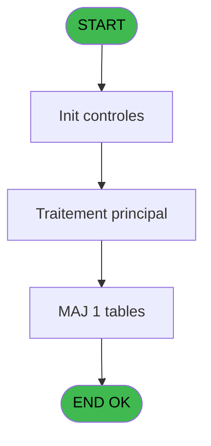
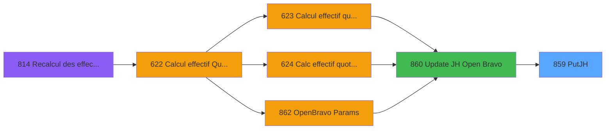
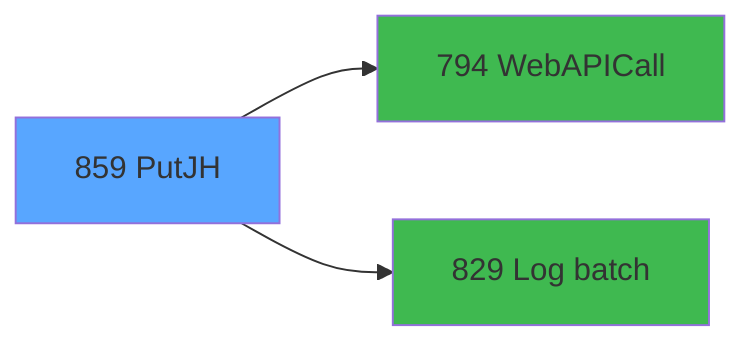

# REF IDE 859 - PutJH

> **Analyse**: Phases 1-4 2026-02-03 14:46 -> 14:46 (13s) | Assemblage 14:46
> **Pipeline**: V7.2 Enrichi
> **Structure**: 4 onglets (Resume | Ecrans | Donnees | Connexions)

<!-- TAB:Resume -->

## 1. FICHE D'IDENTITE

| Attribut | Valeur |
|----------|--------|
| Projet | REF |
| IDE Position | 859 |
| Nom Programme | PutJH |
| Fichier source | `Prg_859.xml` |
| Dossier IDE | General |
| Taches | 3 (0 ecrans visibles) |
| Tables modifiees | 1 |
| Programmes appeles | 2 |

## 2. DESCRIPTION FONCTIONNELLE

**PutJH** assure la gestion complete de ce processus, accessible depuis [Update JH Open Bravo (IDE 860)](REF-IDE-860.md).

Le flux de traitement s'organise en **1 blocs fonctionnels** :

- **Traitement** (3 taches) : traitements metier divers

**Donnees modifiees** : 1 tables en ecriture (file_traitement_mail).

**Logique metier** : 1 regles identifiees couvrant valeurs par defaut.

## 3. BLOCS FONCTIONNELS

### 3.1 Traitement (3 taches)

Traitements internes.

---

#### 859 - PutJH

**Role** : Traitement : PutJH.
**Delegue a** : [WebAPICall (IDE 794)](REF-IDE-794.md), [Log batch (IDE 829)](REF-IDE-829.md)

---

#### 859.1 - ExtractDataFromXML

**Role** : Traitement : ExtractDataFromXML.
**Delegue a** : [WebAPICall (IDE 794)](REF-IDE-794.md), [Log batch (IDE 829)](REF-IDE-829.md)

---

#### 859.2 - SendMail

**Role** : Traitement : SendMail.
**Delegue a** : [WebAPICall (IDE 794)](REF-IDE-794.md), [Log batch (IDE 829)](REF-IDE-829.md)

## 5. REGLES METIER

1 regles identifiees:

### Autres (1 regles)

#### [RM-001] Valeur par defaut si ErrorMessage [M] est vide

| Element | Detail |
|---------|--------|
| **Condition** | `ErrorMessage [M]=''` |
| **Si vrai** | 'OK' |
| **Si faux** | 'ERR') |
| **Variables** | M (ErrorMessage) |
| **Expression source** | Expression 14 : `IF(ErrorMessage [M]='', 'OK', 'ERR')` |
| **Exemple** | Si ErrorMessage [M]='' → 'OK'. Sinon → 'ERR') |

## 6. CONTEXTE

- **Appele par**: [Update JH Open Bravo (IDE 860)](REF-IDE-860.md)
- **Appelle**: 2 programmes | **Tables**: 1 (W:1 R:0 L:0) | **Taches**: 3 | **Expressions**: 19

<!-- TAB:Ecrans -->

## 8. ECRANS

*(Programme sans ecran visible)*

## 9. NAVIGATION

### 9.3 Structure hierarchique (3 taches)

| Position | Tache | Type | Dimensions | Bloc |
|----------|-------|------|------------|------|
| **859.1** | [**PutJH** (859)](#t1) | - | - | Traitement |
| 859.1.1 | [ExtractDataFromXML (859.1)](#t2) | - | - | |
| 859.1.2 | [SendMail (859.2)](#t3) | - | - | |

### 9.4 Algorigramme

> **Legende**: Vert = START/END OK | Rouge = END KO | Bleu = Decisions
> *Algorigramme auto-genere. Utiliser `/algorigramme` pour une synthese metier detaillee.*

<!-- TAB:Donnees -->

## 10. TABLES

### Tables utilisees (1)

| ID | Nom | Description | Type | R | W | L | Usages |
|----|-----|-------------|------|---|---|---|--------|
| 863 | file_traitement_mail | Services / filieres | DB |   | **W** |   | 1 |

### Colonnes par table (0 / 1 tables avec colonnes identifiees)

Table 863 - file_traitement_mail (**W**) - 1 usages

*Table utilisee uniquement en Link ou aucune colonne Real identifiee dans le DataView.*

## 11. VARIABLES

### 11.1 Parametres entrants (7)

Variables recues du programme appelant ([Update JH Open Bravo (IDE 860)](REF-IDE-860.md)).

| Lettre | Nom | Type | Usage dans |
|--------|-----|------|-----------|
| A | p.i.Log batch père | Numeric | 1x parametre entrant |
| B | p.i.Client (club) | Unicode | 2x parametre entrant |
| C | p.i.Organization (village) | Unicode | - |
| D | p.i.PmsDate | Date | 3x parametre entrant |
| E | p.i.HotelDays | Numeric | 3x parametre entrant |
| F | p.i.Identifier (ligne) | Unicode | 3x parametre entrant |
| G | p.o.Statut | Unicode | - |

### 11.2 Autres (8)

Variables diverses.

| Lettre | Nom | Type | Usage dans |
|--------|-----|------|-----------|
| H | UrlApi | Unicode | 1x refs |
| I | RequestType | Unicode | - |
| J | JsonIn | Blob | 1x refs |
| K | ProxyAdress | Unicode | - |
| L | IsSuccess | Logical | - |
| M | ErrorMessage | Unicode | 3x refs |
| N | JsonResponse | Blob | 2x refs |
| O | XmlResponse | Blob | - |

## 12. EXPRESSIONS

**19 / 19 expressions decodees (100%)**

### 12.1 Repartition par type

| Type | Expressions | Regles |
|------|-------------|--------|
| CALCULATION | 1 | 0 |
| CONCATENATION | 1 | 0 |
| CONDITION | 4 | 5 |
| CONSTANTE | 4 | 0 |
| FORMAT | 3 | 0 |
| OTHER | 5 | 0 |
| STRING | 1 | 0 |

### 12.2 Expressions cles par type

#### CALCULATION (1 expressions)

| Type | IDE | Expression | Regle |
|------|-----|------------|-------|
| CALCULATION | 1 | `Trim(VG39) & '/CLMDJH_HostelDays'` | - |

#### CONCATENATION (1 expressions)

| Type | IDE | Expression | Regle |
|------|-----|------------|-------|
| CONCATENATION | 4 | `'<?xml version="1.0" encoding="UTF-8"?>' &
ASCIIChr(13)& ASCIIChr(10)&
DotNet.System.Xml.Linq.XElement.Load(
  DotNet.System.Runtime.Serialization.Json.JsonReaderWriterFactory.CreateJsonReader( 
     JsonResponse [N],
     DotNet.System.Xml.XmlDictionaryReaderQuotas()
   )
).ToString()` | - |

#### CONDITION (4 expressions)

| Type | IDE | Expression | Regle |
|------|-----|------------|-------|
| CONDITION | 14 | `IF(ErrorMessage [M]='', 'OK', 'ERR')` | [RM-001](#rm-RM-001) |
| CONDITION | 9 | `Trim(p.i.Identifier (ligne) [F]) <> ''` | - |
| CONDITION | 8 | `Trim(p.i.Identifier (ligne) [F]) = ''` | - |
| CONDITION | 7 | `Trim(VG38) <> '' AND ErrorMessage [M] <> ''` | - |

#### CONSTANTE (4 expressions)

| Type | IDE | Expression | Regle |
|------|-----|------------|-------|
| CONSTANTE | 11 | `'PutHD'` | - |
| CONSTANTE | 17 | `'json'` | - |
| CONSTANTE | 2 | `'PUT'` | - |
| CONSTANTE | 10 | `'PMS_TO_OPENBRAVO'` | - |

#### FORMAT (3 expressions)

| Type | IDE | Expression | Regle |
|------|-----|------------|-------|
| FORMAT | 12 | `StrBuild('HD update @1@ for @2@', Str(p.i.HotelDays [E], 'N4'), DStr(p.i.PmsDate [D], 'DD/MM/YYYY'))` | - |
| FORMAT | 6 | `'{
"data": 
 {
   "id": "'& Trim(p.i.Identifier (ligne) [F]) &'",
   "client": "' & Trim(p.i.Client (club) [B]) & '",
   "organization": "' & Trim(p.i.Organization (vill... [C]) & '",
   "active": true,
   "pMSDate": "' & Trim(DStr(p.i.PmsDate [D],Trim(VG35))) & '",
   "hostelDay": ' & Trim(Str(p.i.HotelDays [E],'9.2')) & '
 }
}
'` | - |
| FORMAT | 5 | `'{
"data": 
 {
   "client": "' & Trim(p.i.Client (club) [B]) & '",
   "organization": "' & Trim(p.i.Organization (vill... [C]) & '",
   "active": true,
   "pMSDate": "' & Trim(DStr(p.i.PmsDate [D],Trim(VG35))) & '",
   "hostelDay": ' & Trim(Str(p.i.HotelDays [E],'9.2')) & '
 }
}
'
` | - |

#### OTHER (5 expressions)

| Type | IDE | Expression | Regle |
|------|-----|------------|-------|
| OTHER | 18 | `JsonResponse [N]` | - |
| OTHER | 19 | `p.i.Log batch père [A]` | - |
| OTHER | 16 | `JsonIn [J]` | - |
| OTHER | 13 | `UrlApi [H]` | - |
| OTHER | 15 | `ErrorMessage [M]` | - |

#### STRING (1 expressions)

| Type | IDE | Expression | Regle |
|------|-----|------------|-------|
| STRING | 3 | `Trim(VG40)` | - |

<!-- TAB:Connexions -->

## 13. GRAPHE D'APPELS

### 13.1 Chaine depuis Main (Callers)

Main -> ... -> [Update JH Open Bravo (IDE 860)](REF-IDE-860.md) -> **PutJH (IDE 859)**

### 13.2 Callers

| IDE | Nom Programme | Nb Appels |
|-----|---------------|-----------|
| [860](REF-IDE-860.md) | Update JH Open Bravo | 1 |

### 13.3 Callees (programmes appeles)

### 13.4 Detail Callees avec contexte

| IDE | Nom Programme | Appels | Contexte |
|-----|---------------|--------|----------|
| [794](REF-IDE-794.md) | WebAPICall | 1 | Sous-programme |
| [829](REF-IDE-829.md) | Log batch | 1 | Sous-programme |

## 14. RECOMMANDATIONS MIGRATION

### 14.1 Profil du programme

| Metrique | Valeur | Impact migration |
|----------|--------|-----------------|
| Lignes de logique | 72 | Programme compact |
| Expressions | 19 | Peu de logique |
| Tables WRITE | 1 | Impact faible |
| Sous-programmes | 2 | Peu de dependances |
| Ecrans visibles | 0 | Ecran unique ou traitement batch |
| Code desactive | 1.4% (1 / 72) | Code sain |
| Regles metier | 1 | Quelques regles a preserver |

### 14.2 Plan de migration par bloc

#### Traitement (3 taches: 0 ecran, 3 traitements)

- **Strategie** : 3 service(s) backend injectable(s) (Domain Services).
- 2 sous-programme(s) a migrer ou a reutiliser depuis les services existants.
- Decomposer les taches en services unitaires testables.

### 14.3 Dependances critiques

| Dependance | Type | Appels | Impact |
|------------|------|--------|--------|
| file_traitement_mail | Table WRITE (Database) | 1x | Schema + repository |
| [Log batch (IDE 829)](REF-IDE-829.md) | Sous-programme | 1x | Normale - Sous-programme |
| [WebAPICall (IDE 794)](REF-IDE-794.md) | Sous-programme | 1x | Normale - Sous-programme |

---
*Spec DETAILED generee par Pipeline V7.2 - 2026-02-03 14:46*
