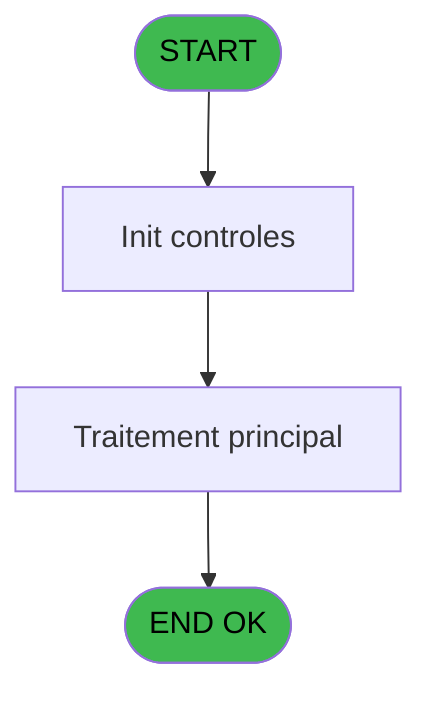
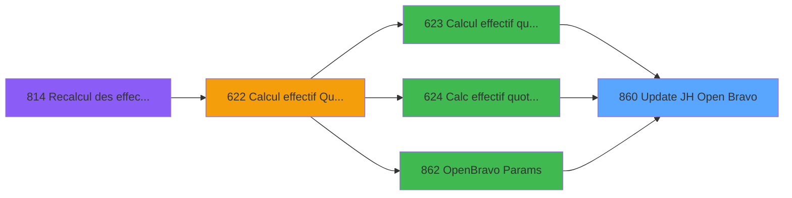
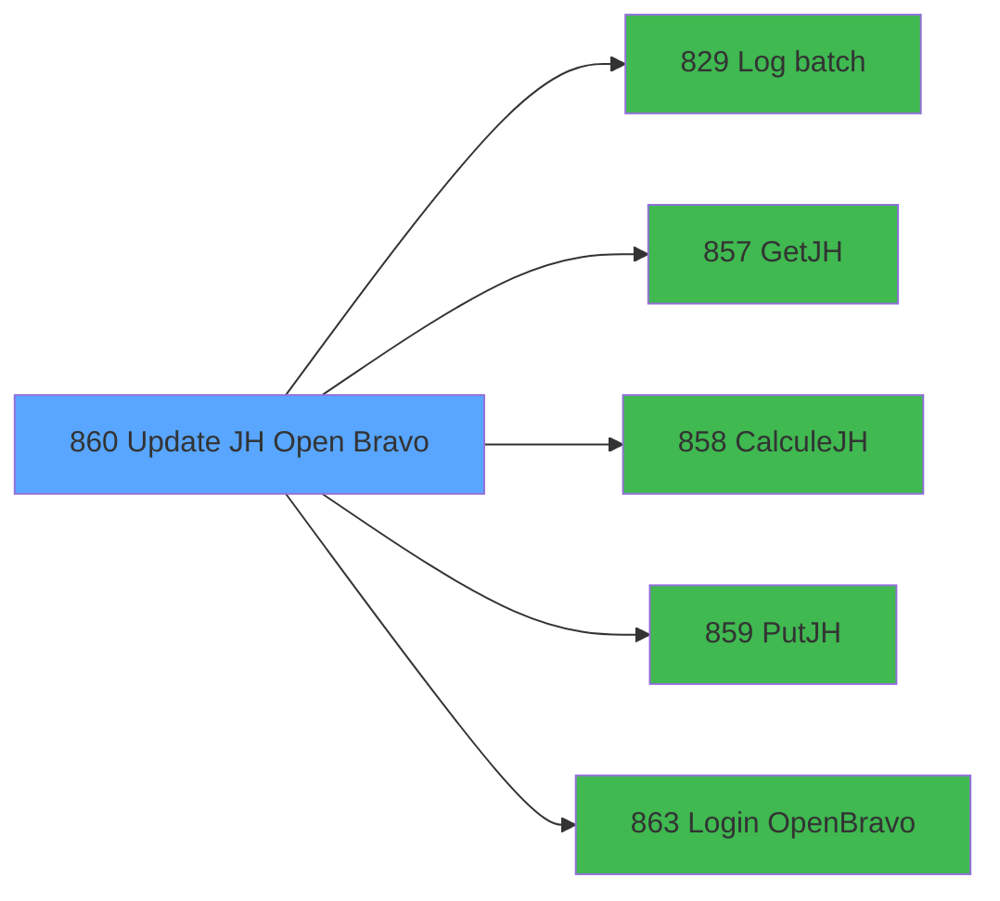

# REF IDE 860 - Update JH Open Bravo

> **Analyse**: Phases 1-4 2026-02-03 14:46 -> 14:47 (13s) | Assemblage 14:47
> **Pipeline**: V7.2 Enrichi
> **Structure**: 4 onglets (Resume | Ecrans | Donnees | Connexions)

<!-- TAB:Resume -->

## 1. FICHE D'IDENTITE

| Attribut | Valeur |
|----------|--------|
| Projet | REF |
| IDE Position | 860 |
| Nom Programme | Update JH Open Bravo |
| Fichier source | `Prg_860.xml` |
| Dossier IDE | General |
| Taches | 2 (0 ecrans visibles) |
| Tables modifiees | 0 |
| Programmes appeles | 5 |

## 2. DESCRIPTION FONCTIONNELLE

**Update JH Open Bravo** assure la gestion complete de ce processus, accessible depuis [Calcul effectif quotidien(TRA) (IDE 623)](REF-IDE-623.md), [Calc effectif quotidien PMS618 (IDE 624)](REF-IDE-624.md), [OpenBravo Params (IDE 862)](REF-IDE-862.md).

Le flux de traitement s'organise en **1 blocs fonctionnels** :

- **Traitement** (2 taches) : traitements metier divers

## 3. BLOCS FONCTIONNELS

### 3.1 Traitement (2 taches)

Traitements internes.

---

#### 860 - Update JH Open Bravo

**Role** : Traitement : Update JH Open Bravo.
**Variables liees** : G (v.Id batch OpenBravo)
**Delegue a** : [Log batch (IDE 829)](REF-IDE-829.md), [GetJH (IDE 857)](REF-IDE-857.md), [PutJH (IDE 859)](REF-IDE-859.md)

---

#### 860.1 - Update JH Open Bravo

**Role** : Traitement : Update JH Open Bravo.
**Variables liees** : G (v.Id batch OpenBravo)
**Delegue a** : [Log batch (IDE 829)](REF-IDE-829.md), [GetJH (IDE 857)](REF-IDE-857.md), [PutJH (IDE 859)](REF-IDE-859.md)

## 5. REGLES METIER

*(Aucune regle metier identifiee)*

## 6. CONTEXTE

- **Appele par**: [Calcul effectif quotidien(TRA) (IDE 623)](REF-IDE-623.md), [Calc effectif quotidien PMS618 (IDE 624)](REF-IDE-624.md), [OpenBravo Params (IDE 862)](REF-IDE-862.md)
- **Appelle**: 5 programmes | **Tables**: 1 (W:0 R:1 L:0) | **Taches**: 2 | **Expressions**: 8

<!-- TAB:Ecrans -->

## 8. ECRANS

*(Programme sans ecran visible)*

## 9. NAVIGATION

### 9.3 Structure hierarchique (2 taches)

| Position | Tache | Type | Dimensions | Bloc |
|----------|-------|------|------------|------|
| **860.1** | [**Update JH Open Bravo** (860)](#t1) | - | - | Traitement |
| 860.1.1 | [Update JH Open Bravo (860.1)](#t2) | - | - | |

### 9.4 Algorigramme

> **Legende**: Vert = START/END OK | Rouge = END KO | Bleu = Decisions
> *Algorigramme auto-genere. Utiliser `/algorigramme` pour une synthese metier detaillee.*

<!-- TAB:Donnees -->

## 10. TABLES

### Tables utilisees (1)

| ID | Nom | Description | Type | R | W | L | Usages |
|----|-----|-------------|------|---|---|---|--------|
| 921 | log_batch |  | DB | R |   |   | 1 |

### Colonnes par table (1 / 1 tables avec colonnes identifiees)

Table 921 - log_batch (R) - 1 usages

| Lettre | Variable | Acces | Type |
|--------|----------|-------|------|
| A | p.i.DateJH | R | Date |
| B | v.Erreur paramètre remontée ajd | R | Logical |

## 11. VARIABLES

### 11.1 Parametres entrants (1)

Variables recues du programme appelant ([Calcul effectif quotidien(TRA) (IDE 623)](REF-IDE-623.md)).

| Lettre | Nom | Type | Usage dans |
|--------|-----|------|-----------|
| A | p.i.DateJH | Date | - |

### 11.2 Variables de session (7)

Variables persistantes pendant toute la session.

| Lettre | Nom | Type | Usage dans |
|--------|-----|------|-----------|
| B | v.Erreur paramètre remontée ajd | Logical | - |
| C | v.Organization (village) | Unicode | - |
| D | v.HotelDays JH | Numeric | - |
| E | v.Identifier (ligne) | Unicode | 1x session |
| F | v.NbrJH PMS | Numeric | - |
| G | v.Id batch OpenBravo | Numeric | - |
| H | v.Statut appel WS | Unicode | - |

## 12. EXPRESSIONS

**8 / 8 expressions decodees (100%)**

### 12.1 Repartition par type

| Type | Expressions | Regles |
|------|-------------|--------|
| CONSTANTE | 3 | 0 |
| FORMAT | 1 | 0 |
| REFERENCE_VG | 1 | 0 |
| CONDITION | 1 | 0 |
| OTHER | 1 | 0 |
| NEGATION | 1 | 0 |

### 12.2 Expressions cles par type

#### CONSTANTE (3 expressions)

| Type | IDE | Expression | Regle |
|------|-----|------------|-------|
| CONSTANTE | 6 | `'ERR'` | - |
| CONSTANTE | 4 | `'Parameters'` | - |
| CONSTANTE | 3 | `'PMS_TO_OPENBRAVO'` | - |

#### FORMAT (1 expressions)

| Type | IDE | Expression | Regle |
|------|-----|------------|-------|
| FORMAT | 7 | `'OBJH~' &DStr(Date(), 'YYYYMMDD')` | - |

#### REFERENCE_VG (1 expressions)

| Type | IDE | Expression | Regle |
|------|-----|------------|-------|
| REFERENCE_VG | 1 | `VG34` | - |

#### CONDITION (1 expressions)

| Type | IDE | Expression | Regle |
|------|-----|------------|-------|
| CONDITION | 2 | `VG39<>'' AND VG36<>''` | - |

#### OTHER (1 expressions)

| Type | IDE | Expression | Regle |
|------|-----|------------|-------|
| OTHER | 5 | `'OpenBravo parameters for HD update aren''t set up'` | - |

#### NEGATION (1 expressions)

| Type | IDE | Expression | Regle |
|------|-----|------------|-------|
| NEGATION | 8 | `NOT v.Identifier (ligne) [E]` | - |

<!-- TAB:Connexions -->

## 13. GRAPHE D'APPELS

### 13.1 Chaine depuis Main (Callers)

Main -> ... -> [Calcul effectif quotidien(TRA) (IDE 623)](REF-IDE-623.md) -> **Update JH Open Bravo (IDE 860)**

Main -> ... -> [Calc effectif quotidien PMS618 (IDE 624)](REF-IDE-624.md) -> **Update JH Open Bravo (IDE 860)**

Main -> ... -> [OpenBravo Params (IDE 862)](REF-IDE-862.md) -> **Update JH Open Bravo (IDE 860)**

### 13.2 Callers

| IDE | Nom Programme | Nb Appels |
|-----|---------------|-----------|
| [623](REF-IDE-623.md) | Calcul effectif quotidien(TRA) | 1 |
| [624](REF-IDE-624.md) | Calc effectif quotidien PMS618 | 1 |
| [862](REF-IDE-862.md) | OpenBravo Params | 1 |

### 13.3 Callees (programmes appeles)

### 13.4 Detail Callees avec contexte

| IDE | Nom Programme | Appels | Contexte |
|-----|---------------|--------|----------|
| [829](REF-IDE-829.md) | Log batch | 3 | Sous-programme |
| [857](REF-IDE-857.md) | GetJH | 1 | Recuperation donnees |
| [858](REF-IDE-858.md) | CalculeJH | 1 | Calcul de donnees |
| [859](REF-IDE-859.md) | PutJH | 1 | Sous-programme |
| [863](REF-IDE-863.md) | Login OpenBravo | 1 | Ouverture session |

## 14. RECOMMANDATIONS MIGRATION

### 14.1 Profil du programme

| Metrique | Valeur | Impact migration |
|----------|--------|-----------------|
| Lignes de logique | 59 | Programme compact |
| Expressions | 8 | Peu de logique |
| Tables WRITE | 0 | Impact faible |
| Sous-programmes | 5 | Peu de dependances |
| Ecrans visibles | 0 | Ecran unique ou traitement batch |
| Code desactive | 0% (0 / 59) | Code sain |
| Regles metier | 0 | Pas de regle identifiee |

### 14.2 Plan de migration par bloc

#### Traitement (2 taches: 0 ecran, 2 traitements)

- **Strategie** : 2 service(s) backend injectable(s) (Domain Services).
- 5 sous-programme(s) a migrer ou a reutiliser depuis les services existants.
- Decomposer les taches en services unitaires testables.

### 14.3 Dependances critiques

| Dependance | Type | Appels | Impact |
|------------|------|--------|--------|
| [Log batch (IDE 829)](REF-IDE-829.md) | Sous-programme | 3x | **CRITIQUE** - Sous-programme |
| [PutJH (IDE 859)](REF-IDE-859.md) | Sous-programme | 1x | Normale - Sous-programme |
| [Login OpenBravo (IDE 863)](REF-IDE-863.md) | Sous-programme | 1x | Normale - Ouverture session |
| [GetJH (IDE 857)](REF-IDE-857.md) | Sous-programme | 1x | Normale - Recuperation donnees |
| [CalculeJH (IDE 858)](REF-IDE-858.md) | Sous-programme | 1x | Normale - Calcul de donnees |

---
*Spec DETAILED generee par Pipeline V7.2 - 2026-02-03 14:47*
