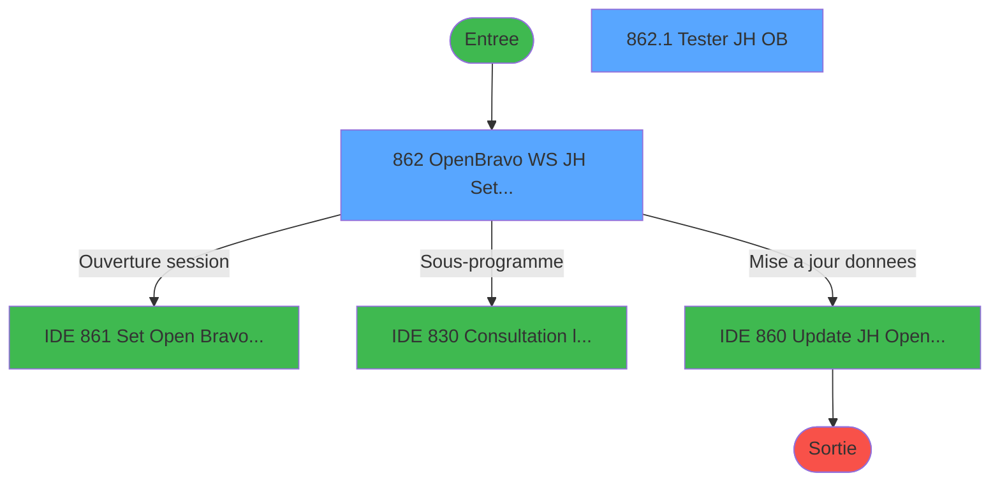
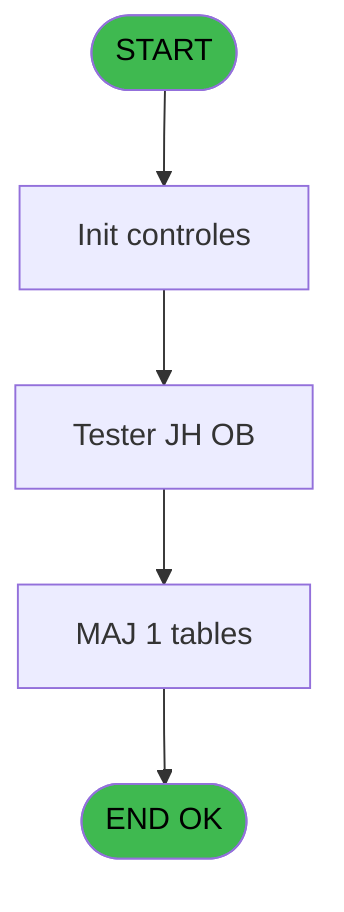
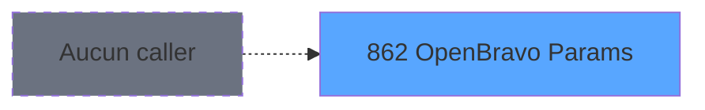
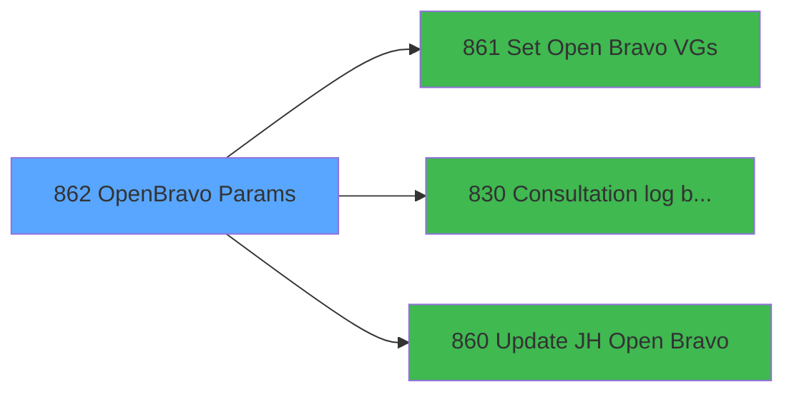

# REF IDE 862 - OpenBravo Params

> **Analyse**: Phases 1-4 2026-02-03 14:47 -> 14:47 (13s) | Assemblage 14:47
> **Pipeline**: V7.2 Enrichi
> **Structure**: 4 onglets (Resume | Ecrans | Donnees | Connexions)

<!-- TAB:Resume -->

## 1. FICHE D'IDENTITE

| Attribut | Valeur |
|----------|--------|
| Projet | REF |
| IDE Position | 862 |
| Nom Programme | OpenBravo Params |
| Fichier source | `Prg_862.xml` |
| Dossier IDE | General |
| Taches | 2 (2 ecrans visibles) |
| Tables modifiees | 1 |
| Programmes appeles | 3 |
| :warning: Statut | **ORPHELIN_POTENTIEL** |

## 2. DESCRIPTION FONCTIONNELLE

**OpenBravo Params** assure la gestion complete de ce processus.

Le flux de traitement s'organise en **1 blocs fonctionnels** :

- **Traitement** (2 taches) : traitements metier divers

**Donnees modifiees** : 1 tables en ecriture (pms_village).

## 3. BLOCS FONCTIONNELS

### 3.1 Traitement (2 taches)

Traitements internes.

---

#### 862 - OpenBravo WS JH Settings [[ECRAN]](#ecran-t1)

**Role** : Traitement : OpenBravo WS JH Settings.
**Ecran** : 537 x 276 DLU | [Voir mockup](#ecran-t1)
**Delegue a** : [Set Open Bravo VGs (IDE 861)](REF-IDE-861.md), [Consultation log batch (IDE 830)](REF-IDE-830.md), [Update JH Open Bravo (IDE 860)](REF-IDE-860.md)

---

#### 862.1 - Tester JH OB [[ECRAN]](#ecran-t2)

**Role** : Verification : Tester JH OB.
**Ecran** : 383 x 103 DLU (Type6) | [Voir mockup](#ecran-t2)
**Delegue a** : [Set Open Bravo VGs (IDE 861)](REF-IDE-861.md), [Consultation log batch (IDE 830)](REF-IDE-830.md), [Update JH Open Bravo (IDE 860)](REF-IDE-860.md)

## 5. REGLES METIER

*(Aucune regle metier identifiee)*

## 6. CONTEXTE

- **Appele par**: (aucun)
- **Appelle**: 3 programmes | **Tables**: 2 (W:1 R:0 L:1) | **Taches**: 2 | **Expressions**: 2

<!-- TAB:Ecrans -->

## 8. ECRANS

### 8.1 Forms visibles (2 / 2)

| # | Position | Tache | Nom | Type | Largeur | Hauteur | Bloc |
|---|----------|-------|-----|------|---------|---------|------|
| 1 | 862 | 862 | OpenBravo WS JH Settings | Type0 | 537 | 276 | Traitement |
| 2 | 862.1 | 862.1 | Tester JH OB | Type6 | 383 | 103 | Traitement |

### 8.2 Mockups Ecrans

---

#### 862 - OpenBravo WS JH Settings
**Tache** : [862](#t1) | **Type** : Type0 | **Dimensions** : 537 x 276 DLU
**Bloc** : Traitement | **Titre IDE** : OpenBravo WS JH Settings

<!-- FORM-DATA:
{
    "width":  537,
    "vFactor":  8,
    "type":  "Type0",
    "hFactor":  4,
    "controls":  [
                     {
                         "x":  144,
                         "type":  "label",
                         "var":  "",
                         "y":  4,
                         "w":  248,
                         "fmt":  "",
                         "name":  "",
                         "h":  25,
                         "color":  "48",
                         "text":  "IOB project is not activated",
                         "parent":  null
                     },
                     {
                         "x":  6,
                         "type":  "label",
                         "var":  "",
                         "y":  32,
                         "w":  529,
                         "fmt":  "",
                         "name":  "",
                         "h":  120,
                         "color":  "",
                         "text":  "Athentification",
                         "parent":  null
                     },
                     {
                         "x":  21,
                         "type":  "label",
                         "var":  "",
                         "y":  60,
                         "w":  44,
                         "fmt":  "",
                         "name":  "",
                         "h":  9,
                         "color":  "",
                         "text":  "API Url",
                         "parent":  2
                     },
                     {
                         "x":  21,
                         "type":  "label",
                         "var":  "",
                         "y":  81,
                         "w":  64,
                         "fmt":  "",
                         "name":  "",
                         "h":  9,
                         "color":  "",
                         "text":  "Proxy Adress",
                         "parent":  2
                     },
                     {
                         "x":  21,
                         "type":  "label",
                         "var":  "",
                         "y":  102,
                         "w":  44,
                         "fmt":  "",
                         "name":  "",
                         "h":  9,
                         "color":  "",
                         "text":  "User Name",
                         "parent":  2
                     },
                     {
                         "x":  21,
                         "type":  "label",
                         "var":  "",
                         "y":  123,
                         "w":  38,
                         "fmt":  "",
                         "name":  "",
                         "h":  9,
                         "color":  "",
                         "text":  "Password",
                         "parent":  2
                     },
                     {
                         "x":  6,
                         "type":  "label",
                         "var":  "",
                         "y":  158,
                         "w":  529,
                         "fmt":  "",
                         "name":  "",
                         "h":  40,
                         "color":  "",
                         "text":  "Alerts",
                         "parent":  null
                     },
                     {
                         "x":  21,
                         "type":  "label",
                         "var":  "",
                         "y":  176,
                         "w":  22,
                         "fmt":  "",
                         "name":  "",
                         "h":  9,
                         "color":  "",
                         "text":  "Email",
                         "parent":  11
                     },
                     {
                         "x":  6,
                         "type":  "label",
                         "var":  "",
                         "y":  206,
                         "w":  529,
                         "fmt":  "",
                         "name":  "",
                         "h":  40,
                         "color":  "",
                         "text":  "Mono boutique",
                         "parent":  null
                     },
                     {
                         "x":  21,
                         "type":  "label",
                         "var":  "",
                         "y":  224,
                         "w":  34,
                         "fmt":  "",
                         "name":  "",
                         "h":  9,
                         "color":  "",
                         "text":  "Code",
                         "parent":  14
                     },
                     {
                         "x":  92,
                         "type":  "edit",
                         "var":  "",
                         "y":  60,
                         "w":  289,
                         "fmt":  "",
                         "name":  "wop_url_api",
                         "h":  10,
                         "color":  "",
                         "text":  "",
                         "parent":  2
                     },
                     {
                         "x":  92,
                         "type":  "edit",
                         "var":  "",
                         "y":  81,
                         "w":  289,
                         "fmt":  "",
                         "name":  "wop_proxy_adress",
                         "h":  10,
                         "color":  "",
                         "text":  "",
                         "parent":  2
                     },
                     {
                         "x":  92,
                         "type":  "edit",
                         "var":  "",
                         "y":  102,
                         "w":  289,
                         "fmt":  "",
                         "name":  "wop_username",
                         "h":  10,
                         "color":  "",
                         "text":  "",
                         "parent":  2
                     },
                     {
                         "x":  92,
                         "type":  "edit",
                         "var":  "",
                         "y":  123,
                         "w":  289,
                         "fmt":  "",
                         "name":  "wop_password",
                         "h":  10,
                         "color":  "",
                         "text":  "",
                         "parent":  2
                     },
                     {
                         "x":  92,
                         "type":  "edit",
                         "var":  "",
                         "y":  176,
                         "w":  289,
                         "fmt":  "",
                         "name":  "wop_email_alert",
                         "h":  10,
                         "color":  "",
                         "text":  "",
                         "parent":  11
                     },
                     {
                         "x":  92,
                         "type":  "edit",
                         "var":  "",
                         "y":  224,
                         "w":  57,
                         "fmt":  "",
                         "name":  "wop_mono_store_code_0001",
                         "h":  10,
                         "color":  "",
                         "text":  "",
                         "parent":  14
                     },
                     {
                         "x":  6,
                         "type":  "button",
                         "var":  "",
                         "y":  255,
                         "w":  80,
                         "fmt":  "Tester",
                         "name":  "",
                         "h":  18,
                         "color":  "",
                         "text":  "",
                         "parent":  null
                     },
                     {
                         "x":  366,
                         "type":  "button",
                         "var":  "",
                         "y":  255,
                         "w":  80,
                         "fmt":  "Valider",
                         "name":  "",
                         "h":  18,
                         "color":  "",
                         "text":  "",
                         "parent":  null
                     },
                     {
                         "x":  453,
                         "type":  "button",
                         "var":  "",
                         "y":  255,
                         "w":  80,
                         "fmt":  "Quitter",
                         "name":  "",
                         "h":  18,
                         "color":  "",
                         "text":  "",
                         "parent":  null
                     }
                 ],
    "taskId":  "862",
    "height":  276
}
-->

<strong>Champs : 6 champs</strong>

| Pos (x,y) | Nom | Variable | Type |
|-----------|-----|----------|------|
| 92,60 | wop_url_api | - | edit |
| 92,81 | wop_proxy_adress | - | edit |
| 92,102 | wop_username | - | edit |
| 92,123 | wop_password | - | edit |
| 92,176 | wop_email_alert | - | edit |
| 92,224 | wop_mono_store_code_0001 | - | edit |

<strong>Boutons : 3 boutons</strong>

| Bouton | Pos (x,y) | Action |
|--------|-----------|--------|
| Tester | 6,255 | Bouton fonctionnel |
| Valider | 366,255 | Valide la saisie et enregistre |
| Quitter | 453,255 | Quitte le programme |

---

#### 862.1 - Tester JH OB
**Tache** : [862.1](#t2) | **Type** : Type6 | **Dimensions** : 383 x 103 DLU
**Bloc** : Traitement | **Titre IDE** : Tester JH OB

<!-- FORM-DATA:
{
    "width":  383,
    "vFactor":  8,
    "type":  "Type6",
    "hFactor":  4,
    "controls":  [
                     {
                         "x":  135,
                         "type":  "label",
                         "var":  "",
                         "y":  36,
                         "w":  31,
                         "fmt":  "",
                         "name":  "",
                         "h":  9,
                         "color":  "",
                         "text":  "Date :",
                         "parent":  null
                     },
                     {
                         "x":  162,
                         "type":  "edit",
                         "var":  "",
                         "y":  36,
                         "w":  85,
                         "fmt":  "",
                         "name":  "v.DateJ",
                         "h":  10,
                         "color":  "",
                         "text":  "",
                         "parent":  null
                     },
                     {
                         "x":  88,
                         "type":  "button",
                         "var":  "",
                         "y":  65,
                         "w":  87,
                         "fmt":  "Lancer le test",
                         "name":  "",
                         "h":  14,
                         "color":  "",
                         "text":  "",
                         "parent":  null
                     },
                     {
                         "x":  207,
                         "type":  "button",
                         "var":  "",
                         "y":  65,
                         "w":  87,
                         "fmt":  "Quitter",
                         "name":  "",
                         "h":  14,
                         "color":  "",
                         "text":  "",
                         "parent":  null
                     }
                 ],
    "taskId":  "862.1",
    "height":  103
}
-->

<strong>Champs : 1 champs</strong>

| Pos (x,y) | Nom | Variable | Type |
|-----------|-----|----------|------|
| 162,36 | v.DateJ | - | edit |

<strong>Boutons : 2 boutons</strong>

| Bouton | Pos (x,y) | Action |
|--------|-----------|--------|
| Lancer le test | 88,65 | Bouton fonctionnel |
| Quitter | 207,65 | Quitte le programme |

## 9. NAVIGATION

### 9.1 Enchainement des ecrans

**Detail par enchainement :**

| Depuis | Action | Vers | Retour |
|--------|--------|------|--------|
| OpenBravo WS JH Settings | Ouverture session | [Set Open Bravo VGs (IDE 861)](REF-IDE-861.md) | Retour ecran |
| OpenBravo WS JH Settings | Sous-programme | [Consultation log batch (IDE 830)](REF-IDE-830.md) | Retour ecran |
| OpenBravo WS JH Settings | Mise a jour donnees | [Update JH Open Bravo (IDE 860)](REF-IDE-860.md) | Retour ecran |

### 9.3 Structure hierarchique (2 taches)

| Position | Tache | Type | Dimensions | Bloc |
|----------|-------|------|------------|------|
| **862.1** | [**OpenBravo WS JH Settings** (862)](#t1) [mockup](#ecran-t1) | - | 537x276 | Traitement |
| 862.1.1 | [Tester JH OB (862.1)](#t2) [mockup](#ecran-t2) | Type6 | 383x103 | |

### 9.4 Algorigramme

> **Legende**: Vert = START/END OK | Rouge = END KO | Bleu = Decisions
> *Algorigramme auto-genere. Utiliser `/algorigramme` pour une synthese metier detaillee.*

<!-- TAB:Donnees -->

## 10. TABLES

### Tables utilisees (2)

| ID | Nom | Description | Type | R | W | L | Usages |
|----|-----|-------------|------|---|---|---|--------|
| 368 | pms_village |  | DB |   | **W** |   | 1 |
| 919 | Table_919 |  | MEM |   |   | L | 1 |

### Colonnes par table (0 / 1 tables avec colonnes identifiees)

Table 368 - pms_village (**W**) - 1 usages

*Table utilisee uniquement en Link ou aucune colonne Real identifiee dans le DataView.*

## 11. VARIABLES

### 11.1 Variables de session (2)

Variables persistantes pendant toute la session.

| Lettre | Nom | Type | Usage dans |
|--------|-----|------|-----------|
| A | v.DateJ | Date | 1x session |
| B | v.ConfirmeOpenLogs | Numeric | - |

## 12. EXPRESSIONS

**2 / 2 expressions decodees (100%)**

### 12.1 Repartition par type

| Type | Expressions | Regles |
|------|-------------|--------|
| OTHER | 1 | 0 |
| NEGATION | 1 | 0 |

### 12.2 Expressions cles par type

#### OTHER (1 expressions)

| Type | IDE | Expression | Regle |
|------|-----|------------|-------|
| OTHER | 1 | `v.DateJ [A]` | - |

#### NEGATION (1 expressions)

| Type | IDE | Expression | Regle |
|------|-----|------------|-------|
| NEGATION | 2 | `NOT VG34` | - |

<!-- TAB:Connexions -->

## 13. GRAPHE D'APPELS

### 13.1 Chaine depuis Main (Callers)

**Chemin**: (pas de callers directs)

### 13.2 Callers

| IDE | Nom Programme | Nb Appels |
|-----|---------------|-----------|
| - | (aucun) | - |

### 13.3 Callees (programmes appeles)

### 13.4 Detail Callees avec contexte

| IDE | Nom Programme | Appels | Contexte |
|-----|---------------|--------|----------|
| [861](REF-IDE-861.md) | Set Open Bravo VGs | 2 | Ouverture session |
| [830](REF-IDE-830.md) | Consultation log batch | 1 | Sous-programme |
| [860](REF-IDE-860.md) | Update JH Open Bravo | 1 | Mise a jour donnees |

## 14. RECOMMANDATIONS MIGRATION

### 14.1 Profil du programme

| Metrique | Valeur | Impact migration |
|----------|--------|-----------------|
| Lignes de logique | 26 | Programme compact |
| Expressions | 2 | Peu de logique |
| Tables WRITE | 1 | Impact faible |
| Sous-programmes | 3 | Peu de dependances |
| Ecrans visibles | 2 | Quelques ecrans |
| Code desactive | 0% (0 / 26) | Code sain |
| Regles metier | 0 | Pas de regle identifiee |

### 14.2 Plan de migration par bloc

#### Traitement (2 taches: 2 ecrans, 0 traitement)

- **Strategie** : 2 composant(s) UI (Razor/React) avec formulaires et validation.
- 3 sous-programme(s) a migrer ou a reutiliser depuis les services existants.
- Decomposer les taches en services unitaires testables.

### 14.3 Dependances critiques

| Dependance | Type | Appels | Impact |
|------------|------|--------|--------|
| pms_village | Table WRITE (Database) | 1x | Schema + repository |
| [Set Open Bravo VGs (IDE 861)](REF-IDE-861.md) | Sous-programme | 2x | Haute - Ouverture session |
| [Update JH Open Bravo (IDE 860)](REF-IDE-860.md) | Sous-programme | 1x | Normale - Mise a jour donnees |
| [Consultation log batch (IDE 830)](REF-IDE-830.md) | Sous-programme | 1x | Normale - Sous-programme |

---
*Spec DETAILED generee par Pipeline V7.2 - 2026-02-03 14:47*
