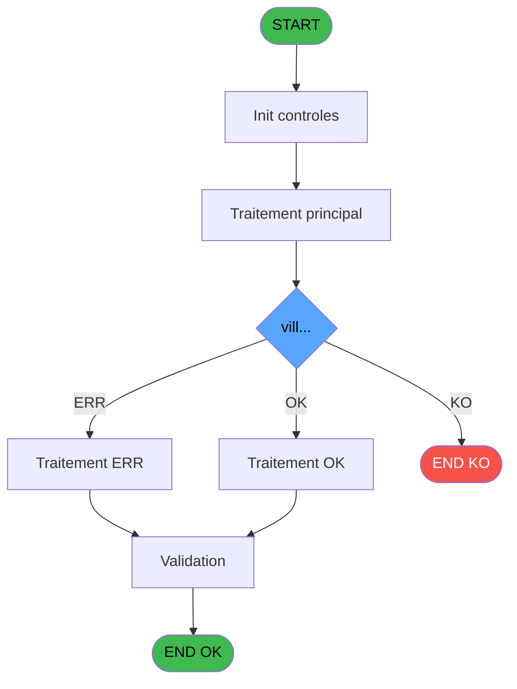
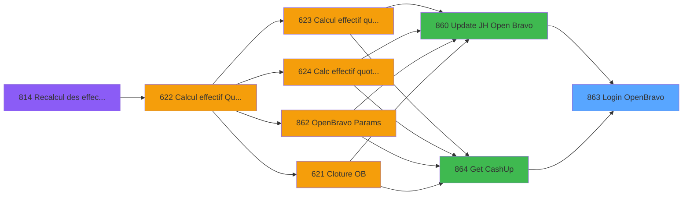
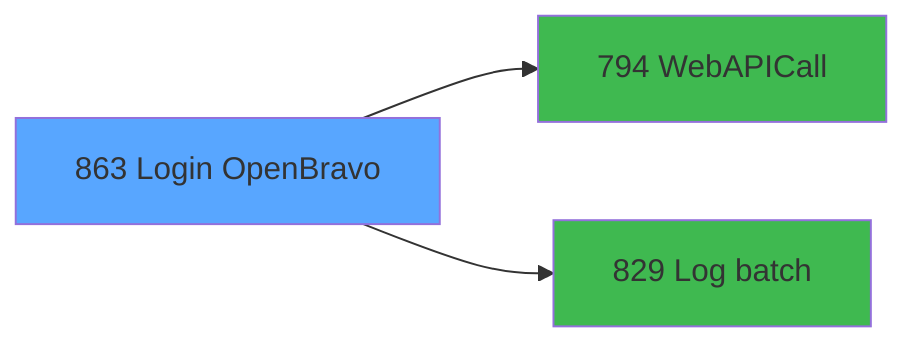

# REF IDE 863 - Login OpenBravo

> **Analyse**: Phases 1-4 2026-02-03 14:47 -> 14:48 (13s) | Assemblage 14:48
> **Pipeline**: V7.2 Enrichi
> **Structure**: 4 onglets (Resume | Ecrans | Donnees | Connexions)

<!-- TAB:Resume -->

## 1. FICHE D'IDENTITE

| Attribut | Valeur |
|----------|--------|
| Projet | REF |
| IDE Position | 863 |
| Nom Programme | Login OpenBravo |
| Fichier source | `Prg_863.xml` |
| Dossier IDE | General |
| Taches | 2 (0 ecrans visibles) |
| Tables modifiees | 0 |
| Programmes appeles | 2 |

## 2. DESCRIPTION FONCTIONNELLE

**Login OpenBravo** assure la gestion complete de ce processus, accessible depuis [Update JH Open Bravo (IDE 860)](REF-IDE-860.md), [Get CashUp (IDE 864)](REF-IDE-864.md).

Le flux de traitement s'organise en **1 blocs fonctionnels** :

- **Traitement** (2 taches) : traitements metier divers

**Logique metier** : 4 regles identifiees couvrant conditions metier, valeurs par defaut.

## 3. BLOCS FONCTIONNELS

### 3.1 Traitement (2 taches)

Traitements internes.

---

#### 863 - Login OpenBravo

**Role** : Traitement : Login OpenBravo.
**Delegue a** : [WebAPICall (IDE 794)](REF-IDE-794.md), [Log batch (IDE 829)](REF-IDE-829.md)

---

#### 863.1 - ExtractDataFromXML

**Role** : Traitement : ExtractDataFromXML.
**Delegue a** : [WebAPICall (IDE 794)](REF-IDE-794.md), [Log batch (IDE 829)](REF-IDE-829.md)

## 5. REGLES METIER

4 regles identifiees:

### Autres (4 regles)

#### [RM-001] Valeur par defaut si v.IsSuccess [M] est vide

| Element | Detail |
|---------|--------|
| **Condition** | `v.IsSuccess [M]=''` |
| **Si vrai** | IF(p.o.Organization (vill... [D]='' |
| **Si faux** | 'ERR', 'OK'), 'ERR') |
| **Variables** | M (v.IsSuccess) |
| **Expression source** | Expression 12 : `IF(v.IsSuccess [M]='', IF(p.o.Organization (vill... [D]='', ` |
| **Exemple** | Si v.IsSuccess [M]='' → IF(p.o.Organization (vill... [D]=''. Sinon → 'ERR', 'OK'), 'ERR') |

#### [RM-002] Valeur par defaut si v.IsSuccess [M]<>'', v.IsSuccess [M], IF(p.o.Organization (vill... [D] est vide

| Element | Detail |
|---------|--------|
| **Condition** | `v.IsSuccess [M]<>''` |
| **Si vrai** | v.IsSuccess [M] |
| **Si faux** | IF(p.o.Organization (vill... [D]='', 'Orgnization (resort) not found', StrBuild('Organisation @1@', p.o.Organization (vill... [D]))) |
| **Variables** | M (v.IsSuccess) |
| **Expression source** | Expression 13 : `IF(v.IsSuccess [M]<>'', v.IsSuccess [M], IF(p.o.Organization` |
| **Exemple** | Si v.IsSuccess [M]<>'' → v.IsSuccess [M] |

#### [RM-003] Traitement si VG41 est renseigne

| Element | Detail |
|---------|--------|
| **Condition** | `VG41<>''` |
| **Si vrai** | VG41 |
| **Si faux** | IF(v.Code lieu de séjour [Q]<>'', v.Code lieu de séjour [Q], [S])) |
| **Variables** | Q (v.Code lieu de séjour) |
| **Expression source** | Expression 15 : `IF(VG41<>'', VG41, IF(v.Code lieu de séjour [Q]<>'', v.Code ` |
| **Exemple** | Si VG41<>'' → VG41 |

#### [RM-004] Si [Y] alors NULL() sinon v.ErrorMessage [N])

| Element | Detail |
|---------|--------|
| **Condition** | `[Y]` |
| **Si vrai** | NULL() |
| **Si faux** | v.ErrorMessage [N]) |
| **Variables** | N (v.ErrorMessage) |
| **Expression source** | Expression 20 : `IF([Y], NULL(), v.ErrorMessage [N])` |
| **Exemple** | Si [Y] → NULL(). Sinon → v.ErrorMessage [N]) |

## 6. CONTEXTE

- **Appele par**: [Update JH Open Bravo (IDE 860)](REF-IDE-860.md), [Get CashUp (IDE 864)](REF-IDE-864.md)
- **Appelle**: 2 programmes | **Tables**: 2 (W:0 R:1 L:1) | **Taches**: 2 | **Expressions**: 21

<!-- TAB:Ecrans -->

## 8. ECRANS

*(Programme sans ecran visible)*

## 9. NAVIGATION

### 9.3 Structure hierarchique (2 taches)

| Position | Tache | Type | Dimensions | Bloc |
|----------|-------|------|------------|------|
| **863.1** | [**Login OpenBravo** (863)](#t1) | - | - | Traitement |
| 863.1.1 | [ExtractDataFromXML (863.1)](#t2) | - | - | |

### 9.4 Algorigramme

> **Legende**: Vert = START/END OK | Rouge = END KO | Bleu = Decisions
> *Algorigramme auto-genere. Utiliser `/algorigramme` pour une synthese metier detaillee.*

<!-- TAB:Donnees -->

## 10. TABLES

### Tables utilisees (2)

| ID | Nom | Description | Type | R | W | L | Usages |
|----|-----|-------------|------|---|---|---|--------|
| 118 | tables_imports |  | DB | R |   |   | 1 |
| 921 | log_batch |  | DB |   |   | L | 1 |

### Colonnes par table (2 / 1 tables avec colonnes identifiees)

Table 118 - tables_imports (R) - 1 usages

| Lettre | Variable | Acces | Type |
|--------|----------|-------|------|
| E | p.o.XMLResponse | R | Blob |
| F | p.o.JsoneResponse | R | Blob |
| K | v.JsonIn | R | Blob |
| O | v.JsonResponse | R | Blob |
| P | v.XmlResponse | R | Blob |

## 11. VARIABLES

### 11.1 Parametres entrants (8)

Variables recues du programme appelant ([Update JH Open Bravo (IDE 860)](REF-IDE-860.md)).

| Lettre | Nom | Type | Usage dans |
|--------|-----|------|-----------|
| A | p.i.Lieux de séjour | Unicode | 3x parametre entrant |
| B | p.i.Id batch père | Numeric | 1x parametre entrant |
| C | p.o.Client (club med) | Unicode | - |
| D | p.o.Organization (village) | Unicode | - |
| E | p.o.XMLResponse | Blob | - |
| F | p.o.JsoneResponse | Blob | - |
| G | p.o.Statut | Unicode | - |
| H | p.o OrganizationName | Unicode | 1x parametre entrant |

### 11.2 Variables de session (10)

Variables persistantes pendant toute la session.

| Lettre | Nom | Type | Usage dans |
|--------|-----|------|-----------|
| I | v.UrlApi | Unicode | - |
| J | v.RequestType | Unicode | - |
| K | v.JsonIn | Blob | - |
| L | v.ProxyAdress | Unicode | - |
| M | v.IsSuccess | Logical | 2x session |
| N | v.ErrorMessage | Unicode | 3x session |
| O | v.JsonResponse | Blob | 1x session |
| P | v.XmlResponse | Blob | - |
| Q | v.Code lieu de séjour | Unicode | 1x session |
| R | v.Logon OK aujourd'hui | Logical | - |

Toutes les 18 variables (liste complete)

| Cat | Lettre | Nom Variable | Type |
|-----|--------|--------------|------|
| P0 | **A** | p.i.Lieux de séjour | Unicode |
| P0 | **B** | p.i.Id batch père | Numeric |
| P0 | **C** | p.o.Client (club med) | Unicode |
| P0 | **D** | p.o.Organization (village) | Unicode |
| P0 | **E** | p.o.XMLResponse | Blob |
| P0 | **F** | p.o.JsoneResponse | Blob |
| P0 | **G** | p.o.Statut | Unicode |
| P0 | **H** | p.o OrganizationName | Unicode |
| V. | **I** | v.UrlApi | Unicode |
| V. | **J** | v.RequestType | Unicode |
| V. | **K** | v.JsonIn | Blob |
| V. | **L** | v.ProxyAdress | Unicode |
| V. | **M** | v.IsSuccess | Logical |
| V. | **N** | v.ErrorMessage | Unicode |
| V. | **O** | v.JsonResponse | Blob |
| V. | **P** | v.XmlResponse | Blob |
| V. | **Q** | v.Code lieu de séjour | Unicode |
| V. | **R** | v.Logon OK aujourd'hui | Logical |

## 12. EXPRESSIONS

**21 / 21 expressions decodees (100%)**

### 12.1 Repartition par type

| Type | Expressions | Regles |
|------|-------------|--------|
| CONCATENATION | 2 | 0 |
| CONDITION | 6 | 4 |
| CONSTANTE | 6 | 0 |
| FORMAT | 1 | 0 |
| OTHER | 5 | 0 |
| STRING | 1 | 0 |

### 12.2 Expressions cles par type

#### CONCATENATION (2 expressions)

| Type | IDE | Expression | Regle |
|------|-----|------------|-------|
| CONCATENATION | 5 | `'<?xml version="1.0" encoding="UTF-8"?>' &
ASCIIChr(13)& ASCIIChr(10)&
DotNet.System.Xml.Linq.XElement.Load(
  DotNet.System.Runtime.Serialization.Json.JsonReaderWriterFactory.CreateJsonReader( 
     v.ErrorMessage [N],
     DotNet.System.Xml.XmlDictionaryReaderQuotas()
   )
).ToString()` | - |
| CONCATENATION | 2 | `Trim(VG39) & '/Organization?_where=clmdfldCodePms='''&Trim([T])&''''` | - |

#### CONDITION (6 expressions)

| Type | IDE | Expression | Regle |
|------|-----|------------|-------|
| CONDITION | 15 | `IF(VG41<>'', VG41, IF(v.Code lieu de séjour [Q]<>'', v.Code lieu de séjour [Q], [S]))` | [RM-003](#rm-RM-003) |
| CONDITION | 20 | `IF([Y], NULL(), v.ErrorMessage [N])` | [RM-004](#rm-RM-004) |
| CONDITION | 12 | `IF(v.IsSuccess [M]='', IF(p.o.Organization (vill... [D]='', 'ERR', 'OK'), 'ERR')` | [RM-001](#rm-RM-001) |
| CONDITION | 13 | `IF(v.IsSuccess [M]<>'', v.IsSuccess [M], IF(p.o.Organization (vill... [D]='', 'Orgnization (resort) not found', StrBuild('Organisation @1@', p.o.Organization (vill... [D])))` | [RM-002](#rm-RM-002) |
| CONDITION | 10 | `StrBuild('Login @1@ for @2@ (@3@)', VG36, [T], IF(p.i.Lieux de séjour [A]<>'', p.i.Lieux de séjour [A], 'empty'))` | - |
| ... | | *+1 autres* | |

#### CONSTANTE (6 expressions)

| Type | IDE | Expression | Regle |
|------|-----|------------|-------|
| CONSTANTE | 8 | `'PMS_TO_OPENBRAVO'` | - |
| CONSTANTE | 9 | `'Login to Open Bravo'` | - |
| CONSTANTE | 19 | `'OK'` | - |
| CONSTANTE | 1 | `''` | - |
| CONSTANTE | 3 | `'GET'` | - |
| ... | | *+1 autres* | |

#### FORMAT (1 expressions)

| Type | IDE | Expression | Regle |
|------|-----|------------|-------|
| FORMAT | 18 | `p.i.Lieux de séjour [A]& '~'& DStr(Date(), 'YYYY-MM-DD')` | - |

#### OTHER (5 expressions)

| Type | IDE | Expression | Regle |
|------|-----|------------|-------|
| OTHER | 16 | `p.i.Id batch père [B]` | - |
| OTHER | 17 | `v.JsonResponse [O]` | - |
| OTHER | 14 | `p.i.Lieux de séjour [A]` | - |
| OTHER | 6 | `v.ErrorMessage [N]` | - |
| OTHER | 11 | `p.o OrganizationName [H]` | - |

#### STRING (1 expressions)

| Type | IDE | Expression | Regle |
|------|-----|------------|-------|
| STRING | 4 | `Trim(VG40)` | - |

### 12.3 Toutes les expressions (21)

Voir les 21 expressions

#### CONCATENATION (2)

| IDE | Expression Decodee |
|-----|-------------------|
| 2 | `Trim(VG39) & '/Organization?_where=clmdfldCodePms='''&Trim([T])&''''` |
| 5 | `'<?xml version="1.0" encoding="UTF-8"?>' &
ASCIIChr(13)& ASCIIChr(10)&
DotNet.System.Xml.Linq.XElement.Load(
  DotNet.System.Runtime.Serialization.Json.JsonReaderWriterFactory.CreateJsonReader( 
     v.ErrorMessage [N],
     DotNet.System.Xml.XmlDictionaryReaderQuotas()
   )
).ToString()` |

#### CONDITION (6)

| IDE | Expression Decodee |
|-----|-------------------|
| 12 | `IF(v.IsSuccess [M]='', IF(p.o.Organization (vill... [D]='', 'ERR', 'OK'), 'ERR')` |
| 13 | `IF(v.IsSuccess [M]<>'', v.IsSuccess [M], IF(p.o.Organization (vill... [D]='', 'Orgnization (resort) not found', StrBuild('Organisation @1@', p.o.Organization (vill... [D])))` |
| 15 | `IF(VG41<>'', VG41, IF(v.Code lieu de séjour [Q]<>'', v.Code lieu de séjour [Q], [S]))` |
| 20 | `IF([Y], NULL(), v.ErrorMessage [N])` |
| 21 | `IF([Y], '', 'json')` |
| 10 | `StrBuild('Login @1@ for @2@ (@3@)', VG36, [T], IF(p.i.Lieux de séjour [A]<>'', p.i.Lieux de séjour [A], 'empty'))` |

#### CONSTANTE (6)

| IDE | Expression Decodee |
|-----|-------------------|
| 1 | `''` |
| 3 | `'GET'` |
| 7 | `'G'` |
| 8 | `'PMS_TO_OPENBRAVO'` |
| 9 | `'Login to Open Bravo'` |
| 19 | `'OK'` |

#### FORMAT (1)

| IDE | Expression Decodee |
|-----|-------------------|
| 18 | `p.i.Lieux de séjour [A]& '~'& DStr(Date(), 'YYYY-MM-DD')` |

#### OTHER (5)

| IDE | Expression Decodee |
|-----|-------------------|
| 6 | `v.ErrorMessage [N]` |
| 11 | `p.o OrganizationName [H]` |
| 14 | `p.i.Lieux de séjour [A]` |
| 16 | `p.i.Id batch père [B]` |
| 17 | `v.JsonResponse [O]` |

#### STRING (1)

| IDE | Expression Decodee |
|-----|-------------------|
| 4 | `Trim(VG40)` |

<!-- TAB:Connexions -->

## 13. GRAPHE D'APPELS

### 13.1 Chaine depuis Main (Callers)

Main -> ... -> [Update JH Open Bravo (IDE 860)](REF-IDE-860.md) -> **Login OpenBravo (IDE 863)**

Main -> ... -> [Get CashUp (IDE 864)](REF-IDE-864.md) -> **Login OpenBravo (IDE 863)**

### 13.2 Callers

| IDE | Nom Programme | Nb Appels |
|-----|---------------|-----------|
| [860](REF-IDE-860.md) | Update JH Open Bravo | 1 |
| [864](REF-IDE-864.md) | Get CashUp | 1 |

### 13.3 Callees (programmes appeles)

### 13.4 Detail Callees avec contexte

| IDE | Nom Programme | Appels | Contexte |
|-----|---------------|--------|----------|
| [794](REF-IDE-794.md) | WebAPICall | 1 | Sous-programme |
| [829](REF-IDE-829.md) | Log batch | 1 | Sous-programme |

## 14. RECOMMANDATIONS MIGRATION

### 14.1 Profil du programme

| Metrique | Valeur | Impact migration |
|----------|--------|-----------------|
| Lignes de logique | 79 | Programme compact |
| Expressions | 21 | Peu de logique |
| Tables WRITE | 0 | Impact faible |
| Sous-programmes | 2 | Peu de dependances |
| Ecrans visibles | 0 | Ecran unique ou traitement batch |
| Code desactive | 0% (0 / 79) | Code sain |
| Regles metier | 4 | Quelques regles a preserver |

### 14.2 Plan de migration par bloc

#### Traitement (2 taches: 0 ecran, 2 traitements)

- **Strategie** : 2 service(s) backend injectable(s) (Domain Services).
- 2 sous-programme(s) a migrer ou a reutiliser depuis les services existants.
- Decomposer les taches en services unitaires testables.

### 14.3 Dependances critiques

| Dependance | Type | Appels | Impact |
|------------|------|--------|--------|
| [Log batch (IDE 829)](REF-IDE-829.md) | Sous-programme | 1x | Normale - Sous-programme |
| [WebAPICall (IDE 794)](REF-IDE-794.md) | Sous-programme | 1x | Normale - Sous-programme |

---
*Spec DETAILED generee par Pipeline V7.2 - 2026-02-03 14:48*
