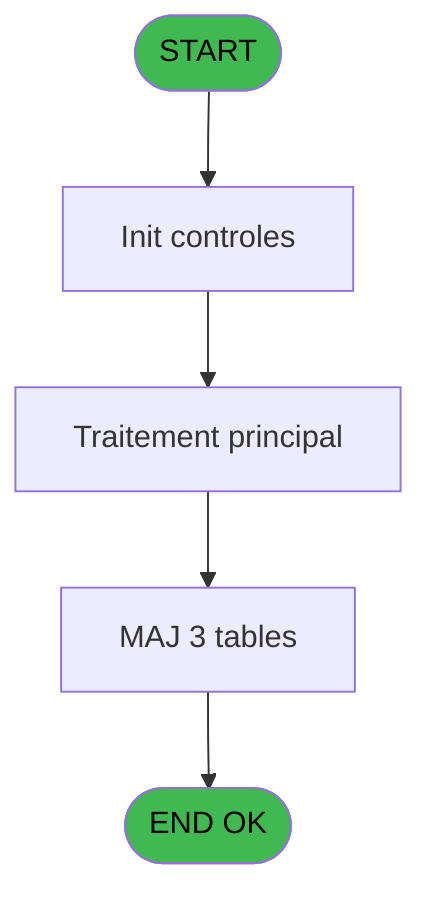
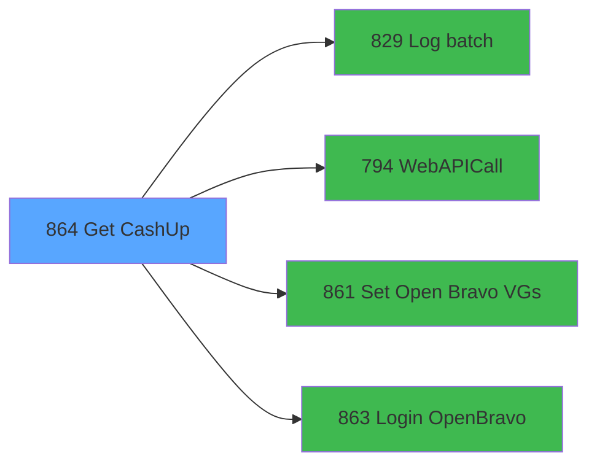

# REF IDE 864 - Get CashUp

> **Analyse**: Phases 1-4 2026-02-03 14:48 -> 14:48 (13s) | Assemblage 14:48
> **Pipeline**: V7.2 Enrichi
> **Structure**: 4 onglets (Resume | Ecrans | Donnees | Connexions)

<!-- TAB:Resume -->

## 1. FICHE D'IDENTITE

| Attribut | Valeur |
|----------|--------|
| Projet | REF |
| IDE Position | 864 |
| Nom Programme | Get CashUp |
| Fichier source | `Prg_864.xml` |
| Dossier IDE | General |
| Taches | 4 (0 ecrans visibles) |
| Tables modifiees | 3 |
| Programmes appeles | 4 |

## 2. DESCRIPTION FONCTIONNELLE

**Get CashUp** assure la gestion complete de ce processus, accessible depuis [Cloture OB (IDE 621)](REF-IDE-621.md).

Le flux de traitement s'organise en **2 blocs fonctionnels** :

- **Traitement** (3 taches) : traitements metier divers
- **Creation** (1 tache) : insertion d'enregistrements en base (mouvements, prestations)

**Donnees modifiees** : 3 tables en ecriture (tables_imports, web_api_cashup, web_api_cashup_details).

**Logique metier** : 2 regles identifiees couvrant conditions metier, valeurs par defaut.

Detail : phases du traitement

#### Phase 1 : Traitement (3 taches)

- **864** - GetJH
- **864.1** - ExtractDataFromXML
- **864.1.1** - (sans nom)

Delegue a : [Log batch (IDE 829)](REF-IDE-829.md), [WebAPICall (IDE 794)](REF-IDE-794.md), [Set Open Bravo VGs (IDE 861)](REF-IDE-861.md), [Login OpenBravo (IDE 863)](REF-IDE-863.md)

#### Phase 2 : Creation (1 tache)

- **864.1.2** - createDetail

#### Tables impactees

| Table | Operations | Role metier |
|-------|-----------|-------------|
| tables_imports | **W** (1 usages) |  |
| web_api_cashup_details | **W** (1 usages) |  |
| web_api_cashup | **W** (1 usages) |  |

## 3. BLOCS FONCTIONNELS

### 3.1 Traitement (3 taches)

Traitements internes.

---

#### 864 - GetJH

**Role** : Consultation/chargement : GetJH.
**Delegue a** : [Log batch (IDE 829)](REF-IDE-829.md), [WebAPICall (IDE 794)](REF-IDE-794.md), [Set Open Bravo VGs (IDE 861)](REF-IDE-861.md)

---

#### 864.1 - ExtractDataFromXML

**Role** : Traitement : ExtractDataFromXML.
**Delegue a** : [Log batch (IDE 829)](REF-IDE-829.md), [WebAPICall (IDE 794)](REF-IDE-794.md), [Set Open Bravo VGs (IDE 861)](REF-IDE-861.md)

---

#### 864.1.1 - (sans nom)

**Role** : Traitement interne.
**Delegue a** : [Log batch (IDE 829)](REF-IDE-829.md), [WebAPICall (IDE 794)](REF-IDE-794.md), [Set Open Bravo VGs (IDE 861)](REF-IDE-861.md)

### 3.2 Creation (1 tache)

Insertion de nouveaux enregistrements en base.

---

#### 864.1.2 - createDetail

**Role** : Traitement : createDetail.

## 5. REGLES METIER

2 regles identifiees:

### Autres (2 regles)

#### [RM-001] Si p.o.Idenitifier (ligne) [B]=BOM(p.o.Idenitifier (ligne) [B]) alors v. organizationName [H] sinon NULL())

| Element | Detail |
|---------|--------|
| **Condition** | `p.o.Idenitifier (ligne) [B]=BOM(p.o.Idenitifier (ligne) [B])` |
| **Si vrai** | v. organizationName [H] |
| **Si faux** | NULL()) |
| **Variables** | B (p.o.Idenitifier (ligne)), G (v. organization), H (v. organizationName) |
| **Expression source** | Expression 11 : `IF(p.o.Idenitifier (ligne) [B]=BOM(p.o.Idenitifier (ligne) [` |
| **Exemple** | Si p.o.Idenitifier (ligne) [B]=BOM(p.o.Idenitifier (ligne) [B]) → v. organizationName [H]. Sinon → NULL()) |

#### [RM-002] Valeur par defaut si v.JsonResponse [O] est vide

| Element | Detail |
|---------|--------|
| **Condition** | `v.JsonResponse [O]=''` |
| **Si vrai** | 'OK' |
| **Si faux** | 'ERR') |
| **Variables** | O (v.JsonResponse) |
| **Expression source** | Expression 15 : `IF(v.JsonResponse [O]='', 'OK', 'ERR')` |
| **Exemple** | Si v.JsonResponse [O]='' → 'OK'. Sinon → 'ERR') |

## 6. CONTEXTE

- **Appele par**: [Cloture OB (IDE 621)](REF-IDE-621.md)
- **Appelle**: 4 programmes | **Tables**: 3 (W:3 R:0 L:0) | **Taches**: 4 | **Expressions**: 20

<!-- TAB:Ecrans -->

## 8. ECRANS

*(Programme sans ecran visible)*

## 9. NAVIGATION

### 9.3 Structure hierarchique (4 taches)

| Position | Tache | Type | Dimensions | Bloc |
|----------|-------|------|------------|------|
| **864.1** | [**GetJH** (864)](#t3) | - | - | Traitement |
| 864.1.1 | [ExtractDataFromXML (864.1)](#t10) | - | - | |
| 864.1.2 | [(sans nom) (864.1.1)](#t13) | - | - | |
| **864.2** | [**createDetail** (864.1.2)](#t14) | - | - | Creation |

### 9.4 Algorigramme

> **Legende**: Vert = START/END OK | Rouge = END KO | Bleu = Decisions
> *Algorigramme auto-genere. Utiliser `/algorigramme` pour une synthese metier detaillee.*

<!-- TAB:Donnees -->

## 10. TABLES

### Tables utilisees (3)

| ID | Nom | Description | Type | R | W | L | Usages |
|----|-----|-------------|------|---|---|---|--------|
| 118 | tables_imports |  | DB |   | **W** |   | 1 |
| 915 | web_api_cashup |  | DB |   | **W** |   | 1 |
| 916 | web_api_cashup_details |  | DB |   | **W** |   | 1 |

### Colonnes par table (3 / 3 tables avec colonnes identifiees)

Table 118 - tables_imports (**W**) - 1 usages

| Lettre | Variable | Acces | Type |
|--------|----------|-------|------|
| C | p.o.XMLResponse | W | Blob |
| D | p.o.JsoneResponse | W | Blob |
| K | v.JsonIn | W | Blob |
| O | v.JsonResponse | W | Blob |
| P | v.XmlResponse | W | Blob |

Table 915 - web_api_cashup (**W**) - 1 usages

| Lettre | Variable | Acces | Type |
|--------|----------|-------|------|
| K | v.CashupId | W | Unicode |
| U | v.CashupDate | W | Date |
| V | v.CashupDate_time | W | Time |

Table 916 - web_api_cashup_details (**W**) - 1 usages

| Lettre | Variable | Acces | Type |
|--------|----------|-------|------|
| K | v.CashupId | W | Unicode |
| U | v.CashupDate | W | Date |
| V | v.CashupDate_time | W | Time |

## 11. VARIABLES

### 11.1 Parametres entrants (4)

Variables recues du programme appelant ([Cloture OB (IDE 621)](REF-IDE-621.md)).

| Lettre | Nom | Type | Usage dans |
|--------|-----|------|-----------|
| A | p.i.Date | Date | - |
| B | p.o.Idenitifier (ligne) | Unicode | 3x parametre entrant |
| C | p.o.XMLResponse | Blob | - |
| D | p.o.JsoneResponse | Blob | - |

### 11.2 Variables de session (35)

Variables persistantes pendant toute la session.

| Lettre | Nom | Type | Usage dans |
|--------|-----|------|-----------|
| E | v. statut appel | Unicode | - |
| F | v. clientName | Unicode | - |
| G | v. organization | Unicode | 1x session |
| H | v. organizationName | Unicode | 1x session |
| I | v.UrlApi | Unicode | - |
| J | v.RequestType | Unicode | 1x session |
| K | v.JsonIn | Blob | - |
| L | v.ProxyAdress | Unicode | - |
| M | v.IsSuccess | Logical | - |
| N | v.ErrorMessage | Unicode | - |
| O | v.JsonResponse | Blob | 1x session |
| P | v.XmlResponse | Blob | 1x session |
| Q | v.Id batch | Numeric | - |
| R | v.Nb item (trace) | Numeric | - |
| S | v.CashierEmployeeLastName | Unicode | 1x session |
| T | v.CashierEmployeeFirstName | Unicode | - |
| U | v.CashupDate | Date | - |
| V | v.CashupDate_time | Time | - |
| W | v.Application | Unicode | - |
| X | v.Service | Unicode | - |
| Y | v.DateComptable | Date | - |
| Z | v.WpPaymentTypeId | Unicode | - |
| BA | v.WpPaymentMethodeCode | Unicode | - |
| BB | v.WpPaymentMethodeLabel | Unicode | - |
| BC | v.TotalSales | Numeric | - |
| BD | v.TotalReturns | Numeric | - |
| BE | v.TotalDrops | Numeric | - |
| BF | v.TotalDeposit | Numeric | - |
| BG | v.TheoricalAmount | Numeric | - |
| BH | v.TotalCounted | Numeric | - |
| BI | v.AmountToKeep | Numeric | - |
| BJ | v.DifferenceRealToTheorical | Numeric | - |
| BK | v.Currency | Unicode | - |
| BL | v.Loop | Numeric | - |
| BM | v.Loop2 | Numeric | - |

Toutes les 39 variables (liste complete)

| Cat | Lettre | Nom Variable | Type |
|-----|--------|--------------|------|
| P0 | **A** | p.i.Date | Date |
| P0 | **B** | p.o.Idenitifier (ligne) | Unicode |
| P0 | **C** | p.o.XMLResponse | Blob |
| P0 | **D** | p.o.JsoneResponse | Blob |
| V. | **E** | v. statut appel | Unicode |
| V. | **F** | v. clientName | Unicode |
| V. | **G** | v. organization | Unicode |
| V. | **H** | v. organizationName | Unicode |
| V. | **I** | v.UrlApi | Unicode |
| V. | **J** | v.RequestType | Unicode |
| V. | **K** | v.JsonIn | Blob |
| V. | **L** | v.ProxyAdress | Unicode |
| V. | **M** | v.IsSuccess | Logical |
| V. | **N** | v.ErrorMessage | Unicode |
| V. | **O** | v.JsonResponse | Blob |
| V. | **P** | v.XmlResponse | Blob |
| V. | **Q** | v.Id batch | Numeric |
| V. | **R** | v.Nb item (trace) | Numeric |
| V. | **S** | v.CashierEmployeeLastName | Unicode |
| V. | **T** | v.CashierEmployeeFirstName | Unicode |
| V. | **U** | v.CashupDate | Date |
| V. | **V** | v.CashupDate_time | Time |
| V. | **W** | v.Application | Unicode |
| V. | **X** | v.Service | Unicode |
| V. | **Y** | v.DateComptable | Date |
| V. | **Z** | v.WpPaymentTypeId | Unicode |
| V. | **BA** | v.WpPaymentMethodeCode | Unicode |
| V. | **BB** | v.WpPaymentMethodeLabel | Unicode |
| V. | **BC** | v.TotalSales | Numeric |
| V. | **BD** | v.TotalReturns | Numeric |
| V. | **BE** | v.TotalDrops | Numeric |
| V. | **BF** | v.TotalDeposit | Numeric |
| V. | **BG** | v.TheoricalAmount | Numeric |
| V. | **BH** | v.TotalCounted | Numeric |
| V. | **BI** | v.AmountToKeep | Numeric |
| V. | **BJ** | v.DifferenceRealToTheorical | Numeric |
| V. | **BK** | v.Currency | Unicode |
| V. | **BL** | v.Loop | Numeric |
| V. | **BM** | v.Loop2 | Numeric |

## 12. EXPRESSIONS

**20 / 20 expressions decodees (100%)**

### 12.1 Repartition par type

| Type | Expressions | Regles |
|------|-------------|--------|
| CALCULATION | 1 | 0 |
| CONCATENATION | 2 | 0 |
| CONDITION | 4 | 2 |
| CONSTANTE | 7 | 0 |
| FORMAT | 1 | 0 |
| OTHER | 3 | 0 |
| STRING | 2 | 0 |

### 12.2 Expressions cles par type

#### CALCULATION (1 expressions)

| Type | IDE | Expression | Regle |
|------|-----|------------|-------|
| CALCULATION | 2 | `Trim(VG39) & '/CLMDJH_HostelDays'` | - |

#### CONCATENATION (2 expressions)

| Type | IDE | Expression | Regle |
|------|-----|------------|-------|
| CONCATENATION | 18 | `'user:pw'&Trim(VG36)&Trim(VG37)` | - |
| CONCATENATION | 5 | `'<?xml version="1.0" encoding="UTF-8"?>' &
ASCIIChr(13)& ASCIIChr(10)&
DotNet.System.Xml.Linq.XElement.Load(
  DotNet.System.Runtime.Serialization.Json.JsonReaderWriterFactory.CreateJsonReader( 
     v.XmlResponse [P],
     DotNet.System.Xml.XmlDictionaryReaderQuotas()
   )
).ToString()` | - |

#### CONDITION (4 expressions)

| Type | IDE | Expression | Regle |
|------|-----|------------|-------|
| CONDITION | 15 | `IF(v.JsonResponse [O]='', 'OK', 'ERR')` | [RM-002](#rm-RM-002) |
| CONDITION | 11 | `IF(p.o.Idenitifier (ligne) [B]=BOM(p.o.Idenitifier (ligne) [B]), v. organizationName [H], NULL())` | [RM-001](#rm-RM-001) |
| CONDITION | 19 | `[AB]<>'N'` | - |
| CONDITION | 12 | `IF(p.o.Idenitifier (ligne) [B]=BOM(p.o.Idenitifier (ligne) [B]), 'json', '')` | - |

#### CONSTANTE (7 expressions)

| Type | IDE | Expression | Regle |
|------|-----|------------|-------|
| CONSTANTE | 8 | `'GetCashup'` | - |
| CONSTANTE | 10 | `'DEB'` | - |
| CONSTANTE | 14 | `'Cashup'` | - |
| CONSTANTE | 7 | `'Cashup'` | - |
| CONSTANTE | 1 | `''` | - |
| ... | | *+2 autres* | |

#### FORMAT (1 expressions)

| Type | IDE | Expression | Regle |
|------|-----|------------|-------|
| FORMAT | 16 | `'https://club-med.cloud.openbravo.com/openbravo/ws/org.openbravo.api.ExportService/CashUp/byCashUpOrg?organizationName='&Trim(ExpCalc('23'EXP))&'&creationDate='&DStr(p.o.Idenitifier (ligne) [B],VG35)` | - |

#### OTHER (3 expressions)

| Type | IDE | Expression | Regle |
|------|-----|------------|-------|
| OTHER | 20 | `[AB]` | - |
| OTHER | 13 | `v.CashierEmployeeLastName [S]` | - |
| OTHER | 9 | `v.RequestType [J]` | - |

#### STRING (2 expressions)

| Type | IDE | Expression | Regle |
|------|-----|------------|-------|
| STRING | 17 | `Trim([AC])` | - |
| STRING | 4 | `Trim(VG40)` | - |

<!-- TAB:Connexions -->

## 13. GRAPHE D'APPELS

### 13.1 Chaine depuis Main (Callers)

Main -> ... -> [Cloture OB (IDE 621)](REF-IDE-621.md) -> **Get CashUp (IDE 864)**

### 13.2 Callers

| IDE | Nom Programme | Nb Appels |
|-----|---------------|-----------|
| [621](REF-IDE-621.md) | Cloture OB | 1 |

### 13.3 Callees (programmes appeles)

### 13.4 Detail Callees avec contexte

| IDE | Nom Programme | Appels | Contexte |
|-----|---------------|--------|----------|
| [829](REF-IDE-829.md) | Log batch | 2 | Sous-programme |
| [794](REF-IDE-794.md) | WebAPICall | 1 | Sous-programme |
| [861](REF-IDE-861.md) | Set Open Bravo VGs | 1 | Ouverture session |
| [863](REF-IDE-863.md) | Login OpenBravo | 1 | Ouverture session |

## 14. RECOMMANDATIONS MIGRATION

### 14.1 Profil du programme

| Metrique | Valeur | Impact migration |
|----------|--------|-----------------|
| Lignes de logique | 183 | Programme compact |
| Expressions | 20 | Peu de logique |
| Tables WRITE | 3 | Impact modere |
| Sous-programmes | 4 | Peu de dependances |
| Ecrans visibles | 0 | Ecran unique ou traitement batch |
| Code desactive | 6% (11 / 183) | A verifier |
| Regles metier | 2 | Quelques regles a preserver |

### 14.2 Plan de migration par bloc

#### Traitement (3 taches: 0 ecran, 3 traitements)

- **Strategie** : 3 service(s) backend injectable(s) (Domain Services).
- 4 sous-programme(s) a migrer ou a reutiliser depuis les services existants.
- Decomposer les taches en services unitaires testables.

#### Creation (1 tache: 0 ecran, 1 traitement)

- **Strategie** : Repository pattern avec Entity Framework Core.
- Insertion via `IRepository<T>.CreateAsync()`

### 14.3 Dependances critiques

| Dependance | Type | Appels | Impact |
|------------|------|--------|--------|
| tables_imports | Table WRITE (Database) | 1x | Schema + repository |
| web_api_cashup | Table WRITE (Database) | 1x | Schema + repository |
| web_api_cashup_details | Table WRITE (Database) | 1x | Schema + repository |
| [Log batch (IDE 829)](REF-IDE-829.md) | Sous-programme | 2x | Haute - Sous-programme |
| [Login OpenBravo (IDE 863)](REF-IDE-863.md) | Sous-programme | 1x | Normale - Ouverture session |
| [Set Open Bravo VGs (IDE 861)](REF-IDE-861.md) | Sous-programme | 1x | Normale - Ouverture session |
| [WebAPICall (IDE 794)](REF-IDE-794.md) | Sous-programme | 1x | Normale - Sous-programme |

---
*Spec DETAILED generee par Pipeline V7.2 - 2026-02-03 14:48*
