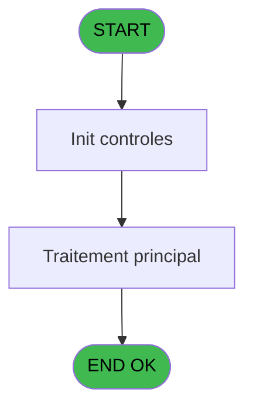
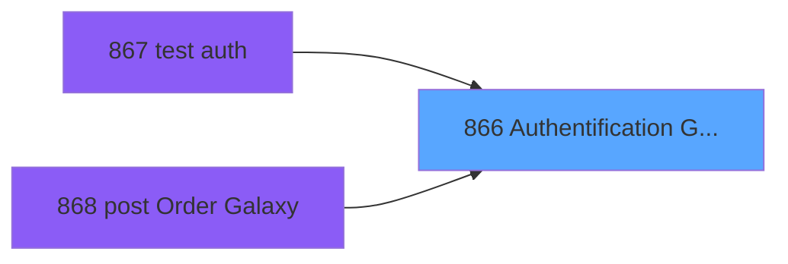
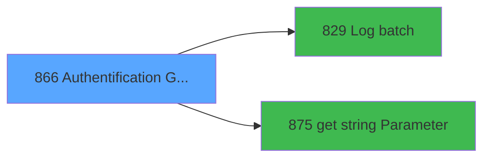

# REF IDE 866 - Authentification Galaxy

> **Analyse**: Phases 1-4 2026-02-03 14:48 -> 14:49 (13s) | Assemblage 14:49
> **Pipeline**: V7.2 Enrichi
> **Structure**: 4 onglets (Resume | Ecrans | Donnees | Connexions)

<!-- TAB:Resume -->

## 1. FICHE D'IDENTITE

| Attribut | Valeur |
|----------|--------|
| Projet | REF |
| IDE Position | 866 |
| Nom Programme | Authentification Galaxy |
| Fichier source | `Prg_866.xml` |
| Dossier IDE | General |
| Taches | 3 (0 ecrans visibles) |
| Tables modifiees | 0 |
| Programmes appeles | 2 |

## 2. DESCRIPTION FONCTIONNELLE

**Authentification Galaxy** assure la gestion complete de ce processus, accessible depuis [test auth (IDE 867)](REF-IDE-867.md), [post Order Galaxy (IDE 868)](REF-IDE-868.md).

Le flux de traitement s'organise en **1 blocs fonctionnels** :

- **Traitement** (3 taches) : traitements metier divers

**Logique metier** : 1 regles identifiees couvrant conditions metier.

## 3. BLOCS FONCTIONNELS

### 3.1 Traitement (3 taches)

Traitements internes.

---

#### 866 - Authentification Galaxy

**Role** : Traitement : Authentification Galaxy.
**Variables liees** : D (v. Galaxy Auth URL)
**Delegue a** : [Log batch (IDE 829)](REF-IDE-829.md), [get string Parameter (IDE 875)](REF-IDE-875.md)

---

#### 866.1 - read xml

**Role** : Traitement : read xml.
**Delegue a** : [Log batch (IDE 829)](REF-IDE-829.md), [get string Parameter (IDE 875)](REF-IDE-875.md)

---

#### 866.2 - Write curl

**Role** : Traitement : Write curl.
**Variables liees** : H (v. resp_fichier_curl), I (v. cmd_curl), J (v. dmd_fichier_curl)
**Delegue a** : [Log batch (IDE 829)](REF-IDE-829.md), [get string Parameter (IDE 875)](REF-IDE-875.md)

## 5. REGLES METIER

1 regles identifiees:

### Autres (1 regles)

#### [RM-001] Si v. auth retour [G] alors 'OK' sinon 'ERR')

| Element | Detail |
|---------|--------|
| **Condition** | `v. auth retour [G]` |
| **Si vrai** | 'OK' |
| **Si faux** | 'ERR') |
| **Variables** | G (v. auth retour) |
| **Expression source** | Expression 20 : `IF(v. auth retour [G],'OK','ERR')` |
| **Exemple** | Si v. auth retour [G] → 'OK'. Sinon → 'ERR') |

## 6. CONTEXTE

- **Appele par**: [test auth (IDE 867)](REF-IDE-867.md), [post Order Galaxy (IDE 868)](REF-IDE-868.md)
- **Appelle**: 2 programmes | **Tables**: 0 (W:0 R:0 L:0) | **Taches**: 3 | **Expressions**: 27

<!-- TAB:Ecrans -->

## 8. ECRANS

*(Programme sans ecran visible)*

## 9. NAVIGATION

### 9.3 Structure hierarchique (3 taches)

| Position | Tache | Type | Dimensions | Bloc |
|----------|-------|------|------------|------|
| **866.1** | [**Authentification Galaxy** (866)](#t1) | - | - | Traitement |
| 866.1.1 | [read xml (866.1)](#t3) | - | - | |
| 866.1.2 | [Write curl (866.2)](#t6) | - | - | |

### 9.4 Algorigramme

> **Legende**: Vert = START/END OK | Rouge = END KO | Bleu = Decisions
> *Algorigramme auto-genere. Utiliser `/algorigramme` pour une synthese metier detaillee.*

<!-- TAB:Donnees -->

## 10. TABLES

### Tables utilisees (0)

| ID | Nom | Description | Type | R | W | L | Usages |
|----|-----|-------------|------|---|---|---|--------|

### Colonnes par table (0 / 0 tables avec colonnes identifiees)

## 11. VARIABLES

### 11.1 Parametres entrants (2)

Variables recues du programme appelant ([test auth (IDE 867)](REF-IDE-867.md)).

| Lettre | Nom | Type | Usage dans |
|--------|-----|------|-----------|
| A | P.o. auth retour | Unicode | [866](#t1) |
| B | P.o. sucess? | Logical | - |

### 11.2 Variables de session (8)

Variables persistantes pendant toute la session.

| Lettre | Nom | Type | Usage dans |
|--------|-----|------|-----------|
| C | v. Mock Mode | Logical | - |
| D | v. Galaxy Auth URL | Unicode | [866](#t1) |
| E | v. json_response | Blob | 2x session |
| F | v. xml_response | Blob | - |
| G | v. auth retour | Unicode | [866](#t1) |
| H | v. resp_fichier_curl | Unicode | 2x session |
| I | v. cmd_curl | Unicode | 1x session |
| J | v. dmd_fichier_curl | Unicode | 4x session |

## 12. EXPRESSIONS

**27 / 27 expressions decodees (100%)**

### 12.1 Repartition par type

| Type | Expressions | Regles |
|------|-------------|--------|
| CONCATENATION | 2 | 0 |
| CONDITION | 4 | 5 |
| CONSTANTE | 6 | 0 |
| FORMAT | 2 | 0 |
| OTHER | 5 | 0 |
| STRING | 8 | 0 |

### 12.2 Expressions cles par type

#### CONCATENATION (2 expressions)

| Type | IDE | Expression | Regle |
|------|-----|------------|-------|
| CONCATENATION | 7 | `Translate('%club_exe%')&'curl\bin\curl '&Trim(P.o. auth retour [A])&' > "'&Translate('%TempDir%')&Trim(v. dmd_fichier_curl [J])&'"'` | - |
| CONCATENATION | 5 | `'<?xml version="1.0" encoding="UTF-8"?>' &
ASCIIChr(13)& ASCIIChr(10)&
DotNet.System.Xml.Linq.XElement.Load(
  DotNet.System.Runtime.Serialization.Json.JsonReaderWriterFactory.CreateJsonReader( 
     v. Galaxy Auth URL [D],
     DotNet.System.Xml.XmlDictionaryReaderQuotas()
   )
).ToString()` | - |

#### CONDITION (4 expressions)

| Type | IDE | Expression | Regle |
|------|-----|------------|-------|
| CONDITION | 20 | `IF(v. auth retour [G],'OK','ERR')` | [RM-001](#rm-RM-001) |
| CONDITION | 18 | `Translate('%simultpe%')='O'` | - |
| CONDITION | 6 | `v. Galaxy Auth URL [D]<>''` | - |
| CONDITION | 3 | `v. json_response [E]<>''` | - |

#### CONSTANTE (6 expressions)

| Type | IDE | Expression | Regle |
|------|-----|------------|-------|
| CONSTANTE | 19 | `'json'` | - |
| CONSTANTE | 23 | `'xml'` | - |
| CONSTANTE | 25 | `'GALAXY'` | - |
| CONSTANTE | 2 | `'{    "SessionId": "bB8DoulTCpP0cG59rGcy",    "UserName": "admin",    "ReferrerUrl": null,    "ResponseStatus": {        "ErrorCode": null,        "Message": null,        "StackTrace": null,        "Errors": null    }}'` | - |
| CONSTANTE | 16 | `'IGA_AUTH_CURL'` | - |
| ... | | *+1 autres* | |

#### FORMAT (2 expressions)

| Type | IDE | Expression | Regle |
|------|-----|------------|-------|
| FORMAT | 12 | `'galaxyauth_dmd_'&DStr(Date(),'YYYYMMDD')&TStr(Time(),'HHMMSS')&'.bat'` | - |
| FORMAT | 11 | `'galaxyauth_rsp_'&DStr(Date(),'YYYYMMDD')&TStr(Time(),'HHMMSS')&'.json'` | - |

#### OTHER (5 expressions)

| Type | IDE | Expression | Regle |
|------|-----|------------|-------|
| OTHER | 26 | `'Authentication'&IF(v. resp_fichier_curl [H],' MOCK','')` | - |
| OTHER | 27 | `Translate('%TempDir%')&{1,12}` | - |
| OTHER | 24 | `[K]` | - |
| OTHER | 1 | `NOT(v. resp_fichier_curl [H])` | - |
| OTHER | 4 | `v. json_response [E]` | - |

#### STRING (8 expressions)

| Type | IDE | Expression | Regle |
|------|-----|------------|-------|
| STRING | 15 | `Translate('%TempDir%')&Trim([L])` | - |
| STRING | 14 | `FileExist(Translate('%TempDir%')&Trim([L]))` | - |
| STRING | 22 | `Trim(v. cmd_curl [I])` | - |
| STRING | 21 | `Trim(v. Galaxy Auth URL [D])` | - |
| STRING | 9 | `FileDelete(Translate('%TempDir%')&Trim(v. dmd_fichier_curl [J]))` | - |
| ... | | *+3 autres* | |

### 12.3 Toutes les expressions (27)

Voir les 27 expressions

#### CONCATENATION (2)

| IDE | Expression Decodee |
|-----|-------------------|
| 5 | `'<?xml version="1.0" encoding="UTF-8"?>' &
ASCIIChr(13)& ASCIIChr(10)&
DotNet.System.Xml.Linq.XElement.Load(
  DotNet.System.Runtime.Serialization.Json.JsonReaderWriterFactory.CreateJsonReader( 
     v. Galaxy Auth URL [D],
     DotNet.System.Xml.XmlDictionaryReaderQuotas()
   )
).ToString()` |
| 7 | `Translate('%club_exe%')&'curl\bin\curl '&Trim(P.o. auth retour [A])&' > "'&Translate('%TempDir%')&Trim(v. dmd_fichier_curl [J])&'"'` |

#### CONDITION (4)

| IDE | Expression Decodee |
|-----|-------------------|
| 20 | `IF(v. auth retour [G],'OK','ERR')` |
| 3 | `v. json_response [E]<>''` |
| 6 | `v. Galaxy Auth URL [D]<>''` |
| 18 | `Translate('%simultpe%')='O'` |

#### CONSTANTE (6)

| IDE | Expression Decodee |
|-----|-------------------|
| 2 | `'{    "SessionId": "bB8DoulTCpP0cG59rGcy",    "UserName": "admin",    "ReferrerUrl": null,    "ResponseStatus": {        "ErrorCode": null,        "Message": null,        "StackTrace": null,        "Errors": null    }}'` |
| 16 | `'IGA_AUTH_CURL'` |
| 17 | `'GALAXY_API'` |
| 19 | `'json'` |
| 23 | `'xml'` |
| 25 | `'GALAXY'` |

#### FORMAT (2)

| IDE | Expression Decodee |
|-----|-------------------|
| 11 | `'galaxyauth_rsp_'&DStr(Date(),'YYYYMMDD')&TStr(Time(),'HHMMSS')&'.json'` |
| 12 | `'galaxyauth_dmd_'&DStr(Date(),'YYYYMMDD')&TStr(Time(),'HHMMSS')&'.bat'` |

#### OTHER (5)

| IDE | Expression Decodee |
|-----|-------------------|
| 1 | `NOT(v. resp_fichier_curl [H])` |
| 4 | `v. json_response [E]` |
| 24 | `[K]` |
| 26 | `'Authentication'&IF(v. resp_fichier_curl [H],' MOCK','')` |
| 27 | `Translate('%TempDir%')&{1,12}` |

#### STRING (8)

| IDE | Expression Decodee |
|-----|-------------------|
| 8 | `File2Blb(Translate('%TempDir%')&Trim(v. dmd_fichier_curl [J]))` |
| 9 | `FileDelete(Translate('%TempDir%')&Trim(v. dmd_fichier_curl [J]))` |
| 10 | `FileDelete(Translate('%TempDir%')&Trim([L]))` |
| 13 | `FileExist(Translate('%TempDir%')&Trim(v. dmd_fichier_curl [J]))` |
| 14 | `FileExist(Translate('%TempDir%')&Trim([L]))` |
| 15 | `Translate('%TempDir%')&Trim([L])` |
| 21 | `Trim(v. Galaxy Auth URL [D])` |
| 22 | `Trim(v. cmd_curl [I])` |

<!-- TAB:Connexions -->

## 13. GRAPHE D'APPELS

### 13.1 Chaine depuis Main (Callers)

Main -> ... -> [test auth (IDE 867)](REF-IDE-867.md) -> **Authentification Galaxy (IDE 866)**

Main -> ... -> [post Order Galaxy (IDE 868)](REF-IDE-868.md) -> **Authentification Galaxy (IDE 866)**

### 13.2 Callers

| IDE | Nom Programme | Nb Appels |
|-----|---------------|-----------|
| [867](REF-IDE-867.md) | test auth | 1 |
| [868](REF-IDE-868.md) | post Order Galaxy | 1 |

### 13.3 Callees (programmes appeles)

### 13.4 Detail Callees avec contexte

| IDE | Nom Programme | Appels | Contexte |
|-----|---------------|--------|----------|
| [829](REF-IDE-829.md) | Log batch | 1 | Sous-programme |
| [875](REF-IDE-875.md) | get string Parameter | 1 | Recuperation donnees |

## 14. RECOMMANDATIONS MIGRATION

### 14.1 Profil du programme

| Metrique | Valeur | Impact migration |
|----------|--------|-----------------|
| Lignes de logique | 41 | Programme compact |
| Expressions | 27 | Peu de logique |
| Tables WRITE | 0 | Impact faible |
| Sous-programmes | 2 | Peu de dependances |
| Ecrans visibles | 0 | Ecran unique ou traitement batch |
| Code desactive | 0% (0 / 41) | Code sain |
| Regles metier | 1 | Quelques regles a preserver |

### 14.2 Plan de migration par bloc

#### Traitement (3 taches: 0 ecran, 3 traitements)

- **Strategie** : 3 service(s) backend injectable(s) (Domain Services).
- 2 sous-programme(s) a migrer ou a reutiliser depuis les services existants.
- Decomposer les taches en services unitaires testables.

### 14.3 Dependances critiques

| Dependance | Type | Appels | Impact |
|------------|------|--------|--------|
| [get string Parameter (IDE 875)](REF-IDE-875.md) | Sous-programme | 1x | Normale - Recuperation donnees |
| [Log batch (IDE 829)](REF-IDE-829.md) | Sous-programme | 1x | Normale - Sous-programme |

---
*Spec DETAILED generee par Pipeline V7.2 - 2026-02-03 14:49*
