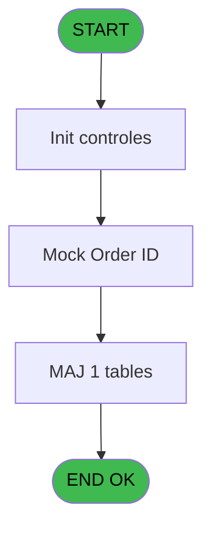
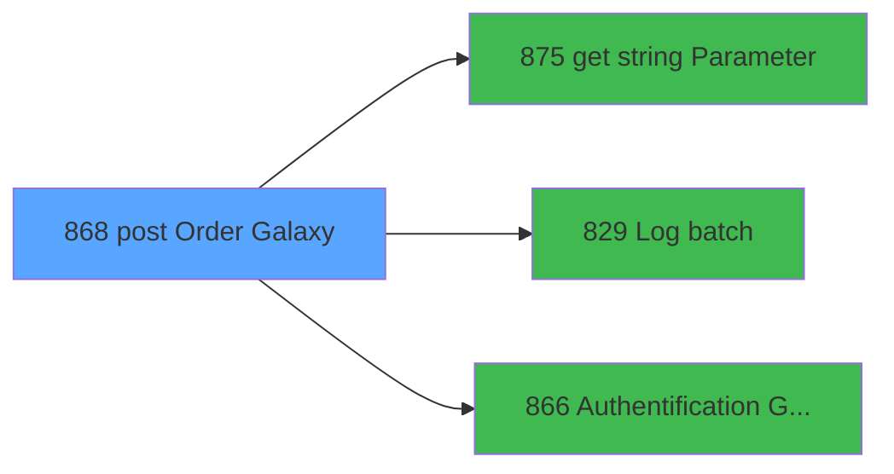

# REF IDE 868 - post Order Galaxy

> **Analyse**: Phases 1-4 2026-02-03 14:49 -> 14:49 (13s) | Assemblage 14:49
> **Pipeline**: V7.2 Enrichi
> **Structure**: 4 onglets (Resume | Ecrans | Donnees | Connexions)

<!-- TAB:Resume -->

## 1. FICHE D'IDENTITE

| Attribut | Valeur |
|----------|--------|
| Projet | REF |
| IDE Position | 868 |
| Nom Programme | post Order Galaxy |
| Fichier source | `Prg_868.xml` |
| Dossier IDE | General |
| Taches | 9 (1 ecrans visibles) |
| Tables modifiees | 1 |
| Programmes appeles | 3 |
| :warning: Statut | **ORPHELIN_POTENTIEL** |

## 2. DESCRIPTION FONCTIONNELLE

**post Order Galaxy** assure la gestion complete de ce processus.

Le flux de traitement s'organise en **1 blocs fonctionnels** :

- **Traitement** (9 taches) : traitements metier divers

**Donnees modifiees** : 1 tables en ecriture (art_galaxy_cumul).

Detail : phases du traitement

#### Phase 1 : Traitement (9 taches)

- **868** - post Order Galaxy
- **868.1** - Mock Order ID **[[ECRAN]](#ecran-t2)**
- **868.2** - (sans nom)
- **868.2.1** - gen sales
- **868.2.2** - gen payments
- **868.3** - mock data
- **868.4** - Authentification
- **868.4.1** - Write curl
- **868.4.2** - read xml

Delegue a : [get string Parameter (IDE 875)](REF-IDE-875.md), [Log batch (IDE 829)](REF-IDE-829.md), [Authentification Galaxy (IDE 866)](REF-IDE-866.md)

#### Tables impactees

| Table | Operations | Role metier |
|-------|-----------|-------------|
| art_galaxy_cumul | R/**W** (3 usages) |  |

## 3. BLOCS FONCTIONNELS

### 3.1 Traitement (9 taches)

Traitements internes.

---

#### 868 - post Order Galaxy

**Role** : Tache d'orchestration : point d'entree du programme (9 sous-taches). Coordonne l'enchainement des traitements.

8 sous-taches directes

| Tache | Nom | Bloc |
|-------|-----|------|
| [868.1](#t2) | Mock Order ID **[[ECRAN]](#ecran-t2)** | Traitement |
| [868.2](#t4) | (sans nom) | Traitement |
| [868.2.1](#t5) | gen sales | Traitement |
| [868.2.2](#t6) | gen payments | Traitement |
| [868.3](#t7) | mock data | Traitement |
| [868.4](#t16) | Authentification | Traitement |
| [868.4.1](#t17) | Write curl | Traitement |
| [868.4.2](#t18) | read xml | Traitement |

**Variables liees** : C (P.i Order ID PMS), E (P.o. Order ID), G (v. Url order post), H (v. Galaxy generic CustID)
**Delegue a** : [get string Parameter (IDE 875)](REF-IDE-875.md), [Log batch (IDE 829)](REF-IDE-829.md), [Authentification Galaxy (IDE 866)](REF-IDE-866.md)

---

#### 868.1 - Mock Order ID [[ECRAN]](#ecran-t2)

**Role** : Traitement : Mock Order ID.
**Ecran** : 361 x 65 DLU | [Voir mockup](#ecran-t2)
**Variables liees** : C (P.i Order ID PMS), E (P.o. Order ID), F (v. Mock Mode), G (v. Url order post)
**Delegue a** : [get string Parameter (IDE 875)](REF-IDE-875.md), [Log batch (IDE 829)](REF-IDE-829.md), [Authentification Galaxy (IDE 866)](REF-IDE-866.md)

---

#### 868.2 - (sans nom)

**Role** : Traitement interne.
**Delegue a** : [get string Parameter (IDE 875)](REF-IDE-875.md), [Log batch (IDE 829)](REF-IDE-829.md), [Authentification Galaxy (IDE 866)](REF-IDE-866.md)

---

#### 868.2.1 - gen sales

**Role** : Traitement : gen sales.
**Delegue a** : [get string Parameter (IDE 875)](REF-IDE-875.md), [Log batch (IDE 829)](REF-IDE-829.md), [Authentification Galaxy (IDE 866)](REF-IDE-866.md)

---

#### 868.2.2 - gen payments

**Role** : Traitement : gen payments.
**Delegue a** : [get string Parameter (IDE 875)](REF-IDE-875.md), [Log batch (IDE 829)](REF-IDE-829.md), [Authentification Galaxy (IDE 866)](REF-IDE-866.md)

---

#### 868.3 - mock data

**Role** : Traitement : mock data.
**Variables liees** : F (v. Mock Mode)
**Delegue a** : [get string Parameter (IDE 875)](REF-IDE-875.md), [Log batch (IDE 829)](REF-IDE-829.md), [Authentification Galaxy (IDE 866)](REF-IDE-866.md)

---

#### 868.4 - Authentification

**Role** : Traitement : Authentification.
**Delegue a** : [get string Parameter (IDE 875)](REF-IDE-875.md), [Log batch (IDE 829)](REF-IDE-829.md), [Authentification Galaxy (IDE 866)](REF-IDE-866.md)

---

#### 868.4.1 - Write curl

**Role** : Traitement : Write curl.
**Delegue a** : [get string Parameter (IDE 875)](REF-IDE-875.md), [Log batch (IDE 829)](REF-IDE-829.md), [Authentification Galaxy (IDE 866)](REF-IDE-866.md)

---

#### 868.4.2 - read xml

**Role** : Traitement : read xml.
**Delegue a** : [get string Parameter (IDE 875)](REF-IDE-875.md), [Log batch (IDE 829)](REF-IDE-829.md), [Authentification Galaxy (IDE 866)](REF-IDE-866.md)

## 5. REGLES METIER

*(Aucune regle metier identifiee)*

## 6. CONTEXTE

- **Appele par**: (aucun)
- **Appelle**: 3 programmes | **Tables**: 2 (W:1 R:2 L:0) | **Taches**: 9 | **Expressions**: 10

<!-- TAB:Ecrans -->

## 8. ECRANS

### 8.1 Forms visibles (1 / 9)

| # | Position | Tache | Nom | Type | Largeur | Hauteur | Bloc |
|---|----------|-------|-----|------|---------|---------|------|
| 1 | 868.1 | 868.1 | Mock Order ID | Type0 | 361 | 65 | Traitement |

### 8.2 Mockups Ecrans

---

#### 868.1 - Mock Order ID
**Tache** : [868.1](#t2) | **Type** : Type0 | **Dimensions** : 361 x 65 DLU
**Bloc** : Traitement | **Titre IDE** : Mock Order ID

<!-- FORM-DATA:
{
    "width":  361,
    "vFactor":  8,
    "type":  "Type0",
    "hFactor":  4,
    "controls":  [
                     {
                         "x":  16,
                         "type":  "label",
                         "var":  "",
                         "y":  8,
                         "w":  61,
                         "fmt":  "",
                         "name":  "",
                         "h":  9,
                         "color":  "",
                         "text":  "P.i. Compte GM",
                         "parent":  null
                     },
                     {
                         "x":  16,
                         "type":  "label",
                         "var":  "",
                         "y":  24,
                         "w":  58,
                         "fmt":  "",
                         "name":  "",
                         "h":  9,
                         "color":  "",
                         "text":  "P.i Filiation GM",
                         "parent":  null
                     },
                     {
                         "x":  16,
                         "type":  "label",
                         "var":  "",
                         "y":  40,
                         "w":  49,
                         "fmt":  "",
                         "name":  "",
                         "h":  9,
                         "color":  "",
                         "text":  "P.o Order ID",
                         "parent":  null
                     },
                     {
                         "x":  84,
                         "type":  "edit",
                         "var":  "",
                         "y":  8,
                         "w":  42,
                         "fmt":  "",
                         "name":  "P.i. Compte GM",
                         "h":  10,
                         "color":  "",
                         "text":  "",
                         "parent":  null
                     },
                     {
                         "x":  84,
                         "type":  "edit",
                         "var":  "",
                         "y":  24,
                         "w":  18,
                         "fmt":  "",
                         "name":  "P.i Filiation GM",
                         "h":  10,
                         "color":  "",
                         "text":  "",
                         "parent":  null
                     },
                     {
                         "x":  84,
                         "type":  "edit",
                         "var":  "",
                         "y":  40,
                         "w":  115,
                         "fmt":  "",
                         "name":  "P.o Order ID",
                         "h":  10,
                         "color":  "",
                         "text":  "",
                         "parent":  null
                     }
                 ],
    "taskId":  "868.1",
    "height":  65
}
-->

<strong>Champs : 3 champs</strong>

| Pos (x,y) | Nom | Variable | Type |
|-----------|-----|----------|------|
| 84,8 | P.i. Compte GM | - | edit |
| 84,24 | P.i Filiation GM | - | edit |
| 84,40 | P.o Order ID | - | edit |

## 9. NAVIGATION

Ecran unique: **Mock Order ID**

### 9.3 Structure hierarchique (9 taches)

| Position | Tache | Type | Dimensions | Bloc |
|----------|-------|------|------------|------|
| **868.1** | [**post Order Galaxy** (868)](#t1) | - | - | Traitement |
| 868.1.1 | [Mock Order ID (868.1)](#t2) [mockup](#ecran-t2) | - | 361x65 | |
| 868.1.2 | [(sans nom) (868.2)](#t4) | - | - | |
| 868.1.3 | [gen sales (868.2.1)](#t5) | - | - | |
| 868.1.4 | [gen payments (868.2.2)](#t6) | - | - | |
| 868.1.5 | [mock data (868.3)](#t7) | - | - | |
| 868.1.6 | [Authentification (868.4)](#t16) | - | - | |
| 868.1.7 | [Write curl (868.4.1)](#t17) | - | - | |
| 868.1.8 | [read xml (868.4.2)](#t18) | - | - | |

### 9.4 Algorigramme

> **Legende**: Vert = START/END OK | Rouge = END KO | Bleu = Decisions
> *Algorigramme auto-genere. Utiliser `/algorigramme` pour une synthese metier detaillee.*

<!-- TAB:Donnees -->

## 10. TABLES

### Tables utilisees (2)

| ID | Nom | Description | Type | R | W | L | Usages |
|----|-----|-------------|------|---|---|---|--------|
| 30 | gm-recherche_____gmr | Index de recherche | DB | R |   |   | 1 |
| 963 | art_galaxy_cumul |  | DB | R | **W** |   | 3 |

### Colonnes par table (2 / 2 tables avec colonnes identifiees)

Table 30 - gm-recherche_____gmr (R) - 1 usages

| Lettre | Variable | Acces | Type |
|--------|----------|-------|------|
| A | P.i. Compte GM | R | Numeric |
| B | P.i Filiation GM | R | Numeric |
| C | P.i Order ID PMS | R | Unicode |
| D | P.i Auth Cookie | R | Unicode |
| E | P.o. Order ID | R | Unicode |
| F | v. Mock Mode | R | Logical |
| G | v. Url order post | R | Alpha |
| H | v. Galaxy generic CustID | R | Alpha |
| I | v. Authentication token | R | Unicode |
| J | v. Json a envoyer | R | Unicode |

Table 963 - art_galaxy_cumul (R/**W**) - 3 usages

| Lettre | Variable | Acces | Type |
|--------|----------|-------|------|
| A | P.o. NoGalaxyRetour | W | Unicode |
| F | v. NoGalaxyRetour | W | Unicode |
| H | v. Galaxy generic CustID | W | Alpha |

## 11. VARIABLES

### 11.1 Parametres entrants (5)

Variables recues en parametre.

| Lettre | Nom | Type | Usage dans |
|--------|-----|------|-----------|
| A | P.i. Compte GM | Numeric | 1x parametre entrant |
| B | P.i Filiation GM | Numeric | 1x parametre entrant |
| C | P.i Order ID PMS | Unicode | [868](#t1), [868.1](#t2) |
| D | P.i Auth Cookie | Unicode | - |
| E | P.o. Order ID | Unicode | - |

### 11.2 Variables de session (7)

Variables persistantes pendant toute la session.

| Lettre | Nom | Type | Usage dans |
|--------|-----|------|-----------|
| F | v. Mock Mode | Logical | - |
| G | v. Url order post | Alpha | - |
| H | v. Galaxy generic CustID | Alpha | - |
| I | v. Authentication token | Unicode | - |
| J | v. Json a envoyer | Unicode | - |
| K | v. sucess | Logical | - |
| L | v. json_in | Unicode | - |

## 12. EXPRESSIONS

**10 / 10 expressions decodees (100%)**

### 12.1 Repartition par type

| Type | Expressions | Regles |
|------|-------------|--------|
| CONSTANTE | 4 | 0 |
| OTHER | 3 | 0 |
| CONDITION | 2 | 0 |
| STRING | 1 | 0 |

### 12.2 Expressions cles par type

#### CONSTANTE (4 expressions)

| Type | IDE | Expression | Regle |
|------|-----|------------|-------|
| CONSTANTE | 4 | `'IGA_CUSTID'` | - |
| CONSTANTE | 7 | `'C'` | - |
| CONSTANTE | 2 | `'IGA_ORDER_POST_URL'` | - |
| CONSTANTE | 3 | `'GALAXY_API'` | - |

#### OTHER (3 expressions)

| Type | IDE | Expression | Regle |
|------|-----|------------|-------|
| OTHER | 6 | `P.i Filiation GM [B]` | - |
| OTHER | 5 | `P.i. Compte GM [A]` | - |
| OTHER | 1 | `P.i Order ID PMS [C]` | - |

#### CONDITION (2 expressions)

| Type | IDE | Expression | Regle |
|------|-----|------------|-------|
| CONDITION | 9 | `Trim([R])=''` | - |
| CONDITION | 10 | `Translate('%simultpe%')='O'` | - |

#### STRING (1 expressions)

| Type | IDE | Expression | Regle |
|------|-----|------------|-------|
| STRING | 8 | `Trim([Q])` | - |

<!-- TAB:Connexions -->

## 13. GRAPHE D'APPELS

### 13.1 Chaine depuis Main (Callers)

**Chemin**: (pas de callers directs)

### 13.2 Callers

| IDE | Nom Programme | Nb Appels |
|-----|---------------|-----------|
| - | (aucun) | - |

### 13.3 Callees (programmes appeles)

### 13.4 Detail Callees avec contexte

| IDE | Nom Programme | Appels | Contexte |
|-----|---------------|--------|----------|
| [875](REF-IDE-875.md) | get string Parameter | 2 | Recuperation donnees |
| [829](REF-IDE-829.md) | Log batch | 1 | Sous-programme |
| [866](REF-IDE-866.md) | Authentification Galaxy | 1 | Sous-programme |

## 14. RECOMMANDATIONS MIGRATION

### 14.1 Profil du programme

| Metrique | Valeur | Impact migration |
|----------|--------|-----------------|
| Lignes de logique | 116 | Programme compact |
| Expressions | 10 | Peu de logique |
| Tables WRITE | 1 | Impact faible |
| Sous-programmes | 3 | Peu de dependances |
| Ecrans visibles | 1 | Ecran unique ou traitement batch |
| Code desactive | 0% (0 / 116) | Code sain |
| Regles metier | 0 | Pas de regle identifiee |

### 14.2 Plan de migration par bloc

#### Traitement (9 taches: 1 ecran, 8 traitements)

- **Strategie** : Orchestrateur avec 1 ecrans (Razor/React) et 8 traitements backend (services).
- Les ecrans deviennent des composants UI, les traitements invisibles deviennent des services injectables.
- 3 sous-programme(s) a migrer ou a reutiliser depuis les services existants.
- Decomposer les taches en services unitaires testables.

### 14.3 Dependances critiques

| Dependance | Type | Appels | Impact |
|------------|------|--------|--------|
| art_galaxy_cumul | Table WRITE (Database) | 1x | Schema + repository |
| [get string Parameter (IDE 875)](REF-IDE-875.md) | Sous-programme | 2x | Haute - Recuperation donnees |
| [Authentification Galaxy (IDE 866)](REF-IDE-866.md) | Sous-programme | 1x | Normale - Sous-programme |
| [Log batch (IDE 829)](REF-IDE-829.md) | Sous-programme | 1x | Normale - Sous-programme |

---
*Spec DETAILED generee par Pipeline V7.2 - 2026-02-03 14:49*
