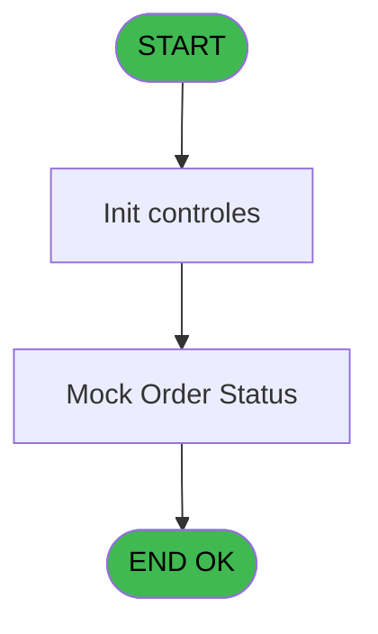
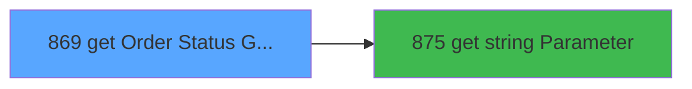

# REF IDE 869 - get Order Status Galaxy

> **Analyse**: Phases 1-4 2026-02-03 14:49 -> 14:50 (13s) | Assemblage 14:50
> **Pipeline**: V7.2 Enrichi
> **Structure**: 4 onglets (Resume | Ecrans | Donnees | Connexions)

<!-- TAB:Resume -->

## 1. FICHE D'IDENTITE

| Attribut | Valeur |
|----------|--------|
| Projet | REF |
| IDE Position | 869 |
| Nom Programme | get Order Status Galaxy |
| Fichier source | `Prg_869.xml` |
| Dossier IDE | General |
| Taches | 5 (1 ecrans visibles) |
| Tables modifiees | 0 |
| Programmes appeles | 1 |
| :warning: Statut | **ORPHELIN_POTENTIEL** |

## 2. DESCRIPTION FONCTIONNELLE

**get Order Status Galaxy** assure la gestion complete de ce processus.

Le flux de traitement s'organise en **1 blocs fonctionnels** :

- **Traitement** (5 taches) : traitements metier divers

Detail : phases du traitement

#### Phase 1 : Traitement (5 taches)

- **869** - get Order Status Galaxy
- **869.1** - Mock Order Status **[[ECRAN]](#ecran-t2)**
- **869.2** - Authentification
- **869.2.1** - Write curl
- **869.2.2** - read xml

Delegue a : [get string Parameter (IDE 875)](REF-IDE-875.md)

## 3. BLOCS FONCTIONNELS

### 3.1 Traitement (5 taches)

Traitements internes.

---

#### 869 - get Order Status Galaxy

**Role** : Consultation/chargement : get Order Status Galaxy.

4 sous-taches directes

| Tache | Nom | Bloc |
|-------|-----|------|
| [869.1](#t2) | Mock Order Status **[[ECRAN]](#ecran-t2)** | Traitement |
| [869.2](#t26) | Authentification | Traitement |
| [869.2.1](#t27) | Write curl | Traitement |
| [869.2.2](#t28) | read xml | Traitement |

**Variables liees** : A (P.i. no galaxy order), D (v. url status galaxy), G (v. NoGalaxyRetour)
**Delegue a** : [get string Parameter (IDE 875)](REF-IDE-875.md)

---

#### 869.1 - Mock Order Status [[ECRAN]](#ecran-t2)

**Role** : Traitement : Mock Order Status.
**Ecran** : 216 x 44 DLU | [Voir mockup](#ecran-t2)
**Variables liees** : A (P.i. no galaxy order), C (v. Mock Mode), D (v. url status galaxy)
**Delegue a** : [get string Parameter (IDE 875)](REF-IDE-875.md)

---

#### 869.2 - Authentification

**Role** : Traitement : Authentification.
**Delegue a** : [get string Parameter (IDE 875)](REF-IDE-875.md)

---

#### 869.2.1 - Write curl

**Role** : Traitement : Write curl.
**Variables liees** : H (v. resp_fichier_curl), I (v. cmd_curl), J (v. dmd_fichier_curl)
**Delegue a** : [get string Parameter (IDE 875)](REF-IDE-875.md)

---

#### 869.2.2 - read xml

**Role** : Traitement : read xml.
**Delegue a** : [get string Parameter (IDE 875)](REF-IDE-875.md)

## 5. REGLES METIER

*(Aucune regle metier identifiee)*

## 6. CONTEXTE

- **Appele par**: (aucun)
- **Appelle**: 1 programmes | **Tables**: 0 (W:0 R:0 L:0) | **Taches**: 5 | **Expressions**: 22

<!-- TAB:Ecrans -->

## 8. ECRANS

### 8.1 Forms visibles (1 / 5)

| # | Position | Tache | Nom | Type | Largeur | Hauteur | Bloc |
|---|----------|-------|-----|------|---------|---------|------|
| 1 | 869.1 | 869.1 | Mock Order Status | Type0 | 216 | 44 | Traitement |

### 8.2 Mockups Ecrans

---

#### 869.1 - Mock Order Status
**Tache** : [869.1](#t2) | **Type** : Type0 | **Dimensions** : 216 x 44 DLU
**Bloc** : Traitement | **Titre IDE** : Mock Order Status

<!-- FORM-DATA:
{
    "width":  216,
    "vFactor":  8,
    "type":  "Type0",
    "hFactor":  4,
    "controls":  [
                     {
                         "x":  8,
                         "type":  "label",
                         "var":  "",
                         "y":  8,
                         "w":  71,
                         "fmt":  "",
                         "name":  "",
                         "h":  9,
                         "color":  "",
                         "text":  "Pi. no galaxy order",
                         "parent":  null
                     },
                     {
                         "x":  8,
                         "type":  "label",
                         "var":  "",
                         "y":  24,
                         "w":  62,
                         "fmt":  "",
                         "name":  "",
                         "h":  9,
                         "color":  "",
                         "text":  "P.o. Validated ?",
                         "parent":  null
                     },
                     {
                         "x":  84,
                         "type":  "edit",
                         "var":  "",
                         "y":  8,
                         "w":  115,
                         "fmt":  "",
                         "name":  "Pi. no galaxy order",
                         "h":  10,
                         "color":  "",
                         "text":  "",
                         "parent":  null
                     },
                     {
                         "x":  84,
                         "type":  "combobox",
                         "var":  "",
                         "y":  24,
                         "w":  56,
                         "fmt":  "",
                         "name":  "P.o. Validated ?",
                         "h":  12,
                         "color":  "",
                         "text":  "",
                         "parent":  null
                     }
                 ],
    "taskId":  "869.1",
    "height":  44
}
-->

<strong>Champs : 2 champs</strong>

| Pos (x,y) | Nom | Variable | Type |
|-----------|-----|----------|------|
| 84,8 | Pi. no galaxy order | - | edit |
| 84,24 | P.o. Validated ? | - | combobox |

## 9. NAVIGATION

Ecran unique: **Mock Order Status**

### 9.3 Structure hierarchique (5 taches)

| Position | Tache | Type | Dimensions | Bloc |
|----------|-------|------|------------|------|
| **869.1** | [**get Order Status Galaxy** (869)](#t1) | - | - | Traitement |
| 869.1.1 | [Mock Order Status (869.1)](#t2) [mockup](#ecran-t2) | - | 216x44 | |
| 869.1.2 | [Authentification (869.2)](#t26) | - | - | |
| 869.1.3 | [Write curl (869.2.1)](#t27) | - | - | |
| 869.1.4 | [read xml (869.2.2)](#t28) | - | - | |

### 9.4 Algorigramme

> **Legende**: Vert = START/END OK | Rouge = END KO | Bleu = Decisions
> *Algorigramme auto-genere. Utiliser `/algorigramme` pour une synthese metier detaillee.*

<!-- TAB:Donnees -->

## 10. TABLES

### Tables utilisees (0)

| ID | Nom | Description | Type | R | W | L | Usages |
|----|-----|-------------|------|---|---|---|--------|

### Colonnes par table (0 / 0 tables avec colonnes identifiees)

## 11. VARIABLES

### 11.1 Parametres entrants (2)

Variables recues en parametre.

| Lettre | Nom | Type | Usage dans |
|--------|-----|------|-----------|
| A | P.i. no galaxy order | Unicode | [869](#t1), [869.1](#t2) |
| B | P.o. validated? | Logical | - |

### 11.2 Variables de session (11)

Variables persistantes pendant toute la session.

| Lettre | Nom | Type | Usage dans |
|--------|-----|------|-----------|
| C | v. Mock Mode | Logical | [869.1](#t2) |
| D | v. url status galaxy | Alpha | [869](#t1), [869.1](#t2) |
| E | v. json_response | Blob | 2x session |
| F | v. xml_response | Blob | - |
| G | v. NoGalaxyRetour | Unicode | - |
| H | v. resp_fichier_curl | Unicode | 1x session |
| I | v. cmd_curl | Unicode | - |
| J | v. dmd_fichier_curl | Unicode | 5x session |
| K | v. fichier_json | Unicode | - |
| L | v. sucess | Logical | 3x session |
| M | v. texte | Unicode | - |

## 12. EXPRESSIONS

**22 / 22 expressions decodees (100%)**

### 12.1 Repartition par type

| Type | Expressions | Regles |
|------|-------------|--------|
| CONCATENATION | 3 | 0 |
| CONSTANTE | 2 | 0 |
| FORMAT | 3 | 0 |
| OTHER | 3 | 0 |
| CONDITION | 3 | 0 |
| STRING | 8 | 0 |

### 12.2 Expressions cles par type

#### CONCATENATION (3 expressions)

| Type | IDE | Expression | Regle |
|------|-----|------------|-------|
| CONCATENATION | 10 | `Translate('%club_exe%')&'curl\bin\curl --location "'&IF(v. resp_fichier_curl [H],'https://d85a375d-70c2-452e-b943-0262847a99c3.mock.pstmn.io/order',Trim(P.i. no galaxy order [A]))&'" --header "Content-Type: application/json" > "'&Translate('%TempDir%')&Trim(v. dmd_fichier_curl [J])&'"'` | - |
| CONCATENATION | 9 | `Translate('%club_exe%')&'curl\bin\curl --location "'&Trim(P.i. no galaxy order [A])&'" --header "Content-Type: application/json" --data "@'&Translate('%TempDir%')&Trim([O])&'" > "'&Translate('%TempDir%')&Trim(v. dmd_fichier_curl [J])&'"'` | - |
| CONCATENATION | 7 | `'<?xml version="1.0" encoding="UTF-8"?>' &
ASCIIChr(13)& ASCIIChr(10)&
DotNet.System.Xml.Linq.XElement.Load(
  DotNet.System.Runtime.Serialization.Json.JsonReaderWriterFactory.CreateJsonReader( 
     v. url status galaxy [D],
     DotNet.System.Xml.XmlDictionaryReaderQuotas()
   )
).ToString()` | - |

#### CONSTANTE (2 expressions)

| Type | IDE | Expression | Regle |
|------|-----|------------|-------|
| CONSTANTE | 3 | `'IGA_ORDER_CHECK_URL'` | - |
| CONSTANTE | 2 | `'GALAXY_API'` | - |

#### FORMAT (3 expressions)

| Type | IDE | Expression | Regle |
|------|-----|------------|-------|
| FORMAT | 17 | `'galaxyorderstatus_json_'&DStr(Date(),'YYYYMMDD')&TStr(Time(),'HHMMSS')&'.json'` | - |
| FORMAT | 16 | `'galaxyorderstatus_dmd_'&DStr(Date(),'YYYYMMDD')&TStr(Time(),'HHMMSS')&'.bat'` | - |
| FORMAT | 15 | `'galaxyporderstatus_rsp_'&DStr(Date(),'YYYYMMDD')&TStr(Time(),'HHMMSS')&'.json'` | - |

#### OTHER (3 expressions)

| Type | IDE | Expression | Regle |
|------|-----|------------|-------|
| OTHER | 22 | `???` | - |
| OTHER | 6 | `v. json_response [E]` | - |
| OTHER | 1 | `v. Mock Mode [C]` | - |

#### CONDITION (3 expressions)

| Type | IDE | Expression | Regle |
|------|-----|------------|-------|
| CONDITION | 8 | `v. url status galaxy [D]<>''` | - |
| CONDITION | 5 | `v. json_response [E]<>''` | - |
| CONDITION | 4 | `Translate('%simultpe%')='O'` | - |

#### STRING (8 expressions)

| Type | IDE | Expression | Regle |
|------|-----|------------|-------|
| STRING | 19 | `FileExist(Translate('%TempDir%')&Trim(v. sucess [L]))` | - |
| STRING | 18 | `FileExist(Translate('%TempDir%')&Trim(v. dmd_fichier_curl [J]))` | - |
| STRING | 21 | `Translate('%TempDir%')&Trim(v. sucess [L])` | - |
| STRING | 20 | `FileExist(Translate('%TempDir%')&Trim([O]))` | - |
| STRING | 12 | `FileDelete(Translate('%TempDir%')&Trim(v. dmd_fichier_curl [J]))` | - |
| ... | | *+3 autres* | |

### 12.3 Toutes les expressions (22)

Voir les 22 expressions

#### CONCATENATION (3)

| IDE | Expression Decodee |
|-----|-------------------|
| 7 | `'<?xml version="1.0" encoding="UTF-8"?>' &
ASCIIChr(13)& ASCIIChr(10)&
DotNet.System.Xml.Linq.XElement.Load(
  DotNet.System.Runtime.Serialization.Json.JsonReaderWriterFactory.CreateJsonReader( 
     v. url status galaxy [D],
     DotNet.System.Xml.XmlDictionaryReaderQuotas()
   )
).ToString()` |
| 9 | `Translate('%club_exe%')&'curl\bin\curl --location "'&Trim(P.i. no galaxy order [A])&'" --header "Content-Type: application/json" --data "@'&Translate('%TempDir%')&Trim([O])&'" > "'&Translate('%TempDir%')&Trim(v. dmd_fichier_curl [J])&'"'` |
| 10 | `Translate('%club_exe%')&'curl\bin\curl --location "'&IF(v. resp_fichier_curl [H],'https://d85a375d-70c2-452e-b943-0262847a99c3.mock.pstmn.io/order',Trim(P.i. no galaxy order [A]))&'" --header "Content-Type: application/json" > "'&Translate('%TempDir%')&Trim(v. dmd_fichier_curl [J])&'"'` |

#### CONSTANTE (2)

| IDE | Expression Decodee |
|-----|-------------------|
| 2 | `'GALAXY_API'` |
| 3 | `'IGA_ORDER_CHECK_URL'` |

#### FORMAT (3)

| IDE | Expression Decodee |
|-----|-------------------|
| 15 | `'galaxyporderstatus_rsp_'&DStr(Date(),'YYYYMMDD')&TStr(Time(),'HHMMSS')&'.json'` |
| 16 | `'galaxyorderstatus_dmd_'&DStr(Date(),'YYYYMMDD')&TStr(Time(),'HHMMSS')&'.bat'` |
| 17 | `'galaxyorderstatus_json_'&DStr(Date(),'YYYYMMDD')&TStr(Time(),'HHMMSS')&'.json'` |

#### OTHER (3)

| IDE | Expression Decodee |
|-----|-------------------|
| 1 | `v. Mock Mode [C]` |
| 6 | `v. json_response [E]` |
| 22 | `???` |

#### CONDITION (3)

| IDE | Expression Decodee |
|-----|-------------------|
| 4 | `Translate('%simultpe%')='O'` |
| 5 | `v. json_response [E]<>''` |
| 8 | `v. url status galaxy [D]<>''` |

#### STRING (8)

| IDE | Expression Decodee |
|-----|-------------------|
| 11 | `File2Blb(Translate('%TempDir%')&Trim(v. dmd_fichier_curl [J]))` |
| 12 | `FileDelete(Translate('%TempDir%')&Trim(v. dmd_fichier_curl [J]))` |
| 13 | `FileDelete(Translate('%TempDir%')&Trim(v. sucess [L]))` |
| 14 | `FileDelete(Translate('%TempDir%')&Trim([O]))` |
| 18 | `FileExist(Translate('%TempDir%')&Trim(v. dmd_fichier_curl [J]))` |
| 19 | `FileExist(Translate('%TempDir%')&Trim(v. sucess [L]))` |
| 20 | `FileExist(Translate('%TempDir%')&Trim([O]))` |
| 21 | `Translate('%TempDir%')&Trim(v. sucess [L])` |

<!-- TAB:Connexions -->

## 13. GRAPHE D'APPELS

### 13.1 Chaine depuis Main (Callers)

**Chemin**: (pas de callers directs)

### 13.2 Callers

| IDE | Nom Programme | Nb Appels |
|-----|---------------|-----------|
| - | (aucun) | - |

### 13.3 Callees (programmes appeles)

### 13.4 Detail Callees avec contexte

| IDE | Nom Programme | Appels | Contexte |
|-----|---------------|--------|----------|
| [875](REF-IDE-875.md) | get string Parameter | 1 | Recuperation donnees |

## 14. RECOMMANDATIONS MIGRATION

### 14.1 Profil du programme

| Metrique | Valeur | Impact migration |
|----------|--------|-----------------|
| Lignes de logique | 58 | Programme compact |
| Expressions | 22 | Peu de logique |
| Tables WRITE | 0 | Impact faible |
| Sous-programmes | 1 | Peu de dependances |
| Ecrans visibles | 1 | Ecran unique ou traitement batch |
| Code desactive | 10.3% (6 / 58) | A verifier |
| Regles metier | 0 | Pas de regle identifiee |

### 14.2 Plan de migration par bloc

#### Traitement (5 taches: 1 ecran, 4 traitements)

- **Strategie** : Orchestrateur avec 1 ecrans (Razor/React) et 4 traitements backend (services).
- Les ecrans deviennent des composants UI, les traitements invisibles deviennent des services injectables.
- 1 sous-programme(s) a migrer ou a reutiliser depuis les services existants.
- Decomposer les taches en services unitaires testables.

### 14.3 Dependances critiques

| Dependance | Type | Appels | Impact |
|------------|------|--------|--------|
| [get string Parameter (IDE 875)](REF-IDE-875.md) | Sous-programme | 1x | Normale - Recuperation donnees |

---
*Spec DETAILED generee par Pipeline V7.2 - 2026-02-03 14:50*
