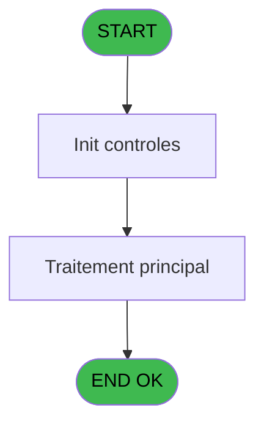

# REF IDE 870 - gen tmp order Galaxy

> **Analyse**: Phases 1-4 2026-02-03 14:50 -> 14:50 (13s) | Assemblage 14:50
> **Pipeline**: V7.2 Enrichi
> **Structure**: 4 onglets (Resume | Ecrans | Donnees | Connexions)

<!-- TAB:Resume -->

## 1. FICHE D'IDENTITE

| Attribut | Valeur |
|----------|--------|
| Projet | REF |
| IDE Position | 870 |
| Nom Programme | gen tmp order Galaxy |
| Fichier source | `Prg_870.xml` |
| Dossier IDE | General |
| Taches | 5 (0 ecrans visibles) |
| Tables modifiees | 0 |
| Programmes appeles | 0 |
| :warning: Statut | **ORPHELIN_POTENTIEL** |

## 2. DESCRIPTION FONCTIONNELLE

**gen tmp order Galaxy** assure la gestion complete de ce processus.

Le flux de traitement s'organise en **1 blocs fonctionnels** :

- **Traitement** (5 taches) : traitements metier divers

Detail : phases du traitement

#### Phase 1 : Traitement (5 taches)

- **870** - (sans nom)
- **870.1** - generate temp table Galaxy
- **870.2** - generate temp table Galaxy
- **870.3** - generate temp table Galaxy
- **870.4** - generate temp table Galaxy

## 3. BLOCS FONCTIONNELS

### 3.1 Traitement (5 taches)

Traitements internes.

---

#### 870 - (sans nom)

**Role** : Traitement interne.

---

#### 870.1 - generate temp table Galaxy

**Role** : Traitement : generate temp table Galaxy.

---

#### 870.2 - generate temp table Galaxy

**Role** : Traitement : generate temp table Galaxy.

---

#### 870.3 - generate temp table Galaxy

**Role** : Traitement : generate temp table Galaxy.

---

#### 870.4 - generate temp table Galaxy

**Role** : Traitement : generate temp table Galaxy.

## 5. REGLES METIER

*(Aucune regle metier identifiee)*

## 6. CONTEXTE

- **Appele par**: (aucun)
- **Appelle**: 0 programmes | **Tables**: 5 (W:0 R:2 L:3) | **Taches**: 5 | **Expressions**: 9

<!-- TAB:Ecrans -->

## 8. ECRANS

*(Programme sans ecran visible)*

## 9. NAVIGATION

### 9.3 Structure hierarchique (5 taches)

| Position | Tache | Type | Dimensions | Bloc |
|----------|-------|------|------------|------|
| **870.1** | [**(sans nom)** (870)](#t2) | - | - | Traitement |
| 870.1.1 | [generate temp table Galaxy (870.1)](#t6) | - | - | |
| 870.1.2 | [generate temp table Galaxy (870.2)](#t10) | - | - | |
| 870.1.3 | [generate temp table Galaxy (870.3)](#t13) | - | - | |
| 870.1.4 | [generate temp table Galaxy (870.4)](#t17) | - | - | |

### 9.4 Algorigramme

> **Legende**: Vert = START/END OK | Rouge = END KO | Bleu = Decisions
> *Algorigramme auto-genere. Utiliser `/algorigramme` pour une synthese metier detaillee.*

<!-- TAB:Donnees -->

## 10. TABLES

### Tables utilisees (5)

| ID | Nom | Description | Type | R | W | L | Usages |
|----|-----|-------------|------|---|---|---|--------|
| 40 | comptable________cte |  | DB | R |   |   | 3 |
| 263 | vente | Donnees de ventes | DB | R |   |   | 1 |
| 578 | saisie_od_taiforfait |  | TMP |   |   | L | 1 |
| 962 | pms_galaxy_corresp |  | DB |   |   | L | 4 |
| 963 | art_galaxy_cumul |  | DB |   |   | L | 4 |

### Colonnes par table (1 / 2 tables avec colonnes identifiees)

Table 40 - comptable________cte (R) - 3 usages

*Table utilisee uniquement en Link ou aucune colonne Real identifiee dans le DataView.*

Table 263 - vente (R) - 1 usages

| Lettre | Variable | Acces | Type |
|--------|----------|-------|------|
| A | P.i. Vente / Solde (V/S) | R | Unicode |

## 11. VARIABLES

### 11.1 Parametres entrants (5)

Variables recues en parametre.

| Lettre | Nom | Type | Usage dans |
|--------|-----|------|-----------|
| A | P.i. Vente / Solde (V/S) | Unicode | 2x parametre entrant |
| B | P.i. Compte GM | Numeric | - |
| C | P.i. Filiation GM | Numeric | - |
| D | P.i. Date Sld | Date | - |
| E | P.i. Heure Sld | Time | - |

## 12. EXPRESSIONS

**9 / 9 expressions decodees (100%)**

### 12.1 Repartition par type

| Type | Expressions | Regles |
|------|-------------|--------|
| CALCULATION | 2 | 0 |
| CONSTANTE | 2 | 0 |
| CONDITION | 2 | 0 |
| OTHER | 3 | 0 |

### 12.2 Expressions cles par type

#### CALCULATION (2 expressions)

| Type | IDE | Expression | Regle |
|------|-----|------------|-------|
| CALCULATION | 5 | `[AF]+[G]` | - |
| CALCULATION | 3 | `DbDel('{963,-1}'DSOURCE,'')` | - |

#### CONSTANTE (2 expressions)

| Type | IDE | Expression | Regle |
|------|-----|------------|-------|
| CONSTANTE | 8 | `'V'` | - |
| CONSTANTE | 7 | `'MOP'` | - |

#### CONDITION (2 expressions)

| Type | IDE | Expression | Regle |
|------|-----|------------|-------|
| CONDITION | 2 | `P.i. Vente / Solde (V/S) [A]='S'` | - |
| CONDITION | 1 | `P.i. Vente / Solde (V/S) [A]='V'` | - |

#### OTHER (3 expressions)

| Type | IDE | Expression | Regle |
|------|-----|------------|-------|
| OTHER | 9 | `[U]` | - |
| OTHER | 6 | `{1,4}` | - |
| OTHER | 4 | `[AA]` | - |

<!-- TAB:Connexions -->

## 13. GRAPHE D'APPELS

### 13.1 Chaine depuis Main (Callers)

**Chemin**: (pas de callers directs)

### 13.2 Callers

| IDE | Nom Programme | Nb Appels |
|-----|---------------|-----------|
| - | (aucun) | - |

### 13.3 Callees (programmes appeles)

### 13.4 Detail Callees avec contexte

| IDE | Nom Programme | Appels | Contexte |
|-----|---------------|--------|----------|
| - | (aucun) | - | - |

## 14. RECOMMANDATIONS MIGRATION

### 14.1 Profil du programme

| Metrique | Valeur | Impact migration |
|----------|--------|-----------------|
| Lignes de logique | 125 | Programme compact |
| Expressions | 9 | Peu de logique |
| Tables WRITE | 0 | Impact faible |
| Sous-programmes | 0 | Peu de dependances |
| Ecrans visibles | 0 | Ecran unique ou traitement batch |
| Code desactive | 0% (0 / 125) | Code sain |
| Regles metier | 0 | Pas de regle identifiee |

### 14.2 Plan de migration par bloc

#### Traitement (5 taches: 0 ecran, 5 traitements)

- **Strategie** : 5 service(s) backend injectable(s) (Domain Services).
- Decomposer les taches en services unitaires testables.

### 14.3 Dependances critiques

| Dependance | Type | Appels | Impact |
|------------|------|--------|--------|

---
*Spec DETAILED generee par Pipeline V7.2 - 2026-02-03 14:50*
