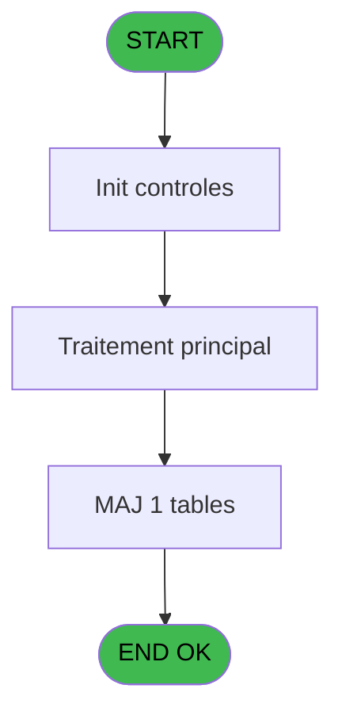
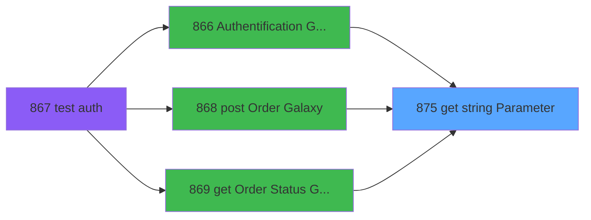

# REF IDE 875 - get string Parameter

> **Analyse**: Phases 1-4 2026-02-03 14:51 -> 14:51 (13s) | Assemblage 14:51
> **Pipeline**: V7.2 Enrichi
> **Structure**: 4 onglets (Resume | Ecrans | Donnees | Connexions)

<!-- TAB:Resume -->

## 1. FICHE D'IDENTITE

| Attribut | Valeur |
|----------|--------|
| Projet | REF |
| IDE Position | 875 |
| Nom Programme | get string Parameter |
| Fichier source | `Prg_875.xml` |
| Dossier IDE | General |
| Taches | 1 (0 ecrans visibles) |
| Tables modifiees | 1 |
| Programmes appeles | 0 |

## 2. DESCRIPTION FONCTIONNELLE

**get string Parameter** assure la gestion complete de ce processus, accessible depuis [post Order Galaxy (IDE 868)](REF-IDE-868.md), [Authentification Galaxy (IDE 866)](REF-IDE-866.md), [get Order Status Galaxy (IDE 869)](REF-IDE-869.md).

Le flux de traitement s'organise en **1 blocs fonctionnels** :

- **Traitement** (1 tache) : traitements metier divers

**Donnees modifiees** : 1 tables en ecriture (Paramètres Odyssey).

## 3. BLOCS FONCTIONNELS

### 3.1 Traitement (1 tache)

Traitements internes.

---

#### 875 - get string Parameter

**Role** : Consultation/chargement : get string Parameter.

## 5. REGLES METIER

*(Aucune regle metier identifiee)*

## 6. CONTEXTE

- **Appele par**: [post Order Galaxy (IDE 868)](REF-IDE-868.md), [Authentification Galaxy (IDE 866)](REF-IDE-866.md), [get Order Status Galaxy (IDE 869)](REF-IDE-869.md)
- **Appelle**: 0 programmes | **Tables**: 1 (W:1 R:0 L:0) | **Taches**: 1 | **Expressions**: 3

<!-- TAB:Ecrans -->

## 8. ECRANS

*(Programme sans ecran visible)*

## 9. NAVIGATION

### 9.3 Structure hierarchique (1 tache)

| Position | Tache | Type | Dimensions | Bloc |
|----------|-------|------|------------|------|
| **875.1** | [**get string Parameter** (875)](#t1) | - | - | Traitement |

### 9.4 Algorigramme

> **Legende**: Vert = START/END OK | Rouge = END KO | Bleu = Decisions
> *Algorigramme auto-genere. Utiliser `/algorigramme` pour une synthese metier detaillee.*

<!-- TAB:Donnees -->

## 10. TABLES

### Tables utilisees (1)

| ID | Nom | Description | Type | R | W | L | Usages |
|----|-----|-------------|------|---|---|---|--------|
| 938 | Paramètres Odyssey |  | DB |   | **W** |   | 1 |

### Colonnes par table (1 / 1 tables avec colonnes identifiees)

Table 938 - Paramètres Odyssey (**W**) - 1 usages

| Lettre | Variable | Acces | Type |
|--------|----------|-------|------|
| A | P.i. PRM_KEY | W | Alpha |
| B | P.i. PRM_GROUPE | W | Alpha |
| C | P.o. PRM_VAL | W | Alpha |

## 11. VARIABLES

### 11.1 Parametres entrants (3)

Variables recues du programme appelant ([post Order Galaxy (IDE 868)](REF-IDE-868.md)).

| Lettre | Nom | Type | Usage dans |
|--------|-----|------|-----------|
| A | P.i. PRM_KEY | Alpha | - |
| B | P.i. PRM_GROUPE | Alpha | 1x parametre entrant |
| C | P.o. PRM_VAL | Alpha | 1x parametre entrant |

## 12. EXPRESSIONS

**3 / 3 expressions decodees (100%)**

### 12.1 Repartition par type

| Type | Expressions | Regles |
|------|-------------|--------|
| OTHER | 1 | 0 |
| STRING | 2 | 0 |

### 12.2 Expressions cles par type

#### OTHER (1 expressions)

| Type | IDE | Expression | Regle |
|------|-----|------------|-------|
| OTHER | 3 | `[G]` | - |

#### STRING (2 expressions)

| Type | IDE | Expression | Regle |
|------|-----|------------|-------|
| STRING | 2 | `Trim(P.o. PRM_VAL [C])` | - |
| STRING | 1 | `Trim(P.i. PRM_GROUPE [B])` | - |

<!-- TAB:Connexions -->

## 13. GRAPHE D'APPELS

### 13.1 Chaine depuis Main (Callers)

Main -> ... -> [post Order Galaxy (IDE 868)](REF-IDE-868.md) -> **get string Parameter (IDE 875)**

Main -> ... -> [Authentification Galaxy (IDE 866)](REF-IDE-866.md) -> **get string Parameter (IDE 875)**

Main -> ... -> [get Order Status Galaxy (IDE 869)](REF-IDE-869.md) -> **get string Parameter (IDE 875)**

### 13.2 Callers

| IDE | Nom Programme | Nb Appels |
|-----|---------------|-----------|
| [868](REF-IDE-868.md) | post Order Galaxy | 2 |
| [866](REF-IDE-866.md) | Authentification Galaxy | 1 |
| [869](REF-IDE-869.md) | get Order Status Galaxy | 1 |

### 13.3 Callees (programmes appeles)

### 13.4 Detail Callees avec contexte

| IDE | Nom Programme | Appels | Contexte |
|-----|---------------|--------|----------|
| - | (aucun) | - | - |

## 14. RECOMMANDATIONS MIGRATION

### 14.1 Profil du programme

| Metrique | Valeur | Impact migration |
|----------|--------|-----------------|
| Lignes de logique | 8 | Programme compact |
| Expressions | 3 | Peu de logique |
| Tables WRITE | 1 | Impact faible |
| Sous-programmes | 0 | Peu de dependances |
| Ecrans visibles | 0 | Ecran unique ou traitement batch |
| Code desactive | 0% (0 / 8) | Code sain |
| Regles metier | 0 | Pas de regle identifiee |

### 14.2 Plan de migration par bloc

#### Traitement (1 tache: 0 ecran, 1 traitement)

- **Strategie** : 1 service(s) backend injectable(s) (Domain Services).
- Decomposer les taches en services unitaires testables.

### 14.3 Dependances critiques

| Dependance | Type | Appels | Impact |
|------------|------|--------|--------|
| Paramètres Odyssey | Table WRITE (Database) | 1x | Schema + repository |

---
*Spec DETAILED generee par Pipeline V7.2 - 2026-02-03 14:51*
