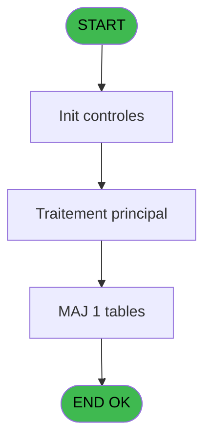

# REF IDE 876 - Gestion TPE Axis

> **Analyse**: Phases 1-4 2026-02-03 14:52 -> 14:52 (14s) | Assemblage 14:52
> **Pipeline**: V7.2 Enrichi
> **Structure**: 4 onglets (Resume | Ecrans | Donnees | Connexions)

<!-- TAB:Resume -->

## 1. FICHE D'IDENTITE

| Attribut | Valeur |
|----------|--------|
| Projet | REF |
| IDE Position | 876 |
| Nom Programme | Gestion TPE Axis |
| Fichier source | `Prg_876.xml` |
| Dossier IDE | General |
| Taches | 4 (1 ecrans visibles) |
| Tables modifiees | 1 |
| Programmes appeles | 0 |
| :warning: Statut | **ORPHELIN_POTENTIEL** |

## 2. DESCRIPTION FONCTIONNELLE

**Gestion TPE Axis** assure la gestion complete de ce processus.

Le flux de traitement s'organise en **2 blocs fonctionnels** :

- **Traitement** (3 taches) : traitements metier divers
- **Saisie** (1 tache) : ecrans de saisie utilisateur (formulaires, champs, donnees)

**Donnees modifiees** : 1 tables en ecriture (compteurs________cpt).

Detail : phases du traitement

#### Phase 1 : Traitement (3 taches)

- **876** - Gestion TPE Axis **[[ECRAN]](#ecran-t1)**
- **876.2** - Generation Fichier Commande
- **876.3** - Generation Fichier Commande

#### Phase 2 : Saisie (1 tache)

- **876.1** - Num Dossier Vente

#### Tables impactees

| Table | Operations | Role metier |
|-------|-----------|-------------|
| compteurs________cpt | **W** (1 usages) | Comptes GM (generaux) |

## 3. BLOCS FONCTIONNELS

### 3.1 Traitement (3 taches)

Traitements internes.

---

#### 876 - Gestion TPE Axis [[ECRAN]](#ecran-t1)

**Role** : Gestion du moyen de paiement : Gestion TPE Axis.
**Ecran** : 722 x 416 DLU | [Voir mockup](#ecran-t1)
**Variables liees** : K (p.Num Dossier Axis)

---

#### 876.2 - Generation Fichier Commande

**Role** : Traitement : Generation Fichier Commande.
**Variables liees** : Q (Message Commande)

---

#### 876.3 - Generation Fichier Commande

**Role** : Traitement : Generation Fichier Commande.
**Variables liees** : Q (Message Commande)

### 3.2 Saisie (1 tache)

Ce bloc traite la saisie des donnees de la transaction.

---

#### 876.1 - Num Dossier Vente

**Role** : Saisie des donnees : Num Dossier Vente.
**Variables liees** : J (p.Num Dossier PMS), K (p.Num Dossier Axis)

## 5. REGLES METIER

*(Aucune regle metier identifiee)*

## 6. CONTEXTE

- **Appele par**: (aucun)
- **Appelle**: 0 programmes | **Tables**: 1 (W:1 R:0 L:0) | **Taches**: 4 | **Expressions**: 14

<!-- TAB:Ecrans -->

## 8. ECRANS

### 8.1 Forms visibles (1 / 4)

| # | Position | Tache | Nom | Type | Largeur | Hauteur | Bloc |
|---|----------|-------|-----|------|---------|---------|------|
| 1 | 876 | 876 | Gestion TPE Axis | Type0 | 722 | 416 | Traitement |

### 8.2 Mockups Ecrans

---

#### 876 - Gestion TPE Axis
**Tache** : [876](#t1) | **Type** : Type0 | **Dimensions** : 722 x 416 DLU
**Bloc** : Traitement | **Titre IDE** : Gestion TPE Axis

<!-- FORM-DATA:
{
    "width":  722,
    "vFactor":  8,
    "type":  "Type0",
    "hFactor":  4,
    "controls":  [
                     {
                         "x":  52,
                         "type":  "label",
                         "var":  "",
                         "y":  16,
                         "w":  60,
                         "fmt":  "",
                         "name":  "",
                         "h":  9,
                         "color":  "",
                         "text":  "p.Code Societe",
                         "parent":  null
                     },
                     {
                         "x":  52,
                         "type":  "label",
                         "var":  "",
                         "y":  32,
                         "w":  56,
                         "fmt":  "",
                         "name":  "",
                         "h":  9,
                         "color":  "",
                         "text":  "p.Code Village",
                         "parent":  null
                     },
                     {
                         "x":  52,
                         "type":  "label",
                         "var":  "",
                         "y":  48,
                         "w":  54,
                         "fmt":  "",
                         "name":  "",
                         "h":  9,
                         "color":  "",
                         "text":  "p.Num Caisse",
                         "parent":  null
                     },
                     {
                         "x":  56,
                         "type":  "label",
                         "var":  "",
                         "y":  64,
                         "w":  46,
                         "fmt":  "",
                         "name":  "",
                         "h":  9,
                         "color":  "",
                         "text":  "p.Num TPE",
                         "parent":  null
                     },
                     {
                         "x":  56,
                         "type":  "label",
                         "var":  "",
                         "y":  80,
                         "w":  42,
                         "fmt":  "",
                         "name":  "",
                         "h":  9,
                         "color":  "",
                         "text":  "p. Montant",
                         "parent":  null
                     },
                     {
                         "x":  56,
                         "type":  "label",
                         "var":  "",
                         "y":  104,
                         "w":  46,
                         "fmt":  "",
                         "name":  "",
                         "h":  9,
                         "color":  "",
                         "text":  "p.Operation",
                         "parent":  null
                     },
                     {
                         "x":  56,
                         "type":  "label",
                         "var":  "",
                         "y":  120,
                         "w":  58,
                         "fmt":  "",
                         "name":  "",
                         "h":  9,
                         "color":  "",
                         "text":  "p.Code Devise",
                         "parent":  null
                     },
                     {
                         "x":  56,
                         "type":  "label",
                         "var":  "",
                         "y":  136,
                         "w":  66,
                         "fmt":  "",
                         "name":  "",
                         "h":  9,
                         "color":  "",
                         "text":  "p.Code Adherent",
                         "parent":  null
                     },
                     {
                         "x":  60,
                         "type":  "label",
                         "var":  "",
                         "y":  160,
                         "w":  37,
                         "fmt":  "",
                         "name":  "",
                         "h":  9,
                         "color":  "",
                         "text":  "p.Filiation",
                         "parent":  null
                     },
                     {
                         "x":  60,
                         "type":  "label",
                         "var":  "",
                         "y":  176,
                         "w":  78,
                         "fmt":  "",
                         "name":  "",
                         "h":  9,
                         "color":  "",
                         "text":  "p.Num Dossier PMS",
                         "parent":  null
                     },
                     {
                         "x":  56,
                         "type":  "label",
                         "var":  "",
                         "y":  192,
                         "w":  74,
                         "fmt":  "",
                         "name":  "",
                         "h":  9,
                         "color":  "",
                         "text":  "p.Num Dossier Axis",
                         "parent":  null
                     },
                     {
                         "x":  56,
                         "type":  "label",
                         "var":  "",
                         "y":  208,
                         "w":  28,
                         "fmt":  "",
                         "name":  "",
                         "h":  9,
                         "color":  "",
                         "text":  "p.MOP",
                         "parent":  null
                     },
                     {
                         "x":  56,
                         "type":  "label",
                         "var":  "",
                         "y":  224,
                         "w":  84,
                         "fmt":  "",
                         "name":  "",
                         "h":  9,
                         "color":  "",
                         "text":  "p.Transaction Validée",
                         "parent":  null
                     },
                     {
                         "x":  28,
                         "type":  "label",
                         "var":  "",
                         "y":  248,
                         "w":  68,
                         "fmt":  "",
                         "name":  "",
                         "h":  9,
                         "color":  "",
                         "text":  "p.Message Erreur",
                         "parent":  null
                     },
                     {
                         "x":  116,
                         "type":  "edit",
                         "var":  "",
                         "y":  16,
                         "w":  9,
                         "fmt":  "",
                         "name":  "p.Code Societe",
                         "h":  10,
                         "color":  "",
                         "text":  "",
                         "parent":  null
                     },
                     {
                         "x":  112,
                         "type":  "edit",
                         "var":  "",
                         "y":  32,
                         "w":  20,
                         "fmt":  "",
                         "name":  "p.Code Village",
                         "h":  10,
                         "color":  "",
                         "text":  "",
                         "parent":  null
                     },
                     {
                         "x":  110,
                         "type":  "edit",
                         "var":  "",
                         "y":  48,
                         "w":  48,
                         "fmt":  "",
                         "name":  "p.Num Caisse",
                         "h":  10,
                         "color":  "",
                         "text":  "",
                         "parent":  null
                     },
                     {
                         "x":  106,
                         "type":  "edit",
                         "var":  "",
                         "y":  64,
                         "w":  48,
                         "fmt":  "",
                         "name":  "p.Num TPE",
                         "h":  10,
                         "color":  "",
                         "text":  "",
                         "parent":  null
                     },
                     {
                         "x":  102,
                         "type":  "edit",
                         "var":  "",
                         "y":  80,
                         "w":  66,
                         "fmt":  "",
                         "name":  "p. Montant",
                         "h":  10,
                         "color":  "",
                         "text":  "",
                         "parent":  null
                     },
                     {
                         "x":  106,
                         "type":  "edit",
                         "var":  "",
                         "y":  104,
                         "w":  9,
                         "fmt":  "",
                         "name":  "p.Operation",
                         "h":  10,
                         "color":  "",
                         "text":  "",
                         "parent":  null
                     },
                     {
                         "x":  118,
                         "type":  "edit",
                         "var":  "",
                         "y":  120,
                         "w":  20,
                         "fmt":  "",
                         "name":  "p.Code Devise",
                         "h":  10,
                         "color":  "",
                         "text":  "",
                         "parent":  null
                     },
                     {
                         "x":  126,
                         "type":  "edit",
                         "var":  "",
                         "y":  136,
                         "w":  46,
                         "fmt":  "",
                         "name":  "p.Code Adherent",
                         "h":  10,
                         "color":  "",
                         "text":  "",
                         "parent":  null
                     },
                     {
                         "x":  101,
                         "type":  "edit",
                         "var":  "",
                         "y":  160,
                         "w":  18,
                         "fmt":  "",
                         "name":  "p.Filiation",
                         "h":  10,
                         "color":  "",
                         "text":  "",
                         "parent":  null
                     },
                     {
                         "x":  142,
                         "type":  "edit",
                         "var":  "",
                         "y":  176,
                         "w":  182,
                         "fmt":  "",
                         "name":  "p.Num Dossier PMS",
                         "h":  10,
                         "color":  "",
                         "text":  "",
                         "parent":  null
                     },
                     {
                         "x":  134,
                         "type":  "edit",
                         "var":  "",
                         "y":  192,
                         "w":  182,
                         "fmt":  "",
                         "name":  "p.Num Dossier Axis",
                         "h":  10,
                         "color":  "",
                         "text":  "",
                         "parent":  null
                     },
                     {
                         "x":  88,
                         "type":  "edit",
                         "var":  "",
                         "y":  208,
                         "w":  26,
                         "fmt":  "",
                         "name":  "p.MOP",
                         "h":  10,
                         "color":  "",
                         "text":  "",
                         "parent":  null
                     },
                     {
                         "x":  144,
                         "type":  "edit",
                         "var":  "",
                         "y":  224,
                         "w":  31,
                         "fmt":  "",
                         "name":  "p.Transaction Validée",
                         "h":  10,
                         "color":  "",
                         "text":  "",
                         "parent":  null
                     },
                     {
                         "x":  100,
                         "type":  "edit",
                         "var":  "",
                         "y":  248,
                         "w":  506,
                         "fmt":  "",
                         "name":  "p.Message Erreur",
                         "h":  10,
                         "color":  "",
                         "text":  "",
                         "parent":  null
                     }
                 ],
    "taskId":  "876",
    "height":  416
}
-->

<strong>Champs : 14 champs</strong>

| Pos (x,y) | Nom | Variable | Type |
|-----------|-----|----------|------|
| 116,16 | p.Code Societe | - | edit |
| 112,32 | p.Code Village | - | edit |
| 110,48 | p.Num Caisse | - | edit |
| 106,64 | p.Num TPE | - | edit |
| 102,80 | p. Montant | - | edit |
| 106,104 | p.Operation | - | edit |
| 118,120 | p.Code Devise | - | edit |
| 126,136 | p.Code Adherent | - | edit |
| 101,160 | p.Filiation | - | edit |
| 142,176 | p.Num Dossier PMS | - | edit |
| 134,192 | p.Num Dossier Axis | - | edit |
| 88,208 | p.MOP | - | edit |
| 144,224 | p.Transaction Validée | - | edit |
| 100,248 | p.Message Erreur | - | edit |

## 9. NAVIGATION

Ecran unique: **Gestion TPE Axis**

### 9.3 Structure hierarchique (4 taches)

| Position | Tache | Type | Dimensions | Bloc |
|----------|-------|------|------------|------|
| **876.1** | [**Gestion TPE Axis** (876)](#t1) [mockup](#ecran-t1) | - | 722x416 | Traitement |
| 876.1.1 | [Generation Fichier Commande (876.2)](#t3) | - | - | |
| 876.1.2 | [Generation Fichier Commande (876.3)](#t4) | - | - | |
| **876.2** | [**Num Dossier Vente** (876.1)](#t2) | - | - | Saisie |

### 9.4 Algorigramme

> **Legende**: Vert = START/END OK | Rouge = END KO | Bleu = Decisions
> *Algorigramme auto-genere. Utiliser `/algorigramme` pour une synthese metier detaillee.*

<!-- TAB:Donnees -->

## 10. TABLES

### Tables utilisees (1)

| ID | Nom | Description | Type | R | W | L | Usages |
|----|-----|-------------|------|---|---|---|--------|
| 68 | compteurs________cpt | Comptes GM (generaux) | DB |   | **W** |   | 1 |

### Colonnes par table (0 / 1 tables avec colonnes identifiees)

Table 68 - compteurs________cpt (**W**) - 1 usages

*Table utilisee uniquement en Link ou aucune colonne Real identifiee dans le DataView.*

## 11. VARIABLES

### 11.1 Parametres entrants (16)

Variables recues en parametre.

| Lettre | Nom | Type | Usage dans |
|--------|-----|------|-----------|
| A | p.Code Societe | Alpha | - |
| B | p.Code Village | Alpha | 1x parametre entrant |
| C | p.Num Caisse | Alpha | 2x parametre entrant |
| D | p.Num TPE | Alpha | 3x parametre entrant |
| E | p. Montant | Numeric | 2x parametre entrant |
| F | p.Operation | Alpha | 6x parametre entrant |
| G | p.Code Devise | Alpha | 2x parametre entrant |
| H | p.Code Adherent | Numeric | 1x parametre entrant |
| I | p.Filiation | Numeric | 1x parametre entrant |
| J | p.Num Dossier PMS | Alpha | [876.1](#t2) |
| K | p.Num Dossier Axis | Alpha | - |
| L | p.Num Autorisation | Alpha | - |
| M | p. C3 Signature | Alpha | - |
| N | p.MOP | Alpha | - |
| O | p.Transaction Validée | Logical | - |
| P | p.Message Erreur | Alpha | - |

### 11.2 Variables de session (4)

Variables persistantes pendant toute la session.

| Lettre | Nom | Type | Usage dans |
|--------|-----|------|-----------|
| S | v.Code Reponse | Alpha | - |
| T | v.Code Erreur | Alpha | - |
| U | v. C3 Type Carte | Alpha | - |
| V | v. C3 Sous Type | Alpha | - |

### 11.3 Autres (2)

Variables diverses.

| Lettre | Nom | Type | Usage dans |
|--------|-----|------|-----------|
| Q | Message Commande | Alpha | - |
| R | Message Reponse | Alpha | - |

Toutes les 22 variables (liste complete)

| Cat | Lettre | Nom Variable | Type |
|-----|--------|--------------|------|
| P0 | **A** | p.Code Societe | Alpha |
| P0 | **B** | p.Code Village | Alpha |
| P0 | **C** | p.Num Caisse | Alpha |
| P0 | **D** | p.Num TPE | Alpha |
| P0 | **E** | p. Montant | Numeric |
| P0 | **F** | p.Operation | Alpha |
| P0 | **G** | p.Code Devise | Alpha |
| P0 | **H** | p.Code Adherent | Numeric |
| P0 | **I** | p.Filiation | Numeric |
| P0 | **J** | p.Num Dossier PMS | Alpha |
| P0 | **K** | p.Num Dossier Axis | Alpha |
| P0 | **L** | p.Num Autorisation | Alpha |
| P0 | **M** | p. C3 Signature | Alpha |
| P0 | **N** | p.MOP | Alpha |
| P0 | **O** | p.Transaction Validée | Logical |
| P0 | **P** | p.Message Erreur | Alpha |
| V. | **S** | v.Code Reponse | Alpha |
| V. | **T** | v.Code Erreur | Alpha |
| V. | **U** | v. C3 Type Carte | Alpha |
| V. | **V** | v. C3 Sous Type | Alpha |
| Autre | **Q** | Message Commande | Alpha |
| Autre | **R** | Message Reponse | Alpha |

## 12. EXPRESSIONS

**14 / 14 expressions decodees (100%)**

### 12.1 Repartition par type

| Type | Expressions | Regles |
|------|-------------|--------|
| FORMAT | 5 | 0 |
| CONSTANTE | 2 | 0 |
| CONCATENATION | 2 | 0 |
| OTHER | 1 | 0 |
| CONDITION | 2 | 0 |
| CAST_LOGIQUE | 1 | 0 |
| STRING | 1 | 0 |

### 12.2 Expressions cles par type

#### FORMAT (5 expressions)

| Type | IDE | Expression | Regle |
|------|-----|------------|-------|
| FORMAT | 2 | `InStr('DCA',p.Operation [F])>0` | - |
| FORMAT | 3 | `InStr('NG',p.Operation [F])>0` | - |
| FORMAT | 9 | `'A'&p.Code Village [B]&Str(p.Code Adherent [H],'9P0')&Str(p.Filiation [I],'3P0')&DStr(Date(),'YYYYMMDD')` | - |
| FORMAT | 10 | `Str(p. Montant [E]*100,'12P0')&p.Code Devise [G]&Fill(' ',15)&'M'&'0 0 1'&p.Num TPE [D]&p.Num Caisse [C]&Fill(' ',129)&p.Num Dossier PMS [J]&Fill(' ',61)&IF(p.Operation [F]='G','1','3')` | - |
| FORMAT | 1 | `Str(p. Montant [E]*100,'12P0')&p.Code Devise [G]&Fill(' ',15)&CASE(p.Operation [F],'D','C','C','D','A','U','C')&'0 0 1'&p.Num TPE [D]&p.Num Caisse [C]&Fill(' ',74)&'0'&Fill(' ',54)&p.Num Dossier PMS [J]&Fill(' ',62)&'1'` | - |

#### CONSTANTE (2 expressions)

| Type | IDE | Expression | Regle |
|------|-----|------------|-------|
| CONSTANTE | 13 | `'Errreur type carte'` | - |
| CONSTANTE | 11 | `'AMEX'` | - |

#### CONCATENATION (2 expressions)

| Type | IDE | Expression | Regle |
|------|-----|------------|-------|
| CONCATENATION | 6 | `Fill(' ',30)&'A'&Fill(' ',5)&p.Num TPE [D]` | - |
| CONCATENATION | 4 | `Translate('%club_command%ingenico.bat')&' '&Left(Translate('%club_tpe%'),1)&' '&Translate('%club_tpe%')` | - |

#### OTHER (1 expressions)

| Type | IDE | Expression | Regle |
|------|-----|------------|-------|
| OTHER | 5 | `Delay(20)` | - |

#### CONDITION (2 expressions)

| Type | IDE | Expression | Regle |
|------|-----|------------|-------|
| CONDITION | 8 | `p.Operation [F]<>'I'` | - |
| CONDITION | 7 | `p.Operation [F]='I'` | - |

#### CAST_LOGIQUE (1 expressions)

| Type | IDE | Expression | Regle |
|------|-----|------------|-------|
| CAST_LOGIQUE | 12 | `'FALSE'LOG` | - |

#### STRING (1 expressions)

| Type | IDE | Expression | Regle |
|------|-----|------------|-------|
| STRING | 14 | `'AXIS'&Trim(p.Num Dossier PMS [J])` | - |

<!-- TAB:Connexions -->

## 13. GRAPHE D'APPELS

### 13.1 Chaine depuis Main (Callers)

**Chemin**: (pas de callers directs)

### 13.2 Callers

| IDE | Nom Programme | Nb Appels |
|-----|---------------|-----------|
| - | (aucun) | - |

### 13.3 Callees (programmes appeles)

### 13.4 Detail Callees avec contexte

| IDE | Nom Programme | Appels | Contexte |
|-----|---------------|--------|----------|
| - | (aucun) | - | - |

## 14. RECOMMANDATIONS MIGRATION

### 14.1 Profil du programme

| Metrique | Valeur | Impact migration |
|----------|--------|-----------------|
| Lignes de logique | 85 | Programme compact |
| Expressions | 14 | Peu de logique |
| Tables WRITE | 1 | Impact faible |
| Sous-programmes | 0 | Peu de dependances |
| Ecrans visibles | 1 | Ecran unique ou traitement batch |
| Code desactive | 2.4% (2 / 85) | Code sain |
| Regles metier | 0 | Pas de regle identifiee |

### 14.2 Plan de migration par bloc

#### Traitement (3 taches: 1 ecran, 2 traitements)

- **Strategie** : Orchestrateur avec 1 ecrans (Razor/React) et 2 traitements backend (services).
- Les ecrans deviennent des composants UI, les traitements invisibles deviennent des services injectables.
- Decomposer les taches en services unitaires testables.

#### Saisie (1 tache: 0 ecran, 1 traitement)

- **Strategie** : Formulaire React/Blazor avec validation Zod/FluentValidation.
- Validation temps reel cote client + serveur

### 14.3 Dependances critiques

| Dependance | Type | Appels | Impact |
|------------|------|--------|--------|
| compteurs________cpt | Table WRITE (Database) | 1x | Schema + repository |

---
*Spec DETAILED generee par Pipeline V7.2 - 2026-02-03 14:52*
