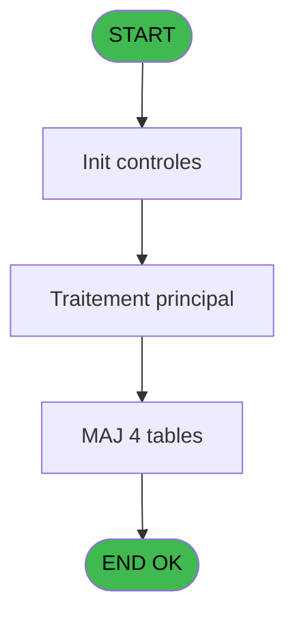

# REF IDE 877 - Calcul effectif quoti 071215

> **Analyse**: Phases 1-4 2026-02-03 14:52 -> 14:52 (13s) | Assemblage 14:52
> **Pipeline**: V7.2 Enrichi
> **Structure**: 4 onglets (Resume | Ecrans | Donnees | Connexions)

<!-- TAB:Resume -->

## 1. FICHE D'IDENTITE

| Attribut | Valeur |
|----------|--------|
| Projet | REF |
| IDE Position | 877 |
| Nom Programme | Calcul effectif quoti 071215 |
| Fichier source | `Prg_877.xml` |
| Dossier IDE | General |
| Taches | 23 (0 ecrans visibles) |
| Tables modifiees | 4 |
| Programmes appeles | 0 |
| :warning: Statut | **ORPHELIN_POTENTIEL** |

## 2. DESCRIPTION FONCTIONNELLE

**Calcul effectif quoti 071215** assure la gestion complete de ce processus.

Le flux de traitement s'organise en **3 blocs fonctionnels** :

- **Traitement** (20 taches) : traitements metier divers
- **Calcul** (2 taches) : calculs de montants, stocks ou compteurs
- **Initialisation** (1 tache) : reinitialisation d'etats et de variables de travail

**Donnees modifiees** : 4 tables en ecriture (hebergement______heb, societe__________soc, absences_personnel, vrl_hp).

Detail : phases du traitement

#### Phase 1 : Traitement (20 taches)

- **877** - (sans nom)
- **877.1.1** - Mise à jour effectif quotidien
- **877.1.2** - Mise à jour effectif quotidien
- **877.1.3** - Mise à jour effectif quotidien
- **877.2.1** - Vrl
- **877.2.2** - Traitement deval val diff
- **877.2.2.1** - Del effectif personnes inexist
- **877.2.2.2** - Maj personnes
- **877.2.3** - Vrl
- **877.2.4** - Vrl
- **877.2.5** - Vrl
- **877.2.6** - Vrl
- **877.2.7** - Realise
- **877.2.7.1** - Maj personnes
- **877.2.7.2** - Del effectif personnes inexist
- **877.2.7.2.1** - Maj personnes
- **877.2.8** - Previsionnel
- **877.2.9** - Vrl
- **877.2.10** - Correctif repas hors village
- **877.2.11** - delete eff quotidien SQL

#### Phase 2 : Initialisation (1 tache)

- **877.1** - Initialisation lieu sejour

#### Phase 3 : Calcul (2 taches)

- **877.2** - Calcul effectif quotidien **[[ECRAN]](#ecran-t6)**
- **877.2.2.3** - Calcul JH absence

#### Tables impactees

| Table | Operations | Role metier |
|-------|-----------|-------------|
| hebergement______heb | R/**W**/L (11 usages) | Hebergement (chambres) |
| vrl_hp | R/**W**/L (5 usages) |  |
| absences_personnel | **W**/L (3 usages) |  |
| societe__________soc | **W** (2 usages) |  |

## 3. BLOCS FONCTIONNELS

### 3.1 Traitement (20 taches)

Traitements internes.

---

#### 877 - (sans nom)

**Role** : Tache d'orchestration : point d'entree du programme (20 sous-taches). Coordonne l'enchainement des traitements.

19 sous-taches directes

| Tache | Nom | Bloc |
|-------|-----|------|
| [877.1.1](#t3) | Mise à jour effectif quotidien | Traitement |
| [877.1.2](#t4) | Mise à jour effectif quotidien | Traitement |
| [877.1.3](#t5) | Mise à jour effectif quotidien | Traitement |
| [877.2.1](#t7) | Vrl | Traitement |
| [877.2.2](#t8) | Traitement deval val diff | Traitement |
| [877.2.2.1](#t9) | Del effectif personnes inexist | Traitement |
| [877.2.2.2](#t10) | Maj personnes | Traitement |
| [877.2.3](#t12) | Vrl | Traitement |
| [877.2.4](#t13) | Vrl | Traitement |
| [877.2.5](#t14) | Vrl | Traitement |
| [877.2.6](#t15) | Vrl | Traitement |
| [877.2.7](#t16) | Realise | Traitement |
| [877.2.7.1](#t17) | Maj personnes | Traitement |
| [877.2.7.2](#t18) | Del effectif personnes inexist | Traitement |
| [877.2.7.2.1](#t19) | Maj personnes | Traitement |
| [877.2.8](#t20) | Previsionnel | Traitement |
| [877.2.9](#t21) | Vrl | Traitement |
| [877.2.10](#t22) | Correctif repas hors village | Traitement |
| [877.2.11](#t23) | delete eff quotidien SQL | Traitement |

---

#### 877.1.1 - Mise à jour effectif quotidien

**Role** : Traitement : Mise à jour effectif quotidien.
**Variables liees** : C (P.Nb Lieu sejour)

---

#### 877.1.2 - Mise à jour effectif quotidien

**Role** : Traitement : Mise à jour effectif quotidien.
**Variables liees** : C (P.Nb Lieu sejour)

---

#### 877.1.3 - Mise à jour effectif quotidien

**Role** : Traitement : Mise à jour effectif quotidien.
**Variables liees** : C (P.Nb Lieu sejour)

---

#### 877.2.1 - Vrl

**Role** : Traitement interne.

---

#### 877.2.2 - Traitement deval val diff

**Role** : Traitement : Traitement deval val diff.

---

#### 877.2.2.1 - Del effectif personnes inexist

**Role** : Traitement : Del effectif personnes inexist.

---

#### 877.2.2.2 - Maj personnes

**Role** : Traitement : Maj personnes.

---

#### 877.2.3 - Vrl

**Role** : Traitement interne.

---

#### 877.2.4 - Vrl

**Role** : Traitement interne.

---

#### 877.2.5 - Vrl

**Role** : Traitement interne.

---

#### 877.2.6 - Vrl

**Role** : Traitement interne.

---

#### 877.2.7 - Realise

**Role** : Traitement : Realise.

---

#### 877.2.7.1 - Maj personnes

**Role** : Traitement : Maj personnes.

---

#### 877.2.7.2 - Del effectif personnes inexist

**Role** : Traitement : Del effectif personnes inexist.

---

#### 877.2.7.2.1 - Maj personnes

**Role** : Traitement : Maj personnes.

---

#### 877.2.8 - Previsionnel

**Role** : Traitement : Previsionnel.

---

#### 877.2.9 - Vrl

**Role** : Traitement interne.

---

#### 877.2.10 - Correctif repas hors village

**Role** : Traitement : Correctif repas hors village.

---

#### 877.2.11 - delete eff quotidien SQL

**Role** : Traitement : delete eff quotidien SQL.

### 3.2 Initialisation (1 tache)

Reinitialisation d'etats et variables de travail.

---

#### 877.1 - Initialisation lieu sejour

**Role** : Reinitialisation : Initialisation lieu sejour.
**Variables liees** : C (P.Nb Lieu sejour)

### 3.3 Calcul (2 taches)

Calculs metier : montants, stocks, compteurs.

---

#### 877.2 - Calcul effectif quotidien [[ECRAN]](#ecran-t6)

**Role** : Calcul : Calcul effectif quotidien.
**Ecran** : 316 x 220 DLU (Modal) | [Voir mockup](#ecran-t6)

---

#### 877.2.2.3 - Calcul JH absence

**Role** : Calcul : Calcul JH absence.

## 5. REGLES METIER

*(Aucune regle metier identifiee)*

## 6. CONTEXTE

- **Appele par**: (aucun)
- **Appelle**: 0 programmes | **Tables**: 14 (W:4 R:4 L:12) | **Taches**: 23 | **Expressions**: 1

<!-- TAB:Ecrans -->

## 8. ECRANS

*(Programme sans ecran visible)*

## 9. NAVIGATION

### 9.3 Structure hierarchique (23 taches)

| Position | Tache | Type | Dimensions | Bloc |
|----------|-------|------|------------|------|
| **877.1** | [**(sans nom)** (877)](#t1) | - | - | Traitement |
| 877.1.1 | [Mise à jour effectif quotidien (877.1.1)](#t3) | - | - | |
| 877.1.2 | [Mise à jour effectif quotidien (877.1.2)](#t4) | - | - | |
| 877.1.3 | [Mise à jour effectif quotidien (877.1.3)](#t5) | - | - | |
| 877.1.4 | [Vrl (877.2.1)](#t7) | - | - | |
| 877.1.5 | [Traitement deval val diff (877.2.2)](#t8) | - | - | |
| 877.1.6 | [Del effectif personnes inexist (877.2.2.1)](#t9) | - | - | |
| 877.1.7 | [Maj personnes (877.2.2.2)](#t10) | - | - | |
| 877.1.8 | [Vrl (877.2.3)](#t12) | - | - | |
| 877.1.9 | [Vrl (877.2.4)](#t13) | - | - | |
| 877.1.10 | [Vrl (877.2.5)](#t14) | - | - | |
| 877.1.11 | [Vrl (877.2.6)](#t15) | - | - | |
| 877.1.12 | [Realise (877.2.7)](#t16) | MDI | - | |
| 877.1.13 | [Maj personnes (877.2.7.1)](#t17) | - | - | |
| 877.1.14 | [Del effectif personnes inexist (877.2.7.2)](#t18) | - | - | |
| 877.1.15 | [Maj personnes (877.2.7.2.1)](#t19) | - | - | |
| 877.1.16 | [Previsionnel (877.2.8)](#t20) | MDI | - | |
| 877.1.17 | [Vrl (877.2.9)](#t21) | - | - | |
| 877.1.18 | [Correctif repas hors village (877.2.10)](#t22) | - | - | |
| 877.1.19 | [delete eff quotidien SQL (877.2.11)](#t23) | - | - | |
| **877.2** | [**Initialisation lieu sejour** (877.1)](#t2) | - | - | Initialisation |
| **877.3** | [**Calcul effectif quotidien** (877.2)](#t6) [mockup](#ecran-t6) | Modal | 316x220 | Calcul |
| 877.3.1 | [Calcul JH absence (877.2.2.3)](#t11) | - | - | |

### 9.4 Algorigramme

> **Legende**: Vert = START/END OK | Rouge = END KO | Bleu = Decisions
> *Algorigramme auto-genere. Utiliser `/algorigramme` pour une synthese metier detaillee.*

<!-- TAB:Donnees -->

## 10. TABLES

### Tables utilisees (14)

| ID | Nom | Description | Type | R | W | L | Usages |
|----|-----|-------------|------|---|---|---|--------|
| 30 | gm-recherche_____gmr | Index de recherche | DB | R |   |   | 6 |
| 31 | gm-complet_______gmc |  | DB |   |   | L | 2 |
| 34 | hebergement______heb | Hebergement (chambres) | DB | R | **W** | L | 11 |
| 35 | personnel_go______go |  | DB |   |   | L | 2 |
| 81 | societe__________soc |  | DB |   | **W** |   | 2 |
| 118 | tables_imports |  | DB |   |   | L | 1 |
| 120 | tables_qualites__qua |  | DB |   |   | L | 1 |
| 362 | absences_personnel |  | DB |   | **W** | L | 3 |
| 770 | vente_vrl_vsl | Donnees de ventes | DB |   |   | L | 2 |
| 783 | vrl_hp |  | DB | R | **W** | L | 5 |
| 784 | type_repas_nenc_vill |  | DB | R |   | L | 5 |
| 785 | effectif_quotidien |  | DB |   |   | L | 10 |
| 790 | log_valid_devalid |  | DB |   |   | L | 1 |
| 793 | effectif_personnes |  | DB |   |   | L | 6 |

### Colonnes par table (5 / 6 tables avec colonnes identifiees)

Table 30 - gm-recherche_____gmr (R) - 6 usages

| Lettre | Variable | Acces | Type |
|--------|----------|-------|------|
| A | V.Nb real correction | R | Numeric |
| B | V.Date operation | R | Date |
| C | V.Nb absence | R | Numeric |
| D | V.heure fin sejour | R | Alpha |
| E | V.Heure fin periode prec midi | R | Alpha |
| F | V.Heure fin periode prec soir | R | Alpha |

Table 34 - hebergement______heb (R/**W**/L) - 11 usages

| Lettre | Variable | Acces | Type |
|--------|----------|-------|------|
| A | V.Existe hebergement ? | W | Logical |

Table 81 - societe__________soc (**W**) - 2 usages

| Lettre | Variable | Acces | Type |
|--------|----------|-------|------|
| A | P.Date | W | Date |
| B | P.From PBP | W | Logical |
| C | P.Nb lieu sejour | W | Numeric |
| D | V.Chaine valeur a 0 | W | Alpha |
| E | V.Date | W | Alpha |
| F | V.Where clause | W | Alpha |

Table 362 - absences_personnel (**W**/L) - 3 usages

| Lettre | Variable | Acces | Type |
|--------|----------|-------|------|
| A | V.Date debut absence | W | Date |
| B | V.Date fin absence | W | Date |
| C | V.J absence | W | Numeric |

Table 783 - vrl_hp (R/**W**/L) - 5 usages

| Lettre | Variable | Acces | Type |
|--------|----------|-------|------|
| A | V.qualite | W | Alpha |
| B | V.qualite_compl IGR | W | Alpha |
| C | V.Qualite compl GO | W | Alpha |
| D | V.Ancienne regul midi | W | Numeric |
| E | V.Ancienne regul soir | W | Numeric |

Table 784 - type_repas_nenc_vill (R/L) - 5 usages

*Table utilisee uniquement en Link ou aucune colonne Real identifiee dans le DataView.*

## 11. VARIABLES

### 11.1 Parametres entrants (4)

Variables recues en parametre.

| Lettre | Nom | Type | Usage dans |
|--------|-----|------|-----------|
| A | P.Date | Date | - |
| B | P.From PBP | Logical | - |
| C | P.Nb Lieu sejour | Numeric | [877.1](#t2) |
| D | P.From gestion crise | Logical | - |

### 11.2 Variables de session (2)

Variables persistantes pendant toute la session.

| Lettre | Nom | Type | Usage dans |
|--------|-----|------|-----------|
| E | V.Date | Alpha | - |
| F | V.Where clause | Alpha | - |

## 12. EXPRESSIONS

**1 / 1 expressions decodees (100%)**

### 12.1 Repartition par type

| Type | Expressions | Regles |
|------|-------------|--------|
| CONDITION | 1 | 0 |

### 12.2 Expressions cles par type

#### CONDITION (1 expressions)

| Type | IDE | Expression | Regle |
|------|-----|------------|-------|
| CONDITION | 1 | `VG8 AND P.Nb Lieu sejour [C]>1` | - |

<!-- TAB:Connexions -->

## 13. GRAPHE D'APPELS

### 13.1 Chaine depuis Main (Callers)

**Chemin**: (pas de callers directs)

### 13.2 Callers

| IDE | Nom Programme | Nb Appels |
|-----|---------------|-----------|
| - | (aucun) | - |

### 13.3 Callees (programmes appeles)

### 13.4 Detail Callees avec contexte

| IDE | Nom Programme | Appels | Contexte |
|-----|---------------|--------|----------|
| - | (aucun) | - | - |

## 14. RECOMMANDATIONS MIGRATION

### 14.1 Profil du programme

| Metrique | Valeur | Impact migration |
|----------|--------|-----------------|
| Lignes de logique | 1129 | Programme volumineux |
| Expressions | 1 | Peu de logique |
| Tables WRITE | 4 | Impact modere |
| Sous-programmes | 0 | Peu de dependances |
| Ecrans visibles | 0 | Ecran unique ou traitement batch |
| Code desactive | 0% (0 / 1129) | Code sain |
| Regles metier | 0 | Pas de regle identifiee |

### 14.2 Plan de migration par bloc

#### Traitement (20 taches: 0 ecran, 20 traitements)

- **Strategie** : 20 service(s) backend injectable(s) (Domain Services).
- Decomposer les taches en services unitaires testables.

#### Initialisation (1 tache: 0 ecran, 1 traitement)

- **Strategie** : Constructeur/methode `InitAsync()` dans l'orchestrateur.

#### Calcul (2 taches: 1 ecran, 1 traitement)

- **Strategie** : Services de calcul purs (Domain Services).
- Migrer la logique de calcul (stock, compteurs, montants)

### 14.3 Dependances critiques

| Dependance | Type | Appels | Impact |
|------------|------|--------|--------|
| hebergement______heb | Table WRITE (Database) | 2x | Schema + repository |
| societe__________soc | Table WRITE (Database) | 2x | Schema + repository |
| absences_personnel | Table WRITE (Database) | 1x | Schema + repository |
| vrl_hp | Table WRITE (Database) | 3x | Schema + repository |

---
*Spec DETAILED generee par Pipeline V7.2 - 2026-02-03 14:52*
