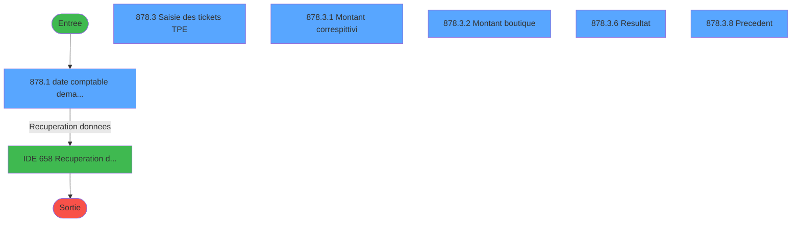
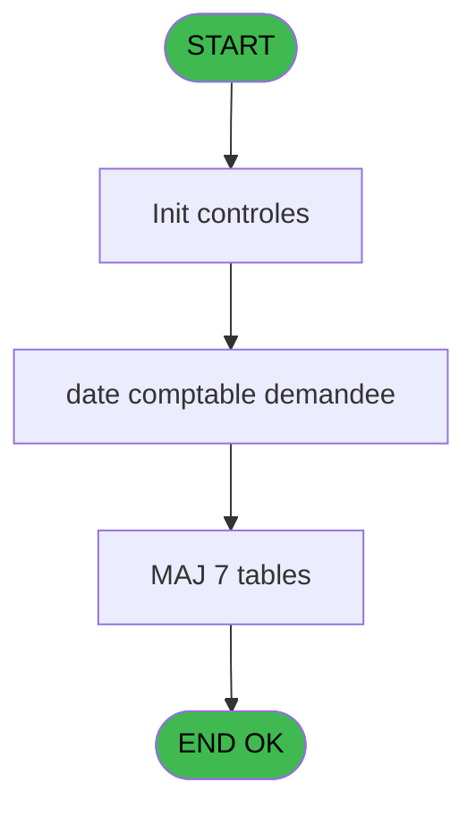
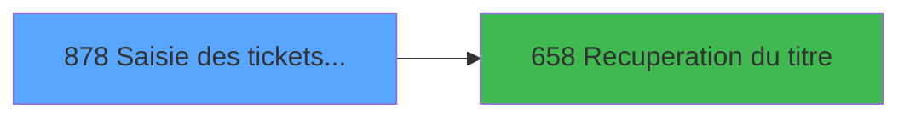

# REF IDE 878 - Saisie des tickets TPE

> **Analyse**: Phases 1-4 2026-02-03 14:52 -> 14:52 (13s) | Assemblage 14:52
> **Pipeline**: V7.2 Enrichi
> **Structure**: 4 onglets (Resume | Ecrans | Donnees | Connexions)

<!-- TAB:Resume -->

## 1. FICHE D'IDENTITE

| Attribut | Valeur |
|----------|--------|
| Projet | REF |
| IDE Position | 878 |
| Nom Programme | Saisie des tickets TPE |
| Fichier source | `Prg_878.xml` |
| Dossier IDE | Impression |
| Taches | 47 (6 ecrans visibles) |
| Tables modifiees | 7 |
| Programmes appeles | 1 |
| :warning: Statut | **ORPHELIN_POTENTIEL** |

## 2. DESCRIPTION FONCTIONNELLE

**Saisie des tickets TPE** assure la gestion complete de ce processus.

Le flux de traitement s'organise en **6 blocs fonctionnels** :

- **Traitement** (13 taches) : traitements metier divers
- **Saisie** (13 taches) : ecrans de saisie utilisateur (formulaires, champs, donnees)
- **Calcul** (12 taches) : calculs de montants, stocks ou compteurs
- **Validation** (5 taches) : controles et verifications de coherence
- **Initialisation** (3 taches) : reinitialisation d'etats et de variables de travail
- **Creation** (1 tache) : insertion d'enregistrements en base (mouvements, prestations)

**Donnees modifiees** : 7 tables en ecriture (plan_comptable_central, saisie_pdc_boutique, suivi_pdc, tickets_tpe, tickets_tpe, total_ventes_par_mop_temp, correspittivi_boutique).

Detail : phases du traitement

#### Phase 1 : Saisie (13 taches)

- **878** - Saisie des tickets TPE 251
- **878.3** - Saisie des tickets TPE **[[ECRAN]](#ecran-t9)**
- **878.3.1.2.1** - total saisie
- **878.3.1.2.2** - Controle saisie
- **878.3.1.2.3.1** - Totalle saisie autre compte
- **878.3.2.3.1** - total saisie
- **878.3.3.2.3** - montant saisie
- **878.3.3.2.3.1** - total saisie
- **878.3.4** - total SAISIE
- **878.3.4.1** - montant saisie
- **878.3.4.1.1** - total saisie
- **878.3.4.2** - montant saisie
- **878.3.4.2.1** - total saisie

#### Phase 2 : Calcul (12 taches)

- **878.1** - date comptable demandee **[[ECRAN]](#ecran-t2)**
- **878.3.3** - total CALCUL
- **878.3.3.1** - montant calcul
- **878.3.3.1.1** - montant calcul
- **878.3.3.1.1.1** - total calcule
- **878.3.3.1.2** - montant calcul **[[ECRAN]](#ecran-t27)**
- **878.3.3.1.2.1** - total calcule
- **878.3.3.2** - montant calcul
- **878.3.3.2.1** - montant calcul
- **878.3.3.2.1.1** - total calcule
- **878.3.3.2.2** - montant calcul
- **878.3.3.2.2.1** - total calcule

#### Phase 3 : Validation (5 taches)

- **878.1.1** - Validation
- **878.3.1.2** - Validation suite
- **878.3.1.2.3** - Controle autres comptes boutiq
- **878.3.2.2** - Validation
- **878.3.2.3** - Validation suite

#### Phase 4 : Traitement (13 taches)

- **878.1.1.1** - secu pour abandon
- **878.3.1** - Montant correspittivi **[[ECRAN]](#ecran-t10)**
- **878.3.1.1** - Abandon
- **878.3.2** - Montant boutique **[[ECRAN]](#ecran-t17)**
- **878.3.2.1** - Abandon
- **878.3.2.3.2** - total téléco
- **878.3.5** - Ecart
- **878.3.6** - Resultat **[[ECRAN]](#ecran-t42)**
- **878.3.7** - Update suivi PDC
- **878.3.8** - Precedent **[[ECRAN]](#ecran-t44)**
- **878.4** - retour abandon
- **878.5** - Sessions ouvertes WS
- **878.6** - param caisse

Delegue a : [Recuperation du titre (IDE 658)](REF-IDE-658.md)

#### Phase 5 : Creation (1 tache)

- **878.1.1.1.1** - create tempo

#### Phase 6 : Initialisation (3 taches)

- **878.2** - Initialisation
- **878.2.1** - initialisation table
- **878.2.2** - initialisation table

#### Tables impactees

| Table | Operations | Role metier |
|-------|-----------|-------------|
| total_ventes_par_mop_temp | **W**/L (16 usages) | Donnees de ventes |
| tickets_tpe | **W**/L (10 usages) |  |
| saisie_pdc_boutique | R/**W**/L (4 usages) |  |
| correspittivi_boutique | R/**W**/L (3 usages) |  |
| tickets_tpe | **W**/L (2 usages) |  |
| plan_comptable_central | **W** (1 usages) |  |
| suivi_pdc | **W** (1 usages) |  |

## 3. BLOCS FONCTIONNELS

### 3.1 Saisie (13 taches)

L'operateur saisit les donnees de la transaction via 1 ecran (Saisie des tickets TPE).

---

#### 878 - Saisie des tickets TPE 251

**Role** : Tache d'orchestration : point d'entree du programme (13 sous-taches). Coordonne l'enchainement des traitements.

12 sous-taches directes

| Tache | Nom | Bloc |
|-------|-----|------|
| [878.3](#t9) | Saisie des tickets TPE **[[ECRAN]](#ecran-t9)** | Saisie |
| [878.3.1.2.1](#t13) | total saisie | Saisie |
| [878.3.1.2.2](#t14) | Controle saisie | Saisie |
| [878.3.1.2.3.1](#t16) | Totalle saisie autre compte | Saisie |
| [878.3.2.3.1](#t21) | total saisie | Saisie |
| [878.3.3.2.3](#t34) | montant saisie | Saisie |
| [878.3.3.2.3.1](#t35) | total saisie | Saisie |
| [878.3.4](#t36) | total SAISIE | Saisie |
| [878.3.4.1](#t37) | montant saisie | Saisie |
| [878.3.4.1.1](#t38) | total saisie | Saisie |
| [878.3.4.2](#t39) | montant saisie | Saisie |
| [878.3.4.2.1](#t40) | total saisie | Saisie |

---

#### 878.3 - Saisie des tickets TPE [[ECRAN]](#ecran-t9)

**Role** : Saisie des donnees : Saisie des tickets TPE.
**Ecran** : 1278 x 241 DLU (Type6) | [Voir mockup](#ecran-t9)

---

#### 878.3.1.2.1 - total saisie

**Role** : Saisie des donnees : total saisie.

---

#### 878.3.1.2.2 - Controle saisie

**Role** : Saisie des donnees : Controle saisie.

---

#### 878.3.1.2.3.1 - Totalle saisie autre compte

**Role** : Saisie des donnees : Totalle saisie autre compte.

---

#### 878.3.2.3.1 - total saisie

**Role** : Saisie des donnees : total saisie.

---

#### 878.3.3.2.3 - montant saisie

**Role** : Saisie des donnees : montant saisie.

---

#### 878.3.3.2.3.1 - total saisie

**Role** : Saisie des donnees : total saisie.

---

#### 878.3.4 - total SAISIE

**Role** : Saisie des donnees : total SAISIE.

---

#### 878.3.4.1 - montant saisie

**Role** : Saisie des donnees : montant saisie.

---

#### 878.3.4.1.1 - total saisie

**Role** : Saisie des donnees : total saisie.

---

#### 878.3.4.2 - montant saisie

**Role** : Saisie des donnees : montant saisie.

---

#### 878.3.4.2.1 - total saisie

**Role** : Saisie des donnees : total saisie.

### 3.2 Calcul (12 taches)

Calculs metier : montants, stocks, compteurs.

---

#### 878.1 - date comptable demandee [[ECRAN]](#ecran-t2)

**Role** : Traitement : date comptable demandee.
**Ecran** : 640 x 198 DLU (MDI) | [Voir mockup](#ecran-t2)
**Variables liees** : B (Param date comptable), F (Param date comptable demandee)

---

#### 878.3.3 - total CALCUL

**Role** : Calcul : total CALCUL.

---

#### 878.3.3.1 - montant calcul

**Role** : Calcul : montant calcul.

---

#### 878.3.3.1.1 - montant calcul

**Role** : Calcul : montant calcul.

---

#### 878.3.3.1.1.1 - total calcule

**Role** : Calcul : total calcule.

---

#### 878.3.3.1.2 - montant calcul [[ECRAN]](#ecran-t27)

**Role** : Calcul : montant calcul.
**Ecran** : 960 x 0 DLU (MDI) | [Voir mockup](#ecran-t27)

---

#### 878.3.3.1.2.1 - total calcule

**Role** : Calcul : total calcule.

---

#### 878.3.3.2 - montant calcul

**Role** : Calcul : montant calcul.

---

#### 878.3.3.2.1 - montant calcul

**Role** : Calcul : montant calcul.

---

#### 878.3.3.2.1.1 - total calcule

**Role** : Calcul : total calcule.

---

#### 878.3.3.2.2 - montant calcul

**Role** : Calcul : montant calcul.

---

#### 878.3.3.2.2.1 - total calcule

**Role** : Calcul : total calcule.

### 3.3 Validation (5 taches)

Controles de coherence : 5 taches verifient les donnees et conditions.

---

#### 878.1.1 - Validation

**Role** : Verification : Validation.

---

#### 878.3.1.2 - Validation suite

**Role** : Verification : Validation suite.

---

#### 878.3.1.2.3 - Controle autres comptes boutiq

**Role** : Verification : Controle autres comptes boutiq.
**Variables liees** : I (Param activite de la boutique)

---

#### 878.3.2.2 - Validation

**Role** : Verification : Validation.

---

#### 878.3.2.3 - Validation suite

**Role** : Verification : Validation suite.

### 3.4 Traitement (13 taches)

Traitements internes.

---

#### 878.1.1.1 - secu pour abandon

**Role** : Traitement : secu pour abandon.
**Variables liees** : O (v abandon demande)

---

#### 878.3.1 - Montant correspittivi [[ECRAN]](#ecran-t10)

**Role** : Traitement : Montant correspittivi.
**Ecran** : 1514 x 289 DLU (Type6) | [Voir mockup](#ecran-t10)

---

#### 878.3.1.1 - Abandon

**Role** : Traitement : Abandon.
**Variables liees** : O (v abandon demande)

---

#### 878.3.2 - Montant boutique [[ECRAN]](#ecran-t17)

**Role** : Traitement : Montant boutique.
**Ecran** : 1278 x 241 DLU (Type6) | [Voir mockup](#ecran-t17)
**Variables liees** : I (Param activite de la boutique)

---

#### 878.3.2.1 - Abandon

**Role** : Traitement : Abandon.
**Variables liees** : O (v abandon demande)

---

#### 878.3.2.3.2 - total téléco

**Role** : Traitement : total téléco.

---

#### 878.3.5 - Ecart

**Role** : Traitement : Ecart.
**Variables liees** : L (v existe ecart), E (Param ecart corrige)

---

#### 878.3.6 - Resultat [[ECRAN]](#ecran-t42)

**Role** : Traitement : Resultat.
**Ecran** : 1278 x 240 DLU (MDI) | [Voir mockup](#ecran-t42)

---

#### 878.3.7 - Update suivi PDC

**Role** : Traitement : Update suivi PDC.

---

#### 878.3.8 - Precedent [[ECRAN]](#ecran-t44)

**Role** : Traitement : Precedent.
**Ecran** : 1263 x 51 DLU (Modal) | [Voir mockup](#ecran-t44)

---

#### 878.4 - retour abandon

**Role** : Traitement : retour abandon.
**Variables liees** : O (v abandon demande)

---

#### 878.5 - Sessions ouvertes WS

**Role** : Traitement : Sessions ouvertes WS.

---

#### 878.6 - param caisse

**Role** : Traitement : param caisse.
**Variables liees** : A (Param societe), B (Param date comptable), C (Param masque), D (Param code service), E (Param ecart corrige)

### 3.5 Creation (1 tache)

Insertion de nouveaux enregistrements en base.

---

#### 878.1.1.1.1 - create tempo

**Role** : Traitement : create tempo.

### 3.6 Initialisation (3 taches)

Reinitialisation d'etats et variables de travail.

---

#### 878.2 - Initialisation

**Role** : Reinitialisation : Initialisation.

---

#### 878.2.1 - initialisation table

**Role** : Reinitialisation : initialisation table.
**Variables liees** : B (Param date comptable), F (Param date comptable demandee)

---

#### 878.2.2 - initialisation table

**Role** : Reinitialisation : initialisation table.
**Variables liees** : B (Param date comptable), F (Param date comptable demandee)

## 5. REGLES METIER

*(Aucune regle metier identifiee)*

## 6. CONTEXTE

- **Appele par**: (aucun)
- **Appelle**: 1 programmes | **Tables**: 20 (W:7 R:12 L:12) | **Taches**: 47 | **Expressions**: 9

<!-- TAB:Ecrans -->

## 8. ECRANS

### 8.1 Forms visibles (6 / 47)

| # | Position | Tache | Nom | Type | Largeur | Hauteur | Bloc |
|---|----------|-------|-----|------|---------|---------|------|
| 1 | 878.1 | 878.1 | date comptable demandee | MDI | 640 | 198 | Calcul |
| 2 | 878.3 | 878.3 | Saisie des tickets TPE | Type6 | 1278 | 241 | Saisie |
| 3 | 878.3.1 | 878.3.1 | Montant correspittivi | Type6 | 1514 | 289 | Traitement |
| 4 | 878.3.2 | 878.3.2 | Montant boutique | Type6 | 1278 | 241 | Traitement |
| 5 | 878.3.6 | 878.3.6 | Resultat | MDI | 1278 | 240 | Traitement |
| 6 | 878.3.8 | 878.3.8 | Precedent | Modal | 1263 | 51 | Traitement |

### 8.2 Mockups Ecrans

---

#### 878.1 - date comptable demandee
**Tache** : [878.1](#t2) | **Type** : MDI | **Dimensions** : 640 x 198 DLU
**Bloc** : Calcul | **Titre IDE** : date comptable demandee

<!-- FORM-DATA:
{
    "width":  640,
    "vFactor":  8,
    "type":  "MDI",
    "hFactor":  8,
    "controls":  [
                     {
                         "x":  0,
                         "type":  "label",
                         "var":  "",
                         "y":  1,
                         "w":  638,
                         "fmt":  "",
                         "name":  "",
                         "h":  18,
                         "color":  "",
                         "text":  "",
                         "parent":  null
                     },
                     {
                         "x":  0,
                         "type":  "label",
                         "var":  "",
                         "y":  23,
                         "w":  638,
                         "fmt":  "",
                         "name":  "",
                         "h":  148,
                         "color":  "",
                         "text":  "",
                         "parent":  null
                     },
                     {
                         "x":  313,
                         "type":  "label",
                         "var":  "",
                         "y":  73,
                         "w":  213,
                         "fmt":  "",
                         "name":  "",
                         "h":  8,
                         "color":  "",
                         "text":  "Date comptable demandée",
                         "parent":  null
                     },
                     {
                         "x":  0,
                         "type":  "label",
                         "var":  "",
                         "y":  174,
                         "w":  638,
                         "fmt":  "",
                         "name":  "",
                         "h":  24,
                         "color":  "",
                         "text":  "",
                         "parent":  null
                     },
                     {
                         "x":  356,
                         "type":  "edit",
                         "var":  "",
                         "y":  98,
                         "w":  126,
                         "fmt":  "",
                         "name":  "",
                         "h":  10,
                         "color":  "6",
                         "text":  "",
                         "parent":  null
                     },
                     {
                         "x":  409,
                         "type":  "edit",
                         "var":  "",
                         "y":  6,
                         "w":  216,
                         "fmt":  "WWW  DD MMM YYYYT",
                         "name":  "",
                         "h":  8,
                         "color":  "",
                         "text":  "",
                         "parent":  null
                     },
                     {
                         "x":  40,
                         "type":  "image",
                         "var":  "",
                         "y":  77,
                         "w":  147,
                         "fmt":  "",
                         "name":  "",
                         "h":  45,
                         "color":  "",
                         "text":  "",
                         "parent":  null
                     },
                     {
                         "x":  471,
                         "type":  "button",
                         "var":  "",
                         "y":  177,
                         "w":  154,
                         "fmt":  "\u0026Validation",
                         "name":  "",
                         "h":  18,
                         "color":  "",
                         "text":  "",
                         "parent":  null
                     },
                     {
                         "x":  7,
                         "type":  "edit",
                         "var":  "",
                         "y":  6,
                         "w":  267,
                         "fmt":  "30",
                         "name":  "",
                         "h":  8,
                         "color":  "",
                         "text":  "",
                         "parent":  null
                     }
                 ],
    "taskId":  "878.1",
    "height":  198
}
-->

<strong>Champs : 3 champs</strong>

| Pos (x,y) | Nom | Variable | Type |
|-----------|-----|----------|------|
| 356,98 | (sans nom) | - | edit |
| 409,6 | WWW  DD MMM YYYYT | - | edit |
| 7,6 | 30 | - | edit |

<strong>Boutons : 1 boutons</strong>

| Bouton | Pos (x,y) | Action |
|--------|-----------|--------|
| Validation | 471,177 | Valide la saisie et enregistre |

---

#### 878.3 - Saisie des tickets TPE
**Tache** : [878.3](#t9) | **Type** : Type6 | **Dimensions** : 1278 x 241 DLU
**Bloc** : Saisie | **Titre IDE** : Saisie des tickets TPE

<!-- FORM-DATA:
{
    "width":  1278,
    "vFactor":  8,
    "type":  "Type6",
    "hFactor":  8,
    "controls":  [
                     {
                         "x":  2,
                         "type":  "label",
                         "var":  "",
                         "y":  1,
                         "w":  1273,
                         "fmt":  "",
                         "name":  "",
                         "h":  24,
                         "color":  "",
                         "text":  "",
                         "parent":  null
                     },
                     {
                         "x":  461,
                         "type":  "label",
                         "var":  "",
                         "y":  8,
                         "w":  190,
                         "fmt":  "",
                         "name":  "",
                         "h":  10,
                         "color":  "7",
                         "text":  "Date comptable",
                         "parent":  null
                     },
                     {
                         "x":  2,
                         "type":  "label",
                         "var":  "",
                         "y":  216,
                         "w":  1273,
                         "fmt":  "",
                         "name":  "",
                         "h":  24,
                         "color":  "",
                         "text":  "",
                         "parent":  null
                     },
                     {
                         "x":  19,
                         "type":  "table",
                         "var":  "",
                         "name":  "",
                         "titleH":  12,
                         "color":  "110",
                         "w":  1245,
                         "y":  34,
                         "fmt":  "",
                         "parent":  null,
                         "text":  "",
                         "rowH":  10,
                         "h":  171,
                         "cols":  [
                                      {
                                          "title":  "TPE",
                                          "layer":  1,
                                          "w":  79
                                      },
                                      {
                                          "title":  "Emplacement",
                                          "layer":  2,
                                          "w":  490
                                      },
                                      {
                                          "title":  "MOP",
                                          "layer":  3,
                                          "w":  89
                                      },
                                      {
                                          "title":  "Montant",
                                          "layer":  4,
                                          "w":  180
                                      },
                                      {
                                          "title":  "Numéro remise",
                                          "layer":  5,
                                          "w":  212
                                      },
                                      {
                                          "title":  "Date opération TPE",
                                          "layer":  6,
                                          "w":  160
                                      }
                                  ],
                         "rows":  6
                     },
                     {
                         "x":  26,
                         "type":  "edit",
                         "var":  "",
                         "y":  48,
                         "w":  69,
                         "fmt":  "",
                         "name":  "",
                         "h":  8,
                         "color":  "110",
                         "text":  "",
                         "parent":  7
                     },
                     {
                         "x":  594,
                         "type":  "edit",
                         "var":  "",
                         "y":  48,
                         "w":  85,
                         "fmt":  "",
                         "name":  "",
                         "h":  8,
                         "color":  "110",
                         "text":  "",
                         "parent":  7
                     },
                     {
                         "x":  685,
                         "type":  "edit",
                         "var":  "",
                         "y":  48,
                         "w":  171,
                         "fmt":  "N## ### ### ###.###Z",
                         "name":  "Montant",
                         "h":  8,
                         "color":  "110",
                         "text":  "",
                         "parent":  7
                     },
                     {
                         "x":  864,
                         "type":  "edit",
                         "var":  "",
                         "y":  48,
                         "w":  209,
                         "fmt":  "16",
                         "name":  "Numero remise",
                         "h":  8,
                         "color":  "110",
                         "text":  "",
                         "parent":  7
                     },
                     {
                         "x":  1075,
                         "type":  "edit",
                         "var":  "",
                         "y":  48,
                         "w":  152,
                         "fmt":  "##/##/####Z",
                         "name":  "",
                         "h":  8,
                         "color":  "110",
                         "text":  "",
                         "parent":  7
                     },
                     {
                         "x":  104,
                         "type":  "edit",
                         "var":  "",
                         "y":  48,
                         "w":  240,
                         "fmt":  "",
                         "name":  "",
                         "h":  8,
                         "color":  "110",
                         "text":  "",
                         "parent":  7
                     },
                     {
                         "x":  30,
                         "type":  "edit",
                         "var":  "",
                         "y":  8,
                         "w":  267,
                         "fmt":  "30",
                         "name":  "",
                         "h":  10,
                         "color":  "",
                         "text":  "",
                         "parent":  null
                     },
                     {
                         "x":  659,
                         "type":  "edit",
                         "var":  "",
                         "y":  8,
                         "w":  158,
                         "fmt":  "",
                         "name":  "",
                         "h":  10,
                         "color":  "7",
                         "text":  "",
                         "parent":  null
                     },
                     {
                         "x":  1033,
                         "type":  "edit",
                         "var":  "",
                         "y":  8,
                         "w":  216,
                         "fmt":  "WWW  DD MMM YYYYT",
                         "name":  "",
                         "h":  10,
                         "color":  "",
                         "text":  "",
                         "parent":  null
                     },
                     {
                         "x":  342,
                         "type":  "edit",
                         "var":  "",
                         "y":  48,
                         "w":  243,
                         "fmt":  "30",
                         "name":  "",
                         "h":  8,
                         "color":  "110",
                         "text":  "",
                         "parent":  7
                     },
                     {
                         "x":  30,
                         "type":  "button",
                         "var":  "",
                         "y":  219,
                         "w":  154,
                         "fmt":  "A\u0026bandon",
                         "name":  "",
                         "h":  18,
                         "color":  "",
                         "text":  "",
                         "parent":  null
                     },
                     {
                         "x":  1095,
                         "type":  "button",
                         "var":  "",
                         "y":  219,
                         "w":  154,
                         "fmt":  "\u0026Continue",
                         "name":  "",
                         "h":  18,
                         "color":  "",
                         "text":  "",
                         "parent":  null
                     }
                 ],
    "taskId":  "878.3",
    "height":  241
}
-->

<strong>Champs : 10 champs</strong>

| Pos (x,y) | Nom | Variable | Type |
|-----------|-----|----------|------|
| 26,48 | (sans nom) | - | edit |
| 594,48 | (sans nom) | - | edit |
| 685,48 | Montant | - | edit |
| 864,48 | Numero remise | - | edit |
| 1075,48 | ##/##/####Z | - | edit |
| 104,48 | (sans nom) | - | edit |
| 30,8 | 30 | - | edit |
| 659,8 | (sans nom) | - | edit |
| 1033,8 | WWW  DD MMM YYYYT | - | edit |
| 342,48 | 30 | - | edit |

<strong>Boutons : 2 boutons</strong>

| Bouton | Pos (x,y) | Action |
|--------|-----------|--------|
| Abandon | 30,219 | Annule et retour au menu |
| Continue | 1095,219 | Bouton fonctionnel |

---

#### 878.3.1 - Montant correspittivi
**Tache** : [878.3.1](#t10) | **Type** : Type6 | **Dimensions** : 1514 x 289 DLU
**Bloc** : Traitement | **Titre IDE** : Montant correspittivi

<!-- FORM-DATA:
{
    "width":  1514,
    "vFactor":  8,
    "type":  "Type6",
    "hFactor":  8,
    "controls":  [
                     {
                         "x":  1,
                         "type":  "label",
                         "var":  "",
                         "y":  2,
                         "w":  1492,
                         "fmt":  "",
                         "name":  "",
                         "h":  18,
                         "color":  "",
                         "text":  "",
                         "parent":  null
                     },
                     {
                         "x":  578,
                         "type":  "label",
                         "var":  "",
                         "y":  6,
                         "w":  190,
                         "fmt":  "",
                         "name":  "",
                         "h":  10,
                         "color":  "7",
                         "text":  "Date comptable",
                         "parent":  null
                     },
                     {
                         "x":  326,
                         "type":  "label",
                         "var":  "",
                         "y":  28,
                         "w":  861,
                         "fmt":  "",
                         "name":  "",
                         "h":  11,
                         "color":  "179",
                         "text":  "ATTENTION, LES MONTANTS SONT A SAISIR TOUTES TAXES COMPRISES",
                         "parent":  null
                     },
                     {
                         "x":  326,
                         "type":  "label",
                         "var":  "",
                         "y":  44,
                         "w":  861,
                         "fmt":  "",
                         "name":  "",
                         "h":  11,
                         "color":  "179",
                         "text":  "",
                         "parent":  null
                     },
                     {
                         "x":  1,
                         "type":  "label",
                         "var":  "",
                         "y":  262,
                         "w":  1492,
                         "fmt":  "",
                         "name":  "",
                         "h":  24,
                         "color":  "",
                         "text":  "",
                         "parent":  null
                     },
                     {
                         "x":  16,
                         "type":  "table",
                         "var":  "",
                         "name":  "",
                         "titleH":  12,
                         "color":  "110",
                         "w":  1477,
                         "y":  70,
                         "fmt":  "",
                         "parent":  null,
                         "text":  "",
                         "rowH":  14,
                         "h":  180,
                         "cols":  [
                                      {
                                          "title":  "Compte",
                                          "layer":  1,
                                          "w":  106
                                      },
                                      {
                                          "title":  "Tva",
                                          "layer":  2,
                                          "w":  67
                                      },
                                      {
                                          "title":  "Libellé du compte",
                                          "layer":  3,
                                          "w":  796
                                      },
                                      {
                                          "title":  "Montant TTC",
                                          "layer":  4,
                                          "w":  244
                                      },
                                      {
                                          "title":  "Montant HT",
                                          "layer":  5,
                                          "w":  224
                                      }
                                  ],
                         "rows":  5
                     },
                     {
                         "x":  19,
                         "type":  "edit",
                         "var":  "",
                         "y":  84,
                         "w":  101,
                         "fmt":  "",
                         "name":  "cos_compte_analytique",
                         "h":  12,
                         "color":  "110",
                         "text":  "",
                         "parent":  9
                     },
                     {
                         "x":  998,
                         "type":  "edit",
                         "var":  "",
                         "y":  84,
                         "w":  222,
                         "fmt":  "N## ### ### ###.###Z",
                         "name":  "cob_montant_ttc",
                         "h":  12,
                         "color":  "110",
                         "text":  "",
                         "parent":  9
                     },
                     {
                         "x":  8,
                         "type":  "edit",
                         "var":  "",
                         "y":  7,
                         "w":  384,
                         "fmt":  "30",
                         "name":  "",
                         "h":  8,
                         "color":  "",
                         "text":  "",
                         "parent":  null
                     },
                     {
                         "x":  1260,
                         "type":  "edit",
                         "var":  "",
                         "y":  7,
                         "w":  216,
                         "fmt":  "WWW  DD MMM YYYYT",
                         "name":  "",
                         "h":  8,
                         "color":  "",
                         "text":  "",
                         "parent":  null
                     },
                     {
                         "x":  194,
                         "type":  "edit",
                         "var":  "",
                         "y":  84,
                         "w":  790,
                         "fmt":  "128",
                         "name":  "",
                         "h":  12,
                         "color":  "110",
                         "text":  "",
                         "parent":  9
                     },
                     {
                         "x":  1325,
                         "type":  "button",
                         "var":  "",
                         "y":  265,
                         "w":  154,
                         "fmt":  "\u0026Validation",
                         "name":  "",
                         "h":  18,
                         "color":  "",
                         "text":  "",
                         "parent":  null
                     },
                     {
                         "x":  776,
                         "type":  "edit",
                         "var":  "",
                         "y":  6,
                         "w":  158,
                         "fmt":  "",
                         "name":  "",
                         "h":  10,
                         "color":  "7",
                         "text":  "",
                         "parent":  null
                     },
                     {
                         "x":  128,
                         "type":  "edit",
                         "var":  "",
                         "y":  84,
                         "w":  54,
                         "fmt":  "2.2Z",
                         "name":  "cos_tva",
                         "h":  12,
                         "color":  "110",
                         "text":  "",
                         "parent":  9
                     },
                     {
                         "x":  1235,
                         "type":  "edit",
                         "var":  "",
                         "y":  85,
                         "w":  214,
                         "fmt":  "N## ### ### ###.###Z",
                         "name":  "cob_montant_ht",
                         "h":  10,
                         "color":  "110",
                         "text":  "",
                         "parent":  9
                     },
                     {
                         "x":  19,
                         "type":  "button",
                         "var":  "",
                         "y":  265,
                         "w":  154,
                         "fmt":  "\u0026Abandon",
                         "name":  "",
                         "h":  18,
                         "color":  "",
                         "text":  "",
                         "parent":  null
                     }
                 ],
    "taskId":  "878.3.1",
    "height":  289
}
-->

<strong>Champs : 8 champs</strong>

| Pos (x,y) | Nom | Variable | Type |
|-----------|-----|----------|------|
| 19,84 | cos_compte_analytique | - | edit |
| 998,84 | cob_montant_ttc | - | edit |
| 8,7 | 30 | - | edit |
| 1260,7 | WWW  DD MMM YYYYT | - | edit |
| 194,84 | 128 | - | edit |
| 776,6 | (sans nom) | - | edit |
| 128,84 | cos_tva | - | edit |
| 1235,85 | cob_montant_ht | - | edit |

<strong>Boutons : 2 boutons</strong>

| Bouton | Pos (x,y) | Action |
|--------|-----------|--------|
| Validation | 1325,265 | Valide la saisie et enregistre |
| Abandon | 19,265 | Annule et retour au menu |

---

#### 878.3.2 - Montant boutique
**Tache** : [878.3.2](#t17) | **Type** : Type6 | **Dimensions** : 1278 x 241 DLU
**Bloc** : Traitement | **Titre IDE** : Montant boutique

<!-- FORM-DATA:
{
    "width":  1278,
    "vFactor":  8,
    "type":  "Type6",
    "hFactor":  8,
    "controls":  [
                     {
                         "x":  1,
                         "type":  "label",
                         "var":  "",
                         "y":  2,
                         "w":  1276,
                         "fmt":  "",
                         "name":  "",
                         "h":  18,
                         "color":  "",
                         "text":  "",
                         "parent":  null
                     },
                     {
                         "x":  460,
                         "type":  "label",
                         "var":  "",
                         "y":  6,
                         "w":  190,
                         "fmt":  "",
                         "name":  "",
                         "h":  10,
                         "color":  "7",
                         "text":  "Date comptable",
                         "parent":  null
                     },
                     {
                         "x":  1,
                         "type":  "label",
                         "var":  "",
                         "y":  216,
                         "w":  1276,
                         "fmt":  "",
                         "name":  "",
                         "h":  24,
                         "color":  "",
                         "text":  "",
                         "parent":  null
                     },
                     {
                         "x":  16,
                         "type":  "table",
                         "var":  "",
                         "name":  "",
                         "titleH":  12,
                         "color":  "110",
                         "w":  1250,
                         "y":  24,
                         "fmt":  "",
                         "parent":  null,
                         "text":  "",
                         "rowH":  14,
                         "h":  180,
                         "cols":  [
                                      {
                                          "title":  "Compte",
                                          "layer":  1,
                                          "w":  94
                                      },
                                      {
                                          "title":  "Activité",
                                          "layer":  2,
                                          "w":  76
                                      },
                                      {
                                          "title":  "Libellé du compte",
                                          "layer":  3,
                                          "w":  421
                                      },
                                      {
                                          "title":  "Montant",
                                          "layer":  4,
                                          "w":  233
                                      },
                                      {
                                          "title":  "Libellé de la pièce de caisse",
                                          "layer":  5,
                                          "w":  393
                                      }
                                  ],
                         "rows":  5
                     },
                     {
                         "x":  19,
                         "type":  "edit",
                         "var":  "",
                         "y":  38,
                         "w":  90,
                         "fmt":  "",
                         "name":  "",
                         "h":  12,
                         "color":  "110",
                         "text":  "",
                         "parent":  7
                     },
                     {
                         "x":  117,
                         "type":  "edit",
                         "var":  "",
                         "y":  38,
                         "w":  67,
                         "fmt":  "",
                         "name":  "",
                         "h":  12,
                         "color":  "110",
                         "text":  "",
                         "parent":  7
                     },
                     {
                         "x":  613,
                         "type":  "edit",
                         "var":  "",
                         "y":  38,
                         "w":  222,
                         "fmt":  "N## ### ### ###.###Z",
                         "name":  "",
                         "h":  12,
                         "color":  "110",
                         "text":  "",
                         "parent":  7
                     },
                     {
                         "x":  846,
                         "type":  "edit",
                         "var":  "",
                         "y":  38,
                         "w":  376,
                         "fmt":  "",
                         "name":  "",
                         "h":  12,
                         "color":  "110",
                         "text":  "",
                         "parent":  7
                     },
                     {
                         "x":  5,
                         "type":  "edit",
                         "var":  "",
                         "y":  7,
                         "w":  384,
                         "fmt":  "30",
                         "name":  "",
                         "h":  8,
                         "color":  "",
                         "text":  "",
                         "parent":  null
                     },
                     {
                         "x":  1036,
                         "type":  "edit",
                         "var":  "",
                         "y":  7,
                         "w":  216,
                         "fmt":  "WWW  DD MMM YYYYT",
                         "name":  "",
                         "h":  8,
                         "color":  "",
                         "text":  "",
                         "parent":  null
                     },
                     {
                         "x":  190,
                         "type":  "edit",
                         "var":  "",
                         "y":  38,
                         "w":  412,
                         "fmt":  "128",
                         "name":  "",
                         "h":  12,
                         "color":  "110",
                         "text":  "",
                         "parent":  7
                     },
                     {
                         "x":  21,
                         "type":  "button",
                         "var":  "",
                         "y":  219,
                         "w":  154,
                         "fmt":  "Abandon",
                         "name":  "",
                         "h":  18,
                         "color":  "",
                         "text":  "",
                         "parent":  null
                     },
                     {
                         "x":  1098,
                         "type":  "button",
                         "var":  "",
                         "y":  219,
                         "w":  154,
                         "fmt":  "\u0026Validation",
                         "name":  "",
                         "h":  18,
                         "color":  "",
                         "text":  "",
                         "parent":  null
                     },
                     {
                         "x":  658,
                         "type":  "edit",
                         "var":  "",
                         "y":  6,
                         "w":  158,
                         "fmt":  "",
                         "name":  "",
                         "h":  10,
                         "color":  "7",
                         "text":  "",
                         "parent":  null
                     }
                 ],
    "taskId":  "878.3.2",
    "height":  241
}
-->

<strong>Champs : 8 champs</strong>

| Pos (x,y) | Nom | Variable | Type |
|-----------|-----|----------|------|
| 19,38 | (sans nom) | - | edit |
| 117,38 | (sans nom) | - | edit |
| 613,38 | N## ### ### ###.###Z | - | edit |
| 846,38 | (sans nom) | - | edit |
| 5,7 | 30 | - | edit |
| 1036,7 | WWW  DD MMM YYYYT | - | edit |
| 190,38 | 128 | - | edit |
| 658,6 | (sans nom) | - | edit |

<strong>Boutons : 2 boutons</strong>

| Bouton | Pos (x,y) | Action |
|--------|-----------|--------|
| Abandon | 21,219 | Annule et retour au menu |
| Validation | 1098,219 | Valide la saisie et enregistre |

---

#### 878.3.6 - Resultat
**Tache** : [878.3.6](#t42) | **Type** : MDI | **Dimensions** : 1278 x 240 DLU
**Bloc** : Traitement | **Titre IDE** : Resultat

<!-- FORM-DATA:
{
    "width":  1278,
    "vFactor":  8,
    "type":  "MDI",
    "hFactor":  8,
    "controls":  [
                     {
                         "x":  3,
                         "type":  "label",
                         "var":  "",
                         "y":  2,
                         "w":  1271,
                         "fmt":  "",
                         "name":  "",
                         "h":  24,
                         "color":  "",
                         "text":  "",
                         "parent":  null
                     },
                     {
                         "x":  461,
                         "type":  "label",
                         "var":  "",
                         "y":  9,
                         "w":  190,
                         "fmt":  "",
                         "name":  "",
                         "h":  10,
                         "color":  "7",
                         "text":  "Date comptable",
                         "parent":  null
                     },
                     {
                         "x":  341,
                         "type":  "label",
                         "var":  "",
                         "y":  34,
                         "w":  310,
                         "fmt":  "",
                         "name":  "",
                         "h":  10,
                         "color":  "166",
                         "text":  "Date comptable demandée",
                         "parent":  null
                     },
                     {
                         "x":  560,
                         "type":  "label",
                         "var":  "",
                         "y":  182,
                         "w":  200,
                         "fmt":  "",
                         "name":  "",
                         "h":  10,
                         "color":  "144",
                         "text":  "Aucun écart",
                         "parent":  null
                     },
                     {
                         "x":  3,
                         "type":  "label",
                         "var":  "",
                         "y":  214,
                         "w":  1271,
                         "fmt":  "",
                         "name":  "",
                         "h":  24,
                         "color":  "",
                         "text":  "",
                         "parent":  null
                     },
                     {
                         "x":  169,
                         "type":  "table",
                         "var":  "",
                         "name":  "",
                         "titleH":  12,
                         "color":  "110",
                         "w":  945,
                         "y":  55,
                         "fmt":  "",
                         "parent":  null,
                         "text":  "",
                         "rowH":  13,
                         "h":  104,
                         "cols":  [
                                      {
                                          "title":  "MOP",
                                          "layer":  1,
                                          "w":  65
                                      },
                                      {
                                          "title":  "Libellé",
                                          "layer":  2,
                                          "w":  250
                                      },
                                      {
                                          "title":  "Montant calculé",
                                          "layer":  3,
                                          "w":  233
                                      },
                                      {
                                          "title":  "Montant saisi",
                                          "layer":  4,
                                          "w":  233
                                      },
                                      {
                                          "title":  "Ecart",
                                          "layer":  5,
                                          "w":  133
                                      }
                                  ],
                         "rows":  5
                     },
                     {
                         "x":  175,
                         "type":  "edit",
                         "var":  "",
                         "y":  69,
                         "w":  53,
                         "fmt":  "",
                         "name":  "",
                         "h":  10,
                         "color":  "110",
                         "text":  "",
                         "parent":  10
                     },
                     {
                         "x":  490,
                         "type":  "edit",
                         "var":  "",
                         "y":  69,
                         "w":  221,
                         "fmt":  "",
                         "name":  "",
                         "h":  10,
                         "color":  "110",
                         "text":  "",
                         "parent":  10
                     },
                     {
                         "x":  723,
                         "type":  "edit",
                         "var":  "",
                         "y":  69,
                         "w":  221,
                         "fmt":  "",
                         "name":  "",
                         "h":  10,
                         "color":  "110",
                         "text":  "",
                         "parent":  10
                     },
                     {
                         "x":  1002,
                         "type":  "checkbox",
                         "var":  "",
                         "y":  69,
                         "w":  30,
                         "fmt":  "",
                         "name":  "",
                         "h":  10,
                         "color":  "110",
                         "text":  "",
                         "parent":  10
                     },
                     {
                         "x":  240,
                         "type":  "edit",
                         "var":  "",
                         "y":  69,
                         "w":  238,
                         "fmt":  "",
                         "name":  "",
                         "h":  10,
                         "color":  "110",
                         "text":  "",
                         "parent":  10
                     },
                     {
                         "x":  659,
                         "type":  "edit",
                         "var":  "",
                         "y":  9,
                         "w":  158,
                         "fmt":  "",
                         "name":  "",
                         "h":  10,
                         "color":  "7",
                         "text":  "",
                         "parent":  null
                     },
                     {
                         "x":  1046,
                         "type":  "edit",
                         "var":  "",
                         "y":  10,
                         "w":  216,
                         "fmt":  "WWW  DD MMM YYYYT",
                         "name":  "",
                         "h":  8,
                         "color":  "",
                         "text":  "",
                         "parent":  null
                     },
                     {
                         "x":  659,
                         "type":  "edit",
                         "var":  "",
                         "y":  34,
                         "w":  158,
                         "fmt":  "",
                         "name":  "",
                         "h":  10,
                         "color":  "166",
                         "text":  "",
                         "parent":  null
                     },
                     {
                         "x":  1108,
                         "type":  "button",
                         "var":  "",
                         "y":  217,
                         "w":  154,
                         "fmt":  "\u0026Quitter",
                         "name":  "",
                         "h":  18,
                         "color":  "",
                         "text":  "",
                         "parent":  null
                     },
                     {
                         "x":  7,
                         "type":  "edit",
                         "var":  "",
                         "y":  10,
                         "w":  249,
                         "fmt":  "30",
                         "name":  "",
                         "h":  8,
                         "color":  "",
                         "text":  "",
                         "parent":  null
                     }
                 ],
    "taskId":  "878.3.6",
    "height":  240
}
-->

<strong>Champs : 9 champs</strong>

| Pos (x,y) | Nom | Variable | Type |
|-----------|-----|----------|------|
| 175,69 | (sans nom) | - | edit |
| 490,69 | (sans nom) | - | edit |
| 723,69 | (sans nom) | - | edit |
| 1002,69 | (sans nom) | - | checkbox |
| 240,69 | (sans nom) | - | edit |
| 659,9 | (sans nom) | - | edit |
| 1046,10 | WWW  DD MMM YYYYT | - | edit |
| 659,34 | (sans nom) | - | edit |
| 7,10 | 30 | - | edit |

<strong>Boutons : 1 boutons</strong>

| Bouton | Pos (x,y) | Action |
|--------|-----------|--------|
| Quitter | 1108,217 | Quitte le programme |

---

#### 878.3.8 - Precedent
**Tache** : [878.3.8](#t44) | **Type** : Modal | **Dimensions** : 1263 x 51 DLU
**Bloc** : Traitement | **Titre IDE** : Precedent

<!-- FORM-DATA:
{
    "width":  1263,
    "vFactor":  8,
    "type":  "Modal",
    "hFactor":  8,
    "controls":  [
                     {
                         "x":  4,
                         "type":  "table",
                         "var":  "",
                         "name":  "",
                         "titleH":  9,
                         "color":  "110",
                         "w":  1242,
                         "y":  0,
                         "fmt":  "",
                         "parent":  null,
                         "text":  "",
                         "rowH":  10,
                         "h":  49,
                         "cols":  [
                                      {
                                          "title":  "TPE",
                                          "layer":  1,
                                          "w":  79
                                      },
                                      {
                                          "title":  "Emplacement",
                                          "layer":  2,
                                          "w":  490
                                      },
                                      {
                                          "title":  "MOP",
                                          "layer":  3,
                                          "w":  89
                                      },
                                      {
                                          "title":  "Montant",
                                          "layer":  4,
                                          "w":  180
                                      },
                                      {
                                          "title":  "Numéro remise",
                                          "layer":  5,
                                          "w":  212
                                      },
                                      {
                                          "title":  "Date opération TPE",
                                          "layer":  6,
                                          "w":  158
                                      }
                                  ],
                         "rows":  6
                     },
                     {
                         "x":  10,
                         "type":  "edit",
                         "var":  "",
                         "y":  11,
                         "w":  69,
                         "fmt":  "",
                         "name":  "Numero TPE",
                         "h":  8,
                         "color":  "110",
                         "text":  "",
                         "parent":  1
                     },
                     {
                         "x":  579,
                         "type":  "edit",
                         "var":  "",
                         "y":  11,
                         "w":  77,
                         "fmt":  "",
                         "name":  "Moyen de paiement",
                         "h":  8,
                         "color":  "110",
                         "text":  "",
                         "parent":  1
                     },
                     {
                         "x":  670,
                         "type":  "edit",
                         "var":  "",
                         "y":  11,
                         "w":  168,
                         "fmt":  "N## ### ### ###.###Z",
                         "name":  "Montant",
                         "h":  8,
                         "color":  "110",
                         "text":  "",
                         "parent":  1
                     },
                     {
                         "x":  851,
                         "type":  "edit",
                         "var":  "",
                         "y":  11,
                         "w":  197,
                         "fmt":  "16",
                         "name":  "Numero remise",
                         "h":  8,
                         "color":  "110",
                         "text":  "",
                         "parent":  1
                     },
                     {
                         "x":  1059,
                         "type":  "edit",
                         "var":  "",
                         "y":  11,
                         "w":  126,
                         "fmt":  "",
                         "name":  "Date operation TPE",
                         "h":  8,
                         "color":  "110",
                         "text":  "",
                         "parent":  1
                     },
                     {
                         "x":  90,
                         "type":  "edit",
                         "var":  "",
                         "y":  11,
                         "w":  240,
                         "fmt":  "",
                         "name":  "",
                         "h":  8,
                         "color":  "110",
                         "text":  "",
                         "parent":  1
                     },
                     {
                         "x":  328,
                         "type":  "edit",
                         "var":  "",
                         "y":  11,
                         "w":  245,
                         "fmt":  "30",
                         "name":  "",
                         "h":  8,
                         "color":  "110",
                         "text":  "",
                         "parent":  1
                     }
                 ],
    "taskId":  "878.3.8",
    "height":  51
}
-->

<strong>Champs : 7 champs</strong>

| Pos (x,y) | Nom | Variable | Type |
|-----------|-----|----------|------|
| 10,11 | Numero TPE | - | edit |
| 579,11 | Moyen de paiement | - | edit |
| 670,11 | Montant | - | edit |
| 851,11 | Numero remise | - | edit |
| 1059,11 | Date operation TPE | - | edit |
| 90,11 | (sans nom) | - | edit |
| 328,11 | 30 | - | edit |

## 9. NAVIGATION

### 9.1 Enchainement des ecrans

**Detail par enchainement :**

| Depuis | Action | Vers | Retour |
|--------|--------|------|--------|
| date comptable demandee | Recuperation donnees | [Recuperation du titre (IDE 658)](REF-IDE-658.md) | Retour ecran |

### 9.3 Structure hierarchique (47 taches)

| Position | Tache | Type | Dimensions | Bloc |
|----------|-------|------|------------|------|
| **878.1** | [**Saisie des tickets TPE 251** (878)](#t1) | MDI | - | Saisie |
| 878.1.1 | [Saisie des tickets TPE (878.3)](#t9) [mockup](#ecran-t9) | Type6 | 1278x241 | |
| 878.1.2 | [total saisie (878.3.1.2.1)](#t13) | MDI | - | |
| 878.1.3 | [Controle saisie (878.3.1.2.2)](#t14) | - | - | |
| 878.1.4 | [Totalle saisie autre compte (878.3.1.2.3.1)](#t16) | - | - | |
| 878.1.5 | [total saisie (878.3.2.3.1)](#t21) | MDI | - | |
| 878.1.6 | [montant saisie (878.3.3.2.3)](#t34) | MDI | - | |
| 878.1.7 | [total saisie (878.3.3.2.3.1)](#t35) | MDI | - | |
| 878.1.8 | [total SAISIE (878.3.4)](#t36) | MDI | - | |
| 878.1.9 | [montant saisie (878.3.4.1)](#t37) | MDI | - | |
| 878.1.10 | [total saisie (878.3.4.1.1)](#t38) | MDI | - | |
| 878.1.11 | [montant saisie (878.3.4.2)](#t39) | MDI | - | |
| 878.1.12 | [total saisie (878.3.4.2.1)](#t40) | MDI | - | |
| **878.2** | [**date comptable demandee** (878.1)](#t2) [mockup](#ecran-t2) | MDI | 640x198 | Calcul |
| 878.2.1 | [total CALCUL (878.3.3)](#t23) | MDI | - | |
| 878.2.2 | [montant calcul (878.3.3.1)](#t24) | MDI | - | |
| 878.2.3 | [montant calcul (878.3.3.1.1)](#t25) | MDI | - | |
| 878.2.4 | [total calcule (878.3.3.1.1.1)](#t26) | MDI | - | |
| 878.2.5 | [montant calcul (878.3.3.1.2)](#t27) [mockup](#ecran-t27) | MDI | 960x0 | |
| 878.2.6 | [total calcule (878.3.3.1.2.1)](#t28) | MDI | - | |
| 878.2.7 | [montant calcul (878.3.3.2)](#t29) | MDI | - | |
| 878.2.8 | [montant calcul (878.3.3.2.1)](#t30) | MDI | - | |
| 878.2.9 | [total calcule (878.3.3.2.1.1)](#t31) | MDI | - | |
| 878.2.10 | [montant calcul (878.3.3.2.2)](#t32) | MDI | - | |
| 878.2.11 | [total calcule (878.3.3.2.2.1)](#t33) | MDI | - | |
| **878.3** | [**Validation** (878.1.1)](#t3) | MDI | - | Validation |
| 878.3.1 | [Validation suite (878.3.1.2)](#t12) | MDI | - | |
| 878.3.2 | [Controle autres comptes boutiq (878.3.1.2.3)](#t15) | - | - | |
| 878.3.3 | [Validation (878.3.2.2)](#t19) | MDI | - | |
| 878.3.4 | [Validation suite (878.3.2.3)](#t20) | MDI | - | |
| **878.4** | [**secu pour abandon** (878.1.1.1)](#t4) | MDI | - | Traitement |
| 878.4.1 | [Montant correspittivi (878.3.1)](#t10) [mockup](#ecran-t10) | Type6 | 1514x289 | |
| 878.4.2 | [Abandon (878.3.1.1)](#t11) | MDI | - | |
| 878.4.3 | [Montant boutique (878.3.2)](#t17) [mockup](#ecran-t17) | Type6 | 1278x241 | |
| 878.4.4 | [Abandon (878.3.2.1)](#t18) | MDI | - | |
| 878.4.5 | [total téléco (878.3.2.3.2)](#t22) | MDI | - | |
| 878.4.6 | [Ecart (878.3.5)](#t41) | MDI | - | |
| 878.4.7 | [Resultat (878.3.6)](#t42) [mockup](#ecran-t42) | MDI | 1278x240 | |
| 878.4.8 | [Update suivi PDC (878.3.7)](#t43) | MDI | - | |
| 878.4.9 | [Precedent (878.3.8)](#t44) [mockup](#ecran-t44) | Modal | 1263x51 | |
| 878.4.10 | [retour abandon (878.4)](#t45) | MDI | - | |
| 878.4.11 | [Sessions ouvertes WS (878.5)](#t46) | MDI | - | |
| 878.4.12 | [param caisse (878.6)](#t47) | MDI | - | |
| **878.5** | [**create tempo** (878.1.1.1.1)](#t5) | MDI | - | Creation |
| **878.6** | [**Initialisation** (878.2)](#t6) | MDI | - | Initialisation |
| 878.6.1 | [initialisation table (878.2.1)](#t7) | MDI | - | |
| 878.6.2 | [initialisation table (878.2.2)](#t8) | MDI | - | |

### 9.4 Algorigramme

> **Legende**: Vert = START/END OK | Rouge = END KO | Bleu = Decisions
> *Algorigramme auto-genere. Utiliser `/algorigramme` pour une synthese metier detaillee.*

<!-- TAB:Donnees -->

## 10. TABLES

### Tables utilisees (20)

| ID | Nom | Description | Type | R | W | L | Usages |
|----|-----|-------------|------|---|---|---|--------|
| 24 | imprimante_______prn |  | DB | R |   |   | 2 |
| 40 | comptable________cte |  | DB | R |   |   | 2 |
| 89 | moyen_paiement___mop |  | DB | R |   | L | 5 |
| 209 | plan_comptable_central |  | DB |   | **W** |   | 1 |
| 239 | total_od |  | DB | R |   |   | 1 |
| 240 | saisie_pdc_boutique |  | DB | R | **W** | L | 4 |
| 246 | histo_sessions_caisse | Sessions de caisse | DB | R |   |   | 1 |
| 249 | histo_sessions_caisse_detail | Sessions de caisse | DB |   |   | L | 1 |
| 255 | suivi_pdc |  | DB |   | **W** |   | 1 |
| 256 | terminaux_boutique |  | DB | R |   |   | 1 |
| 258 | liste_des_tpe |  | DB | R |   | L | 3 |
| 259 | tpe_par_service | Services / filieres | DB | R |   | L | 8 |
| 260 | tickets_tpe |  | DB |   | **W** | L | 10 |
| 263 | vente | Donnees de ventes | DB |   |   | L | 2 |
| 538 | tickets_tpe |  | TMP |   | **W** | L | 2 |
| 539 | total_ventes_par_mop_temp | Donnees de ventes | TMP |   | **W** | L | 16 |
| 677 | parametres_caisse | Sessions de caisse | DB | R |   |   | 1 |
| 712 | services_ims_par_pc | Services / filieres | DB |   |   | L | 7 |
| 850 | correspittivi_settings |  | DB | R |   | L | 3 |
| 854 | correspittivi_boutique |  | DB | R | **W** | L | 3 |

### Colonnes par table (10 / 17 tables avec colonnes identifiees)

Table 24 - imprimante_______prn (R) - 2 usages

| Lettre | Variable | Acces | Type |
|--------|----------|-------|------|
| A | BP. Detail | R | Alpha |
| B | V.Est un terminal du service ? | R | Logical |
| C | titre | R | Alpha |
| D | V.Passage prefixe | R | Logical |

Table 40 - comptable________cte (R) - 2 usages

| Lettre | Variable | Acces | Type |
|--------|----------|-------|------|
| A | Date comptable demandee | R | Date |
| B | Param date comptable | R | Date |
| F | Param date comptable demandee | R | Date |

Table 89 - moyen_paiement___mop (R/L) - 5 usages

*Table utilisee uniquement en Link ou aucune colonne Real identifiee dans le DataView.*

Table 209 - plan_comptable_central (**W**) - 1 usages

| Lettre | Variable | Acces | Type |
|--------|----------|-------|------|
| A | Date comptable demandee | W | Date |
| B | Param date comptable | W | Date |
| F | Param date comptable demandee | W | Date |

Table 239 - total_od (R) - 1 usages

| Lettre | Variable | Acces | Type |
|--------|----------|-------|------|
| A | Total saisie marchandise | R | Numeric |
| B | Total OD marchandise | R | Numeric |
| C | Total compte marchandise | R | Numeric |
| D | Total boutique marchandise | R | Numeric |
| E | V.compte marchandise | R | Numeric |
| F | V.erreur autre compte ? | R | Logical |

Table 240 - saisie_pdc_boutique (R/**W**/L) - 4 usages

| Lettre | Variable | Acces | Type |
|--------|----------|-------|------|
| A | Total saisie marchandise | W | Numeric |
| D | Total boutique marchandise | W | Numeric |
| I | Param activite de la boutique | W | Numeric |

Table 246 - histo_sessions_caisse (R) - 1 usages

*Table utilisee uniquement en Link ou aucune colonne Real identifiee dans le DataView.*

Table 255 - suivi_pdc (**W**) - 1 usages

*Table utilisee uniquement en Link ou aucune colonne Real identifiee dans le DataView.*

Table 256 - terminaux_boutique (R) - 1 usages

| Lettre | Variable | Acces | Type |
|--------|----------|-------|------|
| D | Total boutique marchandise | R | Numeric |
| I | Param activite de la boutique | R | Numeric |

Table 258 - liste_des_tpe (R/L) - 3 usages

*Table utilisee uniquement en Link ou aucune colonne Real identifiee dans le DataView.*

Table 259 - tpe_par_service (R/L) - 8 usages

| Lettre | Variable | Acces | Type |
|--------|----------|-------|------|
| A | V.Est un terminal du service | R | Logical |
| B | V.Est un terminal du service ? | R | Logical |
| D | Param code service | R | Alpha |
| K | V.Service | R | Alpha |

Table 260 - tickets_tpe (**W**/L) - 10 usages

*Table utilisee uniquement en Link ou aucune colonne Real identifiee dans le DataView.*

Table 538 - tickets_tpe (**W**/L) - 2 usages

*Table utilisee uniquement en Link ou aucune colonne Real identifiee dans le DataView.*

Table 539 - total_ventes_par_mop_temp (**W**/L) - 16 usages

| Lettre | Variable | Acces | Type |
|--------|----------|-------|------|
| A | Total saisie marchandise | W | Numeric |
| B | Total OD marchandise | W | Numeric |
| C | Total compte marchandise | W | Numeric |
| D | Total boutique marchandise | W | Numeric |

Table 677 - parametres_caisse (R) - 1 usages

*Table utilisee uniquement en Link ou aucune colonne Real identifiee dans le DataView.*

Table 850 - correspittivi_settings (R/L) - 3 usages

*Table utilisee uniquement en Link ou aucune colonne Real identifiee dans le DataView.*

Table 854 - correspittivi_boutique (R/**W**/L) - 3 usages

| Lettre | Variable | Acces | Type |
|--------|----------|-------|------|
| D | Total boutique marchandise | W | Numeric |
| I | Param activite de la boutique | W | Numeric |

## 11. VARIABLES

### 11.1 Variables de session (6)

Variables persistantes pendant toute la session.

| Lettre | Nom | Type | Usage dans |
|--------|-----|------|-----------|
| K | V.Service | Alpha | - |
| L | v existe ecart | Logical | - |
| M | v existe session | Logical | [878.5](#t46) |
| N | v existe session ouverte Recept | Logical | - |
| O | v abandon demande | Logical | [878.1](#t2), [878.1.1.1](#t4), [878.3.1.1](#t11) |
| P | v mode cloture auto | Logical | - |

### 11.2 Autres (10)

Variables diverses.

| Lettre | Nom | Type | Usage dans |
|--------|-----|------|-----------|
| A | Param societe | Alpha | - |
| B | Param date comptable | Date | [878.1](#t2), [878.3.7](#t43), [878.6](#t47) |
| C | Param masque | Alpha | - |
| D | Param code service | Alpha | - |
| E | Param ecart corrige | Logical | - |
| F | Param date comptable demandee | Date | - |
| G | Param Appel de PVE | Logical | [878.6](#t47) |
| H | Param Cloture Auto | Logical | - |
| I | Param activite de la boutique | Numeric | - |
| J | Param est un term BOUT | Logical | - |

Toutes les 16 variables (liste complete)

| Cat | Lettre | Nom Variable | Type |
|-----|--------|--------------|------|
| V. | **K** | V.Service | Alpha |
| V. | **L** | v existe ecart | Logical |
| V. | **M** | v existe session | Logical |
| V. | **N** | v existe session ouverte Recept | Logical |
| V. | **O** | v abandon demande | Logical |
| V. | **P** | v mode cloture auto | Logical |
| Autre | **A** | Param societe | Alpha |
| Autre | **B** | Param date comptable | Date |
| Autre | **C** | Param masque | Alpha |
| Autre | **D** | Param code service | Alpha |
| Autre | **E** | Param ecart corrige | Logical |
| Autre | **F** | Param date comptable demandee | Date |
| Autre | **G** | Param Appel de PVE | Logical |
| Autre | **H** | Param Cloture Auto | Logical |
| Autre | **I** | Param activite de la boutique | Numeric |
| Autre | **J** | Param est un term BOUT | Logical |

## 12. EXPRESSIONS

**9 / 9 expressions decodees (100%)**

### 12.1 Repartition par type

| Type | Expressions | Regles |
|------|-------------|--------|
| CAST_LOGIQUE | 2 | 0 |
| OTHER | 4 | 0 |
| NEGATION | 2 | 0 |
| CONDITION | 1 | 0 |

### 12.2 Expressions cles par type

#### CAST_LOGIQUE (2 expressions)

| Type | IDE | Expression | Regle |
|------|-----|------------|-------|
| CAST_LOGIQUE | 4 | `'TRUE'LOG` | - |
| CAST_LOGIQUE | 1 | `'FALSE'LOG` | - |

#### OTHER (4 expressions)

| Type | IDE | Expression | Regle |
|------|-----|------------|-------|
| OTHER | 8 | `GetParam ('SERVICE')` | - |
| OTHER | 9 | `Param Appel de PVE [G]` | - |
| OTHER | 2 | `v existe session ouver... [N]` | - |
| OTHER | 5 | `v abandon demande [O]` | - |

#### NEGATION (2 expressions)

| Type | IDE | Expression | Regle |
|------|-----|------------|-------|
| NEGATION | 7 | `NOT Param Appel de PVE [G]` | - |
| NEGATION | 3 | `NOT (v existe session ouver... [N]) OR Param Appel de PVE [G]` | - |

#### CONDITION (1 expressions)

| Type | IDE | Expression | Regle |
|------|-----|------------|-------|
| CONDITION | 6 | `Param date comptable d... [F]=0` | - |

<!-- TAB:Connexions -->

## 13. GRAPHE D'APPELS

### 13.1 Chaine depuis Main (Callers)

**Chemin**: (pas de callers directs)

### 13.2 Callers

| IDE | Nom Programme | Nb Appels |
|-----|---------------|-----------|
| - | (aucun) | - |

### 13.3 Callees (programmes appeles)

### 13.4 Detail Callees avec contexte

| IDE | Nom Programme | Appels | Contexte |
|-----|---------------|--------|----------|
| [658](REF-IDE-658.md) | Recuperation du titre | 1 | Recuperation donnees |

## 14. RECOMMANDATIONS MIGRATION

### 14.1 Profil du programme

| Metrique | Valeur | Impact migration |
|----------|--------|-----------------|
| Lignes de logique | 720 | Programme volumineux |
| Expressions | 9 | Peu de logique |
| Tables WRITE | 7 | Fort impact donnees |
| Sous-programmes | 1 | Peu de dependances |
| Ecrans visibles | 6 | Interface complexe multi-ecrans |
| Code desactive | 0% (0 / 720) | Code sain |
| Regles metier | 0 | Pas de regle identifiee |

### 14.2 Plan de migration par bloc

#### Saisie (13 taches: 1 ecran, 12 traitements)

- **Strategie** : Formulaire React/Blazor avec validation Zod/FluentValidation.
- Reproduire 1 ecran : Saisie des tickets TPE
- Validation temps reel cote client + serveur

#### Calcul (12 taches: 2 ecrans, 10 traitements)

- **Strategie** : Services de calcul purs (Domain Services).
- Migrer la logique de calcul (stock, compteurs, montants)

#### Validation (5 taches: 0 ecran, 5 traitements)

- **Strategie** : FluentValidation avec validators specifiques.
- Chaque tache de validation -> un validator injectable

#### Traitement (13 taches: 4 ecrans, 9 traitements)

- **Strategie** : Orchestrateur avec 4 ecrans (Razor/React) et 9 traitements backend (services).
- Les ecrans deviennent des composants UI, les traitements invisibles deviennent des services injectables.
- 1 sous-programme(s) a migrer ou a reutiliser depuis les services existants.
- Decomposer les taches en services unitaires testables.

#### Creation (1 tache: 0 ecran, 1 traitement)

- **Strategie** : Repository pattern avec Entity Framework Core.
- Insertion via `IRepository<T>.CreateAsync()`

#### Initialisation (3 taches: 0 ecran, 3 traitements)

- **Strategie** : Constructeur/methode `InitAsync()` dans l'orchestrateur.

### 14.3 Dependances critiques

| Dependance | Type | Appels | Impact |
|------------|------|--------|--------|
| plan_comptable_central | Table WRITE (Database) | 1x | Schema + repository |
| saisie_pdc_boutique | Table WRITE (Database) | 1x | Schema + repository |
| suivi_pdc | Table WRITE (Database) | 1x | Schema + repository |
| tickets_tpe | Table WRITE (Database) | 3x | Schema + repository |
| tickets_tpe | Table WRITE (Temp) | 1x | Schema + repository |
| total_ventes_par_mop_temp | Table WRITE (Temp) | 8x | Schema + repository |
| correspittivi_boutique | Table WRITE (Database) | 1x | Schema + repository |
| [Recuperation du titre (IDE 658)](REF-IDE-658.md) | Sous-programme | 1x | Normale - Recuperation donnees |

---
*Spec DETAILED generee par Pipeline V7.2 - 2026-02-03 14:53*
