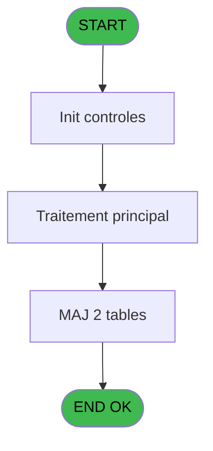

# REF IDE 882 - Bck Affectation Gift Pass

> **Analyse**: Phases 1-4 2026-02-03 14:54 -> 14:54 (13s) | Assemblage 14:54
> **Pipeline**: V7.2 Enrichi
> **Structure**: 4 onglets (Resume | Ecrans | Donnees | Connexions)

<!-- TAB:Resume -->

## 1. FICHE D'IDENTITE

| Attribut | Valeur |
|----------|--------|
| Projet | REF |
| IDE Position | 882 |
| Nom Programme | Bck Affectation Gift Pass |
| Fichier source | `Prg_882.xml` |
| Dossier IDE | General |
| Taches | 4 (0 ecrans visibles) |
| Tables modifiees | 2 |
| Programmes appeles | 0 |
| :warning: Statut | **ORPHELIN_POTENTIEL** |

## 2. DESCRIPTION FONCTIONNELLE

**Bck Affectation Gift Pass** assure la gestion complete de ce processus.

Le flux de traitement s'organise en **2 blocs fonctionnels** :

- **Calcul** (2 taches) : calculs de montants, stocks ou compteurs
- **Traitement** (2 taches) : traitements metier divers

**Donnees modifiees** : 2 tables en ecriture (cc_total_par_type, cc_type_detail).

**Logique metier** : 1 regles identifiees couvrant conditions metier.

Detail : phases du traitement

#### Phase 1 : Traitement (2 taches)

- **882** - Bck Affectation Gift Pass
- **882.2** - Affectation Gift Pass

#### Phase 2 : Calcul (2 taches)

- **882.1** - Calcul Gift Pass Devise Locale
- **882.3** - Calcul cumul Gift Pass

#### Tables impactees

| Table | Operations | Role metier |
|-------|-----------|-------------|
| cc_type_detail | **W**/L (2 usages) |  |
| cc_total_par_type | **W** (1 usages) |  |

## 3. BLOCS FONCTIONNELS

### 3.1 Traitement (2 taches)

Traitements internes.

---

#### 882 - Bck Affectation Gift Pass

**Role** : Calcul fidelite/avantage : Bck Affectation Gift Pass.
**Variables liees** : E (Cumul Gift Pass deja affecté), F (Montant Gift Pass Devise Villag)

---

#### 882.2 - Affectation Gift Pass

**Role** : Calcul fidelite/avantage : Affectation Gift Pass.
**Variables liees** : E (Cumul Gift Pass deja affecté), F (Montant Gift Pass Devise Villag)

### 3.2 Calcul (2 taches)

Calculs metier : montants, stocks, compteurs.

---

#### 882.1 - Calcul Gift Pass Devise Locale

**Role** : Calcul : Calcul Gift Pass Devise Locale.
**Variables liees** : E (Cumul Gift Pass deja affecté), F (Montant Gift Pass Devise Villag)

---

#### 882.3 - Calcul cumul Gift Pass

**Role** : Calcul : Calcul cumul Gift Pass.
**Variables liees** : E (Cumul Gift Pass deja affecté), F (Montant Gift Pass Devise Villag)

## 5. REGLES METIER

1 regles identifiees:

### Autres (1 regles)

#### [RM-001] Si [AI]>[AH] alors [AI]-[AH] sinon 0)

| Element | Detail |
|---------|--------|
| **Condition** | `[AI]>[AH]` |
| **Si vrai** | [AI]-[AH] |
| **Si faux** | 0) |
| **Expression source** | Expression 12 : `IF([AI]>[AH],[AI]-[AH],0)` |
| **Exemple** | Si [AI]>[AH] → [AI]-[AH]. Sinon → 0) |

## 6. CONTEXTE

- **Appele par**: (aucun)
- **Appelle**: 0 programmes | **Tables**: 8 (W:2 R:2 L:5) | **Taches**: 4 | **Expressions**: 20

<!-- TAB:Ecrans -->

## 8. ECRANS

*(Programme sans ecran visible)*

## 9. NAVIGATION

### 9.3 Structure hierarchique (4 taches)

| Position | Tache | Type | Dimensions | Bloc |
|----------|-------|------|------------|------|
| **882.1** | [**Bck Affectation Gift Pass** (882)](#t1) | - | - | Traitement |
| 882.1.1 | [Affectation Gift Pass (882.2)](#t3) | - | - | |
| **882.2** | [**Calcul Gift Pass Devise Locale** (882.1)](#t2) | - | - | Calcul |
| 882.2.1 | [Calcul cumul Gift Pass (882.3)](#t4) | - | - | |

### 9.4 Algorigramme

> **Legende**: Vert = START/END OK | Rouge = END KO | Bleu = Decisions
> *Algorigramme auto-genere. Utiliser `/algorigramme` pour une synthese metier detaillee.*

<!-- TAB:Donnees -->

## 10. TABLES

### Tables utilisees (8)

| ID | Nom | Description | Type | R | W | L | Usages |
|----|-----|-------------|------|---|---|---|--------|
| 34 | hebergement______heb | Hebergement (chambres) | DB | R |   |   | 1 |
| 50 | moyens_reglement_mor | Reglements / paiements | DB | R |   |   | 1 |
| 69 | initialisation___ini |  | DB |   |   | L | 1 |
| 268 | cc_total_par_type |  | DB |   | **W** |   | 1 |
| 272 | cc_type_detail |  | DB |   | **W** | L | 2 |
| 356 | gm_millesia |  | DB |   |   | L | 1 |
| 368 | pms_village |  | DB |   |   | L | 1 |
| 868 | Affectation_Gift_Pass |  | DB |   |   | L | 1 |

### Colonnes par table (2 / 4 tables avec colonnes identifiees)

Table 34 - hebergement______heb (R) - 1 usages

| Lettre | Variable | Acces | Type |
|--------|----------|-------|------|
| A | P.Societe | R | Unicode |
| B | P.Compte | R | Numeric |
| C | P.Filiation | R | Numeric |
| D | V.DureeSejour | R | Numeric |
| E | Cumul Gift Pass deja affecté | R | Numeric |
| F | Montant Gift Pass Devise Villag | R | Numeric |

Table 50 - moyens_reglement_mor (R) - 1 usages

*Table utilisee uniquement en Link ou aucune colonne Real identifiee dans le DataView.*

Table 268 - cc_total_par_type (**W**) - 1 usages

*Table utilisee uniquement en Link ou aucune colonne Real identifiee dans le DataView.*

Table 272 - cc_type_detail (**W**/L) - 2 usages

*Table utilisee uniquement en Link ou aucune colonne Real identifiee dans le DataView.*

## 11. VARIABLES

### 11.1 Parametres entrants (3)

Variables recues en parametre.

| Lettre | Nom | Type | Usage dans |
|--------|-----|------|-----------|
| A | P.Societe | Unicode | 2x parametre entrant |
| B | P.Compte | Numeric | 2x parametre entrant |
| C | P.Filiation | Numeric | 2x parametre entrant |

### 11.2 Variables de session (1)

Variables persistantes pendant toute la session.

| Lettre | Nom | Type | Usage dans |
|--------|-----|------|-----------|
| D | V.DureeSejour | Numeric | - |

### 11.3 Autres (2)

Variables diverses.

| Lettre | Nom | Type | Usage dans |
|--------|-----|------|-----------|
| E | Cumul Gift Pass deja affecté | Numeric | - |
| F | Montant Gift Pass Devise Villag | Numeric | - |

## 12. EXPRESSIONS

**20 / 20 expressions decodees (100%)**

### 12.1 Repartition par type

| Type | Expressions | Regles |
|------|-------------|--------|
| CONDITION | 5 | 5 |
| CALCULATION | 1 | 0 |
| CONSTANTE | 4 | 0 |
| OTHER | 10 | 0 |

### 12.2 Expressions cles par type

#### CONDITION (5 expressions)

| Type | IDE | Expression | Regle |
|------|-----|------------|-------|
| CONDITION | 12 | `IF([AI]>[AH],[AI]-[AH],0)` | [RM-001](#rm-RM-001) |
| CONDITION | 11 | `Cumul Gift Pass deja a... [E]<>'EUR'` | - |
| CONDITION | 13 | `[AI]>0` | - |
| CONDITION | 9 | `[AB]+[AG]>0 AND [L]<>'O'` | - |
| CONDITION | 6 | `[K]<>'N'` | - |

#### CALCULATION (1 expressions)

| Type | IDE | Expression | Regle |
|------|-----|------------|-------|
| CALCULATION | 19 | `[V]- [Q]` | - |

#### CONSTANTE (4 expressions)

| Type | IDE | Expression | Regle |
|------|-----|------------|-------|
| CONSTANTE | 17 | `'A'` | - |
| CONSTANTE | 18 | `'Z'` | - |
| CONSTANTE | 4 | `'FID'` | - |
| CONSTANTE | 7 | `'VIP'` | - |

#### OTHER (10 expressions)

| Type | IDE | Expression | Regle |
|------|-----|------------|-------|
| OTHER | 14 | `P.Societe [A]` | - |
| OTHER | 10 | `MAX([AB],[AG])` | - |
| OTHER | 15 | `P.Compte [B]` | - |
| OTHER | 20 | `CndRange(VG27,[W])` | - |
| OTHER | 16 | `P.Filiation [C]` | - |
| ... | | *+5 autres* | |

<!-- TAB:Connexions -->

## 13. GRAPHE D'APPELS

### 13.1 Chaine depuis Main (Callers)

**Chemin**: (pas de callers directs)

### 13.2 Callers

| IDE | Nom Programme | Nb Appels |
|-----|---------------|-----------|
| - | (aucun) | - |

### 13.3 Callees (programmes appeles)

### 13.4 Detail Callees avec contexte

| IDE | Nom Programme | Appels | Contexte |
|-----|---------------|--------|----------|
| - | (aucun) | - | - |

## 14. RECOMMANDATIONS MIGRATION

### 14.1 Profil du programme

| Metrique | Valeur | Impact migration |
|----------|--------|-----------------|
| Lignes de logique | 121 | Programme compact |
| Expressions | 20 | Peu de logique |
| Tables WRITE | 2 | Impact faible |
| Sous-programmes | 0 | Peu de dependances |
| Ecrans visibles | 0 | Ecran unique ou traitement batch |
| Code desactive | 0% (0 / 121) | Code sain |
| Regles metier | 1 | Quelques regles a preserver |

### 14.2 Plan de migration par bloc

#### Traitement (2 taches: 0 ecran, 2 traitements)

- **Strategie** : 2 service(s) backend injectable(s) (Domain Services).
- Decomposer les taches en services unitaires testables.

#### Calcul (2 taches: 0 ecran, 2 traitements)

- **Strategie** : Services de calcul purs (Domain Services).
- Migrer la logique de calcul (stock, compteurs, montants)

### 14.3 Dependances critiques

| Dependance | Type | Appels | Impact |
|------------|------|--------|--------|
| cc_total_par_type | Table WRITE (Database) | 1x | Schema + repository |
| cc_type_detail | Table WRITE (Database) | 1x | Schema + repository |

---
*Spec DETAILED generee par Pipeline V7.2 - 2026-02-03 14:54*
