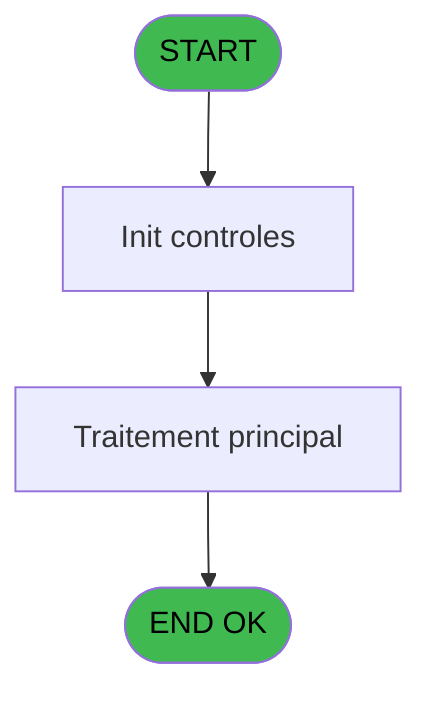
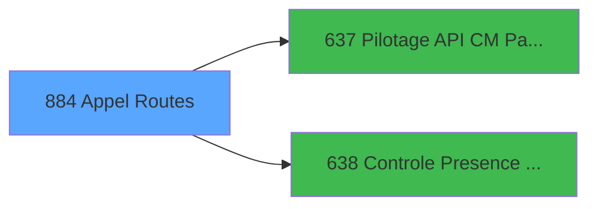

# REF IDE 884 - Appel Routes

> **Analyse**: Phases 1-4 2026-02-03 14:54 -> 14:54 (13s) | Assemblage 14:54
> **Pipeline**: V7.2 Enrichi
> **Structure**: 4 onglets (Resume | Ecrans | Donnees | Connexions)

<!-- TAB:Resume -->

## 1. FICHE D'IDENTITE

| Attribut | Valeur |
|----------|--------|
| Projet | REF |
| IDE Position | 884 |
| Nom Programme | Appel Routes |
| Fichier source | `Prg_884.xml` |
| Dossier IDE | General |
| Taches | 1 (1 ecrans visibles) |
| Tables modifiees | 0 |
| Programmes appeles | 2 |
| :warning: Statut | **ORPHELIN_POTENTIEL** |

## 2. DESCRIPTION FONCTIONNELLE

**Appel Routes** assure la gestion complete de ce processus.

Le flux de traitement s'organise en **1 blocs fonctionnels** :

- **Traitement** (1 tache) : traitements metier divers

## 3. BLOCS FONCTIONNELS

### 3.1 Traitement (1 tache)

Traitements internes.

---

#### 884 - Appel Routes [[ECRAN]](#ecran-t1)

**Role** : Traitement : Appel Routes.
**Ecran** : 816 x 386 DLU | [Voir mockup](#ecran-t1)

## 5. REGLES METIER

*(Aucune regle metier identifiee)*

## 6. CONTEXTE

- **Appele par**: (aucun)
- **Appelle**: 2 programmes | **Tables**: 0 (W:0 R:0 L:0) | **Taches**: 1 | **Expressions**: 1

<!-- TAB:Ecrans -->

## 8. ECRANS

### 8.1 Forms visibles (1 / 1)

| # | Position | Tache | Nom | Type | Largeur | Hauteur | Bloc |
|---|----------|-------|-----|------|---------|---------|------|
| 1 | 884 | 884 | Appel Routes | Type0 | 816 | 386 | Traitement |

### 8.2 Mockups Ecrans

---

#### 884 - Appel Routes
**Tache** : [884](#t1) | **Type** : Type0 | **Dimensions** : 816 x 386 DLU
**Bloc** : Traitement | **Titre IDE** : Appel Routes

<!-- FORM-DATA:
{
    "width":  816,
    "vFactor":  8,
    "type":  "Type0",
    "hFactor":  8,
    "controls":  [
                     {
                         "x":  279,
                         "type":  "label",
                         "var":  "",
                         "y":  9,
                         "w":  91,
                         "fmt":  "",
                         "name":  "",
                         "h":  9,
                         "color":  "",
                         "text":  "v.Operation",
                         "parent":  null
                     },
                     {
                         "x":  279,
                         "type":  "label",
                         "var":  "",
                         "y":  25,
                         "w":  75,
                         "fmt":  "",
                         "name":  "",
                         "h":  9,
                         "color":  "",
                         "text":  "v.Compte",
                         "parent":  null
                     },
                     {
                         "x":  279,
                         "type":  "label",
                         "var":  "",
                         "y":  41,
                         "w":  74,
                         "fmt":  "",
                         "name":  "",
                         "h":  9,
                         "color":  "",
                         "text":  "v.Filiation",
                         "parent":  null
                     },
                     {
                         "x":  279,
                         "type":  "label",
                         "var":  "",
                         "y":  57,
                         "w":  80,
                         "fmt":  "",
                         "name":  "",
                         "h":  9,
                         "color":  "",
                         "text":  "v.Montant",
                         "parent":  null
                     },
                     {
                         "x":  0,
                         "type":  "label",
                         "var":  "",
                         "y":  95,
                         "w":  67,
                         "fmt":  "",
                         "name":  "",
                         "h":  9,
                         "color":  "",
                         "text":  "v.Token",
                         "parent":  null
                     },
                     {
                         "x":  10,
                         "type":  "label",
                         "var":  "",
                         "y":  215,
                         "w":  88,
                         "fmt":  "",
                         "name":  "",
                         "h":  9,
                         "color":  "",
                         "text":  "v.Exp Time",
                         "parent":  null
                     },
                     {
                         "x":  10,
                         "type":  "label",
                         "var":  "",
                         "y":  233,
                         "w":  160,
                         "fmt":  "",
                         "name":  "",
                         "h":  9,
                         "color":  "",
                         "text":  "v.Token Carte Credit",
                         "parent":  null
                     },
                     {
                         "x":  10,
                         "type":  "label",
                         "var":  "",
                         "y":  252,
                         "w":  101,
                         "fmt":  "",
                         "name":  "",
                         "h":  9,
                         "color":  "",
                         "text":  "v.Type Carte",
                         "parent":  null
                     },
                     {
                         "x":  10,
                         "type":  "label",
                         "var":  "",
                         "y":  274,
                         "w":  91,
                         "fmt":  "",
                         "name":  "",
                         "h":  9,
                         "color":  "",
                         "text":  "v.Is Sucess",
                         "parent":  null
                     },
                     {
                         "x":  0,
                         "type":  "label",
                         "var":  "",
                         "y":  292,
                         "w":  86,
                         "fmt":  "",
                         "name":  "",
                         "h":  9,
                         "color":  "",
                         "text":  "v.Message",
                         "parent":  null
                     },
                     {
                         "x":  368,
                         "type":  "edit",
                         "var":  "",
                         "y":  9,
                         "w":  170,
                         "fmt":  "",
                         "name":  "v.Operation",
                         "h":  10,
                         "color":  "",
                         "text":  "",
                         "parent":  null
                     },
                     {
                         "x":  368,
                         "type":  "edit",
                         "var":  "",
                         "y":  25,
                         "w":  170,
                         "fmt":  "",
                         "name":  "v.Compte",
                         "h":  10,
                         "color":  "",
                         "text":  "",
                         "parent":  null
                     },
                     {
                         "x":  368,
                         "type":  "edit",
                         "var":  "",
                         "y":  41,
                         "w":  170,
                         "fmt":  "",
                         "name":  "v.Filiation",
                         "h":  10,
                         "color":  "",
                         "text":  "",
                         "parent":  null
                     },
                     {
                         "x":  368,
                         "type":  "edit",
                         "var":  "",
                         "y":  57,
                         "w":  170,
                         "fmt":  "",
                         "name":  "v.Montant",
                         "h":  10,
                         "color":  "",
                         "text":  "",
                         "parent":  null
                     },
                     {
                         "x":  0,
                         "type":  "edit",
                         "var":  "",
                         "y":  108,
                         "w":  816,
                         "fmt":  "",
                         "name":  "v.Token",
                         "h":  98,
                         "color":  "",
                         "text":  "",
                         "parent":  null
                     },
                     {
                         "x":  174,
                         "type":  "edit",
                         "var":  "",
                         "y":  216,
                         "w":  365,
                         "fmt":  "",
                         "name":  "v.Exp Time",
                         "h":  10,
                         "color":  "",
                         "text":  "",
                         "parent":  null
                     },
                     {
                         "x":  174,
                         "type":  "edit",
                         "var":  "",
                         "y":  233,
                         "w":  365,
                         "fmt":  "",
                         "name":  "v.Token Carte Credit",
                         "h":  10,
                         "color":  "",
                         "text":  "",
                         "parent":  null
                     },
                     {
                         "x":  174,
                         "type":  "edit",
                         "var":  "",
                         "y":  253,
                         "w":  365,
                         "fmt":  "",
                         "name":  "v.Type Carte",
                         "h":  10,
                         "color":  "",
                         "text":  "",
                         "parent":  null
                     },
                     {
                         "x":  174,
                         "type":  "edit",
                         "var":  "",
                         "y":  275,
                         "w":  365,
                         "fmt":  "",
                         "name":  "v.Is Sucess",
                         "h":  10,
                         "color":  "",
                         "text":  "",
                         "parent":  null
                     },
                     {
                         "x":  0,
                         "type":  "edit",
                         "var":  "",
                         "y":  306,
                         "w":  816,
                         "fmt":  "",
                         "name":  "v.Message",
                         "h":  40,
                         "color":  "",
                         "text":  "",
                         "parent":  null
                     },
                     {
                         "x":  343,
                         "type":  "button",
                         "var":  "",
                         "y":  364,
                         "w":  131,
                         "fmt":  "Appel API",
                         "name":  "",
                         "h":  14,
                         "color":  "",
                         "text":  "",
                         "parent":  null
                     }
                 ],
    "taskId":  "884",
    "height":  386
}
-->

<strong>Champs : 10 champs</strong>

| Pos (x,y) | Nom | Variable | Type |
|-----------|-----|----------|------|
| 368,9 | v.Operation | - | edit |
| 368,25 | v.Compte | - | edit |
| 368,41 | v.Filiation | - | edit |
| 368,57 | v.Montant | - | edit |
| 0,108 | v.Token | - | edit |
| 174,216 | v.Exp Time | - | edit |
| 174,233 | v.Token Carte Credit | - | edit |
| 174,253 | v.Type Carte | - | edit |
| 174,275 | v.Is Sucess | - | edit |
| 0,306 | v.Message | - | edit |

<strong>Boutons : 1 boutons</strong>

| Bouton | Pos (x,y) | Action |
|--------|-----------|--------|
| Appel API | 343,364 | Bouton fonctionnel |

## 9. NAVIGATION

Ecran unique: **Appel Routes**

### 9.3 Structure hierarchique (1 tache)

| Position | Tache | Type | Dimensions | Bloc |
|----------|-------|------|------------|------|
| **884.1** | [**Appel Routes** (884)](#t1) [mockup](#ecran-t1) | - | 816x386 | Traitement |

### 9.4 Algorigramme

> **Legende**: Vert = START/END OK | Rouge = END KO | Bleu = Decisions
> *Algorigramme auto-genere. Utiliser `/algorigramme` pour une synthese metier detaillee.*

<!-- TAB:Donnees -->

## 10. TABLES

### Tables utilisees (0)

| ID | Nom | Description | Type | R | W | L | Usages |
|----|-----|-------------|------|---|---|---|--------|

### Colonnes par table (0 / 0 tables avec colonnes identifiees)

## 11. VARIABLES

### 11.1 Variables de session (10)

Variables persistantes pendant toute la session.

| Lettre | Nom | Type | Usage dans |
|--------|-----|------|-----------|
| A | v.Token | Unicode | - |
| B | v.Exp Time | Time | - |
| C | v.Operation | Unicode | - |
| D | v.Compte | Numeric | - |
| E | v.Filiation | Numeric | - |
| F | v.Montant | Numeric | - |
| G | v.Token Carte Credit | Unicode | - |
| H | v.Type Carte | Unicode | - |
| I | v.Is Sucess | Logical | - |
| J | v.Message | Unicode | - |

## 12. EXPRESSIONS

**1 / 1 expressions decodees (100%)**

### 12.1 Repartition par type

| Type | Expressions | Regles |
|------|-------------|--------|
| CONSTANTE | 1 | 0 |

### 12.2 Expressions cles par type

#### CONSTANTE (1 expressions)

| Type | IDE | Expression | Regle |
|------|-----|------------|-------|
| CONSTANTE | 1 | `'C'` | - |

<!-- TAB:Connexions -->

## 13. GRAPHE D'APPELS

### 13.1 Chaine depuis Main (Callers)

**Chemin**: (pas de callers directs)

### 13.2 Callers

| IDE | Nom Programme | Nb Appels |
|-----|---------------|-----------|
| - | (aucun) | - |

### 13.3 Callees (programmes appeles)

### 13.4 Detail Callees avec contexte

| IDE | Nom Programme | Appels | Contexte |
|-----|---------------|--------|----------|
| [637](REF-IDE-637.md) | Pilotage API CM Paiements | 1 | Sous-programme |
| [638](REF-IDE-638.md) | Controle Presence Garantie | 1 | Controle/validation |

## 14. RECOMMANDATIONS MIGRATION

### 14.1 Profil du programme

| Metrique | Valeur | Impact migration |
|----------|--------|-----------------|
| Lignes de logique | 13 | Programme compact |
| Expressions | 1 | Peu de logique |
| Tables WRITE | 0 | Impact faible |
| Sous-programmes | 2 | Peu de dependances |
| Ecrans visibles | 1 | Ecran unique ou traitement batch |
| Code desactive | 7.7% (1 / 13) | A verifier |
| Regles metier | 0 | Pas de regle identifiee |

### 14.2 Plan de migration par bloc

#### Traitement (1 tache: 1 ecran, 0 traitement)

- **Strategie** : 1 composant(s) UI (Razor/React) avec formulaires et validation.
- 2 sous-programme(s) a migrer ou a reutiliser depuis les services existants.
- Decomposer les taches en services unitaires testables.

### 14.3 Dependances critiques

| Dependance | Type | Appels | Impact |
|------------|------|--------|--------|
| [Controle Presence Garantie (IDE 638)](REF-IDE-638.md) | Sous-programme | 1x | Normale - Controle/validation |
| [Pilotage API CM Paiements (IDE 637)](REF-IDE-637.md) | Sous-programme | 1x | Normale - Sous-programme |

---
*Spec DETAILED generee par Pipeline V7.2 - 2026-02-03 14:54*
