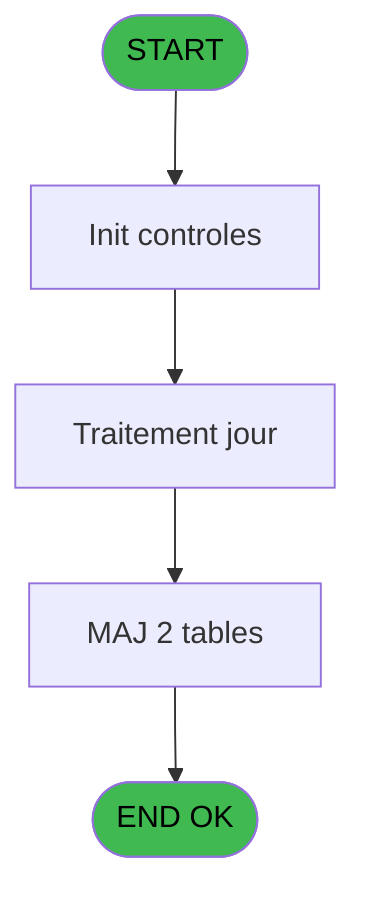
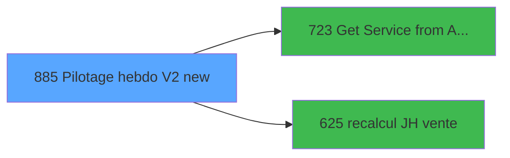

# REF IDE 885 - Pilotage hebdo V2 new

> **Analyse**: Phases 1-4 2026-02-03 14:55 -> 14:55 (13s) | Assemblage 14:55
> **Pipeline**: V7.2 Enrichi
> **Structure**: 4 onglets (Resume | Ecrans | Donnees | Connexions)

<!-- TAB:Resume -->

## 1. FICHE D'IDENTITE

| Attribut | Valeur |
|----------|--------|
| Projet | REF |
| IDE Position | 885 |
| Nom Programme | Pilotage hebdo V2 new |
| Fichier source | `Prg_885.xml` |
| Dossier IDE | General |
| Taches | 45 (0 ecrans visibles) |
| Tables modifiees | 2 |
| Programmes appeles | 2 |
| :warning: Statut | **ORPHELIN_POTENTIEL** |

## 2. DESCRIPTION FONCTIONNELLE

**Pilotage hebdo V2 new** assure la gestion complete de ce processus.

Le flux de traitement s'organise en **3 blocs fonctionnels** :

- **Traitement** (33 taches) : traitements metier divers
- **Saisie** (7 taches) : ecrans de saisie utilisateur (formulaires, champs, donnees)
- **Calcul** (5 taches) : calculs de montants, stocks ou compteurs

**Donnees modifiees** : 2 tables en ecriture (tables_imports, log_pilotage_hebdo).

Detail : phases du traitement

#### Phase 1 : Traitement (33 taches)

- **885** - (sans nom)
- **885.1** - suppression log bar
- **885.2** - Pilotage hebdo
- **885.2.1** - Export
- **885.2.1.1.1** - Parcourt imputation SQL **[[ECRAN]](#ecran-t6)**
- **885.2.1.1.1.1** - Export OD
- **885.2.1.1.4** - Parcourt imputation SQL **[[ECRAN]](#ecran-t13)**
- **885.2.1.1.4.1** - Export OD
- **885.2.1.2** - Export coin boutique
- **885.2.1.2.1** - Export OD
- **885.2.1.2.4** - Export OD
- **885.2.1.3** - CBAR **[[ECRAN]](#ecran-t21)**
- **885.2.1.3.1** - Trace
- **885.2.1.4** - CSM **[[ECRAN]](#ecran-t23)**
- **885.2.1.5** - CSM **[[ECRAN]](#ecran-t24)**
- **885.2.1.6** - CECO **[[ECRAN]](#ecran-t25)**
- **885.2.1.7** - VSTKM **[[ECRAN]](#ecran-t26)**
- **885.2.1.7.1** - Trace
- **885.2.1.8** - CECO **[[ECRAN]](#ecran-t28)**
- **885.2.1.9** - Export JH
- **885.2.1.10** - Export VRL / VSL
- **885.2.1.11** - Export Boutique
- **885.2.1.12** - Export Telephone
- **885.2.1.12.1** - Export Boutique
- **885.2.1.12.2** - Export Boutique
- **885.2.1.12.3** - Export Boutique
- **885.2.1.12.4** - Export Boutique
- **885.2.1.14.1** - View
- **885.2.1.15** - Export Chambres
- **885.2.1.15.2** - Chambres Occupées
- **885.2.1.15.3** - Chambres Occupées Archive
- **885.2.2** - Recupère date FME **[[ECRAN]](#ecran-t44)**
- **885.3** - nb lieu sejour

Delegue a : [Get Service from Activity (IDE 723)](REF-IDE-723.md)

#### Phase 2 : Saisie (7 taches)

- **885.2.1.1** - Select service point de vente **[[ECRAN]](#ecran-t5)**
- **885.2.1.1.1.2** - Export Ventes
- **885.2.1.1.2** - Export Point de Vente **[[ECRAN]](#ecran-t9)**
- **885.2.1.1.3** - Export Point de Vente **[[ECRAN]](#ecran-t11)**
- **885.2.1.1.4.2** - Export Ventes
- **885.2.1.2.2** - Export Ventes
- **885.2.1.2.3** - Export Ventes

Delegue a : [recalcul JH vente (IDE 625)](REF-IDE-625.md)

#### Phase 3 : Calcul (5 taches)

- **885.2.1.1.2.1** - Calcul Montant
- **885.2.1.1.3.1** - Calcul Montant
- **885.2.1.13** - Calcul Somme Bar Cost **[[ECRAN]](#ecran-t37)**
- **885.2.1.14** - Calcul conso mensuelle food **[[ECRAN]](#ecran-t38)**
- **885.2.1.15.1** - Comptage Chambres

Delegue a : [recalcul JH vente (IDE 625)](REF-IDE-625.md)

#### Tables impactees

| Table | Operations | Role metier |
|-------|-----------|-------------|
| tables_imports | R/**W**/L (17 usages) |  |
| log_pilotage_hebdo | R/**W** (5 usages) | Hebergement (chambres) |

## 3. BLOCS FONCTIONNELS

### 3.1 Traitement (33 taches)

Traitements internes.

---

#### 885 - (sans nom)

**Role** : Tache d'orchestration : point d'entree du programme (33 sous-taches). Coordonne l'enchainement des traitements.

32 sous-taches directes

| Tache | Nom | Bloc |
|-------|-----|------|
| [885.1](#t2) | suppression log bar | Traitement |
| [885.2](#t3) | Pilotage hebdo | Traitement |
| [885.2.1](#t4) | Export | Traitement |
| [885.2.1.1.1](#t6) | Parcourt imputation SQL **[[ECRAN]](#ecran-t6)** | Traitement |
| [885.2.1.1.1.1](#t7) | Export OD | Traitement |
| [885.2.1.1.4](#t13) | Parcourt imputation SQL **[[ECRAN]](#ecran-t13)** | Traitement |
| [885.2.1.1.4.1](#t14) | Export OD | Traitement |
| [885.2.1.2](#t16) | Export coin boutique | Traitement |
| [885.2.1.2.1](#t17) | Export OD | Traitement |
| [885.2.1.2.4](#t20) | Export OD | Traitement |
| [885.2.1.3](#t21) | CBAR **[[ECRAN]](#ecran-t21)** | Traitement |
| [885.2.1.3.1](#t22) | Trace | Traitement |
| [885.2.1.4](#t23) | CSM **[[ECRAN]](#ecran-t23)** | Traitement |
| [885.2.1.5](#t24) | CSM **[[ECRAN]](#ecran-t24)** | Traitement |
| [885.2.1.6](#t25) | CECO **[[ECRAN]](#ecran-t25)** | Traitement |
| [885.2.1.7](#t26) | VSTKM **[[ECRAN]](#ecran-t26)** | Traitement |
| [885.2.1.7.1](#t27) | Trace | Traitement |
| [885.2.1.8](#t28) | CECO **[[ECRAN]](#ecran-t28)** | Traitement |
| [885.2.1.9](#t29) | Export JH | Traitement |
| [885.2.1.10](#t30) | Export VRL / VSL | Traitement |
| [885.2.1.11](#t31) | Export Boutique | Traitement |
| [885.2.1.12](#t32) | Export Telephone | Traitement |
| [885.2.1.12.1](#t33) | Export Boutique | Traitement |
| [885.2.1.12.2](#t34) | Export Boutique | Traitement |
| [885.2.1.12.3](#t35) | Export Boutique | Traitement |
| [885.2.1.12.4](#t36) | Export Boutique | Traitement |
| [885.2.1.14.1](#t39) | View | Traitement |
| [885.2.1.15](#t40) | Export Chambres | Traitement |
| [885.2.1.15.2](#t42) | Chambres Occupées | Traitement |
| [885.2.1.15.3](#t43) | Chambres Occupées Archive | Traitement |
| [885.2.2](#t44) | Recupère date FME **[[ECRAN]](#ecran-t44)** | Traitement |
| [885.3](#t45) | nb lieu sejour | Traitement |

---

#### 885.1 - suppression log bar

**Role** : Traitement : suppression log bar.

---

#### 885.2 - Pilotage hebdo

**Role** : Traitement : Pilotage hebdo.

---

#### 885.2.1 - Export

**Role** : Traitement : Export.

---

#### 885.2.1.1.1 - Parcourt imputation SQL [[ECRAN]](#ecran-t6)

**Role** : Traitement : Parcourt imputation SQL.
**Ecran** : 358 x 195 DLU | [Voir mockup](#ecran-t6)
**Variables liees** : K (V.Date debut parcourt quotidien)

---

#### 885.2.1.1.1.1 - Export OD

**Role** : Traitement : Export OD.

---

#### 885.2.1.1.4 - Parcourt imputation SQL [[ECRAN]](#ecran-t13)

**Role** : Traitement : Parcourt imputation SQL.
**Ecran** : 358 x 195 DLU | [Voir mockup](#ecran-t13)
**Variables liees** : K (V.Date debut parcourt quotidien)

---

#### 885.2.1.1.4.1 - Export OD

**Role** : Traitement : Export OD.

---

#### 885.2.1.2 - Export coin boutique

**Role** : Traitement : Export coin boutique.

---

#### 885.2.1.2.1 - Export OD

**Role** : Traitement : Export OD.

---

#### 885.2.1.2.4 - Export OD

**Role** : Traitement : Export OD.

---

#### 885.2.1.3 - CBAR [[ECRAN]](#ecran-t21)

**Role** : Traitement : CBAR.
**Ecran** : 171 x 195 DLU | [Voir mockup](#ecran-t21)

---

#### 885.2.1.3.1 - Trace

**Role** : Traitement : Trace.

---

#### 885.2.1.4 - CSM [[ECRAN]](#ecran-t23)

**Role** : Traitement interne.
**Ecran** : 171 x 195 DLU | [Voir mockup](#ecran-t23)

---

#### 885.2.1.5 - CSM [[ECRAN]](#ecran-t24)

**Role** : Traitement interne.
**Ecran** : 171 x 195 DLU | [Voir mockup](#ecran-t24)

---

#### 885.2.1.6 - CECO [[ECRAN]](#ecran-t25)

**Role** : Traitement : CECO.
**Ecran** : 171 x 195 DLU | [Voir mockup](#ecran-t25)

---

#### 885.2.1.7 - VSTKM [[ECRAN]](#ecran-t26)

**Role** : Traitement : VSTKM.
**Ecran** : 171 x 195 DLU | [Voir mockup](#ecran-t26)

---

#### 885.2.1.7.1 - Trace

**Role** : Traitement : Trace.

---

#### 885.2.1.8 - CECO [[ECRAN]](#ecran-t28)

**Role** : Traitement : CECO.
**Ecran** : 171 x 195 DLU | [Voir mockup](#ecran-t28)

---

#### 885.2.1.9 - Export JH

**Role** : Traitement : Export JH.

---

#### 885.2.1.10 - Export VRL / VSL

**Role** : Traitement : Export VRL / VSL.

---

#### 885.2.1.11 - Export Boutique

**Role** : Traitement : Export Boutique.

---

#### 885.2.1.12 - Export Telephone

**Role** : Traitement : Export Telephone.

---

#### 885.2.1.12.1 - Export Boutique

**Role** : Traitement : Export Boutique.

---

#### 885.2.1.12.2 - Export Boutique

**Role** : Traitement : Export Boutique.

---

#### 885.2.1.12.3 - Export Boutique

**Role** : Traitement : Export Boutique.

---

#### 885.2.1.12.4 - Export Boutique

**Role** : Traitement : Export Boutique.

---

#### 885.2.1.14.1 - View

**Role** : Traitement : View.

---

#### 885.2.1.15 - Export Chambres

**Role** : Traitement : Export Chambres.

---

#### 885.2.1.15.2 - Chambres Occupées

**Role** : Traitement : Chambres Occupées.

---

#### 885.2.1.15.3 - Chambres Occupées Archive

**Role** : Traitement : Chambres Occupées Archive.

---

#### 885.2.2 - Recupère date FME [[ECRAN]](#ecran-t44)

**Role** : Consultation/chargement : Recupère date FME.
**Ecran** : 179 x 195 DLU | [Voir mockup](#ecran-t44)
**Variables liees** : A (P.Date debut), B (P.Date fin), K (V.Date debut parcourt quotidien)

---

#### 885.3 - nb lieu sejour

**Role** : Traitement : nb lieu sejour.
**Variables liees** : F (V.Nb lieu de sejour)

### 3.2 Saisie (7 taches)

L'operateur saisit les donnees de la transaction via 3 ecrans (Select service point de vente, Export Point de Vente, Export Point de Vente).

---

#### 885.2.1.1 - Select service point de vente [[ECRAN]](#ecran-t5)

**Role** : Saisie des donnees : Select service point de vente.
**Ecran** : 120 x 195 DLU | [Voir mockup](#ecran-t5)
**Delegue a** : [recalcul JH vente (IDE 625)](REF-IDE-625.md)

---

#### 885.2.1.1.1.2 - Export Ventes

**Role** : Saisie des donnees : Export Ventes.
**Delegue a** : [recalcul JH vente (IDE 625)](REF-IDE-625.md)

---

#### 885.2.1.1.2 - Export Point de Vente [[ECRAN]](#ecran-t9)

**Role** : Saisie des donnees : Export Point de Vente.
**Ecran** : 841 x 238 DLU | [Voir mockup](#ecran-t9)
**Delegue a** : [recalcul JH vente (IDE 625)](REF-IDE-625.md)

---

#### 885.2.1.1.3 - Export Point de Vente [[ECRAN]](#ecran-t11)

**Role** : Saisie des donnees : Export Point de Vente.
**Ecran** : 841 x 238 DLU | [Voir mockup](#ecran-t11)
**Delegue a** : [recalcul JH vente (IDE 625)](REF-IDE-625.md)

---

#### 885.2.1.1.4.2 - Export Ventes

**Role** : Saisie des donnees : Export Ventes.
**Delegue a** : [recalcul JH vente (IDE 625)](REF-IDE-625.md)

---

#### 885.2.1.2.2 - Export Ventes

**Role** : Saisie des donnees : Export Ventes.
**Delegue a** : [recalcul JH vente (IDE 625)](REF-IDE-625.md)

---

#### 885.2.1.2.3 - Export Ventes

**Role** : Saisie des donnees : Export Ventes.
**Delegue a** : [recalcul JH vente (IDE 625)](REF-IDE-625.md)

### 3.3 Calcul (5 taches)

Calculs metier : montants, stocks, compteurs.

---

#### 885.2.1.1.2.1 - Calcul Montant

**Role** : Calcul : Calcul Montant.

---

#### 885.2.1.1.3.1 - Calcul Montant

**Role** : Calcul : Calcul Montant.

---

#### 885.2.1.13 - Calcul Somme Bar Cost [[ECRAN]](#ecran-t37)

**Role** : Calcul : Calcul Somme Bar Cost.
**Ecran** : 270 x 195 DLU | [Voir mockup](#ecran-t37)
**Variables liees** : G (V.Somme facturation mois BR), H (V.Somme BCO Soft), I (V.Somme BCO BSI), J (V.Somme BCO HBSI)

---

#### 885.2.1.14 - Calcul conso mensuelle food [[ECRAN]](#ecran-t38)

**Role** : Calcul : Calcul conso mensuelle food.
**Ecran** : 694 x 334 DLU | [Voir mockup](#ecran-t38)

---

#### 885.2.1.15.1 - Comptage Chambres

**Role** : Traitement : Comptage Chambres.

## 5. REGLES METIER

*(Aucune regle metier identifiee)*

## 6. CONTEXTE

- **Appele par**: (aucun)
- **Appelle**: 2 programmes | **Tables**: 37 (W:2 R:13 L:28) | **Taches**: 45 | **Expressions**: 5

<!-- TAB:Ecrans -->

## 8. ECRANS

*(Programme sans ecran visible)*

## 9. NAVIGATION

### 9.3 Structure hierarchique (45 taches)

| Position | Tache | Type | Dimensions | Bloc |
|----------|-------|------|------------|------|
| **885.1** | [**(sans nom)** (885)](#t1) | - | - | Traitement |
| 885.1.1 | [suppression log bar (885.1)](#t2) | - | - | |
| 885.1.2 | [Pilotage hebdo (885.2)](#t3) | - | - | |
| 885.1.3 | [Export (885.2.1)](#t4) | - | - | |
| 885.1.4 | [Parcourt imputation SQL (885.2.1.1.1)](#t6) [mockup](#ecran-t6) | - | 358x195 | |
| 885.1.5 | [Export OD (885.2.1.1.1.1)](#t7) | - | - | |
| 885.1.6 | [Parcourt imputation SQL (885.2.1.1.4)](#t13) [mockup](#ecran-t13) | - | 358x195 | |
| 885.1.7 | [Export OD (885.2.1.1.4.1)](#t14) | - | - | |
| 885.1.8 | [Export coin boutique (885.2.1.2)](#t16) | - | - | |
| 885.1.9 | [Export OD (885.2.1.2.1)](#t17) | - | - | |
| 885.1.10 | [Export OD (885.2.1.2.4)](#t20) | - | - | |
| 885.1.11 | [CBAR (885.2.1.3)](#t21) [mockup](#ecran-t21) | - | 171x195 | |
| 885.1.12 | [Trace (885.2.1.3.1)](#t22) | - | - | |
| 885.1.13 | [CSM (885.2.1.4)](#t23) [mockup](#ecran-t23) | - | 171x195 | |
| 885.1.14 | [CSM (885.2.1.5)](#t24) [mockup](#ecran-t24) | - | 171x195 | |
| 885.1.15 | [CECO (885.2.1.6)](#t25) [mockup](#ecran-t25) | - | 171x195 | |
| 885.1.16 | [VSTKM (885.2.1.7)](#t26) [mockup](#ecran-t26) | - | 171x195 | |
| 885.1.17 | [Trace (885.2.1.7.1)](#t27) | - | - | |
| 885.1.18 | [CECO (885.2.1.8)](#t28) [mockup](#ecran-t28) | - | 171x195 | |
| 885.1.19 | [Export JH (885.2.1.9)](#t29) | - | - | |
| 885.1.20 | [Export VRL / VSL (885.2.1.10)](#t30) | - | - | |
| 885.1.21 | [Export Boutique (885.2.1.11)](#t31) | - | - | |
| 885.1.22 | [Export Telephone (885.2.1.12)](#t32) | - | - | |
| 885.1.23 | [Export Boutique (885.2.1.12.1)](#t33) | - | - | |
| 885.1.24 | [Export Boutique (885.2.1.12.2)](#t34) | - | - | |
| 885.1.25 | [Export Boutique (885.2.1.12.3)](#t35) | - | - | |
| 885.1.26 | [Export Boutique (885.2.1.12.4)](#t36) | - | - | |
| 885.1.27 | [View (885.2.1.14.1)](#t39) | - | - | |
| 885.1.28 | [Export Chambres (885.2.1.15)](#t40) | - | - | |
| 885.1.29 | [Chambres Occupées (885.2.1.15.2)](#t42) | - | - | |
| 885.1.30 | [Chambres Occupées Archive (885.2.1.15.3)](#t43) | - | - | |
| 885.1.31 | [Recupère date FME (885.2.2)](#t44) [mockup](#ecran-t44) | - | 179x195 | |
| 885.1.32 | [nb lieu sejour (885.3)](#t45) | - | - | |
| **885.2** | [**Select service point de vente** (885.2.1.1)](#t5) [mockup](#ecran-t5) | - | 120x195 | Saisie |
| 885.2.1 | [Export Ventes (885.2.1.1.1.2)](#t8) | - | - | |
| 885.2.2 | [Export Point de Vente (885.2.1.1.2)](#t9) [mockup](#ecran-t9) | - | 841x238 | |
| 885.2.3 | [Export Point de Vente (885.2.1.1.3)](#t11) [mockup](#ecran-t11) | - | 841x238 | |
| 885.2.4 | [Export Ventes (885.2.1.1.4.2)](#t15) | - | - | |
| 885.2.5 | [Export Ventes (885.2.1.2.2)](#t18) | - | - | |
| 885.2.6 | [Export Ventes (885.2.1.2.3)](#t19) | - | - | |
| **885.3** | [**Calcul Montant** (885.2.1.1.2.1)](#t10) | - | - | Calcul |
| 885.3.1 | [Calcul Montant (885.2.1.1.3.1)](#t12) | - | - | |
| 885.3.2 | [Calcul Somme Bar Cost (885.2.1.13)](#t37) [mockup](#ecran-t37) | - | 270x195 | |
| 885.3.3 | [Calcul conso mensuelle food (885.2.1.14)](#t38) [mockup](#ecran-t38) | - | 694x334 | |
| 885.3.4 | [Comptage Chambres (885.2.1.15.1)](#t41) | - | - | |

### 9.4 Algorigramme

> **Legende**: Vert = START/END OK | Rouge = END KO | Bleu = Decisions
> *Algorigramme auto-genere. Utiliser `/algorigramme` pour une synthese metier detaillee.*

<!-- TAB:Donnees -->

## 10. TABLES

### Tables utilisees (37)

| ID | Nom | Description | Type | R | W | L | Usages |
|----|-----|-------------|------|---|---|---|--------|
| 30 | gm-recherche_____gmr | Index de recherche | DB | R |   |   | 8 |
| 34 | hebergement______heb | Hebergement (chambres) | DB |   |   | L | 8 |
| 38 | comptable_gratuite |  | DB | R |   | L | 2 |
| 40 | comptable________cte |  | DB |   |   | L | 3 |
| 67 | tables___________tab |  | DB | R |   |   | 1 |
| 77 | articles_________art | Articles et stock | DB | R |   | L | 12 |
| 81 | societe__________soc |  | DB | R |   |   | 1 |
| 118 | tables_imports |  | DB | R | **W** | L | 17 |
| 120 | tables_qualites__qua |  | DB | R |   |   | 1 |
| 210 | plan_comptable_central_histo | Historique / journal | DB | R |   |   | 1 |
| 240 | saisie_pdc_boutique |  | DB |   |   | L | 1 |
| 245 | saisie_od_par_service | Services / filieres | DB |   |   | L | 1 |
| 263 | vente | Donnees de ventes | DB |   |   | L | 3 |
| 368 | pms_village |  | DB |   |   | L | 1 |
| 373 | pv_comptable |  | DB | R |   |   | 1 |
| 374 | pv_credit_card |  | DB |   |   | L | 2 |
| 375 | pv_cat |  | DB |   |   | L | 2 |
| 378 | pv_customer |  | DB |   |   | L | 1 |
| 392 | pv_invoicehistoline | Historique / journal | DB |   |   | L | 2 |
| 396 | pv_cust_packages |  | DB |   |   | L | 1 |
| 399 | pv_package_price |  | DB |   |   | L | 2 |
| 409 | pv_sub_cat |  | DB |   |   | L | 2 |
| 708 | param_retail |  | DB |   |   | L | 1 |
| 710 | pv_parametre_generaux |  | DB |   |   | L | 1 |
| 722 | arc_gm-recherche_____gmr | Index de recherche | DB | R |   | L | 7 |
| 724 | arc_comptable________cte |  | DB |   |   | L | 3 |
| 732 | arc_pv_comptable |  | DB | R |   |   | 1 |
| 733 | arc_pv_customer |  | DB |   |   | L | 1 |
| 734 | arc_pv_cust_packages |  | DB |   |   | L | 1 |
| 742 | BarCreditConso |  | DB |   |   | L | 2 |
| 744 | pv_lieux_vente | Donnees de ventes | DB |   |   | L | 2 |
| 770 | vente_vrl_vsl | Donnees de ventes | DB |   |   | L | 1 |
| 785 | effectif_quotidien |  | DB |   |   | L | 1 |
| 787 | comptestva | Comptes GM (generaux) | DB | R |   |   | 1 |
| 791 | log_pilotage_hebdo | Hebergement (chambres) | DB | R | **W** |   | 5 |
| 828 | arc_vente | Donnees de ventes | DB |   |   | L | 3 |
| 853 | arc_hebergement______heb | Hebergement (chambres) | DB |   |   | L | 8 |

### Colonnes par table (17 / 13 tables avec colonnes identifiees)

Table 30 - gm-recherche_____gmr (R) - 8 usages

| Lettre | Variable | Acces | Type |
|--------|----------|-------|------|
| A | Retour Gratuite | R | Logical |
| B | v.Montant | R | Numeric |
| C | v.Service | R | Unicode |
| D | v.Categorie | R | Unicode |
| E | v.Montant brut | R | Numeric |
| F | V.Montant brut Total | R | Numeric |
| G | V.NB JH Total | R | Numeric |
| H | V.Date | R | Date |

Table 38 - comptable_gratuite (R/L) - 2 usages

| Lettre | Variable | Acces | Type |
|--------|----------|-------|------|
| A | Retour Gratuite | R | Logical |
| B | v.Montant | R | Numeric |
| C | v.Service | R | Unicode |
| D | v.Categorie | R | Unicode |
| E | v.montant brut | R | Numeric |
| F | V.date | R | Date |

Table 67 - tables___________tab (R) - 1 usages

| Lettre | Variable | Acces | Type |
|--------|----------|-------|------|
| A | pv_service | R | Unicode |
| B | V.Montant export | R | Numeric |

Table 77 - articles_________art (R/L) - 12 usages

| Lettre | Variable | Acces | Type |
|--------|----------|-------|------|
| A | V.jour en cours | R | Date |
| B | V.Date fin de mois | R | Date |
| C | V.Date FME effectué ? | R | Date |

Table 81 - societe__________soc (R) - 1 usages

| Lettre | Variable | Acces | Type |
|--------|----------|-------|------|
| A | P.Date debut | R | Date |
| B | P.Date fin | R | Date |
| C | P.Code village | R | Alpha |
| D | P.Type fichier (Global/Jour) | R | Alpha |
| E | P.Appel de PBP ? | R | Logical |
| F | V.Nb lieu de sejour | R | Numeric |

Table 118 - tables_imports (R/**W**/L) - 17 usages

| Lettre | Variable | Acces | Type |
|--------|----------|-------|------|
| A | V.Montant brut | W | Numeric |
| B | v.Nombre de Chambres Occupées | W | Numeric |

Table 120 - tables_qualites__qua (R) - 1 usages

| Lettre | Variable | Acces | Type |
|--------|----------|-------|------|
| A | Retour Qualités | R | Logical |
| B | Nb JHP | R | Numeric |
| C | Nb JHD | R | Numeric |
| D | V.Repas VRL midi | R | Numeric |
| E | V.Repas VRL soir | R | Numeric |
| F | V.Repas IGR midi | R | Numeric |
| G | V.Repas IGR soir | R | Numeric |

Table 210 - plan_comptable_central_histo (R) - 1 usages

| Lettre | Variable | Acces | Type |
|--------|----------|-------|------|
| E | art_activite_comptable | R | Numeric |

Table 373 - pv_comptable (R) - 1 usages

| Lettre | Variable | Acces | Type |
|--------|----------|-------|------|
| E | art_activite_comptable | R | Numeric |

Table 722 - arc_gm-recherche_____gmr (R/L) - 7 usages

| Lettre | Variable | Acces | Type |
|--------|----------|-------|------|
| A | v.montant net | R | Numeric |
| B | v.montant brut | R | Numeric |

Table 732 - arc_pv_comptable (R) - 1 usages

| Lettre | Variable | Acces | Type |
|--------|----------|-------|------|
| E | art_activite_comptable | R | Numeric |

Table 787 - comptestva (R) - 1 usages

*Table utilisee uniquement en Link ou aucune colonne Real identifiee dans le DataView.*

Table 791 - log_pilotage_hebdo (R/**W**) - 5 usages

| Lettre | Variable | Acces | Type |
|--------|----------|-------|------|
| A | V.Existe envoi mensuel ? | W | Logical |
| B | V.Somme des sorties mensuelles | W | Numeric |
| C | V.Somme des conso mensuelles | W | Numeric |
| D | V.Somme inventaire mois | W | Numeric |
| E | V.Somme inventaire mois prec | W | Numeric |
| F | V.Somme facturation mois BA | W | Numeric |
| G | V.Somme facturation mois BR | W | Numeric |
| H | V.Somme BCO Soft | W | Numeric |
| I | V.Somme BCO BSI | W | Numeric |
| J | V.Somme BCO HBSI | W | Numeric |
| K | V.Date debut parcourt quotidien | W | Date |

## 11. VARIABLES

### 11.1 Parametres entrants (5)

Variables recues en parametre.

| Lettre | Nom | Type | Usage dans |
|--------|-----|------|-----------|
| A | P.Date debut | Date | - |
| B | P.Date fin | Date | - |
| C | P.Code village | Alpha | - |
| D | P.Type fichier (Global/Jour) | Alpha | - |
| E | P.Appel de PBP ? | Logical | - |

### 11.2 Variables de session (6)

Variables persistantes pendant toute la session.

| Lettre | Nom | Type | Usage dans |
|--------|-----|------|-----------|
| F | V.Nb lieu de sejour | Numeric | - |
| G | V.Somme facturation mois BR | Numeric | - |
| H | V.Somme BCO Soft | Numeric | - |
| I | V.Somme BCO BSI | Numeric | - |
| J | V.Somme BCO HBSI | Numeric | - |
| K | V.Date debut parcourt quotidien | Date | - |

## 12. EXPRESSIONS

**5 / 5 expressions decodees (100%)**

### 12.1 Repartition par type

| Type | Expressions | Regles |
|------|-------------|--------|
| CONCATENATION | 1 | 0 |
| CONSTANTE | 1 | 0 |
| OTHER | 1 | 0 |
| CAST_LOGIQUE | 2 | 0 |

### 12.2 Expressions cles par type

#### CONCATENATION (1 expressions)

| Type | IDE | Expression | Regle |
|------|-----|------------|-------|
| CONCATENATION | 1 | `'cmd /c mkdir '&Translate('%club_exportdata%')&'Pilotage'` | - |

#### CONSTANTE (1 expressions)

| Type | IDE | Expression | Regle |
|------|-----|------------|-------|
| CONSTANTE | 5 | `'C'` | - |

#### OTHER (1 expressions)

| Type | IDE | Expression | Regle |
|------|-----|------------|-------|
| OTHER | 2 | `NOT(FileExist(Translate('%club_exportdata%')&'Pilotage'))` | - |

#### CAST_LOGIQUE (2 expressions)

| Type | IDE | Expression | Regle |
|------|-----|------------|-------|
| CAST_LOGIQUE | 4 | `INIPut('IOTiming=I','FALSE'LOG)` | - |
| CAST_LOGIQUE | 3 | `INIPut('IOTiming=O','FALSE'LOG)` | - |

<!-- TAB:Connexions -->

## 13. GRAPHE D'APPELS

### 13.1 Chaine depuis Main (Callers)

**Chemin**: (pas de callers directs)

### 13.2 Callers

| IDE | Nom Programme | Nb Appels |
|-----|---------------|-----------|
| - | (aucun) | - |

### 13.3 Callees (programmes appeles)

### 13.4 Detail Callees avec contexte

| IDE | Nom Programme | Appels | Contexte |
|-----|---------------|--------|----------|
| [723](REF-IDE-723.md) | Get Service from Activity | 4 | Recuperation donnees |
| [625](REF-IDE-625.md) | recalcul JH vente | 1 | Calcul de donnees |

## 14. RECOMMANDATIONS MIGRATION

### 14.1 Profil du programme

| Metrique | Valeur | Impact migration |
|----------|--------|-----------------|
| Lignes de logique | 1595 | Programme volumineux |
| Expressions | 5 | Peu de logique |
| Tables WRITE | 2 | Impact faible |
| Sous-programmes | 2 | Peu de dependances |
| Ecrans visibles | 0 | Ecran unique ou traitement batch |
| Code desactive | 0.4% (6 / 1595) | Code sain |
| Regles metier | 0 | Pas de regle identifiee |

### 14.2 Plan de migration par bloc

#### Traitement (33 taches: 9 ecrans, 24 traitements)

- **Strategie** : Orchestrateur avec 9 ecrans (Razor/React) et 24 traitements backend (services).
- Les ecrans deviennent des composants UI, les traitements invisibles deviennent des services injectables.
- 2 sous-programme(s) a migrer ou a reutiliser depuis les services existants.
- Decomposer les taches en services unitaires testables.

#### Saisie (7 taches: 3 ecrans, 4 traitements)

- **Strategie** : Formulaire React/Blazor avec validation Zod/FluentValidation.
- Reproduire 3 ecrans : Select service point de vente, Export Point de Vente, Export Point de Vente
- Validation temps reel cote client + serveur

#### Calcul (5 taches: 2 ecrans, 3 traitements)

- **Strategie** : Services de calcul purs (Domain Services).
- Migrer la logique de calcul (stock, compteurs, montants)

### 14.3 Dependances critiques

| Dependance | Type | Appels | Impact |
|------------|------|--------|--------|
| tables_imports | Table WRITE (Database) | 1x | Schema + repository |
| log_pilotage_hebdo | Table WRITE (Database) | 3x | Schema + repository |
| [Get Service from Activity (IDE 723)](REF-IDE-723.md) | Sous-programme | 4x | **CRITIQUE** - Recuperation donnees |
| [recalcul JH vente (IDE 625)](REF-IDE-625.md) | Sous-programme | 1x | Normale - Calcul de donnees |

---
*Spec DETAILED generee par Pipeline V7.2 - 2026-02-03 14:55*
