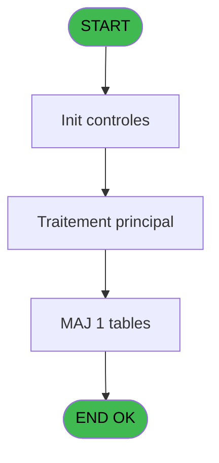

# REF IDE 887 - Gestion Statut Equipement

> **Analyse**: Phases 1-4 2026-02-03 14:55 -> 14:55 (13s) | Assemblage 14:55
> **Pipeline**: V7.2 Enrichi
> **Structure**: 4 onglets (Resume | Ecrans | Donnees | Connexions)

<!-- TAB:Resume -->

## 1. FICHE D'IDENTITE

| Attribut | Valeur |
|----------|--------|
| Projet | REF |
| IDE Position | 887 |
| Nom Programme | Gestion Statut Equipement |
| Fichier source | `Prg_887.xml` |
| Dossier IDE | General |
| Taches | 6 (0 ecrans visibles) |
| Tables modifiees | 1 |
| Programmes appeles | 0 |
| :warning: Statut | **ORPHELIN_POTENTIEL** |

## 2. DESCRIPTION FONCTIONNELLE

**Gestion Statut Equipement** assure la gestion complete de ce processus.

Le flux de traitement s'organise en **2 blocs fonctionnels** :

- **Traitement** (5 taches) : traitements metier divers
- **Calcul** (1 tache) : calculs de montants, stocks ou compteurs

**Donnees modifiees** : 1 tables en ecriture (pv_equipment).

Detail : phases du traitement

#### Phase 1 : Calcul (1 tache)

- **887** - Equipement Status Calculation **[[ECRAN]](#ecran-t1)**

#### Phase 2 : Traitement (5 taches)

- **887.1** - Liste des equipements à modifi **[[ECRAN]](#ecran-t2)**
- **887.1.1** - Recup date_In et date_out **[[ECRAN]](#ecran-t3)**
- **887.1.2** - Maj statut Equipement
- **887.1.3** - Lecture Equipements sans Renta **[[ECRAN]](#ecran-t5)**
- **887.1.3.1** - Update Equipements sans Rental **[[ECRAN]](#ecran-t6)**

#### Tables impactees

| Table | Operations | Role metier |
|-------|-----------|-------------|
| pv_equipment | **W** (2 usages) |  |

## 3. BLOCS FONCTIONNELS

### 3.1 Calcul (1 tache)

Calculs metier : montants, stocks, compteurs.

---

#### 887 - Equipement Status Calculation [[ECRAN]](#ecran-t1)

**Role** : Calcul : Equipement Status Calculation.
**Ecran** : 313 x 175 DLU | [Voir mockup](#ecran-t1)
**Variables liees** : F (status Loc), K (V_Ligne d'equipement modif CSV), R (v_new_status_equipe)

### 3.2 Traitement (5 taches)

Traitements internes.

---

#### 887.1 - Liste des equipements à modifi [[ECRAN]](#ecran-t2)

**Role** : Traitement : Liste des equipements à modifi.
**Ecran** : 954 x 251 DLU | [Voir mockup](#ecran-t2)

---

#### 887.1.1 - Recup date_In et date_out [[ECRAN]](#ecran-t3)

**Role** : Consultation/chargement : Recup date_In et date_out.
**Ecran** : 701 x 0 DLU | [Voir mockup](#ecran-t3)
**Variables liees** : H (date_in), I (date_out), P (V_date_in), Q (V_date_out)

---

#### 887.1.2 - Maj statut Equipement

**Role** : Traitement : Maj statut Equipement.
**Variables liees** : K (V_Ligne d'equipement modif CSV)

---

#### 887.1.3 - Lecture Equipements sans Renta [[ECRAN]](#ecran-t5)

**Role** : Traitement : Lecture Equipements sans Renta.
**Ecran** : 527 x 195 DLU | [Voir mockup](#ecran-t5)

---

#### 887.1.3.1 - Update Equipements sans Rental [[ECRAN]](#ecran-t6)

**Role** : Traitement : Update Equipements sans Rental.
**Ecran** : 527 x 195 DLU | [Voir mockup](#ecran-t6)

## 5. REGLES METIER

*(Aucune regle metier identifiee)*

## 6. CONTEXTE

- **Appele par**: (aucun)
- **Appelle**: 0 programmes | **Tables**: 1 (W:1 R:0 L:0) | **Taches**: 6 | **Expressions**: 7

<!-- TAB:Ecrans -->

## 8. ECRANS

*(Programme sans ecran visible)*

## 9. NAVIGATION

### 9.3 Structure hierarchique (6 taches)

| Position | Tache | Type | Dimensions | Bloc |
|----------|-------|------|------------|------|
| **887.1** | [**Equipement Status Calculation** (887)](#t1) [mockup](#ecran-t1) | - | 313x175 | Calcul |
| **887.2** | [**Liste des equipements à modifi** (887.1)](#t2) [mockup](#ecran-t2) | - | 954x251 | Traitement |
| 887.2.1 | [Recup date_In et date_out (887.1.1)](#t3) [mockup](#ecran-t3) | - | 701x0 | |
| 887.2.2 | [Maj statut Equipement (887.1.2)](#t4) | - | - | |
| 887.2.3 | [Lecture Equipements sans Renta (887.1.3)](#t5) [mockup](#ecran-t5) | - | 527x195 | |
| 887.2.4 | [Update Equipements sans Rental (887.1.3.1)](#t6) [mockup](#ecran-t6) | - | 527x195 | |

### 9.4 Algorigramme

> **Legende**: Vert = START/END OK | Rouge = END KO | Bleu = Decisions
> *Algorigramme auto-genere. Utiliser `/algorigramme` pour une synthese metier detaillee.*

<!-- TAB:Donnees -->

## 10. TABLES

### Tables utilisees (1)

| ID | Nom | Description | Type | R | W | L | Usages |
|----|-----|-------------|------|---|---|---|--------|
| 385 | pv_equipment |  | DB |   | **W** |   | 2 |

### Colonnes par table (1 / 1 tables avec colonnes identifiees)

Table 385 - pv_equipment (**W**) - 2 usages

| Lettre | Variable | Acces | Type |
|--------|----------|-------|------|
| A | equipment_id | W | Unicode |
| L | V.equipment_id.PDF | W | Unicode |

## 11. VARIABLES

### 11.1 Variables de session (6)

Variables persistantes pendant toute la session.

| Lettre | Nom | Type | Usage dans |
|--------|-----|------|-----------|
| D | V.Entête éditée | Logical | - |
| E | V.Nom fichier | Alpha | - |
| L | V.equipment_id.PDF | Unicode | - |
| M | V.description_id.PDF | Unicode | - |
| N | V.manufacturer_name_id.PDF | Unicode | - |
| O | V.model_name_id.PDF | Unicode | - |

### 11.2 Autres (12)

Variables diverses.

| Lettre | Nom | Type | Usage dans |
|--------|-----|------|-----------|
| A | V_format recapitulatif | Unicode | - |
| B | V_Entête_CSV | Unicode | - |
| C | V_Club_Excel_separator | Unicode | - |
| F | status Loc | Unicode | - |
| G | date_creation | Alpha | - |
| H | date_in | Alpha | - |
| I | date_out | Alpha | - |
| J | Service | Unicode | - |
| K | V_Ligne d'equipement modif CSV | Unicode | - |
| P | V_date_in | Alpha | - |
| Q | V_date_out | Alpha | - |
| R | v_new_status_equipe | Unicode | - |

Toutes les 18 variables (liste complete)

| Cat | Lettre | Nom Variable | Type |
|-----|--------|--------------|------|
| V. | **D** | V.Entête éditée | Logical |
| V. | **E** | V.Nom fichier | Alpha |
| V. | **L** | V.equipment_id.PDF | Unicode |
| V. | **M** | V.description_id.PDF | Unicode |
| V. | **N** | V.manufacturer_name_id.PDF | Unicode |
| V. | **O** | V.model_name_id.PDF | Unicode |
| Autre | **A** | V_format recapitulatif | Unicode |
| Autre | **B** | V_Entête_CSV | Unicode |
| Autre | **C** | V_Club_Excel_separator | Unicode |
| Autre | **F** | status Loc | Unicode |
| Autre | **G** | date_creation | Alpha |
| Autre | **H** | date_in | Alpha |
| Autre | **I** | date_out | Alpha |
| Autre | **J** | Service | Unicode |
| Autre | **K** | V_Ligne d'equipement modif CSV | Unicode |
| Autre | **P** | V_date_in | Alpha |
| Autre | **Q** | V_date_out | Alpha |
| Autre | **R** | v_new_status_equipe | Unicode |

## 12. EXPRESSIONS

**7 / 7 expressions decodees (100%)**

### 12.1 Repartition par type

| Type | Expressions | Regles |
|------|-------------|--------|
| CONSTANTE | 1 | 0 |
| FORMAT | 1 | 0 |
| OTHER | 3 | 0 |
| CAST_LOGIQUE | 2 | 0 |

### 12.2 Expressions cles par type

#### CONSTANTE (1 expressions)

| Type | IDE | Expression | Regle |
|------|-----|------------|-------|
| CONSTANTE | 1 | `'PDF'` | - |

#### FORMAT (1 expressions)

| Type | IDE | Expression | Regle |
|------|-----|------------|-------|
| FORMAT | 7 | `Translate('%club_exportdata%')&DStr(Date(),'YYYYMMDD')&'_'&TStr(Time(),'HHMMSS')&'_'&'Gestion_Statut_Equipement'` | - |

#### OTHER (3 expressions)

| Type | IDE | Expression | Regle |
|------|-----|------------|-------|
| OTHER | 4 | `SetCrsr(1)` | - |
| OTHER | 3 | `SetCrsr(2)` | - |
| OTHER | 2 | `Translate ('%club_excel_separator%')` | - |

#### CAST_LOGIQUE (2 expressions)

| Type | IDE | Expression | Regle |
|------|-----|------------|-------|
| CAST_LOGIQUE | 6 | `'FALSE'LOG` | - |
| CAST_LOGIQUE | 5 | `INIPut ('[MAGIC_ENV]IOTiming = O','TRUE'LOG)` | - |

<!-- TAB:Connexions -->

## 13. GRAPHE D'APPELS

### 13.1 Chaine depuis Main (Callers)

**Chemin**: (pas de callers directs)

### 13.2 Callers

| IDE | Nom Programme | Nb Appels |
|-----|---------------|-----------|
| - | (aucun) | - |

### 13.3 Callees (programmes appeles)

### 13.4 Detail Callees avec contexte

| IDE | Nom Programme | Appels | Contexte |
|-----|---------------|--------|----------|
| - | (aucun) | - | - |

## 14. RECOMMANDATIONS MIGRATION

### 14.1 Profil du programme

| Metrique | Valeur | Impact migration |
|----------|--------|-----------------|
| Lignes de logique | 120 | Programme compact |
| Expressions | 7 | Peu de logique |
| Tables WRITE | 1 | Impact faible |
| Sous-programmes | 0 | Peu de dependances |
| Ecrans visibles | 0 | Ecran unique ou traitement batch |
| Code desactive | 0% (0 / 120) | Code sain |
| Regles metier | 0 | Pas de regle identifiee |

### 14.2 Plan de migration par bloc

#### Calcul (1 tache: 1 ecran, 0 traitement)

- **Strategie** : Services de calcul purs (Domain Services).
- Migrer la logique de calcul (stock, compteurs, montants)

#### Traitement (5 taches: 4 ecrans, 1 traitement)

- **Strategie** : Orchestrateur avec 4 ecrans (Razor/React) et 1 traitements backend (services).
- Les ecrans deviennent des composants UI, les traitements invisibles deviennent des services injectables.
- Decomposer les taches en services unitaires testables.

### 14.3 Dependances critiques

| Dependance | Type | Appels | Impact |
|------------|------|--------|--------|
| pv_equipment | Table WRITE (Database) | 2x | Schema + repository |

---
*Spec DETAILED generee par Pipeline V7.2 - 2026-02-03 14:55*
